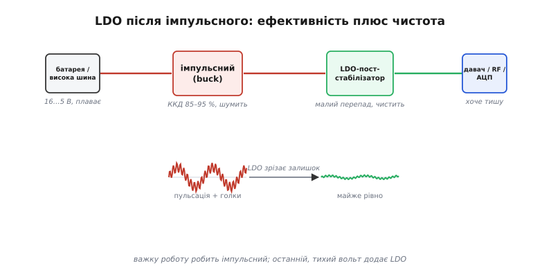
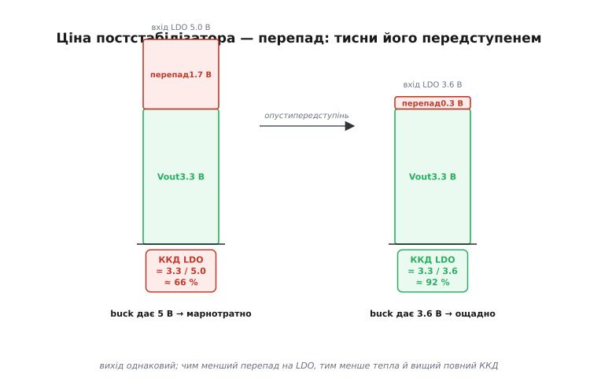

# LDO-постстабілізатор: тихий вольт після імпульсного

<preknowlist>
- [LDO зсередини](topic:hw-power/ldo-internals) — прохідний транзистор як керований клапан і петля наглядача (підсилювача похибки), що весь час звіряє вихід з еталоном і тримає його рівним; уся стаття спирається на те, що ця петля гасить будь-яке відхилення виходу.
</preknowlist>

Коли ми порівнювали [лінійний та імпульсний перетворювачі](root:embedded/linear-vs-switching), вийшов ніби готовий вирок: для глибокого перепаду напруг і помітного струму бери імпульсний (ККД 85–95 %), а лінійний лиши хіба для маленьких чистих шин. Та й [струмом спокою](root:embedded/board-consumption) дешевий LDO у сні здатний з'їдати більше, ніж увесь сплячий пристрій. Складається враження, що лінійний стабілізатор — це або тиха дрібничка, або просто гірший вибір.

Але є одна схема, де лінійний і імпульсний працюють **не як суперники, а в парі**, і кожен робить те, що вміє найкраще. Імпульсний бере на себе важку роботу — ефективно зрізає високу напругу батареї до приблизно потрібної. А одразу за ним стоїть лінійний стабілізатор із **крихітним** перепадом — і його завдання вже не знижувати напругу, а **чистити** її: прибирати пульсацію та шум, що лишив по собі імпульсний. Такий лінійний на хвості імпульсного називають **постстабілізатором** (англ. *post-regulator* — «той, що стабілізує після»). Це найпоширеніший спосіб дати чутливому вузлу — радіо, АЦП, опорному джерелу, малошумному генератору — справді тиху напругу, не платячи за неї всім ККД.

Ця стаття — саме про ту пару. Чому одного імпульсного мало для чутливого вузла, як лінійний зрізає те, що той лишив, чому ця здатність **падає з частотою**, і як поставити постстабілізатор так, щоб він майже не з'їдав ефективності. Внутрішню механіку самого лінійного стабілізатора — петлю наглядача, прохідний транзистор, dropout — ми вже розбирали й тут припускаємо відомою; нагадати її можна попапом [LDO зсередини](topic:hw-power/ldo-internals). Тут нас цікавить не що в чипі, а **навіщо ставити другий стабілізатор після першого**.

## Чому імпульсного самого мало

Згадаймо, чим імпульсний перетворювач платить за свою ефективність. Він не гасить різницю напруг, а **переносить** енергію пакетами: швидко вмикає й вимикає ключ на частоті десь 0.5–3 МГц, накачує струм у котушку й розряджає її в конденсатор. Жоден елемент не гріється сильно — звідси й високий ККД. Але та сама різка комутація, що дає економію, **лишає по собі брудний слід**.

У цьому брудному сліді дві частини, і їх варто розрізняти. По-перше, **пульсація** (англ. *ripple*) — періодичні коливання виходу на частоті перемикання, десятки мілівольтів розмаху: вихідний конденсатор згладжує перекидання енергії, але не до нуля. По-друге, **комутаційні голки** (англ. *switching spikes*) — короткі різкі викиди в моменти, коли ключ клацає, з частотним вмістом аж до десятків і сотень мегагерц. Перше — повільне й велике, друге — швидке й гостре.

Для цифрового мікроконтролера це здебільшого байдуже: йому потрібен лише рівний середній рівень, а десяток мілівольтів брижів він не помітить. Та є вузли, для яких ці брижі — пряма похибка:

- **Аналого-цифровий перетворювач.** Якщо його опорна напруга чи живлення гуляють на десяток мілівольтів, кожен відлік уноситиме цю гру у вимір. Для 12-бітного АЦП на 3.3 В один молодший розряд — це лише 0.8 мВ; пульсація живлення в 20 мВ — це вже **25 розрядів** шуму, і точність перетворювача гине, хоч би яким він був добрим сам по собі.
- **Радіоприймач і малошумний підсилювач.** Пульсація на їхньому живленні підмішується у тракт як завада, а частота перемикання та її гармоніки лягають прямо в смугу прийому, псуючи чутливість. Котушка імпульсного перетворювача поряд із антеною — часте джерело прихованих завад.
- **Опорне джерело й малошумний генератор.** Тут будь-яке тремтіння живлення стає тремтінням опори чи фази — а саме сталість тут і потрібна.

Можна, звісно, тиснути брижі самим імпульсним: побільшати вихідні конденсатори, додати [LC-ланку фільтра](root:embedded/power-supply-filtering), узяти перетворювач із вищою частотою. Усе це працює до певної межі, а далі впирається в незручну фізику: комутаційні голки мають дуже широкий спектр, конденсатори вище за свою [резонансну частоту перестають бути конденсаторами](root:embedded/power-supply-filtering), а LC-фільтр додає котушку й може сам дзвеніти на резонансі. Дотиснути пульсацію перетворювача з 20 мВ до сотень мікровольтів самими пасивними деталями — дорого й громіздко.

І ось тут стає в пригоді інший інструмент, у якого зовсім інша природа боротьби із завадою. Лінійний стабілізатор не **відводить** шум убік і не **перекриває** йому дорогу пасивно — він **активно гасить** його своєю петлею зворотного зв'язку. Подивимось, як саме.

## Як лінійний стабілізатор чистить шум

Згадаймо суть лінійного стабілізатора: усередині сидить прохідний транзистор як керований клапан, а наглядач — підсилювач похибки — весь час звіряє вихід із внутрішнім еталоном і підкручує клапан, щоб тримати вихід рівним. Ми вивели це, коли розбирали [LDO зсередини](topic:hw-power/ldo-internals): петля гасить **будь-яке** відхилення виходу від заданого, бо їй байдуже, **чому** воно сталося.

А тепер головне спостереження. Пульсація на **вході** лінійного стабілізатора — це теж відхилення, яке намагається протиснутися на вихід крізь прохідний транзистор. Наглядач його **бачить** і протидіє: коли вхід шарпнувся вгору й потягнув вихід за собою, петля трохи прикриває клапан рівно настільки, щоб вихід лишився на місці. Виходить, що лінійний стабілізатор активно **віднімає** вхідну пульсацію зі свого виходу — не пасивно її приглушує, а компенсує роботою петлі. Те, що для імпульсного є непереборним залишком, для лінійного — звичайне відхилення, яке його наглядач гасить так само, як гасив би просадку від навантаження.

> 🔧 **Навіщо це.** Ось чому пара «імпульсний + лінійний» сильніша за будь-який із них окремо. Імпульсний дає ефективність, але лишає брижі; лінійний майже не дає ефективності на великому перепаді, зате **активно стирає** брижі своєю петлею. Постав їх каскадом — і дістанеш і високий ККД, і тиху шину. Саме тому на серйозній платі біля радіомодуля чи АЦП часто бачиш маленький LDO, живлений не від батареї, а від виходу імпульсного: він тут не «знижує напругу», а працює фільтром.

Цю здатність давити вхідну пульсацію називають окремим словом — **PSRR** (англ. *power supply rejection ratio* — коефіцієнт придушення завад живлення). Це просто **у скільки разів** менша пульсація виходу за пульсацію входу, виражена в децибелах. Сама величина та її частотна поведінка настільки важливі для постстабілізатора, що варто розуміти її окремо: [PSRR — придушення пульсацій живлення](topic:hw-power/psrr) — це міра того, наскільки добре стабілізатор «не пускає» вхідний шум на вихід, і вона **сильно залежить від частоти**. Запис простий:

```
PSRR(дБ) = 20 · lg( пульсація_входу / пульсація_виходу )

  60 дБ  →  у 1000 разів менше   (20 мВ входу → 20 мкВ виходу)
  40 дБ  →  у 100 разів менше    (20 мВ → 200 мкВ)
  20 дБ  →  у 10 разів менше     (20 мВ → 2 мВ)
```

Чим більше децибелів — тим чистіший вихід. Але є вирішальна тонкість, повз яку проходять найчастіше: **PSRR не одне число, а крива від частоти**. І саме форма цієї кривої вирішує, чи спрацює постстабілізатор там, де ви його ставите.


*Поділ праці у двоступеневому живленні. Імпульсний (buck) робить важку роботу — ефективно зрізає високу плавну напругу батареї до приблизно потрібної, але лишає на виході пульсацію й комутаційні голки. LDO-постстабілізатор стоїть одразу за ним із крихітним перепадом: знижувати йому майже нíчого, його робота — активно стерти залишковий шум петлею зворотного зв'язку. На виході — тиха шина для вузлів, що хочуть чистоту.*

## PSRR падає з частотою — і це вирішує все

Чому здатність гасити шум залежить від частоти? Бо вона тримається на **петлі зворотного зв'язку**, а будь-яка петля встигає реагувати лише до певної швидкості. На постійному струмі та низьких частотах наглядач має повний свій коефіцієнт підсилення: він помічає найменше відхилення й давить його з усієї сили — тут PSRR високий, 60–80 дБ. Але з частотою підсилення петлі **спадає** (так влаштований будь-який реальний підсилювач — його швидкодія обмежена), а отже, слабшає й її здатність гасити вхідну пульсацію. Що вища частота брижів, то менше встигає наглядач, і PSRR **падає** — типово на 20 дБ за кожну декаду частоти.

А на самих високих частотах PSRR упирається ще в одну стіну. Навіть якби петля була нескінченно швидка, вихід ніколи не буває чистішим за **власний шум** самого стабілізатора — теплове тремтіння його внутрішнього еталона й підсилювача. Тому крива PSRR не падає до нуля плавно, а виположується на якомусь дні — нижче за нього вихід уже не очистити, скільки б не давила петля.


*Чому форма кривої PSRR вирішує все. На низьких частотах петля встигає й душить вхідну пульсацію в тисячі разів (70+ дБ). З частотою підсилення петлі спадає — PSRR падає приблизно на 20 дБ за декаду. На високих частотах він упирається у власний шум стабілізатора й далі не падає. Біда в тому, що пульсація імпульсного перетворювача (підсвічена смуга, 0.5–3 МГц) лежить саме там, де PSRR уже невеликий: на ≈1 МГц звичайний LDO зрізає лише десяток-другий децибелів, а не свої «паспортні» 70.*

Ось де ховається найпоширеніша помилка. У даташиті бачать гарну цифру «PSRR = 70 дБ» і думають: «чудово, цей LDO зріже пульсацію перетворювача в три тисячі разів». А насправді ті 70 дБ — це **на 100 Гц чи 1 кГц**, де давити нíчого. Пульсація ж імпульсного перетворювача лежить на **частоті його перемикання** — 0.5–3 МГц, — і саме там у звичайного LDO PSRR уже не 70, а добре якщо 20–30 дБ. Тобто реально він зріже пульсацію не в тисячі, а в десяток разів. Тому для постстабілізатора дивляться не на пікове число PSRR, а на його значення **на частоті перемикання передступеня** — і беруть або спеціальний high-PSRR LDO, чия крива тримається високою аж до мегагерців, або ставлять перетворювач так, щоб його частота лягла туди, де LDO ще сильний.

> 🔧 **Навіщо це.** Коли добираєш LDO у постстабілізатори, перший рядок у даташиті — не «PSRR (макс)», а **графік PSRR від частоти**. Знайди на ньому частоту перемикання свого імпульсного й прочитай придушення саме там. Якщо виробник дає лише одне число без частоти — це майже завжди низькочастотний максимум, маркетинговий, і на мегагерцах реальність буде гіршою в рази. Як саме порахувати, скільки пульсації лишиться на виході й чи це влізе в бюджет вузла, розбираємо в окремій вставці [бюджет пульсації та шуму постстабілізатора](root:embedded/ldo-post-regulator/math-psrr-budget.md): там PSRR(f) перетворюється на конкретні мікровольти, складається з придушенням передступеня й порівнюється з потребою АЦП чи радіо.

**Прикинемо, скільки пульсації лишиться після постстабілізатора.** Імпульсний дає на виході 20 мВ пульсації на частоті 1 МГц. За нею стоїть звичайний LDO, у якого на 1 МГц PSRR ≈ 24 дБ:

```
PSRR 24 дБ → коефіцієнт = 10^(24/20) = 10^1.2 ≈ 16

пульсація на виході LDO = 20 мВ / 16 ≈ 1.25 мВ
```

Один мілівольт із гаком — для цифри байдуже, а от для 12-бітного АЦП це ще понад розряд шуму. Якщо потрібно менше, цей самий LDO не врятує: треба або high-PSRR LDO з придушенням, скажімо, 50 дБ на 1 МГц (тоді 20 мВ / 316 ≈ 63 мкВ — уже добре), або спершу пригасити пульсацію перетворювача пасивним LC-фільтром, а тоді добити її лінійним. Числа одразу показують, де межа: помножиш слабкий PSRR на велику вхідну пульсацію — і «тиха» шина виявиться не такою вже тихою.

## Ціна постстабілізатора — це перепад напруги

За чистоту платять, і плата проста: лінійний стабілізатор **спалює свій перепад напруги в тепло**. Ми це вже знаємо з [порівняння лінійного й імпульсного](root:embedded/linear-vs-switching): на прохідному транзисторі падає (Vвх − Vвих), і вся ця напруга, помножена на струм, іде теплом, а ККД лінійного дорівнює Vвих/Vвх. У постстабілізаторі цей самий закон нікуди не дівається — отже, кожен зайвий вольт перепаду це і втрачена ефективність, і нагрів.

Але тут і ховається вся хитрість двоступеневої схеми. Перепад на постстабілізаторі **задаємо ми самі** — тим, на яку напругу налаштуємо передступінь (імпульсний). Якщо змусити buck давати 5 В, а LDO опускати їх до 3.3 В, то на LDO падає 1.7 В, і він спалює третину потужності. А якщо налаштувати buck лише трохи вище за ціль — скажімо, на 3.6 В, — то на LDO лишається тільки 0.3 В перепаду, він майже не гріється, а ефективність ступеня підскакує. Вихід при цьому однаковий, чистота теж — змінюється лише те, скільки LDO марнує.


*Перепад на постстабілізаторі — це його ціна, і нею керує передступінь. Зелене — корисний вихід 3.3 В, однаковий в обох випадках; червоне — перепад, що горить теплом на прохідному транзисторі. Зліва передступінь дає аж 5 В: на LDO падає 1.7 В, ККД ступеня лише ≈66 %. Справа той самий вихід, але передступінь опущено до 3.6 В: перепад усього 0.3 В, ККД ≈92 %. Тому передступінь налаштовують лише трохи вище за ціль — рівно настільки, щоб LDO лишався в межах свого dropout.*

Звідси й роль **dropout** (напруги падіння) — мінімального перепаду, нижче за який лінійний уже не тримає вихід. Ми розбирали dropout як рису класу: у звичайного AMS1117-чипа він аж ~1.1 В, у справжнього малодропаутного — сотні чи десятки мілівольтів. У постстабілізаторі dropout стає прямою межею ощадності: він каже, **наскільки близько** до виходу можна опустити передступінь. Що менший dropout LDO, то нижче можна тиснути buck і то менше перепаду згорить. Тому в постстабілізатори беруть саме справжні LDO з малим dropout — не заради живлення від розрядженої батареї (як у прямій схемі), а заради того, щоб перепад, а з ним і втрати, були якомога меншими.

**Порахуймо повний ККД двоступеневої схеми.** Buck знижує 7.4 В (2S Li-ion) до 3.6 В з ККД 90 %, а постстабілізатор-LDO опускає 3.6 В до 3.3 В:

```
ККД передступеня (buck):   η_buck = 0.90               (паспортний)
ККД постстабілізатора:     η_ldo  = Vвих / Vвх_ldo
                                  = 3.3 / 3.6  ≈  0.917

повний ККД каскаду:        η = η_buck · η_ldo
                             = 0.90 · 0.917  ≈  0.825  →  82.5 %
```

Вісімдесят два відсотки — і це за чистого, тихого виходу. А якби ту саму чистоту робили **одним лише лінійним** прямо від 7.4 В батареї, ККД був би 3.3 / 7.4 ≈ 45 %: майже половина заряду в тепло. Двоступенева схема дає тишу лінійного майже за ціною ефективності імпульсного — у цьому вся її суть. А якби, навпаки, поставили LDO зі входом 5 В замість 3.6, повний ККД упав би до 0.90 · (3.3/5.0) ≈ 59 %: ті самі деталі, та сама чистота, але через недбало високий передступінь зникає чверть ефективності.

> 🔧 **Навіщо це.** Проєктуючи тиху шину, тримай два числа поряд: **dropout** обраного LDO і **точність** передступеня. Налаштуй buck так, щоб його вихід стояв вище за ціль рівно на dropout плюс невеликий запас на просадки й розкид (зазвичай ще 100–200 мВ). Тоді LDO завжди лишається в робочому режимі, але палить мінімум. Поширена недбалість — узяти готовий модуль buck на 5 В і повісити на нього LDO на 3.3 В «бо так склалося»: схема працюватиме, але даремно спалюватиме 1.7 В перепаду й гріти плату там, де вистачило б 0.3 В.

## Як це ставлять на платі

Зведімо в практику те, на що спирається вся пара. Постстабілізатор живлять **не від батареї, а від виходу імпульсного** — він стоїть другим ступенем, не першим. Перед ним і за ним — свої конденсатори (вхідний гасить кидки струму, вихідний тримає [стійкість петлі](topic:hw-power/ldo-internals), і нехтувати ним не можна). Часто між buck і LDO ще додають [LC-ланку чи феритову намистину](root:embedded/power-supply-filtering): вона пасивно зрізає високочастотні голки перетворювача, з якими PSRR лінійного й так упорався б погано, а вже решту — повільнішу пульсацію — добиває LDO своєю петлею. Виходить поділ і за частотою: пасивний фільтр бере високі частоти, активний лінійний — низькі й середні, де його PSRR ще великий.

Важлива й **топологія землі**. Тиху шину роблять заради чутливого вузла, тож і землю його ведуть окремо — «аналогову» землю, що сходиться з рештою в одній точці, щоб струми гучної цифрової частини не текли крізь землю давача. Постстабілізатор тут — природна межа між «гучним» і «тихим» островами плати.

З боку прошивки постстабілізатор зазвичай не потребує нічого — він просто стоїть і чистить. Але якщо LDO має вивід **enable** (а малоспоживні LDO його часто мають), його тримають під рукою мікроконтролера: чутливий вузол вмикають **лише коли він потрібен**, а решту часу вимикають разом із його тихою шиною, заощаджуючи струм спокою. Тут важить [струм спокою самого постстабілізатора](root:embedded/board-consumption): він теж має свій I_Q, і для пристрою, що довго спить, його варто або вимикати по enable, або брати малоспоживним.

```c
// Тиха аналогова шина (давач/АЦП) живиться через LDO-постстабілізатор
// з виводом enable. Вмикаємо її лише на час вимірювання — і даємо їй
// заспокоїтися, перш ніж читати: щойно ввімкнений LDO ще «дзвенить»,
// поки його петля й вихідний конденсатор не вийдуть на режим.
static uint16_t read_quiet_channel(void) {
    gpio_set_level(LDO_ANALOG_EN, 1);   // підняли тиху шину
    delay_us(500);                       // пауза: LDO + конденсатор виходять на режим
    uint16_t raw = adc_read(CH_SENSOR);  // тепер живлення вже чисте — читаємо
    gpio_set_level(LDO_ANALOG_EN, 0);    // вимкнули, щоб не палити I_Q у паузі
    return raw;
}
```

Ця маленька пауза після enable — не забобон. Поки вихідний конденсатор заряджається, а петля наглядача виходить на режим, на тихій шині ще є перехідний процес; читати АЦП у цей момент — значить ловити саме той сплеск, від якого ми й рятувалися. Затримка в частку мілісекунди дає шині заспокоїтися — і лише тоді її чистота справді працює на точність виміру.

> 🔧 **Навіщо це.** Якщо вмикаєш живлення давача програмно перед кожним виміром заради економії — **завжди** став паузу між enable і першим відліком. Без неї перші відліки несуть перехідний шум увімкнення, і калібрування «попливе» незрозуміло чому. Тривалість паузи прикидають за вихідним конденсатором і струмом LDO, а на практиці беруть із запасом — кількасот мікросекунд зазвичай досить.

## Коли постстабілізатор не потрібен — і коли шкідливий

Двоступенева схема не безкоштовна: це зайвий чип, зайве місце, зайвий перепад і зайвий струм спокою. Тому її ставлять **лише там, де чистота справді потрібна**, — для аналогових і радіовузлів. Живити нею цифровий мікроконтролер, якому байдуже до десятка мілівольтів брижів, — марно палити перепад і ускладнювати плату. Тут діє те саме правило, що й завжди: вибір під **профіль і потребу** конкретного вузла, а не «хай буде чистіше про всяк випадок».

Є й випадок, коли постстабілізатор активно **шкодить**. Якщо передступінь налаштований надто близько до виходу — нижче за dropout LDO під повним струмом, — лінійний випадає з режиму й перестає чистити: він просто проводить вхід на вихід разом з усією його пульсацією, бо петлі вже нíчим компенсувати. Тоді вся складність схеми працює вхолосту, а інженер дивується, чому «тиха» шина шумить не менше за буферну. Тому запас над dropout — не примха, а умова того, що постстабілізатор узагалі виконує свою роботу.

## Коротка історія: лінійний стабілізатор в одному корпусі

Лінійні стабілізатори в одному корпусі мають конкретного батька. Перші масові операційні підсилювачі (μA702, μA709) американський інженер Боб Відлар (англ. Bob Widlar) із незмінним напарником-технологом Девідом Толбертом (David Talbert) зробили ще у Fairchild Semiconductor; а коли Відлар у середині 1960-х перейшов у National Semiconductor, там він спроєктував **LM100** — регулятор, який заведено вважати першим монолітним (повністю інтегрованим в одну мікросхему) лінійним стабілізатором, — а згодом і покращений LM105. Саме ця пара зробила обидві фірми лідерами лінійних мікросхем. Відлара часто помилково називають ще й автором популярного фейрчайлдівського μA723 — але це непорозуміння: той чип вийшов 1967 року, вже по Відларовім відході в National, і за схемотехнікою не має характерних для нього рис. Його справжній автор — маловідомий інженер Fairchild Дж. Д. «Даріл» Льє (англ. J. D. «Darryl» Lieux), що звався своїм другим іменем. (Статус: помилкову прив'язку μA723 до Відлара спростовує свідчення сучасника — Дейва Фуллагара (Dave Fullagar), творця операційного підсилювача μA741 і колеги Льє по Fairchild; сама ж прив'язка до Відлара — усталена помилка, що кочує довідниками.) Сама ідея ставити лінійний **після** іншого джерела заради чистоти старша за мікросхеми й окремого винахідника не має — вона природно випливає з того, що петля лінійного гасить вхідну пульсацію.
