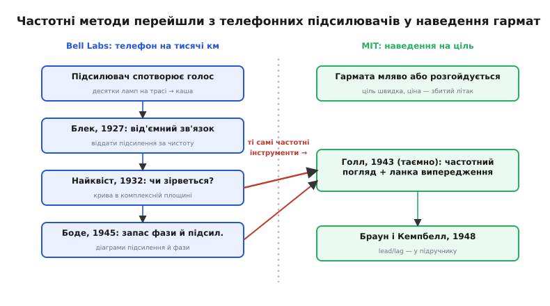
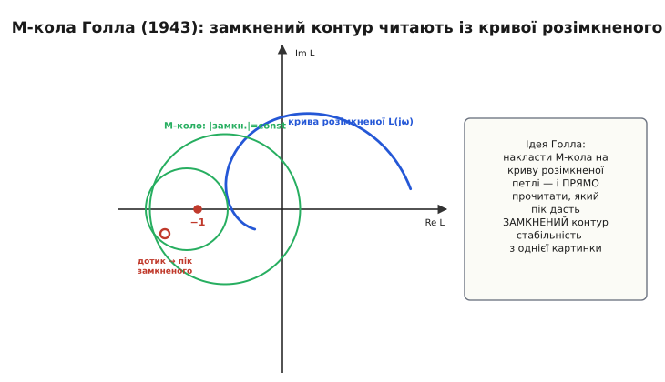

📜 *Історична вставка: як компенсатори народилися з наведення гармат.*

# 📜 Компенсатори народилися з наведення гармат

У головній темі ми сказали коротко: lead/lag прийшли з війни, з наведення зенітних гармат, із Лабораторії сервомеханізмів MIT. Це правда, але правда стиснена до одного речення. А за нею — десятиліття, кілька наукових шкіл і дуже конкретна, дуже відчайдушна інженерна біда, яку не вдавалося розв'язати наявними засобами. Варто пройти цю історію по-справжньому, бо вона пояснює не лише **хто** придумав компенсатори, а й **чому** інженери раптом почали думати про керування мовою фази й підсилення — мовою, якою ми тепер користуємося як чимось самозрозумілим. Виявиться, що ця мова прийшла зовсім не з гармат і не з машин, а з телефонного дроту.

## Біда, з якої все почалося: ціль, що не чекає

Уявімо задачу очима інженера 1940 року. У небі — літак, що йде зі швидкістю кількасот кілометрів за годину. На землі — зенітна гармата і поряд радар, який цей літак бачить. Між ними має стояти машина, що **безперервно** повертає ствол так, щоб снаряд і ціль зустрілися в одній точці неба за кілька секунд. Гармата важка; її повертають потужні мотори; мотори слухаються електричного сигналу від обчислювача наведення.

Ось де народжується контур керування, який ми тепер впізнаємо з першого погляду. **Завдання** — куди має дивитися ствол. **Вихід** — куди він дивиться зараз. **Помилка** — різниця. **Привод** — мотори. Це той самий замкнений контур із [від'ємним зворотним зв'язком](root:embedded/open-vs-closed-loop), що тримав оберти парової машини Уатта, тільки замість обертів тут — кут наведення, а замість ваги ціни помилки — збитий чи незбитий літак.

І тут проступає характер, який ми вже добре знаємо з [запасу стійкості](root:embedded/loop-stability). Зробиш контур **повільним і обережним** — ствол ліниво повзе за ціллю, завжди відстає, снаряди йдуть у порожнечу. Зробиш **швидким і різким** — ствол наздоганяє ціль, але **перестрілює**, відкочується, перестрілює знову; важка гармата на потужних моторах розгойдується, як та сама машина Максвелла, що йшла «вразнос». Інженери знову опинилися перед старою дилемою керування — швидкість проти стійкості, — але цього разу під вогнем, із ціною помилки в людських життях, і з вимогою точності, якої жодна попередня машина не знала.

> 🔧 **Навіщо це.** Та сама дилема живе у вашому контурі дотепер, лише ставки інші. Привод дрона, голівка диска, термостат печі — усюди той самий вибір: млявий і точний-але-запізнілий проти швидкого-але-дзвінкого. Війна просто загнала цю дилему в кут, де «трохи дзвенить» означало «промазав», — і саме безвихідь змусила інженерів знайти інструмент, що дає **і** швидкість, **і** стійкість. Цей інструмент — компенсатор — ви тепер ставите в код, навіть не згадуючи, у якому розпачі його шукали.

## Чому стара математика тут не тягнула

Здавалося б, теорія керування на той час уже існувала. У MIT нею серйозно займався **Гарольд Гейзен** (*Harold Locke Hazen*, американський інженер-електрик): 1934 року він опублікував у «Журналі Інституту Франкліна» дві статті — «Теорія сервомеханізмів» і парну до неї про проєктування — де вперше систематично, рівняннями, описав, як поводиться сервопривод. (Саме слово «сервомеханізм» Гейзен **не вигадав** — воно старіше: ще 1868 року француз Жозеф Фарко назвав *servomoteur* свої гідравлічні приводи стернового керування, від латинського *servus* — «слуга, раб»; машина-слуга, що слухається керма. Гейзен зробив інше — дав цьому слузі **математику**.)

Та підхід Гейзена та його сучасників мав ваду, яка на простих задачах не муляла, а на гарматі стала стіною. Вони рахували **перехідний процес у часі**: складали диференціальне рівняння контуру й розв'язували його, щоб побачити, як вихід доганяє завдання — з перельотом, з дзвоном, за який час заспокоюється. Для однієї простої ланки це ще можливо. Але справжній контур наведення — це мотор, плюс редуктор, плюс інерція ствола, плюс затримка обчислювача, плюс давач — кілька ланок поспіль. Скласти й чесно розв'язати диференціальне рівняння такої системи в часі, та ще й **перепробувати десятки варіантів** виправлення, шукаючи добрий, — праця настільки виснажлива, що в роки без обчислювальних машин вона була практично нездійсненна. Інженер тонув у рівняннях ще до того, як доходив до відповіді на головне питання: **зірветься цей контур чи ні?**

Потрібен був інший погляд — такий, щоб про стійкість і якість контуру можна було судити **не розв'язуючи** його рівняння в часі. І виявилося, що такий погляд уже існував. Тільки народився він в іншій галузі й розв'язував іншу, на перший погляд, задачу.

## Несподіване джерело: телефонний дріт

Перенесімося в Bell Telephone Laboratories 1920–30-х років. Задача там була зовсім не про гармати — про **голос**. Телефонні компанії тягнули зв'язок на тисячі кілометрів, і на довгій трасі стояли десятки підсилювачів-повторювачів. Кожен трохи спотворював сигнал, спотворення накопичувалися, і на тому кінці лінії голос перетворювався на нерозбірливу кашу.

Розв'язок, як ми бачили в [історії зворотного зв'язку](root:embedded/open-vs-closed-loop/hist-feedback.md), знайшов 1927 року **Гарольд Блек** (*Harold S. Black*): від'ємний зворотний зв'язок. Узяти підсилювач із величезним запасом сили й **завернути частину виходу назад на вхід із протилежним знаком** — тоді контур сам помічає й віднімає власні спотворення. Геніально. Але цей трюк породив нову, підступну біду — рівно ту, що знайома нам із керування. Замкнений контур із великим підсиленням **сам себе розгойдував**: на певних частотах від'ємний зв'язок ставав, по суті, додатним, і підсилювач переходив у виття — генерував замість підсилювати. Bell мала тисячі таких контурів на лініях, і кожен загрожував зірватися.

Розв'язати це випало двом інженерам Bell, чиї імена тепер знає кожен, хто вивчав керування, — хоч прийшли вони до керування здалеку.

**Гаррі Найквіст** (*Harry Nyquist*) — інженер шведського походження (народився 1889 року в Нільсбю, що у Вермланді, Швеція; до США емігрував 1907-го, де й змінив написання прізвища з *Nykvist*) — 1932 року опублікував у «Bell System Technical Journal» статтю «Regeneration Theory» («Теорія регенерації»). Вона зробила те, чого так бракувало керуванню: дала спосіб сказати, **зірветься контур чи ні, не розв'язуючи його рівняння в часі**. Найквіст показав, що досить взяти підсилення й фазу петлі на **всіх частотах**, накреслити з них одну криву в комплексній площині — і за тим, як ця крива обходить одну фатальну точку, одразу видно, стійка система чи піде в самозбудження. Уся пекельна праця з розв'язування диференціального рівняння в часі зводилася до погляду на криву. Це і є **критерій Найквіста**, а сама крива — **годограф Найквіста**.

Другий — **Гендрик Боде** (*Hendrik Wade Bode*), теж із Bell Labs. Він пішов далі й зробив метод інженерним: показав, що для стійкості важливі дві прості числові міри — **запас по підсиленню** і **запас по фазі**, ті самі, якими ми тепер міряємо [надійність контуру](root:embedded/loop-stability). Боде розклав поведінку контуру на дві окремі криві — підсилення від частоти й фазу від частоти (тепер їх звуть **діаграмами Боде**) — і дав правила, як за ними бачити, чи не підходить фаза небезпечно близько до фатальних −180° там, де підсилення ще велике. Його класична книжка «Network Analysis and Feedback Amplifier Design» вийшла 1945 року, але самі методи визрівали в Bell усе попереднє десятиліття.

> 🔧 **Навіщо це.** Коли ви дивитеся на діаграму Боде свого контуру й перевіряєте, скільки градусів запасу лишилося на кросовері, — ви користуєтеся інструментом, який народився не в керуванні, а в боротьбі за чистий телефонний голос. Уся [частотна мова стійкості](root:embedded/loop-stability), у якій lead/lag має сенс, — це спадок Найквіста й Боде. Без неї компенсатор лишився б купою «s» без інтуїції; з нею він стає прицільним інструментом «додай фази тут, підніми підсилення там».

Ось у чому головний поворот усієї нашої історії. До війни в Bell **уже існував** готовий, потужний апарат, щоб судити про стійкість контуру за його частотною поведінкою, **не тонучи в перехідних процесах**. Він був заточений під телефонні підсилювачі — але задача підсилювача й задача сервопривода математично **та сама**: замкнений контур із від'ємним зв'язком, що може розгойдатися. Лишалося, щоб хтось це побачив і переніс інструмент із дроту в гармату. І війна підштовхнула це зробити.

*Два світи й місток між ними. Зліва Bell Labs десятиліттями розв'язувала, як не дати телефонному підсилювачу зірватися у виття, — і виробила частотні інструменти Найквіста й Боде. Справа MIT під час війни розв'язувала, як стійко навести гармату. Задача математично та сама — замкнений контур, що може розгойдатися, — тож готовий частотний апарат просто перенесли з одного світу в інший. Компенсатор виник на цьому містку.*

## Лабораторія сервомеханізмів: де зійшлися гармата й метод

Тепер до MIT. Восени 1939 року департамент електротехніки інституту дедалі більше уваги віддавав сервомеханізмам і керуванню вогнем — поштовхом став запит ВМС США на спеціальний курс для офіцерів-артилеристів флоту. З цього 1940 року виросла окрема **Лабораторія сервомеханізмів** (*Servomechanisms Laboratory*), яку очолив молодий викладач **Ґордон Стенлі Браун** (*Gordon Stanley Brown*). Тут варто бути точним щодо особи, бо в популярних переказах Брауна часто записують просто «американцем»: він народився 1907 року в Драммойні, передмісті Сіднея, в **Австралії**, там здобув першу інженерну освіту в Мельбурні й лише потім приїхав у MIT, де захистив докторат 1938 року. Австралієць за походженням, що став одним із батьків теорії автоматичного керування у США, — приклад того, як обережно слід поводитися з ярликами національності.

Лабораторія Брауна взялася за дуже земну роботу: проєктувала системи керування й привода для армійських гарматних установок — зокрема для 37-мм і 40-мм зеніток. Це були не теоретичні вправи, а залізо, що мало повертати важкі стволи швидко й точно. І саме тут інженери раз у раз били чолом об ту саму стіну: контур або відставав, або розгойдувався, а порахувати наперед, як його виправити, старою «часовою» математикою було майже неможливо.

Ключем виявилася людина, яка поєднала два світи — гармату MIT і частотний метод Bell.

## Альберт Голл і його таємна праця 1943 року

**Альберт Голл** (*Albert C. Hall*) прийшов у MIT здалеку: народився 1914 року, перший диплом здобув у Техаському сільськогосподарському коледжі (Texas A&M) 1936-го, тоді переїхав у MIT, де став викладачем електротехніки й 1938 року здобув магістерський ступінь. А 1943 року захистив докторську дисертацію, яка стала однією з підвалин теорії автоматичного керування, — «The Analysis and Synthesis of Linear Servomechanisms» («Аналіз і синтез лінійних сервомеханізмів»).

Що ж зробив Голл? Він зробив рівно той перенос, до якого все йшло: **узяв частотний апарат Найквіста й Боде, заточений під телефонні підсилювачі, і застосував його до проєктування сервомеханізмів**. Замість тонути в перехідному процесі контуру наведення Голл запропонував судити про нього за поведінкою на синусоїдальних сигналах різних частот — тобто за тим самим частотним відгуком, що його Bell використовувала для підсилювачів. Це одним махом перетворювало нездійсненну задачу (розв'язати диференціальне рівняння багатоланкового контуру) на доступну (накреслити частотні криві й подивитися на запаси).

Але Голл не просто переказав чужий метод — він додав свій власний інструмент, без якого перенос був би неповним. Частотний критерій Найквіста казав про **розімкнену** петлю: стійка вона чи ні. А інженера наведення цікавило, як поводитиметься **замкнений** контур — наскільки сильним буде резонансний горб, чи не задзвенить ствол на якійсь частоті. Голл вивів **кола сталого підсилення замкненого контуру** — їх тепер так і звуть **колами Голла** (*Hall circles*, вони ж M-кола й N-кола). Це сімейство кіл, які накладають прямо на годограф Найквіста розімкненої петлі: точка, де крива розімкненого контуру торкається того чи іншого кола, **прямо показує**, який пік дасть замкнений контур. Інженер тепер читав поведінку замкненої системи **з однієї картинки розімкненої** — не перераховуючи нічого.

*Винахід Голла наочно. Синя крива — годограф розімкненої петлі, той самий, що в Найквіста. Зелені кола — внесок Голла: кожне з'єднує точки, де **замкнений** контур має однакове підсилення. Де крива розімкненого контуру торкається кола, там і сидить резонансний пік замкненого — інженер бачить майбутню поведінку системи, не розв'язавши жодного рівняння в часі. Саме ця наочність зробила частотний метод придатним для гарячкового проєктування воєнного часу.*

І, нарешті, найважливіше для нашої теми. Маючи частотну картину контуру, Голл міг **прицільно її виправляти**. Бачиш, що фаза петлі підходить до небезпечних −180° якраз там, де підсилення ще велике, — отже, бракує запасу по фазі. Додай ланку, яка **підніме фазу саме на цій частоті**, — і запас відновиться. Ця ланка і є **компенсатор випередження фази**, наш lead. Голл показав, як свідомо вставити її в контур наведення, щоб приборкати розгойдування **без** втрати швидкодії, — рівно той розмін, який старий «часовий» підхід дати не міг.

Тут варто чітко розставити, що кому належить, бо в популярних переказах усе злипається в «Голл винайшов компенсатор». Це не зовсім так, і точність тут важлива. Сам **частотний критерій стійкості** — Найквістів (1932). **Запаси по фазі й підсиленню та діаграми** — Боде. Ідея **від'ємного зворотного зв'язку** — Блекова (1927). А **ланки випередження й відставання фази** як прийом узагалі старші за всіх — їх у тій чи іншій формі застосовували й раніше, інтуїтивно. Заслуга Голла — інша й цілком конкретна: він **звів усе це в стрункий метод проєктування сервомеханізмів**, додав свій інструмент (кола Голла) для читання замкненого контуру й показав, як систематично, розрахунком, а не навпомацки, ставити компенсувальні ланки заради стійкості наведення. Це менш гучно, ніж «винайшов», але набагато ціннішо: він перетворив набір розрізнених прийомів на **інженерну дисципліну**.

Праця Голла 1943 року була **засекречена** — позначена грифом обмеженого доступу й розповсюджувалася відповідно, бо стосувалася бойових систем наведення. Опублікувати її для всіх змогли лише після війни, коли матеріал розсекретили. Це не дрібниця для нашої історії: частотні методи керування кілька років жили **в секретних звітах** воюючих сторін, недоступні відкритій науці. Те, що сьогодні є першою лекцією будь-якого курсу керування, тоді було військовою таємницею.

> 🔧 **Навіщо це.** Рецепт lead-ланки з головної теми — «порахуй, скільки градусів фази бракує на кросовері, і додай їх горбом саме туди» — це дослівно метод Голла, лише без секретного грифа. Коли ваш контур дзвенить, а підкрутити [ПІД](root:embedded/pid-tuning-cascade) уже нікуди, ви робите рівно те, що інженери MIT робили з гарматним стволом 1943 року: дивитеся на фазу петлі й прицільно її піднімаєте. Метод не застарів за вісімдесят років, бо він про фізику зворотного зв'язку, а не про конкретне залізо.

## Паралельна гілка: Радіаційна лабораторія й діаграма Нікольса

Щоб історія була чесна, треба згадати ще одну лабораторію MIT, яку легко сплутати з лабораторією Брауна, — і яку популярні перекази часто змішують із нею в одне. Поряд працювала **Радіаційна лабораторія** (*Radiation Laboratory*, «Rad Lab»), створена для розробки радарів. Саме вона дала славетний автоматичний радар наведення **SCR-584**, що сам стежив за ціллю; а аналоговий обчислювач наведення до нього — **директор вогню M9** — зробила знов-таки **Bell Labs**, із групою, дотичною до Боде. У парі з радіопідривником снаряда ця зв'язка стала найдієвішою зеніткою союзників.

Важливо не злити ці дві лабораторії: **Лабораторія сервомеханізмів** Брауна займалася самими **приводами й контурами наведення** (як стійко повернути ствол), тоді як **Радіаційна лабораторія** — **радаром** (як побачити й супроводжувати ціль). Різні задачі, різні команди, хоч і той самий інститут і та сама війна.

З боку Rad Lab теж виросла теорія керування — і своя класика. Тамтешні дослідники **Г'юберт Джеймс, Натаніель Нікольс і Ральф Філіпс** (*Hubert M. James, Nathaniel B. Nichols, Ralph S. Phillips*) написали книжку «Theory of Servomechanisms» («Теорія сервомеханізмів»), що вийшла 1947 року як 25-й том знаменитої серії Радіаційної лабораторії. Саме від Нікольса походить **діаграма Нікольса** (*Nichols chart*) — ще один спосіб накласти інформацію про замкнений контур на частотну картину розімкненого, споріднений із колами Голла. Дві гілки MIT — сервомеханічна й радарна — розвивали ту саму частотну теорію керування паралельно, і обидві лишили по класичному інструменту з власним іменем.

## Як таємниця стала підручником: Браун і Кемпбелл, 1948

Війна скінчилася, гриф секретності зняли — і накопичене за роки знання ринуло у відкриту науку. Тут історія робить останній крок: розрізнені секретні методи треба було зібрати, упорядкувати й подати так, щоб їх міг вивчити будь-який інженер, а не лише втаємничений учасник воєнних проєктів.

Це зробив сам **Ґордон Браун** разом зі своїм колегою **Дональдом Кемпбеллом** (*Donald P. Campbell*). 1948 року вийшла їхня книжка «Principles of Servomechanisms» («Основи сервомеханізмів», видавництво Wiley) — одна з перших систематичних, **відкритих** праць, де частотні методи проєктування сервоконтурів подано як зрілу дисципліну. І компенсатори випередження (lead), і компенсатори відставання (lag) уже стоять там як **штатний інженерний інструмент** — не як винахід, не як таємниця, а як те, що інженер просто має знати й уміти розрахувати. За якихось п'ять років lead/lag пройшли шлях від засекреченого прийому наведення гармат до рядка в підручнику.

*Двадцять років від телефону до підручника. Синім позначено внески Bell Labs, що визрівали навколо телефонного підсилювача (Блек, Найквіст, Боде); зеленим — гілку MIT навколо наведення (Гейзен, лабораторія Брауна, Голл, нарешті відкритий підручник Брауна-Кемпбелла). Війна стала тим вузлом, де дві гілки зійшлися: частотний апарат Bell перенесли в задачу наведення MIT, і на цьому стику народився компенсатор як свідомий метод.*

## Що ця історія пояснює насправді

Тепер головна тема читається інакше — не як набір формул, а як спадок дуже конкретної боротьби. Коли ми кажемо, що lead/lag — це «ПІД, поданий мовою фази й підсилення», ми переказуємо саме той зсув погляду, що стався у воєнному MIT: від рахування перехідного процесу в часі (нездійсненного для складного контуру без машин) до читання частотних кривих (доступного й наочного). Цей зсув прийшов не з керування машинами, а з боротьби за чистий телефонний голос у Bell — і був перенесений у наведення зброї під тиском війни.

І три імені, що стоять за нашим компенсатором, стоять кожне за своєю частиною. **Найквіст** дав спосіб судити про стійкість за частотою, не розв'язуючи рівнянь у часі. **Боде** перетворив це на інженерні запаси по фазі й підсиленню. **Голл** переніс цей апарат у сервомеханізми, додав інструмент для читання замкненого контуру й показав, як прицільно ставити компенсувальні ланки заради стійкого наведення, — а **Браун із Кемпбеллом** винесли все це з-під грифа в підручник. Кожен лінк нашого ланцюга — чийсь крок, і жоден не варто приписувати одній людині чи одній нації.

Лишається тиха іронія, варта згадки. Інструмент, що народився, аби точніше **збивати** літаки, виявився універсальним інструментом, аби точно **тримати** будь-що: кут дрона в небі, голівку диска над доріжкою, температуру в печі, оберти мотора. Та сама ланка випередження фази, яку Голл засекречено вписав у контур зенітки 1943 року, сьогодні крутиться у вашому мікроконтролері як кілька рядків [різницевого рівняння](root:embedded/pid-tuning-cascade) — і робить, по суті, те саме: повертає системі і швидкість, і спокій водночас. Війна була акушеркою цієї теорії, але дитя переросло свою колиску й стало мовою, якою тепер думає все точне керування.
