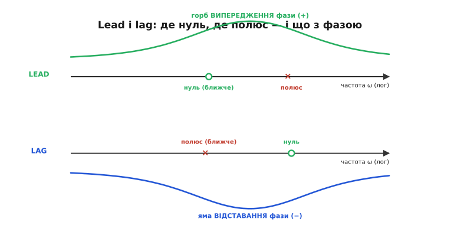
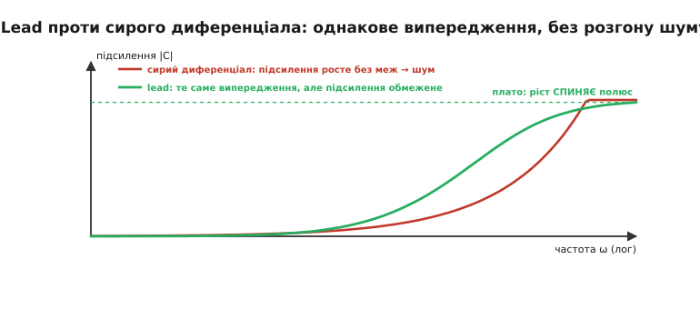
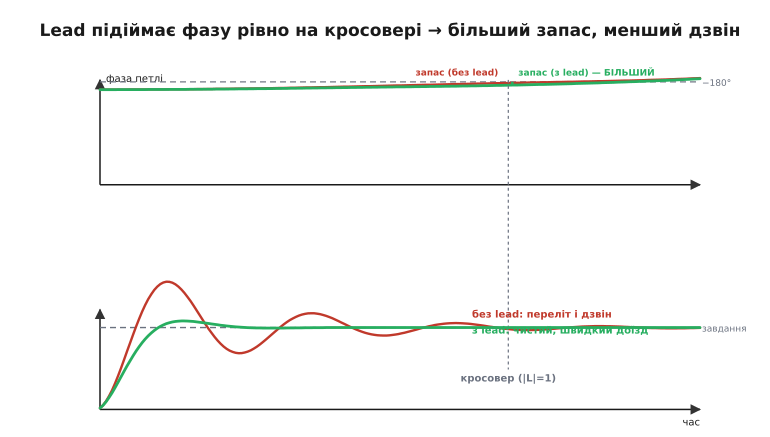
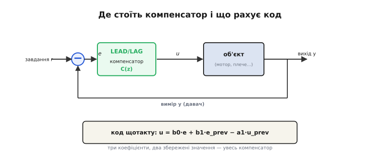

# Lead/lag-компенсатор

Ми вже зібрали повний ПІД і навіть навчилися його [налаштовувати](root:embedded/pid-tuning-cascade). Та в [диференційній складовій](root:embedded/derivative-control) лишилася відкрита рана: вона дає безцінне випередження по фазі — і та сама операція **підсилює шум без меж**. Ми латали це фільтром на D-члені, «похідною від виміру», гіроскопом замість чисельного диференціювання. Кожна латка працює, але всі вони — обхід однієї незручної правди: чистий диференціал — це інструмент, який неможливо ввімкнути на повну, бо разом із користю він розкручує найбруднішу частину сигналу.

А що, якби можна було взяти **рівно стільки** випередження по фазі, скільки треба, **рівно там, де треба** — і не платити за це нескінченним розгоном шуму на верхах? Виявляється, можна. Інструмент називається **компенсатор** (лат. *compensare* — зрівноважувати, відшкодовувати): він не намагається бути «похідною» чи «інтегралом» взагалі, а прицільно **формує фазу й підсилення петлі** саме на тих частотах, де це потрібно. Лід-версія (англ. *lead* — випередження) додає фази там, де бракує запасу; лаг-версія (англ. *lag* — відставання) додає підсилення на низах, не чіпаючи небезпечну зону. Розберімо обидва від першопричини — і побачимо, що це той самий ПІД, тільки поданий мовою, якою інженери думають про стійкість: мовою [запасу по фазі](root:embedded/loop-stability).

## Від «складових помилки» до «формування петлі»

Досі ми будували регулятор знизу: P реагує на помилку зараз, I — на накопичену, D — на швидкість зміни. Це чесний і потужний погляд. Та коли система [почала дзвеніти](root:embedded/loop-stability), ми мимоволі перейшли на інший: перестали думати про «теперішнє-минуле-майбутнє» й почали міряти **запас по фазі на частоті кросовера**. Бо саме він вирішує, зірветься контур чи ні.

Ось ключове спостереження, яке відкриває всю тему. Коли ми додавали D, **навіщо** він заспокоював систему? Не тому, що «дивиться в майбутнє» — це гарна, але побічна картинка. Насправді D **додавав фази випередження** на частоті кросовера й тим відсував фазу далі від фатальних −180°. Коли ми боялися збільшувати I, **чому**? Бо інтеграл додає фазового **відставання** й з'їдає запас. Тобто весь баланс ПІД, якщо дивитися згори, — це **гра з фазою петлі**: де додати випередження, де стерпіти відставання заради точності.

Тож зробімо наступний крок свідомо. Замість підбирати три коефіцієнти Kp, Ki, Kd і **сподіватися**, що сумарна фаза вийде доброю, спроєктуймо ланку, яка **прямо** кладе потрібний горб фази в потрібне місце спектра. Це і є компенсатор. Він не нова фізика — це той самий зворотний зв'язок; нова лише **точка зору**: ми проєктуємо не «реакцію на помилку», а **форму кривих підсилення й фази** замкненого контуру.

> 🔧 **Навіщо це.** Коли ви чуєте від інженерів-«силовиків» (розробників [імпульсних перетворювачів](root:embedded/loop-gain-measurement)) слова «компенсатор типу 2», «компенсатор типу 3» — це рівно про це: вони не «налаштовують ПІД», вони **кладуть нулі й полюси** так, щоб крива петлі перетнула одиницю з добрим запасом по фазі. Той самий спосіб мислення стане у пригоді й вам, щойно контур виявиться надто норовливим для ручного підбору ПІД: перейдіть від «складових помилки» до «форми петлі» — і багато безнадійних випадків стають розв'язними.

## Lead: обмежене випередження замість сирого диференціала

Почнімо з лід-компенсатора, бо він — пряма відповідь на ваду D. Згадаймо, чому сирий диференціал такий небезпечний: його підсилення **росте пропорційно частоті** (∝ ω) і ніколи не спиняється. Корисний сигнал (повільна зміна помилки) живе на низьких частотах, шум — на високих, а диференціал підкручує гучність тим більше, чим вища частота. Виходить найгірше: максимум підсилення там, де максимум бруду.

Лід-компенсатор робить хитрий компроміс. Він теж піднімає фазу — дає те саме випередження, що й диференціал, — але **обмежує ріст підсилення**: воно росте лише до певного рівня, а далі виположується на плато. Як це влаштовано в найпростішій формі першого порядку:

```
 C(s) = (1 + a·T·s) / (1 + T·s),   a > 1

   нуль на частоті  ω = 1/(a·T)   — починає піднімати фазу й підсилення
   полюс на частоті ω = 1/T       — спиняє ріст підсилення, фаза вертається
```

Прочитаймо цю формулу інтуїтивно, не лякаючись «s». **Нуль** — це частота, з якої ланка починає поводитися «як диференціал»: піднімати і фазу, і підсилення. **Полюс** — це частота, де ланка каже «досить»: підсилення перестає рости, а фаза, набравши горб, починає повертатися до нуля. Між нулем і полюсом — смуга, де живе **горб випередження по фазі**. Поза цією смугою компенсатор поводиться сумирно: на самих низах — як проста передача (одиниця), на самих верхах — як стале підсилення a, без нескінченного розгону.


*Два дзеркальні компенсатори на осі частот. У lead нуль (○) стоїть на нижчій частоті, ніж полюс (×), — і між ними здіймається горб додатної фази (випередження). У lag — навпаки: нуль на вищій частоті, полюс на нижчій, і утворюється яма від'ємної фази (відставання). Розташування пари «нуль-полюс» одне відносно одного й вирішує весь характер ланки.*

Порівняймо лоб у лоб із диференціалом — і стане видно, за що тут платять і що отримують.


*Чому lead безпечніший за D. Підсилення сирого диференціала (червоне) росте пропорційно частоті без кінця — і так само без кінця підкачує шум на верхах. Підсилення lead (зелене) спершу теж росте, але полюс ловить цей ріст і виположує його на скінченне плато. Випередження по фазі, заради якого все й затівалося, lead дає те саме, що й диференціал, — але без нескінченного підсилення найбруднішої частини сигналу.*

Ось чому лід-компенсатор — це, по суті, **диференціал із вбудованим фільтром**, причому фільтр і похідна тут не дві окремі речі (як у «причесаному» D-члені, де ми руками вішали ФНЧ), а **одна ланка**, спроєктована цілісно. Той D з фільтром, що ми зібрали раніше, — насправді й був лід-компенсатором; ми просто не називали його так. Тепер ми проєктуємо його свідомо: ставимо полюс саме туди, де хочемо обірвати ріст підсилення, — і шум приборкано за побудовою, а не латкою згори.

Скільки ж фази дає лід? Це найкорисніше число теми. Максимум випередження припадає не на нуль і не на полюс, а **точно посередині між ними на логарифмічній осі** — на **середньому геометричному** двох частот. А величина цього максимуму залежить лише від того, **наскільки далеко** рознесені нуль і полюс (відношення a):

```
 ω_max = √(ω_нуля · ω_полюса)   — середнє геометричне (де горб найвищий)

 sin(φ_max) = (a − 1) / (a + 1)  — висота горба залежить ТІЛЬКИ від a
```

Це разюче зручно. Хочете додати, скажімо, 45° запасу — обертаєте формулу й одразу дістаєте потрібне рознесення:

```
 a = (1 + sin φ_max) / (1 − sin φ_max)

 для φ_max = 45°:  sin 45° ≈ 0.707
 a = 1.707 / 0.293 ≈ 5.8   — нуль і полюс рознести приблизно в 6 разів
```

> 🔧 **Навіщо це.** Одна ланка lead дає максимум близько 60–65° випередження (при дуже великому a), та на практиці більше ніж ~50–55° з однієї ланки не беруть: що ширше рознесені нуль і полюс, то вище плато підсилення — а отже, то більше шуму на верхах. Потрібно ще більше випередження — ставлять **дві ланки lead поспіль**, кожна дає помірний, безпечний горб. Якщо ваш контур дзвенить, а підкрутити коефіцієнти ПІД уже нема куди, перший інженерний хід — порахувати, скільки градусів запасу бракує на кросовері, і взяти a з формули вище. Це переводить «налаштування навпомацки» в розрахунок.

Виведення цих формул — чому максимум саме на середньому геометричному й звідки береться синус, — не складне, але потребує кількох рядків з фазою кожного корнера; ми винесли його в окрему вставку, [чому горб фази стоїть посередині](root:embedded/lead-lag-compensator/math-lead-phase.md), щоб не рвати нитку. Для роботи досить двох формул вище.

## Куди класти горб: на частоту кросовера

Формула дає **висоту** горба, але лишається друге питання: **де** його поставити по частоті? Відповідь випливає прямо з того, що ми знаємо про [запас стійкості](root:embedded/loop-stability). Запас по фазі міряють **на частоті кросовера** — там, де підсилення петлі падає до одиниці, бо саме там виправлення ще «в повну силу», і все вирішує фаза. Отже, горб випередження треба покласти так, щоб його **вершина припала рівно на кросовер** — туди, де кожен зайвий градус фази на вагу золота.


*Що lead робить із петлею. Угорі: базова фаза петлі (червона) сповзає до −180° і лишає на кросовері малий запас. Lead додає горб випередження (зелена) рівно на частоті кросовера — і запас по фазі помітно більшає (зелена дужка проти червоної). Унизу: той самий контур у часі. З малим запасом (червоний) вихід перестрілює завдання й довго дзвенить; з lead (зелений) — чистий, швидкий доїзд без розгойдування. Той самий механізм, що ми бачили у D, тільки тепер прицільний.*

Звідси повний рецепт проєктування лід-ланки — три кроки, кожен з уже відомою формулою. Визначаємо, **скільки** градусів запасу бракує (різниця між тим, що є на кросовері, і бажаними ~45–60°). Беремо **a** з формули `a = (1+sin φ)/(1−sin φ)`. Ставимо нуль і полюс так, щоб їхнє **середнє геометричне** дорівнювало частоті кросовера. Готово: ми поклали потрібний горб у потрібне місце розрахунком, а не перебором.

Тут чаїться одна тонкість, про яку треба знати наперед. Додавши лід, ми підняли не лише фазу, а й **підсилення** в районі кросовера (горб фази нерозлучний із підняттям підсилення). А вище підсилення зсуває саму частоту кросовера **вправо**, на вищу частоту, — і горб, який ми так старанно націлили, може опинитися «лівіше» нового кросовера. Тому на практиці проєктування лід-ланки трохи ітеративне: заклали горб із запасом на кілька градусів більше, перевірили, де опинився новий кросовер, за потреби підправили. Це не вада методу, а природа зв'язку фази й підсилення; кілька ітерацій — і ціль спіймано.

## Lag: підняти точність, не чіпаючи небезпечну зону

Тепер дзеркальний інструмент. Згадаймо ваду [інтегральної складової](root:embedded/integral-control): вона прибирає сталий зсув бездоганно, але платить **фазовим відставанням**, яке з'їдає запас і штовхає контур до коливань. Ми боялися піднімати Ki саме тому. А ще інтеграл приносить **windup** — окрему біду, що вимагає антивіндапу.

Лаг-компенсатор б'є в ту саму ціль — точність на низьких частотах, — але **хитро уникає** головної розплати. Його будова дзеркальна до lead: полюс ближче до початку координат, нуль далі.

```
 C(s) = (1 + T·s) / (1 + a·T·s),   a > 1

   полюс на низькій частоті  ω = 1/(a·T)  — піднімає підсилення на НИЗАХ
   нуль  на вищій частоті    ω = 1/T      — обриває цей підйом ДО кросовера
```

Сенс читається з тієї самої логіки, що й lead, тільки навпаки. Лаг **піднімає підсилення петлі на низьких частотах** — а високе підсилення на низах і означає малу сталу помилку, точне тримання завдання (це той самий ефект, що дає інтеграл, лише без нескінченного накопичення). Так само, як ми бачили в інтегралі, велике низькочастотне підсилення тисне сталу помилку до нуля. Але — і це вся хитрість — лаг робить це **тільки на низах**, а до частоти кросовера його підйом давно скінчився, бо нуль обриває його раніше. Тож на кросовері, де вирішується стійкість, лаг майже не присутній: він **майже не чіпає** ні підсилення, ні фазу там, де це небезпечно.

Так, лаг теж додає трохи фазового відставання — але **не там, де боляче**. Своя яма відставання в нього лежить на низьких частотах, далеко від кросовера; до критичної зони вона не дотягується. У цьому вся краса: ми отримали точність інтеграла, **не заплативши** запасом по фазі на кросовері. Лаг — це інтеграл, що знає своє місце й не лізе в зону, де народжується дзвін.

> 🔧 **Навіщо це.** Якщо ваш контур стійкий, але має невелику **сталу помилку**, і ви боїтеся прибирати її інтегралом, бо він розгойдує систему, — лаг часто кращий вибір. Він підніме низькочастотне підсилення (зменшить сталу помилку) і при цьому **не зруйнує** ретельно виставлений запас по фазі. Платня — повільніша реакція на низах (підйом підсилення інерційний), та для багатьох задач це дрібниця проти збереженого запасу. Грубий орієнтир: ставте нуль лаг-ланки приблизно на декаду **нижче** за кросовер — тоді його фазова яма гарантовано не дістане до критичної частоти.

Є ще одна тиха перевага лаг перед чистим інтегралом, варта згадки. Інтеграл — це полюс рівно в нулі (нескінченне підсилення на нульовій частоті): саме ця нескінченність і дає точний нуль сталої помилки, але вона ж і породжує [windup](root:embedded/integral-control), бо накопичувач може роздутися без меж. Лаг ставить полюс **не в нуль**, а на низьку, але скінченну частоту: підсилення на низах велике, **проте скінченне**. Стала помилка тоді не строго нуль, а просто дуже мала — і за це система звільняється від нескінченного накопичення, а отже, **windup їй не загрожує** так, як інтегралу. Для багатьох прикладних контурів «дуже мала помилка без ризику windup» — вигідніший обмін, ніж «точний нуль ціною антивіндапу».

## Lead-lag разом: і запас, і точність

Маючи два дзеркальні інструменти, природно поставити їх **в один ланцюг** — і дістати компенсатор, що б'є по обох бідах одразу. Лаг-секція задирає підсилення на низах (точність), лід-секція додає фази на кросовері (стійкість і швидкодія), а між ними — широка смуга, де компенсатор не заважає. Це і є **lead-lag-компенсатор** у повному значенні: одна частина дає випередження, друга — відставання, кожна у своїй ділянці спектра.

```
 C(s) = (1 + T₁·s)/(1 + a·T₁·s)  ·  (1 + a·T₂·s)/(1 + T₂·s)
        └──── lag (низи) ────┘     └──── lead (кросовер) ────┘
```

Збіг із ПІД тут не випадковий, а глибокий. ПІ-частина регулятора (точність на низах) робить роботу лаг-секції; ПД-частина (демпфування, запас) робить роботу лід-секції. Lead-lag — це, по суті, **ПІД, переписаний мовою нулів і полюсів** замість мови Kp, Ki, Kd. Різниця не в тому, **що** він робить, а в тому, **як його проєктують**: ПІД підбирають за реакцією в часі (перестрілив — зменш, повзе — додай), lead-lag розраховують за кривими підсилення й фази в частотній області. Для простого контуру зручніший перший шлях; для норовливого, з відчутною [затримкою](root:embedded/loop-stability) чи кількома інерційними ланками, — другий, бо він прямо бачить, де саме фаза підходить до −180°, і кладе ліки точно туди.

Чому ж тоді не всі користуються lead-lag, якщо це «розумніший ПІД»? Бо за гнучкість платять **знанням**: щоб класти нулі й полюси осмислено, треба бачити криву петлі — а її ще треба [виміряти або змоделювати](root:embedded/loop-gain-measurement). ПІД же можна налаштувати «на слух», крутячи три ручки й дивлячись на відгук, без жодної частотної картини. Тому в полі панує ПІД, а lead-lag виходить на сцену там, де ПІД уже не тягне: складні об'єкти, жорсткі вимоги до запасу, [силова електроніка](root:embedded/loop-gain-measurement), високоточні приводи.

## Як це лягає в код

Уся ця краса має крутитися на мікроконтролері — а отже, неперервну ланку C(s) треба перетворити на **різницеве рівняння**: формулу, що щотакту рахує новий вихід з поточного входу й кількох збережених значень. Перехід від «s» до дискретних кроків роблять кількома способами; найрозумніший для компенсаторів — **білінійне перетворення** (його ще звуть методом Тастіна, на честь Арнольда Тастіна; це, по суті, трапецієве інтегрування). Воно найкраще зберігає частотний характер ланки — а саме частотний характер нам тут і дорогий, адже весь компенсатор про фазу й підсилення на конкретних частотах.

Хороша новина: хоч би яким був компенсатор першого порядку — lead чи lag, — після дискретизації він зводиться до **одного й того самого** короткого рівняння. Лише коефіцієнти різні:

```c
// Компенсатор першого порядку (lead АБО lag) — різницеве рівняння.
// Коефіцієнти b0, b1, a1 рахують ОДИН раз із z, p і кроку dt
// (через білінійне перетворення). Тут — гарячий цикл керування.
typedef struct {
    float b0, b1, a1;   // коефіцієнти (з дискретизації C(s))
    float e_prev;       // попередня помилка
    float u_prev;       // попередній вихід
} comp_t;

float comp_step(comp_t *c, float e) {
    float u = c->b0 * e + c->b1 * c->e_prev - c->a1 * c->u_prev;
    c->e_prev = e;
    c->u_prev = u;
    return u;
}
```

Це і є **весь** компенсатор у роботі: три коефіцієнти, два збережені числа, одне множення-додавання на такт. Дешевше за повний ПІД з антивіндапом і фільтром похідної — а робить, по суті, те саме. Уся складність схована в розрахунку трьох коефіцієнтів **до** циклу; сам цикл тривіальний і швидкий, що для [гарячого контуру керування](root:embedded/pid-tuning-cascade) на сотні герц — саме те, що треба.


*Місце компенсатора в контурі. Він сидить рівно там, де раніше стояв ПІД, — між порівнянням «завдання мінус вимір» і об'єктом, приймає помилку e й видає вплив u. У коді весь його розрахунок — це показане різницеве рівняння: новий вихід з поточної помилки, попередньої помилки й попереднього виходу. Три коефіцієнти повністю задають характер ланки.*

**Приклад (lead-ланка в дискретному коді).** Об'єкт дзвенить; на кросовері (≈ 30 рад/с) бракує близько 40° запасу по фазі. Проєктуємо лід першого порядку.

```c
// Крок 1. Скільки рознести нуль і полюс заради 40° випередження:
//   a = (1 + sin40°)/(1 − sin40°) = (1 + 0.643)/(1 − 0.643) ≈ 4.6
//
// Крок 2. Горб — на кросовер: ω_max = √(z·p) = 30 рад/с.
//   z = ω_max/√a = 30/2.14 ≈ 14 рад/с;  p = ω_max·√a = 30·2.14 ≈ 64 рад/с
//
// Крок 3. Білінійне перетворення з dt = 0.001 с дає три коефіцієнти.
//   (формули коефіцієнтів — у вставці-проєкті нижче)
comp_t lead = { .b0 = 1.41f, .b1 = -1.38f, .a1 = -0.94f,
                .e_prev = 0.0f, .u_prev = 0.0f };

// у гарячому циклі, dt = 1 мс:
float e = setpoint - measure();
float u = comp_step(&lead, e);
drive_actuator(u);
```

Числа коефіцієнтів тут — ілюстративні (точні значення дає перетворення з конкретним dt), та структура показова: один виклик `comp_step` на такт, і ланка дає на кросовері той горб випередження, що ми заклали. Повний робочий код — із виведенням коефіцієнтів через білінійне перетворення, захистом від насичення й перевіркою на реальному об'єкті — зібрано окремо у вставці [дискретний lead-lag на мікроконтролері](root:embedded/lead-lag-compensator/proj-discrete-comp.md), щоб не топити основну думку в деталях реалізації.

> 🔧 **Навіщо це.** Не дискретизуйте компенсатор «грубим» методом (простою заміною похідної на різницю — це метод Ейлера): на високих частотах він спотворює фазу саме там, де вам важлива кожна її дещиця, і ретельно спроєктований запас «попливе». Беріть **білінійне перетворення** — воно зберігає фазу й підсилення ланки набагато точніше. І завжди перевіряйте результат: порахуйте фазу дискретної ланки на частоті кросовера й переконайтеся, що вона дає той горб, який ви закладали в неперервній моделі. Дискретизація — тихе джерело «чому на стенді запас не такий, як у розрахунку».

## Звідки це взялося

Компенсатори народилися не в підручнику, а в дуже конкретній, дуже терміновій задачі: під час Другої світової війни треба було навчити **радари й зенітні гармати** точно й стійко наводитися на ціль, що швидко рухається. Системи наведення раз у раз або реагували мляво, або розгойдувалися — і ціна помилки була не оцінкою на іспиті, а збитим чи незбитим літаком. Саме там, у Лабораторії сервомеханізмів Массачусетського технологічного інституту (MIT) під керівництвом Ґордона Брауна, інженери почали свідомо **формувати частотну характеристику** контуру, додаючи ланки випередження й відставання фази.

Ключову роль зіграв **Альберт Голл** (Albert C. Hall): у класифікованій під час війни праці 1943 року він застосував частотний погляд (діаграми, що ми тепер звемо найквістовими) до проєктування сервомеханізмів — і показав, як ланка випередження фази рятує стійкість. Метод швидко розрісся: до підручника Брауна й Кемпбелла 1948 року і lead-, і lag-компенсатори вже були описані як зрілий інженерний інструмент. Те, що починалося як військова таємниця для наведення гармат, за кілька років стало азбукою теорії керування.

Глибша й людніша історія — хто, коли, в якому секретному звіті вперше поклав горб фази в контур наведення, як частотні методи Найквіста й Боде з телефонних підсилювачів перейшли в сервомеханізми, і чому саме війна стала акушеркою цієї теорії — зібрана у вставці [компенсатори народилися з наведення гармат](root:embedded/lead-lag-compensator/hist-servo-war.md).

## Підсумок: той самий ПІД, точніший інструмент

Lead/lag-компенсатор — не суперник ПІД, а той самий зворотний зв'язок, поданий мовою, якою інженери думають про **стійкість**: мовою підсилення й фази петлі на конкретних частотах. Лід-секція дає те саме випередження, що й [диференційна складова](root:embedded/derivative-control), але **обмежує** підсилення на верхах — і тим тримає в шорах шум, що завжди псував сирий D. Лаг-секція дає ту саму точність на низах, що й [інтеграл](root:embedded/integral-control), але **не лізе** в зону кросовера — і тим зберігає запас по фазі, який інтеграл з'їдав. Разом вони покривають обидві біди, а в коді зводяться до одного короткого різницевого рівняння.

Головна зміна — не в формулах, а в **точці зору**. Доки контур простий, думайте про нього як про ПІД: три ручки, відгук у часі, підкрутив-подивився. Та щойно система виявиться норовливою — з [відчутною затримкою](root:embedded/loop-stability), кількома інерційними ланками, жорсткими вимогами до запасу, — переходьте на мову петлі: дивіться, де фаза підходить до −180°, рахуйте, скільки градусів бракує на кросовері, і кладіть горб випередження точно туди. Це перетворює «налаштування навпомацки» на розрахунок — і робить розв'язними ті випадки, перед якими голий ПІД безсилий.

---
