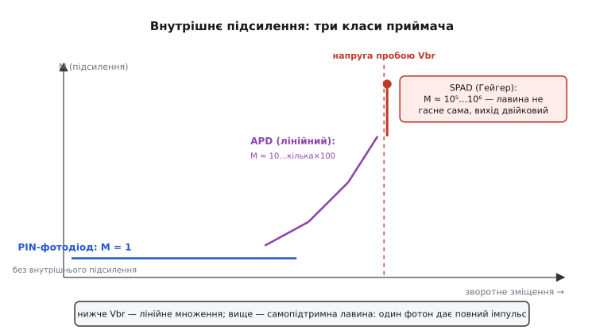
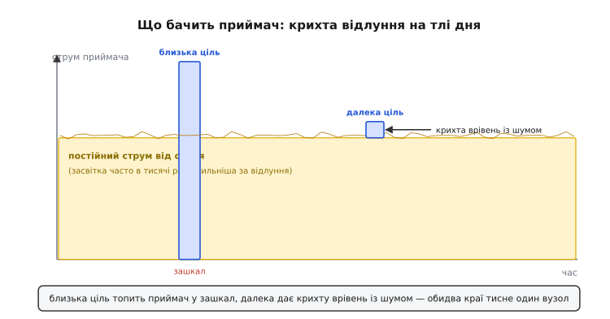
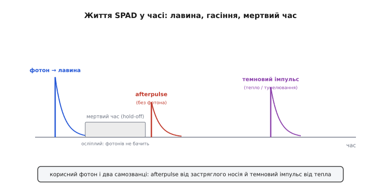

# 🔌 Фотоприймач LiDAR: APD проти однофотонного (SPAD/SiPM)

У темі ми розклали LiDAR на дві осі — **як наводимо** промінь і **що міряємо** у відлунні — і обидва рази вперлися в той самий хвіст: хай яка хитра оптика спереду, усе закінчується тим, що з темряви прилітає **жменя фотонів**, і її треба впіймати. Цей вузол — фотоприймач — ми тоді відклали, бо він заслуговує окремої розмови: саме його чутливість і динамічний діапазон **частіше за все й кладуть стелю дальності** всьому пристрою. Лазер можна зробити потужнішим, дзеркало — точнішим, таймер — гострішим; але якщо приймач не відрізнить кволе відлуння далекої цілі від шуму, дальність уперлася в стіну, і ніяка інша частина її не зрушить.

Це **узагальнений клас**, а не партномер. Усе нижче однаково справджується для приймача будь-якого виробника: фізика лавини, типова обв'язка, способи зміщення й граблі в усьому класі ті самі. Конкретні моделі різняться напругою, площею, матеріалом і темновим струмом — але кістяк поведінки, «ніжки», спосіб увімкнення й пастки спільні, і саме їх варто тримати в голові, читаючи специфікацію далекоміра.

> 🔧 **Навіщо це.** Коли в даташиті LiDAR пишуть «дальність до 200 м», за цим числом стоїть **не лазер, а приймач**: до якого слабкого відлуння він ще здатний доколупатися крізь денну засвітку й власний шум. Зрозумівши клас приймача, ви читаєте таку специфікацію тверезо — бачите, де виробник написав чесну дальність до реальної цілі, а де — рекордну до дзеркального відбивача в темряві, і чому той самий пристрій удень «бачить» удвічі ближче, ніж уночі.

## Чому це взагалі важко: рахунок фотонів

Почнімо з масштабу проблеми, бо без нього не зрозуміти, навіщо приймачеві якісь екзотичні лавини. Лазер шле в ціль короткий імпульс. Світло розходиться, від цілі **розсіюється на всі боки** (дифузна поверхня, як стіна чи асфальт, відбиває не дзеркально, а врозтіч), і назад, у крихітну лінзу приймача, повертається лише мізерна частка тієї частки. Спад потужності з відстанню тут жорстокий: для дифузної цілі прийнята енергія падає десь як **1/d²** (ціль, освітлена променем, сама стає джерелом, і до приймача доходить обернено-квадратично з відстані), а як ціль ще й менша за пляму променя — то й швидше.

Порахуймо грубо, аби відчути порядок. Лазерний імпульс несе, скажімо, кілька наноджоулів. Поки він дійде до цілі за 50 метрів, розсіється від неї й повернеться, від нього лишаться **фемтоджоулі** — а це вже лічені тисячі, а то й сотні **фотонів** на всю апертуру. Один фотон видимого-ближнього ІЧ діапазону несе енергію близько:

```
E_photon = h·c / λ
         = (6.63·10⁻³⁴ · 3.0·10⁸) / (905·10⁻⁹)
         ≈ 2.2·10⁻¹⁹ Дж   (≈ 1.4 еВ)
```

Тобто навіть якщо приймач спіймає всю прийняту енергію без втрат, мова про **жменю квантів світла**, що приходять за одиниці наносекунд. А тепер головне: цю жменю треба розгледіти не в темряві лабораторії, а серед білого дня, коли в ту саму лінзу б'є **сонце** — постійний потік фотонів, у тисячі разів густіший за відлуння. Завдання приймача звучить майже безнадійно: **засікти момент приходу кількох фотонів сигналу на тлі зливи фотонів засвітки**. Усе влаштування класу — це відповідь на цей виклик.

> 🔧 **Навіщо це.** Звідси випливає неочевидне інженерне правило: дальність LiDAR — це **боротьба за фотони**, і виграти її можна з обох кінців. Або наростити сигнал (потужніший імпульс, більша лінза, вужчий промінь — але тут стоїть межа безпеки очей), або **зменшити шум і втрати приймача** (вузький оптичний фільтр на довжину хвилі лазера, що відсікає більшість сонця; чутливіший детектор; коротше часове вікно прийому). Конструктор далекоміра крутить обидва, і приймач — половина цієї боротьби.

## Перша ідея: підсилити лавиною (APD)

Звичайний фотодіод (PIN) перетворює фотони на струм чесно й лінійно: скільки квантів упало — стільки пар «електрон-дірка» народилося, такий і струм. Проблема в тому, що від жмені фотонів цей струм **мізерний** — менший за власний шум підсилювача, що йде слідом. Перша велика ідея класу: дати фотодіодові **внутрішнє підсилення**, ще до того, як кволий сигнал дійде до зовнішньої електроніки й потоне в її шумі.

Як підсилити струм усередині самого кристала? Скористатися **лавиною**. Прикладімо до переходу велику зворотну напругу — таку, що електричне поле в збідненій зоні стає шаленим. Тепер кожен народжений світлом електрон, розганяючись цим полем, набирає досить енергії, щоб, ударившись об атом ґратки, **вибити ще одну пару** — ударна іонізація. Ці нові носії теж розганяються й вибивають наступні. Один фотоносій породжує **каскад**, і з переходу витікає не один заряд, а десятки чи сотні. Це **лавинний фотодіод** (англ. *avalanche photodiode*, APD) — фотодіод, навмисне зміщений близько до пробою, щоб ловити власну керовану лавину.

> Лавина живе на тонкій фізиці p-n переходу під сильним зворотним полем: збіднена зона, ударна іонізація, наближення до пробою. Без цього підмурку «множення в кристалі» лишається магією. Основа — [p-n перехід](book:physics/pn-junction); сам прилад як давач — [лавинний фотодіод (APD)](book:electronics/avalanche-photodiode).

Ключове слово — **керована**. APD тримають **нижче** напруги пробою, у режимі, де лавина хоч і бурхлива, але **затухає сама**, щойно зникає фотоносій. Тому APD **лінійний**: подвоїлося світло — подвоївся вихідний струм, лише вже помножений на коефіцієнт лавини. Цей коефіцієнт — **множення M** (англ. *gain*, *multiplication factor*) — і є головна цифра APD. Залежно від приладу й напруги M у кремнієвих APD лежить десь від кількох десятків до кількох сотень (за різними джерелами — приблизно від 50 до 1000 у крайніх випадках); типово в LiDAR користуються множенням **порядку десятків-сотень**. *(Усталений факт; діапазон множення — стандартна характеристика класу в галузевих оглядах.)*


*Три класи приймача на одній шкалі. PIN множення не має (M = 1). APD, наближаючись до пробою, дає плавно зростаюче лінійне множення в десятки-сотні. SPAD переходить межу пробою — і множення стрибає на п'ять-шість порядків, але платою за це лавина перестає затухати сама й вихід стає двійковим.*

## Друга ідея: рахувати поодинці (SPAD)

А що, як піти ще далі — підняти напругу **вище** пробою? Інтуїція підказує катастрофу: над пробоєм лавина вже **не затухає сама**, бо поле досить сильне, щоб іонізація підтримувала себе нескінченно. Один-єдиний фотоносій запускає лавину, яка **росте, доки її не зупинити ззовні**. Виходить не пропорційний підсилювач, а **спусковий гачок**: упав один фотон — на виході повноцінний струмовий імпульс, хоч би скільки тих фотонів було. Це режим **Гейгера** (англ. *Geiger mode* — за аналогією з лічильником Гейгера, де одна частинка дає повний клац), а прилад — **однофотонний лавинний фотодіод** (англ. *single-photon avalanche diode*, SPAD).

Ефективне множення тут — **10⁵…10⁶**, на кілька порядків більше за лінійний APD. *(Усталений факт; саме цей розрив у підсиленні — головна різниця між лінійним і гейгерівським режимами.)* Тому SPAD здатний відгукнутися буквально на **один фотон** — межа чутливості, далі якої фізика вже не пускає. Але за цю чутливість клас платить трьома речами, і всі вони — наш майбутній розділ про граблі.

> SPAD — це той самий APD, лише заведений за пробій у самопідтримний режим; історія й фізика гейгерівської лавини варті окремого погляду. Основа — [SPAD і підрахунок фотонів](book:electronics/spad-photon-counting), а спорідненість із газовим лічильником — [лічильник Гейгера](book:electronics/geiger-muller-counter).

Перша платня видна одразу з самого принципу. Якщо лавина не затухає сама, її треба **гасити ззовні** — інакше прилад просто застрягне у проводячому стані й згорить. Тому **кожен SPAD має схему гасіння** (англ. *quenching*): найпростіше — резистор послідовно з діодом. Щойно лавина пішла, струм через резистор **просаджує напругу** на самому діоді нижче пробою — лавина гасне; потім напруга поволі відновлюється, і прилад знов готовий. Ось чому **один** SPAD дає не плавний струм, а **потік цифрових імпульсів** — по одному на кожен спійманий (чи самозваний) фотон.

## Як із SPAD зробити вимірювач світла: SiPM

Одинокий SPAD має ваду, фатальну для LiDAR: він **двійковий**. Він каже «був фотон», але не каже «скільки». Прийшло одночасно п'ять фотонів сильного близького відлуння чи один кволий — імпульс однаковий. Для далекоміра, що хоче судити про **силу** відлуння (а отже, відрізняти ціль від шуму й оцінювати її відбивність), цього мало.

Рятунок проста й гарна: **поставити багато крихітних SPAD поряд** на одному кристалі, кожен зі своїм гасильним резистором, і **з'єднати їхні виходи паралельно**. Тепер, коли в детектор прилітає не один, а багато фотонів, вони влучають у **різні** комірки, і кожна дає свій імпульс; виходи додаються, і сумарний сплеск **пропорційний числу спрацьованих комірок**, тобто числу фотонів. Так двійкові гачки складаються назад у **аналоговий** вимір сили світла. Цей прилад — **кремнієвий фотопомножувач** (англ. *silicon photomultiplier*, SiPM): матриця SPAD-комірок, що разом рахують фотони майже лінійно, поки їх не надто багато.

> Ідея «двійкові комірки паралельно дають аналогову суму» виросла з робіт кінця 1980-х – 1990-х у пострадянській фізиці. Прилад на багато гейгерівських мікрокомірок зі вбудованим гасінням розвивали **В. Головін** (московський CPTA) та азербайджанський фізик **Зіраддін Садигов** (Зəкір Садіков; працював в Інституті радіаційних проблем НАНА в Баку та в ОІЯД у Дубні); планарну p-n структуру SiPM Садигов запатентував 1996 року, і на ній команда МІФІ/«Пульсар» зробила перший планарний SiPM 2001-го. *(Усталений факт; авторство Головіна й Садигова визнане в оглядах. Уточнення ідентичності: Садигов — азербайджанський фізик; джерела часто стискають це до «радянського/російського», що неточно — варто називати точніше.)*

Звідси випливає вся «особистість» SiPM, і її варто запам'ятати як профіль класу. Він **дуже чутливий** (бо всередині — гейгерівські SPAD), дає **майже лінійний** відгук на слабкому світлі, **легко інтегрується** на звичайний кремній і працює від помірної напруги. Але він **насичується**, коли спрацьовують майже всі комірки (далі нарощувати нема чим), а кожна щойно спрацьована комірка на короткий час **сліпне** — про це нижче.

## Блок-схема: що стоїть за «приймачем»

«Фотоприймач» у даташиті — це не лише сам діод, а коротке коло вузлів, що перетворює фотони на число. Тракт майже завжди такий: **оптичний фільтр → детектор (APD або SPAD/SiPM) → джерело високої напруги зміщення → схема гасіння (для гейгерівських) → перетворювач струм-напруга → дискримінатор/таймер → цифрова мітка часу**.

Розберімо ланки причинно, бо кожна стоїть тут не випадково:

- **Вузький оптичний фільтр** перед детектором пропускає лише довжину хвилі лазера (905 або 1550 нм) і відрізає решту сонячного спектра. Це **перша і найдешевша лінія оборони** від денної засвітки: вона викидає більшість фонових фотонів ще до того, як вони дійшли до кристала.
- **Детектор** перетворює фотони, що пройшли фільтр, на струм — з внутрішнім множенням, як ми бачили.
- **Джерело високої напруги зміщення** тримає робочу точку. Для APD це напруга **трохи нижче** пробою, для SPAD/SiPM — **трохи вище**; величина перевищення (англ. *overvoltage*, *excess bias*) прямо керує і чутливістю, і шумом, тож її стабільність — окрема морока.
- **Схема гасіння** (лише для гейгерівських) обриває самопідтримну лавину й задає **мертвий час**.
- **Перетворювач струм-напруга** — для аналогового виходу (APD, SiPM) це підсилювач, що робить зі струму напругу; шум саме цього каскаду APD і намагається перекрити своїм множенням.
- **Дискримінатор/таймер** ловить момент, коли сигнал перетнув поріг, і ставить **мітку часу** — той самий час польоту, з якого народжується відстань.

> Перетворення кволого струму детектора на напругу без додавання власного шуму — окреме мистецтво (трансімпедансний підсилювач); його смуга й шум прямо обмежують, наскільки гострий фронт відлуння приймач збереже. Поки досить знати, що цей каскад існує і що APD своїм множенням «перестрибує» саме його шум. Спорідненена базова цеглинка — [компаратор](book:electronics/comparator) як дискримінатор порога.

## «Розпіновка» класу: які висновки в детектора

Партномерів ми не називаємо, але **набір висновків** в усьому класі однаковий, і зрозуміти його корисно — він диктує всю обв'язку.

**APD / одиночний SPAD** — по суті, **двовивідний** прилад: анод і катод. Уся хитрість — не в кількості ніжок, а в тому, **що між ними подати**. До катода йде висока зворотна напруга зміщення, з анода знімають сигнальний струм (або навпаки — залежно від полярності й схеми). Тому реальна «розпіновка» APD — це не стільки сам діод, скільки **дві кола навколо нього**: коло **високовольтного зміщення** (з фільтрацією, бо будь-який шум на ньому домішується прямо в множення) і коло **зчитування струму**.

**SiPM** теж віддає аналоговий струм із двох основних виводів (анод-катод), але в нього часто є **третій, швидкий вивід** — окремий ємнісний відвід для гострого фронту імпульсу. Причина в фізиці: повний струмовий імпульс SiPM має повільний «хвіст» від перезаряджання комірок, і для точного таймінгу беруть не його, а **різкий передній фронт** через цей швидкий вихід. Тож практична «розпіновка» SiPM: живлення зміщення, повільний аналоговий вихід (для виміру сили — числа фотонів) і швидкий вихід (для виміру часу — моменту приходу).

> 🔧 **Навіщо це.** Знати ці кола важливо, бо найбільше клопотів класу — саме в них, а не в самому діоді. Брудне високовольтне живлення зведе нанівець будь-яку чутливість: шум на лінії зміщення множиться лавиною так само, як і сигнал. Тому в реальному далекомірі біля детектора завжди сидить ретельно відфільтроване джерело зміщення, а доріжки сигналу тримають короткими — паразитна ємність розмазує гострий фронт, з якого й беруть мітку часу.

## Підключення й зміщення: одна ручка, що керує всім

Тепер найголовніша практична ручка класу — **напруга зміщення**, точніше **перевищення над пробоєм** для гейгерівських приладів. Вона коротко зветься overvoltage (ΔV) і керує **всім одразу**, і саме тому з нею стільки мороки.

Підняли ΔV — і одразу:

```
ΔV вище  →  ймовірність спрацювання від фотона  ↑  (чутливість росте — добре)
         →  множення / амплітуда імпульсу        ↑  (сигнал виразніший — добре)
         →  частота темнових імпульсів            ↑  (шум росте — погано)
         →  ймовірність afterpulsing              ↑  (хибні повтори — погано)
```

Усі чотири — **разом**, однією ручкою. Тому налаштування приймача — це завжди **компроміс**: задерти ΔV заради чутливості означає втопити прилад у власному шумі; опустити заради тиші — оглухнути до слабкого відлуння. Виробник зазвичай рекомендує робоче вікно ΔV, а серйозні далекоміри ще й **підстроюють** його за температурою (бо, як побачимо, пробій повзе з нагрівом).

> 🔧 **Навіщо це.** Ось чому два однакові LiDAR-модулі можуть поводитися по-різному: уся «особистість» гейгерівського приймача сидить в одному числі — перевищенні над пробоєм. Якщо в системі це число не стабілізоване (просіло живлення, нагрівся кристал) — попливе і дальність, і рівень хибних спрацювань. Перше, що перевіряють, коли далекомір «здурів» на спеці чи від розряду батареї, — чи тримається напруга зміщення детектора.

Для **APD** ручка та сама за змістом, лише робоча точка нижче пробою: вище зміщення — більше множення M, але й більше власного шуму множення (про нього зараз). APD не має мертвого часу й afterpulsing у гейгерівському сенсі, тож його зміщення спокійніше, але теж мусить бути стабільним і температурно поправленим, бо M біля пробою дуже стрімко залежить від напруги.

## «Перший фотон»: як з імпульсу народжується відстань

Аналог «першого байта» для цього класу — **перше відлуння, перетворене на відстань**. Простежмо весь шлях одного імпульсу, бо в ньому видно, навіщо всі попередні вузли.

1. **Пуск.** Лазер шле короткий імпульс і **одночасно** запускає таймер (старт лічби часу). Цей момент — нуль відліку.
2. **Тиша й чекання.** Світло летить до цілі й назад. Приймач у цей час дивиться крізь вузький фільтр на сцену й бачить лише **п'єдестал засвітки** та власний шум — рівний фон без події.
3. **Прихід.** Жменя фотонів відлуння влучає в детектор. APD віддає сплеск струму (помножений лавиною); SPAD/SiPM — різкий цифровий імпульс (одна чи кілька комірок спрацювали).
4. **Дискримінація.** Сплеск перетинає **поріг** дискримінатора — і той ставить **стоп**-мітку часу. Поріг піднятий **над** рівнем шуму й засвітки рівно настільки, щоб фон його не перетинав, а справжнє відлуння — перетинало.
5. **Відстань.** Різниця стоп − старт — це час польоту туди-назад Δt; відстань:

```
d = c · Δt / 2
  = 3.0·10⁸ · Δt / 2
```

Множник ½ — бо світло пройшло шлях **двічі** (до цілі й назад). Масштаб часу тут страшний: одна **наносекунда** Δt — це лише

```
Δd = c · Δt / 2 = 3.0·10⁸ · 1·10⁻⁹ / 2 = 0.15 м
```

тобто 15 сантиметрів. Звідси й вимога до гостроти фронту й таймера: щоб міряти сантиметри, треба ловити час із точністю до часток наносекунди. Ось чому SiPM має окремий **швидкий** вихід, а дискримінатор роблять якнайменш «тремтливим» — будь-яке розмиття фронту прямо перетворюється на похибку відстані.

Цей крок-за-кроком і пояснює, навіщо приймач такий вибагливий: він не просто реєструє світло, він **засікає момент** його приходу з наносекундною різкістю, та ще й на тлі засвітки. Глибше про сам принцип виміру часом — [вимір відстані лазером (ToF)](book:electronics/tof-laser); а як похибка кожної мітки складається в підсумкову точність — [бюджет похибок далекоміра](root:embedded/error-budget-ranging).

## Динамічний діапазон: між крихтою і повінню

Тепер — найважче для класу й найчастіша причина, чому приймач кладе стелю. Той самий детектор мусить упоратися з **двома протилежними крайнощами одночасно**.

З одного боку — **далека ціль**: жменя фотонів, ледь над шумом. Щоб її взяти, потрібні максимальна чутливість і високе зміщення. З іншого боку — **близька сильна ціль** (стіна за метр, дорожній знак-ретрорефлектор): вона жбурляє назад **у тисячі разів** більше світла, ніж приймач, налаштований на крихти, годен переварити. Це **повінь**, що зашкалює тракт.


*Два протилежні краї, які тисне один вузол. Денне світло створює постійний п'єдестал струму, на якому крихта далекого відлуння ледь видніється над шумом. Близька сильна ціль, навпаки, заганяє приймач у зашкал і на якийсь час осліплює його. Здатність охопити обидва краї одразу — і є динамічний діапазон приймача.*

Чим це б'є по класу конкретно:

- **APD у зашкалі** просто перестає бути лінійним: сильний струм просаджує внутрішнє поле, множення падає, і близька ціль виміряється з заниженою силою. Сам прилад при цьому виживає, але точність на близькому краю гине.
- **SiPM при сильному світлі насичується**: коли спрацювали майже всі комірки, додавати імпульси нема звідки — відгук перестає рости, і дві різні (сильні) цілі стають невідрізними. Гірше — багато спрацьованих комірок означає, що детектор **тимчасово осліп**, поки вони перезаряджаються.
- **Близька ціль після далекої.** Підступний випадок: сильне близьке відлуння залишає «слід» — осліплення й afterpulsing, — крізь який кволе далеке відлуння в наступні наносекунди вже не пробитися. Так сильна ціль **затіняє** слабку, що стоїть трохи далі.

> 🔧 **Навіщо це.** Ось чому в даташиті LiDAR поруч із дальністю завжди десь є **мінімальна** дистанція й застереження про ретрорефлектори: близький блиск приймач переварює гірше, ніж здається. Якщо ваш апарат працює і в тісноті (стіни поруч), і на дальню ціль, дивіться не лише на максимальну дальність, а й на те, як приймач тримає **обидва** краї — бо саме його динамічний діапазон, а не лазер, вирішує, чи побачите ви слабку ціль одразу за яскравою.

Звідси дві типові хитрощі класу. Перша — **автоматичне керування підсиленням**: приймач опускає зміщення (а отже, чутливість), коли бачить сильне відлуння, і піднімає на слабкому — підлаштовуючи динамічний діапазон під сцену. Друга — **часове стробування** (дивитися лише у вікно очікуваного відлуння), щоб не накопичувати засвітку поза ним. Обидві не з'являються в гарних словах специфікації, але саме вони відрізняють далекомір, що працює на сонці, від того, що сліпне.

> Чому приймач узагалі здатний охопити лише обмежений розмах сигналів і як цей розмах рахують у децибелах — окрема базова тема. Для далекоміра вона прямо перекладається у відношення «найближча сильна ціль / найдальша слабка». Загальний апарат — [динамічний діапазон](book:electronics/dynamic-range).

## Граблі класу: де приймач бреше й сліпне

Тепер зберімо специфічні пастки, на яких клас спотикається. Більшість їх — зворотний бік тієї самої чутливості: прилад, готовий відгукнутися на один фотон, охоче відгукується й на те, що фотоном не є.

**Темнові імпульси (dark counts).** SPAD не вміє відрізнити фотон від будь-якого іншого носія, що випадково завівся в збідненій зоні. А носії там народжуються й **без світла** — від тепла та від тунелювання крізь вузький бар'єр під сильним полем (англ. *trap-assisted tunneling*). Кожен такий «самозародок» запускає повноцінну лавину — **темновий імпульс**, не відрізнний від справжнього. Їхня частота (англ. *dark count rate*, DCR) — фоновий стукіт детектора в цілковитій темряві, і він **росте і з температурою, і з перевищенням над пробоєм**. *(Усталений факт; теплова генерація й trap-assisted tunneling — визнані механізми темнового стуку.)* Для далекоміра це означає хибні «цілі» з нізвідки, які треба відсівати, і піднятий поріг виявлення справжніх.

**Afterpulsing (післяімпульси).** Найпідступніша пастка класу. Коли лавина проходить, частина носіїв **застрягає в дефектах** кристала, а потім **звільняється із запізненням** — з постійною часу від десятків наносекунд до десятків мікросекунд — і запускає **нову лавину вже без жодного фотона**. *(Усталений факт; afterpulsing породжений захопленням і відкладеним вивільненням носіїв у дефектах.)* Виходить хибний імпульс-двійник, прив'язаний до попереднього спрацювання. Для LiDAR це особливо бридко: після сильного відлуння йде шлейф післяімпульсів, що маскуються під ближчі цілі або підвищують шум саме тоді, коли чекаєш слабке відлуння. Ймовірність afterpulsing **росте з перевищенням над пробоєм** — ще одна причина не задирати зміщення.


*Життя SPAD у часі. Справжній фотон запускає лавину, яку гасить схема гасіння; настає мертвий час, коли комірка осліпла. Та сама подія лишає застряглі носії — вони звільняються трохи згодом і дають afterpulse без жодного фотона. Окремо, незалежно від світла, тепло чи тунелювання породжують темновий імпульс. Приймач не відрізнить ці три імпульси один від одного — у цьому й біда чутливого класу.*

**Мертвий час (dead time).** Щойно комірка спрацювала й гаситься, вона на короткий час **не бачить нічого** — поки напруга не відновиться над пробоєм. Поодинокий SPAD на цей час повністю сліпий; у SiPM сліпне лише та частка комірок, що спрацювала, але при сильному світлі це багато. Наслідок: за яскравого фону чи близької цілі детектор **прогавлює** події, і потік імпульсів перестає чесно відображати потік фотонів. Гасіння-та-відновлення — фундаментальна межа швидкості гейгерівського приймача.

**Чутливість до температури.** Напруга пробою кремнію **повзе з температурою** (нагрівся кристал — пробій зсунувся), а робота приймача тримається саме на тонкій різниці між зміщенням і пробоєм. Тому з нагрівом одночасно: пливе перевищення (а з ним чутливість і шум), **зростає темновий стук** (більше теплових носіїв) і зсувається множення APD. Серйозні далекоміри **міряють температуру детектора й підстроюють зміщення**, щоб тримати перевищення сталим; дешеві — пливуть, і їхня дальність на спеці падає.

**Власний шум множення APD (excess noise).** В APD є окрема, тонша пастка, якої нема в простому фотодіоді. Сама лавина — процес **випадковий**: один фотоносій помножиться на 80, інший — на 120, бо число зіткнень — це лотерея. Ця випадковість додає **власний шум множення**, тим більший, чим вище M. Описав його ще 1966 року **Р. Дж. Макінтайр (R. J. McIntyre)**: коефіцієнт надлишкового шуму F залежить від середнього множення M і від **відношення k** здатностей електронів і дірок іонізувати ґратку (k = β/α). *(Усталений факт; формула Макінтайра — класична основа аналізу шуму APD.)* Практичний висновок прямий: **множення допомагає лише до певної межі** — спершу воно піднімає сигнал над шумом наступного підсилювача (корисно), але далі його власний випадковий шум росте швидше за виграш, і є оптимальне M, вище якого задирати не варто. Матеріали з малим k (одні носії іонізують куди охочіше за інших) шумлять менше — тому вибір матеріалу детектора важить не лише для довжини хвилі, а й для шуму.

> 🔧 **Навіщо це.** Ці граблі — не дрібні застереження, а **головна причина**, чому приймач кладе стелю дальності. Кожен зайвий вольт зміщення дає трохи більше чутливості — і платить темновим стуком та післяімпульсами, що піднімають поріг виявлення, за який слабке відлуння вже не пробивається. Дальність LiDAR — це завжди точка рівноваги: чутливість проти власного шуму приймача. Хто цього не врахував, отримує далекомір, що в лабораторії «бачить 200 м», а в полі на сонці й спеці — удвічі менше.

## Чому саме приймач кладе стелю

Зведімо думку, заради якої й була ця вставка. Дальність далекоміра — це здатність **витягнути слабке відлуння з-під шуму й засвітки**. Полічити її можна як співвідношення сигнал/шум на приймачі: сигнал спадає з відстанню (грубо як 1/d² для дифузної цілі), а під ним лежить підлога з кількох доданків — постійна засвітка дня, темновий стук детектора, шум множення (для APD), шум підсилювача. Дальність — це той d, на якому сигнал ще випинається над цією підлогою на надійну величину.

І ось ключове: **кожна частина приймача підіймає підлогу або обмежує сигнал**, і жодну з них не обійти, граючи лазером. Потужніший лазер упирається в **безпеку очей**. Більша лінза — у габарит і ціну. Лишається **сам приймач**: його чутливість визначає, скільки фотонів треба для надійного спрацювання, а його шум (темновий, afterpulsing, множення) визначає, наскільки високо стоїть підлога. Тому два далекоміри з однаковим лазером і оптикою, але різними приймачами, мають **різну дальність** — і саме приймач, найтихіший і найчутливіший вузол, частіше за все й виявляється стелею.

> 🔧 **Навіщо це.** Практичний підсумок для добору давача: читаючи дальність у специфікації, питайте про **умови** — яка відбивність цілі (10 % дифузна — чесно; ретрорефлектор — рекорд), яке освітлення (ніч чи сонце 100 клк), яка ймовірність хибної тривоги. Усі чотири — це про приймач, не про лазер. Далекомір, чесний у цих умовах, майже завжди має кращий приймач, навіть якщо його лазер скромніший.

## Варіації класу

Той самий узагальнений приймач проявляється по-різному залежно від того, що для задачі дорожче — чутливість, динамічний діапазон чи ціна.

**Лінійний APD.** Класика дальнього імпульсного LiDAR. Дає лінійний відгук (видно силу відлуння), не має мертвого часу й afterpulsing у гейгерівському сенсі, добре тримає сильні цілі. Платня — потрібен малошумний підсилювач слідом і чимала площа; чутливість поступається гейгерівській. Беруть, коли важлива **дальність із вимірюваною силою** й широкий динамічний діапазон.

**Одиночний SPAD / масив SPAD.** Гранична чутливість — аж до одного фотона; чисто цифровий вихід, що зручно лягає на цифрову обробку й гістограмний підрахунок. Але двійковість, мертвий час і afterpulsing вимагають хитрого накопичення багатьох імпульсів (будувати гістограму часів приходу й шукати в ній пік). Беруть там, де сигнал **дуже слабкий**, а сцену можна накопичувати — далекобійні й сканувальні системи з підрахунком фотонів.

**SiPM (матриця SPAD).** Компроміс, що набирає популярність: чутливість гейгерівська, але відгук **майже аналоговий** (рахує число спрацьованих комірок), інтегрується на дешевий кремній, працює від помірної напруги. Платня — насичення на сильному світлі й сумарний темновий стук від багатьох комірок. Беруть, коли треба **і чутливість, і груба сила відлуння** на масовому кремнії.

**Простий PIN-фотодіод.** Без внутрішнього множення — у LiDAR його ставлять лише на **зовсім близьку** дію (зблизька фотонів вистачає й без лавини) або там, де сильний відбивач гарантований. Дешево й лінійно, але дальність мала. Це нижній, найдешевший край класу.

**Матеріал — за довжиною хвилі.** На **905 нм** детектор роблять на звичайному **кремнії** (Si) — дешево й масово; це домівка кремнієвих APD, SPAD і SiPM. На **1550 нм** кремній **не бачить** світла, тож потрібен детектор на **індій-галій-арсеніді** (InGaAs) — дорожчий і зазвичай із вищим темновим струмом, але відкриває безпечніше для очей і далекобійніше вікно. *(Усталений факт; межа чутливості кремнію в ближньому ІЧ і потреба InGaAs за нею — стандартні.)* Вибір матеріалу приймача, отже, жорстко зв'язаний із вибором довжини хвилі лазера, який ми розбирали в темі, — це той самий компроміс «дешево й ближче проти дорого й далі», лише з боку приймача.

**Вибір одним реченням:** близька дія й гарантований відбивач — PIN; дальність із вимірюваною силою й широкий динамічний діапазон — лінійний APD; гранична чутливість на слабкому сигналі з накопиченням — SPAD; чутливість упереміш із масовістю й грубою силою відлуння — SiPM; а довжину хвилі (а з нею й матеріал детектора) диктує те, як далеко й наскільки безпечно для очей має бачити апарат.
