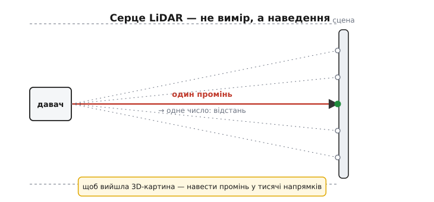
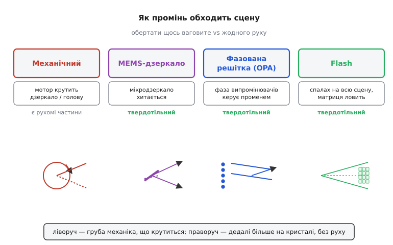
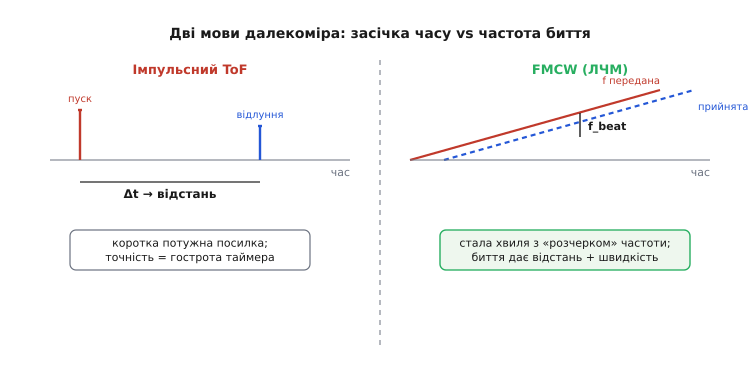
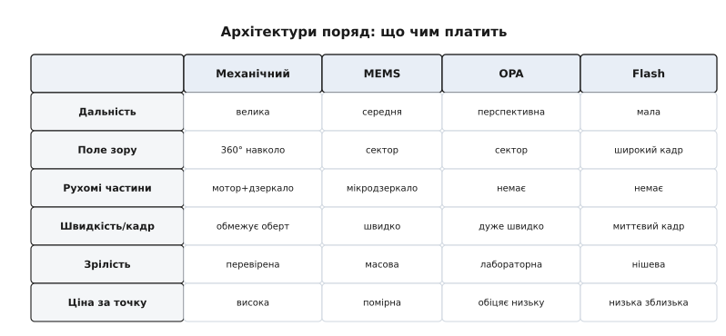

# Архітектури LiDAR

У попередньому кроці ми навчилися міряти **одну** відстань: пустити промінь, дочекатися відлуння, засікти час чи кут — і дістати число. Для багатьох задач цього досить. Але автономному апарату потрібне не одне число, а **форма всього світу навколо**: де стіна, де стовп, де яма, де людина, що ступила на дорогу. Йому треба не «до того, що прямо переду, 4.2 метра», а **хмара точок** — десятки тисяч вимірів за кадр, з кожного боку, що складаються в об'ємну картину сцени. Саме цей стрибок — від однієї цятки до цілої картини — і породжує все, що звуть архітектурами LiDAR.

Назва вже підказує родовід. **LiDAR** — це зрощення слів *light* і *radar* (англ. «світлове радіо»); його часто заднім числом розшифровують як *Light Detection And Ranging*, «виявлення й вимір світлом», але історично це не абревіатура, а просто «радар на світлі». Перші системи на лазері так і називали — *colidar* (від *coherent light detecting and ranging*), а окреме слово *lidar* зринуло на початку 1960-х, коли лазером заходилися міряти Місяць. Суть незмінна: усе той самий [час польоту світла](root:embedded/contactless-distance), лише поставлений на потік — щоб накрити вимірами всю сцену, а не одну точку.

> 🔧 **Навіщо це.** Коли в даташиті пишуть «LiDAR», це ще нічого не каже про те, **як** пристрій улаштований усередині. Той самий принцип вимірювання — час чи фаза світлового відлуння — втілюють чотирма зовсім різними способами, з різною ціною, дальністю, надійністю й габаритом. Обираючи давач для апарата, ви насправді обираєте **архітектуру**, а не «лазерний далекомір узагалі».

## Справжня задача — не зміряти, а навести

Якщо вимір однієї відстані вже розв'язаний, то в чому ж тоді робота? У **наведенні**. Щоб скласти об'ємну картину, мало знати, що відлуння повернулося за стільки-то наносекунд, — треба ще знати, **з якого напрямку** воно прийшло. Відстань без напрямку — це коло можливих місць; лише пара «відстань + напрямок» дає точку в просторі. Тому будь-який LiDAR мусить так чи інакше **прив'язати кожен вимір до свого променя** — інакше хмара точок перетвориться на кашу.

Звідси два принципово різні підходи, і всі архітектури — це їхні варіації. Перший: тримати **один гострий промінь** і швидко **переводити** його по сцені — туди-сюди, рядок за рядком, як олівець, що штрихує аркуш; напрямок тоді відомий з того, **куди ми цей промінь зараз спрямували**. Другий: **залити світлом усю сцену разом** одним спалахом і впіймати відлуння на **матрицю** приймачів — тоді напрямок дає не промінь, а те, **в який піксель** матриці влучило відлуння, точнісінько як у звичайній фотокамері. Перший підхід — це сканування, другий — спалах; усе інше лягає десь поміж.

*Чому LiDAR — це передусім задача наведення. Один промінь дає одне відлуння — одну точку хмари. Щоб з'явилася об'ємна картина, той самий вимір треба повторити в тисячах напрямків за частку секунди. Як саме обійти всі ці напрямки — і є те, що розрізняє архітектури.*

Отже, головне питання конструктора звучить не «як зміряти час відлуння» (це ми вже вміємо), а **«як обійти всю сцану — і обійти швидко»**. Кожна архітектура — це окрема відповідь на нього, зі своїм компромісом між швидкістю, дальністю, ціною й тим, скільки в пристрої лишилося рухомих частин.

## Механічне сканування: груба сила, що спрацювала

Найочевидніший спосіб навести промінь усюди — **фізично крутити** те, що його випускає. Поставити лазер і приймач на платформу й обертати її навколо вертикальної осі: за один оберт промінь омете всі 360° навколо апарата. Щоб бачити не лише вузьку смужку на рівні очей, а й вище-нижче, стромляють **кілька пар** «лазер + приймач», нахилених під різними кутами, — і кожен оберт дає не один рядок, а цілий стос рядків, що складаються в об'ємну хмару. Це **механічний** LiDAR: усередині справді крутиться важкенька «голова» зі склом, дзеркалами й електронікою.

Грубо — але саме так автономні машини вперше **прозріли**. Перший справжній кругогляд народився під гонку: інженер Девід Голл збудував обертовий 64-променевий далекомір спеціально для змагань роботів-автомобілів DARPA, і вже наступного циклу цей «обертовий бочонок» вінчав майже всі машини, що дійшли до фінішу. Звідти й пішла вся галузь автономного водіння. Історія того, [як гонка в пустелі породила обертовий LiDAR](root:embedded/lidar-architecture/hist-velodyne-darpa.md), варта окремої сторінки: вона показує, чому механічне сканування десятиліттями лишалося синонімом «справжнього» LiDAR — і чому всі відтоді намагаються його позбутися.

> 🔧 **Навіщо це.** Механічний LiDAR досі — еталон **дальності й огляду**: повні 360°, сотні метрів, щільна хмара. Якщо вам треба кругова картина для картографування чи великого безпілотника й бюджет дозволяє — це найперевіреніший вибір. Та пам'ятайте ціну: мотор і підшипники **зношуються**, обертова голова **бояться вібрації й ударів**, пристрій великий, дорогий і помітно «гуде». Для дрона, що трясеться й економить кожен грам, це часто неприйнятно — і саме тут починають дивитися вбік від механіки.

Чому ж усі хочуть викинути мотор? Бо рухомі частини — це завжди слабке місце: вони ламаються, важать, споживають, шумлять і коштують. Тож уся подальша еволюція LiDAR — це довга спроба **прибрати рух**: спершу зменшити те, що рухається, потім позбутися його зовсім. Так народилося сімейство, яке гуртом звуть **твердотільним** (англ. *solid-state* — «без рухомих частин»).

## Твердотільні: перенести наведення на кристал

«Твердотільний» — це не одна технологія, а ціла шкала того, **наскільки** вдалося прибрати механіку. Пройдімо її від майже-механічного краю до зовсім нерухомого.

*Сімейство архітектур за способом обійти сцену. Механічний крутить ваговите дзеркало чи голову. MEMS зменшує рух до крихітного хисткого дзеркальця на кристалі. Фазована решітка (OPA) повертає промінь без жодного руху, граючи фазою випромінювачів. Flash взагалі не наводить — заливає сцену спалахом і ловить кадр матрицею. Зліва направо рухомих частин дедалі менше.*

**MEMS-дзеркало** — найперший крок геть від великої механіки. Замість крутити всю голову, лишають один лазер нерухомим, а промінь відбивають від **крихітного дзеркальця** завбільшки з кому, виготовленого просто на кремнієвому кристалі (MEMS — *micro-electro-mechanical system*, мікроелектромеханічна система). Електричний сигнал змушує це дзеркальце **хитатися** по двох осях тисячі разів на секунду — і відбитий промінь швидко малює сцену рядок за рядком. Рух нікуди не зник, але він тепер мікроскопічний: немає важких підшипників, пристрій маленький і дешевший. Платня — менше **поле зору** (дзеркальце хитається лише в межах сектора, а не на всі 360°) і вразливість самого дзеркальця до сильної вібрації, що збиває його з ритму.

**Фазована решітка (OPA)** — наступний, тонший крок: прибрати рух **зовсім**. Тут немає ні голови, ні дзеркальця — лише ряд крихітних випромінювачів на чипі, що світять одним лазером. Хитрість у тому, що коли всі вони світять **трохи невлад** — з наростаючим зсувом **фази** від сусіда до сусіда, — їхні хвилі додаються так, що спільний фронт іде **під кутом**; змінюючи цей зсув фази електрично, промінь **повертають у будь-який бік без жодної рухомої частини**. Це той самий принцип, яким керують променем у радіолокації, лише перенесений на світло; в основі — додавання й гасіння [електромагнітних хвиль](topic:ph-electromagnetism/em-wave) від багатьох джерел. Виграш величезний: наведення суто електронне, тож блискавичне й нічого не зношується. Та зробити це на світлі (а в нього довжина хвилі — частки мікрона) страшенно важко, тож OPA поки що радше **лабораторна обіцянка**, ніж готовий масовий давач.

**Flash** — інший край шкали, де від наведення відмовилися геть. Замість водити променем, **одним потужним спалахом** освітлюють усю сцену разом, а відлуння ловлять на **матрицю** світлочутливих комірок — як кадр звичайної камери, тільки кожен піксель міряє ще й **час** повернення світла, а отже, відстань. Напрямок тут дає не промінь, а **сам піксель**: куди в матриці влучило відлуння, той і напрямок. Жодного руху, увесь кадр — миттєво, конструкція проста. Розплата сувора: спалах мусить освітити **все поле зору одразу**, тож на кожен піксель припадає мало світла — і flash «бачить» лише **зблизька**. Це давач ближньої дії: салон, конвеєр, жест перед екраном — там, де дальність не потрібна, а потрібен повний кадр без сканування.

Спільна для всіх архітектур морока ховається в кінці шляху сигналу — у **прийманні**. Відлуння, що повертається з десятків метрів, — це жалюгідні крихти світла на тлі яскравого дня; зловити їх і не потонути в шумі вміє лише особливий **фотоприймач** — лавинний чи однофотонний. Те, [як улаштований приймач LiDAR і де його межі](root:embedded/lidar-architecture/comp-lidar-photodetector.md), — окрема тема: саме чутливість і динамічний діапазон цього вузла часто й кладуть стелю дальності всьому пристрою, хоч би яка хитра була оптика наведення.

## Друга вісь: що саме ми міряємо

Дотепер ми розбирали **як обійти сцену**. Але є друга, зовсім незалежна вісь вибору — **що саме засікати у відлунні**. Її легко проґавити, бо вона ортогональна до першої: будь-яку архітектуру наведення можна поєднати з кожним зі способів виміру. І саме тут ховається найцікавіша новинка LiDAR.

*Дві мови далекоміра. Імпульсний ToF шле коротку потужну посилку й засікає затримку Δt до відлуння — точність упирається в гостроту таймера. FMCW шле сталу хвилю з «розчерком» частоти; відлуння приходить зсунутим, і частота їхнього биття одразу дає і відстань, і швидкість цілі.*

Перший спосіб ми вже знаємо — **імпульсний час польоту** (ToF): коротка потужна «пінг»-посилка, засічка моменту відлуння, відстань із затримки. Простий і прямий; так працює переважна більшість LiDAR. Уся точність тут — у тому, **наскільки дрібно** ви ловите час: для світла навіть наносекунда — це 15 сантиметрів відстані, тож імпульсний LiDAR вимагає блискавичної електроніки на приймачі. Глибше про цей принцип — у кроці про [вимір відстані лазером](topic:hw-sensing/tof-laser).

Другий спосіб тонший і молодший — **FMCW** (*frequency-modulated continuous wave*, частотно-модульована неперервна хвиля; її ще звуть **ЛЧМ** — лінійно-частотно-модульованою). Замість стріляти імпульсами, лазер світить **безперервно**, але його частоту повільно **«розчеркують»** вгору — як сирену, що плавно підвищує тон. Відлуння повертається із запізненням, а отже, з частотою, яку лазер уже **встиг змінити**; змішавши прийнятий сигнал із поточним, дістають низькочастотне **биття**, і саме воно кодує відстань. Математика того, [як розчерк частоти перетворюється на биття](root:embedded/lidar-architecture/math-fmcw-beat.md), нескладна, але красива, і варта окремого виведення.

За цю складність FMCW дарує три речі, яких імпульсний ToF не вміє. По-перше, він міряє не лише відстань, а й **швидкість** цілі — прямо, з кожної точки, бо рух цілі ще трохи зсуває частоту відлуння (ефект Допплера): машина одразу знає, що ось та точка **насувається**, а не здогадується про це, порівнюючи сусідні кадри. По-друге, він майже **не боїться засвітки** — ні сонця, ні чужих LiDAR поруч: приймач реагує лише на биття зі **своїм** променем, а стороннє світло іншої частоти його не обманює. По-третє, він світить **слабко й безперервно**, а не потужними спалахами, тож легше вкладається в межі безпеки очей і в один кремнієвий чип. Платня — складніша оптика й вимога до дуже «чистого», стабільного лазера; тому FMCW поки дорожчий і рідший, але саме його багато хто вважає майбутнім автономного водіння.

> 🔧 **Навіщо це.** Дві осі — **як наводимо** (механіка / MEMS / OPA / flash) і **що міряємо** (імпульс / FMCW) — комбінуються незалежно. Тому, читаючи специфікацію LiDAR, питайте окремо: чим він **сканує** і чим **міряє**. «Швидкість із коробки, з кожної точки» — майже певна ознака FMCW; «360°, сотні метрів» — майже певно механіка з імпульсним ToF. Сплутати ці осі — типова помилка при доборі давача.

## Тиха третя вісь: довжина хвилі

Є ще один вибір, який легко не помітити, бо він не видний у формі пристрою, — **довжина хвилі** лазера. У LiDAR панують два значення, і за ними стоїть глибокий компроміс між ціною, дальністю й **безпекою очей**.

**905 нм** — ближній інфрачервоний, ледь за межею видимого. Його головна перевага — дешевизна: таке світло чудово ловить **звичайний кремнієвий** приймач, а кремній — наймасовіша й найдешевша технологія. Біда в тому, що 905 нм **проходить крізь око до сітківки** й фокусується на ній, як і видиме світло, — тож потужність доводиться тримати низькою заради безпеки, а низька потужність обмежує дальність.

**1550 нм** — глибше в інфрачервоному. Тут усе навпаки: таке світло **поглинається вологою рогівки** ще до сітківки, тож воно помітно **безпечніше для очей** — і дозволяє підняти потужність (грубо на порядок і більше), а з нею й дальність. Розплата — кремній цього світла **не бачить**, потрібен дорожчий приймач на сполуці **індій-галій-арсенід** (InGaAs) і складніший волоконний лазер, що ще й гріється. Тому 1550 нм — це «далеко, безпечно, але дорого».

> 🔧 **Навіщо це.** Довжина хвилі — не дрібниця в дужках, а вирок дальності й ціни. Бачите в даташиті **905 нм** — це масовий, дешевий, ближчого радіуса давач на кремнії; **1550 нм** — далекобійний і безпечніший для очей, але дорогий і складніший. І ще практичне: 905 нм гірше «пробиває» дощ і сніг по-своєму, ніж 1550, тож вибір хвилі — це й вибір **погоди**, у якій давач має працювати.

## Підступ, спільний для всіх: сцена рухається

Поки апарат стоїть, усе просто. Але LiDAR живе на тому, що **рухається** — на машині, на дроні, — і дивиться на світ, що теж не завмер. Тут вилазить тонка вада сканувальних архітектур: вони складають кадр **не миттєво**, а обходячи сцену **по черзі**. Поки промінь дійшов від першого рядка до останнього, апарат уже трохи проїхав, а ціль — зрушила. Кадр виходить **скошеним**: різні його точки виміряні в різні моменти й з різних місць. Це той самий ефект, що спотворює фото швидкого об'єкта на камеру з повільним затвором, — лише в трьох вимірах.

Саме тут **flash** показує свою приховану силу: він знімає весь кадр **одним спалахом**, тож сцена на ньому **завмерла** — жодного скосу. За це він і платить малою дальністю. А сканувальні LiDAR борються зі скосом інакше: знаючи власний рух (від [інерціальних давачів](root:embedded/imu-barometer) апарата) і час кожної точки, вони **перераховують** хмару назад у єдину мить — але це вже робота не оптики, а обчислення, і вона лише настільки добра, наскільки точно відомий рух апарата.

> 🔧 **Навіщо це.** Перш ніж довіряти хмарі точок зі швидкого апарата, спитайте: **коли** виміряна кожна точка? На сканувальному LiDAR кадр «розмазаний» у часі, і без поправки на власний рух прямі стіни вигинаються, а близькі цілі стрибають. Це не дефект давача, а наслідок того, що він **сканує**, — і його обов'язково враховують, зливаючи LiDAR з даними руху.

## Як обрати

*Чотири архітектури за головними осями. Механічний — велика дальність і повний кругогляд, але мотор і ціна. MEMS — компактний компроміс, уже масовий. OPA — електронне наведення без руху, поки що лабораторне. Flash — миттєвий кадр без сканування, але близького радіуса. Жоден не «найкращий» — кожен виграє у своїй ніші.*

Зведімо все докупи. **Механічний** — коли треба повний огляд на 360° і велика дальність, а габарит і ціна терплять: картографування, великі безпілотники, перевірена класика. **MEMS** — розумний компроміс для апарата: компактно, дешевше, уже масово, ціною меншого сектора огляду. **Flash** — близька дія без сканування й без скосу: салон, жести, конвеєр. **OPA** — наведення без жодного руху, блискавичне й невмируще, але поки що радше майбутнє, ніж полиця магазину. А поверх цього вибору лягає друга вісь — **імпульсний ToF** для простоти й дальності чи **FMCW**, коли потрібні швидкість із кожної точки й несприйнятливість до засвітки.

І головна думка наостанок: «найкращої» архітектури немає — є **придатна під задачу**. Дрон над полем, робот-пилосос і автомобіль на шосе беруть різні LiDAR не тому, що один кращий, а тому, що в кожного своя дальність, своє поле зору, свій бюджет ваги й грошей. Тож вибір LiDAR — це завжди читання **профілю** давача проти вашої задачі, а не гонитва за гучним словом «твердотільний».

А коли давач обрано, постає наступне тверезе питання: **наскільки точно** він насправді міряє? Бо кожна точка хмари несе свою похибку — від тремтіння таймера, від форми цілі, від власного руху апарата, — і ці похибки складаються в [бюджет похибок далекоміра](root:embedded/error-budget-ranging), на який ми й подивимося далі. А вже зібрану й вивірену хмару точок апарат перетворює на карту й маршрут — це окреме мистецтво [поєднання давачів](topic:com-signal/sensor-fusion) і розпізнавання сцени, де LiDAR грає першу скрипку, але не грає сам.

---
