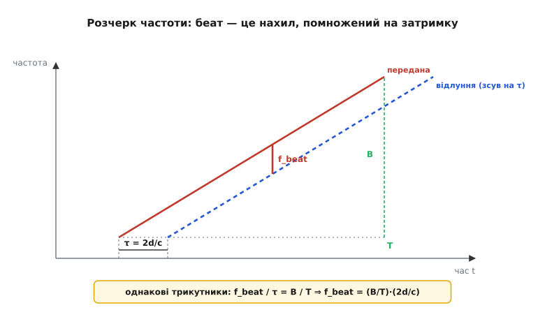
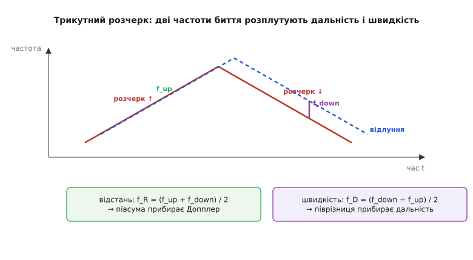

# 🧮 Як розчерк частоти перетворюється на частоту биття

У головній розповіді ми сказали коротко: FMCW світить безперервно, плавно «розчеркує» частоту лазера вгору, а коли порівняти прийняте відлуння з тим, що лазер випромінює **зараз**, виходить низькочастотне **биття**, і саме воно кодує відстань. Звучить майже як магія — і саме тому варто розкласти її по кроках. Тут ми виведемо формулу `f_beat = (B/T)·(2d/c)` з самого визначення розчерку, побачимо, **чому** биття стале (а не повзе), звідки береться знаменита межа роздільності `Δd = c/(2B)`, і нарешті — як той самий апарат однією хитрістю видає **і дальність, і швидкість** з кожної точки.

Нічого складнішого за подібні трикутники тут не знадобиться. Уся краса FMCW в тому, що страшна на вигляд фізика когерентного світла зводиться до шкільної геометрії на графіку «частота від часу».

## Означення: що таке розчерк, биття і затримка

Спершу назвемо три речі, якими користуватимемося.

**Розчерк** (англ. *chirp* — «цвірінькання»; так, термін узяли від пташиного посвисту, що теж плавно міняє тон) — це сигнал, частота якого **лінійно росте з часом**. Не стрибає, не модулюється бітами — саме рівномірно повзе вгору. Якщо стартова частота f₀, а наростає вона зі сталою швидкістю S (герц за секунду), то в момент t миттєва частота така:

```
f(t) = f₀ + S·t
```

Швидкість наростання S — це **нахил** розчерку. Її задають через дві паспортні величини: за час одного розчерку T частота піднімається на смугу B (повну ширину «розгойдування»). Тоді нахил — просто висота на ширину:

```
S = B / T          [Гц/с]
```

Запам'ятайте цей нахил: він — головна ручка приладу, і саме він зрештою перетворить затримку на частоту.

**Затримка** τ — це час, за який світло долітає до цілі й вертається. Ціль на відстані d; світло проходить туди й назад, тобто шлях 2d, зі швидкістю світла c:

```
τ = 2d / c
```

> 🔧 **Навіщо це.** Підставте числа: до цілі 30 метрів світло долітає й вертається за τ = 2·30 / (3·10⁸) = 200 нс. Це **смішно мало** — саме тому імпульсний ToF мусить ловити час із наносекундною гостротою (нагадаємо: одна наносекунда — це 15 см дальності). Фокус FMCW у тому, що він цю наносекундну затримку **не міряє таймером узагалі** — він перетворює її на частоту, яку зручно й точно зміряти повільною електронікою. Як саме — зараз побачимо.

**Биття** — це різницева частота, що виникає, коли змішати (перемножити) два коливання близьких частот. Якщо ви чули, як розладнані гітарні струни «бухкають» — гучність то наростає, то спадає кілька разів на секунду, — це воно: вухо чує **різницю** частот двох струн. У FMCW роль двох струн грають передана хвиля й відлуння; різниця їхніх частот і є те, що ми зрештою виміряємо.

## Інтуїція: сирена, що піднімає тон

Перш ніж писати формули, збудуймо картинку в голові — без неї формули будуть мертві.

Уявіть сирену, яка **рівномірно підвищує тон**: почала з низького гудіння й плавно повзе вгору. Ви стоїте поряд зі стіною й слухаєте відлуння. Звук, що повертається від стіни, вийшов із сирени **трохи раніше** — стільки, скільки летів туди й назад. А оскільки сирена весь цей час підвищувала тон, відлуння несе **старіший, нижчий** тон, ніж той, що сирена видає просто зараз.

Тепер слухайте обидва тони разом: поточний (високий) і відлуння (трохи нижчий). Між ними — стала різниця висоти. І ця різниця **прямо каже, як далеко стіна**: дальша стіна — довша затримка — більше встигла піднятися сирена за цей час — більший розрив тонів. Ось і весь FMCW в одному образі: **відстань перетворилася на різницю висоти двох тонів**, яку легко почути, бо вони «бухкають».

Чому ця різниця стала, а не повзе? Бо обидва тони ростуть з **однаковим** нахилом (це та сама сирена, той самий розчерк) — просто один зсунутий у часі відносно іншого. Дві паралельні похилі лінії розділені сталим вертикальним проміжком. Саме сталість биття й робить вимір простим: не доводиться ловити мить — частоту биття можна спокійно усереднити за весь розчерк.

Аналогія точна майже в усьому, але має одну межу, про яку чесно сказати одразу. Сирена — це **звук**, його швидкість 340 м/с, тож затримки відчутні (секунди). Світло летить у мільйон разів швидше, тож затримки — наносекунди, а биття виходить у звуковому-радіо діапазоні (кілогерци-мегагерци). Принцип той самий, числа — інші; і ще одне: у звуку «тон» — це і є частота коливань повітря, а у світлі ми насправді граємо частотою **самої світлової хвилі** (сотні терагерц), а «чуємо» лише різницю — биття. Тримаймо цю поправку в голові й вертаймося до світла.

## Формальний апарат: виводимо беат з нахилу й затримки

Тепер перекладемо картинку в алгебру — і вона виявиться однорядковою.

Передана хвиля має частоту, що росте за нашим розчерком:

```
f_перед(t) = f₀ + S·t
```

Відлуння — це **та сама хвиля**, але затримана на τ: усе, що сталося з переданою в момент (t − τ), у відлунні відбувається в момент t. Тобто прийнята частота — це передана, відмотана назад на затримку:

```
f_прийн(t) = f₀ + S·(t − τ)
```

Биття — різниця цих двох частот. Віднімаємо й дивимося, що лишилося:

```
f_beat = f_перед(t) − f_прийн(t)
       = [f₀ + S·t] − [f₀ + S·(t − τ)]
       = S·t − S·t + S·τ
       = S·τ
```

Зверніть увагу на дві речі, що **скоротилися**. Зник f₀ — абсолютна частота лазера (сотні терагерц) у биття не входить узагалі; це й добре, бо вимірювати терагерци ми б не вміли. Зник і час t — биття **не залежить від моменту**, воно стале протягом усього розчерку, точно як обіцяла картинка з двома паралельними лініями. Лишилося чисте, просте:

```
f_beat = S · τ
```

Биття = нахил розчерку × затримка. Тепер підставимо те, чим ці дві величини є насправді — нахил S = B/T і затримку τ = 2d/c:

```
            B     2d         B     2d
f_beat = S·τ = ─── · ───  =  ─── · ───
                T      c        T      c
```

Ось вона, обіцяна формула, виведена з трьох означень і одного віднімання:

```
         B   2d
f_beat = ─ · ──
         T    c
```


*Геометричне читання тієї самої формули. Передана хвиля (суцільна) повзе вгору з нахилом B/T. Відлуння (пунктир) — та сама лінія, зсунута вправо на затримку τ = 2d/c. У будь-який момент розчерку вертикальний розрив між лініями однаковий — це й є f_beat. Малий заштрихований трикутник (τ та f_beat) подібний до великого (T та B), звідки f_beat/τ = B/T одразу дає всю формулу.*

І чисто геометричний погляд, який багатьом лягає краще за алгебру. На графіку «частота від часу» розчерк — це похила пряма з нахилом B/T. Відлуння — копія цієї прямої, зсунута вправо на τ. Проведіть від точки на відлунні вертикаль і горизонталь до переданої прямої — дістанете маленький прямокутний трикутник: його горизонтальний катет — τ, вертикальний — f_beat. А нахил гіпотенузи (тобто самого розчерку) — це B/T. Нахил = протилежний катет на прилеглий, отже f_beat / τ = B/T. Той самий результат, що й з віднімання, тільки видно очима.

> 🔧 **Навіщо це.** Дивіться, що сталося з вимірюваною величиною. Замість ловити затримку 200 нс таймером ми міряємо **частоту** биття — а частоту вимірюють усереднюючи сигнал за весь розчерк, тобто за мілісекунди, повільним і дешевим АЦП. Чим довший розчерк T, тим довше ми «слухаємо» биття й тим точніше знаємо його частоту — наносекундна задача перетворилася на спокійне вимірювання частоти. Це і є головна інженерна перевага FMCW: він **розмінює час** (повільний, неточно вимірюваний) **на частоту** (її міряти легко й точно).

**Контрольний приклад: яке биття від цілі за 30 метрів.** Візьмемо реалістичний для оптичного FMCW розчерк: смуга B = 1 ГГц, тривалість T = 100 мкс. Нахил тоді S = 10⁹ / 10⁻⁴ = 10¹³ Гц/с. Затримку до 30 м ми вже рахували: τ = 200 нс.

```
f_beat = S · τ = 10¹³ · 200·10⁻⁹ = 10¹³ · 2·10⁻⁷ = 2·10⁶ Гц = 2 МГц
```

Дві мегагерци — частота, яку звичайний АЦП оцифрує без зусиль. А далі весь вимір відстані — це **знайти частоту** в записаному сигналі биття, тобто пропустити його через перетворення Фур'є й подивитися, де пік. Кожна ціль на своїй відстані дає свій пік на своїй частоті; кілька цілей у промені — кілька піків одразу. Тому FMCW природно бачить **усі цілі вздовж променя за один розчерк**, а не лише найближчу — велика прихована перевага перед імпульсним «пінгом».

## Чому роздільність залежить тільки від смуги B

Тепер найважливіше практичне питання: **дві близькі цілі** — на 30.0 і 30.1 метра — дадуть два піки. За якої умови ми їх **розрізнимо**, а не зіллємо в один? Відповідь виявиться напрочуд чистою, і саме на неї натякав бриф.

Дві цілі стають двома піками на двох частотах биття. Щоб їх розділити, ці частоти мають відрізнятися не менше, ніж дозволяє наша **роздільна здатність за частотою**. А вона диктується тривалістю запису: якщо ми слухали биття протягом часу T, перетворення Фур'є розрізняє частоти, що відрізняються щонайменше на 1/T. Це фундаментальна межа, не вада приладу: щоб упевнено відрізнити дві частоти, треба спостерігати їх досить довго, аби накопичилася хоч одна зайва «бухка» різниці.

```
Δf_min = 1 / T
```

Тепер з'єднаємо це з нашою формулою. Двом цілям, що відрізняються на Δd, відповідають частоти биття, розділені на:

```
            B   2·Δd
Δf_beat = ─── · ────
           T      c
```

Цілі розрізняються рівно тоді, коли цей розрив досягає роздільної межі Фур'є. Прирівняймо й знайдімо найменше Δd, яке ще видно як два піки:

```
 B   2·Δd       1
─── · ────  =  ───
 T      c        T
```

Тепер дивіться, що відбувається — це ключовий момент усього виведення. Тривалість розчерку T стоїть з обох боків і **скорочується**:

```
 B   2·Δd
─── · ────  =  1            (помножили обидві сторони на T)
 1      c

      2·Δd      1
      ──── = ───
        c       B

           c
Δd = ────
        2·B
```

```
        c
Δd = ─────
       2·B
```

Ось він, той самий несподіваний і красивий результат: **роздільність за дальністю залежить тільки від смуги розчерку B** — і нітрохи не від його тривалості T, ні від стартової частоти, ні від нахилу окремо. Хочеш бачити дрібніші деталі — розширюй смугу, та й по всьому.

Чому T скоротилося, варто зрозуміти, а не просто прийняти. Подовживши розчерк, ви двічі виграєте й двічі програєте, і виграші з програшами гасяться. Довший T робить **менший нахил** S = B/T, тож та сама різниця відстаней дає **менший** розрив частот биття (програш). Але довший T водночас дає **тоншу** роздільну межу Фур'є 1/T (виграш). Обидва ефекти однаково пропорційні до T — і взаємно знищуються. Лишається сама смуга.

**Контрольний приклад: яка смуга потрібна для роздільності 1 см.** Хочемо розрізняти цілі, що відрізняються на Δd = 1 см = 0.01 м. Виразимо з формули потрібну смугу:

```
       c          3·10⁸
B = ────── = ──────────── = 1.5·10¹⁰ Гц = 15 ГГц
     2·Δd       2 · 0.01
```

П'ятнадцять гігагерц розчерку заради сантиметрової роздільності. Для радіо це багато (там смуги обмежені регуляторами й залізом), і саме тому радарна роздільність зазвичай — десятки сантиметрів. А **оптичний** FMCW тут раптом виграє з розгромним рахунком: у світла абсолютна частота — сотні терагерц, тож «розчеркнути» його на десятки гігагерц — лише крихітна частка від несівної, цілком до снаги перелаштовуваному лазеру. Звідси й тиха сенсація FMCW-лідара: він може дати **сантиметрову й тоншу** роздільність дальності там, де радар і мріяти не може.

> 🔧 **Навіщо це.** Коли в специфікації FMCW-лідара бачите роздільність за дальністю, ви тепер читаєте її **навпаки** — як заявку на смугу розчерку. Роздільність 4 см ⇒ десь B ≈ 3.75 ГГц; роздільність 1 см ⇒ B ≈ 15 ГГц. І жодне подовження розчерку цього не покращить — воно лише уточнить **саме число** відстані (звузить пік), але не розділить дві близькі цілі. Це різні речі: T керує **точністю** одного виміру, B — **роздільністю** між двома сусідніми. Плутати їх — типова пастка при читанні даташита.

Корисно тримати в голові обидві ручки поряд, бо ними керують двома різними цілями:

```
смуга B    →  роздільність:  Δd = c / (2B)      (розділити дві сусідні цілі)
тривалість T  →  точність/відношення сигнал-шум одного виміру
нахил S = B/T →  переводить затримку в частоту: f_beat = S·τ
```

## Як та сама хвиля віддає ще й швидкість

Дотепер ми мовчки припускали, що ціль **стоїть**. Зніміть це припущення — і FMCW подарує другу, майже безкоштовну величину, якої імпульсний ToF з однієї точки не дістає: **швидкість**. Ось де ховається найкрасивіша частина.

Якщо ціль рухається, до затримки додається **ефект Допплера**: відлуння від цілі, що насувається, вертається з трохи **вищою** частотою (хвильові гребені тиснуться), а від цілі, що тікає, — з нижчою. Для виміру «туди й назад» зсув подвоюється (хвиля ловить рух і на шляху до цілі, і назад), і виходить добре відома формула, де λ — довжина хвилі лазера, а v — **променева** швидкість цілі (складова вздовж променя):

```
        2·v       2·v·f₀
f_D = ───── = ────────
         λ          c
```

> Допплерів зсув залежить тільки від **променевої** складової швидкості — руху **вздовж** лінії «давач — ціль». Ціль, що йде поперек променя, дає f_D = 0, хоч і рухається швидко: FMCW з однієї точки бачить лише «насувається / віддаляється», а боковий рух — ні. Це не вада конкретного приладу, а сама природа Допплера; повну швидкість відновлюють, зливаючи кілька променів або кадри.

Тепер біда: цей допплерів зсув **підмішується** до нашого биття. На висхідному розчерку прийнята частота вже зсунута вгору на f_D, тож зміряне биття — це не чиста дальність, а суміш:

```
f_up = f_R − f_D
```

де f_R = (B/T)·(2d/c) — «чесна» дальнісна частота, та сама, що ми вивели. (Знак такий: на висхідному розчерку дальність дає прийняту нижче за передану, а рух назустріч піднімає прийняту — тобто **зменшує** розрив.) З одного розчерку ми бачимо лише суміш f_up і **не можемо** сказати, скільки в ній від відстані, а скільки від швидкості. Два невідомих — одне рівняння.

Розв'язок елегантний: робимо розчерк **трикутним** — спершу вгору, потім симетрично вниз. На **спадній** ділянці нахил від'ємний, тож дальнісний внесок міняє знак, а допплерів — ні (він від напрямку розчерку не залежить, він про рух цілі):

```
f_down = f_R + f_D
```


*Як один трикутний розчерк віддає дві величини. На висхідній ділянці биття f_up, на спадній — f_down. Дальність входить в обидва однаково (через нахил), а Допплер — з протилежними знаками (бо залежить лише від руху цілі, не від напрямку розчерку). Тому півсума беатів лишає чисту дальність, а піврізниця — чисту швидкість.*

Тепер у нас **два** рівняння й **два** невідомих — і вони розв'язуються однією парою дій. Складемо їх — допплерів доданок (різнознаковий) знищиться, лишиться подвоєна дальність:

```
f_up + f_down = (f_R − f_D) + (f_R + f_D) = 2·f_R

         f_up + f_down
f_R = ──────────────
              2
```

Віднімемо — навпаки, знищиться дальнісний доданок, лишиться подвоєний Допплер:

```
f_down − f_up = (f_R + f_D) − (f_R − f_D) = 2·f_D

         f_down − f_up
f_D = ──────────────
              2
```

Два прості шкільні дії — **півсума й піврізниця** — розплутали те, що було сплутане. З f_R дістаємо відстань (через нашу головну формулу), з f_D — швидкість (через допплерову). Одна точка хмари — і вона **вже знає**, насувається ціль чи тікає й як швидко, без жодного порівняння сусідніх кадрів.

**Контрольний приклад: машина за 30 м насувається на 20 м/с.** Лазер 1550 нм (λ = 1.55·10⁻⁶ м), розчерк B = 1 ГГц, T = 100 мкс (як вище). Дальнісну частоту ми вже знаємо — f_R = 2 МГц. Допплерів зсув:

```
       2·v      2 · 20
f_D = ──── = ────────── = 2.58·10⁷ Гц ≈ 25.8 МГц
        λ      1.55·10⁻⁶
```

Тоді два зміряні беати:

```
f_up   = f_R − f_D = 2.0 − 25.8 = −23.8 МГц   (модуль 23.8 МГц)
f_down = f_R + f_D = 2.0 + 25.8 = 27.8 МГц
```

(Від'ємна частота просто означає, що тут Допплер переважив дальність — приймач бачить її модуль; знак відновлюють квадратурним прийомом.) Перевіримо розплутування:

```
f_R = (f_up + f_down)/2 = (−23.8 + 27.8)/2 = 2.0 МГц    ✓ відстань ціла
f_D = (f_down − f_up)/2 = (27.8 − (−23.8))/2 = 25.8 МГц  ✓ швидкість ціла
```

Сходиться. Зверніть увагу на масштаб: тут допплерів зсув (25.8 МГц) **набагато більший** за дальнісний (2 МГц) — на оптичних частотах навіть помірна швидкість дає величезний зсув, бо λ крихітна. Це дві сторони однієї медалі: оптичний FMCW **надзвичайно чутливий до швидкості** (добре — точно міряє рух), але саме тому Допплер сильно «забруднює» дальнісний канал, і трикутний розчерк із розплутуванням стає не розкішшю, а необхідністю.

> 🔧 **Навіщо це.** Ось чому в розповіді ми сказали, що FMCW «з коробки» дає швидкість, а імпульсний ToF — ні. ToF засікає лише момент відлуння; щоб дізнатися швидкість, йому треба **два кадри** й віднімання відстаней — а за час між кадрами картина вже змінилася, та й шум подвоюється. FMCW дістає швидкість **миттєво, з тієї самої точки, з того самого розчерку** — фізика Допплера вже сидить у сигналі, лишається відняти. Для автономної машини це різниця між «ця точка насувається просто зараз» і «здається, вона наблизилася між двома кадрами».

Є й чесна плата за трикутник, про яку варто знати. Коли в промені **кілька** рухомих цілей, кожна дає свою пару (f_up, f_down) — і постає задача **правильно спарувати** висхідні беати зі спадними. Переплутаєш пари — отримаєш «привидні» цілі на хибних відстані й швидкості. Цю неоднозначність розв'язують хитрішими формами розчерку (різні нахили, кілька сегментів) — але це вже інженерія обробки сигналу, що стоїть на тій самій математиці беата, яку ми тут вивели.

## Що з цього лягає в архітектуру LiDAR

Зберімо нитку. Уся розповідь про FMCW в основній статті трималася на одному твердженні — «биття кодує відстань, а Допплер додає швидкість». Тепер ми бачимо, **звідки** воно: лінійний розчерк перетворює затримку на сталу частоту биття `f_beat = (B/T)·(2d/c)`, смуга цього розчерку **сама** ставить межу роздільності `Δd = c/(2B)`, а симетричний трикутник дозволяє відняти Допплер від дальності двома діями — півсумою й піврізницею.

З цього виведення прямо випливають усі переваги й вади, що ми перелічували в статті, — тепер уже не як декларації, а як наслідки. **Несприйнятливість до засвітки**: приймач реагує лише на биття зі **своїм** розчерком, а стороннє світло (сонце, чужий лідар) не має правильного нахилу, тож не дає сталого піка й тоне у фон. **Слабке безперервне світло замість потужних спалахів**: вимір тримається на когерентному змішуванні, а не на енергії пінга, тож і малої сталої потужності досить — легше для безпеки очей. **Сантиметрова роздільність на оптиці**: бо смугу в гігагерци світло дозволяє, а радіо — ні. І головна ціна — **вимога до дуже чистого, лінійного й стабільного лазера**: уся математика тут спиралася на ідеально пряму лінію розчерку (S стале) і на те, що відлуння лишається когерентним зі своїм передавачем; будь-яке «тремтіння» частоти лазера розмиває пік биття й псує і дальність, і швидкість. Саме тому FMCW поки дорожчий і рідший — не через формули, а через те, наскільки бездоганним має бути джерело світла, щоб ці прості формули справдилися.

А назад до вибору давача це повертається так: коли наступного разу в специфікації трапиться FMCW-лідар, ви прочитаєте його числа зсередини. Роздільність — це смуга розчерку. «Швидкість із кожної точки» — це трикутний розчерк і розплутування Допплера. А вимога «лазер класу такого-то, ширина лінії такі-то кілогерци» — це не примха виробника, а прямий наслідок того, що биття існує лише доти, доки розчерк лишається тонкою рівною лінією. Те, як ці тонкощі складаються в підсумкову точність кожної точки хмари, ми зважимо окремо — у [бюджеті похибок далекоміра](root:embedded/error-budget-ranging).
