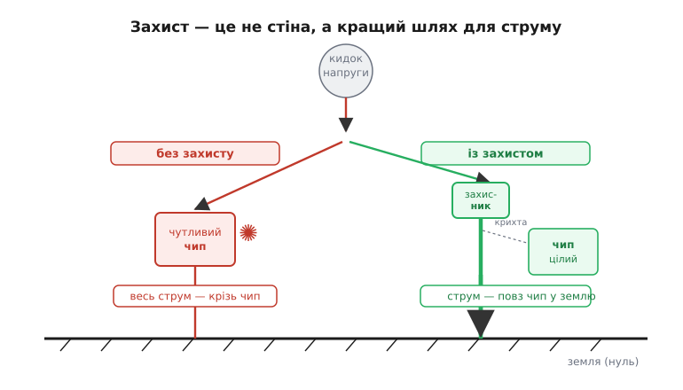
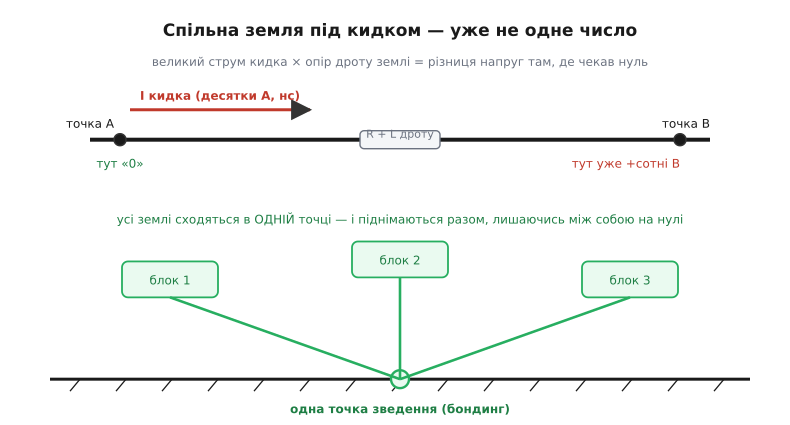
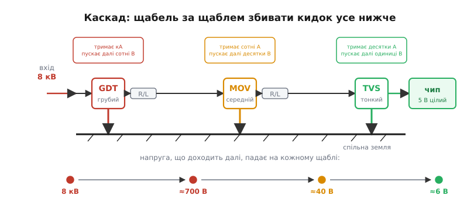

# Захист від блискавки

<preknowlist>
- [Індуктивна наводка](root:ph-electromagnetism/inductive-coupling) — змінне магнітне поле наводить напругу в дротяному контурі; що довша й ширша петля дроту, то більший наведений кидок.
</preknowlist>

Ми вже бачили, що [блискавка](root:ph-electromagnetism/lightning) — це не окрема стихія, а звичайний [пробій повітря](root:ph-electromagnetism/air-breakdown), лише розряд гігантського «конденсатора» з хмари, що зарядилася [розділенням заряду](root:ph-electromagnetism/triboelectricity). Зрозуміти явище — півсправи; тепер постає інженерне питання, з яким рано чи пізно стикається кожен, хто ставить електроніку поза кімнатою: **як від нього вберегтися**. І відповідь виявиться напрочуд гарною — той самий невеликий набір понять, яким ми вже володіємо (заряд, поле, пробій), складається в струнку стратегію захисту, що працює однаково на двох масштабах: від громовідводу на даху до крихітного діода біля ніжки чипа.

### Чого насправді боятися: рідкий прямий удар і часта наводка

Перше, що варто зробити, — позбутися хибної картинки. У голові «захист від блискавки» малюється як страх **прямого влучення**: грім ударив у пристрій — пристрій згорів. Прямий удар справді нищівний, але для електроніки він **рідкісний**: щоб блискавка влучила саме у твій давач на щоглі, має зійтися багато випадковостей. Куди частіша й підступніша загроза — **наводка** від удару, що стався поряд, навіть за сотні метрів.

Звідки вона береться, ми вже маємо чим пояснити. Зворотний удар несе [десятки кілоампер за мікросекунди](root:ph-electromagnetism/lightning) — а такий струм, що так швидко змінюється, створює навколо каналу потужне магнітне поле, що теж змінюється блискавично. А змінне магнітне поле, пронизуючи будь-який контур із дроту, наводить у ньому напругу — це [індуктивне наведення](root:ph-electromagnetism/inductive-coupling). Що довший дріт і що більшу площу він охоплює, то більший наведений кидок. Тому довга лінія живлення, антена, кабель давача від щогли до плати — це готова «петля-приймач», у якій близький удар наводить кидки на сотні й тисячі вольтів, не торкнувшись пристрою фізично.

Звідси й тверезий висновок про те, **що саме** ми захищаємо. У великому будівництві дбають про два різні лиха: щоб блискавка не **підпалила** будівлю (прямий удар) і щоб люди не потрапили під **крокову напругу** (про неї — далі). А в електроніці головний клопіт третій: **кидок напруги в проводах** від наведення. Це та сама фізика, що й [ESD-розряд, який убиває мікросхему](root:hw-components/esd-damage) непомітно, — лише джерело інше й енергії на порядки більше. Тому захист від блискавки для розробника — це переважно захист **входів і ліній** від кидків, а не споруда блискавковідводу.

> 🔧 **Навіщо це.** Це одразу міняє пріоритети. Метеостанція в полі, контролер воріт із довгим кабелем, LED-вивіска, зарядна станція, давач на даху — усі вони майже ніколи не ловлять прямий удар, але **постійно** ловлять наводки від далеких гроз. Тому 90% роботи із «захисту від блискавки» в реальному пристрої — це не громовідвід, а правильні **захисні елементи на входах** та грамотна **земля**. Громовідвід рятує будівлю; те, що описано нижче, рятує плату.

### Один принцип: не стіна, а кращий шлях

Тепер головна ідея, з якої виростає геть усе інше. Захиститися від розряду **не означає** поставити на його шляху непробивну стіну — такої стіни немає: ми ж бачили, що за достатньої напруги пробивається навіть повітря, а кілька сотень мільйонів вольтів блискавки знайдуть дорогу крізь майже будь-що. Тому захист будують на протилежній думці: не **перекрити** струмові шлях, а **дати йому інший**, заздалегідь обраний, безпечний — настільки легший за всі інші, що струм піде саме ним.


*Без захисту кидок шукає будь-який шлях у землю — і знаходить його крізь чутливий чип, спалюючи його. Захисник дає струмові короткий легкий обхід у землю; тепер майже весь заряд тече туди, а чипові лишається безпечна крихта. Захист — це конкуренція шляхів, а не перешкода.*

Ця думка проста, але глибока. Заряд завжди шукає, де стекти, — це ми бачили ще на [тихій провідності по вологій плівці проти іскри](root:ph-electromagnetism/air-breakdown): той самий заряд за різних умов обирає різний фінал. Захист — це навмисне **підлаштовування цього вибору**: ми ставимо поряд із чутливою річчю такий легкий шлях у землю, що струмові «вигідніше» піти ним, а не крізь чип. Звідси три дії, на які розкладається будь-який захист — і на даху, і на платі:

- **перехопити** — підставити розрядові заздалегідь обрану точку входу (вістря громовідводу; захисний елемент на вході плати);
- **провести** — відвести струм товстим, коротким, малоопірним провідником, щоб на ньому не встигла набратися велика напруга;
- **розсіяти** — врешті випустити заряд у землю (чи в спільний нуль), де він безпечно розтечеться.

Перехопити, провести, розсіяти. Усе подальше — лише варіації цих трьох дій на різних масштабах.

### Великий масштаб: громовідвід, земля, бондинг, клітка

Подивімось спершу, як ці три дії втілюються для **будівлі** — там вони наочні, а тоді ми побачимо ту саму схему в мініатюрі на платі.

**Перехопити** — це робота [громовідводу](root:ph-electromagnetism/air-breakdown): гострий заземлений стрижень вище за все довкола. Його гостре вістря, як ми знаємо, [згущує поле](root:ph-electromagnetism/air-breakdown) й або тихо стікає заряд короною, або, якщо удар усе ж стається, **приймає його на себе** — у заздалегідь обрану безпечну точку, а не у випадкову. Куди саме поставити перехоплювачі, інженери визначають простими геометричними правилами — уявним «конусом захисту» під стрижнем або «котючою кулею», яку подумки прокочують по об'єкту: чого куля не торкається, те в затінку перехоплювача. Суть одна — накрити захищуваний об'єм зоною, у якій удар перехопить стрижень, а не сам об'єкт.

**Провести** — найважливіше й найчастіше занедбане. Перехопити удар мало; його треба **відвести в землю так**, щоб уздовж шляху не виникло великої напруги. А тут підстерігає тонкість, яку ми вже зустрічали в [блискавці](root:ph-electromagnetism/lightning): великий імпульсний струм, тече він хоч по землі під ногами, хоч по товстій шині, **створює на ній різницю потенціалів**. Знайома логіка «струм крізь опір дає напругу», лише опором тут є сам провідник. І для імпульсу головне навіть не омічний опір, а **індуктивність** дроту: що довший провідник і що крутіший фронт струму, то більшу напругу він на собі «зніме». Тому провід до землі роблять **товстим, коротким і якомога прямішим**: кожен зайвий метр і кожен виток — це зайва напруга, що так і шукає, куди стрибнути іскрою.

**Розсіяти** — випустити струм у землю через **заземлювач**: вкопані штирі, контур, плита арматури. Що краще він розтікає струм у ґрунті, то нижче підскочить потенціал точки заземлення.

І тут з'являється четверта ідея, без якої перші три бувають небезпечні, — **зрівнювання потенціалів** (вирівнювання, бондинг). Коли по землі розтікаються десятки кілоампер, різні точки ґрунту опиняються під **різною** напругою: між двома точками на віддалі кроку виникає та сама [крокова напруга](root:ph-electromagnetism/lightning), що валить тварин поряд з ударом. Той самий підступ діє в будь-якій системі зі спільною «землею».


*Угорі: кидок струму тече вздовж земляного провідника, і через його опір та індуктивність точка A лишається «на нулі», а точка B уже піднята на сотні вольтів — «єдина земля» під час кидка розпадається на різні потенціали. Унизу: ліки — звести всі землі в ОДНУ точку (бондинг). Тоді під кидком уся система піднімається разом, лишаючись усередині себе на нулі — стрибати напрузі нема між чим.*

Суть бондингу в тому, що **різниця напруг шкодить, а спільний підйом — ні**. Якщо всі металеві частини й усі «землі» системи надійно з'єднані в **одну точку**, то під час кидка вони піднімаються в потенціалі **разом** — як пасажири в літаку, що набирає висоту: усім «високо», але один відносно одного ніхто не зрушив, тож ніщо нікого не б'є. Небезпечна не висока напруга сама собою, а **різниця** напруг між сусідніми точками, до яких водночас торкається людина чи виводи мікросхеми. Прибери різницю — і кидок стане нешкідливим, хай навіть усе разом скакнуло на тисячі вольтів.

І остання цеглина великого масштабу відкриває ще один прийом — **замкнути захищуване в суцільну провідну оболонку**. Авто чи літак під час грози поводяться напрочуд спокійно: удар б'є в метал і розтікається по **зовнішній** обшивці, а всередині поля немає, тож люди цілі (рятують саме провідні стінки, а не гумові шини). Таку замкнену провідну оболонку, що проводить струм по собі, а поля всередину не пускає, називають **[кліткою Фарадея](root:ph-electromagnetism/faraday-cage)** — з нею ми впритул познайомимося вже наступним кроком. Той самий прийом масштабують і на будівлі: арматура каркаса, з'єднана в суцільну сітку, утворює просторову клітку, що відводить струм по периметру й гасить поле всередині. Перехопити, провести, розсіяти, зрівняти — і накрити кліткою: ось уся стратегія великого масштабу.

### Той самий захист у мініатюрі: вхід плати

А тепер найцікавіше — побачити, що **на платі діє рівно та сама стратегія**, лише з мікроскопічними струмами й напругами. Кидок, наведений у довгому кабелі, приходить на вхід пристрою; чутливий чип витримує одиниці вольтів, а на лінії — сотні чи тисячі. Треба перехопити цей кидок, відвести його повз чип у спільний нуль і розсіяти — точнісінько три знайомі дії.

Перехоплювачем тут служить **захисний елемент**, увімкнений між сигнальною лінією та землею. Поки напруга в нормі, він наче не існує (величезний опір, струму крізь нього нема). Та щойно напруга перескакує безпечний поріг, він **різко відмикається** й «закорочує» кидок на землю, забираючи струм на себе й лишаючи чипові тільки безпечний залишок. Це той самий [керований пробій](root:ph-electromagnetism/air-breakdown), що й у [іскрового проміжку чи газового розрядника](root:hw-components/gdt): ми навмисно влаштовуємо легкий шлях у землю, який «запалюється» першим, аби розряд стався в обраному місці, а не крізь чип.

Захисні елементи бувають трьох типів, і кожен — це інженерний компроміс між тим, **скільки струму** він стерпить і **наскільки точно й швидко** обмежить напругу. Грубий і витривалий — [газовий розрядник (GDT)](root:hw-components/gdt): тримає кілоампери, але вмикається повільно й «відпускає» лінію аж на сотнях вольтів. Середній — [варистор (MOV)](root:hw-components/varistor): метал-оксидний елемент, що зі зростанням напруги різко падає опором; тримає сотні ампер і затискає лінію на десятках вольтів. Найточніший і найшвидший — [TVS-діод](root:hw-components/tvs-diode): спрацьовує за наносекунди й затискає напругу майже намертво на рівні, що його чип уже стерпить, — але великого струму не витримує.

> 🔧 **Навіщо це.** Жоден із трьох сам по собі не закриває задачу: GDT витривалий, та пускає на чип забагато; TVS затискає ідеально, та згорає від великого струму. Тому в серйозному захисті входу їх **поєднують**, і саме в цьому інженерна сіль — не в окремій деталі, а в їхній **узгодженій грі**.


*Каскад на вході. Грубий GDT приймає головний струм (кілоампери) і збиває кидок із кіловольтів до сотень вольтів. Послідовний опір (R/L) між щаблями змушує напругу «впасти» на ньому й розв'язує щаблі в часі. Середній MOV збиває залишок до десятків вольтів, тонкий швидкий TVS — до одиниць, які чип уже витримає. Кожен щабель бере свою частку струму й передає далі все менший кидок.*

Чому саме каскадом, а не одним «найкращим» елементом? Бо тут знов працює думка про **поділ праці за струмом і точністю**. Перший, грубий щабель приймає на себе основну лавину струму й грубо збиває кидок — від нього не вимагають точності, лише витривалості. Між щаблями ставлять невеликий **послідовний опір або дросель**: на ньому решта напруги «падає» (знову V = I·Z, лише тепер нам це на руку), і він же **розв'язує щаблі в часі** — поки швидкий TVS уже затиснув свій малий струм, повільніший GDT якраз встигає ввімкнутись і перебрати основний удар на себе. Останній, тонкий щабель працює вже з краплею того, що лишилось, і доводить напругу до рівня, безпечного для чипа. Грубий бере силу, тонкий дає точність, опір між ними їх мирить — ось чому каскад витримує те, що жоден елемент поодинці не подужав би.

**Приклад (що лишається чипові після каскаду).** На вхід прийшов наведений кидок ≈ 8 кВ. Подивімось, як його збиває триступеневий захист:

```
вхід:                        8000 В
після GDT (грубий, ~kA):    ≈ 700 В   ← збив головну лавину, але для чипа це смерть
після MOV (середній):       ≈  40 В   ← збив залишок, ще трохи забагато
після TVS (тонкий, ~нс):    ≈   6 В   ← рівень, який чип на 5 В уже стерпить
```

Жоден щабель не зробив усієї роботи: GDT збив тисячі вольтів, але лишив сотні; MOV дотиснув до десятків; і лише TVS довів до одиниць. Вісім кіловольтів на вході — шість вольтів на чипі: саме поділ праці, а не один герой, рятує вхід.

### Земля й бондинг на платі: та сама пастка масштабом менша

Лишилось перенести на плату дві останні ідеї великого масштабу — **проводити коротко** й **зрівнювати потенціали**, — і захист входу стане цілісним. І тут новачок робить найтиповішу помилку: ставить чудовий TVS, але **далеко** від роз'єму, з'єднуючи його із землею довгою тонкою доріжкою.

Чому це майже зводить захист нанівець, ми вже маємо чим пояснити. Кидок — це струм у десятки ампер, що наростає за наносекунди; коли він біжить довгою доріжкою землі до TVS і назад, на **індуктивності** цієї доріжки встигає набратися велика напруга (та сама причина, що змушує робити спуск громовідводу коротким). У підсумку чип бачить не «затиснуті TVS-ом 6 вольтів», а ці 6 вольтів **плюс** кидок, що наскочив на індуктивності петлі землі, — десятки чи сотні зайвих вольтів. Захисник спрацював чудово, та довгий шлях у землю все зіпсував. Тому правило тверде: захисний елемент ставлять **щонайближче до точки входу**, а до землі ведуть **коротким товстим** провідником із мінімальною петлею. Кінчик — деталь; шлях у землю — суть.

Друга ідея, бондинг, на платі звучить як **єдина опорна земля**. Якщо «земля» однієї частини схеми сполучена з «землею» іншої довгим звивистим шляхом, то під час кидка ці дві землі на мить опиняться під **різною** напругою — точнісінько як точки ґрунту під крокову напругу, лише в мікромасштабі. І чутливий вузол, увімкнений між двома такими «землями», дістане різницю просто в себе. Ліки ті самі, що й для будівлі: звести всі землі **в одну точку** (зіркою чи суцільним полігоном-землею), щоб під кидком уся плата піднімалась у потенціалі **разом**, лишаючись усередині себе на нулі. Підіймається все гуртом — стрибати напрузі нема між чим.

А поверх усього — та сама клітка Фарадея, тепер кишенькова: металевий екранований корпус пристрою, з'єднаний зі спільною землею, відводить наведені поля по обшивці й не пускає їх до плати — той самий захист, що рятує людей у машині під грозою, лише розміром із прилад. А чутливі чипи й возять у [металізованих антистатичних пакетах](root:ph-electromagnetism/faraday-cage) — кишеньковій клітці Фарадея проти статики.

### Одна стратегія на всі масштаби

Варто на мить охопити поглядом усе разом — і впізнати, що велике й мале тут зроблені за **одним лекалом**. Захист від блискавки — це не вміння поставити непробивну стіну (її немає), а вміння **дати розрядові кращий шлях, ніж крізь те, що бережемо**: перехопити в обраній точці, провести коротко й малоопірно, розсіяти в землю, зрівняти потенціали, щоб не лишилось різниць, і за змоги накрити кліткою Фарадея. Громовідвід, його товстий спуск, заземлювач, бондинг каркаса й арматурна клітка будинку — це рівно ті самі п'ять дій, що TVS на вході, коротка товста доріжка до землі, спільний полігон-земля й екранований корпус плати. Той самий [пробій](root:ph-electromagnetism/air-breakdown), та сама [клітка Фарадея](root:ph-electromagnetism/faraday-cage), та сама арифметика «струм крізь опір дає напругу» — лише числа різняться на порядки.

> 📜 Громовідвід має на диво чітку дату народження — і повчальну історію того, як суперечка про дрібну деталь (гострий кінчик чи тупий) переросла з фізики в політику й затьмарила головне. Хто справді що винайшов, чому форма кінчика виявилась майже неважливою, а заземлення — вирішальним: [Громовідвід: гостре проти тупого](root:embedded/lightning-protection/hist-franklin-rod.md).
