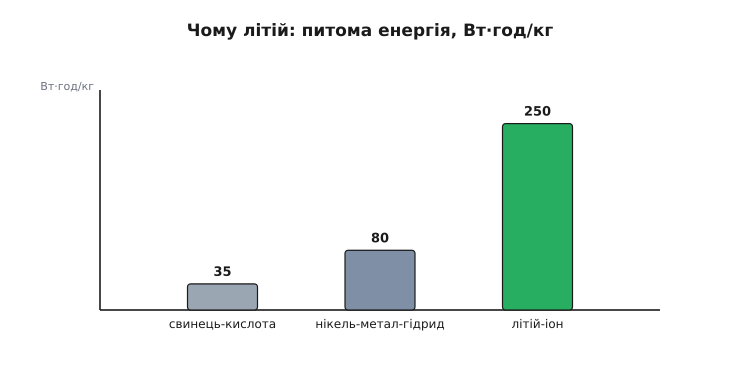
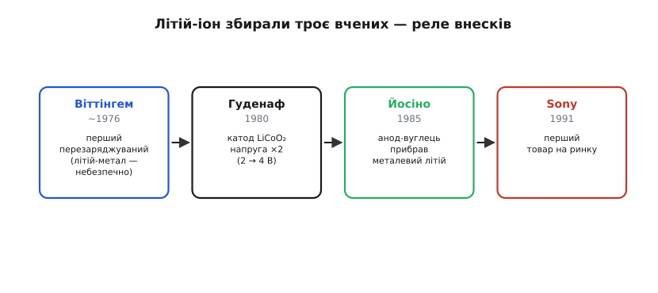
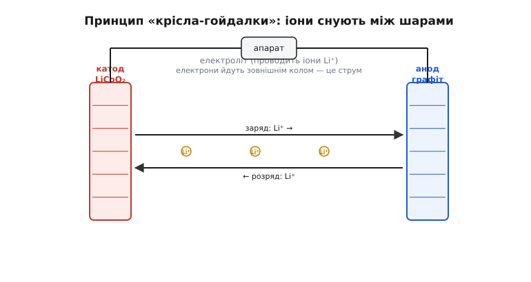
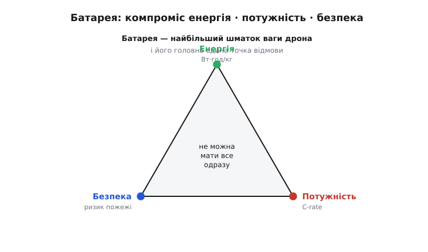

# Історія: літій-іонний акумулятор — Нобель 2019

Найкритичніша єдина точка відмови автономного апарата — це **живлення**, а в розкладці ваги дрона батарея — найбільший шматок. Це не дрібниця конструкції, а **фундамент**: ціла епоха портативної електроніки, від смартфона до дрона й електромобіля, стоїть на одному винаході — перезаряджуваному **літій-іонному акумуляторі**. Його творцям — трьом ученим, що працювали в різні десятиліття на різних континентах, — у 2019 році присудили Нобелівську премію з хімії. Один із них отримав її у **97 років**, ставши найстарішим лауреатом в історії.

Це історія не про хімію заради хімії, а про **ланцюг ідей**: чому енергію так важко возити із собою; чому саме літій; як зробити батарею, що не горить і заряджається сотні разів; і чому без цього винаходу не було б ані телефона в кишені, ані дрона в небі.

---

## Вузьке місце: чому енергію важко возити із собою

Електрику легко зробити й легко спожити. Найважче — **накопичити** її так, щоб взяти з собою. У цьому й полягає вузьке місце всього портативного: апарат може мати геніальний мозок і потужні мотори, але літатиме рівно стільки, скільки протримає його батарея. Дрон — найяскравіший приклад: за вагою він **здебільшого акумулятор**, а час польоту впирається не в розум, а в запас енергії на борту.

Ключова величина тут — **питома енергія**: скільки ват-годин енергії припадає на кілограм ваги. Що вона більша, то довший політ за ту саму вагу — або та сама тривалість за меншої ваги. Уся історія акумуляторів — це гонитва за цим числом. І не можна просто «взяти більшу батарею»: вона важча, а важчий апарат потребує більшої тяги, що з'їдає додаткову енергію, — виграш швидко тане. Тому час польоту впирається саме в **щільність** енергії, а не в її кількість: важить не скільки всього енергії, а скільки її на кожен грам ваги. Поки питома енергія була малою, серйозний електричний політ був просто неможливий — ніяка гора свинцевих банок не підняла б сама себе надовго. І довго це число лишалося ганебно малим: свинцево-кислотний акумулятор (той, що в авто) дає лише близько 35 Вт·год/кг — возити ним щось у повітря безнадійно. Потрібен був стрибок у рази, і він прийшов з найлегшого металу таблиці.

> 🔧 **Навіщо це.** Тримай у голові: **час польоту апарата — це передусім питома енергія його батареї**. Тому в дрона батарея найважча й найдорожча, тому її так бережуть і тому вона ж — головна точка відмови, заради якої будують [резервування критичних вузлів](topic:sf-devices/redundancy). Уся інженерія живлення, по суті, про те, як цю енергію возити, перетворювати й не спалити апарат.

---

## Чому саме літій: найлегший і найенергійніший метал

Відповідь — у таблиці Менделєєва. **Літій** (*lithium*, Li) — третій елемент, **найлегший із металів**. А ще він найохочіше з усіх металів **віддає свій зовнішній електрон** — тобто має найбільший електрохімічний «тиск», а отже, дає найвищу можливу напругу. Поєднання «дуже легкий» + «дуже енергійний» і робить його ідеальним для батареї: максимум енергії на кожен грам.

Для відчуття масштабу: хімічна енергія бензину разів у п'ятдесят щільніша за літій — але двигун важкий і неефективний, шумить і смердить, а електромотор тихий, простий і майже без втрат. Тому, програючи бензину в самій щільності палива, електричний привід виграє в усьому іншому — і чекав лише на батарею, гідну його. Літій-іон і став тією батареєю.

*Чому переміг літій. Він найлегший серед металів і найсильніше «прагне» віддати електрон — звідси найвища напруга й найбільша енергія на кілограм. Порівняння питомої енергії промовисте: свинцево-кислотний близько 35 Вт·год/кг, нікель-метал-гідрид близько 80, а літій-іонний 250 і більше. Саме цей стрибок у рази й зробив можливою портативну електроніку.*

Але в цього дару була зворотна сторона, через яку літій десятиліттями не давався в руки інженерам: він **надзвичайно реактивний**. Чистий літій-метал бурхливо реагує з водою й повітрям, легко займається, а в батареї поводиться підступно. Уся драма раннього винаходу — це боротьба за те, щоб приборкати енергійний, але небезпечний літій. І перший, хто його осідлав, зробив це у несподіваному місці — у нафтовій компанії.

---

## Нафтова криза дала іскру: Віттінгем

На початку 1970-х світ струснула **нафтова криза**, і — парадокс історії — саме нафтовий гігант **Exxon** вклався в пошук альтернатив, найнявши хіміків шукати нові способи зберігати енергію. Серед них був британець **Стенлі Віттінгем** (*M. Stanley Whittingham*).

Віттінгем зробив перший **перезаряджуваний** літієвий акумулятор (близько 1976 року). Його ключова ідея — **інтеркаляція**: він узяв катод із дисульфіду титану (TiS₂), що має шарувату структуру, у проміжки якої можуть **заходити й виходити** іони літію, не руйнуючи матеріал. Анодом служив чистий **літій-метал**. Батарея працювала й давала близько 2 вольтів — на ті часи відмінно.

Сама ідея інтеркаляції була проривом. У звичайній батарейці електроди в реакції **руйнуються** — тому її не зарядиш назад. А Віттінгем зробив так, що іони просто **вселяються** в готову кристалічну «полицю» електрода й виселяються з неї, не ламаючи її, — а отже, процес став оборотним. Це і є зерно перезаряджуваності, яке потім розвинули наступники.

Та був і ґандж, фатальний для масового продукту. Чистий літій-метал на аноді при повторних зарядах ріс **дендритами** — голчастими наростами, що зрештою прохромлювали батарею наскрізь, замикали її й спричиняли **загоряння**. В Exxon траплялися пожежі, і небезпечну технологію поклали на полицю; а коли нафта подешевшала, компанія й зовсім згорнула проєкт. Перший крок було зроблено — батарея заряджалася, — але приборкати літій до кінця не вдалося. Бракувало двох цеглинок, і їх додали інші.

> 🔧 **Навіщо це.** Дендрити й пожежі — не архаїка: сучасні літієві акумулятори досі бояться перезаряду, проколу й короткого, бо в них багато енергії в малому об'ємі. Звідси вся обережність із LiPo на дронах: їх не можна перезаряджати, проколювати чи кидати — енергія, яку ми так цінуємо за щільність, при аварії виходить назовні вибухом і вогнем.

---

## Стрибок Гуденафа: удвічі більше напруги

Наступну цеглинку додав американець (родом, утім, із давньої наукової традиції) **Джон Гуденаф** (*John B. Goodenough*), що працював тоді в **Оксфорді**. Він поставив питання: а що, як замість сульфіду взяти **оксид металу**? І 1980 року показав, що шаруватий **кобальтат літію** (LiCoO₂) тримає іони літію за значно **вищої** напруги.

Наслідок був величезний: напруга **подвоїлася** — приблизно з 2 до 4 вольтів, — а отже, і запасена енергія різко зросла. Саме катод Гуденафа (LiCoO₂) запустив **споживчу** літій-іонну еру й донині панує в телефонах та ноутбуках. (А у великих застосунках — електромобілях і накопичувачах — нині переважають інші катоди: NMC, NCA й літій-залізо-фосфат LFP; останній, до речі, теж винахід Гуденафа.) Це був стрибок від «цікаво» до «потужно».

Постать Гуденафа варта окремого слова. Він прийшов у хімію батарей **пізно** — за п'ятдесят, після цілої кар'єри у фізиці: працював над магнітною пам'яттю перших комп'ютерів, вивів відомі правила магнетизму. Лише очоливши хімічну лабораторію в Оксфорді, він узявся за акумулятори — і зробив ключовий внесок у віці, коли інші виходять на пенсію. Він не спинявся й далі: у 1990-х, уже в Техасі, співстворив іще безпечніший катод (літій-залізо-фосфат). А Нобеля отримав, досі працюючи в лабораторії, у 97 — жива легенда впертості в науці.

Лишалося прибрати небезпечний літій-метал з анода — і тут на сцену вийшов третій герой.

---

## Йосіно прибирає небезпеку: і ось він, товар

Японський хімік **Акіра Йосіно** (*Akira Yoshino*) у 1985 році зробив рішучий крок: він **викинув із батареї чистий літій-метал зовсім**. Замість небезпечного металевого анода він узяв **вуглець** (спершу нафтовий кокс, згодом графіт), у шари якого, як і в катод, можуть заходити іони літію.

Це змінило все. Тепер **ніде** в батареї не було металевого літію — лише його **іони**, що снували між двома шаруватими електродами. Головну причину пожеж — дендрити з літій-металу — було прибрано, а ризик різко впав. (Цілком він не зник: на графітовому аноді літій усе ж може осідати металом і рости дендритами за швидкого заряду, на морозі, при перезаряді чи від старіння — тому протокол заряду й лишається строгим.) Поєднавши катод Гуденафа (LiCoO₂) з вуглецевим анодом, Йосіно зібрав перший **по-справжньому придатний** літій-іонний акумулятор: потужний, безпечний і перезаряджуваний сотні разів.

*Як збирали літій-іонний акумулятор — реле з трьох внесків. Віттінгем (близько 1976) зробив перший перезаряджуваний, але небезпечний (літій-метал). Гуденаф (1980) подвоїв напругу катодом LiCoO₂. Йосіно (1985) прибрав металевий літій, замінивши анод вуглецем, — і зробив батарею безпечною. А компанія Sony 1991 року вивела її на ринок. Без будь-якого з трьох учених сучасної батареї не було б.*

Останню цеглинку — **товар** — додала компанія **Sony**, що 1991 року випустила перший комерційний літій-іонний акумулятор (спершу для відеокамер). Звідти й почалася лавина: мобільні телефони, ноутбуки, а згодом — електромобілі, накопичувачі для сонячних панелей і, звісно, дрони.

> 🔧 **Навіщо це.** Ця історія — ще один доказ думки, що пронизує всю інженерію (як і [багатошаровий код ArduPilot](topic:sys-dron/ardupilot-layers)): великі речі **збирають** із внесків багатьох, а не винаходять поодинці. Жоден із трьох сам не дав би робочої батареї — потрібні були всі три цеглинки плюс інженери Sony. Та й «трьох» — це спрощення Нобеля-2019: **графітовий** анод сучасних батарей дав **Рашид Язамі** (*Rachid Yazami*), а до серійного товару елемент довів інженер Sony **Йосіо Нісі** (*Yoshio Nishi*) — недарма інженерну премію Дрейпера 2014 року присудили саме цій **четвірці** (Гуденаф, Йосіно, Язамі, Нісі).

---

## Як це працює: «крісло-гойдалка»

Чому ж літій-іонний акумулятор можна заряджати **сотні разів**, тоді як звичайна батарейка вмирає за один? Уся хитрість — в **інтеркаляції**, тій самій ідеї шаруватих електродів.

*Принцип «крісла-гойдалки». Між двома шаруватими електродами (катод LiCoO₂ і анод-графіт) лежить електроліт, що проводить іони. При заряді іони літію виходять із катода, пливуть крізь електроліт і ковзають у шари анода; при розряді вони пливуть назад, а вивільнені електрони йдуть зовнішнім колом — і живлять апарат. Іони лише «гостюють» у шарах, не руйнуючи їх, тож цикл можна повторювати знову й знову.*

Ось чому це працює оборотно: іони літію **не вступають у руйнівну реакцію**, а просто **ковзають** у проміжки кристалічної решітки електрода й назад, наче гості, що заходять у кімнату й виходять, не ламаючи стін. Туди-сюди, заряд-розряд — звідси й образна назва «батарея-гойдалка» (*rocking-chair battery*). Електрони ж тим часом змушені йти **зовнішнім** колом (бо крізь електроліт їм зась) — і саме цей потік електронів і є струм, що живить мотори й електроніку.

Варто додати, що між електродами лежить **рідкий електроліт** — і саме він зазвичай і горить при аварії: органічна рідина, що чудово проводить іони, але легко займається. Тому між електродами ставлять тонкий **сепаратор**, який не дає їм торкнутися (бо дотик — це коротке й пожежа), а вся «архітектура безпеки» — від сепаратора до схем захисту — стереже, щоб енергія виходила лише через зовнішнє коло, а не вибухом. Звідси й сучасні пошуки **твердого** електроліту, що не горить узагалі.

> 🔧 **Навіщо це.** Розуміння «іони ковзають у шари» пояснює багато практичного: чому акумулятор має **скінченне число циклів** (з кожним шари потроху псуються), чому його шкодить **глибокий розряд** і **перезаряд** (вони виштовхують іони занадто далеко й ушкоджують решітку), і чому батарея **старіє** навіть просто лежачи. Це не «чорна скринька», а фізичний процес із зрозумілими межами.

---

## Чому це змінило все — і що з цього в нашому апараті

Здавалося б, ще одна батарея. Але стрибок питомої енергії в рази **відкрив** те, що доти було неможливим: складну електроніку стало можливо носити в кишені, а потужні мотори — піднімати в повітря на власному запасі енергії. Для апаратів із цього курсу літій-іонний акумулятор (а точніше його «дроновий» різновид — **літій-полімерний**, LiPo, що вміє ще й віддавати струм дуже швидко) став **третьою ногою** дронової революції — поряд із [безколекторним мотором](topic:hw-motion/bldc-motor) і [регулятором обертів](topic:hw-motion/esc).

*Батарея — серце й слабке місце апарата водночас. Вона — найбільший шматок ваги дрона, а отже, головний чинник часу польоту. Але за енергію платять компромісом: більша щільність енергії змагається з потужністю (C-rate) і з безпекою (ризик пожежі). Не можна мати все одразу — і саме тому батарея лишається найкритичнішою єдиною точкою відмови.*

Але та сама щільність енергії, що дарує політ, робить батарею й **небезпечною**: уся ця енергія в малому об'ємі при аварії виходить вогнем. Звідси вічний компроміс дронового живлення — **енергія проти потужності проти безпеки**. Літій дав нам крила, але змусив поводитися з ним шанобливо.

Масштаб того, що відкрив цей винахід, важко переоцінити. За три десятиліття літій-іонні акумулятори подешевшали в десятки разів і помітно наростили щільність — і це уможливило не лише гаджети, а й **електромобілі** та зберігання енергії з сонця й вітру, тобто крок до світу без викопного палива (так це й сформулював Нобелівський комітет). Для дрона ж важлива не сама лише енергія, а й **потужність**: LiPo вміє віддавати струм дуже швидко (висока «C-rate»), щоб нагодувати мотори на ривку, — але платить за це коротшим ресурсом, просіданням напруги під навантаженням і вимогливістю до догляду. Усі ці компроміси — енергія, потужність, безпека, ресурс — і визначають інженерію дронового живлення. А історія не скінчилась: інженери досі шукають батарею ще щільнішу й безпечнішу (твердотільні без рідкого електроліту, що горить; натрій-іонні без дорогого літію), та поки що саме літій-іонний лишається тим, на чому тримається кожен дрон.

А визнання прийшло пізно, але гучно: **Нобелівська премія з хімії 2019 року** — Гуденафу, Віттінгему та Йосіно, «за розробку літій-іонних акумуляторів». Гуденафу на той час було **97 років** — він став найстарішим нобелівським лауреатом за всю історію премії, доказ, що велика наука не має віку.

Знати, **звідки** взялася енергія на борту й **чому** з нею треба обережно, — лише половина справи. Друга половина — інженерія живлення: як цю енергію перетворювати без втрат, розводити по апарату й берегти. Бо мати добру батарею — це ще не все; решту робить усе, що стоїть між нею й рештою апарата.
