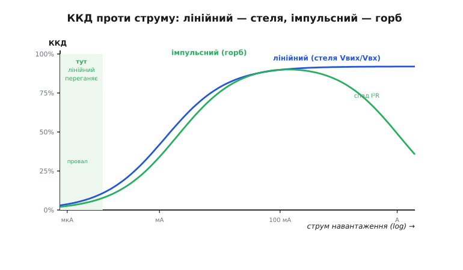

# Перетворення енергії: лінійний vs імпульсний — глибше

У базовому кроці ми з'ясували головне: батарея дає одну плавну напругу, а апарату треба кілька стабільних, тож на ньому завжди стоять перетворювачі. І що будувати їх можна двома способами — **лінійним** (гасить різницю в тепло, ККД = Vвих/Vвх) або **імпульсним** (переносить енергію пакетами, ККД зазвичай 85–95%). Для батареї, де кожен ват і кожен градус на рахунку, важку роботу робить імпульсний.

Тепер розберемо це **по-справжньому**. Базове «лінійний палить різницю» — правда, але груба: насправді і лінійний має тонкощі, від яких залежить, чи запуститься апарат, і в лінійного бувають **чотири** різні втрати, не одна. «Імпульсний тримає 90%» — теж правда лише в певному вікні струму; поза ним ККД валиться, і треба знати чому. Ми виведемо кожну формулу на очах, розберемо межові випадки (коли лінійний раптом ефективніший за імпульсний; коли імпульсний перестає бути імпульсним і починає гріти діод; коли dropout з'їдає весь запас), і побачимо, як інженер комбінує обидва типи в одне **дерево живлення**.

Нитку веду так: спершу — точна механіка лінійного (усі його втрати, dropout, PSRR, теплова межа); тоді — точна механіка імпульсного (звідки береться Vвих = D·Vвх, чому котушка, CCM проти DCM, повний облік втрат); тоді — чесне зіставлення на кривій ККД проти струму; і нарешті — як їх поєднують і як усе це ламається.

## Лінійний стабілізатор: чотири втрати, а не одна

Базово ми сказали: лінійний гасить (Vвх − Vвих)·I у тепло. Це головна втрата, але не єдина. Розберімо прохідний елемент точніше.

Прохідний транзистор працює в **лінійному** (активному) режимі — звідси й назва. Він не перемикається між «повністю відкрито» й «повністю закрито», як ключ імпульсного; він стоїть **напіввідкритий** і поводиться як керований резистор, чий опір контур зворотного зв'язку підбирає щомиті так, щоб на виході трималася задана напруга. Уся напруга, що падає на цьому «резисторі», помножена на струм крізь нього, розсіюється в кристалі.

**Втрата 1 — прохідна (головна).** Це та сама (Vвх − Vвих)·Iнав. Вона лінійно росте з перепадом і зі струмом навантаження. Саме вона робить ККД = Vвих/Vвх, бо корисно віддається Vвих·Iнав, а всередині гине (Vвх−Vвих)·Iнав, і відношення корисного до всього — рівно Vвих/Vвх (струм майже однаковий на вході й виході, лінійний його не множить).

**Втрата 2 — на власне живлення (quiescent).** Сам стабілізатор — це схема: джерело опорної напруги, підсилювач похибки, дільник. Вона живиться від входу й бере струм **Iq** (*quiescent current*, струм спокою) навіть коли навантаження нуль. Цей струм тече з входу на землю, оминаючи вихід, тож він — чиста втрата. У потужному застосуванні Iq (одиниці міліампер) на тлі ампера навантаження — дрібниця. Але в режимі сну апарата, коли навантаження — мікроампери, Iq стає **головним** споживачем і вирішує термін життя від батареї.

**Втрата 3 — струм землі (ground current).** Частина струму, яку прохідний елемент бере з входу, іде не у вихід, а в землю через саму мікросхему. Для біполярних LDO це помітно: щоб тримати прохідний PNP-транзистор відкритим, у його базу треба гнати струм, і цей базовий струм витікає в землю. Він росте зі струмом навантаження й може сягати кількох відсотків від нього — ще один шматок, що не доходить до виходу.

**Втрата 4 — динамічна, на перехідних.** Коли навантаження стрибає, контур не встигає миттєво, вихід просідає чи підскакує, і на згладжувальних конденсаторах виділяється трохи енергії. У сталому режимі цієї втрати нема, але вона впливає на якість шини.

Зведімо в чесну формулу ККД лінійного:

```
повний струм входу:   Iвх = Iнав + Iq + Iground
корисна потужність:   Pкор = Vвих · Iнав
повна від входу:       Pвх  = Vвх · Iвх = Vвх · (Iнав + Iq + Iground)

ККД = Pкор / Pвх = (Vвих · Iнав) / (Vвх · (Iнав + Iq + Iground))
```

Коли Iнав ≫ Iq (потужний режим), Iq і Iground зникають, і лишається знайоме ККД ≈ Vвих/Vвх. Але коли Iнав малий, знаменник роздувають саме Iq та Iground, і ККД падає **навіть без глибокого перепаду**. Ось чому «лінійний ефективний на малому перепаді» — половина правди: на малому перепаді **й помітному струмі** так, а на малому перепаді й **крихітному** струмі його ефективність з'їдає власне споживання.

> 🔧 **Навіщо це.** Коли добираєш LDO для шини, що живить сплячий мікроконтролер (одиниці мікроампер у сні), дивись у даташиті не на dropout і не на ККД під навантаженням, а на **Iq**. LDO з Iq = 1 мкА і LDO з Iq = 50 мкА за однакового виходу поводяться однаково під навантаженням, але в сні перший протримає батарею в п'ятдесят разів довше на власне живлення регулятора. Це типова пастка: беруть «хороший» LDO за точністю, а він тихо саджає батарею струмом спокою.

### Напруга падіння (dropout): межа, за якою лінійний здається

Ми згадували dropout у базовому кроці — тепер розберемо його як фізику. Прохідний транзистор — не ідеальний ключ; навіть повністю відкритий, він має мінімальне падіння напруги, бо крізь напівпровідник струм тече лише за якоїсь різниці потенціалів. **Напруга падіння** (*dropout voltage*) — це мінімальна Vвх − Vвих, за якої стабілізатор ще тримає вихід у нормі. Опустиш вхід ближче до виходу — прохідний елемент уже повністю відкритий, а різниці бракує, і вихід починає **сповзати за входом**, стабілізація зникає.

Звідки береться dropout, залежить від того, який транзистор прохідний:

```
класичний стабілізатор (NPN або дарлінгтон зверху):
  прохідний елемент — емітерний повторювач, йому треба Vбе + запас на керування
  dropout ≈ 1.5 … 2.5 В   (дарлінгтон — два переходи, ще гірше)

LDO (PNP або P-канальний MOSFET зверху):
  прохідний елемент відкривається «навстіж», падіння = Iнав · Rпрох
  dropout ≈ Iнав · Rds(on)   →  частки вольта, і залежить від струму
```

Ключова відмінність: у справжнього LDO (*Low-DropOut*) dropout — це не фіксований «поріг напруги», а **омічне падіння** Iнав·Rпрох на повністю відкритому транзисторі. Тобто dropout LDO **росте зі струмом**: на 100 мА він може бути 100 мВ, а на 1 А — вже цілий вольт. Це критично для батарейного апарата: коли батарея сідає й Vвх наближається до Vвих, першим здається саме прохідний елемент, і то тим раніше, чим більший струм тягне навантаження.

**Приклад (коли батарея «сіла» через dropout, а не через розряд).** Живимо 3.3 В логіки від однобаночного Li-ion через LDO з Rпрох = 0.3 Ом; навантаження — 0.5 А:

```
dropout за цього струму:  Vdrop = 0.5 А × 0.3 Ом = 0.15 В
мінімальний вхід:          Vвх(min) = Vвих + Vdrop = 3.3 + 0.15 = 3.45 В

Li-ion повний:   4.2 В  → запас 0.75 В, усе гаразд
Li-ion на 3.5 В: запас лише 0.05 В  → на піку струму LDO вже випадає
Li-ion на 3.4 В: Vвх < Vвх(min)     → вихід сповзає, логіка бачить < 3.3 В
```

Батарея ще має заряд (3.4 В — це десь 20–30% для Li-ion), а апарат уже «вимикається» — не тому, що енергія скінчилася, а тому, що LDO втратив запас на dropout. Тому для шин, де вхід лише трохи вищий за вихід, беруть LDO з якнайменшим Rпрох, а іноді взагалі відмовляються від лінійного на користь імпульсного, який уміє й підняти напругу.

### PSRR: за що ще люблять лінійний

У базовому кроці ми сказали: лінійний тихий, тому його ставлять для давачів. Тепер — чому саме. Крім того, що лінійний **сам** майже не шумить (нема перемикань), він ще й **прибирає** шум, що приходить із входу. Ця здатність зветься **PSRR** (*Power Supply Rejection Ratio*, коефіцієнт подавлення нестабільності живлення): наскільки коливання на вході послаблюються на виході.

Механізм — той самий зворотний зв'язок. Контур міряє вихід і підкручує прохідний транзистор швидше, ніж встигає пролізти вхідна пульсація, тож більшу її частину «з'їдає» на прохідному елементі. PSRR = 60 дБ означає, що пульсація 100 мВ на вході стане 0.1 мВ на виході (послаблення в 1000 разів). Але PSRR — не одне число, а **крива від частоти**: на низьких частотах він великий (контур встигає), а з ростом частоти падає, бо контур має скінченну швидкодію й перестигає за швидкими коливаннями.

Ось чому зв'язка «імпульсний + LDO на хвості» така поширена. Імпульсний ефективно робить, скажімо, 3.6 В з батареї, але лишає на них свою **пульсацію перемикання** на сотнях кілогерц. LDO після нього не додає майже ККД-втрат (перепад 3.6 → 3.3 малий), зате його PSRR **зрізає ту пульсацію**, і давач отримує чисті 3.3 В. Тобто лінійний тут працює не як перетворювач енергії, а як **активний фільтр**. Наскільки добре він її зріже — залежить від того, чи частота пульсації імпульсного потрапляє в зону, де PSRR цього LDO ще високий; для сотень кілогерц потрібен LDO з добрим високочастотним PSRR, звичайний старий 78xx тут майже не допоможе.

> 🔧 **Навіщо це.** Побачив на платі LDO одразу після імпульсного перетворювача, хоча перепад напруг зовсім малий і «ефективності» тут нема — не поспішай називати це помилкою. Швидше за все, LDO стоїть **навмисне як фільтр**: зрізати пульсацію імпульсного перед чутливим вузлом (АЦП, радіо, опорна напруга). Викинеш його «для економії місця» — отримаєш шум там, де його щойно не було.

## Імпульсний перетворювач: звідки береться вся математика

Тепер найцікавіше — виведемо роботу імпульсного не на словах, а з першопринципів. У базовому кроці ми сказали: ключ ріже вхід, котушка запасає, діод замикає, конденсатор згладжує, а шпаруватість задає вихід. Розберемо, **чому** саме так виходить, і виведемо головну формулу Vвих = D·Vвх.

Повну внутрішню механіку — усі топології, режими, контур керування — докладно розбирає окрема стаття [про внутрішній устрій імпульсного перетворювача](book:electronics/switching-converter); тут ми виводимо рівно те, що потрібно, аби чесно **порівняти** його з лінійним і зрозуміти, коли який ефективніший.

### Головна умова: вольт-секундний баланс на котушці

Уся магія тримається на одному законі. Напруга на котушці пов'язана зі швидкістю зміни струму крізь неї:

```
V_L = L · (dI/dt)
```

Це просто означення індуктивності: щоб змінити струм у котушці, треба прикласти напругу, і що більша напруга — то швидше росте струм. Тепер ключова думка: у **сталому режимі** (перетворювач працює давно, вихід стабільний) струм у котушці за кожен повний цикл перемикання повертається до того самого значення. Він пилкою росте й спадає, але через період — там само, де був. А якщо струм за цикл не змінюється сумарно, то й **сумарна зміна dI за цикл нульова**. Звідси:

```
за фазу ON  (ключ відкритий, час t_on):   струм росте, V_L = V_on
за фазу OFF (ключ закритий, час t_off):    струм спадає, V_L = V_off

сумарна зміна струму за цикл = 0:
  (V_on / L) · t_on + (V_off / L) · t_off = 0
  →  V_on · t_on = − V_off · t_off
```

Це **вольт-секундний баланс**: добуток напруги на час за фазу накачування дорівнює (з протилежним знаком) добутку за фазу віддачі. Котушка не може мати сумарного «перекосу» напруги в часі, інакше струм у ній ріс би необмежено. Уся арифметика перетворювачів — просто цей баланс, розписаний для конкретної схеми.

### Buck (знижувальний): Vвих = D · Vвх

Застосуймо баланс до знижувального перетворювача. Позначимо **D** = t_on / T — **шпаруватість** (*duty cycle*), частку періоду, коли ключ відкритий. Розберемо, що бачить котушка у двох фазах:

```
buck: котушка ввімкнена між вузлом-ключем і виходом

фаза ON  (ключ відкритий, час D·T):
  один кінець котушки на Vвх, другий на Vвих
  V_L = Vвх − Vвих   (котушка накачується, струм росте)

фаза OFF (ключ закритий, час (1−D)·T):
  ключ відрізав вхід; діод відкрився й притиснув лівий кінець до землі (≈0)
  V_L = 0 − Vвих = −Vвих   (котушка віддає, струм спадає)

вольт-секундний баланс:
  (Vвх − Vвих) · D·T + (−Vвих) · (1−D)·T = 0
  (Vвх − Vвих) · D  = Vвих · (1−D)
  D·Vвх − D·Vвих = Vвих − D·Vвих
  D·Vвх = Vвих
  →  Vвих = D · Vвх
```

Ось вона — головна формула buck-перетворювача, виведена з одного закону про котушку. Хочеш 5 В із 16 В — тримай ключ відкритим 5/16 ≈ 31% часу. Зверни увагу: у це рівняння **не входить струм навантаження**. Тобто вихідна напруга задається лише шпаруватістю, а струм навантаження бере скільки треба — саме тому імпульсний не «палить» різницю: він не тримає напругу опором, він **дозує час**.

І звідси ж видно, чому ККД імпульсного **не залежить** від перепаду так, як у лінійного. У лінійного глибший перепад — прямо більше спаленої потужності. У buck глибший перепад — просто менша D (ключ відкритий коротше); енергія не горить, її переносять меншими порціями. Втрати тут інші за природою (про них — далі), і від перепаду вони залежать значно слабше.

### Boost (підвищувальний): Vвих = Vвх / (1 − D)

Лінійний уміє тільки знижувати. Імпульсний уміє й **підвищувати** — і це не окреме диво, а той самий баланс за іншого з'єднання. У boost котушка стоїть одразу від входу, а ключ шунтує її на землю:

```
boost: котушка від Vвх до вузла; ключ від вузла на землю; діод від вузла на вихід

фаза ON  (ключ замкнув вузол на землю, час D·T):
  котушка ввімкнена між Vвх і землею
  V_L = Vвх   (накачується від повного входу)

фаза OFF (ключ розімкнувся, час (1−D)·T):
  струм котушки не може урватися; він тепер тече крізь діод у вихід
  V_L = Vвх − Vвих   (від'ємна, бо Vвих > Vвх; котушка віддає)

вольт-секундний баланс:
  Vвх · D·T + (Vвх − Vвих) · (1−D)·T = 0
  Vвх · D + (Vвх − Vвих)·(1−D) = 0
  Vвх · D + Vвх − Vвх·D − Vвих·(1−D) = 0
  Vвх = Vвих · (1−D)
  →  Vвих = Vвх / (1 − D)
```

Оскільки (1−D) завжди менше одиниці, Vвих завжди **більший** за Vвх — це підвищення. Фокус у тому, що під час фази OFF напруга на котушці **додається** до вхідної: котушка, віддаючи запасене поле, стає ніби другим джерелом послідовно з батареєю, і разом вони проштовхують струм у вихід через діод на напругу, вищу за вхідну. Це те саме явище, що робить іскру на котушці запалювання, тільки приборкане й кероване.

Гранична поведінка формули повчальна. За D → 1 (ключ майже завжди замкнений) Vвих → нескінченність — теоретично. Насправді ні: що ближче D до одиниці, то менше часу лишається на фазу OFF, коли енергія власне віддається у вихід, і всі паразитні опори (котушки, ключа) починають з'їдати цю коротку віддачу. Тому реальний boost на великому коефіцієнті підвищення різко втрачає ККД, і понад ×4…×5 його зазвичай не женуть — переходять на інші топології.

> 🔧 **Навіщо це.** Boost — це чому апарат може живити 5 В логіки навіть коли однобаночна Li-ion батарея сіла до 3.0 В: перетворювач **підіймає** напругу, замість гасити. Лінійний тут безсилий у принципі (він тільки знижує). Тож коли треба напруга вища за батарейну — світлодіодне підсвічування, деякі радіо, підвіс на 12 В від просілої 3S — це завжди імпульсний boost або buck-boost, іншого шляху нема.

### Buck-boost і межа топологій

Часто вхід то вищий, то нижчий за вихід — класика: шина 3.3 В від Li-ion, що плаває з 4.2 до 3.0 В. Тут не годиться ні чистий buck (не підніме, коли батарея нижча за 3.3), ні чистий boost (не знизить, коли вища). Потрібен **buck-boost** — уміє і те, й те. Найпоширеніший сьогодні — **чотириключовий** (*4-switch buck-boost*): та сама котушка й чотири ключі, що комутацією перемикають схему між режимом buck (вхід високий), boost (вхід низький) і плавним переходом посередині. Це, по суті, buck і boost, зшиті в один вузол зі спільною котушкою, — і саме він живить шини, чий вхід перетинає вихід під час розряду.

Уся ця гнучкість — знижувати, підвищувати, і те й те — і є друга (після ККД) причина, чому імпульсні витіснили лінійні з головних шин. Лінійний робить рівно одну річ: знижує, спалюючи різницю. Імпульсний робить будь-що з енергією, майже не гріючись.

## Пульсація виходу: чому конденсатор і котушка саме такі

Базово ми сказали: конденсатор згладжує вихід. Але наскільки? Це не абстракція — від розміру котушки й конденсатора прямо залежить, скільки «брижів» лишиться на шині, а отже, чи не збожеволіє від них АЦП поруч. Виведемо пульсацію.

Струм у котушці — не рівний, а пилкоподібний: під час ON росте, під час OFF спадає. Розмах цієї пилки:

```
ΔI_L = (V_L(on) / L) · t_on = (Vвх − Vвих) / L · D·T = (Vвх − Vвих)·D / (L·f)
```

де f = 1/T — частота перемикання. Видно одразу: більша індуктивність L або вища частота f — менша пилка струму. Ось чому імпульсні працюють на десятках-сотнях кілогерц і вище: висока частота дозволяє **малу** котушку за тієї самої пилки. Це прямий компроміс — вища частота зменшує котушку й конденсатор (дешевше, менше, легше), але збільшує втрати на перемикання (про них далі). Уся еволюція імпульсних — це гонитва вгору за частотою, услід за транзисторами, що навчилися перемикатися швидше й з меншими втратами.

Тепер пульсація **напруги**. Пилка струму котушки втікає в конденсатор і заряджає-розряджає його; розмах напруги на ідеальному конденсаторі:

```
ΔV_out = ΔI_L / (8 · f · C)      (для buck, трикутна пилка струму)
```

Знову: більший C або вища f — менша пульсація напруги. Але тут чигає пастка, якої нема в підручниковій формулі. Реальний конденсатор — не чиста ємність; у нього є **послідовний паразитний опір** (*ESR, Equivalent Series Resistance*). Пилка струму, тече крізь цей опір і створює на ньому просто омічне падіння:

```
ΔV_ESR = ΔI_L · ESR
повна пульсація ≈ ΔV_(ємність) + ΔV_ESR
```

І дуже часто саме ESR, а не ємність, визначає пульсацію. Тому для виходу імпульсного беруть не «якомога більший» конденсатор, а конденсатор із **малим ESR** (керамічні, спеціальні полімерні) — ємність могла б бути й меншою, аби ESR був низький. Класична помилка початківця: поставити велику дешеву алюмінієву «банку» з високим ESR і дивуватися, чому вихід усе одно шумить.

**Приклад (порахуймо пульсацію реального buck).** Buck 12 В → 5 В, f = 500 кГц, L = 10 мкГн, C = 22 мкФ з ESR = 10 мОм, D = 5/12 ≈ 0.42:

```
пилка струму котушки:
  ΔI_L = (12 − 5)·0.42 / (10e-6 · 500e3)
       = 2.94 / 5.0 = 0.59 А

пульсація від ємності:
  ΔV_C = 0.59 / (8 · 500e3 · 22e-6)
       = 0.59 / 88 ≈ 6.7 мВ

пульсація від ESR:
  ΔV_ESR = 0.59 · 0.010 = 5.9 мВ

повна пульсація ≈ 6.7 + 5.9 ≈ 12.6 мВ на 5-вольтовій шині (≈0.25%)
```

Бачиш: внесок ESR (5.9 мВ) майже такий, як внесок самої ємності (6.7 мВ). Якби ESR був 100 мОм замість 10, пульсація від нього стала б 59 мВ — і вона б задавила все. Ось чому «малий ESR» у даташиті конденсатора для імпульсного — не примха, а необхідність.

## Повний облік втрат імпульсного: чому ККД — це крива, а не число

Тепер найважливіше для чесного порівняння. Базово ми сказали «85–95%», але це вершина кривої. Насправді ККД імпульсного залежить від струму навантаження складним чином, бо в ньому **три** різні за природою втрати, і кожна домінує у своєму діапазоні. Розберемо їх — це і пояснить форму кривої ККД.

**Втрата А — провідна (омічна), росте як I².** Коли ключ (MOSFET) відкритий, він не ідеальний — має опір Rds(on). Струм навантаження, тече крізь нього й крізь омічний опір котушки (DCR) і виділяє тепло:

```
P_провід ≈ I² · (D·Rds(on) + Rdcr + ...)
```

Ключове — **квадрат струму**. Ця втрата мала на легкому навантаженні й швидко росте на важкому. Саме вона зрештою обмежує максимальний струм перетворювача й завалює ККД на правому (сильнострумовому) краю кривої.

**Втрата Б — на перемикання, росте з частотою.** Транзистор перемикається не миттєво: є коротка мить, коли він і не повністю відкритий, і не повністю закритий — крізь нього одночасно тече струм і на ньому є напруга, отже, він гріється. Це трапляється **щоразу** при вмиканні й вимиканні, тобто f разів на секунду:

```
P_перемик ≈ ½ · Vвх · I · (t_rise + t_fall) · f  +  Q_gate · V_gate · f
```

Перший доданок — втрата на «перекритті» струму й напруги під час перемикання; другий — енергія на перезаряд затвора транзистора (його треба щоразу заряджати й розряджати). Обидва ростуть **лінійно з частотою**. Ось прихована ціна високої частоти: вона зменшує котушку (втрата А того не стосується), але прямо збільшує втрату Б. Тому частоту не задирають безмежно — є оптимум.

**Втрата В — на власне живлення контролера (quiescent), стала.** Як і в лінійного, контролер імпульсного сам щось споживає — на генератор, компаратор, драйвер затвора. Ця втрата майже не залежить від навантаження: вона є завжди, навіть коли віддача нуль.

Тепер складімо форму кривої ККД = Pкор / (Pкор + P_провід + P_перемик + P_qui):

```
малий струм (апарат дрімає):
  Pкор крихітна, але P_qui і P_перемик нікуди не зникли
  → вони — велика частка від малої віддачі → ККД ПАДАЄ (буває < 50%)

середній струм:
  Pкор виросла, сталі втрати вже дрібні на її тлі, а I²-втрата ще мала
  → ККД на ПІКУ (тут і живуть «90–95%»)

великий струм:
  I²·R-провідна втрата росте квадратично й починає домінувати
  → ККД знову ПОВОЛІ падає
```

Ось чому «ККД перетворювача» без указання струму — беззмістовне число. Крива має горб посередині й провалюється на обох краях: зліва — через сталі втрати, справа — через квадратичну провідну.

> 🔧 **Навіщо це.** Дві пастки з цього. Перша: перетворювач із каталожним «95%» на плату, що більшість часу дрімає на 1 мА, дасть насправді 40–50% — бо в лівому краю кривої власне споживання контролера з'їдає все. Для сплячих апаратів шукай перетворювач із малим Iq і режимом пропуску імпульсів (див. нижче). Друга: не жени перетворювач біля його струмової межі «щоб з запасом працював» — там I²R-втрата вже роздула тепло, ККД просів, і кожен зайвий ампер коштує квадратично дорожче.

Повний вивід усіх цих втрат із формулами для кожного механізму — з константами MOSFET, енергією перемикання й балансом «частота проти котушки» — винесено в окрему [математичну вставку про облік втрат перетворювача](root:embedded/linear-vs-switching/math-loss-breakdown.md): там показано, як знайти оптимальну частоту й точку, де провідна втрата зрівнюється з перемиканнєвою.

### PFM і пропуск імпульсів: як рятують ККД на малому струмі

Провал ККД зліва — не вирок. Розумні перетворювачі на малому струмі **перестають** перемикатися рівномірно. Замість гнати ключ на повній частоті (і платити P_перемик та P_qui щоцикла), вони переходять у **PFM** (*Pulse Frequency Modulation*) чи режим пропуску імпульсів: дають короткий пакет імпульсів, підзаряджають вихід, тоді **засинають** самі, доки вихід не просяде, і лише тоді дають наступний пакет. Між пакетами контролер майже вимкнений, його Iq падає до одиниць мікроампер.

Логіка проста: якщо навантаження бере мало, нема сенсу перемикати мільйон разів на секунду — досить зрідка «доливати». Це зсуває лівий край кривої ККД угору: замість 40% на 1 мА добрий перетворювач у PFM тримає 80%+. Плата — трохи більша й нерегулярніша пульсація (пакетами) та змінна частота (гірше для радіо поруч), тому PFM вмикають лише в легкому режимі, а під навантаженням повертаються до рівного PWM. Багато мікросхем роблять це автоматично й звуться «auto-PFM/PWM».

Часто цим режимом керує не лише мікросхема сама, а й **прошивка**: перед сном апарата вона переводить перетворювач у режим пропуску (чи взагалі вимикає непотрібні шини й лишає навантаження на тихому LDO), а прокидаючись — вертає повний PWM під струм. Як це зробити коректно — з відстеженням сигналу «шина в нормі» (*PGOOD*), правильною послідовністю ввімкнення шин і без провалів живлення мікроконтролера в переходах — показує окрема [прошивка керування режимами живлення](root:embedded/linear-vs-switching/proj-power-mode-select.md).

### CCM і DCM: два режими самої котушки

Є ще глибший поділ режимів, уже за поведінкою **струму котушки**, і його варто розуміти, бо від нього залежить і формула виходу, і втрати.

**CCM** (*Continuous Conduction Mode*, режим неперервного струму): струм у котушці **не встигає** спасти до нуля за фазу OFF — до кінця циклу в ній ще тече струм, і наступний цикл починається «з розгону». Пилка струму гойдається навколо середнього рівня (струму навантаження), не торкаючись нуля. Це нормальний режим під помітним навантаженням, і саме для нього справедлива чиста формула Vвих = D·Vвх.

**DCM** (*Discontinuous Conduction Mode*, режим переривчастого струму): навантаження мале, струм у котушці за фазу OFF **встигає** спасти до нуля й далі просто стоїть на нулі до кінця циклу (діод не пускає його в мінус, а синхронний ключ вимикають). Котушка «спорожнюється» щоцикла.

Межа між ними — коли мінімум пилки якраз торкається нуля. У цій граничній точці середній струм котушки дорівнює **половині** розмаху пилки:

```
межа CCM/DCM:  I_нав(крит) = ΔI_L / 2 = (Vвх − Vвих)·D / (2·L·f)

I_нав > I_крит  →  CCM (струм неперервний, Vвих = D·Vвх)
I_нав < I_крит  →  DCM (струм переривається)
```

Чому це важливо? Бо в **DCM формула виходу міняється** — вона більше не Vвих = D·Vвх, а починає залежати ще й від L, f і струму навантаження. Тобто контролеру, щоб тримати ту саму вихідну напругу на малому струмі, доводиться інакше рахувати шпаруватість. А ще в DCM зникає частина втрат (менший середній струм — менша I²R), тому DCM сам по собі не поганий; поганий буває неконтрольований перехід між режимами, коли контур керування налаштований на один режим, а перетворювач збився в інший. Добрі мікросхеми свідомо тримають DCM/PFM на легкому навантаженні заради ККД і плавно вертаються в CCM під навантаженням.

## Синхронний випрямляч: куди подівся діод

У базовому кроці четвертою деталлю імпульсного був **діод** — він замикає струм котушки в паузах. Це правда для простих і старих схем, але в сучасному ефективному перетворювачі діода в цій ролі... нема. Розберемо чому — це прямий шлях до ще кількох відсотків ККД.

Проблема діода — його падіння. Навіть добрий діод Шотткі падає 0.3–0.5 В, і крізь нього тече повний струм навантаження **половину** циклу (усю фазу OFF). Втрата:

```
P_діод ≈ Vf · I_нав · (1 − D)
```

За малого Vвих ця втрата стає **величезною** часткою корисної. Порахуймо: buck на 1.2 В (типове живлення ядра сучасного процесора) за 3 А з діодом Шотткі 0.4 В, D ≈ 1.2/5 = 0.24:

```
P_діод = 0.4 · 3 · (1 − 0.24) = 0.4 · 3 · 0.76 ≈ 0.91 Вт
Pкор   = 1.2 · 3 = 3.6 Вт
тільки діод з'їдає:  0.91 / (3.6 + 0.91) ≈ 20% !
```

Двадцять відсотків ККД гине на одному діоді — і це в перетворювачі, який мав би бути «90%+». Ось чому за низьких вихідних напруг звичайний діод неприйнятний.

Рішення — **синхронний випрямляч** (*synchronous rectification*): замість діода ставлять другий MOSFET і **вмикають його синхронно** якраз тоді, коли мав би проводити діод. Відкритий MOSFET має опір Rds(on) міліомного порядку, тож замість фіксованих 0.4 В на ньому падає лише I·Rds(on) — часто одиниці-десятки мілівольт:

```
було (діод):        Vf ≈ 0.4 В  →  P = 0.4 · I
стало (синхронний): I·Rds(on), скажімо 3 А · 0.005 Ом = 0.015 В  →  P = 0.045 Вт
```

Замість 0.91 Вт — 0.045 Вт. Ось де ховаються останні відсотки ККД, за які борються в сильнострумових шинах.

Але за це доводиться платити акуратністю керування. Обидва ключі (верхній і нижній) **не можна** відкривати одночасно — це коротке замикання входу на землю крізь них (*shoot-through*), миттєва загибель. Тому між вимиканням одного й вмиканням другого лишають крихітну паузу — **мертвий час** (*dead time*). А в цей мертвий час струм котушки все одно мусить кудись текти — і тече крізь **паразитний діод тіла** (*body diode*) нижнього MOSFET, у якого падіння велике й відновлення повільне. Тому мертвий час роблять якнайкоротшим (інакше зникає весь виграш), а іноді таки ставлять **малий** діод Шотткі паралельно нижньому ключу — суто щоб перебрати на себе провідність у мертвий час і не пускати струм у поганий body diode. Ось де народжується частина складності сучасних перетворювачів: гонитва за останнім відсотком ККД тягне за собою точну синхронізацію двох ключів із наносекундними паузами.

> 🔧 **Навіщо це.** Це пояснює, чому на платі біля сильнострумового перетворювача з низьким виходом (живлення ядра процесора, FPGA) ти **не** побачиш великого діода — там два MOSFET і контролер, що ними диригує. І чому такі шини роблять саме імпульсними синхронними: лінійний на 1.2 В із 5 В мав би ККД 1.2/5 = 24% (спалив би 76%!), а синхронний buck тримає там 90%. На низькій напрузі й помітному струмі лінійний просто немислимий.

## Чесне зіставлення: коли який виграє

Тепер, маючи повну механіку обох, побудуємо чесну картину — не «імпульсний завжди кращий», а де саме проходить межа. Базовий графік показував ККД проти **перепаду**; глибша правда — це ККД проти **струму** з урахуванням перепаду.


*ККД лінійного (синя) не залежить від струму й тримається на своїй стелі Vвих/Vвх, поки струм помітний, — але провалюється на дуже малому струмі, бо там домінує його власний Iq. ККД імпульсного (зелена) має горб: провал зліва (сталі втрати P_qui, P_перемик на тлі малої віддачі), пік посередині, спад справа (квадратична I²R-провідна). У світлій зоні зліва, за малого перепаду й крихітного струму, простий тихий лінійний реально переганяє імпульсний — рідкісний, але справжній випадок.*

Розберімо три режими на цій картині.

**Малий перепад, крихітний струм (ліва світла зона).** Тут лінійний може **виграти** в ККД. Приклад: 3.6 В → 3.3 В (перепад лише 0.3 В), навантаження 50 мкА (сплячий мікроконтролер). ККД лінійного = 3.3/3.6 ≈ 92%, і його Iq сучасного нано-LDO — теж одиниці мікроампер. А імпульсний на 50 мкА сидить у глибокому провалі лівого краю, де його контролер споживає більше, ніж віддає. Плюс лінійний тут ще й тихий і крихітний (нема котушки). Це той рідкісний випадок, коли базове правило «бери імпульсний» хибне.

**Помітний перепад або помітний струм (середина).** Царство імпульсного, без варіантів. 16 В → 5 В за 1 А: лінійний спалює 11 Вт (ККД 31%), імпульсний тримає ~90% (втрати ~1 Вт). Що глибший перепад чи більший струм — то катастрофічніше програє лінійний, бо його втрата росте як (Vвх−Vвих)·I, тоді як імпульсний майже байдужий до перепаду.

**Дуже малий вихід і великий струм (окремий випадок).** Найяскравіше: 1.2 В ядра з 5 В за 5 А. Лінійний мав би ККД 1.2/5 = 24% і спалив би (5−1.2)·5 = 19 Вт — це кристал, що плавиться. Тут потрібен саме синхронний імпульсний, і будь-яка думка про лінійний абсурдна.

Отже, чесне правило тонше за базове:

```
малий перепад + мікрострум          → лінійний (виграє й ККД, і тишею, і розміром)
малий перепад + чистота потрібна     → лінійний (як фільтр/постстабілізатор)
помітний перепад АБО помітний струм → імпульсний (лінійний спалює забагато)
дуже низький вихід + струм           → синхронний імпульсний (лінійний немислимий)
треба підняти напругу                → тільки імпульсний (лінійний не вміє)
```

## Дерево живлення: як їх поєднують насправді

На реальному апараті це не «або-або», а **ієрархія**. Базово ми згадали зв'язку «імпульсний + лінійний»; тепер побачимо повну картину — як з однієї батареї виростає розгалужене дерево, де кожен тип на своєму місці.


*Типове дерево живлення. Від плавної батареї головний імпульсний buck робить основну 5-вольтову шину — тут важить ККД, бо струм великий. Від неї — ще buck на 3.3 В цифри. А от аналогові 3.3 В для АЦП і радіо робить не окремий buck, а тихий LDO від уже готових 3.3 В цифри: перепад крихітний (втрат майже нема), зате PSRR лінійного зрізає всю пульсацію перед чутливим вузлом. Підвіс на 12 В, коли батарея просіла нижче, дає boost. Мотори беруть напругу батареї сирою — їм потрібна потужність, а не точність.*

Логіка дерева читається згори вниз. **Корінь** — батарея, плавна й брудна. **Головні гілки** — імпульсні, бо несуть великий струм і мусять бути ефективними; вони знижують (buck) чи підіймають (boost) батарейну напругу до робочих шин. **Листя** для чутливих вузлів — лінійні, бо там перепад уже малий (їх живлять не від батареї, а від готової проміжної шини), тож ККД-втрата мізерна, зате їхня тиша й PSRR дають чисту напругу. Кожен тип працює там, де його сильна риса важить, а слабка — ні.

Ця ієрархія має ще й глибший сенс — **розв'язку**. Коли аналогові 3.3 В беруть не прямо від імпульсного, а через LDO, то будь-яка пульсація чи стрибок на цифровій шині (а цифра — брудна: процесор смикає струм пачками) **не долітає** до аналогової частини: LDO зі своїм PSRR стоїть бар'єром. Тобто лінійний-листок тут виконує подвійну роль — і стабілізує, і **ізолює** чутливе від брудного. Викинути його «бо перепад малий і ККД дарма» — типова помилка, що вертається шумом в АЦП.

Порахувати повний ККД такого дерева — це перемножити ККД гілок уздовж шляху. Для аналогової 3.3 В: батарея → buck (5 В, 90%) → buck (3.3 В, 88%) → LDO (3.3 аналог, 95%). Повний ККД шляху = 0.90 × 0.88 × 0.95 ≈ 0.75. Три перетворення — і чверть енергії розсіялася дорогою, ще до давача. Ось чому дерево не роблять глибшим, ніж треба: кожен ярус коштує свій відсоток, і глибокі дерева тихо з'їдають заряд. Добре дерево — пласке: якнайменше перетворень від батареї до кожного споживача.

## Як усе це ламається: межові й аварійні випадки

Базово ми згадали переполюсування, викиди й перевантаження. Тепер — глибше, з механізмами відмов, специфічними для кожного типу.

**Лінійний: теплова межа й теплова втеча.** Головний спосіб убити лінійний — перевищити його тепловіддачу. Уся спалена потужність (Vвх−Vвих)·I гріє кристал, і його температура:

```
T_кристал = T_довкілля + P_втр · R_θ(ja)
```

де R_θ(ja) — тепловий опір «кристал–повітря» (десятки-сотні °C/Вт для дрібного корпусу). Приклад: SOT-23 LDO з R_θ = 250 °C/Вт спалює 0.5 Вт → нагрів 0.5·250 = 125 °C **над** довкіллям. За 25 °C у кімнаті кристал уже 150 °C — на межі. Перевищиш — спрацює тепловий захист (добрий LDO вимкнеться), а без захисту кристал деградує чи згорить. Гірше — **теплова втеча**: у деяких режимів гарячіший транзистор проводить більше, гріється ще дужче, і процес біжить у розгін. Тому потужний лінійний завжди рахують за тепловим бюджетом, а не лише за струмом.

**Імпульсний: shoot-through, насичення котушки, зрив контуру.** У синхронного перетворювача аварія номер один — уже згаданий **shoot-through**: якщо керування помилиться й на мить відкриє обидва ключі, вхід замкне на землю крізь них, і піде струм, обмежений лише мікроомами, — обидва MOSFET гинуть за наносекунди. Друга — **насичення котушки**: якщо струм перевищить те, на що розрахований магнітопровід, індуктивність різко падає, пилка струму вибухає, і ключ уже не встигає її обмежити. Третя — **зрив контуру керування**: імпульсний — це система зі зворотним зв'язком, і за поганого фазового запасу вона може почати коливатися (вихід «дзвенить» на своїй частоті) або втратити стійкість на перехідних. Про це — окрема глибша тема стійкості контуру; тут досить знати, що імпульсний ламається не лише «згорянням», а й втратою стійкості регулятора.

**Спільне для обох: вхідні викиди й пусковий струм.** При під'єднанні батареї індуктивність дротів разом із вхідним конденсатором утворює коливальний контур, і напруга на вході може **підскочити вдвічі** над номіналом на коротку мить (LC-дзвін). Якщо цей викид перевищить гранично допустиму напругу входу перетворювача — пробій. Тому на вході ставлять не лише згладжувальний конденсатор, а й обмежувач (TVS-діод), а іноді й активний обмежувач пускового струму, щоб зарядження вхідної ємності не било броском. Це та сама фізика індуктивності, що дає іскру при розмиканні, — тільки тепер вона б'є по вході перетворювача.

> 🔧 **Навіщо це.** Коли на платі перетворювач «іноді гине без причини», перебирай ці механізми за типом. Лінійний згорів — майже завжди тепло: порахуй (Vвх−Vвих)·I і тепловий опір, найпевніше бракує радіатора чи міді під корпусом. Імпульсний згорів парою MOSFET навхрест — shoot-through, дивись керування затворами й мертвий час. Гине при кожному підключенні живлення — вхідний LC-викид, треба TVS чи м'який старт. Тип відмови прямо вказує на причину.

## Підсумок

Ми розгорнули базове правило до повної механіки. **Лінійний** має не одну втрату, а чотири (прохідну, quiescent, ground, динамічну), і його ККД = Vвих/Vвх справедливий лише коли струм помітний; на мікрострумі його з'їдає власне споживання. Його межа — **dropout** (у LDO це омічне Iнав·Rпрох, що росте зі струмом і саджає апарат раніше за розряд батареї), а його прихована чеснота — **PSRR**, що робить його ідеальним постстабілізатором-фільтром.

**Імпульсний** тримається на вольт-секундному балансі котушки, з якого прямо виводяться Vвих = D·Vвх (buck) і Vвих = Vвх/(1−D) (boost). Його ККД — не число, а **крива з горбом**: провал зліва (сталі втрати P_qui, P_перемик), пік посередині, спад справа (квадратична I²R). PFM рятує лівий край, синхронний випрямляч — правий і низьковольтний (замінює діод із його 0.4 В на MOSFET із міліомами, рятуючи до 20% ККД на низькому виході).

Чесна межа тонша за базову: на **малому перепаді + мікрострумі** виграє лінійний (і ККД, і тиша, і розмір); на **помітному перепаді чи струмі** — імпульсний; на **низькому виході + струмі** — тільки синхронний імпульсний; **підняти напругу** вміє лише імпульсний. У реальному апараті вони живуть **деревом**: імпульсні коренем і головними гілками (де важить ККД), лінійні листям для чутливих вузлів (де важить чистота й розв'язка). А ламаються вони по-різному — лінійний тепловою межею, імпульсний shoot-through, насиченням і зривом контуру, — і тип відмови прямо вказує на причину. Хто хоче ще глибше в саму механіку чотирьох деталей і контуру керування — [внутрішній устрій імпульсного перетворювача](book:electronics/switching-converter) розбирає це до дна.

---
