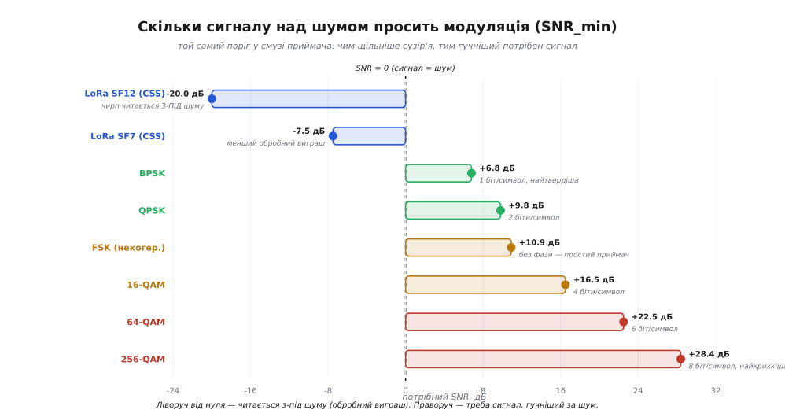

# 🧮 Шумова підлога й поріг чутливості: повне виведення від kT

У детальному кроці ми зібрали майстер-формулу чутливості — `S_rx = −174 + 10·log₁₀(B) + NF + SNR_min` — і навіть порахували нею паспортні пороги BLE, Wi-Fi та LoRa. Але зробили це, спираючись на два числа, узяті як дане: звідки взялося **−174 дБм/Гц** і чому доступна теплова потужність дорівнює саме **kTB**, а не, скажімо, залежить від опору антени; і звідки беруться конкретні числа **SNR_min** для кожної модуляції — той стовпчик `−20 · +6.8 · +28.4`, що керує всім слухом приймача. Ця вставка не переказує майстер-формулу — вона **виводить кожен її доданок від першопричини**, доводить −174 з двох сталих, розписує таблицю SNR_min для десятка модуляцій із замкнених формул імовірності помилки, і розбирає найдивовижніше — чому LoRa читає сигнал за −20 дБ SNR, тобто у сто разів слабший за шум, що його оточує.

Мета — щоб після цих сторінок жодне число в майстер-формулі не лишалося магічним. Коли ти бачиш, що −174 — це прямий наслідок сталої Больцмана, що «4R» у формулі шуму скорочується не випадково, а з термодинаміки, і що −20 дБ SNR LoRa — це просто куплена смугою відсічка шуму, ти рахуєш бюджет, розуміючи фізику кожного доданка, а не переставляючи символи.

## Ціль: чотири доданки, і кожен фізичний

Спершу чітко запишемо, що доводимо. Поріг чутливості приймача — найслабший сигнал, який він іще розшифрує з прийнятною якістю, — розкладається на чотири незалежні доданки:

```
S_rx = −174 + 10·log₁₀(B) + NF + SNR_min      [дБм]
       └─────────┬─────────┘   └┬┘   └───┬───┘
       теплова підлога kTB      шум     запит
       у смузі B приймача     тракту   модуляції
```

Кожен доданок відповідає на окреме фізичне питання. **−174 + 10·log₁₀(B)** — скільки теплового шуму неминуче налітає у смугу B (найкраще, що можливо: чутливість ідеального приймача). **NF** — на скільки децибел реальний приймач псує цю ідеальну картину власним шумом. **SNR_min** — наскільки сигнал мусить стирчати над шумом, щоб обрана модуляція втримала біти. Виведемо кожен по черзі, від першопричини.

## Перший доданок: чому шум = kTB, а не kTR·щось

Почнімо з питання, яке рідко ставлять прямо: чому взагалі є найслабший сигнал? Чому не можна підсилити скільки завгодно й почути навіть комара за десять кілометрів? Бо разом із сигналом приймач неминуче ловить **тепловий шум** — не той, що наводиться ззовні, а власний, вбудований у саму фізику матерії. Будь-який провідник за температури вище абсолютного нуля повний хаотично тремтливих електронів; це [тепловий шум](topic:physics/thermal-noise) (джонсонів-найквістів). Тремтіння створює на будь-якому опорі крихітну випадкову напругу — і вона є завжди, навіть коли антена дивиться в порожнечу. Вона й ставить **підлогу**: сигнал, тихіший за цей шум, тоне в ньому безнадійно.

Тепер найважливіше й найдивовижніше твердження, яке ми доведемо: **доступна шумова потужність не залежить ні від матеріалу опору, ні від його величини — лише від температури та смуги**:

```
N = k · T · B

k = 1.38 × 10⁻²³ Дж/К   (стала Больцмана — місток температура→енергія)
T — абсолютна температура, K
B — смуга частот, Гц
```

Це на перший погляд суперечить інтуїції. Формула самого теплового шуму на резисторі — `⟨U²⟩ = 4kTRB` — **явно** містить опір R: більший резистор шумить гучнішою напругою. То чому ж у потужності, що резистор віддає, опір раптом зникає? Розберімо це до кінця, бо саме тут ховається чому −174 — універсальна константа радіо, а не властивість конкретної антени.

### Ключ: доступна потужність — це узгоджений максимум

Слово «доступна» (*available*) тут навантажене. Резистор-джерело шуму — не ідеальне джерело напруги; це джерело з **внутрішнім опором R**: усередині «сидить» шумова ЕРС із середньоквадратичним значенням `U = √⟨U²⟩`, а послідовно з нею — той самий опір R. Скільки потужності з нього можна витягти, залежить від того, який опір навантаження ми під'єднаємо. І з теорії кіл відомо: **максимум потужності джерело віддає, коли опір навантаження дорівнює внутрішньому опору** (узгодження). Саме цей максимум і називають доступною потужністю — це чесна межа, більше з джерела не витягнути.

Порахуймо цей максимум і побачимо, як R скорочується. Під'єднаймо до джерела навантаження, теж рівне R (узгодження). Виходить найпростіше коло: ЕРС `U` й два послідовні опори — внутрішній R і навантаження R. Струм за законом Ома:

```
I = U / (R + R) = U / (2R)
```

Потужність, що виділяється **на навантаженні** (саме її ми й витягуємо), дорівнює `I²·R`. Оскільки U випадкова, беремо середнє від квадрата:

```
N = ⟨I²⟩·R = ⟨(U/2R)²⟩·R = ⟨U²⟩/(4R²)·R = ⟨U²⟩/(4R)
```


*Одну потужність записуємо двома мовами. Закон Ома для узгодженого дільника: половина шумової ЕРС падає на внутрішньому R, половина — на рівному навантаженні R, тож потужність на навантаженні = ⟨U²⟩/(4R). Термодинаміка незалежно каже, що ця сама потужність = kTB. Прирівнявши, дістаємо ⟨U²⟩ = 4kTRB — а сама доступна потужність N = kTB, у якій R скоротився начисто.*

Тепер підставмо сюди формулу теплового шуму `⟨U²⟩ = 4kTRB`:

```
N = ⟨U²⟩/(4R) = (4·k·T·R·B) / (4R) = k·T·B
```

Ось воно. **R скоротився начисто.** І це не арифметичний фокус, а глибока фізика: опір входить у формулу двічі й у протилежних ролях. Більший R дає гучнішу шумову напругу (`⟨U²⟩ ∝ R` — множник у чисельнику), але водночас гірше віддає потужність у навантаження (той самий R у знаменнику `⟨U²⟩/(4R)`, бо велике внутрішнє джерело важче «просадити» на навантаження). Ці два ефекти точно гасять один одного — і лишається чиста kTB, у якій від матеріалу й номіналу не лишилося сліду.

> 🔧 **Навіщо це.** Саме тому −174 дБм/Гц — універсальна константа, а не характеристика твоєї конкретної антени чи її 50-омного тракту. Хоч яка антена, хоч який вхідний опір приймача — доступна теплова потужність, що конкурує з сигналом, залежить лише від температури й смуги. Це звільняє: рахуючи бюджет, ти не мусиш знати опір антени, щоб оцінити шумову підлогу; вона однакова для 50 Ω, 75 Ω чи будь-чого. Опір впливе на узгодження й КСХ, але не на теплову підлогу — і це прямий наслідок того скорочення R.

### Звідки взялося саме kTB (а не kT² чи (kT)²)

Ми скористалися готовим фактом `⟨U²⟩ = 4kTRB`, а рівність `N = kTB` вивели з нього через закон Ома. Але звідки береться саме такий вигляд — добуток `k·T` (енергія теплового руху) на смугу `B` у першому степені? Це виводиться з термодинаміки повністю, кроком за кроком: теорема про рівнорозподіл дає `kT` енергії на кожну моду коливань, лічба мод у смузі дає їх число `∝ B`, а закон Ома для узгодженого джерела народжує множник `4` і повертає `R`. Це виведення настільки самодостатнє, що ми винесли його в окрему вставку сусіднього модуля — [повне виведення формули Найквіста](root:embedded/noise-interference/math-nyquist-derivation.md); там же показано дивовижу, що ця формула — одновимірний випадок закону випромінювання чорного тіла Планка, і де вона ламається на терагерцах. Тут нам досить головного результату: **доступний тепловий шум = kTB, без сліду опору чи матеріалу**. Візьмімо його й переведімо в радіоінженерну підлогу.

## −174 дБм/Гц: акуратний перерахунок із двох сталих

Тепер порахуймо саме число. Радіотехніка домовилася про опорну температуру **T₀ = 290 К** — це 16.85 °C, трохи прохолодно, але число зручне й закріплене стандартом IEEE як «кімнатне» для наземного зв'язку. *(Це усталена інженерна умовність, а не властивість природи: T₀ = 290 К обрали так, щоб kT₀ давало круглі числа в логарифмах; джерело — стандарт IEEE на коефіцієнт шуму, той самий, що визначає NF через 290 К.)*

Крок перший — добуток kT₀ у ватах на герц смуги:

```
kT₀ = 1.38 × 10⁻²³ Дж/К · 290 К = 4.002 × 10⁻²¹ Вт/Гц
```

Крок другий — переведімо це в дБм. Нагадаю дисципліну: [дБм](topic:communications/power-decibels) — це `10·log₁₀(P / 1 мВт)`, тобто опора 1 мВт = 10⁻³ Вт. Тож ділимо на 10⁻³ і беремо логарифм:

```
у дБм:  10·log₁₀(4.002×10⁻²¹ / 10⁻³)
      = 10·log₁₀(4.002×10⁻¹⁸)
      = 10·(log₁₀(4.002) + log₁₀(10⁻¹⁸))
      = 10·(0.602 − 18)
      = 10·(−17.398)
      = −173.98 дБм/Гц  ≈  −174 дБм/Гц
```

Розкладімо цей результат, бо в ньому видно всю структуру. Число −174 складається з двох частин: `−18·10 = −180` — це чистий перехід від ватів на герц до дБм (порядок величини kT₀), а `+0.602·10 = +6` — це `10·log₁₀(4.002)`, слід самого добутку 4.002 у мантисі. Отже −174 = −180 + 6. Іноді те саме число подають у дБВт (опора 1 Вт замість 1 мВт): тоді воно на 30 дБ нижче, бо `10·log₁₀(1000) = 30`, і виходить −204 дБВт/Гц — та сама підлога, інша опора. Обидва числа означають одне: **у смузі шириною 1 Гц ніякий приймач у Всесвіті не почує сигналу, тихішого за −174 дБм за 290 К** — бо стільки шумить сама теплова природа.

> 🔧 **Навіщо це.** −174 дБм/Гц варто просто **запам'ятати**, як фізик пам'ятає швидкість світла. Це не інженерна умовність, а прямий наслідок сталої Больцмана й вибору 290 К; з нього починається кожен розрахунок чутливості. Якщо в даташиті приймача паспортна чутливість виявляється **нижчою** за `−174 + 10·log₁₀(B)`, знай: або там охолодження (менше T у kT), або обробний виграш (звужена ефективна смуга — саме випадок LoRa), або помилка в даташиті. Ця планка — твій детектор безглуздя.

## Шум росте зі смугою: додаємо 10·log₁₀(B)

Підлога −174 — це на **один герц** смуги. Реальний приймач слухає ширше вікно, а шум пропорційний смузі (`N = kTB` — B у першому степені). У децибелах множення на B стає додаванням `10·log₁₀(B)`:

```
Шумова підлога(дБм) = −174 + 10·log₁₀(B)      (B у Гц)
```

Це перший фізичний важіль слуху: **що ширше відкриваєш вікно частот, то більше теплового хаосу в нього налітає.** Слухаєш вузьку щілину — чуєш мало шуму; розчиняєш вікно навстіж заради швидкості — впускаєш його багато. Порахуймо для наших знайомих радіо, і числа заговорять:

```
LoRa,  B = 125 кГц:    −174 + 10·log₁₀(125 000)    = −174 + 50.97 = −123.0 дБм
BLE,   B = 1 МГц:      −174 + 10·log₁₀(1 000 000)  = −174 + 60.00 = −114.0 дБм
Wi-Fi, B = 20 МГц:     −174 + 10·log₁₀(20 000 000) = −174 + 73.01 = −101.0 дБм
```

Сама лише різниця у смузі між LoRa й Wi-Fi дає **22 дБ** різниці шумової підлоги — LoRa стартує з набагато тихішої кімнати ще до того, як ми згадали модуляцію. Це вже половина відповіді на питання «чому LoRa дострілює далі». Друга половина — у доданку SNR_min, до якого ми зараз дійдемо.

## Другий доданок NF: реальний приймач доливає свого шуму

Теплова підлога — це чутливість **ідеального** приймача, який тільки й робить, що слухає тепловий шум антени. Реальний приймач має власні транзистори, змішувачі, підсилювачі, і кожен додає **свого** шуму поверх теплового. Наскільки саме він псує картину, міряють [коефіцієнтом шуму](topic:electronics/noise-figure) (*noise figure*) NF: це на скільки децибел відношення сигнал/шум погіршало, пройшовши крізь приймач. Формально:

```
NF = 10·log₁₀( (SNR на вході) / (SNR на виході) )      [дБ]
```

Ідеальний приймач нічого не псує (SNR не падає) — його NF = 0 дБ. Хороший малошумний вхідний каскад дає NF ≈ 2–3 дБ; типовий інтегрований радіочіп — 5–10 дБ. У майстер-формулі NF просто **піднімає підлогу** на своє значення: був −114 дБм у BLE, з NF = 8 дБ ефективна підлога вже −106 дБм. Це чистий програш, за який платять якістю (і ціною) вхідного тракту.

Найважче й найважливіше правило тут — що NF всієї системи майже цілком задає **перший** каскад ланцюга. Малошумний підсилювач на вході виставляє SNR, який усі наступні каскади можуть лише погіршити (адже вони додають шум до вже підсиленого сигналу, тож у відносних одиницях шкодять менше). Кількісно це описує [формула каскаду Фрііса для шуму](root:embedded/rf-frontend/math-friis-cascade.md) — вона показує, чому саме на вхідному LNA економити не можна, і як розподіляється внесок кожного каскаду. Тут нам досить одного: у майстер-формулі NF — це один чесний доданок, і він майже весь «сидить» у першому каскаді приймача.

## Третій доданок SNR_min: тут входить модуляція

Ось де нарешті входить модуляція, і входить точним числом. Приймач не читає сигнал «на межі шуму»; йому треба, щоб сигнал стирчав над шумом на певну висоту — інакше [сузір'я модуляції](topic:communications/fsk-psk) розпливеться й біти посиплються з помилками. Оце «на певну висоту» і є **SNR_min** — мінімальне відношення сигнал/шум у смузі приймача, за якого модуляція ще тримає прийнятну частоту помилок (BER).

Щоб зрозуміти, звідки беруться конкретні числа SNR_min, треба спершу побачити, від чого залежить імовірність помилки біта. Уяви приймач як суддю, що дивиться на прийняту точку в сузір'ї й вирішує, який символ надіслано. Шум зсуває точку від її істинного місця на випадкову величину. Помилка стається, коли шум зсунув точку за межу до сусіднього символу — тобто коли випадковий викид шуму перевершив половину відстані між сусідами сузір'я. Імовірність такого викиду для гаусового шуму дає **Q-функція** (хвіст нормального розподілу):

```
Q(x) = імовірність, що гаусів шум перевищить x стандартних відхилень
     = ½·erfc(x / √2)
```

Звідси загальний принцип: чим **далі** сусіди в сузір'ї (за тієї самої потужності шуму), тим менша ймовірність помилки. А відстань між сусідами задається тим, на скільки рівнів ми ділимо простір. Проста модуляція (два далеких символи) терпить велику дозу шуму; щільна (256 тісних символів) вимагає майже чистого сигналу. Тепер випишемо це числом для кожної модуляції.

### Виведення SNR_min для головних модуляцій

Розберімо кожен клас від замкненої формули BER, а тоді переведемо потрібний Eb/N₀ у потрібний SNR. Домовмося про поріг: візьмемо **BER = 10⁻³** (типовий поріг «до завадостійкого кодування» у більшості стандартів; після FEC він дає вже 10⁻⁶ і краще). Різниця між Eb/N₀ і SNR — тонка й важлива; розберемо її окремо нижче, а поки що дамо обидва числа.

**BPSK (два символи, ±1).** Найтвердіша фазова модуляція: два символи на максимальній відстані на прямій. Точна формула:

```
BER_BPSK = ½·erfc(√(Eb/N₀)) = Q(√(2·Eb/N₀))
```

Щоб дістати BER = 10⁻³, розв'язуємо `Q(√(2·Eb/N₀)) = 10⁻³`. З таблиць Q-функції `Q(3.09) = 10⁻³`, тож `√(2·Eb/N₀) = 3.09`, звідки `Eb/N₀ = 3.09²/2 = 4.77` (лінійно) = **6.8 дБ**.

**QPSK (чотири символи).** Тут криється приємна несподіванка: QPSK — це фактично **дві незалежні BPSK** на ортогональних осях (синфазній і квадратурній). Тому імовірність помилки біта в QPSK **така сама**, як у BPSK: `Eb/N₀ = 6.8 дБ` для BER = 10⁻³. QPSK передає вдвічі більше біт у тій самій смузі задарма — за це її й люблять.

**Некогерентна FSK.** Частотна маніпуляція, яку приймач розбирає без відновлення фази (простіший приймач — саме тому FSK любить дешеве й низькоенергетичне радіо). Плата за простоту — гірша завадостійкість:

```
BER_FSK = ½·e^(−Eb/2N₀)
```

Розв'язуємо `½·e^(−Eb/2N₀) = 10⁻³`: `e^(−Eb/2N₀) = 2×10⁻³`, `Eb/2N₀ = −ln(2×10⁻³) = 6.21`, `Eb/N₀ = 12.43` = **10.9 дБ**. На ~4 дБ гірше за BPSK — ціна відмови від фази.

**M-QAM (16, 64, 256 символів).** Квадратурна амплітудна модуляція пакує символи в ґратку на площині; що більше M, то тісніші сусіди. Наближена формула BER (сіре кодування):

```
BER_MQAM ≈ (4/k)·(1 − 1/√M)·Q( √( 3k/(M−1) · Eb/N₀ ) ),   k = log₂M
```

Ключ тут — множник `3k/(M−1)` під коренем: зі зростанням M він падає майже як `1/M`, тобто потрібне Eb/N₀ мусить рости, щоб це скомпенсувати. Розв'язавши на BER = 10⁻³, дістаємо Eb/N₀: для 16-QAM ≈ 10.5 дБ, 64-QAM ≈ 14.8 дБ, 256-QAM ≈ 19.4 дБ.

**LoRa (CSS, чирп-модуляція).** Тут закон інший — це не сузір'я точок, а розтягнутий у часі й частоті чирп, який приймач згортає назад у пік. Її SNR_min від'ємний і задається обробним виграшем (розбір нижче окремо); значення беруть із даташита Semtech, де вони виміряні для кожного коефіцієнта розширення SF.

### Зведена таблиця SNR_min і Eb/N₀

Зберімо все в одну таблицю. Стовпчик «Eb/N₀» — чесна міра стійкості модуляції (від смуги не залежить); стовпчик «SNR_min» — те, що йде прямо в майстер-формулу чутливості (залежить від смуги). Зв'язок між ними — `SNR = (Eb/N₀)·(Rb/B)`; для M-арних модуляцій, де символ несе k біт у смузі, приблизно рівній символьній швидкості, це дає `SNR ≈ (Eb/N₀)·k`, тому в QAM стовпчики розходяться (в SNR доданий `10·log₁₀ k`):

```
Модуляція     біт/символ   Eb/N₀ @BER=1e−3   SNR_min @BER=1e−3   формула BER
─────────────────────────────────────────────────────────────────────────────
BPSK              1            6.8 дБ            6.8 дБ           ½·erfc(√(Eb/N₀))
QPSK              2            6.8 дБ            9.8 дБ           ½·erfc(√(Eb/N₀))
FSK (некогер.)    1           10.9 дБ           10.9 дБ           ½·e^(−Eb/2N₀)
16-QAM            4           10.5 дБ           16.5 дБ           ≈(4/k)(1−1/√M)Q(…)
64-QAM            6           14.8 дБ           22.5 дБ           ≈(4/k)(1−1/√M)Q(…)
256-QAM           8           19.4 дБ           28.4 дБ           ≈(4/k)(1−1/√M)Q(…)
```

А тепер LoRa — окремим блоком, бо тут SNR_min **від'ємний** і задається не сузір'ям, а коефіцієнтом розширення SF (значення з даташита Semtech SX127x, смуга 125 кГц):

```
LoRa      SNR_min (демодулятор)    обробний виграш 10·log₁₀(2^SF)    паспортна чутливість @125кГц
────────────────────────────────────────────────────────────────────────────────────────────────
SF7          −7.5 дБ                     ≈ 21 дБ                          −123 дБм
SF8         −10.0 дБ                     ≈ 24 дБ                          −126 дБм
SF9         −12.5 дБ                     ≈ 27 дБ                          −129 дБм
SF10        −15.0 дБ                     ≈ 30 дБ                          −132 дБм
SF11        −17.5 дБ                     ≈ 33 дБ                        −134.5 дБм
SF12        −20.0 дБ                     ≈ 36 дБ                          −137 дБм
```

*(Числа демодуляторного SNR і чутливості — з даташита Semtech SX1276/77/78/79; вони усталені й відтворюються в незалежних вимірах. Крок між сусідніми SF — рівно 2.5 дБ, і це варте пояснення, до якого дійдемо.)*


*Той самий поріг для десятка модуляцій на одній осі. Ліворуч від нуля (LoRa) сигнал читається З-ПІД шуму завдяки обробному виграшу. Праворуч — треба, щоб сигнал стирчав над шумом: BPSK/QPSK просять небагато, а щільне 256-QAM вимагає майже 30 дБ. Кожні зайві біти на символ коштують різкого підйому потрібного SNR — це і є плата за швидкість.*

Тепер видно всю драбину слуху одним поглядом. Від −20 дБ LoRa SF12 до +28 дБ у 256-QAM — це **48 дБ** розмаху лише за рахунок вибору модуляції. А оскільки, як ми виводили в базовому кроці, кожні 6 дБ порога — це подвоєння дальності, 48 дБ означають ~256-кратну різницю в дальності на тій самій потужності. Ось чому «повільніше = далі» — не гасло, а точна арифметика: спрощуючи модуляцію, ти зсуваєш SNR_min униз по цій драбині, і кожен децибель зсуву додається до запасу лінії нарівні з зайвим ватом передавача.

## Найдивовижніше: як LoRa читає −20 дБ SNR

Рядок `SNR_min = −20 дБ` бентежить сильніше за все інше. Як прочитати сигнал, який **у сто разів слабший** за шум, що його оточує? Хіба шум не мав би його поховати? Відповідь — у слові «смуга», і вона варта того, щоб її зрозуміти до кінця, бо це серце всіх далекобійних систем.

Пастка в тому, що SNR_min ми записали у **широкій** смузі приймача — тій, у якій сигнал розмазаний по всьому чирпу LoRa (125 кГц). У цій смузі сигнал справді тоне: шумова підлога −123 дБм, сигнал на −137 дБм, він на 14 дБ **нижче** шуму. Але LoRa не слухає сигнал «як є» — вона його **згортає**. Чирп — це тон, чия частота лінійно повзе від краю смуги до краю за час символу. Приймач множить прийняте на копію такого ж чирпа й накопичує результат: корисний чирп, збігаючись із копією по всій довжині, складається **когерентно** (амплітуди додаються), а шум, не корельований із чирпом, складається **некогерентно** (як випадкове блукання — росте лише як корінь).

### Обробний виграш: скільки саме дає згортка

Кількісно: якщо ми накопичуємо N незалежних відліків, корисний сигнал за амплітудою росте як N (усі в лад), а шум — лише як √N (випадкові напрямки). Відношення потужностей — квадрат відношення амплітуд — покращується як `N²/N = N`. Це і є **обробний виграш** (*processing gain*): у скільки разів обробка звужує ефективну смугу шуму, у стільки й піднімає ефективний SNR. Для LoRa число незалежних відліків на символ дорівнює `2^SF` (символ несе SF біт, отже кодує один із 2^SF можливих чирпів), тож:

```
Обробний виграш = 10·log₁₀(2^SF)      [дБ]

SF7:  10·log₁₀(128)  = 21.1 дБ
SF12: 10·log₁₀(4096) = 36.1 дБ
```

Аналогія: ти шукаєш тихий рівний тон у гуркоті водоспаду. Слухаєш весь гуркіт разом — тону не чути. Але пропусти запис крізь вузесенький фільтр рівно на частоті тону — гуркіт у цій щілині мізерний, а тон цілий. Ти виграв рівно стільки, у скільки разів звузив вікно. Згортка чирпа робить те саме: розтягнутий по 125 кГц сигнал вона стискає у вузесенький пік, лишаючи шум розмазаним.

### Чому крок 2.5 дБ, а не 3

Тут варто зупинитися на чесній тонкості. Теоретичний обробний виграш при кроці SF на одиницю (подвоєння 2^SF) — це `10·log₁₀(2) = 3.01 дБ`. Але з таблиці видно, що паспортний SNR_min покращується лише на **2.5 дБ** на кожен SF. Куди діваються 0.5 дБ? Це різниця між ідеальним і реальним демодулятором: подвоєння тривалості символу дає повні 3 дБ теоретичного виграшу, але реальний демодулятор LoRa втрачає близько 0.5 дБ на кожному кроці через неідеальність згортки, часову й частотну похибку синхронізації, квантування. Тому **теоретичний** виграш — 3 дБ/SF, а **виміряний** крок порога — 2.5 дБ/SF. Знати обидва числа корисно: 3 дБ пояснює механізм, 2.5 дБ — те, що реально стоїть у даташиті й лягає в бюджет.

Зведімо все докупи для SF12, щоб побачити, як −20 дБ узгоджується з рештою:

**Приклад (звідки в LoRa SF12 береться −137 дБм).** Складімо майстер-формулу з нашими виведеними доданками (B = 125 кГц, NF = 6 дБ типово для SX127x, SNR_min = −20 дБ з таблиці):

```
теплова підлога:  −174 + 10·log₁₀(125 000) = −174 + 50.97 = −123.0 дБм
+ коефіцієнт шуму:                          + 6            = −117.0 дБм
+ запит модуляції:                          + (−20)        = −137.0 дБм
─────────────────────────────────────────────────────────────────────
S_rx = −137 дБм   ← рівно паспорт Semtech
```

Зверни увагу на диво в останньому рядку: поріг чутливості −137 дБм лежить **на 14 дБ нижче** за теплову підлогу цієї смуги (−117 з урахуванням NF). Це те, що з боку виглядало неможливим — «чути тихіше за власний шум». Тепер механізм прозорий: сигнал ніколи не був прочитаний «слабшим за шум» — просто корисна частина шуму, що з ним конкурує **після згортки**, виявилася в сто разів меншою. Обробний виграш 20 дБ (для SF12 узятий трохи консервативно проти теоретичних 36, бо в паспорт закладено реальні втрати й потрібний залишковий SNR на виході) перетворює «−20 дБ у широкій смузі» на цілком читабельний додатний SNR у вузькій ефективній смузі після обробки.

> 🔧 **Навіщо це.** Обробний виграш — це важіль дальності, якого немає у фізиці простору. Коли потужність упирається в закон EIRP, а антену нікуди більшати, лишається сповільнитися: піднявши SF з 7 до 12, ти опускаєш SNR_min з −7.5 до −20 дБ — це 12.5 дБ додаткового слуху, тобто вчетверо більша дальність, куплена лише часом у ефірі (символ стає у 32 рази довший). Бюджет не розрізняє, звідки прийшов децибел: для нього −12.5 дБ SNR_min і +12.5 дБ підсилення антени — рівноцінні внески в дальність. Це фундаментальний [обмін Шеннона між швидкістю та смугою](topic:communications/bandwidth-capacity), тепер видимий числом у стовпчику бюджету.

## Чому SNR і Eb/N₀ — різні речі (і коли яку брати)

Ми двічі згадали, що SNR_min залежить від смуги, а Eb/N₀ — ні, і що це «тонкість, через яку порівняння модуляцій виходить кривим». Розберімо її до кінця, бо плутанина тут — класична пастка розробника.

Сирий **SNR** (він же C/N) ділить потужність сигналу на потужність шуму **всієї смуги**. Але ширша смуга впускає більше теплового шуму (`N = kTB`), тож за тієї самої якості модуляції ширша й швидша модуляція показує **гірший** SNR — просто тому, що в її знаменнику більше шуму. Виходить, порівнюючи модуляції за сирим SNR, ми караємо швидку модуляцію за те, що вона широка, а не за те, що вона крихка. Це нечесно.

**Eb/N₀** прибирає цю несправедливість. Воно ділить енергію, витрачену на **один біт**, на спектральну щільність шуму N₀ (ті самі −174 дБм/Гц). Оскільки це на біт, а не на смугу, воно від смуги не залежить — і чесно міряє саму **стійкість** модуляції. Зв'язок між двома мірами:

```
SNR = (Eb/N₀) · (Rb / B)
```

де Rb — бітова швидкість, B — смуга. Читаймо цю формулу як важіль: за **фіксованого** Eb/N₀ (тобто за тієї самої якості модуляції) потрібний SNR падає, якщо знизити швидкість Rb або розширити смугу B. Ось математичний корінь усього: «повільніше = далі» — це просто `Rb ↓ ⇒ SNR_min ↓` за сталого Eb/N₀. LoRa не має надприродно стійкої модуляції на біт (її Eb/N₀ цілком звичайне) — вона просто женеться повільно й широко, і формула перетворює це на низький потрібний SNR.

Ось чому в нашій таблиці два стовпчики: для BPSK вони збігаються (1 біт/символ, смуга ≈ швидкості), а для 256-QAM розходяться на `10·log₁₀ 8 = 9 дБ`, бо кожен символ несе 8 біт. Практичний висновок для роботи з даташитом: **чутливість (у дБм) — це вже зведене число «для мого режиму, моєї смуги», його кидаєш прямо в бюджет; Eb/N₀ (криві BER) — це «наскільки взагалі добра ця модуляція», його береш, коли зважуєш перехід із 256-QAM на QPSK заради дальності.** Тримай ці дві величини в різних руках — і ніколи не порівнюй дальність за сирим SNR: за ним ти порівняєш смуги, а не радіо.

## Де це працює в бюджеті лінії

Тепер, коли всі чотири доданки виведено, а не оголошено, кожне число майстер-формули читається по-новому — видно **чому** воно таке.

**Паспортна чутливість перестала бути чорною скринькою.** Коли ти береш із даташита `S_rx = −95 дБм` для BLE й кидаєш у стовпчик бюджету, ти тепер знаєш, що за цим числом: −174 (стала Больцмана й 290 К) + 60 (смуга 1 МГц) + 8 (NF чіпа) + 17 (GFSK просить свій SNR). Якщо треба оцінити чутливість модуля, якого нема під рукою, ти складеш її з цих доданків сам — і не помилишся на порядок.

**Вибір режиму — це рух по драбині SNR_min.** Коли лінія не дотягує, майстер-формула прямо каже, де важіль. Знизити швидкість / підняти SF — опустити SNR_min (далекобійно, коштує лише часом у ефірі). Поставити кращий вхідний LNA — зменшити NF (кілька децибел, коштує грошей і струму). Звузити смугу — опустити `10·log₁₀(B)` (коштує швидкістю). Кожен важіль — це один доданок майстер-формули, і тепер ти бачиш ціну кожного.

**Детектор безглуздя в даташитах.** Найкорисніше практичне застосування виведення — уміння впіймати неможливе число. Якщо приймач обіцяє чутливість нижчу за `−174 + 10·log₁₀(B)`, а це не LoRa з обробним виграшем і не охолоджуваний тракт — число фізично неможливе, і в даташиті помилка або лукавство (наприклад, підмінили смугу). Так само нереальна чутливість −137 дБм для звичайного FSK у смузі 125 кГц: без обробного виграшу підлога там −117 дБм із NF, і нижче ніяк. Той, хто пройшов це виведення, читає радіодаташити критично, а не на віру.

Головне, що варто винести: **поріг чутливості — не паспортна магія, а сума чотирьох фізичних доданків.** −174 приходить зі сталої Больцмана й 290 К; `10·log₁₀(B)` — із того, що шум пропорційний смузі; NF — із власного шуму тракту (майже весь у першому каскаді); SNR_min — із геометрії сузір'я модуляції або, для LoRa, з від'ємного значення, купленого обробним виграшем. Доступна теплова потужність не залежить від опору, бо в узгодженому дільнику R скорочується начисто — і саме тому −174 універсальне. Хто бачить, звідки береться кожен доданок, той рахує бюджет лінії, розуміючи фізику слуху приймача, а не переставляючи символи у формулі.
