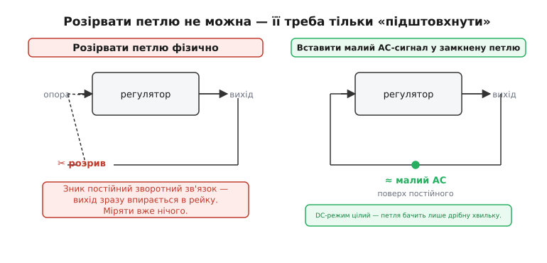
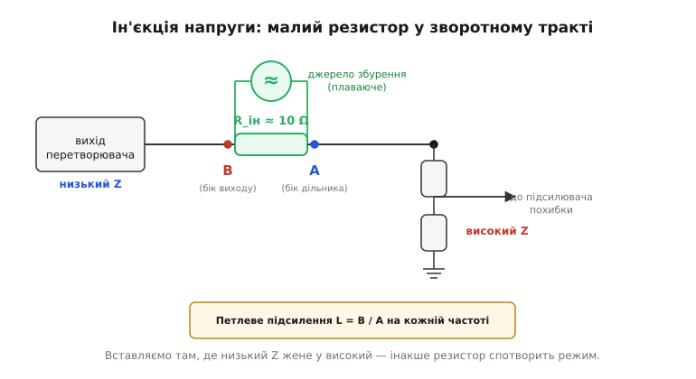
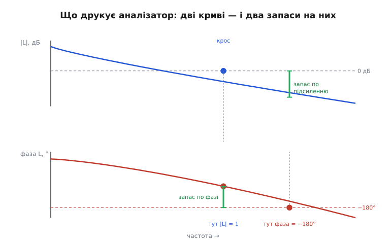

# Вимірювання петлевого підсилення

Коли ми розбирали [запас стійкості](root:embedded/loop-stability), уся картина трималася на двох кривих: як петлеве підсилення спадає з частотою й де фаза доходить до 180°. Звідти ми відраховували два запаси й вирішували, чи задзвенить контур. Та була в тих міркуваннях тиха підміна: ми мовчки припускали, що ті криві **відомі**. На папері вони й справді відомі — їх дає модель: котушка стільки-то генрі, конденсатор стільки-то фарад, підсилювач похибки з такими коефіцієнтами. Підставив у формулу — отримав запас по фазі 52°. Гарне число.

Біда в тому, що реальна плата ці формули **не читала**. У конденсатора є послідовний опір, який пливе з температурою й старінням. У котушки осердя підсідає під струмом. Доріжки додають паразитну індуктивність, а земля під feedback-дільником ловить пульсації силового каскаду. Внутрішня компенсація мікросхеми задана з розкидом. Усе це разом зміщує справжні криві так, що ваш паперовий запас 52° на готовій платі може виявитися й 70°, і 15° — а 15° означає дзвін від першого ж стрибка навантаження. Тому інженер, який серйозно ставиться до живлення, не зупиняється на розрахунку: він **міряє** петлеве підсилення на реальній платі й дивиться, що там насправді. Цей крок — про те, **як саме** його виміряти.

## Чому не можна просто розірвати петлю

Найочевидніша думка — найгірша. Якщо нас цікавить підсилення вздовж петлі (об'єкт → датчик → регулятор → виконавчий орган → знову об'єкт), то, здавалося б, треба цю петлю **розрізати**, подати на вхід відомий синусоїдний сигнал, виміряти, що повертається з виходу, поділити — і маєш коефіцієнт передачі на цій частоті. Прокрути по частотах — маєш усю криву. Просто й чесно.

І зовсім не працює. Згадаймо, що тримає робочу точку перетворювача: саме **замкнений** зворотний зв'язок. Регулятор увесь час підправляє керування так, щоб вихід стояв на заданій напрузі. Розріжте петлю — і ця підправка зникне. Підсилення по постійному струму у будь-якого пристойного контуру величезне (тисячі, десятки тисяч), і навіть мікроскопічна різниця між опорою і тим, що тепер «висить» на розірваному вході, помножиться на це підсилення й **жбурне вихід у рейку** — до самого живлення або до нуля. Перетворювач більше не на робочій точці, а в насиченні; усе, що ви тепер виміряєте, не має нічого спільного з його поведінкою в нормі.

> 🔧 **Навіщо це.** Підсилення петлі — це властивість **лінеаризації навколо робочої точки**. Воно осмислене лише тоді, коли перетворювач сидить там, де працює щодня: видає свої умовні 3.3 В при своєму струмі. Вибили його звідти — і міряєте вже інший прилад. Тому будь-який чесний метод вимірювання петлі **зберігає замкнений контур і робочий режим недоторканими**, а підсилення дістає якось інакше.

Вихід зі скрути придумав 1975 року [Девід Міддлбрук](root:embedded/loop-gain-measurement/hist-middlebrook.md), професор Каліфорнійського технологічного, засновник тамтешньої групи силової електроніки. Замість розривати петлю він її **тихенько штовхає**: вставляє у тракт дрібний пробний сигнал поверх того, що там і так тече, а постійний режим лишає цілим. Петля далі сама тримає робочу точку, а ми спостерігаємо, як вона відгукується на крихітну хвильку.


*Чому петлю не розривають, а підштовхують. Розрізати тракт (ліворуч) — означає прибрати постійний зворотний зв'язок: величезне DC-підсилення зразу жене вихід у рейку, і міряти стає нічого. Натомість малий змінний сигнал, вставлений поверх постійного (праворуч), лишає робочу точку недоторканою — петля бачить лише дрібну хвильку й відгукується на неї, а ми цей відгук міряємо.*

## Ін'єкція напруги: один малий резистор

Як вставити сигнал «у тракт», не розриваючи його? Прийом Міддлбрука простий до краси. У зворотний тракт — туди, де вихідна напруга йде до дільника, що задає feedback, — послідовно вставляють **маленький резистор**, скажімо 10 Ω. По постійному струму через цей дільник тече дрібниця (це ж вхід підсилювача похибки, високоомний), тож зайві 10 Ω на постійному режимі не позначаються ніяк: робоча точка не зрушила. А тепер через цей резистор пропускають змінний струм від окремого, **плаваючого** генератора — і на резисторі виникає мала змінна напруга, яка **додається** в петлю. Ось і вся ін'єкція: контур замкнений, режим цілий, а пробний сигнал усередині є.

Тепер міряємо. Поставмо два щупи — по обидва боки резистора ін'єкції. Назвемо `A` напругу на тому боці, що дивиться **вперед** по петлі (до дільника й далі до підсилювача похибки), і `B` — на боці, що дивиться **назад** (до виходу перетворювача). Сигнал, який пішов уперед від точки A, оббіжить усю петлю, набере по дорозі підсилення й зсув фази всіх ланок і повернеться ззаду — до точки B. Отже, відношення цих двох напруг **і є** петлеве підсилення на цій частоті:

```
L(jω) = B / A
```

Це комплексне відношення: його модуль каже, у скільки разів сигнал зріс або згас за оберт, а аргумент — на скільки зсунулася фаза. Саме ці дві величини нам і потрібні. Проганяємо генератор по частотах від одиниць герц до сотень кілогерц, на кожній міряємо B/A — і викреслюємо обидві криві петлі, ті самі, що в моделі ми просто припускали.


*Ін'єкція напруги за Міддлбруком. Резистор близько 10 Ω розриває зворотний тракт лише «для змінного струму»: плаваючий генератор створює на ньому малу хвильку, а два щупи знімають напругу по обидва боки. Відношення B/A на кожній частоті й дає петлеве підсилення. Ключ — точку обирають там, де низькоомний вихід жене сигнал у високоомний вузол дільника.*

### Де саме вставляти резистор

Чому саме ця точка — вихід перетворювача навпроти верху дільника? Бо для коректності методу одна умова критична: з одного боку резистора має бути **низький** опір, з другого — **високий**. Дивимось «назад», до виходу перетворювача: це потужний, добре стабілізований вузол з малим вихідним опором. Дивимось «вперед», у дільник і вхід підсилювача похибки: це високоомне коло, яке струму майже не бере. Низьке жене у високе — саме те, що треба.

Чому це важливо, видно одразу, щойно уявити порушення умови. Резистор ін'єкції стоїть між двома вузлами «в розрив». Якби обидва боки були низькоомні, цей резистор уже сам по собі помітно міняв би струморозподіл — і петля, яку ви міряєте, була б **не та сама**, що працює без резистора. А коли вперед дивиться високий опір, через резистор у це коло тече мізер, резистор там нічого не вантажить, і вставка лишає петлю собою. Практичне правило: опір «уперед» має переважати опір «назад» десь у сто разів — тоді ін'єкція напруги чесна.

> 🔧 **Навіщо це.** На реальній платі цей «низько-у-високо» вузол майже завжди один і той самий: точка, де вихід перетворювача сходиться з верхнім резистором feedback-дільника. Її й шукайте. Якщо доводиться різати десь у силовому тракті (а там усе низькоомне з обох боків), ін'єкція напруги збреше — там потрібен інший прийом, [ін'єкція струму](root:embedded/loop-gain-measurement/math-injection-derivation.md): сигнал заводять не як напругу в розрив, а як струм у вузол через трансформатор, і вимога до імпедансів перевертається. Для більшості перетворювачів живлення вистачає простої ін'єкції напруги у feedback-дільник; знати про струмову варто на випадок незручного вузла.

## Що показують виміряні криві

Отже, аналізатор видав дві криві: модуль `|L|` і фазу `L`, обидві як функції частоти. Тепер — найприємніше: з них напряму читаються ті самі два запаси, які ми вводили теоретично. Тут немає нічого нового по суті — є лише **підтвердження на залізі** того, що раніше було припущенням.

На кривій модуля знаходимо **частоту кросовера** — там, де `|L|` падає рівно до одиниці (0 дБ). Це найважливіша точка: тут сигнал вертається по петлі таким самим за величиною, тож усе вирішує фаза. Дивимось на криву фази **на цій самій частоті** й рахуємо, скільки їй ще лишилося до −180°. Цей залишок і є **запас по фазі**. Потім навпаки: знаходимо частоту, де фаза дійшла до −180°, дивимось модуль там — наскільки він уже впав нижче 0 дБ. Це **запас по підсиленню**.


*Що друкує аналізатор. Угорі — виміряний модуль петлі, що спадає й перетинає 0 дБ на частоті кросовера. Унизу — виміряна фаза, що сповзає до −180°. Запас по фазі: на частоті кросовера дивимось, скільки фазі лишилося до −180°. Запас по підсиленню: на частоті, де фаза = −180°, дивимось, наскільки модуль уже нижче 0 дБ. Обидва запаси читаються прямо з графіка — це ті самі числа, що в розрахунку, лише вже з реальної плати.*

Що з цими числами робити — ми вже знаємо з [теорії запасу стійкості](root:hw-analog/stability-margins): для надійного перетворювача живлення тримаються запасу по фазі десь 45–60° і запасу по підсиленню не менше ніж дво-трикратного. Сенс вимірювання — звірити **реальні** числа з цими орієнтирами. Якщо виміряний запас по фазі вийшов 25°, перетворювач формально працює, але «нервовий»: будь-яка зміна навантаження викликає довгий дзвінкий перехідний процес, а розкид деталей у серії може зіпхнути частину плат за межу. Якщо ж запас 80°, контур надміру повільний — він мляво відробляє стрибки навантаження, і просадка напруги при різкому навантаженні буде завеликою. Вимірювання каже точно, де ви на цій шкалі.

> 🔧 **Навіщо це.** Класичний випадок: ви поміняли вихідний конденсатор на «такий самий, але дешевший». Ємність та сама, тож за специфікацією нічого не змінилося. А петлеве підсилення раптом показує, що запас по фазі впав з 55° до 30° — бо в нового конденсатора інший послідовний опір, і він зсунув криву. Без вимірювання ви б дізналися про це з рекламацій, коли плати почали б свистіти в полі. З вимірюванням — за п'ять хвилин на столі. Саме тому петлеве підсилення міряють після **кожної** заміни в силовому тракті чи feedback-колі.

## Два способи: стіл і прошивка

Лишається питання, **чим** усе це робити. Тут є два світи, і вони дедалі частіше сходяться.

Перший, класичний — **стіл і прилад**. Береться аналізатор частотної характеристики (його ще звуть аналізатором Боде, бо він будує діаграму Боде): прилад сам генерує синус, сам жене його по частотах і сам міряє відношення двох входів за модулем і фазою. Збурення в петлю заводять через **ін'єкційний трансформатор** — маленький широкосмуговий трансформатор, який передає в резистор ін'єкції змінний сигнал від генератора, але **гальванічно розв'язує** генератор від плати. Розв'язка тут не примха: вона потрібна саме для того, щоб джерело збурення лишалося плаваючим і не нав'язувало петлі свою землю, інакше ви знову зміните те, що міряєте. Це найточніший і найпряміший шлях; так міряють серйозне живлення.

Другий світ виріс із того, що дедалі більше перетворювачів **керуються цифрою** — мікроконтролер сам читає вихідну напругу через АЦП і сам рахує керування, замінюючи аналоговий підсилювач похибки кодом. А якщо петлю замикає програма, то й виміряти петлю можна **тією самою програмою**, без зовнішнього приладу взагалі. Ідея пряма, як палиця: контролер сам собі генератор і сам собі вимірювач.

Усередині цифрового регулятора є точка, де програма видає число керування. Туди, у це число, додаємо малий синус відомої частоти — це й є ін'єкція, тільки цифрова, без жодного резистора. Петля його відробляє, вихід ледь-ледь захитається на цій частоті, і АЦП цей відгук бачить. Тепер треба з шумного виміряного сигналу видобути **рівно одну** частотну складову — ту, що ми вкинули, — її амплітуду й фазу. Робить це проста кореляція: множимо виміряний сигнал на синус і косинус нашої частоти й накопичуємо суми за цілу кількість періодів. Ці дві суми дають дійсну й уявну частини відгуку — а з них уже модуль і фазу. По суті це обчислення **однієї точки** дискретного перетворення Фур'є; коли треба економніше, той самий результат дає [алгоритм Ґерцеля](root:embedded/why-frequency-domain), який витягує один частотний «кошик» без повного спектра.

Ось серце такого вимірювача на одній частоті — реальний код прошивки:

:::tabs
```cpp
// Виміряти петлеве підсилення на одній частоті f_test.
// Вкидаємо синус у керування, корелюємо відгук виходу з тим самим синусом.
struct loop_point_t { float mag_db; float phase_deg; };

loop_point_t measure_point(float f_test, float fs, uint32_t cycles, float amp)
{
    const float w   = 2.0f * 3.14159265f * f_test / fs;  // фаза за один відлік
    const uint32_t N = (uint32_t)(cycles * fs / f_test);  // ціла к-ть періодів

    float acc_i = 0.0f, acc_q = 0.0f;   // дійсна / уявна частини відгуку
    float ref_i = 0.0f, ref_q = 0.0f;   // те саме для опорного збурення

    for (uint32_t n = 0; n < N; n++) {
        float s = sinf(w * n);
        float drive = amp * s;          // мала добавка до керування
        ctrl_inject(drive);             // вкинути в петлю поверх керування

        float y = adc_read_output();    // відгук виходу через АЦП
        acc_i += y * sinf(w * n);       // кореляція з sin
        acc_q += y * cosf(w * n);       // кореляція з cos
        ref_i += drive * sinf(w * n);   // те саме для збурення
        ref_q += drive * cosf(w * n);
    }

    // Відношення комплексних амплітуд відгук/збурення = L(j2pi f_test)
    float out_re = acc_i, out_im = acc_q;
    float in_re  = ref_i, in_im  = ref_q;
    float den    = in_re * in_re + in_im * in_im;
    float L_re   = (out_re * in_re + out_im * in_im) / den;
    float L_im   = (out_im * in_re - out_re * in_im) / den;

    loop_point_t p;
    p.mag_db    = 10.0f * log10f(L_re * L_re + L_im * L_im);   // 20*log10(|L|) = 10*log10(|L|^2)
    p.phase_deg = atan2f(L_im, L_re) * 57.29578f;              // 180/pi
    return p;
}
```
```python
# Виміряти петлеве підсилення на одній частоті f_test.
# Вкидаємо синус у керування, корелюємо відгук виходу з тим самим синусом.
from math import sin, cos, pi, log10, atan2

def measure_point(f_test, fs, cycles, amp):
    w = 2.0 * pi * f_test / fs           # фаза за один відлік
    n_samples = int(cycles * fs / f_test)  # ціла к-ть періодів

    acc_i = acc_q = 0.0   # дійсна / уявна частини відгуку
    ref_i = ref_q = 0.0   # те саме для опорного збурення

    for n in range(n_samples):
        s = sin(w * n)
        drive = amp * s                  # мала добавка до керування
        ctrl_inject(drive)               # вкинути в петлю поверх керування

        y = adc_read_output()            # відгук виходу через АЦП
        acc_i += y * sin(w * n)          # кореляція з sin
        acc_q += y * cos(w * n)          # кореляція з cos
        ref_i += drive * sin(w * n)      # те саме для збурення
        ref_q += drive * cos(w * n)

    # Відношення комплексних амплітуд відгук/збурення = L(j2pi f_test)
    out_re, out_im = acc_i, acc_q
    in_re, in_im   = ref_i, ref_q
    den   = in_re * in_re + in_im * in_im
    l_re  = (out_re * in_re + out_im * in_im) / den
    l_im  = (out_im * in_re - out_re * in_im) / den

    mag_db    = 10.0 * log10(l_re * l_re + l_im * l_im)   # 20*log10(|L|) = 10*log10(|L|^2)
    phase_deg = atan2(l_im, l_re) * 57.29578              # 180/pi
    return mag_db, phase_deg
```
:::

Обгорнувши це циклом по списку частот, дістаємо **весь** графік петлі — програмний аналізатор Боде прямо в прошивці перетворювача, який можна запускати хоч на виробничому тесті кожної плати. Як його зібрати цілком — від генерації сигналу й вибору амплітуди до повного проходу по частотах і виведення таблиці модуль-фаза — розписано окремо: [прошивка-аналізатор петлі](root:embedded/loop-gain-measurement/proj-firmware-fra.md).

> 🔧 **Навіщо це.** Цифровий вимір петлі — це не лише «дешевше, ніж прилад». Це можливість **переміряти петлю в полі**, не розбираючи пристрій: запустив сервісну команду — і знаєш, що запас по фазі досі в нормі, а не сповз за роки від старіння конденсаторів. У серйозних системах живлення такий самовимір роблять частиною самодіагностики: пристрій періодично перевіряє, чи не наблизився його власний контур до межі стійкості.

## Найголовніша пастка: розмір збурення

Через усі способи вимірювання — і столовий, і цифровий — проходить одна спільна небезпека, і про неї варто сказати окремо, бо саме на ній найчастіше псують вимір. Уся теорія петлевого підсилення, з якої ми вивели і запаси, і самий сенс відношення B/A, тримається на одному слові: **малий** сигнал. Петлеве підсилення — це нахил передавальної характеристики **в одній точці**, лінеаризація навколо робочого режиму. Вона осмислена лише доти, доки збурення таке дрібне, що система відповідає на нього **лінійно** — пропорційно, без спотворень.

Звідси дві протилежні біди, між якими треба пройти. Вкинете збурення **завелике** — і десь у петлі щось упреться в межу: підсилювач похибки в насичення, ключ у граничний коефіцієнт заповнення, котушка в насичення осердя. Відгук перестане бути пропорційним збуренню, відношення B/A вже не буде чесним петлевим підсиленням, а намішаним з нелінійністю несправжнім числом — і виміряні запаси збрешуть. Вкинете збурення **замале** — і корисний відгук потоне в шумі та пульсаціях самого перетворювача, фаза почне стрибати, крива стане рваною. Правильний шлях посередині: збурення якомога менше, але ще помітно над шумом. На практиці його **підбирають** — починають з малого й піднімають, доки крива не стане гладкою, але не далі, інакше з'являться спотворення.

> 🔧 **Навіщо це.** Якщо виміряна крива петлі виглядає дивно — зламана, зі стрибками фази, з горбами там, де модель обіцяла гладкий спад, — перша підозра завжди одна: **рівень збурення**. Завеликий — зменшіть і подивіться, чи крива «вирівнялась» (ознака, що раніше система входила в нелінійність). Зашумлений хвіст на високих частотах — навпаки, трохи підніміть рівень або усередніть більше періодів. І лише коли крива стабільна й не залежить від рівня в розумних межах — їй можна вірити й читати з неї запаси.

Підсумуймо нитку. Запас стійкості, який ми навчилися рахувати, тримається на двох кривих петлі — а реальна плата ці криві зсуває проти моделі через паразити, розкид і старіння. Щоб знати справжній запас, петлю **міряють**, не розриваючи її: вставляють у тракт дрібний сигнал поверх робочого режиму (ін'єкція напруги через малий резистор у feedback-дільнику), знімають відношення B/A на кожній частоті й дістають ті самі дві криві — тепер уже з заліза. Зробити це можна столовим аналізатором через ін'єкційний трансформатор або, якщо контур цифровий, самою прошивкою через кореляцію відгуку. А над усім стоїть одне залізне правило: збурення мусить лишатися малим, бо петлеве підсилення живе лише в лінійному наближенні. Виміряний запас — це і є та різниця між «має працювати за розрахунком» і «працює на цій конкретній платі», заради якої вимірювання й роблять.
