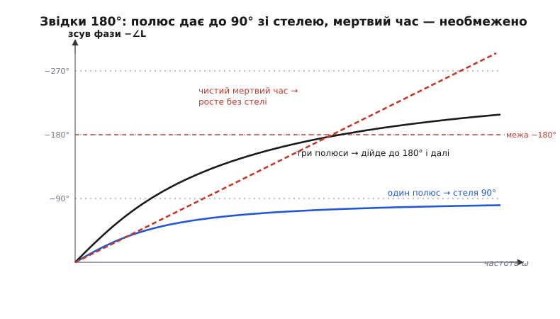
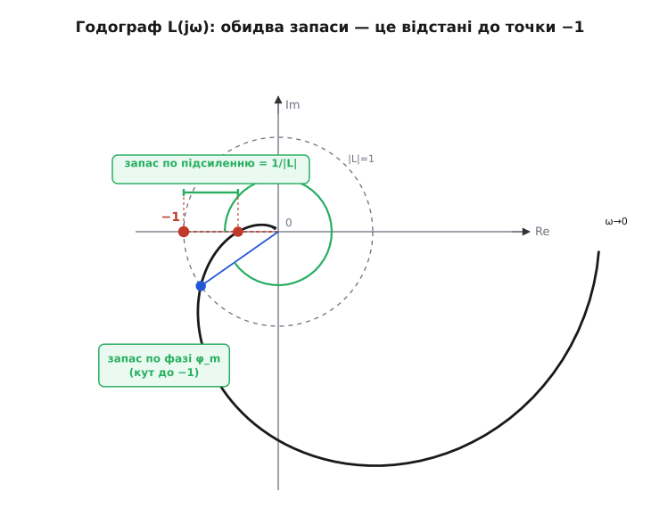
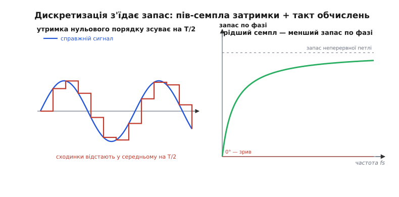

# Запас стійкості — детально

Базовий крок дав нам інтуїцію: затримка в петлі на якійсь частоті докручує зсув фази до 180°, перевертає знак виправлення, і якщо підсилення там ще ≥ 1 — система живить власне коливання й іде вразнос. Два запаси — по фазі й по підсиленню — міряють, наскільки далеко контур від цієї межі. Це правильна картина, і для щоденної роботи її досить.

Але вона лишила чотири питання без відповіді, і кожне з них — саме те місце, де інтуїція перестає рятувати, коли контур поводиться дивно. **Звідки** береться зсув фази — рівно, у градусах на кожній частоті, а не «на око»? **Чому саме −1** — що це за магічне число, до якого ми весь час відміряємо відстань? **Скільки** запасу треба насправді — і як він пов'язаний з тим, як система відгукнеться на поштовх (перерегулювання, дзвін)? І найголовніше для нас: що робить із запасом **дискретність** — те, що регулятор у мікроконтролері не працює неперервно, а прокидається раз на такт, читає давач, рахує, видає команду й засинає?

Розгорнімо кожне. Далі буде більше математики, ніж у базовому кроці, — але вся вона виводиться на очах, від першопричини, і кожна формула тут-таки йде в діло. Наприкінці ми напишемо код, що міряє запас реального дискретного контуру, і побачимо, чому частота дискретизації — це не «деталь реалізації», а прямий важіль стійкості.

## Мова петлі: передавальна функція і чому все впирається в 1 + L = 0

Щоб рахувати фазу й підсилення точно, а не описово, потрібен спосіб записати «що петля робить із коливанням даної частоти» одним об'єктом. Цей об'єкт — **передавальна функція**.

Ідея проста й глибока. Візьмімо будь-яку лінійну ланку (об'єкт, датчик, фільтр) і подаймо на її вхід чисту синусоїду частоти ω. На виході (коли перехідні згаснуть) буде **та сама** синусоїда тієї самої частоти — лінійна ланка частоту не міняє, — але з іншою амплітудою й зсунута в часі. Тобто ланка робить із сигналом рівно дві речі: **множить амплітуду** на якесь число й **зсуває фазу** на якийсь кут. Обидві дії залежать від частоти. Комплексне число вміщує рівно це: модуль — множник амплітуди, аргумент — зсув фази. Тож ланку на частоті ω повністю описує одне комплексне число.

Щоб охопити всі частоти разом, підставляють `s = jω` (уявна вісь) у передавальну функцію ланки `G(s)` — і `G(jω)` дає те саме комплексне число для кожної ω. Передавальна функція — це відношення виходу до входу в такому записі; для нас зараз важливо лише те, що вона існує й що модуль/аргумент `G(jω)` — це саме множник амплітуди й зсув фази ланки на частоті ω.

> Передавальна функція `G(s)` — це відношення перетворених за Лапласом виходу й входу лінійної системи; підстановка `s = jω` дає частотну характеристику, де `|G(jω)|` — коефіцієнт підсилення, а `∠G(jω)` — зсув фази на частоті ω. Полюси `G(s)` (корені знаменника) визначають власну динаміку — швидкість і схильність коливатися. Докладніше — [передавальна функція](root:hw-analog/transfer-function).

Тепер зберімо петлю. Позначмо **підсилення розімкненої петлі** — добуток усіх ланок уздовж кола (регулятор → виконавчий орган → об'єкт → датчик) — однією літерою:

```
L(s) = C(s) · P(s) · H(s)
        регулятор · об'єкт · датчик (і все інше в колі)
```

Це і є той самий «коефіцієнт петлі» з базового кроку, тільки тепер він — функція частоти, з амплітудою й фазою на кожній ω. `|L(jω)|` — у скільки разів коливання частоти ω, обійшовши все коло, повертається більшим чи меншим. `∠L(jω)` — на скільки воно при цьому зсунеться по фазі.

А тепер — центральний крок усієї теорії. Замкнімо петлю (з'єднаймо вихід назад на вхід через від'ємний зв'язок) і спитаймо: як поводиться **замкнена** система? Її передавальна функція (від задання до виходу) виходить такою:

```
        вихід        C·P              L
T(s) = ────── = ───────────── = ─────────      (при H у прямому тракті — L = C·P·H)
       завдання   1 + C·P·H       1 + L
```

Звідки взялося `1 + L` у знаменнику — варте окремого виведення; тут важливий висновок: **уся доля замкненої системи вирішується знаменником `1 + L(s)`**. Повне виведення цього виразу і того, чому корені `1 + L(s) = 0` — це і є полюси замкненої системи (а отже, її стійкість), винесено в окрему вставку: [як 1 + L керує замкненою петлею](root:embedded/loop-stability/math-closed-loop-derivation.md).

Логіка така. Поведінка будь-якої лінійної системи визначається її **полюсами** — коренями знаменника передавальної функції. Полюс із додатною дійсною частиною означає складову, що з часом **росте** (e^(+at) — вибух); полюс із від'ємною — складову, що згасає (стійко). Полюси замкненої системи — це корені рівняння `1 + L(s) = 0`, тобто `L(s) = −1`. Ось звідки береться магічне число −1: **система на межі, коли `L(s)` десь на уявній осі дорівнює саме −1**. Не «−1» узагалі, а `L(jω) = −1` на якійсь реальній частоті ω.

Розпакуймо, що означає `L(jω) = −1` як комплексне число. Модуль −1 дорівнює 1; аргумент −1 дорівнює 180° (точка лежить на від'ємній дійсній півосі). Отже:

```
L(jω) = −1   ⇄   |L(jω)| = 1   І   ∠L(jω) = −180°   (на одній і тій самій частоті ω)
```

Ось воно — рівно та умова з базового кроку, тепер виведена, а не проголошена. «Підсилення = 1» і «зсув = 180°» **на одній частоті** — це геометрично один факт: годограф `L(jω)` проходить точно через точку −1. Лишається розібрати три речі: **звідки** береться −180° фази (наступний розділ), **чому саме навколо −1**, а не деінде, вирішується стійкість (розділ про Найквіста), і **як** відстань годографа від −1 стає двома нашими запасами (розділ про запаси).

## Звідки в петлі 180° фази: рівно, у градусах

Базовий крок назвав три джерела фазового відставання — чиста затримка, інерційні ланки, регулятор — на рівні «додає до 90°», «росте без меж». Тепер порахуймо кожне точно, бо саме ці числа інженер складає, оцінюючи, де його петля набере фатальні 180°.

**Чиста затримка (мертвий час).** Нехай ланка просто затримує сигнал на Δt, нічого більше: вихід(t) = вхід(t − Δt). Що це робить із синусоїдою `sin(ωt)`? Дає `sin(ω(t − Δt)) = sin(ωt − ωΔt)`. Тобто зсуває фазу рівно на:

```
Δφ = −ω·Δt      (у радіанах; знак «−» бо відставання)
```

Це — точна формула, не наближення. І з неї одразу видно, чому чиста затримка найпідступніша: **фаза росте лінійно з частотою і без стелі**. Амплітуду затримка не чіпає взагалі (|модуль| = 1 на всіх частотах — сигнал не слабшає, лише спізнюється). Тож хоч би яка мала була Δt, на частоті ω = π/Δt вона дасть рівно 180°, а вище — і більше. Затримка не має «власної частоти», за якою починає слабнути й тим рятувати систему; вона докручує фазу вічно. Ось чому мертвий час — найгірший ворог швидкого контуру.

**Worked-приклад: скільки фази з'їдає мертвий час.**
```
Давач тиску віддає число із затримкою Δt = 8 мс (усереднення + шина).
Контур крутиться на частоті кросовера fc = 12 Гц → ωc = 2π·12 = 75.4 рад/с.

Δφ = −ωc · Δt = −75.4 · 0.008 = −0.603 рад = −34.6°
```
**Висновок.** Сам лише датчик з'їв майже 35° запасу по фазі на робочій частоті — ще нічого не порахувавши про об'єкт і регулятор. Якщо ми хочемо мати в кінці хоча б 45° запасу, то на всі інші джерела фази лишається дуже мало; або доведеться опустити fc, або прискорити датчик.

**Інерційна ланка (полюс першого порядку).** Тепер найтиповіша ланка — та, що «не встигає»: маса, конденсатор, теплова ємність, RC-фільтр. Її передавальна функція:

```
        1
G(s) = ──────      τ — стала часу ланки (за який час вона «наздоганяє»)
       1 + sτ
```

Підставмо `s = jω`:

```
          1              1 − jωτ
G(jω) = ──────── = ─────────────      (домножили на спряжене)
        1 + jωτ      1 + (ωτ)²
```

Аргумент (зсув фази) цього числа — арктангенс відношення уявної частини до дійсної:

```
∠G(jω) = arctan(−ωτ) = −arctan(ωτ)
```

Ось звідки береться «до 90°». Придивімося до поведінки `−arctan(ωτ)`:

```
ω → 0      →  arctan(0) = 0°        (повільні сигнали ланка пропускає без зсуву)
ωτ = 1     →  arctan(1) = 45°       (на «зламній» частоті ω = 1/τ — рівно півдороги)
ω → ∞      →  arctan(∞) = 90°       (стеля; більше однієї такої ланки не дасть ніколи)
```

І амплітуда: `|G(jω)| = 1/√(1 + (ωτ)²)` — падає з частотою (на високих ~ 1/(ωτ)). Тобто інерційна ланка, на відміну від чистої затримки, **і фазу докручує (до стелі 90°), і сигнал слабить**. Це і є та рятівна властивість: коли фаза наближається до небезпечного боку, підсилення вже впало, і, можливо, встигне впасти нижче одиниці раніше, ніж фаза дійде до 180°.

Але одна ланка — 90° максимум, зриву не буде за жодного підсилення (щоб дійти до −180°, самого полюса замало). **Дві** ланки послідовно дають до 180° — і от уже можлива межа. **Три** — до 270°, з величезним запасом «перелітають» через 180°. А в реальному контурі ланок майже завжди кілька: сам об'єкт (часто вже другого порядку — маса + демпфування), давач зі своїм фільтром, вхідний RC, антиаліасинговий фільтр перед АЦП. Кожна додає свій `−arctan(ωτᵢ)`, і разом вони набирають фатальний кут.

Ключова властивість: **фази ланок складаються, а модулі перемножуються**. Це прямий наслідок того, що комплексні числа при множенні складають аргументи й множать модулі, а ланки в колі саме перемножуються (`L = C·P·H`). Тому загальний зсув фази петлі — просто сума зсувів усіх ланок:

```
∠L(jω) = −ω·Δt  −  Σ arctan(ω·τᵢ)  +  (внесок регулятора)
          мертвий час   інерційні ланки
```


*Три джерела фази проти частоти. Один полюс (синє) виходить на стелю 90° — сам зірвати не може. Три полюси (чорне) складаються й спокійно перетинають межу −180°. Чистий мертвий час (червоне, пунктир) росте лінійно й без стелі — тому системи з відчутним запізненням найважчі. Небезпечна частота — там, де сумарна крива перетинає −180°.*

**Регулятор як джерело фази.** Останнє джерело — сам ПІД-регулятор, і воно кероване, на відміну від перших двох. Розгляньмо складові.

Інтегральна складова `I/s` на `s = jω` дає `I/(jω) = −j·I/ω` — чисте уявне число з від'ємною уявною частиною, тобто аргумент −90°. Інтеграл додає **−90° фази на всіх частотах** (найбільше кусає на низьких, де він домінує). Ось точна причина того, що в базовому кроці було сказано словами: інтеграл, корисний для усунення сталого зсуву, **віднімає запас стійкості**. Він докручує фазу в бік −180°.

Диференційна складова `D·s` на `s = jω` дає `jωD` — чисте уявне з додатною уявною частиною, аргумент **+90°**. Похідна додає фазу **вперед**, тобто **повертає** запас. Через це її й люблять для стійкості — і через це ж бояться, бо разом із фазою вона піднімає підсилення на високих частотах (`|jωD| = ωD` росте з ω) і тим підкачує шум. Тому на практиці похідну завжди фільтрують — і фільтр (той самий інерційний полюс) знову з'їдає частину доданої фази. Про цей компроміс — далі, у розділі про дискретний код.

> 🔧 **Навіщо це.** Коли ви складаєте бюджет фази свого контуру перед тим, як його налаштовувати, рахуйте по джерелах: скільки градусів на fc з'їдає давач (`ωc·Δt`), скільки — кожен полюс об'єкта й фільтра (`arctan(ωc·τᵢ)`), скільки додає інтеграл (−90° асимптотично) і скільки може повернути похідна (+90° мінус фільтр). Сума, відрахована від 180°, — це і є ваш майбутній запас по фазі ще до першого запуску. Якщо на папері виходить менше 30° — залізо треба міняти (швидший давач, менше фільтрів), а не сподіватися виправити коефіцієнтами.

## Чому саме навколо точки −1: критерій Найквіста строго

Ми звели стійкість до `L(jω) = −1`. Але базовий крок дивився лише на **дві точки** годографа: де `|L| = 1` (для фази) і де фаза `= −180°` (для підсилення). Цього досить для простих контурів, та інколи бреше. Строгу відповідь дає **критерій Найквіста**, який дивиться на **весь** годограф `L(jω)` як на єдиний шлях на комплексній площині й рахує, як цей шлях **обходить** точку −1.

Чому саме обходить — і чому це строго? Тут працює одна з найкрасивіших теорем комплексного аналізу — принцип аргументу. Її суть: якщо провести замкнений контур на площині `s` і подивитися, як `1 + L(s)` крутиться навколо нуля, поки `s` оббігає той контур, то кількість повних обертів дорівнює **(число нулів мінус число полюсів)** функції `1 + L(s)` усередині контуру. Нулі `1 + L(s)` — це полюси замкненої системи (корені `1 + L = 0`); а полюс замкненої системи в правій півплощині — це і є нестійкість. Обвівши контуром **усю** праву півплощину (уся уявна вісь плюс нескінченне півколо), ми полічимо, скільки нестійких полюсів має замкнена система, — не розв'язуючи рівняння, а лише дивлячись на картинку.

Повне виведення — з принципом аргументу, підрахунком обертів і формулою `Z = N + P` — винесено у вставку, щоб не рвати нитку: [критерій Найквіста від принципу аргументу](root:embedded/loop-stability/math-nyquist-criterion.md). Тут важливий результат у робочому вигляді:

```
Z = N + P
   Z — число нестійких полюсів ЗАМКНЕНОЇ системи (треба, щоб було 0)
   N — скільки разів годограф L(jω) обходить точку −1 (за годинниковою стрілкою — з +)
   P — число нестійких полюсів РОЗІМКНЕНОЇ петлі L(s) (зазвичай 0)
```

Для звичайного випадку, коли розімкнена петля стійка (P = 0, усі ланки самі по собі не вибухають), умова стійкості спрощується до: **годограф `L(jω)` не повинен охоплювати точку −1** (N = 0). Ось чому −1 — центр усього: замкнена система стійка рівно тоді, коли крива підсилення-й-фази петлі проходить **повз** −1, не замикаючи його в кільце.


*Годограф `L(jω)` для контуру з трьома однаковими інерційними ланками. Крива виходить із точки K на дійсній осі (ω→0) і спірально закручується до нуля (ω→∞), обходячи −1 справа — система стійка. Точка перетину одиничного кола (синє) дає запас по фазі — кут від'ємної дійсної півосі до радіус-вектора. Точка перетину від'ємної дійсної півосі (де фаза = −180°) лежить у −0.43, не доходячи до −1, — цей зазор і є запас по підсиленню (тут ≈ 2.35×). Обидва запаси — це буквально «наскільки близько крива підійшла до −1».*

Тепер видно й **чому двох запасів інколи мало**. Запас по фазі й запас по підсиленню — це відстані до −1 у двох окремих точках кривої (де вона перетинає одиничне коло й де перетинає від'ємну вісь). Але крива може підійти близько до −1 **між** цими точками, або перетнути одиничне коло чи від'ємну вісь **не раз**. Тоді два числа кажуть «запас великий», а насправді крива майже торкається −1 з боку — і система на грані. Строгий критерій дивиться на всю траєкторію й такого не проґавить. Практична міра, що ловить цей випадок одним числом, — **найкоротша відстань від годографа до −1** (її звуть запасом за модулем, або vector margin); але про це — у розділі про повну картину.

## Два запаси як відстані до −1, і скільки їх треба

Тепер, коли −1 має строгий сенс, обидва запаси стають просто **геометрією відстані до нього**. Це глибше, ніж «скільки лишилося до 180°» з базового кроку: обидва запаси — то один об'єкт (близькість до −1), поміряний двома різними способами.

**Запас по фазі** — це кут. Знайдімо на годографі точку, де `|L(jω)| = 1` (годограф перетинає одиничне коло — це частота кросовера ωc). Радіус-вектор до цієї точки має довжину 1 і якийсь кут. Запас по фазі — це кут між цим вектором і напрямом на −1 (від'ємна дійсна піввісь):

```
φ_m = 180° + ∠L(jωc)     (∠L тут від'ємний; напр. ∠L = −145° → φ_m = 35°)
```

Геометрично: якби ми могли докрутити годограф ще на φ_m градусів (додати стільки фазового відставання), точка кросовера **сіла б рівно на −1** — межа. Тож φ_m — це «скільки зайвої затримки петля витримає, перш ніж зірветься», виражене в кутах. А через `Δφ = ωc·Δt` це переводиться прямо в **час**:

```
Δt_max = φ_m / ωc      (запізнення, що з'їсть увесь запас по фазі)
```

**Worked-приклад: запас по фазі у часі.**
```
Контур має запас по фазі φ_m = 40° на частоті кросовера fc = 20 Гц.
ωc = 2π·20 = 125.7 рад/с;  φ_m = 40° = 0.698 рад.

Δt_max = φ_m / ωc = 0.698 / 125.7 = 5.55 мс
```
**Висновок.** Будь-яке зайве запізнення понад 5.5 мс — новий фільтр, повільніший датчик, довший цикл обчислень — з'їсть увесь запас і зірве контур. Це прямий бюджет: додаючи в петлю щось затримкою 2 мс, ви спалюєте більш як третину буфера.

**Запас по підсиленню** — це відношення. Знайдімо точку, де фаза `= −180°` (годограф перетинає від'ємну дійсну піввісь). Там `L(jω)` — від'ємне дійсне число, скажімо −0.43. Запас по підсиленню — у скільки разів можна підняти підсилення, поки ця точка доповзе до −1:

```
g_m = 1 / |L(jω_180)|        (напр. |L| = 0.43 → g_m = 2.35×)
```

У децибелах: `g_m[дБ] = −20·log₁₀|L(jω_180)| = 20·log₁₀(2.35) ≈ 7.4 дБ`. Геометрично це «наскільки далеко від −1 крива перетнула вісь»: чим ближче перетин до −1, тим менший запас.

**Скільки треба?** Тут інтуїція базового кроку («45–60° і дво-трикратний») стає кількісною через зв'язок запасу по фазі з **характером відгуку**. Для типового контуру, чия поведінка близька до системи другого порядку, запас по фазі майже прямо задає **коефіцієнт демпфування** ζ, а той — величину перерегулювання (наскільки система «перескочить» ціль, перш ніж заспокоїтись). Робоче наближення, добре відоме в практиці керування:

```
ζ ≈ φ_m / 100          (φ_m у градусах, дійсне приблизно до φ_m ≲ 70°)
```

а перерегулювання від ζ:

```
перерегулювання ≈ exp( −π·ζ / √(1 − ζ²) ) · 100%
```

Складімо це в таблицю, яку інженер тримає в голові:

```
 φ_m      ζ (≈)     перерегулювання    характер
 ────────────────────────────────────────────────
  30°     0.30        ~37%             нервовий, помітний дзвін
  45°     0.45        ~20%             жвавий, помірний сплеск
  60°     0.60        ~9.5%            добрий компроміс (класика)
  70°     0.70        ~4.6%            спокійний, майже без сплеску
  90°+    →1          ~0%              млявий, повільний
```

**Worked-приклад: від запасу до перерегулювання.**
```
Виміряли запас по фазі φ_m = 50° у контурі позиціювання.
ζ ≈ 50/100 = 0.50
перерегулювання ≈ exp(−π·0.5/√(1−0.25))·100% = exp(−1.814)·100% = 16.3%
```
**Висновок.** 50° запасу означає, що на стрибок завдання система перескочить ціль приблизно на 16% і зробить пару затухаючих коливань. Якщо це кран чи камера — терпимо; якщо це різак, що не сміє перелетіти, — треба піднімати запас до 65–70° (ζ ≈ 0.7), жертвуючи швидкодією. Ось чому «скільки запасу» — не абстракція, а прямо видно в русі апарата.

Ось звідки береться класичне «цілься в 45–60°»: нижче — перерегулювання й дзвін ростуть різко, вище — швидкодія падає без потреби. Це не забобон, а точка компромісу на цій самій кривій.

> 🔧 **Навіщо це.** Запас по фазі — не лише про «зірветься / ні», а про **якість руху**. Побачивши перерегулювання на осцилограмі — скажімо, апарат перескакує ціль на 20% і двічі гойднеться, — ви можете відразу оцінити свій запас по фазі (десь 45°) без жодного частотного аналізатора, просто за цією таблицею. І навпаки: ще на етапі розрахунку, обравши цільове перерегулювання, ви задаєте потрібний запас по фазі, а від нього — гранично допустиму сумарну затримку петлі. Це замикає бюджет фази з попереднього розділу на видиму поведінку.

## Дискретність: чому мікроконтролер сам додає затримку

Аж тепер — те, заради чого все це в курсі про вбудовані системи. Уся теорія вище неявно припускала **неперервний** регулятор, що діє миттєво й безперервно. Реальний регулятор у мікроконтролері працює інакше: він **прокидається раз на такт** (з періодом T = 1/fs, де fs — частота дискретизації), читає давач, рахує вихід, оновлює команду й **тримає** її сталою до наступного такту. Ця дискретність — не дрібниця реалізації: вона **сама, безкоштовно, додає в петлю фазове відставання**, і те відставання прямо з'їдає наш запас по фазі. Розберімо, звідки й скільки.

**Джерело перше: утримка (пів такту).** Між тактами команда не змінюється — вона тримається на останньому обчисленому значенні (це роблять ЦАП або ШІМ-регістр — «утримка нульового порядку», zero-order hold). Значить, у середньому команда **відстає** від того, якою була б неперервна дія, на **пів такту**. Формально утримка нульового порядку має точну фазу `−ωT/2` на низьких частотах (плюс невеликий доданок вище), і робоче наближення таке:

```
Δφ_ZOH ≈ −ω · T/2 = −ω / (2·fs)      (пів-такту затримки як чиста фаза)
```

Це буквально формула чистого мертвого часу з Δt = T/2. Дискретизація перетворюється на **ефективний мертвий час пів-періоду семпла** — з усією підступністю мертвого часу (лінійне зростання фази, без стелі).


*Чому дискретний контур має менший запас. Ліворуч: утримка нульового порядку (червоні сходинки) відстає від справжнього сигналу (синє) у середньому на пів такту T/2 — це чистий доданок мертвого часу. Праворуч: запас по фазі проти частоти дискретизації. Що рідший семпл (лівий край), то більший ефективний мертвий час і то менший запас; на дуже низькій fs запас падає до нуля — контур зривається самою лише дискретизацією. З ростом fs крива виходить на плато — запас неперервної петлі, якого дискретність уже майже не псує.*

**Джерело друге: обчислювальна затримка (ще до такту).** Прочитавши давач на початку такту, регулятор рахує й видає результат — але результат застосовується не миттєво. У найпоширенішій схемі (прочитали цього такту, видали наступного) додається **ще цілий такт** затримки. У кращій схемі (порахували швидко й видали в тому ж такті) — лише час обчислень, зазвичай мала частка T. Отже, повна ефективна затримка дискретного контуру:

```
Δt_еф ≈ T/2  +  Δt_обч        (утримка + обчислення/конвеєр)
      ≈ T/2  +  (0 … T)        від «видав у тому ж такті» до «видав наступного»
```

**Джерело третє: власне вибірка й антиаліасинг.** Щоб дискретизація не наплодила [хибних частот](root:com-signal/nyquist-aliasing) (аліасинг), перед АЦП зазвичай стоїть фільтр, а він — знову інерційна ланка зі своїм `−arctan(ωτ)`. Тобто платня за дискретність потрійна: пів такту утримки + такт конвеєра + фаза антиаліасингового фільтра.

Складімо ефект. На частоті кросовера ωc дискретність відніме від запасу по фазі:

```
Δφ_дискр ≈ −ωc · (T/2 + Δt_обч) = −ωc · Δt_еф        (у радіанах)
```

**Worked-приклад: скільки запасу з'їдає частота дискретизації.**
```
Контур зі стелею fc = 15 Гц (ωc = 94.2 рад/с). Схема «читаю зараз, видаю наступного
такту», тобто Δt_еф = T/2 + T = 1.5·T. Порівняймо дві частоти семпла.

При fs = 200 Гц:  T = 5 мс,   Δt_еф = 7.5 мс
   Δφ = −94.2 · 0.0075 = −0.707 рад = −40.5°   ← дискретність відняла 40° запасу!

При fs = 1000 Гц: T = 1 мс,   Δt_еф = 1.5 мс
   Δφ = −94.2 · 0.0015 = −0.141 рад = −8.1°    ← лише 8°
```
**Висновок.** Та сама петля, той самий регулятор, але на 200 Гц дискретність з'їдає 40° запасу по фазі, а на 1000 Гц — лише 8°. Якщо неперервний розрахунок обіцяв 50° запасу, то на 200 Гц реально лишиться 10° (грань зриву!), а на 1000 Гц — здорові 42°. Ось точна причина правила «крути регулятор швидше»: **fs треба тримати щонайменше в 10–20 разів вище за частоту кросовера**, інакше дискретність сама з'їдає запас, який ви так старанно рахували в неперервній моделі.

Ось чому в курсі про вбудовані системи стійкість не можна вивчати «як у класичному підручнику з теорії керування» — неперервна модель систематично **переоцінює** запас реального цифрового контуру рівно на `ωc·Δt_еф`. Хто цього не врахує, той налаштує контур «з запасом» на симуляції й отримає дзвін на залізі.

## Код: як виміряти запас реального дискретного контуру

Теорія дає формули; тепер порахуймо запас конкретного дискретного контуру просто в прошивці — тим самим кодом, що потім крутитиме регулятор. Ідея пряма: обійти діапазон частот, на кожній обчислити комплексне `L(jω)` (перемноживши ланки), знайти частоту кросовера й частоту −180°, і зняти з них обидва запаси. Це не «академічна» вправа — такий вимір корисно мати в прошивці, щоб під час автоналаштування бачити, куди повзуть запаси.

Спершу опишемо ланки як комплексні множники на частоті ω. Використаємо стандартні комплексні числа C:

```c
#include <complex.h>
#include <math.h>

// Інерційна ланка (полюс): 1 / (1 + jωτ)
static double complex pole(double w, double tau) {
    return 1.0 / (1.0 + I * w * tau);
}

// Чистий мертвий час (у т.ч. пів-такту утримки + обчислення): e^(-jωΔt)
static double complex dead_time(double w, double dt) {
    return cexp(-I * w * dt);   // модуль 1, фаза -ωΔt
}

// П-складова регулятора — просто множник Kp (дійсний, фаза 0)
// І-складова: Ki / (jω);  Д з фільтром: (Kd·jω) / (1 + jω·τ_d)
static double complex pid(double w, double Kp, double Ki, double Kd, double tau_d) {
    double complex integ  = (w > 0.0) ? (Ki / (I * w)) : 0.0;
    double complex deriv  = (Kd * I * w) / (1.0 + I * w * tau_d);
    return Kp + integ + deriv;
}
```

Тепер зберімо повну петлю `L(jω) = C·P·H` і додамо ефективну затримку дискретизації як окрему ланку мертвого часу. Нехай об'єкт — два інерційні полюси (типова механіка з демпфуванням), давач — один полюс (його фільтр), плюс дискретна затримка `T/2 + Tобч`:

```c
typedef struct {
    double Kp, Ki, Kd, tau_d;   // регулятор
    double tau_p1, tau_p2;      // два полюси об'єкта
    double tau_sensor;          // полюс давача
    double Ts;                  // період дискретизації (1/fs)
    double t_compute;           // затримка обчислень (частка Ts або цілий Ts)
} loop_t;

static double complex L_of_w(const loop_t *m, double w) {
    double complex L = pid(w, m->Kp, m->Ki, m->Kd, m->tau_d);
    L *= pole(w, m->tau_p1);
    L *= pole(w, m->tau_p2);
    L *= pole(w, m->tau_sensor);
    // ефективна затримка дискретного контуру: пів-такту утримки + обчислення
    double dt_eff = 0.5 * m->Ts + m->t_compute;
    L *= dead_time(w, dt_eff);
    return L;
}
```

Лишилося пройтися частотами й зняти запаси. Кросовер підсилення шукаємо там, де `|L|` падає крізь 1; частоту −180° — там, де фаза перетинає −π. Зробимо це логарифмічним свіпом і лінійним уточненням між сусідніми точками:

```c
typedef struct { double phase_margin_deg, gain_margin_db, wc, w180; int ok; } margins_t;

static margins_t measure_margins(const loop_t *m,
                                 double w_lo, double w_hi, int N) {
    margins_t r = {0};
    double prev_w   = w_lo;
    double complex prev_L = L_of_w(m, prev_w);
    double prev_mag = cabs(prev_L);
    double raw_prev = carg(prev_L);            // сире carg ∈ (-π, π]
    double unw_prev = raw_prev;                // РОЗГОРНУТА (безперервна) фаза
    int found_wc = 0, found_w180 = 0;

    for (int i = 1; i <= N; ++i) {
        double w   = w_lo * pow(w_hi / w_lo, (double)i / N);  // лог-крок
        double complex L = L_of_w(m, w);
        double mag = cabs(L);
        double raw = carg(L);

        // розгортка фази: прибираємо стрибки ±2π між сусідніми точками,
        // бо carg «перескакує» на межі −π/π, а нам треба безперервну фазу
        double d = raw - raw_prev;
        if (d >  M_PI) d -= 2.0 * M_PI;
        if (d < -M_PI) d += 2.0 * M_PI;
        double unw = unw_prev + d;

        // 1) кросовер підсилення: |L| перетнув 1 згори вниз → запас по фазі
        if (!found_wc && prev_mag >= 1.0 && mag < 1.0) {
            double t = (1.0 - prev_mag) / (mag - prev_mag);      // де саме mag=1
            r.wc = prev_w * pow(w / prev_w, t);
            double ph_wc = unw_prev + t * (unw - unw_prev);      // фаза в тій точці
            r.phase_margin_deg = 180.0 + ph_wc * 180.0 / M_PI;
            found_wc = 1;
        }
        // 2) частота −180°: РОЗГОРНУТА фаза перетнула −π → запас по підсиленню
        if (!found_w180 && unw_prev >= -M_PI && unw < -M_PI) {
            double t = (-M_PI - unw_prev) / (unw - unw_prev);
            r.w180 = prev_w * pow(w / prev_w, t);
            double gain_at_180 = cabs(L_of_w(m, r.w180));
            r.gain_margin_db = -20.0 * log10(gain_at_180);
            found_w180 = 1;
        }
        prev_w = w; prev_mag = mag; raw_prev = raw; unw_prev = unw;
    }
    r.ok = found_wc;          // без кросовера запас по фазі не визначений
    return r;
}
```

І застосування — порівняймо той самий контур на двох частотах дискретизації, як у прикладі вище:

```c
void check_two_rates(void) {
    loop_t m = {
        .Kp = 5.0, .Ki = 8.0, .Kd = 0.06, .tau_d = 0.001,
        .tau_p1 = 0.02, .tau_p2 = 0.008, .tau_sensor = 0.004,
        .t_compute = 0.0,             // видаємо в тому ж такті
    };

    m.Ts = 1.0 / 200.0;              // 200 Гц
    margins_t a = measure_margins(&m, 1.0, 6000.0, 8000);
    printf("fs=200:  PM=%.1f deg,  GM=%.1f dB,  fc=%.1f Hz\n",
           a.phase_margin_deg, a.gain_margin_db, a.wc / (2 * M_PI));

    m.Ts = 1.0 / 1000.0;             // 1000 Гц
    margins_t b = measure_margins(&m, 1.0, 6000.0, 8000);
    printf("fs=1000: PM=%.1f deg,  GM=%.1f dB,  fc=%.1f Hz\n",
           b.phase_margin_deg, b.gain_margin_db, b.wc / (2 * M_PI));
}

/* Виведе приблизно:
   fs=200:  PM=14.4 deg,  GM=1.9 dB,  fc=40.4 Hz     ← грань зриву
   fs=1000: PM=43.5 deg,  GM=9.2 dB,  fc=40.4 Hz     ← здоровий запас
   Той самий контур, ті самі коефіцієнти — лише рідший семпл, і запас упав
   із 43° до 14°: дискретність з'їла майже 30° рівно на ωc·(T/2). */
```

Що покаже цей код: на 200 Гц запас по фазі падає до 14° — грань зриву, — а на 1000 Гц тримається здорових 43°, хоча всі коефіцієнти й ланки об'єкта ті самі. Різниця — рівно той доданок `ωc·(T/2 + Tобч)`, що ми вивели: на fc ≈ 40 Гц пів-такту 200-герцового семпла коштує майже 30° запасу. Це і є той самий ефект, що у виведеному прикладі, тільки виміряний живим кодом. **Пастки**, на які натикаються, пишучи такий вимір:

- **Розгортка фази — обов'язкова.** `carg()` вертає фазу лише в діапазоні (−π, π] і «перескакує» на межі: щойно справжня фаза петлі проходить −180°, `carg` стрибає з майже −π на майже +π. Порівнювати сире `carg` з −π **марно** — воно ніколи не буває меншим за −π, і пошук частоти −180° не спрацював би взагалі. Саме тому код вище **розгортає** фазу (`unw`): щокроку прибирає стрибок ±2π і накопичує безперервне значення, і вже його порівнює з −π. Без цього кроку вимір запасу по підсиленню тихо не працює — це найпоширеніша помилка в саморобних аналізаторах.
- **Крок частоти.** Лінійний свіп проґавить вузькі особливості; беріть **логарифмічний** (як тут) і достатньо точок (тисячі) — інакше інтерполяція кросовера дасть похибку в кілька градусів, а це багато, коли запас і так малий.
- **Немає кросовера.** Якщо `|L| < 1` на всіх частотах (кволий регулятор) — кросовера немає, запас по фазі не визначений; код це позначає `r.ok = 0`, і на це треба реагувати, а не ділити на порожнечу.
- **Умовно стійкі контури.** Якщо фаза перетинає −180° кількаразово (пірнає й вертається), «перший перехід» — не обов'язково той, що вирішує стійкість. Тут проста пара запасів бреше, і потрібен повний хід годографом — про що наступний розділ.

Повний робочий приклад — з розгорткою фази, побудовою годографа й пошуком найкоротшої відстані до −1 — винесено у вставку: [вимір запасів дискретного контуру в прошивці](root:embedded/loop-stability/proj-discrete-margin.md).

> 🔧 **Навіщо це.** Мати такий вимір у прошивці означає, що автоналаштування (чи просто діагностика) бачить запаси **на живому залізі**, з реальною затримкою обчислень і реальними сталими часу, а не з паспортних. Коли апарат почав дзвеніти після зміни давача чи прошивки, `measure_margins()` за секунду покаже, який саме запас просів і на якій частоті, — замість гадання й підбору коефіцієнтів наосліп.

## Чесно про межу: де проста картина ламається

Базовий крок уже попередив: два запаси — робоче наближення, а строгу відповідь дає повний годограф. Тепер, маючи в руках Найквіста й геометрію відстані до −1, розберімо конкретно, **де саме** й **чому** проста пара запасів підводить — бо саме ці випадки збивають з пантелику, коли контур поводиться всупереч «добрим» запасам.

**Випадок перший: близький прохід між точками виміру.** Запас по фазі знято там, де `|L| = 1`; запас по підсиленню — там, де фаза `= −180°`. Але годограф може підійти найближче до −1 **між** цими двома точками. Тоді обидва запаси кажуть «все добре», а реальна відстань до −1 мала — найменший поштовх, і крива охопить −1. Правильна єдина міра — **найкоротша відстань від годографа до −1** (vector margin, або запас за модулем):

```
S_m = min |1 + L(jω)|     (мінімум по всіх ω — найкоротша відстань годографа до −1)
       ω
```

`S_m` ловить усі близькі проходи одним числом і тому надійніший за пару окремих запасів. Гарний контур має `S_m` не менше ніж ~0.5.

**Випадок другий: кратні перетини.** Якщо `|L|` перетинає одиницю кілька разів (немонотонна крива підсилення) або фаза підходить до −180° і відступає, «той самий» запас можна відрахувати в кількох місцях, і лише один із них про справжню межу. Автоматичний вимір, що бере перший-ліпший перетин (як спрощений код вище), назве не те число.

**Випадок третій — найпідступніший: умовно стійкі системи.** Буває, що замкнена система **стійка за великого** підсилення й **нестійка за малого** — рівно навпаки до інтуїції «менше підсилення = безпечніше». Так стається, коли годограф робить петлю: за номінального підсилення він проходить повз −1 з правильного боку, але **зменшення** підсилення стягує криву так, що вона охоплює −1. Для такого контуру наївне «здам трохи Kp про всяк випадок» — прямий шлях до зриву. Повний критерій Найквіста рахує обходи −1 і такий випадок розрізняє; пара запасів — ні.

Витоки цієї теорії теж пояснюють, чому вона така: [історія запасів стійкості](root:embedded/loop-stability/hist-nyquist-bode.md) — як телефон змусив інженерів Bell Labs винайти частотний погляд на стійкість, і чому саме годограф, а не пара чисел, був первинним.

Коли ж проста картина **чесна**? Для типового контуру — один об'єкт із монотонно спадним підсиленням, один регулятор, стійка розімкнена петля (P = 0) — годограф іде до −1 монотонно, перетинає одиничне коло й від'ємну вісь по одному разу, і два запаси кажуть точно те саме, що повний критерій. Це переважна більшість реальних вбудованих контурів, і думати про стійкість як про «відстань до −1, поміряну кутом і відношенням» тут цілком правильно. Просто тримайте в голові прапорці — немонотонна фаза, кратні кросовери, підозра на умовну стійкість, — за яких треба переходити на повний годограф (і `S_m`).

## Разом: одна причина, три важелі, будь-яка петля

Пройдімо всю нитку одним поглядом, тепер уже строго. Замкнена система живе своїми полюсами — коренями `1 + L(s) = 0`. Полюс у правій півплощині означає складову, що росте, — зрив. Геометрично це означає, що годограф `L(jω)` охоплює точку −1. А `L(jω) = −1` розпадається на два прості факти: `|L| = 1` (виправлення вертається таким самим) і фаза `= −180°` (виправлення перевернуте). Уся фаза набирається з трьох джерел — чистий мертвий час (`−ωΔt`, без стелі), інерційні ланки (`−arctan(ωτ)`, до 90° кожна), регулятор (інтеграл −90°, похідна +90°). А дискретність мікроконтролера додає **ще** мертвого часу — `T/2` утримки плюс такт обчислень, — і тим прямо крізь `ωc·Δt_еф` з'їдає запас по фазі.

Звідси три важелі, якими інженер керує стійкістю, і всі вони б'ють в одну мішень — розвести підсилення й фатальну фазу, щоб годограф пройшов подалі від −1:

```
1. Опустити підсилення      → крива стягується до нуля, відходить від −1
                              (падає й швидкодія — платня)
2. Прибрати/зменшити фазу    → фільтр геть зайвих ВЧ; менше полюсів у колі;
                              швидший давач; коротший цикл; менше мертвого часу
3. Додати випередження       → похідна дає +90° там, де бракує запасу
                              (але фільтрувати, бо піднімає шум і ВЧ-підсилення)
```

І та сама причина, той самий важіль — у будь-якій системі зі зворотним зв'язком, як показав базовий крок: [ПІД-регулятор дрона](root:embedded/pid-tuning-cascade) впирається пропорційним коефіцієнтом рівно в запас (а [Зіглер-Ніколс](root:embedded/pid-tuning-cascade/math-ziegler-nichols.md) доводить систему до межі — до `S_m = 0` — навмисне, щоб від неї відрахувати безпечні коефіцієнти); електронний підсилювач самозбуджується, коли його власні полюси докрутять фазу до 180° при підсиленні > 1, і його рятує корекція (навмисне завалене ВЧ-підсилення заради запасу по фазі); імпульсний перетворювач із його котушкою й конденсатором (два полюси!) дзвенить, якщо петлю не скомпенсувати. За всіма ними — одна геометрія: тримати годограф `L(jω)` подалі від точки −1, і по фазі, і по підсиленню, і за найкоротшою відстанню.

Різниця детального погляду від базового — лише в тому, що тепер ви можете це **порахувати**: скласти бюджет фази по джерелах, перевести запас по фазі в перерегулювання, оцінити, скільки з'їсть ваша частота дискретизації, і виміряти все це в прошивці ще до першого запуску. А коли контур поводиться дивно попри добрі запаси — знаєте, куди дивитися: на повний годограф і найкоротшу відстань до −1, де ховаються близькі проходи, кратні кросовери й умовна стійкість.
