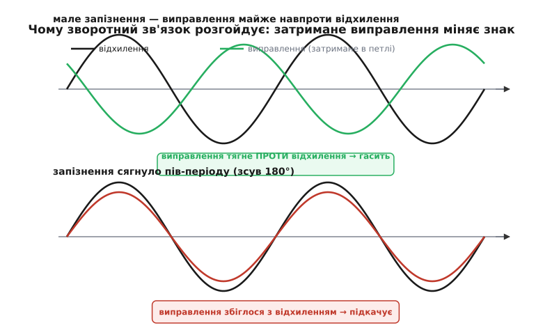
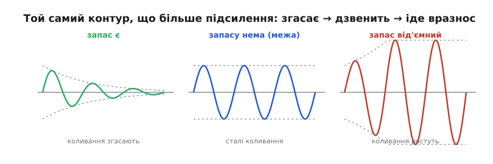
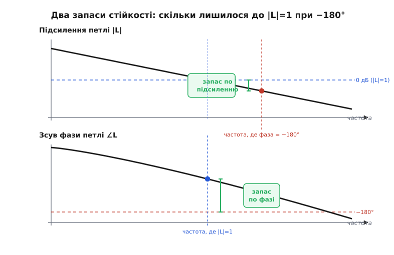

# Запас стійкості

Зворотний зв'язок — найкорисніша ідея в керуванні: виміряй, де ти є, порівняй із тим, де хочеш бути, і дій проти різниці. Поки ця дія приходить **вчасно**, вона гасить будь-яке відхилення, і система слухняно тримається цілі. Та з тим самим зворотним зв'язком трапляється дивна біда: інколи замість гасити відхилення він починає його **роздмухувати**. Регулятор, що мав заспокоювати, раптом розгойдує систему дедалі сильніше — двигун дзвенить, дрон тремтить, стабілізатор напруги свистить, а в гіршому разі апарат іде вразнос і ламається.

Найдивніше тут те, що нічого ззовні не змінилося: той самий датчик, той самий мотор, та сама формула регулятора. Зламало систему **її власне виправлення**. Розберімося від першопричини, **як саме** корисний зворотний зв'язок перетворюється на згубний, чому ключову роль у цьому грає накопичена затримка, і як інженер наперед міряє, **наскільки далеко** його контур від цієї межі — двома числами, які так і звуть: запас по підсиленню й запас по фазі.

## Коли виправлення спізнюється

Почнімо з очевидного факту, який усе вирішує: **жодна реальна система не реагує миттєво**. Між дією і відгуком завжди є проміжок. Маса має інерцію — щоб розкрутити ротор, потрібен час. Нагрівач гріє воду не вмить — тепло доходить із запізненням. Датчик дає число не одразу — він усереднює, фільтрує. Обчислення регулятора теж займають такт. Усі ці дрібні затримки складаються в одну спільну: від моменту, коли система відхилилася, до моменту, коли виправлення **долинуло** назад і подіяло, минає певний час.

Уявімо, що система не просто відхилилася, а **коливається** — гойдається туди-сюди з якоюсь частотою (а будь-яка система зі зворотним зв'язком, отримавши поштовх, схильна коливатися). Регулятор бачить це коливання й намагається його гасити: коли вихід пішов угору, регулятор тисне вниз, і навпаки. Доки затримка мала проти періоду коливання, виправлення приходить майже одразу — рівно тоді, коли воно потрібне, **назустріч** відхиленню. Воно тягне систему в протилежний бік і гасить гойдання. Це і є нормальна, корисна робота зворотного зв'язку.

А тепер ключове спостереження. Затримка в петлі — стала **в секундах**, але коливання бувають різної частоти. Чим **вища** частота коливання, тим більшу частку періоду «з'їдає» та сама затримка. Запізнення на одну й ту саму кількість мілісекунд — це дрібний зсув для повільного гойдання й величезний — для швидкого. А зсув у часі, виражений у частці періоду, — це і є **зсув фази** коливання.

> Зсув фаз — це стала кутова відстань між двома коливаннями однакової частоти; її можна виразити часовою затримкою Δt через Δφ = 2π·Δt/T, тож той самий зсув у часі дає тим більший кут, чим коротший період. Зсув 180° означає протифазу: одне коливання на вершині рівно тоді, коли друге на дні. Докладніше — [фаза й зсув](topic:ph-waves/phase).

Ось і вся зав'язка драми. Зі зростанням частоти зсув фази, що його набирає виправлення, поки оббіжить петлю, дедалі більшає. І настає фатальна межа: на якійсь частоті повний зсув по петлі сягає **180°**. Тоді виправлення, замість приходити назустріч відхиленню, приходить рівно **в ногу** з ним. Те, що мало штовхати систему назад, тепер штовхає її **вперед** — у той самий бік, куди вона вже відхилилася.


*Чому зворотний зв'язок розгойдує. Угорі: виправлення (зелене) запізнюється лише трохи й тягне майже точно проти відхилення (чорне) — гасить його. Унизу: затримка сягнула пів-періоду (зсув 180°) — і виправлення тепер збігається з відхиленням, додаючи до нього замість віднімати. Той самий зворотний зв'язок з гасіння перейшов у підкачку — лише через накопичений зсув фази.*

## Як гасіння стає підкачкою

Спинімося на цьому перевороті, бо він — серце всієї теми. Зворотний зв'язок проєктують **від'ємним**: регулятор віднімає виправлення від відхилення, щоб його зменшити. Слово «від'ємний» і означає «протилежний за знаком, спрямований назустріч». Але зсув фази на 180° — це і є зміна знака коливання: синусоїда, зсунута на півперіоду, дорівнює сама собі зі знаком мінус (sin(x + π) = −sin x). Тож коли петля додає до виправлення зайвих 180° фази, вона **перевертає його знак**. Задуманий від'ємний зв'язок на цій частоті стає **додатним** — і починає не гасити коливання, а живити його.

Що буде далі — залежить від **сили** виправлення на цій самій фатальній частоті. Тут вступає друге головне число — **підсилення петлі**: у скільки разів коливання, обійшовши все коло (об'єкт → датчик → регулятор → виконавчий орган → знову об'єкт), повертається більшим або меншим, ніж було. Позначмо його коефіцієнт як добуток усіх ланок контуру.

Прослідкуймо, що дає підсилення петлі рівно на тій частоті, де фаза вже перевернулась на 180°:

```
зсув по петлі = 180°  (виправлення вже підкачує) і при цьому:

 підсилення < 1  →  кожен оберт кола ослабляє коливання  →  воно згасає    (стійко)
 підсилення = 1  →  коливання вертається таким самим      →  стале гойдання (межа)
 підсилення > 1  →  кожен оберт підсилює коливання         →  воно росте    (вразнос)
```

Ось і повна умова зриву, виведена з перших принципів: система йде вразнос, коли на частоті, де **зсув по петлі = 180°**, її **підсилення петлі ≥ 1**. Два простих факти, складені разом. Зсув 180° перевертає знак виправлення — воно з гальма стає прискорювачем. А підсилення ≥ 1 означає, що це прискорене коливання вертається до себе не меншим — і з кожним оборотом кола накручується дедалі вище, як гойдалка, яку щоразу штовхають у такт. Кожен виток замкненого кола додає трохи енергії — і амплітуда росте сама собою, без жодного зовнішнього збурення.


*Межа стійкості. Той самий контур, лише з різним підсиленням петлі на критичній частоті. Підсилення менше одиниці — коливання після поштовху згасають (запас є). Рівно одиниця — гойдання тримається сталим, ні росте, ні стихає (система рівно на межі). Більше одиниці — амплітуда росте з кожним періодом, аж до зриву (запас від'ємний). Між цими станами — лише величина одного коефіцієнта.*

Зверніть увагу, що для зриву **обидві** умови мають справдитися **на одній і тій самій частоті**. Якщо там, де фаза доходить до 180°, підсилення вже менше одиниці — виправлення хоч і підкачує, та слабне швидше, ніж устигає накрутитись, і коливання глухне. А якщо підсилення велике, але фаза ще далеко не дійшла до 180° — виправлення сильне, проте все ще тягне переважно назустріч відхиленню, тобто гасить. Небезпечна лише та частота, де **сильне** виправлення приходить **перевернутим**. Уся стійкість — про те, щоб ці дві біди ніколи не зійшлися в одній точці.

> 🔧 **Навіщо це.** Коли апарат із регулятором раптом задзвенів на якійсь одній виразній частоті — це майже завжди вона: частота, де зсув по петлі дійшов до 180°, а підсилення там ще не впало нижче одиниці. Не шукайте екзотики. Перше, що пробують, — **зменшити підсилення** (опустити коефіцієнт регулятора), щоб на тій частоті стало менше одиниці; друге — поставити **фільтр**, що прибере саме той високочастотний діапазон, де фаза вже небезпечна. Обидва прийоми б'ють у ту саму мішень: розвести підсилення й фатальну фазу, щоб вони не збіглися.

## Два запаси: скільки лишилося до межі

Знати, що зрив настає при «180° і підсиленні ≥ 1», — добре, але інженерові потрібне не «зірветься / не зірветься», а **наскільки близько** до зриву працює його контур. Бо система рівно на межі — нікому не потрібна: найменший поштовх, зміна навантаження чи температури зрушать її за межу. Потрібен **запас** — буфер між робочим станом і катастрофою. І оскільки умова зриву складається з двох частин (фаза й підсилення), запас теж природно міряти двома числами.

Щоб їх побачити, дивляться на дві криві одного контуру, обидві — як функції частоти. Перша: **підсилення петлі** залежно від частоти (зазвичай воно велике на низьких частотах і падає на високих). Друга: **зсув фази** петлі залежно від частоти (зазвичай він наростає від нуля до 180° і далі зі зростанням частоти). На цих двох кривих відмічають дві особливі частоти — і відстань до межі на кожній з них і дає два запаси.


*Два запаси стійкості на кривих петлі. Угорі — підсилення |L|, що падає з частотою й перетинає рівень 1 (0 дБ) на «частоті кросовера». Унизу — фаза петлі, що сповзає до −180°. **Запас по фазі**: на частоті, де підсилення = 1, дивимось, скільки фазі ще лишилося до −180° (зелена дужка внизу). **Запас по підсиленню**: на частоті, де фаза = −180°, дивимось, наскільки підсилення вже впало нижче 1 (зелена дужка вгорі). Обидва запаси мають бути додатні — інакше дві умови зриву збігаються.*

**Запас по фазі.** Знайдімо частоту, де підсилення петлі падає рівно до одиниці, — її звуть **частотою кросовера** (англ. *crossover* — перетин, бо тут крива підсилення перетинає рівень 1). Саме ця частота найнебезпечніша: тут виправлення ще «в повну силу» (підсилення = 1, коливання вертається таким самим), тож усе вирішує фаза. Дивимось: скільки зсуву фази **ще лишилося** до фатальних 180° на цій частоті? Цей залишок і є **запас по фазі**. Якщо на частоті кросовера фаза, скажімо, 130°, то запас по фазі — 50°: система може дозволити собі ще 50° зайвого запізнення (від нової інерції, фільтра, обчислень), перш ніж дійде до межі. Малий запас по фазі — система ледь тримається, дзвенить від найменшого поштовху; великий — реагує мляво, із зайвою обережністю.

**Запас по підсиленню.** Тепер навпаки. Знайдімо частоту, де зсув фази сягає рівно 180°, — тут виправлення вже перевернуте, вже підкачує. Усе вирішує сила: дивимось, наскільки підсилення петлі на цій частоті **впало нижче** одиниці. Ця відстань і є **запас по підсиленню**. Якщо там підсилення дорівнює 0.5, запас по підсиленню — двократний: можна вдвічі підняти підсилення контуру, перш ніж на фатальній частоті воно досягне одиниці й система зірветься. Малий запас по підсиленню означає, що ви небезпечно близько до того, щоб «перекрутити» коефіцієнт.

Два запаси сторожать дві різні брами до одного зриву. Запас по фазі питає: «коли виправлення ще сильне, чи далеко воно від того, щоб перевернутись?» Запас по підсиленню питає: «коли виправлення вже перевернуте, чи досить воно ослабло, щоб не накрутитись?» Для стійкості з буфером потрібні **обидва** додатні й з пристойним зазором. Як грубі орієнтири практики беруть запас по фазі десь 45–60° і запас по підсиленню не менше ніж дво-трикратний; менше — система надто нервова, надто близько до межі.

> 🔧 **Навіщо це.** Коли підкручуєте коефіцієнт регулятора вгору заради швидкодії, ви насправді піднімаєте криву підсилення петлі — а отже, **з'їдаєте запас по підсиленню** й зсуваєте частоту кросовера вище, туди, де фаза вже більша, тобто заодно з'їдаєте й запас по фазі. Ось чому «швидше» й «стійкіше» тягнуть в різні боки: кожне зайве підсилення наближає вас до обох брам зриву. Добре налаштований контур — це навмисне лишений запас, а не вичавлена з апарата максимальна різкість.

## Звідки в петлі стільки фази

Лишається питання, без якого картина неповна: **звідки** береться той зсув фази, що накопичується до 180°? Адже якби фаза ніколи не доходила до 180°, система була б стійка за будь-якого підсилення. Джерел зсуву три, і всі вони — про затримку в широкому сенсі.

Перше й найчесніше — **чиста затримка** (англ. *dead time*, «мертвий час»): проміжок, коли система ще нічим не відповіла на дію. Тепло від нагрівача йде трубою до датчика; команда летить каналом зв'язку; обчислення триває такт. Чиста затримка особливо підступна, бо її зсув фази **росте без меж** із частотою: Δφ = ω·Δt, тож хоч би яка крихітна була затримка, на досить високій частоті вона дасть і 180°, і більше. Системи з відчутним мертвим часом — найважчі для керування саме тому.

Друге — **інерція й накопичення**. Маса, що розганяється; конденсатор, що набирає заряд; кімната, що прогрівається. Кожна така ланка не встигає за швидкою дією й тому віддає відгук із запізненням по фазі — кожна додає **до 90°** зсуву на високих частотах. Сама по собі одна така ланка до 180° не дотягує (90° — її стеля) і зірватись не дасть. Але дві ланки разом дають уже до 180°, три — і поготів. Ось чому контури, де послідовно стоять кілька інерційних ланок (а так буває майже завжди — об'єкт плюс датчик плюс фільтр), цілком здатні набрати фатальні 180°.

Третє — **сам регулятор**. Інтегральна складова, що додає системі пам'яті й прибирає сталий зсув, робить це ціною **фазового відставання** — вона теж підкручує фазу до небезпечного боку. Тому інтеграл, корисний для точності, водночас **зменшує** запас стійкості. Протилежна йому диференційна складова дає фазове **випередження** й тим запас **повертає** — за що її й цінують. Налаштування регулятора — це значною мірою керування власне фазою петлі: додати випередження там, де бракує запасу, і не перетиснути з тим, що додає відставання.

> 🔧 **Навіщо це.** Якщо у вашому контурі є відчутна чиста затримка — повільний датчик, канал зв'язку, важкі обчислення, — не сподівайтеся вилікувати дзвін самим лише підкручуванням коефіцієнтів: затримка з'їдає запас по фазі тим швидше, чим вище ви заганяєте частоту кросовера. Тут єдиний справжній шлях — **зменшити саму затримку** (швидший датчик, рідший фільтр, коротший цикл) або свідомо тримати контур **повільнішим**, щоб робоча частота не дісталася туди, де затримка вже накрутила 180°.

## Чесно про межу: повна картина складніша

Усе викладене — правда, але це **спрощена** правда, і чесно назвати, де вона спрощена. Ми міркували так, наче в системі є одна виразна «фатальна частота», де сходяться 180° і підсилення. Для більшості простих, добре поставлених контурів цього образу цілком досить, і він дає правильну інтуїцію та правильні запаси. Та строге питання стійкості — «чи зірветься замкнена система?» — у загальному випадку вирішує **критерій Найквіста**, який дивиться не на дві окремі точки, а на **всю** криву підсилення-й-фази петлі разом, як на один шлях на площині, і рахує, як цей шлях обходить особливу точку.

Чому самих двох запасів інколи замало? Бо крива підсилення може перетинати рівень одиниці **не раз**, а фаза — підходити до 180° і відступати; тоді «той самий» запас по фазі чи підсиленню можна відрахувати в кількох місцях, і не всі вони про справжню межу. Бувають навіть системи, **стійкі за великого** підсилення й **нестійкі за малого** (умовно стійкі) — для них наївне «менше підсилення = безпечніше» просто хибне. Повний критерій Найквіста такі випадки розрізняє, а проста пара запасів — ні.

Та для щоденної інженерної роботи з типовим контуром — один об'єкт, один регулятор, монотонно спадне підсилення — двох запасів вистачає, і думати про стійкість як про «відстань до 180°-та-одиниці» **правильно**. Важливо лише пам'ятати, що це робоче наближення, а не остання істина: коли контур поводиться дивно попри начебто добрі запаси, причина зазвичай у тому, що його крива складніша, ніж проста картинка, — і тоді в хід іде повний частотний аналіз.

## Де це працює: усюди, де є зворотний зв'язок

Запас стійкості — не вузька деталь однієї дисципліни, а спільний закон **будь-якої** системи зі зворотним зв'язком; той самий механізм проступає скрізь, де щось тримає себе само.

У **ПІД-регуляторі** (двигуни, печі, [політ дрона](root:embedded/pid-tuning-cascade)) запас стійкості — це і є та невидима межа, об яку впирається [пропорційний коефіцієнт](root:embedded/proportional-control): підняти Kp заради швидкодії можна лише доти, доки лишається запас. Класичні методики налаштування (як-от Зіглера–Ніколса) прямо доводять систему **до межі** — до сталих коливань, коли запас вичерпано рівно до нуля, — міряють там граничне підсилення й період, і вже від цієї межі відраховують безпечні коефіцієнти із запасом.

В **електронних підсилювачах** зі зворотним зв'язком — та сама історія. Підсилювач охоплюють від'ємним зв'язком заради точності й сталості, але на високих частотах його власні інерційні ланки накручують фазу — і без запобіжних заходів він самозбуджується, перетворюючись із підсилювача на генератор. Тому в схему свідомо вводять **корекцію** (найчастіше — навмисне завалюють підсилення на високих частотах), щоб гарантувати запас по фазі й не дати фазі дійти до 180°, поки підсилення ще більше одиниці.

В **імпульсних перетворювачах** напруги (тих самих, що живлять майже всю сучасну електроніку) зворотний зв'язок утримує вихідну напругу сталою попри зміни навантаження. Їхній силовий каскад має власну інерцію (котушка плюс конденсатор), що дає чималий зсув фази, і якщо петлю не скомпенсувати, перетворювач **задзвенить** — вихід почне коливатися, видаючи шум і пульсації замість рівної напруги. Розрахунок запасів тут — обов'язковий крок проєктування, а не примха.

За всіма цими дуже різними приладами — двигуном, підсилювачем, перетворювачем — стоїть **одна** проста причина й один спосіб її приборкати. Причина: затримка в петлі на якійсь частоті перевертає знак виправлення, і якщо підсилення там ще велике, система живить власне коливання. Спосіб: тримати **запас** — і по фазі, і по підсиленню, — щоб ці дві умови зриву ніколи не зійшлися в одній точці. Зрозумівши цей механізм раз, ви впізнаєте його в будь-якій системі, що тримає себе сама, — і знатимете, чому вона стійка, а коли задзвеніла — куди дивитися.
