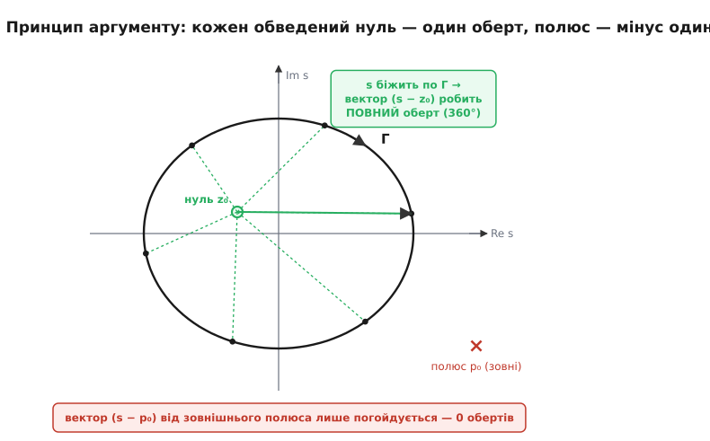
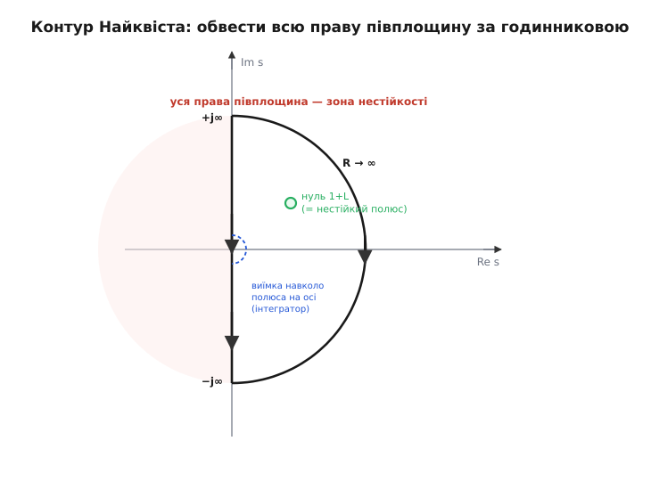
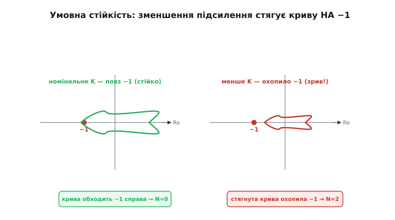

# 🧮 Критерій Найквіста від принципу аргументу

Ми вже звели питання стійкості замкненої петлі до одного рівняння: система живе своїми полюсами — коренями `1 + L(s) = 0`, — і зривається, щойно бодай один такий корінь опиниться в правій півплощині (додатна дійсна частина означає складову, що росте в часі). А ще ми бачили, що годограф `L(jω)` вирішує стійкість тим, як він проходить повз точку −1. Лишилося замкнути логічний ланцюг: **чому** саме прохід повз −1 — і саме обертання навколо неї — розповідає нам, скільки коренів рівняння сидить у забороненій зоні, хоча самих коренів ми не рахували й рівняння не розв'язували.

Це не фокус і не збіг. За ним стоїть одна з найгарніших теорем комплексного аналізу — **принцип аргументу**, — і критерій Найквіста є її прямим, майже дослівним наслідком. Розберімо все від першопричини: спершу — сам принцип аргументу на пальцях (чому обведений контуром нуль дає рівно один оберт), тоді — як його прикласти до `1 + L(s)`, який контур узяти, як звести «оберти навколо нуля» до звичних «обертів `L(jω)` навколо −1», і нарешті — формулу `Z = N + P` з чесною домовленістю про знак. У кінці побачимо, чому найпідступніший випадок — умовно стійка система, де менше підсилення **гірше** за більше, — простими двома запасами не ловиться, а повним критерієм ловиться, і як усе це стискається в одне число — vector margin.

## Що взагалі означає «полюс замкненої системи в правій півплощині»

Почнімо з того, що саме ми хочемо порахувати, — інакше принцип аргументу висітиме в повітрі.

Будь-яка лінійна система описується передавальною функцією — відношенням двох многочленів від `s`. Її поведінка в часі повністю задається **полюсами**: коренями знаменника. Кожен полюс `s = a + jb` породжує в русі системи складову виду `e^(at)·cos(bt)` — коливання частоти `b`, чия обвідна множиться на `e^(at)`. Знак дійсної частини `a` вирішує все:

```
a < 0  →  e^(at) згасає  →  складова стихає       (стійко)
a = 0  →  e^(at) = 1      →  складова не стихає     (межа)
a > 0  →  e^(at) росте    →  складова вибухає       (нестійко)
```

> 🔧 **Навіщо це.** Права півплощина — це не абстракція математика, а буквально «розкручується саме» на вашому апараті. Коли дрон після поштовху розгойдується дедалі сильніше замість заспокоїтися, це означає, що в його замкненій петлі оселився полюс із `a > 0`. Уся мета аналізу стійкості — переконатися наперед, розрахунком, що жоден полюс замкненої системи туди не потрапив, — бо на залізі ви це виявите вже коли щось зламається.

Полюси замкненої системи, як ми вивели, — це корені `1 + L(s) = 0`. Тобто нам треба відповісти на одне питання: **скільки коренів рівняння `1 + L(s) = 0` лежить у правій півплощині?** Позначмо це число `Z` (від *zeros* — це нулі функції `1 + L`). Стійкість означає рівно `Z = 0`.

Проблема в тому, що `L(s)` у реальному контурі — громіздкий добуток кількох ланок із мертвим часом, і знаходити корені `1 + L = 0` аналітично важко чи неможливо (мертвий час `e^(−sΔt)` взагалі робить рівняння трансцендентним — коренів нескінченно багато). Нам потрібен спосіб **порахувати `Z`, не знаходячи самих коренів**. Саме це дає принцип аргументу: він міняє «розв'язати рівняння» на «подивитися, як крива обходить точку», — а криву ми будувати вміємо, це і є годограф.

## Принцип аргументу: чому обведений нуль дає повний оберт

Ось серце всього. Візьмімо будь-яку функцію `F(s)`, що є відношенням многочленів (у нас це буде `F(s) = 1 + L(s)`). У неї є **нулі** (де `F = 0`, чисельник нуль) і **полюси** (де `F = ∞`, знаменник нуль). Тепер проведімо на площині `s` якийсь замкнений контур `Γ` і уявімо, що точка `s` повільно біжить по ньому, роблячи повне коло. Питання: як при цьому поводиться значення `F(s)` — точніше, його **аргумент** (кут на комплексній площині)?

Розберімо на найпростішому будівельному блоці. Нехай `F(s) = s − z₀` — функція з єдиним нулем у точці `z₀`. Значення `F(s)` — це вектор, проведений **від `z₀` до поточної `s`**. Коли `s` біжить по контуру, кінець цього вектора йде за нею, а сам вектор крутиться. І тут — ключове спостереження, усе тримається на ньому:

- Якщо `z₀` лежить **усередині** контуру, то вектор `(s − z₀)`, поки `s` оббігає контур повністю, теж робить **повний оберт** — його кут накопичує рівно ±360° (один повний виток).
- Якщо `z₀` лежить **зовні** контуру, вектор лише погойдується туди-сюди й повертається туди ж, звідки почав, — накопичений кут **нуль**.


*Механізм принципу аргументу. Точка s біжить по замкненому контуру Γ. Вектор (s − z₀) від обведеного нуля z₀ (зелений) обов'язково робить повний оберт на 360°, поки s оббігає контур, — бо контур «замикає» z₀ всередині. Вектор від зовнішнього полюса p₀ (червоний) лише погойдується й повертається на місце — нуль обертів. Уся теорема виростає з цього одного факту.*

Це майже очевидно геометрично: якщо ти стоїш **усередині** огорожі й дивишся на людину, що обходить огорожу зовні по колу, ти мусиш повернутися навколо своєї осі рівно раз, щоб не випустити її з очей. А якщо ти стоїш **зовні** огорожі — людина то з'явиться, то зникне за нею, але твій погляд гойднеться туди-сюди й повернеться в початковий бік, повного оберту не буде. `z₀` — це «ти», контур — огорожа, `s` — людина, вектор `(s − z₀)` — твій погляд.

Тепер зберімо повну `F(s)` з таких блоків. Будь-яке відношення многочленів розкладається на множники:

```
        (s − z₁)(s − z₂)···(s − z_m)        добуток по всіх НУЛЯХ
F(s) = ─────────────────────────────
        (s − p₁)(s − p₂)···(s − p_n)        добуток по всіх ПОЛЮСАХ
```

Аргумент добутку — це **сума** аргументів (кути при множенні складаються), а аргумент частки — **різниця**. Тож повна зміна аргументу `F(s)`, поки `s` оббігає контур, — це:

```
ΔargF  =  Σ (оберти векторів до нулів)  −  Σ (оберти векторів до полюсів)
```

Кожен нуль **усередині** контуру додає +1 оберт, кожен полюс усередині — віднімає 1 оберт, а все, що зовні, дає нуль. Позначмо `N_Z` — число нулів усередині, `N_P` — число полюсів усередині. Тоді загальна кількість обертів, що їх робить точка `F(s)` навколо початку координат, поки `s` раз оббіжить контур:

```
N_обертів = N_Z − N_P        (принцип аргументу)
```

Ось і вся теорема. Порахувати нулі й полюси функції всередині якоїсь області можна, **не знаходячи їх**, — просто подивившись, скільки разів образ `F(s)` намотується навколо нуля, поки `s` обходить межу області. Ця теорема — не наближення й не для якогось окремого класу функцій: вона строга для будь-якого відношення многочленів (а з обережністю — і для мертвого часу). Основу заклав Оґюстен-Луї Коші (Augustin-Louis Cauchy): версію цього результату він виклав у мемуарі, поданому в Турині 27 листопада 1831 року (там, щоправда, ішлося ще лише про нулі; повний вигляд із полюсами й публікація прийшли пізніше) — за століття до будь-якого керування. Це чиста математика комплексного аналізу, яку інженери зв'язку позичили значно згодом. *(Статус: усталений факт; авторство Коші й дата турінського мемуару — усталені в історії математики.)*

> Строге формулювання через інтеграл: `(1/2πj)·∮_Γ F′(s)/F(s) ds = N_Z − N_P`, бо `F′/F` — це похідна від `ln F`, а інтеграл від неї по замкненому контуру ловить саме приріст уявної частини логарифма, тобто приріст аргументу, поділений на 2π. Нам інтеграл рахувати не доведеться — досить його геометричного змісту (число обертів). Основа — комплексна диференційовність; докладніше про передавальні функції та їхні полюси — [передавальна функція](root:hw-analog/transfer-function).

Мертвий час `e^(−sΔt)` — не відношення многочленів, тож формально теорему треба обґрунтовувати обережніше (функція вже не раціональна). Але вона лишається чинною для широкого класу таких функцій, і практично критерій Найквіста застосовують до систем із затримкою без застережень — саме тому він і незамінний там, де корені порахувати неможливо.

## Який контур узяти: контур Найквіста

Принцип аргументу рахує нулі й полюси **всередині** контуру. Нам треба порахувати нулі `1 + L(s)` в **усій правій півплощині** (бо саме там небезпечні полюси замкненої системи). Отже, контур має обвести всю праву півплощину цілком. Такий контур і звуть **контуром Найквіста** (або D-контуром — за формою літери D).

Складається він із двох частин:

```
1. уся уявна вісь:      s = jω,  ω від +∞ до −∞   (згори вниз)
2. нескінченне півколо: s = R·e^(jθ),  R → ∞      (праворуч, замикає праву півплощину)
```


*Контур Найквіста в площині s. Уся уявна вісь (s = jω) проходиться згори вниз, від +j∞ до −j∞; тоді нескінченне півколо радіуса R→∞ замикає контур праворуч, обводячи всю праву півплощину. Обхід — за годинниковою стрілкою (це й задає знак). Нуль 1+L усередині (зелене коло) — це нестійкий полюс замкненої системи, який ми й хочемо полічити. Штрихова виїмка біля початку обходить полюс L на осі (випадок інтегратора), щоб не проходити просто крізь нього.*

Чому саме такий вибір і чому обхід за годинниковою стрілкою — розберімо кожну частину, бо тут ховаються всі тонкощі знака.

**Уявна вісь згори вниз.** Обходимо контур **за годинниковою стрілкою** — це стандартна домовленість, і саме вона дасть нам зручний знак. Обхід за годинниковою навколо правої півплощини означає: спускатися по уявній осі від `+j∞` до `−j∞`. Коли `s = jω` пробігає всю вісь, `F(s) = 1 + L(jω)` викреслює криву — і ця крива будується безпосередньо з годографа `L(jω)`, який ми вже вміємо будувати. Це і є місток від абстрактного контуру до практичного графіка.

**Нескінченне півколо.** На ньому `s → ∞`. Для будь-якої фізичної системи `L(s) → 0` на нескінченності (у реальному об'єкті знаменник передавальної функції старшого степеня, ніж чисельник, — вихід не може відгукуватися на нескінченно швидкі коливання). Тому `1 + L(s) → 1` на всьому півколі: уся ця нескінченна дуга контуру `s` стискається в площині `F` в одну-єдину точку `1 + 0 = 1`. Півколо **нічого не додає** до числа обертів — воно лише замикає контур, а весь «рахунок» іде з уявної осі. Це величезне спрощення: нескінченну частину контуру можна просто викинути з уваги.

**Виїмка навколо полюсів на осі.** Є одна пастка. Принцип аргументу вимагає, щоб на самому контурі не було ні нулів, ні полюсів `F(s)`. Але якщо в петлі є інтегратор (а він є майже завжди — це І-складова регулятора), то `L(s)` має полюс у `s = 0`, тобто рівно на уявній осі. Проходити контуром просто крізь полюс не можна — там `L = ∞`. Тому контур роблять із крихітною напівколовою **виїмкою**, що обходить такий полюс справа (по нескінченно малому півколу). Ця виїмка додає свій внесок в оберти, і його треба враховувати; на практиці вона дає半-оберт, який зсуває годограф на нескінченності — але суть залишається: контур обводить усю праву півплощину, обережно оминаючи особливі точки на її межі.

## Від обертів навколо нуля до обертів навколо −1

Тепер стулімо принцип аргументу з контуром Найквіста. Прикладаємо теорему до `F(s) = 1 + L(s)`, обводячи контуром Найквіста всю праву півплощину за годинниковою стрілкою. Позначення (усі — про **праву півплощину**):

```
Z — число НУЛІВ 1+L у правій півплощині = число нестійких полюсів ЗАМКНЕНОЇ системи (хочемо 0)
P — число ПОЛЮСІВ 1+L у правій півплощині
```

Тут — важлива тонкість, що прибирає плутанину. Полюси `1 + L(s)` — це ті самі полюси, що й у `L(s)` (додавання одиниці знаменника не міняє: `1 + L = (знаменник + чисельник)/знаменник`, знаменник той самий). А полюси `L(s)` — це полюси **розімкненої** петлі, тобто власні полюси об'єкта, датчика, регулятора. Отже `P` — це число нестійких полюсів **розімкненої** петлі, і його ми зазвичай знаємо наперед (кожна ланка окремо звичайно стійка, тож найчастіше `P = 0`).

Принцип аргументу дає: число обертів образу `F(s) = 1 + L(s)` навколо **нуля** дорівнює `Z − P`. Позначмо це число обертів `N` (за годинниковою стрілкою — додатне, бо і контур ми обходимо за годинниковою):

```
N = Z − P        ⟹        Z = N + P
```

Ось вона — формула критерію Найквіста, виведена, а не проголошена. Лишився останній практичний крок: рахувати оберти `1 + L(jω)` навколо нуля незручно — ми будуємо не `1 + L`, а сам годограф `L(jω)`. Але це те саме з точністю до зсуву на одиницю:

```
скільки разів (1 + L) обертається навколо 0
      ⇕  (бо 1 + L = 0  ⇄  L = −1)
скільки разів      L    обертається навколо −1
```

Додавання одиниці лише зсуває всю картину праворуч на 1; «нуль для `1 + L`» — це «−1 для `L`». Тому замість будувати `1 + L` і стежити за нулем, будуємо звичний годограф `L(jω)` і рахуємо його оберти навколо точки **−1**. Це і є остаточний робочий вигляд:

```
Z = N + P
   Z — нестійкі полюси ЗАМКНЕНОЇ системи   (треба, щоб Z = 0)
   N — оберти годографа L(jω) навколо −1    (за годинниковою — з +, проти — з −)
   P — нестійкі полюси РОЗІМКНЕНОЇ петлі L(s) (зазвичай 0)
```

**Домовленість про знак — прямо.** Ми обходимо контур `s` за годинниковою стрілкою; тому оберти образу теж міряємо за годинниковою й беремо їх зі знаком **плюс**. Оберт проти годинникової — зі знаком мінус. Це узгоджено: якщо годограф `L(jω)` обходить −1 один раз проти годинникової, то `N = −1`, і при `P = 1` вийде `Z = −1 + 1 = 0` — стійко (класичний випадок нестійкої розімкненої петлі, яку зворотний зв'язок стабілізує). Різні підручники пишуть формулу як `Z = N + P` (оберти за годинниковою додатні, як тут) або `Z = P − N` (оберти проти годинникової додатні) — це **та сама теорема**, лише з протилежним домовленим знаком `N`; головне — тримати знак послідовно з напрямом обходу контуру.

> 🔧 **Навіщо це.** На практиці `P` — це відповідь на питання «а чи стійка кожна ланка мого контуру сама по собі, з розірваним зв'язком?». Для звичайного об'єкта (маса, RC, двигун) — так, `P = 0`. Тоді все спрощується до одного погляду на годограф. Але буває `P > 0` — наприклад, коли сам об'єкт нестійкий без керування (перевернутий маятник, деякі перетворювачі в певних режимах). Тоді для стійкості годограф **мусить** обвести −1 потрібну кількість разів проти годинникової — і наївне «не охоплювати −1» дає хибну відповідь. Ось чому знати свій `P` — не формальність.

## Випадок P = 0: просто «не охоплювати −1»

Розгляньмо найчастіший на практиці випадок окремо, бо саме він виправдовує всю інтуїцію базового кроку. Нехай розімкнена петля стійка — усі її ланки самі по собі не вибухають, `P = 0`. Тоді формула стає гранично простою:

```
P = 0   ⟹   Z = N
```

Замкнена система стійка (`Z = 0`) **тоді й лише тоді, коли `N = 0`** — тобто коли годограф `L(jω)` **не охоплює** точку −1 (робить навколо неї нуль обертів). Ось і строге обґрунтування того, що ми бачили на годографі: крива має пройти **повз** −1, не замикаючи її в кільце.

Тепер видно, звідки бралася проста умова базового кроку («на частоті, де фаза = 180°, підсилення має бути < 1»). Якщо годограф — гладка спадна спіраль (типовий об'єкт із монотонним підсиленням), то він перетинає від'ємну дійсну піввісь рівно раз. Де він її перетинає — там фаза саме −180°. Якщо в цій точці `|L| < 1` (крива перетнула вісь ближче до нуля, ніж −1), крива проходить **правіше** −1 і не може її охопити — стійко. Якщо `|L| > 1` (перетнула далі за −1), крива обгортає −1 — нестійко. Проста умова — це просто окремий, найгладкіший випадок повного критерію.

Але слово «типовий» тут навантажене. Повний критерій дивиться на **всю** траєкторію, а не на одну точку перетину, — і саме тому ловить те, що проста умова проґавлює. До цього й переходимо.

## Обидва запаси — це відстані до −1

Перш ніж до підступних випадків, замкнімо ще одну петлю думки: два запаси стійкості, що ми ними міряли близькість до межі, тепер стають чистою геометрією відстані годографа до точки −1. Це глибше за «скільки лишилося до 180°»: обидва запаси — то один об'єкт (близькість до −1), поміряний двома різними лінійками.

**Запас по фазі — це кут.** Знайдімо на годографі точку, де `|L(jω)| = 1` (крива перетинає одиничне коло — частота кросовера `ωc`). Радіус-вектор до цієї точки має довжину рівно 1. Запас по фазі — кут між цим вектором і напрямом на −1 (від'ємна дійсна піввісь):

```
φ_m = 180° + ∠L(jωc)
```

Геометричний зміст прямий: якби ми доклали ще `φ_m` градусів фазового відставання, точка кросовера **сіла б рівно на −1** — межа. Тобто `φ_m` — це «скільки зайвого запізнення петля витримає, перш ніж крива торкнеться −1».

**Запас по підсиленню — це відношення.** Знайдімо точку, де фаза = −180° (крива перетинає від'ємну дійсну піввісь). Там `L` — від'ємне дійсне число, скажімо −0.43. Запас по підсиленню — у скільки разів можна підняти підсилення, поки ця точка доповзе до −1:

```
g_m = 1 / |L(jω_180)|
```

Обидва — буквально «наскільки близько крива підійшла до −1» у двох окремих точках. І ось де криється пастка, яку ми зараз розкриємо: **а що, як крива підійшла близько до −1 не в цих двох точках, а між ними?**

## Чому двох запасів інколи мало

Два запаси знімають відстань до −1 у **двох окремих точках** годографа: там, де він перетинає одиничне коло (запас по фазі), і там, де перетинає від'ємну вісь (запас по підсиленню). Повний критерій дивиться на **всю** криву. Розбіжність між ними й породжує випадки, де проста пара запасів бреше.

**Близький прохід між точками виміру.** Уявімо годограф, що перетинає одиничне коло з добрим кутом (великий запас по фазі) і перетинає від'ємну вісь далеко від −1 (великий запас по підсиленню) — але **між** цими двома перетинами підходить до −1 майже впритул, огинаючи її по дузі. Обидва запаси кричать «усе добре», а насправді найменший поштовх — і крива охопить −1. Два числа не бачать того, що діється **поза** їхніми двома точками.

**Кратні перетини.** Якщо крива підсилення немонотонна, `|L|` може перетнути одиницю кілька разів; якщо фаза підходить до −180° і відступає — від'ємну вісь теж. Тоді «той самий» запас можна відрахувати в кількох місцях, і лише один із них — про справжню межу. Автоматичний вимір, що хапає перший-ліпший перетин, назве не те число й дасть оманливу впевненість.

**Умовно стійкі системи — найпідступніше.** Буває, що замкнена система **стійка за великого** підсилення й **нестійка за малого** — рівно навпаки до інтуїції «менше підсилення = безпечніше». Механізм видно тільки на повному годографі:


*Умовно стійка система. Ліворуч: за номінального підсилення годограф проходить повз −1 з правильного боку (N = 0) — стійко. Праворуч: зменшення підсилення стягує криву до початку — і її петля наповзає на −1, охоплюючи її двічі (N = 2) — зрив. Для такого контуру «здам трохи Kp про всяк випадок» — прямий шлях до катастрофи. Проста пара запасів цього не бачить; повний підрахунок обертів — бачить.*

Прослідкуймо механізм. Підсилення `K` розтягує **весь** годограф від початку координат, як гумку: побільшити `K` — крива роздувається геть від нуля, поменшити — стягується до нуля. Якщо крива має характерний завиток (петлю), то за номінального `K` вона проходить повз −1 з правильного боку. Але **зменшення** `K` стягує криву так, що її петля наповзає на −1 і охоплює її:

```
велике K  →  годограф широкий, петля проходить ПОВЗ −1     →  N = 0  →  стійко
мале   K  →  годограф стягнутий, петля НАПОВЗАЄ на −1        →  N ≠ 0  →  зрив
```

Для такого контуру наївне «здам трохи Kp про всяк випадок» — прямий шлях до зриву. Повний критерій Найквіста рахує обходи −1 і чесно каже, що обидві межі (і згори, і знизу по `K`) реальні; пара запасів, знята за номінального `K`, покаже добрі числа й змовчить про нижню межу. Умовно стійкі системи виникають не так уже й рідко — зокрема в контурах із кількома інтеграторами чи хитрою корекцією, — і саме на них інтуїція базового кроку ламається найболючіше.

Витоки цієї теорії пояснюють, чому годограф, а не пара чисел, був первинним поглядом на стійкість: [історія запасів стійкості](root:embedded/loop-stability/hist-nyquist-bode.md) — як телефонна мережа змусила інженерів Bell Labs винайти частотний критерій.

## Одне число замість двох: vector margin

Якщо всі три пастки — про те, що годограф підходить близько до −1 там, де два запаси не дивляться, — то напрошується правильна єдина міра: **найкоротша відстань від годографа до −1**. Її звуть запасом за модулем, або vector margin:

```
S_m = min |1 + L(jω)|        (мінімум по всіх ω)
       ω
```

Придивімося, що це за вираз. `1 + L(jω)` — це вектор **від точки −1 до поточної точки годографа** `L(jω)` (бо `L − (−1) = L + 1 = 1 + L`). Його модуль — відстань від −1 до цієї точки. Беручи мінімум по всіх частотах, ми знаходимо **найближче наближення** всієї кривої до −1, хоч би де воно сталося — у точці кросовера, на від'ємній осі чи між ними. Одне число ловить усі близькі проходи, які пара запасів проґавлює.

`S_m` — це буквально радіус найбільшого кола з центром у −1, якого годограф **не** зачіпає. Чим `S_m` більший, тим далі крива тримається від фатальної точки з усіх боків одразу. Гарний контур має `S_m` не менше ніж приблизно 0.5.

**Worked-приклад: коли два запаси брешуть, а S_m каже правду.**
```
Годограф контуру:
 • перетинає одиничне коло під кутом, що дає φ_m = 52°   (начебто добре)
 • перетинає від'ємну вісь у точці −0.4, тобто g_m = 2.5× (начебто добре)
 • але МІЖ цими точками підходить до −1 на відстань 0.28

S_m = 0.28
```
**Висновок.** Обидва класичні запаси — здорові (52° і 2.5×), і за ними контур «надійний». Та `S_m = 0.28` викриває: крива підходить до −1 на 0.28 в місці, де жоден із двох запасів не дивиться. Це контур на грані — досить малої зміни навантаження, щоб `S_m` упав до нуля й крива охопила −1. Саме тому в серйозному проєктуванні `S_m` рахують поряд із двома запасами: він єдиний ловить близькі проходи одним числом.

Головне, що `S_m` **гарантує** запас і по фазі, і по підсиленню одразу: заданий `S_m` знизу обмежує обидва звичні запаси (є прості нерівності `g_m ≥ 1/(1 − S_m)` і `φ_m ≥ 2·arcsin(S_m/2)`). Тому не буває так, щоб `S_m` був здоровий, а якийсь окремий запас — небезпечно малий; а от навпаки — обидва запаси добрі, а `S_m` малий — буває легко (це і є близький прохід). Саме тому там, де ціна помилки висока (медтехніка, авіоніка, силові перетворювачі), цілять у `S_m`, а не в пару чисел.

> 🔧 **Навіщо це.** У прошивці, що сама міряє запаси свого контуру, `S_m` рахується так само легко, як два класичні запаси, — просто мінімум `|1 + L(jω)|` по свіпу частот, — але дає чеснішу відповідь. Якщо автоналаштування бачить, що `φ_m` і `g_m` начебто добрі, а `S_m` просів, — це прапорець «крива підходить до −1 там, де ти не дивишся», і саме тоді треба будувати повний годограф, а не вірити двом числам. Практичний вимір усіх трьох одним прогоном коду — у сусідній вставці: [вимір запасів дискретного контуру в прошивці](root:embedded/loop-stability/proj-discrete-margin.md).

## Разом: чому −1, а не будь-яка інша точка

Пройдімо всю нитку одним поглядом, тепер уже строго — бо тепер кожна ланка має обґрунтування.

Замкнена система живе коренями `1 + L(s) = 0`; корінь у правій півплощині означає складову, що росте, — зрив. Порахувати такі корені прямо важко (мертвий час робить рівняння трансцендентним), тож ми не рахуємо їх, а застосовуємо принцип аргументу: обвівши контуром усю праву півплощину, дивимося, скільки разів образ `1 + L(s)` намотується навколо нуля. Принцип аргументу перетворює цей рахунок обертів на `Z − P` — число нестійких нулів мінус число нестійких полюсів усередині контуру. Звівши «оберти навколо нуля образу `1 + L`» до «обертів годографа `L(jω)` навколо −1» (бо `1 + L = 0` ⇄ `L = −1`), дістаємо робочу формулу `Z = N + P`.

Ось точна відповідь на «чому саме −1»: тому що `−1` — це образ нуля функції `1 + L` у координатах `L`. Не магічне число, а геометричне місце, куди годограф `L` мусить прийти, щоб `1 + L` став нулем, тобто щоб народився полюс замкненої системи на межі. Оберти навколо −1 рахують, скільки таких полюсів пробралося в праву півплощину:

```
годограф L(jω) НЕ охоплює −1  (при P=0)   →   Z = 0   →   стійко
годограф L(jω)    охоплює −1              →   Z ≠ 0   →   нестійко
```

І звідси — чому обидва запаси стійкості є просто **геометрією близькості до −1**: запас по фазі — кут до −1 у точці, де `|L| = 1`; запас по підсиленню — відношення відстаней уздовж осі до −1; а `S_m` — найкоротша відстань до −1 узагалі, що ловить те, що дві окремі точки проґавлюють. Уся теорія стійкості зворотного зв'язку — про одну точку на комплексній площині й про те, як від неї тримається крива петлі.

Для переважної більшості реальних вбудованих контурів — один об'єкт із монотонно спадним підсиленням, стійка розімкнена петля (`P = 0`), гладкий годограф — повний критерій каже точно те саме, що проста пара запасів, і думати про стійкість як про «відстань до −1» цілком правильно. Повний апарат потрібен рівно тоді, коли спрацьовує один із трьох прапорців: немонотонна фаза, кратні кросовери або підозра на умовну стійкість. Тоді два числа брешуть — а підрахунок обертів навколо −1 каже правду.
