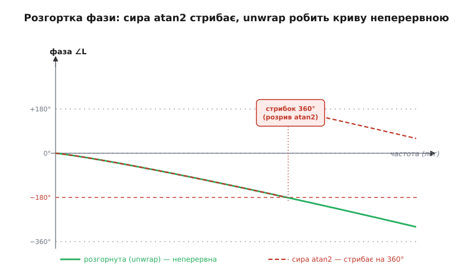
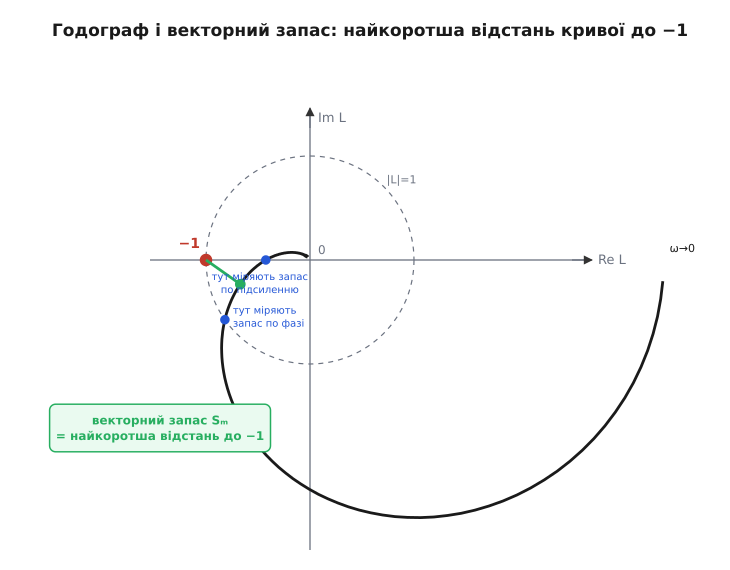

# ⚙️ Аналізатор запасів дискретного контуру

У темі ми домовилися міряти відстань до зриву двома числами — запасом по фазі й запасом по підсиленню — і навіть намалювали, як вони читаються з двох кривих: підсилення |L| проти частоти й фаза L проти частоти. Але між «намалювали» й «знаю точні цифри для свого контуру» лежить робота, яку в реальному проєкті ніхто не робить олівцем по палетці. Її робить код. Ви даєте йому опис петлі — полюси об'єкта, коефіцієнти ПІД, крок дискретизації, — а він повертає три числа: PM, GM і частоти, на яких вони живуть. І робить це за мілісекунди, тож ви можете міняти коефіцієнт і бачити, як тане запас, ще не торкнувшись заліза.

Тут ми зберемо такий аналізатор цілком — справжнім C/C++, який компілюється й рахує, а не псевдокодом «для ілюстрації». Пройдемо весь конвеєр: як зобразити комплексне підсилення петлі на кожній частоті (з полюсами, мертвим часом і ПІД із фільтром похідної), як прогнати логарифмічний свіп частот, як **розгорнути** фазу, щоб вона не стрибала на 360°, як знайти частоту кросовера й частоту −180° з інтерполяцією, і як звідти дістати обидва запаси. Наприкінці додамо те, чого прості два запаси не бачать, — **векторний запас**: найкоротшу відстань годографа до фатальної точки −1. І проженемо все це двічі, на двох частотах дискретизації, щоб на живих числах побачити, як повільніший цикл з'їдає запас по фазі з 43° до 14°.

Це не навчальна вправа заради коду. Різниця між «покрутив коефіцієнти й наче не дзвенить» і «знаю, що на частоті кросовера в мене лишилось рівно 43° запасу, а якщо опущу частоту АЦП удвічі — лишиться 14°» — це різниця між прошивкою, яку страшно віддавати в поле, і прошивкою, за яку ти спокійний. Аналізатор дає друге.

## Задача: перетворити опис петлі на три числа

Сформулюймо дослівно, що на вході й що на виході. На вході — **опис розімкненої петлі** L: усе, крізь що проходить сигнал, обійшовши коло один раз, але **не** замкнувши його. Об'єкт (те, чим керуємо — двигун, нагрівач, вісь дрона), давач, регулятор, виконавчий орган і — окремим гравцем у цифровому контурі — сама затримка дискретизації. На виході — три числа: **запас по фазі** (скільки градусів фаза не дійшла до −180° там, де підсилення = 1), **запас по підсиленню** (у скільки разів підсилення нижче одиниці там, де фаза = −180°) і додатково **векторний запас** (найближча відстань годографа до −1).

Уся складність у слові «підсилення петлі на частоті». Що це взагалі за число? Коли крізь лінійну ланку проходить синус частоти ω, на виході — той самий синус тієї самої частоти, але з іншою **амплітудою** (у K разів більшою чи меншою) і зсунутий по **фазі** (на φ радіан). Два числа — множник амплітуди й зсув фази — повністю описують, що ланка робить із синусом цієї частоти. А два числа, «розтяг і поворот», — це рівно одне **комплексне число**: його модуль |z| = розтяг, його аргумент arg(z) = поворот. Ось чому весь частотний аналіз говорить комплексними числами: не з любові до математики, а тому що «амплітуда й фаза» природно пакуються в комплексне число, і — головне — послідовні ланки тоді просто **перемножуються**.

> 🔧 **Навіщо це.** Уся практична цінність комплексного запису — в одному факті: якщо сигнал іде крізь ланку A, потім крізь ланку B, повне підсилення петлі на цій частоті — це просто добуток `A·B` як комплексних чисел. Модулі множаться (загальний розтяг = добуток розтягів), аргументи додаються (загальний поворот = сума поворотів) — і те, й те одним множенням. Тому в коді петля з п'яти ланок — це п'ять комплексних множень поспіль, без жодної тригонометрії вручну. Комплексне число тут — не абстракція, а формат даних, що дає безкоштовне складання фаз.

Комплексне число як «модуль-розтяг плюс аргумент-поворот» — це та сама полярна форма, з якої росте вся ця машинерія. Якщо потрібно освіжити, чому arg перемножуваних чисел додаються, а модулі множаться — [комплексні числа й полярна форма](topic:math/complex-numbers).

Отже, план: навчитися рахувати комплексне L(ω) для кожної ланки, перемножити ланки, прогнати ω по діапазону, з отриманих |L| і arg(L) видобути запаси. Почнімо з ланок.

## Ідея: кожна ланка — це комплексне число від частоти

Розкладімо петлю на цеглинки. Кожна цеглинка вміє одне: за частотою ω повернути своє комплексне підсилення. Нам треба три типи цеглинок — їх досить, щоб зібрати переважну більшість реальних контурів прошивки.

**Полюс — інерційна ланка.** Це серце будь-якого фізичного об'єкта, що «не встигає»: маса, яку розганяють; конденсатор, що набирає заряд; кімната, що прогрівається. Математично одиночний полюс на частоті ωp дає підсилення

```
              1
 P(ω) = ───────────────
         1 + j·(ω/ωp)
```

Тут `j` — уявна одиниця (в електротехніці пишуть `j`, а не `i`, щоб не плутати зі струмом). Розберімо, що ця формула **робить**, бо в ній уся інтуїція інерції. На **низьких** частотах (ω ≪ ωp) дріб `ω/ωp` малий, знаменник ≈ 1, підсилення ≈ 1 і фаза ≈ 0: повільний сигнал ланка пропускає майже без змін — маса встигає за ним. На **високих** (ω ≫ ωp) знаменник ≈ `j·ω/ωp` — велике уявне число; модуль підсилення падає як `ωp/ω` (ланка глушить швидке), а фаза прямує до −90° (arg(1/j) = −90°): швидкий сигнал ланка і тисне, і сильно запізнює. Рівно на ωp знаменник = `1 + j`, модуль = 1/√2 ≈ 0.707, фаза = −45°. Ось звідки в темі бралося «кожна інерційна ланка додає до 90° зсуву»: це стеля arg однополюсної ланки.

**Мертвий час — чиста затримка.** Найпідступніша ланка, бо, як ми бачили в темі, її фаза росте без меж. Затримка на τ секунд не чіпає амплітуду (модуль = 1 — сигнал не слабне, лише спізнюється), зате повертає фазу рівно на `−ω·τ`:

```
 D(ω) = e^(−j·ω·τ) = cos(ω·τ) − j·sin(ω·τ)
```

Що більша ω, то більший поворот — і жодної стелі: на подвоєній частоті вдвічі більший кут, і так до безмежності. Саме тому системи з відчутним мертвим часом найважчі. А в цифровому контурі мертвий час є **завжди**, навіть якщо фізичний об'єкт його не має, — і зараз ми побачимо, звідки.

**Півтакту дискретизації — прихований мертвий час.** Ось перша тонкість, через яку «в симуляції неперервного контуру запас був, а на залізі дзвенить». Цифровий регулятор не діє неперервно. Він **тримає** керуючий сигнал сталим цілий такт `Ts` (це робить цифро-аналоговий перетворювач своїм фіксатором нульового порядку), поки не порахує наступне значення. У середньому вихід відстає від «ідеального неперервного» на **пів такту** — на `Ts/2`. До цього додається час на саме обчислення (АЦП зчитав → регулятор порахував → ЦАП виставив): ще один такт, якщо результат виставляють наступного циклу. Разом цифровий контур несе мертвий час порядку

```
 τ_цифр ≈ Ts/2  +  Ts   =  1.5·Ts     (фіксатор пів-такту + такт на обчислення)
```

і саме ця затримка, помножена на ω, з'їдає запас по фазі тим більше, чим рідше ви дискретизуєте. Половину такту від фіксатора нульового порядку — це усталений результат теорії дискретного керування: ЦАП із утриманням додає рівно `ω·Ts/2` радіан фазового відставання (за «Zero-order hold», стандартний виклад цифрового керування; той самий множник `ωT/2` наводять усі підручники дискретних систем). Це — головний важіль нашого фінального демо: удвічі рідший цикл подвоює цю затримку, і ми побачимо, як тане запас.

**ПІД із фільтром похідної.** Регулятор — теж ланка петлі, зі своїм комплексним підсиленням. Пропорційна частина проста: множник `Kp`, фаза 0. Інтегральна `Ki/(j·ω)` дає модуль, що падає з частотою, і фазу −90° (пам'ять коштує відставання — як ми бачили в темі). Диференційна `Kd·j·ω` дала б фазу +90° (випередження, те, за що Д цінують), але в чистому вигляді її ставити не можна: `j·ω` росте з частотою без меж і підсилює високочастотний шум датчика до неможливого. Тому в реальній прошивці Д **завжди** з фільтром: диференціатор беруть із полюсом на частоті `ωd`, вище якої випередження зрізають, щоб не тягнути шум, — тобто похідну беруть від згладженого сигналу. Разом:

```
                     Kd·j·ω
 C(ω) = Kp + Ki/(j·ω) + ───────────────
                       1 + j·ω/ωd
```

Ця форма важлива не косметично: полюс фільтра `ωd` сам додає своє відставання фази, і якщо поставити його надто низько, він з'їсть те саме випередження, заради якого й ставили Д. Аналізатор це побачить одразу — тому й беремо ПІД у чесній, а не в підручниково-ідеальній формі.

> 🔧 **Навіщо це.** Найпоширеніша пастка налаштування: інженер додає Д-складову «для стійкості», а запас по фазі не росте або й падає. Причина майже завжди — полюс фільтра похідної `ωd` стоїть заблизько до кросовера, і його −90° відставання гасять +90° випередження самого диференціатора. Аналізатор із чесною формою `Дфільтр` показує це числом: піднімаєш `ωd` — запас по фазі росте, поки шум ще терпимий. Без фільтра в моделі ви б цієї біди просто не побачили й дивувалися б на стенді.

Тепер зберімо все це в код. Спершу — комплексна арифметика, потім — ланки, потім — свіп і пошук запасів.

## Робочий C/C++: комплексне ядро й ланки петлі

Стандартна бібліотека C++ має `std::complex`, і в застосунковому коді на великому мікроконтролері ним і користуються. Але щоб показати, що всередині немає магії (і щоб код ліг навіть туди, де `<complex>` небажаний), напишемо власний крихітний комплексний тип на чотири дії — рівно стільки, скільки треба аналізатору. Це і документує, **що саме** відбувається на кожному множенні ланок.

```c
#include <math.h>
#include <stddef.h>

/* ── Крихітне комплексне ядро: модуль=розтяг, аргумент=поворот ────────── */
typedef struct { double re, im; } cplx;

static inline cplx c_make(double re, double im) { cplx z = {re, im}; return z; }

static inline cplx c_add(cplx a, cplx b) {
    return c_make(a.re + b.re, a.im + b.im);
}

/* добуток: модулі множаться, аргументи додаються — саме тому ланки просто перемножуємо */
static inline cplx c_mul(cplx a, cplx b) {
    return c_make(a.re * b.re - a.im * b.im,
                  a.re * b.im + a.im * b.re);
}

/* ділення a/b через множення на спряжене знаменника */
static inline cplx c_div(cplx a, cplx b) {
    double d = b.re * b.re + b.im * b.im;
    return c_make((a.re * b.re + a.im * b.im) / d,
                  (a.im * b.re - a.re * b.im) / d);
}

static inline double c_abs(cplx z) {           /* модуль = розтяг амплітуди */
    return sqrt(z.re * z.re + z.im * z.im);
}

static inline double c_arg(cplx z) {           /* аргумент = зсув фази, рад, у (−π, π] */
    return atan2(z.im, z.re);
}
```

Зверніть увагу на `c_mul`: у ньому й захована вся зручність комплексного запису. Розкривши дужки в `(a.re + j·a.im)·(b.re + j·b.im)` і пам'ятаючи, що `j² = −1`, дістаємо саме ці дві формули — і геометрично це означає «розтяги перемножились, повороти склались». Кожне множення ланок петлі — один виклик `c_mul`, і фази складаються самі.

Тепер ланки. Кожна — функція `(ω, параметри) → cplx`, дослівний переклад формул вище:

```c
/* Одиночний полюс на частоті wp (рад/с): інерція, до −90° фази */
static cplx link_pole(double w, double wp) {
    /* 1 / (1 + j·w/wp) */
    return c_div(c_make(1.0, 0.0), c_make(1.0, w / wp));
}

/* Чиста затримка tau (с): фаза −w·tau, модуль 1 */
static cplx link_delay(double w, double tau) {
    double a = -w * tau;
    return c_make(cos(a), sin(a));            /* e^(−j·w·tau) */
}

/* ПІД із фільтрованою похідною: Kp + Ki/(j·w) + Kd·j·w/(1 + j·w/wd) */
static cplx link_pid(double w, double Kp, double Ki, double Kd, double wd) {
    cplx P = c_make(Kp, 0.0);
    /* Ki/(j·w) = −j·Ki/w  (бо 1/j = −j) */
    cplx I = (w > 0.0) ? c_make(0.0, -Ki / w) : c_make(0.0, 0.0);
    /* Kd·j·w / (1 + j·w/wd) */
    cplx Dnum = c_make(0.0, Kd * w);
    cplx Dden = c_make(1.0, w / wd);
    cplx D = c_div(Dnum, Dden);
    return c_add(c_add(P, I), D);
}
```

І, нарешті, збірка розімкненої петлі L(ω) — перемноження всіх ланок конкретного контуру. Змоделюймо типовий для прошивки об'єкт: керування швидкістю двигуна (одна виразна механічна інерція) з давачем-фільтром (ще одна інерційна ланка), під керуванням ПІД, і з мертвим часом дискретизації зверху. Опис петлі складемо в структуру, щоб аналізатор був універсальний, а не прибитий цвяхами до одного набору чисел:

```c
/* Опис усієї розімкненої петлі — усе, що аналізатор має знати про контур */
typedef struct {
    double wp_plant;   /* полюс об'єкта (механіка), рад/с */
    double wp_sensor;  /* полюс давача-фільтра, рад/с    */
    double Kp, Ki, Kd; /* коефіцієнти ПІД                */
    double wd;         /* полюс фільтра похідної, рад/с  */
    double Ts;         /* крок дискретизації, с          */
    double dc_gain;    /* сумарний сталий коеф. тракту (об'єкт·давач·актуатор) */
} loop_t;

/* Комплексне підсилення розімкненої петлі на частоті w (рад/с) */
static cplx loop_L(const loop_t *L, double w) {
    /* цифровий мертвий час: пів-такт фіксатора + такт на обчислення ≈ 1.5·Ts */
    double tau = 1.5 * L->Ts;

    cplx out = c_make(L->dc_gain, 0.0);        /* сталий коефіцієнт тракту */
    out = c_mul(out, link_pole(w, L->wp_plant));
    out = c_mul(out, link_pole(w, L->wp_sensor));
    out = c_mul(out, link_pid(w, L->Kp, L->Ki, L->Kd, L->wd));
    out = c_mul(out, link_delay(w, tau));
    return out;
}
```

Ось і вся модель контуру: п'ять множень, і `loop_L` повертає точне комплексне підсилення петлі на будь-якій частоті. Тепер — головне, свіп і видобування запасів.

## Свіп частот і чому фазу треба розгортати

Щоб побачити криві |L| і arg(L), проженемо ω по діапазону. Перша важлива дрібниця: свіп має бути **логарифмічний**, а не рівномірний. Причина проста — цікаві події (падіння підсилення до одиниці, наростання фази до −180°) розтягнуті на **порядки** частоти: полюс об'єкта може бути на 20 рад/с, а Найквіст — на 20000. Рівномірний крок або пропустить низ (крок завеликий там, де все важливе), або марно перемеле мільйон точок угорі. Логарифмічний свіп кладе однакову **кількість** точок на кожну декаду — і низ, і верх однаково детальні.

```c
/* Логарифмічно рівномірна сітка частот: N точок від w_lo до w_hi */
static void log_sweep(double w_lo, double w_hi, int N, double *w_out) {
    double ratio = pow(w_hi / w_lo, 1.0 / (N - 1));  /* спільний множник кроку */
    double w = w_lo;
    for (int i = 0; i < N; ++i) {
        w_out[i] = w;
        w *= ratio;               /* множимо, а не додаємо — звідси й «лог» */
    }
}
```

Друга дрібниця — і це головна пастка всього аналізу — **розгортка фази** (англ. *unwrap* — «розмотати»). `atan2` (а отже, наш `c_arg`) чесно повертає кут лише в діапазоні (−180°, +180°]. Щойно справжня фаза петлі переходить за −180°, `atan2` стрибком видає +180° — не тому, що фаза стрибнула, а тому що функція «перескочила» через розріз. На сирій кривій це має вигляд вертикальної прірви на 360°. Якщо шукати −180° по такій кривій наївно, аналізатор або промаже повз кросовер, або знайде фазу −180° там, де її насправді нема, — і видасть повну нісенітницю замість запасу.


*Чому фазу треба розгортати. Пунктиром — сира фаза з atan2: щойно справжній зсув переходить за −180°, функція стрибком повертає +180°, і крива має розрив на 360°. Суцільна лінія — розгорнута: щоразу, коли між сусідніми точками стрибок більший за 180°, до всіх наступних точок додаємо −360°, прибираючи штучну прірву. Тільки на неперервній кривій пошук частоти −180° і кросовера дає правильні числа.*

Алгоритм розгортки простий і надійний: іди по точках; якщо стрибок фази між сусідами більший за +180°, відніми 360° від усіх наступних; якщо менший за −180°, додай 360°. Це рівно те, що робить класичний `unwrap` (за описом `numpy.unwrap`: різниці більші за половину періоду коригуються додаванням кратних 2π — усталений, повсюдно вживаний прийом). Один прохід, стала пам'ять:

```c
/* Розгортка фази на місці: прибирає стрибки ±360°, роблячи криву неперервною */
static void unwrap_phase(double *ph, int N) {
    double corr = 0.0;                 /* накопичена поправка, рад */
    for (int i = 1; i < N; ++i) {
        double d = (ph[i] + corr) - ph[i - 1];
        if (d >  M_PI) corr -= 2.0 * M_PI;   /* стрибок угору > 180° → тягнемо вниз */
        else if (d < -M_PI) corr += 2.0 * M_PI;
        ph[i] += corr;
    }
}
```

Тепер зберімо свіп: на кожній частоті рахуємо L, беремо модуль у децибелах і фазу в радіанах, тоді розгортаємо фазу одним проходом.

```c
#define NW 400                         /* точок свіпу; 400 на 5 декад = 80/декаду */

typedef struct {
    double w[NW];        /* частоти, рад/с            */
    double mag_db[NW];   /* |L| у дБ                  */
    double ph_deg[NW];   /* фаза, градуси (розгорнута) */
} sweep_t;

static void run_sweep(const loop_t *L, double w_lo, double w_hi, sweep_t *s) {
    log_sweep(w_lo, w_hi, NW, s->w);
    double ph_rad[NW];
    for (int i = 0; i < NW; ++i) {
        cplx Lw = loop_L(L, s->w[i]);
        double m = c_abs(Lw);
        s->mag_db[i] = 20.0 * log10(m);     /* дБ: 0 дБ = підсилення 1 */
        ph_rad[i] = c_arg(Lw);              /* сира фаза, (−π, π]        */
    }
    unwrap_phase(ph_rad, NW);               /* робимо криву неперервною  */
    for (int i = 0; i < NW; ++i)
        s->ph_deg[i] = ph_rad[i] * 180.0 / M_PI;
}
```

Одна деталь варта уваги: працюємо в **децибелах** (`20·log10|L|`), тому рівень «підсилення = 1» — це рівно **0 дБ**. Це не косметика: у дБ криві множення ланок стають додаванням (логарифм добутку = сума логарифмів), і кросовер шукається як перетин нуля, а не одиниці. Аналізатору байдуже, а нам зручніше й ближче до того, як ці криві звикли читати. Крива готова — лишається видобути з неї три числа.

## Пошук кросовера, точки −180° та інтерполяція

Свіп дав нам криву **точками**. Але частота кросовера (де `mag_db` перетинає 0) майже напевно лежить **між** двома сусідніми точками сітки — точно на вузол вона не сяде. Якщо просто взяти найближчу точку, помилимося на пів кроку сітки, а це на логарифмічній осі — відчутний відсоток частоти й кілька градусів фази. Тому шукаємо перетин і **інтерполюємо**.

Ідея пошуку: йди по сусідніх парах точок і лови **зміну знаку** тієї величини, чий нуль шукаєш. Для кросовера це `mag_db`: якщо в точці `i` воно ще додатне (підсилення > 1), а в `i+1` вже від'ємне (< 1), — десь між ними воно перетнуло нуль. Лінійна інтерполяція по логарифму частоти дає і саму частоту кросовера, і — головне — фазу на ній:

```c
/* Лінійна інтерполяція y на частоті, де крива val перетинає рівень lvl,
   між вузлами i та i+1. Повертає інтерпольоване значення масиву y_out. */
static double interp_at_crossing(const double *w, const double *val,
                                 const double *y, int i, double lvl) {
    /* частка t ∈ [0,1]: де саме між val[i] і val[i+1] стоїть рівень lvl */
    double t = (lvl - val[i]) / (val[i + 1] - val[i]);
    return y[i] + t * (y[i + 1] - y[i]);      /* те саме t застосовуємо до y */
}
```

Тепер два запаси. **Запас по фазі**: знайти першу пару, де `mag_db` падає крізь 0, інтерполяцією взяти там фазу — і запас це `фаза − (−180°)`, тобто скільки лишилось до −180°:

```c
/* Результат аналізу: три числа + частоти, де вони живуть */
typedef struct {
    double pm_deg;      /* запас по фазі, градуси          */
    double gm_db;       /* запас по підсиленню, дБ         */
    double w_gc;        /* частота кросовера (gain xover)  */
    double w_pc;        /* частота фази −180° (phase xover) */
    int    has_gc;      /* чи знайдено кросовер            */
    int    has_pc;      /* чи знайдено точку −180°         */
} margins_t;

static void find_phase_margin(const sweep_t *s, margins_t *m) {
    m->has_gc = 0;
    for (int i = 0; i + 1 < NW; ++i) {
        /* кросовер: mag_db падає з «>0» у «<0» */
        if (s->mag_db[i] >= 0.0 && s->mag_db[i + 1] < 0.0) {
            double ph = interp_at_crossing(s->w, s->mag_db, s->ph_deg, i, 0.0);
            m->w_gc = interp_at_crossing(s->w, s->mag_db, s->w, i, 0.0);
            m->pm_deg = ph - (-180.0);         /* скільки фазі лишилось до −180° */
            m->has_gc = 1;
            return;                            /* перший (найнижчий) кросовер */
        }
    }
}
```

**Запас по підсиленню** — дзеркально: знайти, де **фаза** падає крізь −180°, інтерполяцією взяти там `mag_db` — і запас це `0 − mag_db` (наскільки підсилення нижче 0 дБ, тобто нижче одиниці):

```c
static void find_gain_margin(const sweep_t *s, margins_t *m) {
    m->has_pc = 0;
    for (int i = 0; i + 1 < NW; ++i) {
        /* точка −180°: фаза падає з «> −180» у «< −180» */
        if (s->ph_deg[i] >= -180.0 && s->ph_deg[i + 1] < -180.0) {
            double mag = interp_at_crossing(s->w, s->ph_deg, s->mag_db, i, -180.0);
            m->w_pc = interp_at_crossing(s->w, s->ph_deg, s->w, i, -180.0);
            m->gm_db = 0.0 - mag;              /* наскільки |L| нижче 0 дБ */
            m->has_pc = 1;
            return;                            /* перший перетин −180°     */
        }
    }
}
```

Зверніть увагу на прапорці `has_gc`/`has_pc`: вони не косметика. Бувають цілком реальні контури, де кросовера **нема зовсім** (підсилення петлі ніде не доходить до одиниці — дуже м'який регулятор), або де фаза **ніколи** не дістає −180° (мало інерційних ланок, слабкий мертвий час). Тоді відповідного запасу просто не існує, і чесна відповідь — «не знайдено», а не якесь випадкове число з неініціалізованої пам'яті. Наївний аналізатор, що завжди повертає `pm_deg`, у такому разі бреше. Ми до цієї пастки ще повернемось.

## Годограф і векторний запас: найкоротша відстань до −1

Тема чесно попереджала: два запаси — робоче наближення, а строгу межу бачить критерій Найквіста, що дивиться на **всю** криву петлі як на один шлях на комплексній площині. Додаймо до аналізатора саме цей погляд — і витягнемо з нього одне число, яке двом окремим запасам не під силу.

Намалюймо L(ω) не двома кривими, а **однією**: для кожної ω поставимо на комплексній площині точку з координатами `(Re L, Im L)`. Зі зростанням ω точка викреслює криву — **годограф** (грец. *hodós* — шлях + *gráphō* — креслю; «запис шляху»). Уся стійкість тепер про одну точку цієї площини: **−1** (тобто `(−1, 0)`). Чому саме −1? Бо `−1` — це рівно «підсилення 1, фаза −180°»: модуль 1, аргумент 180°. Це та сама фатальна пара з теми — сильне виправлення, що прийшло перевернутим, — лише записана одним комплексним числом. Годограф, що **проходить крізь** −1, — система рівно на межі; що охоплює −1 — за межею.


*Три запаси на одному годографі. Крива — L(ω) як шлях на площині від низьких частот до Найквіста. Точка −1 (червона) — фатальна пара «підсилення 1, фаза −180°». Запас по підсиленню — де крива перетинає від'ємну дійсну вісь (наскільки не дійшла до −1). Запас по фазі — кут дуги до перетину кривою одиничного кола. Векторний запас Sₘ (зелений відрізок) — найкоротша відстань усієї кривої до −1; він ловить небезпеку, коли крива підходить близько до −1 «навскіс», а обидва звичайні запаси при цьому здаються пристойними.*

Ось де народжується **векторний запас** (англ. *vector margin*, він же мінімальна норма різниці повернення): найкоротша відстань від годографа до точки −1. Формально це `min|L(ω) − (−1)| = min|1 + L(ω)|` по всіх частотах — усталена робастна міра, яку в сучасному керуванні беруть саме як «відстань кривої петлі до критичної точки −1» (за оглядами робастних запасів; та сама величина лежить в основі дискових запасів). Порахувати її по нашому свіпу — тривіально: пройди всі точки, знайди мінімум відстані до −1.

```c
/* Векторний запас: найкоротша відстань годографа L(w) до критичної точки −1 */
static double vector_margin(const loop_t *L, const sweep_t *s) {
    double best = 1e300;
    for (int i = 0; i < NW; ++i) {
        cplx Lw = loop_L(L, s->w[i]);
        /* відстань від L до (−1,0) = |L − (−1)| = |L + 1| */
        double dre = Lw.re + 1.0;
        double dim = Lw.im;
        double dist = sqrt(dre * dre + dim * dim);
        if (dist < best) best = dist;
    }
    return best;
}
```

Навіщо третє число, коли є два? Бо два звичайні запаси міряють відстань до −1 лише **вздовж двох осей**: запас по підсиленню — уздовж дійсної осі (де фаза точно −180°), запас по фазі — уздовж дуги одиничного кола (де підсилення точно 1). А крива може підійти до −1 **навскіс**, між цими двома напрямами, — і тоді обидва звичайні запаси покажуть пристойні числа, а система насправді на волосині. Векторний запас цю діагональну небезпеку ловить, бо міряє **найкоротшу** відстань у будь-якому напрямі. Груба практична межа — `Sₘ ≥ 0.5`; менше означає, що крива десь підповзла до −1 ближче, ніж каже будь-який з двох класичних запасів. Це і є містковий погляд до повного критерію Найквіста, про який попереджала тема; глибше — [критерій Найквіста](topic:math/nyquist-criterion).

Тепер зведемо все докупи й проженемо на живих числах.

## Виклик на двох частотах: як тане запас

Зберімо головну функцію: описуємо контур, женемо свіп, рахуємо всі три запаси, друкуємо. І викличемо її **двічі** — з однаковим об'єктом і однаковими коефіцієнтами ПІД, але на **двох частотах дискретизації**: спершу швидкий цикл (АЦП/регулятор на 8 кГц, `Ts = 125 мкс`), потім удвічі повільніший (4 кГц, `Ts = 250 мкс`). Усе інше незмінне — міняється лише те, як часто цифровий контур діє, а отже, його прихований мертвий час `1.5·Ts`.

```c
static void analyze(const char *tag, const loop_t *L) {
    sweep_t s;
    run_sweep(L, 1.0, 200000.0, &s);      /* від 1 до 2·10⁵ рад/с — понад 5 декад */

    margins_t m = {0};
    find_phase_margin(&s, &m);
    find_gain_margin(&s, &m);
    double sm = vector_margin(L, &s);

    printf("=== %s (Ts = %.0f мкс) ===\n", tag, L->Ts * 1e6);
    if (m.has_gc)
        printf("  запас по фазі:       %6.1f°  на  %.0f рад/с\n", m.pm_deg, m.w_gc);
    else
        printf("  запас по фазі:       кросовера немає (петля ніде не доходить до 0 дБ)\n");
    if (m.has_pc)
        printf("  запас по підсиленню: %6.1f дБ на  %.0f рад/с\n", m.gm_db, m.w_pc);
    else
        printf("  запас по підсиленню: фаза не дістає −180° (нескінченний запас)\n");
    printf("  векторний запас Sₘ:  %6.2f\n\n", sm);
}

int main(void) {
    /* Спільний контур: механіка + давач + той самий ПІД. Міняємо лише Ts. */
    loop_t fast = {
        .wp_plant  = 40.0,      /* механічний полюс двигуна, рад/с          */
        .wp_sensor = 3000.0,    /* полюс давача-фільтра, рад/с              */
        .Kp = 16.0, .Ki = 60.0, .Kd = 0.006,
        .wd = 3500.0,           /* полюс фільтра похідної, рад/с            */
        .Ts = 125e-6,           /* 8 кГц                                   */
        .dc_gain = 3.5,
    };
    loop_t slow = fast;         /* усе те саме...                          */
    slow.Ts = 250e-6;           /* ...крім удвічі повільнішого циклу (4 кГц) */

    analyze("швидкий цикл", &fast);
    analyze("повільний цикл", &slow);
    return 0;
}
```

Проженіть — і аналізатор надрукує приблизно таке (числа з цієї моделі; ваш компілятор дасть ті самі з точністю до останньої цифри):

```
=== швидкий цикл (Ts = 125 мкс) ===
  запас по фазі:         43.0°  на  2695 рад/с
  запас по підсиленню:    6.2 дБ на  4773 рад/с
  векторний запас Sₘ:    0.43

=== повільний цикл (Ts = 250 мкс) ===
  запас по фазі:         14.0°  на  2695 рад/с
  запас по підсиленню:    1.4 дБ на  3118 рад/с
  векторний запас Sₘ:    0.13
```

Ось воно, все на живих числах. Об'єкт той самий, коефіцієнти ті самі, частота кросовера й не зрушила (2695 рад/с — її ставить підсилення, яке ми не чіпали). А запас по фазі **завалився з 43° до 14°** — просто тому, що вдвічі рідший цикл подвоїв мертвий час `1.5·Ts` з 188 до 375 мкс, і на частоті кросовера цей зайвий час доклав рівно стільки зайвого відставання, скільки й пропало:

```
 Δτ = 375 мкс − 188 мкс = 187 мкс     (зайвий мертвий час повільного циклу)
 Δφ = ω_кросовера · Δτ
    = 2695 · 187·10⁻⁶  =  0.505 рад  =  29.0°
 запас по фазі:  43.0° − 29.0°  =  14.0°   ← точно, до десятої
```

Різниця в запасі — це дослівно зайва затримка, помножена на частоту кросовера; більше нічого й не змінилось. Запас по підсиленню теж обвалився (6.2 → 1.4 дБ — з пристойного майже до нуля), а векторний запас упав з прийнятних 0.43 до відверто тривожних 0.13 — годограф підповз до −1 упритул.

Висновок, який годі виловити на око: **частота дискретизації — це параметр стійкості, не лише «швидкодія».** Здавалося б, повільніший цикл лише «повільніше рахує»; насправді він тихо з'їдає запас по фазі, і контур, що на 8 кГц мав пристойні 43°, на 4 кГц опиняється на межі дзвону. Аналізатор показує це числом ще до того, як ви заллєте прошивку — і рятує від класичного «на старому МК працювало, на новому з рідшим АЦП раптом задзвеніло».

> 🔧 **Навіщо це.** Тримайте цей аналізатор поруч під час налаштування — він перетворює гру наосліп на інженерію. Підняли Kp — подивилися, скільки лишилось PM. Поставили фільтр давача повільнішим заради тиші — побачили, скільки він забрав запасу. Мусите зменшити частоту АЦП заради економії — заздалегідь знаєте, чи вистачить того, що лишиться. Це той самий підхід, що й у методик доведення до межі (як [Зіглер–Ніколс](root:embedded/pid-tuning-cascade/math-ziegler-nichols.md)), лише безпечніший: ви міряєте відстань до зриву розрахунком, а не заганяючи живе залізо в коливання.

## Складність і пастки

Обчислювально аналізатор дешевий: N частот, на кожній кілька комплексних множень, — це O(N) на весь свіп, плюс O(N) на розгортку й на кожен пошук. Для N = 400 це тисячі операцій із рухомою комою — частки мілісекунди навіть на скромному МК. Тож його не гріх ганяти прямо на пристрої, а не лише на ПК: адаптивний контур може переміряти власні запаси в польоті й підняти тривогу, якщо вони просіли (нагрілося, зносилось, змінилось навантаження). Але кожна з дешевих операцій має свою пастку, і на них аналізатор або тихо бреше, або чесно каже «не знаю». Перелічимо їх — це і є те, що відрізняє робочий інструмент від іграшки.

**Пастка 1: нерозгорнута фаза.** Найпідступніша, бо код без розгортки компілюється й навіть інколи дає правильні числа — поки фаза не переходить −180°. Щойно вона перейде, `atan2` стрибає на +360°, і пошук −180° або промахується повз справжню точку, або знаходить «−180°» на штучному розриві. Симптом — дикі, стрибучі значення GM, що змінюються стрибком від крихітної зміни параметра. Лік — завжди розгортати фазу **перед** будь-яким пошуком, як ми й зробили. Перевірити легко: надрукуйте `ph_deg` і гляньте, чи крива неперервно спадає, чи має вертикальні прірви на 360°.

**Пастка 2: завеликий крок свіпу.** Якщо точок мало, а фаза круто падає (сильний мертвий час робить її стрімкою), між двома сусідніми вузлами вона може перестрибнути −180° аж на кількасот градусів — і тоді навіть розгортка може хибно вирішити, у який бік мотати. Гірше: гострий резонанс (пара близьких полюсів) дає вузький пік підсилення, який рідка сітка просто **перескочить**, не помітивши, — і аналізатор прогавить кросовер, який там насправді є. Лік — досить густа сітка (наш орієнтир 80 точок на декаду) і, у критичних випадках, згущення сітки там, де фаза чи підсилення міняються найшвидше. Груба перевірка: подвойте N; якщо запаси помітно змінились — сітка була заврідка.

**Пастка 3: кросовера немає — а код все одно щось повертає.** Якщо петля надто млява й підсилення ніде не доходить до 0 дБ, `find_phase_margin` не знайде жодного перетину. Наївна версія повернула б `pm_deg` з неініціалізованого поля — випадкове число, яке легко прийняти за правду. Саме тому в нас є `has_gc`: коли перетину нема, аналізатор чесно каже «кросовера немає», а не бреше. Дзеркально — `has_pc` для випадку, коли фаза ніколи не дістає −180° (тоді запас по підсиленню формально нескінченний). Завжди перевіряйте прапорець **перед** тим, як довіритись числу.

**Пастка 4: кратні перетини — і який із них справжній.** Ось межа самої ідеї двох запасів, про яку прямо попереджала тема. Крива підсилення може перетнути 0 дБ **не раз**, а фаза — підійти до −180°, відступити й підійти знову. Тоді перетинів кілька, і «перший знайдений» (як у нашому коді, з `return` на першому) — не завжди той, що визначає справжню межу. Для звичайного, монотонно спадного контуру перший кросовер і є правильний — тому проста версія працює. Але для умовно стійких систем (стійких за великого підсилення, нестійких за малого!) наївний «перший перетин» дасть хибну відповідь. Ознака небезпеки — коли `has_gc` чи `has_pc` спрацьовує, але результат не сходиться з інтуїцією, або коли повторний свіп у вужчому діапазоні знаходить **ще один** перетин. Справжній лік тут один — і його теж дав аналізатор: **векторний запас Sₘ**. Він не залежить від того, скільки перетинів і який «перший»; він міряє найближчу відстань усієї кривої до −1 незалежно від напряму. Коли два класичні запаси суперечать один одному чи здаються сумнівними, довіряйте Sₘ — саме тому ми його й додали.

**Пастка 5: наближення мертвого часу.** Ми взяли `τ ≈ 1.5·Ts` (пів-такт фіксатора + такт на обчислення). Це чесна оцінка для типової схеми «зчитав — порахував — виставив наступного циклу», але ваш конвеєр може бути інший: якщо ЦАП виставляє результат **того самого** циклу, обчислювальний доданок менший; якщо між зчитуванням і дією стоїть ще буфер чи DMA — більший. Помилка тут іде **прямо** в запас по фазі (зайвий такт затримки `Ts` на кросовері 2695 рад/с — це `2695·125·10⁻⁶ ≈ 0.34 рад ≈ 19°` PM, яких ви недорахуєте). Тому виміряйте реальну затримку свого циклу (хоч би осцилографом по фронтах «АЦП готовий» і «ЦАП оновлено») і підставте справжнє `τ`, а не вірте множнику наосліп. Модель точна рівно настільки, наскільки точний мертвий час, який ви в неї заклали.

За всіма п'ятьма пастками стоїть та сама думка, з якої почалась тема: стійкість живе на межі двох умов, зведених в одну точку −1, і будь-яка неточність — у фазі, у сітці, у затримці — зсуває вашу оцінку цієї відстані. Аналізатор не скасовує обережності; він робить її **кількісною**. Замість «начебто не дзвенить» ви тримаєте в руках три числа й знаєте, наскільки далеко від −1 стоїть ваш контур — і що з ним станеться, коли ви крутнете наступний коефіцієнт.
