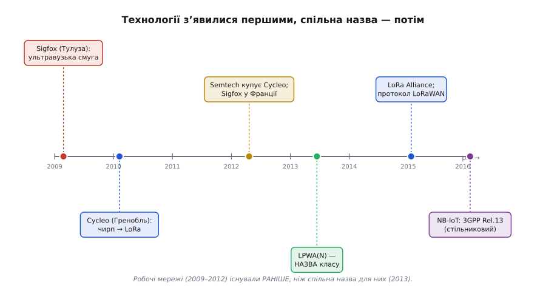

# 📜 Як народилася сама ідея «окремого класу»

Дивна річ із LPWAN: технології, які ми звемо цим словом, спершу з'явилися — і працювали, ловлячи лічильники в підвалах, — а вже потім хтось придумав, як їх **усі разом назвати**. Назва наздогнала техніку на кілька років. І це не випадковий збіг, а ключ до всієї історії: народження LPWAN — це не винахід чергової радіотехнології (їх було багато), а момент, коли інженерний світ **усвідомив**, що десятки розрізнених рішень — насправді один клас, з однією логікою й одними правилами. Розберімо, як це усвідомлення дозріло.

Почати варто з простого питання, бо без нього історія не складеться. Якщо телеметрію — дистанційний збір показів — робили **десятиліттями**, то що ж нового сталося близько 2010 року? Чому раптом знадобилося нове слово? Відповідь не в тому, що з'явилася якась небачена фізика. Відповідь у тому, що до певного моменту цього **не бачили як окрему задачу зі спільним розв'язком** — а потім побачили. І це той рідкісний випадок в інженерії, коли головним винаходом стала не схема, а **погляд**.

> 🔧 **Навіщо це.** Розуміти, що LPWAN — це передусім *спосіб класифікувати задачу*, а не марка чипа, практично корисно щодня. Коли тобі трапляється нова абревіатура — Wize, mioty, чергова «революційна» мережа для IoT — ти не губишся, а одразу питаєш: вона грає в той самий клас (мало даних, далеко, роки від батареї)? Якщо так — на неї діють ті самі закони, що ми вивчили в [темі про LPWAN](root:embedded/lpwan): вузька смуга чи розширення спектра, суб-гігагерц, зіркова топологія, обмеження ефіру. Клас — це лінза, крізь яку нове стає зрозумілим без переучування.

## Те, що робили вроздріб задовго до назви

Щоб відчути новизну, треба спершу побачити, **наскільки не нове** було саме *завдання*. Знімати покази на відстані люди навчилися давно. Уже в 1970–80-ті телефонні компанії й комунальники експериментували з автоматичним зчитуванням лічильників — англійською це звалося AMR (*automatic meter reading*, автоматичне зчитування лічильників): фургон із приймачем повільно проїжджав вулицею й «здував» покази з радіомодулів на лічильниках, щоб контролер не ходив до кожного будинку пішки. Пізніше, у 1990–2000-х, виросло складніше — AMI (*advanced metering infrastructure*, передова інфраструктура обліку): лічильники вже самі доповідали в мережу, часто комірчасто, передаючи покази сусіда сусідові, доки ті дострибнуть до концентратора.

Паралельно жив цілий світ із власною назвою — **M2M** (*machine-to-machine*, «машина до машини»): торгові автомати, що дзвонять, коли скінчилася кава; банкомати; давачі на трубопроводах; GPS-трекери на вантажівках. Усе це працювало роками й приносило гроші. Технічно більшість M2M-рішень спиралися на звичайний стільниковий зв'язок — GSM/GPRS-модем у коробці, SIM-картка, абонплата. Воно функціонувало, але мало дві хронічні болячки, які ми вже добре знаємо з [нашого трикутника компромісів](root:embedded/lpwan): такий модем **їв батарею** (стільниковий передавач — це вати) і **коштував дорого** — і саме залізо, і трафік. Для трекера на вантажівці з бортовою мережею це дрібниця. Для лічильника води в підвалі на одній батарейці — вирок.

Ось тут і ховається корінь майбутнього прозріння. Десятки компаній билися над **тією самою** діркою — «як дешево й надовго під'єднати дешевий давач здалеку» — але кожна вважала, що розв'язує **свою окрему** проблему: «дистанційний лічильник газу», «промисловий моніторинг насосів», «сигналізація на віддаленому об'єкті». Спільного знаменника ніхто не виносив за дужки. Рішення множилися вроздріб, як винаходи велосипеда в сусідніх селах, що не знають одне про одного. Бракувало одного — слова, яке сказало б: «панове, та це ж усе **одна** задача».

> 🔧 **Навіщо це.** Урок ширший за радіо. Часто найбільший поступ — не нова деталь, а **узагальнення**: коли хтось помічає, що сто окремих задач — це одна задача в ста костюмах, і дає їй ім'я. З іменем приходять спільні інструменти, спільні стандарти, спільний ринок. Коли наступного разу ловитимеш себе на думці «я розв'язую унікальну проблему» — варто спитати, чи не розв'язують поряд десятеро ту саму, просто не змовившись її так назвати.

## Тулуза, 2009: аскет, що повірив у крихти

Перший по-справжньому **новий** крок зробили не гранди телекому, а маленька компанія з півдня Франції. У 2009–2010 роках у містечку Лабеж під Тулузою двоє — підприємець-серієць Людовік Ле Моан (*Ludovic Le Moan*) та інженер-радист Крістоф Фурте (*Christophe Fourtet*) — заснували **Sigfox**. Фурте до того довго робив стільникове радіо у Freescale й Motorola, тож чудово знав, скільки коштує «нормальний» зв'язок — і саме тому захотів зробити **ненормальний**: гранично дешевий і гранично малопотужний.

> Статус доказовості: усталено. Заснування Sigfox у районі Тулузи Ле Моаном і Фурте підтверджують і життєпис Ле Моана, і профілі компанії; рік подають то 2009, то 2010 — розбіжність через дату ідеї проти дати реєстрації, що для нашої історії неістотно.

Ідея Sigfox була зухвалою до зухвалості. Замість того щоб гнатися за швидкістю, як усі, вони пішли в **протилежний** бік до краю: тиснути дані до кількох байтів і слухати ефір у неймовірно **тонку** смужку. Згадаймо прийом, який ми розбирали, — [ультравузька смуга](book:communications/fsk-psk): Sigfox тулиться у **100 Гц**, і саме ця тиша дозволяє почути кволий сигнал здалеку. У переказі це звучить майже як відмова від інженерної гордості: «не будемо передавати швидко, не будемо передавати багато — будемо передавати **майже нічого**, зате далеко й майже задарма по енергії».

Що тут було по-справжньому нове — не сама вузька смуга (її знали давно), а **бізнес-погляд**: Ле Моан мріяв не про чип, а про **єдиного глобального оператора** для дрібних речей. Один провайдер, одне покриття на цілу країну, проста підписка на пристрій — як стільниковий, але для крихт даних і за копійки. Це був перший випадок, коли хтось сказав уголос: під дрібну телеметрію потрібна **окрема мережа з власною економікою**, а не приладнаний збоку шматок стільникового. Уже у 2012-му Sigfox почав розгортати покриття у Франції, а в 2013-му разом із інфраструктурним оператором TDF поставив близько тисячі базових станцій — мережа з небуття стала фізичною.

> Статус доказовості: усталено/документовано. Перше розгортання у Франції (2012) і партнерство з TDF на ~1000 станцій (2013) фігурують у профілях Sigfox і галузевих оглядах.

## Гренобль, 2010: чирп, що народився для лічильників

Майже водночас, за кількасот кілометрів на схід, у Греноблі дозрівав **другий** підхід до тієї самої дірки — і прийшов він із зовсім іншого боку фізики. Двоє друзів, Ніколя Сорнен (*Nicolas Sornin*) та Олів'є Селлер (*Olivier Seller*), ще з 2009-го гралися з ідеєю далекобійної малопотужної модуляції; у 2010-му до них долучився третій, Франсуа Сфорца (*François Sforza*), і вони заснували компанію **Cycleo**. Прицілювалися вони, що характерно, **рівно в ту саму мішень**, що й усі попередники, — у лічильники газу, води й електрики.

Але інструмент обрали інший. Замість того щоб звужувати смугу, як Sigfox, вони пішли шляхом [розширення спектра](book:communications/spread-spectrum) — узяли **чирп** (*chirp spread spectrum*, розширення спектра щебетом): сигнал «з'їжджає» частотою, як свист, і його можна зібрати на прийомі в пік над шумом. Саме цей прийом ми вже зустрічали як [серце LoRa](book:communications/lora) — і ось ми бачимо момент його **народження**. Назва LoRa — від *Long Range*, «велика дальність».

Що показове в історії Cycleo: компанійка була крихітна й самотужки далеко б не зайшла. Переломним став 2012 рік, коли каліфорнійська **Semtech** — виробник радіочипів — побачила потенціал і **купила Cycleo** приблизно за 5 мільйонів доларів, забравши всі права на LoRa. Власне промислове життя технології почалося саме тоді: разом із засновниками Semtech довела чипи до серії (передавачі SX127x для вузлів, SX1301 для шлюзів). А мережевий протокол поверх цієї фізики — те, що задає формати пакетів і шифрування, — спершу звався LoRaMAC; у лютому **2015** заснували галузевий консорціум **LoRa Alliance**, і протокол перейменували на знайоме нам **LoRaWAN**.

> Статус доказовості: усталено/документовано. Заснування Cycleo (2010, Сорнен·Селлер·Сфорца), купівля Semtech (травень 2012, ~5 млн дол.) і поява LoRa Alliance із перейменуванням протоколу на LoRaWAN (лютий 2015) збігаються в офіційному викладі Semtech та незалежних оглядах.

Зверни увагу на симетрію двох історій. І Sigfox, і Cycleo цілилися в **ту саму** задачу — дешевий далекий лічильник, — але розв'язали її **протилежними** прийомами: один звузив ефір до 100 Гц, другий розмазав сигнал чирпом по широкій смузі. Те, що **обидва** влучили, і стало першим натяком, що тут не дві окремі вигадки, а **одна ніша**, до якої ведуть різні стежки. Двоє незалежних команд, не змовляючись, окреслили контури майбутнього класу — кожна зі свого боку.

## 2013: коли в класу нарешті з'явилося ім'я

І ось ми дійшли до серця нашої історії — до моменту, коли розрізнене стало **класом**. Сталося це не в лабораторії й не в стартапі, а в голові **аналітика**. Британська дослідницька фірма Machina Research, що вивчала ринок M2M та інтернету речей, мала співзасновника й головного аналітика на ім'я **Джим Морріш** (*Jim Morrish*). Саме йому приписують **введення терміна** Low Power Wide Area — «мала потужність, широке охоплення» — у лексикон IoT.

Ключову точку можна назвати майже з календарною точністю: **акронім LPWAN** (із N — *network*, мережа) Machina Research **викарбувала в червні 2013-го** — у звіті, що вперше зводив усі ці розрізнені технології в одну ринкову категорію й рахував її майбутнє. Прогноз був сміливий до зухвалості: до 2022 року — близько 15 мільярдів LPWA-під'єднань, тобто майже стільки ж, скільки давав увесь «класичний» M2M. Уперше хтось не просто описав окрему мережу, а сказав: **ось цілий ринок, ось його межі, ось його розмір** — і дав йому ім'я.

*Хронологія народження класу. Червоне й синє — дві піонерські технології (Sigfox, 2009, Тулуза; чирп/LoRa з Cycleo, 2010, Гренобль), що з'явилися й запрацювали ще до спільної назви. Зелена позначка 2013 — момент, коли Machina Research дала класу ім'я LPWA(N). Фіолетове 2016 — прихід у вже названу нішу стільникового світу з NB-IoT. Видно головне: техніка випередила слово на роки.*

Чому таке, на перший погляд, кабінетне діло — придумати абревіатуру — заслуговує бути **серцем** історії? Бо саме назва зробила нішу **видимою**. Доки кожен бачив лише «свою» технологію, ринок був туманом окремих рішень, у якому інвестор, регулятор і виробник чипів не могли орієнтуватися. Назва — це система координат. Щойно з'явилося слово «LPWAN», усі гравці раптом побачили, що грають **на одному полі**: можна порівнювати Sigfox із LoRaWAN за тими самими осями, можна писати спільні огляди, можна планувати спільні стандарти, можна вкладати гроші в **категорію**, а не в одну ставку. Сам Морріш влучно зауважував, що новизна тут — у поєднанні двох **взаємно суперечливих** понять: «мала потужність» і «широке охоплення» зазвичай тягнуть у різні боки, а LPWAN зухвало склеює їх в одне.

> 🔧 **Навіщо це.** Тут видно, як працює сила доброго **означення** в інженерії. Поки в явища нема назви, його важко обговорювати, важко продавати, важко стандартизувати — воно ніби не існує як ціле. Назва збирає розпорошене у фокус. Для тебе як інженера це натяк: коли в проєкті чи в команді крутиться безіменне «ну, оце от, що ми весь час робимо», — дай йому точне ім'я. Часто саме з імені починається порядок.

Варто чесно додати застереження про доказовість, щоб не творити героїчного міфу. «Викарбувано в червні 2013» — це усталена в галузевих джерелах дата появи саме **акроніма** LPWAN; ширше формулювання Low Power Wide Area Морріш просувáв раніше, від початку 2010-х. Як і майже завжди з термінами, тут не один автор у вакуумі, а аналітик, що **вдало назвав** те, що вже носилося в повітрі завдяки Sigfox, Cycleo та іншим. Заслуга Морріша — не вигадати фізику (її зробили інші), а **побачити клас і дати йому слово**. Це теж винахід — тільки понятійний, а не схемний.

> Статус доказовості: усталено в галузевих джерелах. Авторство терміна LPWA за Джимом Моррішем (Machina Research) і «карбування» акроніма LPWAN у червні 2013 фігурують у його офіційному життєписі та незалежних оглядах ринку; точну добу появи самого словосполучення Low Power Wide Area документувати важче — це нормально для термінів, що визрівають поступово.

## Коли в названу нішу прийшли гранди: NB-IoT, 2016

Історія мала б бути неповною без останнього повороту, бо він добре показує, **наскільки** усталилася категорія. Коли маленькі піонери довели, що ніша реальна й велика, у неї **зайшов великий стільниковий світ** — той самий, чию дорожнечу й ненажерливість обходили Sigfox і LoRa. Консорціум **3GPP**, що пише стандарти мобільного зв'язку, у **червні 2016-го** заморозив (тобто завершив і зафіксував) специфікацію **NB-IoT** (*narrowband IoT*, вузькосмуговий інтернет речей) у складі свого **Release 13**.

> Статус доказовості: документовано. Завершення стандартизації NB-IoT у 3GPP Release 13 у червні 2016 підтверджує сам 3GPP та галузеві джерела.

Сенс цього кроку — не технічний, а **символічний**, і саме тому він тут. Доти LPWAN був світом стартапів і вільного ISM-ефіру; прихід 3GPP означав, що **офіційний** телеком визнав: так, це окремий клас, і ми будуємо під нього **свій** варіант — у [ліцензованому спектрі](book:communications/frequency-bands), поверх мереж операторів. NB-IoT грає за тими самими правилами ніші (мало даних, далеко, роки від батареї), просто іншим коштом: не своїм залізом у вільному ефірі, а орендованим стільниковим каналом. Коли в категорію, яку три роки тому хтось лише назвав, входить найважчий гравець галузі й будує під неї стандарт — це остаточна печатка: **клас відбувся**.

## Що насправді тут народилося

Зведімо нитку, бо вона веде до висновку, ширшого за самі мережі. Якщо вишикувати дати в ряд, видно дивну, але показову послідовність. Спершу — **техніка без назви**: Sigfox (2009) і LoRa з Cycleo (2010) запрацювали, ловлячи лічильники, ще не знаючи, що вони — «LPWAN». Потім — **назва, що наздогнала техніку**: Machina Research та Джим Морріш у 2013-му дали класу ім'я й межі. І нарешті — **визнання гранда**: 3GPP у 2016-му завів у вже названу нішу стільниковий NB-IoT. Слово народилося **посередині** — пізніше за першу залізну реалізацію, але раніше за повне визнання.

І ось головна думка, заради якої варто було розкладати цю історію. Народження LPWAN — рідкісний приклад того, що **усвідомлення категорії саме по собі є винаходом**. Жоден гравець не вигадав нічого фізично нечуваного: вузьку смугу, чирп, суб-гігагерц, зіркову топологію — усе це знали й до них. Новим було **побачити**, що десятки розрізнених рішень для дешевого далекого давача — це один клас із власною логікою компромісу, власною економікою і власними правилами. З цього погляду й виросло все, що ми вивчали в [основній темі](root:embedded/lpwan): і трикутник «віддай швидкість — забери дальність і живучість», і закон робочого циклу, і вибір між LoRaWAN, Sigfox та NB-IoT. Спершу хтось окреслив **клас** — а вже всередині класу інженери почали наввипередки шукати найкращі способи укласти ту саму вигідну оборудку. Інколи найбільший винахід — це правильно проведена межа.
