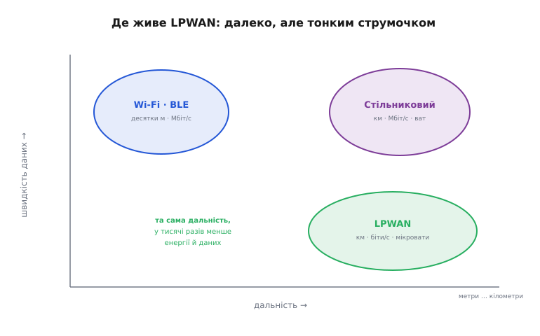
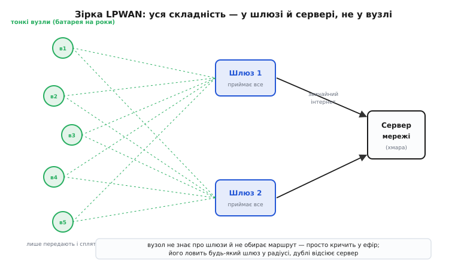
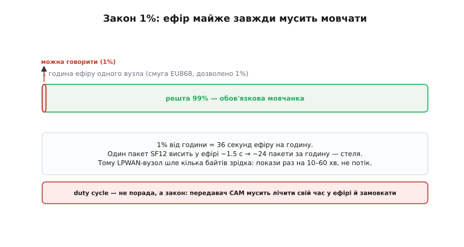
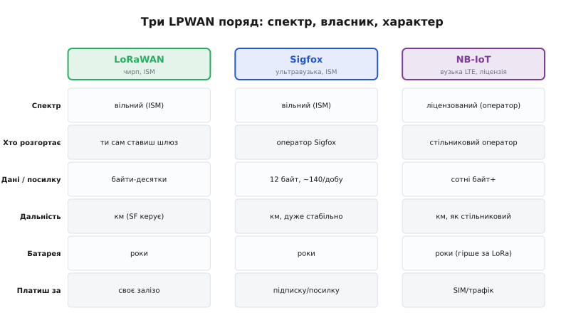

# LPWAN: далекий зв'язок на крихтах енергії

Дотепер ми будували радіолінк як міцну трубу: рахували [бюджет лінії](root:embedded/link-budget), щоб сигнал добив, училися ділити ефір [методами множинного доступу](root:embedded/multiple-access-methods), бачили хитрий [чирп LoRa](root:com-modulation/lora), що витягує сигнал з-під шуму. Кожна з тих тем дивилася на **один прийом**. Тепер відступімо на крок і поглянемо на **цілий клас мереж**, який з цих прийомів складається й б'є рекорд, що довго здавався неможливим: зв'язок на **кілометри**, від **батарейки на роки**, з вузла, що коштує копійки. Це **LPWAN** (англ. *low-power wide-area network* — малопотужна мережа широкого охоплення), і це не одна технологія, а **спосіб мислити про радіо**, коли даних мало, а відстань і живучість — усе.

Питання, з якого все починається, звучить так. Уяви тисячу давачів, розкиданих по місту й полях: лічильники води в підвалах, датчики вологості ґрунту, паркомати, сміттєві баки. Кожен має доповідати кілька байтів раз на годину — і прожити на одній батарейці **п'ять-десять років**. Тягнути до кожного дріт чи Wi-Fi — божевілля; ставити в кожен стільниковий модем — з'їсть і гроші, і батарею за тиждень. Потрібен **зовсім інший** зв'язок. Саме під цю діру й виріс цілий клас мереж — і щоб зрозуміти його, треба спершу побачити, **чого** він прагне і **чим** за це платить.

### Трикутник, який усі вважали неможливим

Будь-який радіозв'язок тягне за три кути одразу: **дальність**, **швидкість даних** і **витрати енергії**. Усе минуле радіо вчило нас, що ці три пов'язані жорстко: хочеш далі — кричи гучніше (більше енергії) або говори повільніше; хочеш швидше — підходь ближче. Звичайні мережі обрали свої кути. Wi-Fi і [BLE](root:com-protocol/ble-gatt) беруть **швидкість** ціною дальності — мегабіти, але на десятки метрів. Стільниковий зв'язок бере **швидкість і дальність** разом — але платить **ватами** потужності й дорогим залізом; телефон тому й заряджають щодня.


*Карта «дальність × швидкість». Ближнє радіо (Wi-Fi, BLE) сидить угорі ліворуч: мегабіти, але метри. Стільниковий — угорі праворуч: швидко й далеко, зате споживає вати. LPWAN займає кут, на який ніхто не претендував, — праворуч унизу: та сама кілометрова дальність, але швидкість і енергія в тисячі разів менші.*

LPWAN зробив несподіване: він **погодився віддати** той кут, за який усі чіплялися, — **швидкість**. Якщо тобі не потрібен потік, а лише кілька байтів зрідка, то швидкість — зайвий розкіш, який можна продати. І виявилося, що в обмін на відмову від швидкості купуєш **обидва** інші кути одразу: і дальність, і мізерну енергію. Ось ця угода — «віддай швидкість, забери дальність і живучість» — і є вся суть LPWAN одним реченням. Решта статті лише розкриває, **чому** угода працює і **як** її втілюють.

> 🔧 **Навіщо це.** Перш ніж обирати радіо для пристрою, спитай себе чесно: скільки даних і як часто? Якщо відповідь — «кілька байтів раз на хвилини-години», то ставити Wi-Fi чи стільниковий модуль означає платити батареєю й грошима за швидкість, якою ти не скористаєшся. LPWAN — це інструмент рівно під цей профіль: телеметрія, покази, рідкі команди. Розпізнати «це задача для LPWAN» ще до вибору модуля — половина успіху проєкту.

### Чим платять за дальність: вузька смуга й повільна мова

Звідки ж береться дальність, якщо потужність — мікроскопічна? Відповідь ми вже наполовину знаємо з [бюджету лінії](root:embedded/link-budget): дальність визначає не стільки потужність передавача, скільки **чутливість приймача** — найслабший сигнал, який він іще розчує. А чутливість, своєю чергою, тим **глибша**, чим **простіша й повільніша** модуляція. LPWAN вичавлює цей важіль до краю.

Перший прийом — **вузька смуга**. Згадаймо тепловий шум: його потужність прямо пропорційна ширині смуги, яку слухає приймач. Звузив смугу вдесятеро — впустив усередину вдесятеро менше шуму, тобто опустив шумову підлогу й почув на стільки ж слабший сигнал. LPWAN-радіо слухає не мегагерци, як Wi-Fi, а кілогерци, а то й **сотні герц**. Sigfox, наприклад, тулиться у смугу всього **100 Гц** — звідси й назва прийому, [ультравузька смуга](root:com-modulation/fsk-psk) (*ultra-narrowband*): неймовірно тихий куток ефіру, де навіть кволий сигнал стирчить над шумом.

Другий прийом — **повільна, завадостійка модуляція**, аж до [розширення спектра](root:com-modulation/spread-spectrum). Тут шлях протилежний — не звузити, а **розмазати** сигнал по широкій смузі й зібрати його на прийомі назад у пік над шумом, отримавши виграш обробки. Саме так працює [чирп LoRa](root:com-modulation/lora): жертвуючи швидкістю заради дуже повільного щебету, він опускає поріг чутливості аж до −137 дБм — нижче рівня теплового шуму. Два прийоми, протилежні на вигляд (звузити проти розширити), ведуть до **однієї** мети: зробити приймач настільки чутливим, щоб кілометри добивалися мікроватами.

> 🔧 **Навіщо це.** Коли вибираєш LPWAN-модуль і бачиш у даташиті чутливість на кшталт −137 дБм проти −95 дБм у звичайного радіо — це не маркетинг, а прямі **зайві 42 децибели** у [бюджеті лінії](root:embedded/link-budget). Кожні 6 дБ чутливості — це приблизно вдвічі більша дальність. Ось чому LPWAN дістає туди, куди Wi-Fi не добиває й близько: не потужнішим криком, а глибшим слухом.

Ціна обох прийомів та сама — **швидкість**. Вузька смуга фізично не вмістить багато бітів за секунду; повільний чирп несе ті самі біти довше. Тому LPWAN — це принципово **тонкий струмочок** даних: одиниці-сотні біт за секунду, кілька байтів на посилку. Не потік, а крапельниця. І це не вада, а свідома плата за головне: дальність і живучість.

### Чому майже завжди — нижче гігагерца

Є ще одна, майже невидима причина далекобійності LPWAN — **частота**, на якій він працює. Майже всі такі мережі сидять у [суб-гігагерцевих смугах](root:com-medium/frequency-bands): 868 МГц у Європі, 915 МГц в Америці, 433 МГц подекуди. Це не випадковість і не данина традиції.

Річ у двох речах. По-перше, втрати у вільному просторі **ростуть із частотою**: на 868 МГц той самий шлях з'їдає на кілька децибел менше, ніж на 2.4 ГГц, — дарма, але приємно. По-друге, і важливіше: нижча частота — **довша хвиля**, а довша хвиля краще **огинає** перешкоди й глибше **проникає** крізь стіни, ґрунт, листя. Сигнал 868 МГц вилазить із підвалу з лічильником води туди, куди 2.4-гігагерцевий Wi-Fi не пробивається й на метр. Для мережі, чиї вузли живуть у колодязях, підвалах і землі, ця проникність — питання життя.

Майже всі ці суб-гігагерцеві смуги — **вільні** (*ISM*, англ. *industrial, scientific, medical*): передавати в них можна без ліцензії й абонплати, як у Wi-Fi. Це і благословення, і прокляття. Благословення — ставиш своє радіо й нікому не платиш. Прокляття — смуга **спільна**, і регулятор боїться, що всі забалакають одночасно й заб'ють ефір. Тому за вільність доводиться платити суворим обмеженням, до якого ми зараз дійдемо, — але спершу подивімося, як LPWAN взагалі побудований.

### Архітектура: зірка, а не павутина

Розібравшись із фізикою, перейдімо до устрою мережі — і тут LPWAN знову робить вибір, протилежний до модного. Багато бездротових мереж люблять **комірчасту** (*mesh*) топологію: вузли передають пакети один одному, як естафету, доти, доки дані дострибають до краю. Це гнучко, але дорого: кожен вузол мусить **слухати ефір**, тримати таблицю сусідів, ретранслювати чужі пакети — а слухати ефір означає **не спати**, тобто з'їдати батарею. Для пристрою, що має прожити роки, постійне слухання — смерть.

Тому LPWAN іде **зіркою** (*star*): кожен вузол говорить **прямо** до базової станції-шлюзу, без жодних посередників.


*Зірка LPWAN. Ліворуч — тонкі вузли: вони лише прокидаються, передають кілька байтів і знову сплять; маршрутів не знають. Посередині — шлюзи, що ловлять усе, до чого дотягуються. Праворуч — сервер мережі у хмарі, з'єднаний зі шлюзами звичайним інтернетом. Уся складність зсунута зі сторони вузла на сторону інфраструктури.*

Глянь, наскільки це **асиметрично**. Вузол — навмисне тупий: він не знає, скільки навколо шлюзів, не обирає, кому слати, не чекає на маршрут. Він просто **кричить кілька байтів у ефір і засинає**. Уся розумна робота — спіймати крик, відсіяти дублі (той самий пакет почули кілька шлюзів), розшифрувати, передати застосунку — лежить на **шлюзах і сервері**, які живляться від розетки й мають скільки завгодно обчислень. Це і є серце енергоощадності: складність коштує енергії, тож її прибрали звідти, де енергії немає, — з вузла — і зсунули туди, де її вдосталь.

Звідси й друга важлива риса — **асиметрія напрямків**. Головний потік даних іде **вгору**, від вузла до сервера (давач доповідає). Униз, від сервера до вузла, потік куди скромніший, а часто й зовсім кволий: щоб почути команду, вузол мусив би **слухати ефір**, а він майже завжди спить. Тому в багатьох LPWAN вузол відкриває коротке «вікно прийому» лише на мить **після** власної передачі, а решту часу глухий. Це означає просту, але важливу річ для проєктування: LPWAN чудовий, щоб **збирати** дані з пристроїв, і кепський, щоб ними **керувати** в реальному часі. Якщо твоєму вузлу треба миттєво реагувати на команду згори — LPWAN тобі не підходить, і це треба знати наперед.

### Закон одного відсотка: ефір, що мусить мовчати

А тепер — найважливіша інженерна реальність LPWAN, та, об яку розбивається найбільше наївних проєктів. Пам'ятаєш, вільна ISM-смуга спільна, і регулятор боїться, що всі заб'ють ефір? Його зброя проти цього зветься **обмеження робочого циклу** (*duty cycle* — частка часу, коли пристрою дозволено передавати). У європейській смузі 868 МГц воно безжальне: вузол має право тримати ефір зайнятим не більше ніж **1% часу**.


*Закон 1% наочно. З цілої години ефіру одному вузлу дозволено говорити лише крихітний червоний шматочок — 1%, тобто 36 секунд. Решту 99% часу передавач **зобов'язаний** мовчати. Це не порада для ввічливості, а вимога стандарту, яку радіомодуль мусить дотримувати сам.*

Порахуймо, що це означає на практиці, бо число вражає. **1% від години — це 36 секунд** ефіру на годину. Один пакет LoRa на коефіцієнті розширення SF12 висить у ефірі (*time on air* — час у ефірі) близько **1.5 секунди**. Поділивши, дістаємо стелю: **щонайбільше 24 такі пакети за годину** — і це якщо вузол більше нічого не робить. На повільних режимах далекого зв'язку реальний бюджет ще скромніший: кілька повідомлень на годину, десятки на добу. Ось чому LPWAN-вузол шле покази **раз на 10–60 хвилин**, а не щосекунди: його обмежує не батарея і не канал, а **закон**.

> 🔧 **Навіщо це.** Duty cycle — головна пастка новачка в LPWAN. Людина пише прошивку, що шле телеметрію раз на 10 секунд, ставить SF12 «щоб добивало», і дивується, чому мережа його банить або чому модуль мовчазно «з'їдає» пакети. А це спрацював лічильник часу в ефірі: на SF12 десяток секунд між посилками порушує 1%. Грамотний інженер закладає duty cycle **у саму архітектуру прошивки** з першого дня: рахує час у ефірі кожного пакета й сам тримає вузол у межах. Як це втілити в коді — нижче.

Найнадійніше — **не сподіватися**, що про обмеження подбає чийсь чужий код, а вести облік **самому**: перед кожною передачею перевіряти, чи не з'їв вузол свій бюджет, і відкладати посилку, якщо з'їв. Ось кістяк такого «сторожа», який тримає вузол у межах 1%:

```c
#include <stdint.h>
#include <stdbool.h>

#define DUTY_PERMILLE   10        // дозволено 1% = 10 проміле
#define WINDOW_MS       3600000UL // вікно усереднення: 1 година

static uint32_t air_used_ms = 0;  // скільки мс ефіру вже витрачено у вікні
static uint32_t window_start_ms;

// Чи можна зараз зайняти ефір на air_ms мілісекунд?
bool duty_can_transmit(uint32_t now_ms, uint32_t air_ms) {
    // нове вікно — обнуляємо лічильник
    if (now_ms - window_start_ms >= WINDOW_MS) {
        window_start_ms = now_ms;
        air_used_ms = 0;
    }
    uint32_t budget_ms = (uint32_t)((uint64_t)WINDOW_MS * DUTY_PERMILLE / 1000);
    return (air_used_ms + air_ms) <= budget_ms;   // влізе в 1%?
}

// Викликати ОДРАЗУ після успішної передачі, передавши її time-on-air.
void duty_account(uint32_t air_ms) {
    air_used_ms += air_ms;
}
```

Уся хитрість не в цьому коді, а в одному числі, яке він приймає, — `air_ms`, **час пакета в ефірі**. Воно залежить від коефіцієнта розширення, ширини смуги, довжини пакета й преамбули, і саме від нього напряму залежить, скільки повідомлень на добу дозволено вузлу. Як точно порахувати цей час і збудувати з нього реальний добовий бюджет посилок — ми розбираємо в окремому [проєкті бюджету часу в ефірі](root:embedded/lpwan/proj-airtime-budget.md).

### Три обличчя LPWAN: LoRaWAN, Sigfox, NB-IoT

Слово «LPWAN» описує **клас**, а не один продукт. Сьогодні цей клас тримають три головні технології, і вони втілюють ту саму ідею **по-різному** — настільки, що вибір між ними часто визначає весь проєкт. Розгляньмо їх поряд, бо їхня відмінність — не в дрібних цифрах, а в **самій моделі**, хто володіє мережею.


*Три головні LPWAN у порівнянні. LoRaWAN і Sigfox живуть у вільному ISM-спектрі; NB-IoT — у ліцензованому, оператора. Ключова різниця не в дальності (вона в усіх кілометрова), а в тому, **хто володіє мережею** і **за що ти платиш**: за власне залізо, за чужу підписку чи за стільникову SIM.*

**LoRaWAN** будують поверх [чирпової фізики LoRa](root:com-modulation/lora). Працює у вільній ISM-смузі, а головна його принада — ти можеш **поставити власний шлюз** і мати свою приватну мережу, нікому не платячи за зв'язок. Топологія — зірка-із-зірок: багато вузлів на шлюз, багато шлюзів на сервер. За це платиш сам — своїм залізом і його обслуговуванням. Це вибір тих, хто хоче **контролю**: ферма, завод, місто, що ставлять інфраструктуру під себе.

**Sigfox** — найрадикальніший аскет. Він тисне дані до краю: [ультравузька смуга](root:com-modulation/fsk-psk) у 100 Гц, BPSK, і **крихітні** повідомлення — лічені байти, з жорстким лімітом близько **140 посилок на добу**. Натомість мережу розгортає й тримає **сам оператор Sigfox** (історично — як єдиний глобальний провайдер): ти не ставиш шлюзів, а купуєш **підписку** на пристрій і просто користуєшся покриттям. Це зручно там, де покриття вже є, і незручно там, де його нема, — бо своє ти не доставиш.

**NB-IoT** (англ. *narrowband IoT* — вузькосмуговий інтернет речей) стоїть осібно: це **стільникова** технологія, втиснута у вузьку смугу 200 кГц поверх LTE, і живе вона в **ліцензованому** спектрі оператора. Тому в ній **немає** обмеження робочого циклу — спектр оплачено, говори скільки треба, — зате й мережу ти не поставиш сам: потрібен стільниковий оператор і його SIM, а отже трафік і абонплата. NB-IoT бере **надійністю й покриттям** оператора там, де ISM-мережі ненадійні, але платить за це гіршою (хоч усе одно багаторічною) живучістю й залежністю від оператора.

Зведімо суть. Усі три дають кілометри й роки на батареї — це спільне ядро LPWAN. Різниця в **моделі володіння**: LoRaWAN — «постав і володій сам» у вільному спектрі; Sigfox — «купи підписку на чужу глобальну мережу»; NB-IoT — «орендуй стільниковий канал в оператора». Вибираєш не за дальністю, а за тим, **хто має тримати мережу** і **скільки ти готовий платити** — залізом, підпискою чи трафіком.

### Коли LPWAN — а коли ні

Звівши все докупи, отримуємо чіткий орієнтир, який вартий більше за будь-яку таблицю цифр. LPWAN — **не** універсальний зв'язок; він геніальний у своїй ніші й безпорадний поза нею. Тож перше інженерне рішення — чесно спитати, **чи ти взагалі в цій ніші**.

LPWAN — **твій вибір**, коли збігаються три ознаки: даних **мало** (байти, не кілобайти), вони йдуть **рідко** (хвилини-години між посилками), а пристрій має жити **довго від батареї** й/або стояти **далеко**, де нема Wi-Fi і дроту. Лічильники, давачі довкілля, стеження за активами, паркомати, сільське господарство — класика жанру. Тут LPWAN робить можливим те, що інакше нездійсненне: тисячі автономних точок, кожна на роки.

LPWAN — **погана ідея**, щойно з'являється хоч одна з протилежних потреб. Треба **багато даних** (звук, відео, фото, прошивки) — струмочок LPWAN захлинеться, бери [Wi-Fi](root:com-transport/wifi) чи стільниковий. Треба **низька затримка й керування** в реальному часі (керувати рухом, миттєво реагувати на команду) — асиметрична, рідко-слухаюча зірка LPWAN тут безсила. Треба **частий** обмін — закон 1% (у ISM-варіантах) просто не дасть. У цих випадках спроба «натягнути» LPWAN коштує безсонних ночей; чесніше одразу взяти інструмент під задачу.

> 🔧 **Навіщо це.** Найдорожча помилка в радіопроєкті — обрати клас зв'язку **не під профіль трафіку**. Поставив LPWAN на пристрій, що хоче слати фото, — і він не злетить ніколи, хоч що крути. Поставив Wi-Fi на польовий давач — і батарея сяде за дні замість років. Тому рішення «LPWAN чи ні» приймають **найперше**, ще до вибору конкретного модуля: спершу профіль (скільки даних, як часто, як довго жити, як далеко), і вже він диктує клас. Усе інше — деталі всередині правильно обраного класу.

Сам термін «LPWAN» молодший за технології під ним: ідею «малопотужної мережі широкого охоплення» як окрему категорію [назвали й окреслили на початку 2010-х](root:embedded/lpwan/hist-lpwan-birth.md), коли Sigfox і LoRa показали, що така ніша взагалі існує, а потім у неї прийшов і стільниковий світ із NB-IoT. До того десятиліттями робили схожі речі вроздріб — телеметрію лічильників, промисловий моніторинг, — але саме усвідомлення «це окремий клас зі своїми правилами» перетворило розрізнені рішення на справжній фундамент інтернету речей.

Підсумуймо однією думкою, заради якої й варто було це розкладати. LPWAN — це радіо, що **свідомо віддало швидкість**, аби купити те, чого ніхто не міг мати разом: кілометрову дальність і роки автономності за копійки. Усе інше — вузька смуга чи повільний чирп, суб-гігагерцева частота, зіркова асиметрична топологія, закон робочого циклу, вибір між LoRaWAN, Sigfox і NB-IoT — це лише різні грані **однієї** угоди. Зрозумівши угоду, ти дивишся на будь-яку нову LPWAN-технологію не як на загадку, а як на ще один спосіб укласти ту саму вигідну оборудку: трохи терпіння замість багато енергії.

---
