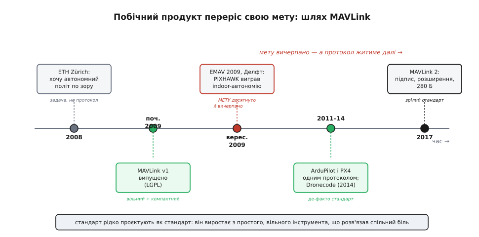

# 📜 Як народився MAVLink: із однієї змагальної задачі — у мову всіх дронів

Ми весь час дивилися на MAVLink як на щось дане: серцебиття раз на секунду, потокова телеметрія, команда з підтвердженням, місія через рукостискання. Наче хтось мудрий сів, продумав ненадійність радіониточки й видав готовий стандарт. Але жоден протокол не з'являється так. MAVLink народився не як «стандарт для дронів» — його не проєктували на індустрію. Його зліпив студент, якому просто треба було, щоб маленький вертоліт долетів через кімнату сам, не врізавшись у стіну, — і зробити це швидше за інші команди на змаганні. Те, що з цього наспіх зробленого протоколу виріс галузевий стандарт, яким сьогодні розмовляють мільйони апаратів, — окрема й повчальна історія. Вона пояснює, чому протокол саме такий: мінімалістичний, ощадливий до байтів, а місцями — з дивними компромісами, що видають своє походження «з поля бою одного семестру».

## Кімната, стіна й вертоліт, який має не врізатися

Повернімося у 2008 рік, у Швейцарську вищу технічну школу Цюриха (нім. *Eidgenössische Technische Hochschule Zürich*, ETH Zürich) — один із найсильніших технічних університетів світу. Магістрант на ім'я **Лоренц Маєр** (нім. *Lorenz Meier*) захопився ідеєю, яка тоді ще звучала зухвало: змусити **малий літальний апарат літати в приміщенні самостійно**, орієнтуючись **очима** — камерою й комп'ютерним зором, — а не GPS (якого в кімнаті й немає) і не пультом у руках пілота. Апарат мав сам бачити перешкоди й сам їх обминати.

> 🔧 **Навіщо це.** Зрозуміти, **звідки** взявся протокол, — це не музейна цікавість. MAVLink досі несе відбитки того першого завдання: він побудований для **вузького радіоканалу** й **слабкого бортового процесора**, бо саме такими були умови в 2009-му. Багато рішень, що спершу здаються дивними («чому телеметрію не перепитують?», «чому пакет такий скупий на байти?»), стають очевидними, щойно знаєш, для чого й на якому залізі його вперше писали.

Мотивація була конкретна, не абстрактна. У Європі проводили **змагання мікролітальних апаратів** — European Micro Air Vehicle Conference and Flight Competition, скорочено **EMAV**. Була там і найважча категорія — **автономний політ у приміщенні** (*indoor autonomy*): апарат мусить сам, без людини й без супутника, пройти трасу. Саме ця категорія й запалила Маєра. Не «зробити протокол» — а **виграти конкретну задачу**: щоб апарат бачив, думав і летів сам.

Тут криється перший урок про природу інженерії. Великі загальні інструменти майже ніколи не народжуються із заміру «зробити великий загальний інструмент». Вони виростають із **дуже конкретної, впертої, вимірюваної** задачі, яку хтось мусить розв'язати до дедлайну. MAVLink — рівно такий випадок.

## Чому одному студентові знадобилася ціла команда

У 2008 році не було чого взяти з полиці. Готових автопілотів для комп'ютерного зору на дроні не існувало; бортові комп'ютери, здатні жувати відео в реальному часі, ще тільки з'являлися. Тож усе доводилося робити **самотужки**: плату керування польотом, прошивку на ній, високорівневе програмне забезпечення для зору — і те, що нас цікавить, **спосіб, яким борт розмовлятиме із землею**.

Обсяг був завеликий для однієї людини. Маєр за підтримки професора **Марка Поллефейса** (нідерл. *Marc Pollefeys*) — відомого фахівця з комп'ютерного зору в ETH — зібрав **команду приблизно з 14 студентів**, і вони близько **дев'яти місяців** працювали над апаратом. Команда взяла собі назву — **PIXHAWK**. Ця назва згодом стане легендарною: так називатимуть цілу лінійку польотних контролерів, що й дотепер стоять у безлічі дронів по всьому світу.

Сам Маєр згодом описував свій підхід із рідкісною чесністю: «Я набрав людей, розумніших за себе, щоб вони казали мені, що робити» (*"I recruited smarter people than myself, so they could tell me what to do"*). За цим жартом — здоровий інженерний інстинкт: складну систему будує **команда з різними сильними сторонами**, а не одинак-геній.

> 📌 **Статус фактів.** Рік початку (2008), участь Маєра, роль Поллефейса, назва команди PIXHAWK і порядок «близько 14 студентів / близько дев'яти місяців» — **добре задокументовані**: збігаються в офіційній історії Pixhawk (компанія Auterion, яку заснував сам Маєр), у Вікіпедії й у наукових публікаціях самої команди. Точне число учасників у різних джерелах трохи різниться (8–14 на семестр), бо склад студентського проєкту змінювався від семестру до семестру, — тому кажемо «близько 14».

## Навіщо їм узагалі знадобився власний протокол

Ось тут MAVLink нарешті виходить на сцену — і виходить **як побічний продукт**, а не як мета. Уяви їхню задачу технічно. Апарат літає сам, ним керує бортовий комп'ютер із камерою. Але команді-розробникам треба **бачити, що всередині діється**: які кути нахилу, де апарат думає, що він є, чи не падає напруга, чи не збожеволів алгоритм. Треба **вивести стан борту на екран на землі** — і робити це **безперервно, в реальному часі, через слабенький радіоканал**.

Готового способу зробити це добре — не було. Можна було б слати стан текстом, як у консолі, але текст неощадливий: кожне число в текстовому вигляді — це десяток байтів там, де у двійковому стало б два-чотири, а канал вузький. Можна було б узяти якийсь важкий універсальний формат, але важкий формат не влізе у крихітний бортовий процесор і з'їсть увесь тонкий канал службовими обгортками.

Тому команда зробила **свій** — **компактний двійковий протокол для передачі телеметрії зі станції керування на борт і назад**. Головні вимоги диктувала сама задача, і вони видні в MAVLink донині:

```
вузький радіоканал   → пакет має бути МАКСИМАЛЬНО коротким (двійковий, не текст)
слабкий процесор     → розбір пакета має бути ДЕШЕВИМ (проста структура, без важкого парсингу)
шум і втрати пакетів → потрібна контрольна сума, щоб відкинути покалічений кадр
різні типи даних     → кожне повідомлення має свій числовий ID і фіксований набір полів
```

Технічно перша версія MAVLink була навіть не «програмою», а **бібліотекою впаковування повідомлень із самих лише заголовків** (*header-only message marshalling library*): опис усіх повідомлень генерував готовий код для впаковування й розпаковування, який просто вкомпільовували в прошивку. Дешево, компактно, без зовнішніх залежностей — рівно те, що треба крихітному борту.

> 🔗 **Чому телеметрію не перепитують.** Оте «вузький канал, шум, втрати» — не історична дрібниця, а джерело одного з наріжних рішень протоколу: безперервну телеметрію шлють **потоком без підтверджень** (*fire-and-forget*), бо для швидкозмінних вимірів свіжість важливіша за повноту. Це рішення MAVLink несе з першого дня — і ми вже бачили, як воно працює на землі.
> [Затримка й надійність лінка](topic:com-transport/latency-reliability)

## Перший випуск: початок 2009 року, ліцензія LGPL

**На початку 2009 року Лоренц Маєр уперше випустив MAVLink** — і випустив його **під ліцензією LGPL** (GNU Lesser General Public License). Ця обставина здається технічною дрібницею, але саме вона згодом вирішить долю протоколу, тож зупинимося на ній.

LGPL — це ліцензія вільного програмного забезпечення, і слово *Lesser* («менша», «полегшена») тут ключове. Звичайна GPL «заразна»: усе, що з нею з'єднали, теж мусить стати відкритим. LGPL — м'якша: її можна **під'єднувати як бібліотеку** до чужого коду, зокрема закритого й комерційного, не змушуючи весь той код розкриватися. Для протоколу це вирішальна властивість. Вона означає, що **будь-хто** — інший відкритий проєкт, компанія, дослідник — може взяти MAVLink і вбудувати його у свій апарат чи свою наземну станцію **без юридичних перепон**.

Тепер з'єднай два факти докупи. Перший: MAVLink зробили **компактним, простим і дешевим** для слабкого заліза — тобто його **технічно легко** вбудувати куди завгодно. Другий: його випустили під **дозвільною** ліцензією — тобто його **юридично вільно** брати всім. Ці дві властивості разом і є пороховим зарядом, який згодом рознесе MAVLink по всій індустрії. Але тоді, на початку 2009-го, ніхто цього не планував: був просто студентський протокол для однієї змагальної задачі, викладений у відкритий доступ, бо команда хотіла «робити автономію й зір для всіх».

> 📌 **Статус фактів.** «Уперше випущений на початку 2009 року під LGPL» — **добре задокументоване** формулювання, що дослівно повторюється у Вікіпедії й похідних довідниках. Обережність із **точним місяцем**: надійні джерела кажуть саме «early 2009» / «початок 2009», без конкретної дати, тож і ми не називаємо день — це був би вигаданий факт.

## EMAV 2009: задача, заради якої все й робилося

Восени задача, з якої все почалося, дістала свою розв'язку. **З 14 по 17 вересня 2009 року в Делфті** (нідерл. *Delft*, Нідерланди) відбулася конференція й змагання **EMAV 2009**. Команда PIXHAWK виступила в тій самій категорії **автономного польоту в приміщенні** — і **перемогла**.

Перемога була не «просто виграли кубок». За свідченнями, PIXHAWK стали **першими, хто успішно реалізував комп'ютерний зір для обминання перешкод** у цій категорії — тобто апарат справді **бачив** світ і сам ухилявся, а не йшов за наперед прошитою траєкторією. Це був якісний стрибок, а не косметичний. І весь час, поки апарат літав і думав сам, по тонкій радіониточці на землю ішов потік MAVLink — той самий скромний протокол, що ми розбирали очима оператора.

Тут варто зупинитись і відчути масштаб іронії. **Мета** дев'ятимісячної праці — виграти категорію на EMAV 2009 — була досягнута й **вичерпана** за ті вересневі дні в Делфті. Змагання скінчилося, кубок отримали. Якби історія була «нормальна», MAVLink на цьому б і закінчився: інструмент, що виконав свою разову функцію, ліг би в архів разом зі звітом про проєкт. **Побічний продукт пережив свою мету** — і саме він, а не перемога на змаганні, виявився головним, що народила ця команда.

> 📌 **Статус фактів.** Місце й дати EMAV 2009 (Делфт, 14–17 вересня) і перемога PIXHAWK в категорії indoor autonomy — **добре задокументовані**: підтверджені сайтом організаторів (IMAVS.org) і незалежними повідомленнями того часу. Формулювання «перші, хто реалізував комп'ютерний зір для обминання перешкод» походить із ретроспективних оглядів (зокрема офіційної історії Pixhawk) — це **сильне, але ретроспективне** твердження самих учасників; суть — «зробили це на реально працюючому комп'ютерному зорі» — узгоджена в джерелах.


*Протокол зробили як побічний засіб для конкретної мети — виграти категорію автономного польоту на EMAV 2009. Мету досягли й вичерпали за ті вересневі дні; але дозвільна ліцензія й компактність зробили MAVLink придатним для всіх — і він переріс задачу, ставши мовою цілої галузі.*

## Як «протокол для одного змагання» став мовою всіх дронів

Чому ж MAVLink не помер разом зі змаганням? Бо збіглися чотири речі, кожну з яких ми вже назвали, — а разом вони склали ланцюжок, який годі було зупинити.

**Перше — він був відкритий і вільний.** Код лежав на видноті під LGPL. Не треба нічиєї згоди, не треба платити, не треба розкривати свій проєкт у відповідь. Заходь і бери.

**Друге — він розв'язував задачу, яка стояла перед усіма, а не лише перед PIXHAWK.** Будь-хто, хто робив дрон із наземною станцією, натикався на ту саму стіну: «як компактно й надійно гнати телеметрію через вузький радіоканал?». MAVLink уже мав робочу відповідь. Навіщо винаходити своє, коли є готове, вільне й перевірене в польоті?

**Третє — його **підхопила** відкрита спільнота дронів**, яка саме тоді бурхливо зростала. Ключовим тут став **ArduPilot** — інший відкритий проєкт автопілота, з зовсім іншим корінням. Він виріс не з академічного ETH, а зі спільноти любителів **DIY Drones**, що її 2007 року заснував **Кріс Андерсон** (англ. *Chris Anderson*); першу прошивку писав **Хорді Муньйос** (ісп. *Jordi Muñoz*) на платформі Arduino, а 2009 року вони випустили ArduPilot 1.0 із власною платою. Коли такий популярний проєкт бере MAVLink за спосіб зв'язку із землею, протокол миттю опиняється в тисячах реальних апаратів — і стає **де-факто спільною мовою**, бо тепер станція, зроблена для одного автопілота, раптом розуміє й інший.

**Четверте — сам Маєр не зупинився на змаганні.** У 2011 році його команда переписала все з нуля — і ця нова гілка стала автопілотом **PX4**, одним із двох головних відкритих автопілотів світу (перший стабільний випуск — близько 2013 року). MAVLink лишився рідною мовою PX4 — і тепер **обидва** великі відкриті автопілоти, PX4 і ArduPilot, розмовляли **одним** протоколом. Коли дві найбільші екосистеми говорять однаково, «однаково» автоматично стає **стандартом**.

Далі — інституціалізація. У **жовтні 2014 року** під крилом **Linux Foundation** постала **Dronecode Foundation** — незалежна («нейтральна до постачальників») організація, що стала домівкою для родини відкритих дронових проєктів: автопілота **PX4**, наземної станції **QGroundControl**, набору **MAVSDK** і **самого протоколу MAVLink**. Студентський протокол дістав інституційного опікуна: тепер його розвивала не одна людина у вільний час, а спільнота з формальним урядуванням.

Логічним підсумком дорослішання став **MAVLink 2** — оновлення протоколу, випущене **на початку 2017 року**. Воно принесло те, чого початковий «протокол для змагання» і не думав мати: **підпис повідомлень** (захист від підробок і сторонніх команд), більші пакети (до 280 байтів) і механізм **розширень** — щоб протокол можна було нарощувати, не ламаючи старі апарати. Саме тоді MAVLink остаточно перетворився зі студентського інструмента на **зрілий галузевий стандарт**, розрахований і на безпеку, і на довге життя.

> 🔗 **Кадр MAVLink.** Ота «сумісність між PX4 і ArduPilot», що зробила MAVLink стандартом, тримається на дуже конкретній речі — **єдиному форматі кадру**: стартовий байт, заголовок із числовим ID повідомлення, поля, контрольна сума. Саме тому наземна станція, написана під один автопілот, розуміє й інший. Структуру кадру ми розглядаємо окремо.
> [Структура пакета MAVLink](topic:sys-dron/mavlink-packet)

> 📌 **Статус фактів.** Коріння ArduPilot (DIY Drones, Кріс Андерсон — 2007; Хорді Муньйос; ArduPilot 1.0 — 2009), поява PX4 близько 2011–2013, заснування Dronecode Foundation під Linux Foundation у **жовтні 2014** і випуск **MAVLink 2 на початку 2017** із підписом повідомлень і пакетами до 280 байтів — усе це **добре задокументовано** (офіційні історії ArduPilot і Pixhawk, оголошення Linux Foundation, довідник mavlink.io). Роки для PX4 подаємо як «близько», бо в різних джерелах вони прив'язані до різних віх (перший код проти першого стабільного випуску).

## Що ця історія пояснює про сам протокол

Тепер, знаючи походження, ти читатимеш MAVLink інакше — і багато його «дивацтв» перестануть бути дивацтвами.

Чому протокол такий **скупий на байти**, місцями майже до незручності? Бо його різьбили під радіомодем на одиниці кілобіт і бортовий процесор 2009 року, де кожен байт і кожна операція розбору були на вагу золота. Щедрість тут була б розкішшю, якої канал не пробачив би.

Чому телеметрія летить **потоком без підтверджень**, а команди — навпаки, з ретельним ACK і повтором? Бо початкова задача була саме **телеметрична** — «показати нам, що робить автономний борт», — і для безперервних вимірів свіжість переважила надійність доставки. А надійні механізми (підтвердження команд, нумерована місія) наростали **пізніше й поверх**, коли протокол із «дивись, що діється» дорослішав до «наказуй і будь певен».

Чому назви режимів польоту **не спільні**, а залежать від прошивки (у ArduPilot свій список, у PX4 свій)? Бо MAVLink спершу народився для **однієї** прошивки — тієї, що літала в Делфті. Спільним зробили **кадр** (формат пакета), а конкретні режими лишилися за кожним автопілотом — це шов між двома різними екосистемами, які пізніше зійшлися на одному протоколі, але не на одному наборі режимів.

І, нарешті, головний висновок, ширший за самі дрони. **Стандарт рідко проєктують як стандарт.** Найчастіше він виростає з інструмента, який хтось зробив для дуже конкретної, вузької задачі — але зробив **простим, вільним і таким, що розв'язує спільний біль**. Тоді інструмент переростає свого автора й свою першу мету. MAVLink — чистий приклад: його зліпили, щоб студентський вертоліт долетів через кімнату на EMAV 2009 і виграв категорію. Мету він виконав тієї ж осені. А потім — пережив її на роки й став мовою, якою сьогодні говорять мільйони апаратів у небі. Коли наступного разу дивитимешся на серцебиття в QGroundControl, згадай: цей ритм уперше застукотів у 2009-му, у голові студента, якому просто треба було не врізатися в стіну.
