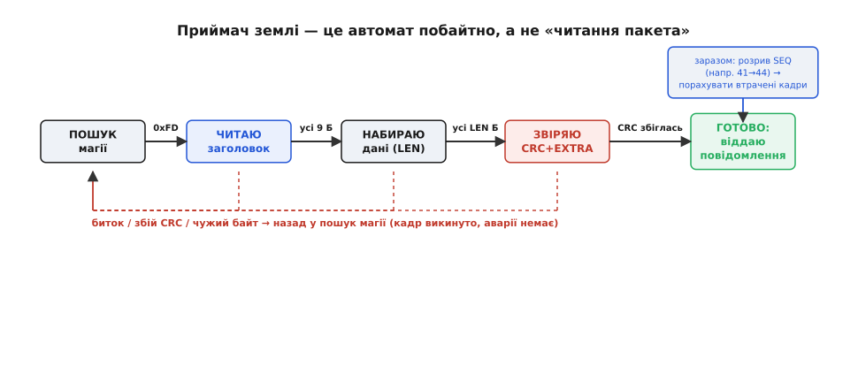
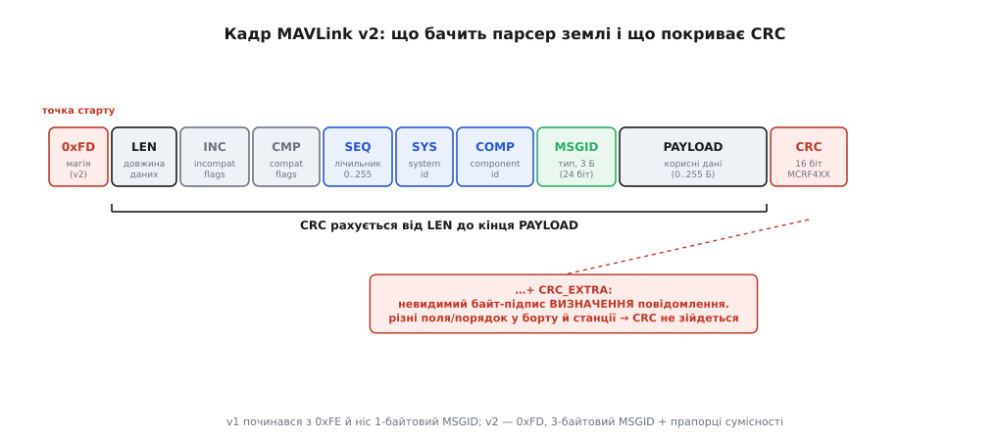
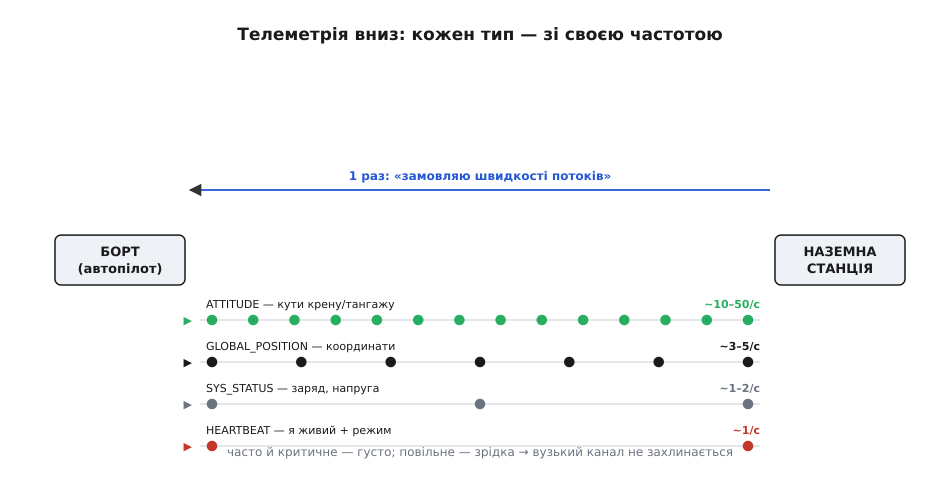
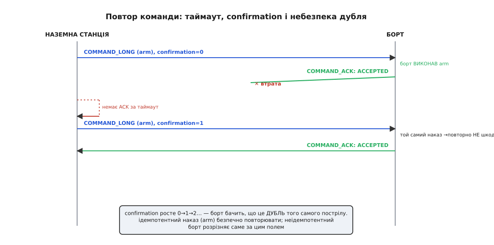
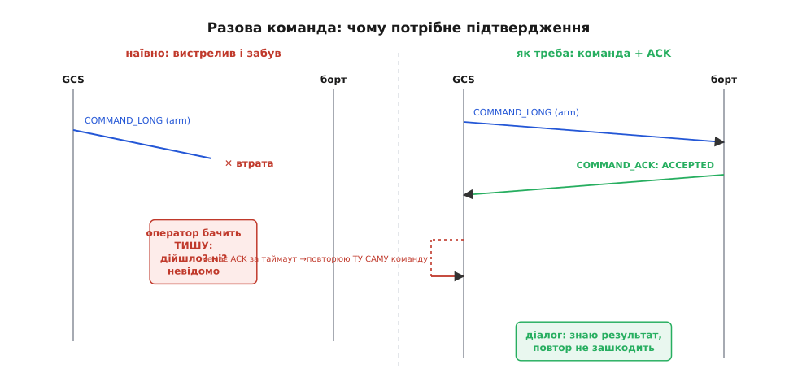
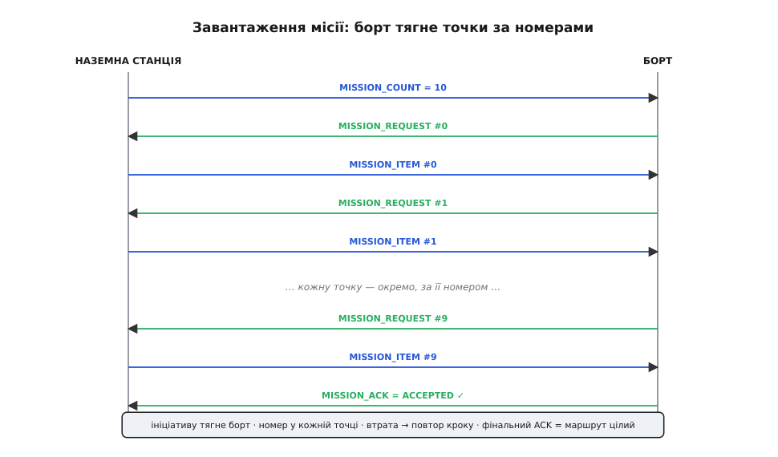
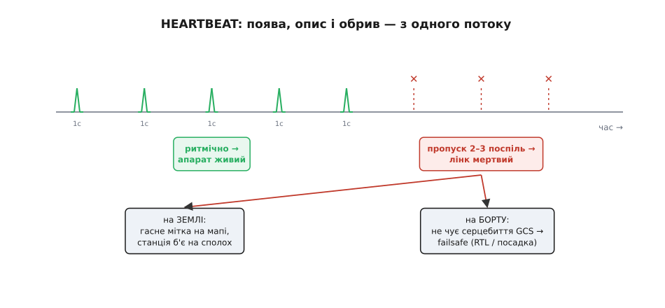

# MAVLink із землі — глибше

У базовому кроці ми сіли на місце оператора й подивилися на весь обмін **очима землі**: апарат сам кричить HEARTBEAT «я живий», униз ллється потокова телеметрія, угору йдуть команди з підтвердженням, а маршрут вантажиться нумерованою послідовністю з рукостисканням. Ми побачили головне **ЧОМУ**: складність протоколу рівно така, якою її робить ненадійність тонкої радіониточки — не більша й не менша.

Тепер спустімося на поверх нижче. Той самий погляд із землі, але вже не «що відбувається», а **як саме воно влаштоване всередині** — по байтах, по станах автомата, по таймерах і лічильниках. Ми не переказуватимемо базову картину; ми відкриємо кожен її механізм і подивимося, де він **ламається на межах**: коли пакет прийшов биткий, коли в мережі не один апарат, коли ACK загубився після виконання, коли два оператори лізуть у ту саму місію одночасно. Саме на цих межах наземна станція з «магічної чорної скриньки» перетворюється на зрозумілий скінченний автомат, який ти можеш і налагодити, і написати сам.

Почнемо з того, повз що базовий крок пройшов навмисне: з самих байтів у ниточці — бо все інше стоїть на тому, як земля їх розбирає.

## Земля не «читає пакет» — вона веде автомат побайтно

У базовому кроці ми казали: «щойно з ефіру випав HEARTBEAT, станція читає його поля». Це зручна абстракція, але в ефірі немає жодних «пакетів» — там суцільний **потік байтів**, який ще й приходить шматками різного розміру (радіомодем віддає то 3 байти, то 40), місцями попсований шумом, а на старті сеансу ти взагалі вклинюєшся посеред чужого напівкадру. Тому перше, що робить будь-яка наземна станція, — це не «читає повідомлення», а **веде скінченний автомат** (*finite-state machine*), який зі суцільного потоку **вирізає кадри** й відкидає сміття.

> 🔧 **Навіщо це.** Коли «станція іноді бачить апарат, іноді сипле помилками CRC» — це майже завжди не глюк, а нормальна робота цього автомата на брудному каналі: частина кадрів гине, парсер їх викидає й синхронізується наново. Розуміти цикл парсера треба, щоб відрізняти «лінк поганий, але живий» від «щось справді зламано» (наприклад, борт і GCS на різних діалектах — тоді валяться **всі** кадри одного типу, а не випадкові).

Байтова структура самого кадру — окрема тема, і повторювати її розкладку тут не будемо; нам потрібні лише ті поля, за якими автомат ухвалює рішення.

> 🔗 **Кадр MAVLink.** Кадр v2 починається зі стартового байта `0xFD` (у v1 — `0xFE`), далі йдуть довжина корисних даних, службові прапорці сумісності, лічильник послідовності SEQ, адреси (system id, component id), 3-байтовий номер типу повідомлення (MSGID) і сам корисний вантаж; наприкінці — 2-байтова контрольна сума. Усі багатобайтові поля — у порядку «молодший байт першим» (*little-endian*). Байтову розкладку тут не повторюємо — лише спираємося на неї.
> [Пакет MAVLink](root:sys-dron/mavlink-packet)

Автомат приймача має, по суті, п'ять станів, і читаючи **по одному байту**, він переходить між ними:

```
ПОШУК магії   → побачив 0xFD? запам'ятав, далі ЧИТАЮ заголовок
ЧИТАЮ заголовок → набрав усі 9 байтів заголовка (LEN, прапорці, SEQ, SYS, COMP, MSGID)?
НАБИРАЮ дані  → набрав рівно LEN байтів корисного вантажу?
ЗВІРЯЮ CRC    → 2 байти контрольної суми зійшлися (з домішаним CRC_EXTRA)?
ГОТОВО        → віддаю зібране повідомлення нагору, SEQ перевіряю, вертаюся в ПОШУК магії
```


*Земля веде автомат побайтно: знаходить стартовий байт, лічить довжину, набирає заголовок і рівно LEN байтів даних, звіряє контрольну суму — і лише тоді віддає повідомлення. Будь-який збій — биток, розбіжність CRC, чужий байт — повертає автомат у пошук магії; кадр просто викидається, аварії немає.*

Придивімося, чому саме автомат, а не «прочитати N байтів». По-перше, **межа кадру невідома наперед**: довжину вантажу ми дізнаємося аж із поля LEN, тобто після того, як уже набрали заголовок. По-друге, і це головне, **потік брудний**. Уяви, що в заголовку шум перевернув один біт у полі LEN: автомат чесно набере хибну кількість байтів, дійде до звірки — і **CRC не зійдеться**. Що робити? Не «читати наступний пакет із того місця, де скінчився цей» — бо ми навіть не знаємо, де він насправді скінчився. Правильна реакція одна: **викинути все й повернутися в стан ПОШУК магії**, шукаючи наступний `0xFD` у потоці. Один зіпсований кадр коштує нам одного кадру — не більше; синхронізація відновиться на наступному стартовому байті.

Тут криється тонкість, повз яку легко проскочити. Стартовий байт `0xFD` — **не унікальний маркер**: те саме значення 0xFD цілком може трапитися всередині корисних даних іншого повідомлення, суто як число. Тобто автомат час від часу «зловить магію» посеред чужого кадру, почне будувати з неї фантомний пакет — і майже напевно спіткнеться на звірці CRC. Це нормально й закладено в конструкцію: **контрольна сума — остання лінія оборони**, яка відсіює і бітові помилки, і хибні спрацювання на випадковому 0xFD. Саме тому CRC у MAVLink не косметична — без неї автомат раз у раз віддавав би нагору сміття, зібране з випадкового збігу байтів.

### Контрольна сума, яка ще й перевіряє, що ви говорите однією мовою

У базовому кроці контрольна сума згадувалася побіжно — «наприкінці кадру». Насправді вона робить **дві** роботи, і друга — несподівана.

Перша, очевидна: **виявити спотворення**. MAVLink рахує 16-бітову контрольну суму за алгоритмом **CRC-16/MCRF4XX** — це той самий поліном `0x1021`, що й у класичному X.25/HDLC, з початковим значенням `0xFFFF` і оберненням бітів на вході й виході; єдина відмінність від «книжкового» X.25 у тім, що MAVLink **не робить фінального інвертування** результату (тобто xorout = 0x0000). Рахується вона не від усього кадру, а **від поля LEN до кінця корисних даних** — стартовий байт у суму не входить (він потрібен лише для синхронізації, а не для цілісності).

> 🔗 **Що таке CRC і чому саме вона.** Контрольна сума за циклічним надлишковим кодом (CRC) — це залишок від «ділення» потоку бітів на фіксований поліном; кілька перевернутих у каналі бітів майже гарантовано змінюють залишок, тож приймач ловить спотворення, не питаючи повтору. Для MAVLink важливі конкретні параметри (поліном 0x1021, init 0xFFFF, обернення) і те, що це **виявлення**, а не виправлення помилок. Деталей алгоритму тут не розгортаємо.
> [CRC](root:com-modulation/crc)

А тепер друга робота, суто мавлінківська. У саму контрольну суму перед завершенням домішується ще один байт — **CRC_EXTRA**. Це не байт із кадру; його **немає в ефірі**. Це «підпис визначення» конкретного типу повідомлення: коли генератор коду MAVLink збирає бібліотеку з XML-опису повідомлень, він для кожного типу рахує окрему контрольну суму **над назвою повідомлення та назвами й типами всіх його полів** (у тому порядку, в якому вони йдуть у кадрі, з урахуванням довжин масивів) — і зашиває цей байт у таблицю. Відправник домішує CRC_EXTRA свого повідомлення в кінець даних, від яких рахує CRC; приймач — так само, зі свого боку.

Наслідок геніально простий. Якщо борт і наземна станція зібрані з **однакового** визначення повідомлення — їхні CRC_EXTRA збігаються, суми зійдуться, кадр приймається. Але якщо десь розбіжність — скажімо, у прошивці борту в структуру ATTITUDE додали нове поле, а стара GCS про нього не знає — CRC_EXTRA буде **різний**, і сума **не зійдеться ніколи**, хоч би канал був ідеально чистий. Тобто той самий механізм, що ловить биті байти, заразом ловить **несумісність діалектів**: земля фізично не сплутає повідомлення, яке розуміє інакше, ніж борт.


*Стартовий байт — лише точка синхронізації, у суму не входить. Контрольна сума рахується від поля довжини до кінця корисних даних, і в неї домішується CRC_EXTRA — невидимий у ефірі байт-підпис самого визначення повідомлення. Тому розбіжність у полях між бортом і станцією валить суму так само, як биток у каналі.*

Звідси практичний висновок, який рятує години налагодження: якщо наземна станція показує апарат (HEARTBEAT ходить), але **весь один тип** повідомлення вперто «б'ється по CRC», а решта — ні, шукай не шум у каналі, а **розбіжність версій діалекту**: на борту й на землі різні визначення цього повідомлення. Шум б'є кадри **випадково й потроху**; несумісний CRC_EXTRA б'є **весь тип і завжди**. Точний спосіб, у який визначення повідомлень описуються, версіонуються й генеруються в код, заслуговує окремого розбору.

> 🔗 **Словник повідомлень MAVLink.** Кожне повідомлення MAVLink описане в XML-діалекті: числовий ID, перелік полів із типами й порядком, а з них генератор виводить і код серіалізації, і той самий CRC_EXTRA. Спільний набір (common.xml) розуміють усі; зверху нашаровуються діалекти виробників. Нам тут важливо лише, що «мову» задає це визначення й що його розбіжність ловиться контрольною сумою. Каталог конкретних повідомлень не переказуємо.
> [Словник MAVLink](root:sys-dron/mavlink-message-dictionary)

### Лічильник SEQ: дешевий детектор втрат, який нічого не вимагає

Останнє, що автомат робить у стані ГОТОВО перед видачею повідомлення, — дивиться на однобайтове поле **SEQ**. У базовому кроці ми згадали його одним рядком: «показує пропуск, не вимагаючи повтору». Розгорнемо, бо це елегантний приклад того, як MAVLink дістає **діагностику майже задарма**.

Кожен відправник веде свій лічильник кадрів і кладе його в SEQ, збільшуючи на одиницю з кожним **відправленим** кадром (по колу: після 255 знову 0). Приймач землі, отримавши кадр від певного джерела, порівнює його SEQ з очікуваним (попередній плюс один). Якщо номер стрибнув — скажімо, з 41 одразу на 44 — між ними **загубилося два кадри**. Різниця номерів прямо дає кількість втрачених пакетів, а відношення втрачених до всіх — це і є той **відсоток втрат лінка** (*packet loss*), який GCS показує в кутку екрана.

Придивімося, чому це така вдала конструкція. SEQ **нічого не коштує** відправнику (один байт, який він і так інкрементує) і **нічого не вимагає** від нього у відповідь: земля рахує втрати сама, пасивно, не проронивши жодного зайвого пакета в і без того вузький канал. Порівняй із наївним «а перепитаймо, що загубилося» — для безперервної телеметрії це було б і марно (поки перепит дійде, дані застаріють), і шкідливо (зустрічний трафік у вузькому каналі). SEQ дає рівно те, що для потоку доречно: **знати, що втрата була, і скільки**, — не намагаючись її виправити.

Є одна межа, про яку варто пам'ятати. Оскільки SEQ однобайтовий, він **перевертається кожні 256 кадрів**. Якщо між двома отриманими кадрами загубилося **рівно 256** (чи кратне) поспіль — лічильник зробить повне коло й номер збігатиметься з очікуваним, тож пропуск стане невидимим. На практиці для оцінки якості лінка це не проблема: втратити рівно 256 підряд і жодного до/після — украй малоймовірно, а часткові втрати SEQ ловить чесно. Просто не варто розуміти цей лічильник як точний бухгалтерський облік кожного кадру — це **індикатор здоров'я каналу**, а не аудит.

Механіка «чому втрачений пакет телеметрії не перепитують, а лише лічать» — це та сама фундаментальна риса каналу, з якої випливає й уся решта; вона варта окремого погляду.

> 🔗 **Затримка й надійність лінка.** Радіоканал «земля–борт» вузький і губить пакети, а перепит коштує зустрічного трафіку й часу. Для безперервних вимірів свіжість важливіша за повноту, тож їх шлють потоком без підтверджень (SEQ лише лічить пропуски); для разових дій, навпаки, потрібне підтвердження й повтор. Цей компроміс «свіже з пропусками проти повного із запізненням» — ключ до всіх рішень MAVLink. Тут спираємося на нього як на даність.
> [Затримка й надійність](root:com-transport/latency-reliability)

## Хто з ким говорить: адреси, компоненти й маршрутизація на землі

Базовий крок мовчазно припускав, що на лінії **один** апарат і **одна** станція: «прийшов HEARTBEAT від апарата». Насправді в кадрі є два адресні байти — **system id** і **component id** — і без розуміння їхньої ролі наземна станція не впорається ні з кількома апаратами, ні навіть з одним сучасним апаратом, у якому «мешканців» більше одного.

Розкладемо поняття. **System id** (SYS) — це номер усього апарата як цілого: один дрон — один SYS (типово борт має SYS = 1, наземна станція бере собі, скажімо, SYS = 255). **Component id** (COMP) — номер **складника всередині** цього апарата: автопілот, підвіс камери, сама камера, компаньйон-комп'ютер — кожен має свій COMP, але **спільний** SYS апарата. Пара (SYS, COMP) **однозначно** називає конкретного співрозмовника в усій мережі. Тобто адреса дволанкова: «який апарат» і «хто саме в ньому».

Навіщо земля мусить це розрізняти навіть з одним дроном? Бо HEARTBEAT від автопілота (COMP автопілота) і HEARTBEAT від підвісу камери (інший COMP) — це **різні** серцебиття, і плутати їхні стани не можна: підвіс може бути «живий», а автопілот — ні. І коли оператор шле команду «зроби знімок», вона адресована **камері**, а «армуйся» — **автопілоту**; земля мусить проставити правильний COMP у полях-адресатах команди, інакше наказ піде не тому мешканцю.

> 🔧 **Навіщо це.** Класична «загадка»: до одного дрона під'єдналися, а на мапі раптом два апарати або блимає «unknown component». Причина майже завжди адресна — на борту з'явився другий компонент (підвіс, камера, компаньйон) зі своїм HEARTBEAT, і станція чесно показує обох мешканців одного SYS. Друга типова пастка — команда «не туди»: наказ камері пішов з COMP автопілота, і його ніхто не виконав. Дивишся на (SYS, COMP) у моніторі — і одразу видно, хто кому що адресує.

Тепер тонкість, що часто збиває початківців. У кадру, крім SEQ/SYS/COMP **відправника**, більшість командних і запитних повідомлень несуть **усередині корисних даних** ще й поля **target_system** і **target_component** — кому наказ призначено. І ось правило, яке треба знати: **нуль означає «всім»**. `target_system = 0` — широкомовний наказ усім апаратам у мережі; `target_component = 0` (те саме, що константа `MAV_COMP_ID_ALL`) — усім складникам названого апарата. Приймач обробляє повідомлення локально, якщо воно широкомовне **або** якщо target_system збігається з його SYS, а target_component або збігається з його COMP, або дорівнює нулю. Саме тому запит «дай усі параметри» шлють на `target_component = 0` — щоб озвалися **всі** компоненти апарата, а не лише навмання вибраний.

Коли мешканців у мережі кілька, постає й питання **маршрутизації**: одна фізична ниточка (наприклад, телеметрійний модем) веде до **компаньйон-комп'ютера** на борту, а той уже роздає кадри автопілоту, камері, підвісу — і навпаки, збирає їхні відповіді в один потік до землі. Це вже не «два кінці дроту», а маленька мережа з пересиланням кадрів за адресами. Логіка тут та сама, що й у будь-якій пакетній мережі: дивишся на адресу призначення й вирішуєш, кому кадр віддати чи куди переслати.

> 🔗 **Маршрутизація за адресами.** Коли між землею й кінцевими компонентами стоїть посередник (компаньйон-комп'ютер, mavlink-router), він пересилає кадри за полями адресата: широкомовні — усім лініям, адресні — лише туди, де живе потрібний (SYS, COMP). Це та сама ідея, що й маршрутизація пакетів у мережах, лише в мініатюрі. Загальний принцип пересилання за адресою тут не розгортаємо.
> [Маршрутизація](root:com-transport/ip-routing)

Тут-таки з'ясовується, чому базове «станція просто слухає канал» — правда лише наполовину. Слухати мало: почуті кадри треба ще й **розсортувати за джерелами** ((SYS, COMP) відправника), вести окрему модель стану для кожного мешканця кожного апарата й показувати оператору не «мітку на мапі», а **дерево**: апарат → його компоненти → стан кожного. Наземна станція — це, по суті, менеджер багатьох незалежних співрозмовників на одному дроті.

## Униз тече стан: як насправді замовляють частоти потоків

Базовий крок сказав головне: борт шле не все підряд, а обраний набір повідомлень, кожне зі своєю розумною частотою, і ці частоти **замовляє станція**. Тепер розберемо **механізм** замовлення — бо він за роки помітно змінився, і саме на цій зміні спотикаються, коли «телеметрія не тече» або «тече не та».

Спершу — навіщо взагалі замовляти, а не «хай борт сам вирішить». Причина у вузькості каналу, і її можна порахувати. Хай телеметрійний модем дає **57600 біт/с** — типова швидкість «свистка» 915/433 МГц. Це, з поправкою на службові байти й неідеальність, десь **4–5 кілобайтів корисних даних за секунду**. Тепер прикинемо апетити: повне повідомлення ATTITUDE у кадрі v2 — близько 36 байтів разом із заголовком і сумою. Якщо просити його 50 разів на секунду, це вже 50 × 36 ≈ **1800 байтів/с** — майже половина всього бюджету на **один** тип. Додай позицію, стан системи, дюжину інших — і канал захлинається: черга на передачу росте, кадри чекають, **затримка** повзе вгору, а коли буфер переповнюється — кадри просто **гинуть**. Тому замовлення частот — не забаганка, а **бюджетування вузького ресурсу**.

Виведемо просте, але надзвичайно корисне правило бюджету. Позначимо для кожного типу повідомлення його розмір у кадрі як `Sᵢ` байтів і бажану частоту як `fᵢ` герц. Тоді сумарний потік має вкладатися в пропускну лінка `B` (байтів/с):

```
Σ (Sᵢ · fᵢ)  ≤  B_корисна

приклад для модему 57600 біт/с (B_корисна ≈ 4600 Б/с):
  ATTITUDE          36 Б · 10 Гц = 360 Б/с
  GLOBAL_POSITION   44 Б ·  4 Гц = 176 Б/с
  SYS_STATUS        41 Б ·  2 Гц =  82 Б/с
  VFR_HUD           37 Б ·  4 Гц = 148 Б/с
  HEARTBEAT          9 Б ·  1 Гц =   9 Б/с
  ─────────────────────────────────────────
  разом                          ≈ 775 Б/с   ✓ (17% каналу — з великим запасом)
```

Цей запас не марнотратство: канал має витримувати ще й команди вгору, ACK, службовий обмін і **сплески** втрат (коли після провалу зв'язку все нависле проситься назад разом). Практичне чуття: тримай телеметрію в межах приблизно **половини** номінального бюджету — і лінк лишиться жвавим навіть у поганих умовах. Розгорнутий розрахунок бюджету потоків під конкретний модем варто винести окремо.

> 🔧 **Навіщо це.** Найчастіша причина «лаги телеметрії, апарат смикається на мапі» — не слабке залізо, а **перезамовлені частоти**: хтось виставив усім потокам по 20–50 Гц, канал захлинувся, і тепер навіть HEARTBEAT ходить із запізненням. Лік простий: порахуй Σ(Sᵢ·fᵢ), порівняй із бюджетом модему, зріж частоти рідкісних і довідкових повідомлень. Це рівно та арифметика, яку робить досвідчений оператор перед далеким польотом.

Тепер сам механізм — і його еволюція. **Стара схема** (і досі жива в багатьох прошивках заради сумісності): станція шле повідомлення `REQUEST_DATA_STREAM`, яке замовляє частоту не окремому повідомленню, а **цілій групі** — наприклад, групі POSITION чи EXTRA1 (куди прошивка сама вклала кілька споріднених повідомлень). Це грубий інструмент: ти просиш «групу позиційних на 5 Гц», не керуючи тим, що саме в тій групі й з якою точно частотою поїде. Зате одне коротке замовлення налаштовує цілий шар телеметрії.

**Нова схема** (MAVLink-мікросервіс, в ArduPilot з версії 4.0 і в PX4): замість групового запиту станція шле команду `MAV_CMD_SET_MESSAGE_INTERVAL` — усередині звичайного COMMAND_LONG — і задає **інтервал** (у мікросекундах) між кадрами **конкретного** повідомлення за його ID. Хочеш ATTITUDE рівно 20 разів на секунду — просиш інтервал 50000 мкс саме для ATTITUDE. Це точний інструмент: кожне повідомлення керується окремо. І, що важливо, `REQUEST_DATA_STREAM` **офіційно застарів** — його лишають працювати заради старих станцій, але писати нове варто вже на `SET_MESSAGE_INTERVAL`.


*Станція один раз замовляє швидкості; далі борт сам, без повторних запитів, ллє кожен тип зі своєю частотою. Швидке й критичне (кути) — десятки разів на секунду, повільне (заряд) — раз на секунду. Стара схема замовляла частоту цілим групам (REQUEST_DATA_STREAM), нова — кожному повідомленню окремо (SET_MESSAGE_INTERVAL).*

Ось де ховається типова «загадка», яку базовий крок не міг пояснити: **чому те саме замовлення на одному апараті працює, а на іншому — ні**. Тому що застаріле `REQUEST_DATA_STREAM` одні прошивки ще розуміють, інші вже ігнорують; а `SET_MESSAGE_INTERVAL` не знають старі прошивки. Наземна станція, яка хоче працювати з усіма, мусить **знати автопілот** (із HEARTBEAT — про це нижче) і слати той механізм, який ця прошивка розуміє. І знову: під ненадійним каналом навіть замовлення частоти — це команда, тобто разова дія, яку теж треба **підтверджувати й за потреби повторювати**. Що прямо підводить нас до серця протоколу.

## Угору йдуть команди: повний цикл, дублі та ідемпотентність

Базовий крок вивів головну ідею: разову команду не можна слати «вистрелив і забув», бо на дірявому каналі вона або мовчки пропаде, або від сліпого повтору спрацює двічі; рятує **підтвердження** (COMMAND_ACK) і **повтор по таймауту**. Тепер розберемо цей цикл до кінця — з таймерами, з полем проти дублів, з тонким питанням «а що взагалі безпечно повторювати».

Спершу — **чому саме команди, а не телеметрія, потребують усього цього**. Різниця не в важливості, а в **природі повідомлення**. Телеметрія — потік однорідних вимірів: втрата одного кадру самозагоюється наступним, свіжішим. Команда — **разова, унікальна подія**, яка або сталася, або ні; наступний кадр її не відтворить, бо наступного немає. Тому те, що для потоку — дрібниця, для команди — провал. І найгірше в цьому провалі — не сама втрата, а **невизначеність**: оператор натиснув «армуйся» й бачить тишу, але з тиші **не можна вивести**, що сталося. Було три різні світи, і ззовні вони однакові:

```
світ A: команда загубилася дорогою      → борт нічого не робив
світ B: команда дійшла, борт виконав,
        але COMMAND_ACK загубився назад  → борт УЖЕ армований
світ C: усе дійшло, ACK іще в дорозі     → усе гаразд, просто зачекай
```

Ззовні — тиша в усіх трьох. І якщо наосліп повторити команду, у світі A це рятунок, а у світі B — можлива **біда**: деякі накази від повторення спрацьовують двічі. «Змінити висоту на +5 м», надіслане двічі, дасть +10; «крок мотора» — подвійний крок. Отже, сліпий повтор небезпечний саме тому, що ми не відрізняємо A від B.

MAVLink розв'язує це двома засобами разом. Перший ми знаємо з базового: **підтвердження** COMMAND_ACK ліквідує світ C (тепер мовчанка означає «дійшло не все», а не «зачекай»). Другий — новий для нас — ліквідує небезпеку світу B: у повідомленні COMMAND_LONG є поле **confirmation**, і при **повторі тієї самої команди станція збільшує його** (0 на першому пострілі, 1 на повторі, 2 на наступному…). Тепер борт **бачить**, що перед ним не новий наказ, а **дубль** уже відомого пострілу, — і для дії, яку не можна робити двічі, може просто повторно відповісти «ACCEPTED», не виконуючи її вдруге.


*Небезпека не у втраті команди, а в невизначеності «дійшло, але ACK пропав». Станція по таймауту повторює ту саму команду зі збільшеним confirmation; борт за цим полем розрізняє перший постріл і дубль. Ідемпотентний наказ (армування) безпечно повторювати, а неідемпотентний борт розрізняє саме за confirmation.*

Тут варто ввести поняття, яке робить усю картину чіткою — **ідемпотентність** (від лат. *idem* — той самий, *potens* — здатний; «однаковий за наслідком, скільки разів не повтори»). Наказ **ідемпотентний**, якщо виконати його один раз і десять разів — однаковий кінцевий стан. «Армуйся» ідемпотентний: армований апарат від повторного «армуйся» лишається просто армованим. «Лети в точку з такими координатами» ідемпотентний: мета та сама. А от **відносні** накази — «додай 5 метрів», «поверни на 10°» — **не** ідемпотентні: кожен повтор зсуває стан. Звідси інженерне правило конструкції: **абсолютні накази — ідемпотентні, і повторювати їх безпечно; відносних у надійному протоколі уникають** саме тому, що на дірявому каналі повтор неминучий. MAVLink свідомо тяжіє до абсолютних формулювань команд — щоб «повтори по таймауту» ніколи не обернувся подвійною дією.

Тепер — таймери. Повний цикл виглядає так:

```
GCS  → COMMAND_LONG (cmd, confirmation=0)     засікли таймер, чекаємо ACK
борт → COMMAND_ACK  (cmd, ACCEPTED)           ← дійшло, готово ✓

якщо ACK не прийшов за таймаут (типово ~1 с):
GCS  → COMMAND_LONG (cmd, confirmation=1)     той самий наказ, лічильник++
   … і так до N спроб (типово ~3–5), тоді здаємося й кажемо оператору «не відповідає»
```

Точні числа — таймаут і кількість спроб — стандарт **не диктує жорстко**; він лише каже: постав таймер на кожне повідомлення, що чекає відповіді, і повтори, якщо мовчанка, а по вичерпанні спроб — облиш і поверни оператору помилку. Реальні станції беруть значення близько **секунди** й **кількох** повторів (наприклад, Mission Planner історично — близько 800 мс і до 5 спроб). Це компроміс: замалий таймаут — і ти сиплеш зайвими повторами в і без того вузький канал ще до того, як чесна відповідь устигла дійти; завеликий — і оператор надто довго чекає у невіданні. Окрема тонкість: якщо в ACK прийшов проміжний результат `IN_PROGRESS` (команда виконується довго — наприклад, калібрування), таймаут для неї треба **різко подовжити**, бо борт чесно працює, а не мовчить.

І остання — але дуже практична — деталь: сам ACK несе **не лише «так/ні», а причину**. Поле результату в COMMAND_ACK може бути:

```
ACCEPTED              прийнято й виконую
TEMPORARILY_REJECTED  зараз зайнятий (уже виконую іншу довгу команду) — спробуй згодом
DENIED                відхилено (умови не дозволяють — напр. немає GPS-фіксації для армування)
UNSUPPORTED           така команда взагалі не підтримується цією прошивкою
FAILED                спробував виконати — не вийшло
IN_PROGRESS           виконую, це надовго; ось поступ (у полі progress)
```

Різниця між ними — не педантизм, а **зовсім різна реакція станції**. На `TEMPORARILY_REJECTED` є сенс тихо зачекати й повторити; на `DENIED` повторювати марно — треба усунути причину (дочекатися GPS) і показати її оператору; на `UNSUPPORTED` не допоможе жодний повтор — прошивка просто не вміє цього, і станція має **сховати відповідну кнопку**, а не бомбардувати борт. Ось чому «слати й чекати відповідь» — це насправді **читати відповідь і поводитися за нею**, а не просто ставити галочку «дійшло».


*Зліва — наївно: станція шле команду й не знає, чи дійшла; втрата лишає оператора в невіданні. Справа — як треба: борт відповідає COMMAND_ACK із результатом, а станція по таймауту повторює ту саму команду зі збільшеним confirmation. Підтвердження робить разову дію надійною на дірявому каналі.*

### COMMAND_LONG проти COMMAND_INT: коли числа не влазять у float

Є ще одна глибша деталь, повз яку базовий крок пройшов. «Універсальне COMMAND_LONG із номером команди й кількома числовими параметрами» — правда, але з важливим застереженням: його сім параметрів — це **числа з рухомою комою** (*float*, 32 біти). А тепер згадаймо, що серед команд є й **навігаційні** — «лети в точку з такими широтою й довготою». І тут float підводить.

Розберемо чому, бо це красивий приклад того, як тип даних ламає точність. Широта на екваторі змінюється приблизно на 111 км на градус. 32-бітний float має близько 7 значущих десяткових цифр. Отже, при широті ~45° число на кшталт `45.1234567` вичерпує всю точність float **на рівні кількох градусів**, а на молодші розряди (метри) її вже **не лишається** — крок float у цьому діапазоні стає порядку **метрів**. Для «прилетіти в загальний район» це б зійшло, але для точного маршруту, посадки на майданчик чи зйомки за координатами — **ні**: апарат промахнеться.

Саме тому поряд із COMMAND_LONG існує **COMMAND_INT**. У ньому параметри 5 і 6 (куди кладуть широту й довготу) — не float, а **цілі числа** (*integer*): координати передаються як градуси, помножені на 10⁷, у 32-бітному цілому. Ціле на 32 бітах покриває весь діапазон координат зі стабільним кроком близько **сантиметра** — жодної втрати точності на молодших розрядах. Крім того, COMMAND_INT несе явне поле **frame** — систему відліку координат (висота над рівнем моря? над точкою зльоту? відносно поточної?), тоді як у COMMAND_LONG система відліку неявна й залежить від реалізації.

Звідси правило, яке варто затямити: **позиційні накази шли через COMMAND_INT** (ціла координата + явний frame), а COMMAND_LONG лишай для команд, де параметри природно дробові й невеликі за діапазоном (кути, коефіцієнти, службові прапорці). Плутанина тут дає підступні баги: маршрут, заданий через float-команду, «майже правильний», але систематично зсунутий на метри — і шукати причину в координатах ніхто не здогадується. Повний каталог команд і того, який параметр що означає, — окрема велика тема.

> 🔗 **Команди MAVLink.** Разові накази борту (армування, зміна режиму, зліт, посадка, керування камерою й підвісом) кодуються номером команди `MAV_CMD_*` і сімома параметрами; несуть їх або COMMAND_LONG (параметри — float), або COMMAND_INT (параметри 5–6 — цілі координати + явний frame). На кожну приходить COMMAND_ACK із результатом. Каталог конкретних номерів і значень параметрів тут не переказуємо — нам важливий цикл «команда + ACK + повтор» і вибір LONG/INT.
> [Команди MAVLink](root:sys-dron/mavlink-commands)

Робочий цикл «надіслати команду, дочекатися ACK, повторити по таймауту, розібрати результат» — це саме той шматок коду, який пише кожен, хто керує апаратом зі скрипта; його варто розібрати окремо як готовий приклад.

Цикл «команда + ACK + повтор із таймером і розбором результату» ми зберемо як робочий приклад на C у окремій вставці [реалізація командного циклу](root:embedded/mavlink-from-ground/proj-command-loop.md): надсилання COMMAND_LONG, очікування COMMAND_ACK за (SYS, COMP), таймаут, повтор зі збільшеним confirmation, розбір усіх кодів результату й поведінка на IN_PROGRESS.

## Завантаження маршруту: повний протокол місій та його межі

Базовий крок показав головну ідею протоколу місій: маршрут не висипають залпом (канал загубить точку й зсуне порядок), а вантажать нумерованою послідовністю з рукостисканням, де **ініціативу тягне приймач** — борт сам просить точку за точкою, називаючи номер. Тепер розгорнемо весь протокол: не лише завантаження, а й вивантаження, поточну точку, очищення; і, головне, **межі** — що діється при втратах, при порушенні порядку, при двох станціях одночасно.

Спершу закріпимо, **чому ініціативу тягне саме приймач**, бо це серце надійності. Уяви зворотне: точки пхає відправник (станція), кидаючи їх одну за одною. Тоді загублену точку №4 борт **не помітить** — він просто складе маршрут із дев'яти точок, де колишня №5 стане на місце №4, і полетить не туди. А коли **просить** борт («дай №4»), він фізично не рушить далі, доки не отримає саме №4: немає №4 — немає №5. Ініціатива приймача перетворює «сподіваюся, все дійшло» на «не піду далі, поки не переконаюся». Це загальний принцип надійних завантажень, не лише мавлінківський.

Повний цикл **завантаження** (station → борт) такий:

```
GCS  → MISSION_COUNT = N              «приготуйся, точок буде N»   [таймер!]
борт → MISSION_REQUEST_INT  #0        «дай нульову»
GCS  → MISSION_ITEM_INT     #0        ← борт звірив номер
борт → MISSION_REQUEST_INT  #1
GCS  → MISSION_ITEM_INT     #1
           …  кожну окремо, за її номером  …
борт → MISSION_REQUEST_INT  #(N−1)
GCS  → MISSION_ITEM_INT     #(N−1)
борт → MISSION_ACK (MAV_MISSION_ACCEPTED)   «увесь маршрут ліг цілим» ✓
```


*Станція оголошує кількість точок, далі борт по черзі просить кожну за її номером і отримує рівно її; будь-яка втрата відновлюється повтором останнього кроку, а порядок гарантовано номерами. Фінальний ACK означає, що весь маршрут ліг у пам'ять цілим — без діри, що завела б апарат не туди.*

Тут одразу помітна деталь, глибша за базову: точки їдуть як **MISSION_ITEM_INT**, а борт просить їх через **MISSION_REQUEST_INT** — з тим самим «_INT», що й у команд, і з тієї самої причини. Координати вейпойнта — це широта й довгота, яким потрібна **цілочисельна** точність (градуси × 10⁷), а не дробова: інакше маршрут систематично зсунеться на метри. Історично існували й «дробові» MISSION_REQUEST / MISSION_ITEM (з координатами-float); вони **офіційно застаріли**, і нове писати треба на «_INT»-версіях — хоча приймач досі мусить розуміти й старі заради сумісності зі старими станціями. Це та сама пара «застаріле, але підтримуване / нове, точніше», що ми вже бачили зі стрім-рейтами.

Тепер — **межі**, заради яких ми сюди прийшли.

**Втрата в будь-якому напрямку.** Кожне повідомлення, що чекає відповіді, захищене **таймером**. Загубився MISSION_REQUEST_INT від борту — станція його не отримала, мовчить; борт по своєму таймауту **повторює запит** тієї самої точки. Загубився MISSION_ITEM_INT від станції — борт не дочекався очікуваної точки й **повторює запит** того самого номера. У будь-якому разі сторона, що чекає, **перезапитує свій останній крок**, і обмін продовжується **з того самого місця**, нічого не зсуваючи. Це і є та властивість, що робить балакучий протокол надійним: кожен крок **самовідновний**.

**Порушення порядку.** А що, як через химерну затримку борт попросив №4, а прийшла — з якоїсь причини — №5? Правило чітке: **точку не в чергу викидають, а очікувану перезапитують**. Борт приймає лише той номер, який просив зараз; усе інше ігнорується, і він знову шле запит на потрібний номер. Тому маршрут **неможливо зібрати з переставлених точок** — навіть якщо канал їх переплутав, порядок нав'язує приймач своїми запитами.

**Дві станції одночасно.** Це вже зовсім за межами базового кроку, але в реальності буває: два оператори (чи станція й скрипт) полізли керувати одним апаратом. Протокол місій розрахований на **одну операцію за раз**: борт веде діалог із тим, хто почав, за адресою (SYS, COMP). Якщо всередину влізе третій зі своїм MISSION_COUNT, обмін може збитися — тому дисципліна «один господар місії в один час» лежить на **станціях**, а не на протоколі. Практичний наслідок: не тримай дві станції, що пишуть місію, на одному апараті водночас — читати телеметрію вони можуть обидві, а **писати** маршрут має хтось один.

Симетрично влаштоване **вивантаження** (борт → station, коли оператор хоче прочитати те, що вже в пам'яті апарата): тепер запити шле станція (`MISSION_REQUEST_LIST`, далі по черзі MISSION_REQUEST_INT кожного номера), а борт віддає MISSION_ITEM_INT; завершує MISSION_ACK. Ті самі таймери, та сама самовідновність, лише ролі «хто просить» помінялися. Окремими короткими обмінами йдуть **поточна точка маршруту** (`MISSION_CURRENT` — борт повідомляє, який вейпойнт виконує зараз; станція командою може «перестрибнути» на інший) і **очищення** (`MISSION_CLEAR_ALL` — стерти весь маршрут із борту, з підтвердженням).

> 🔧 **Навіщо це.** Дві типові біди завантаження місії. Перша — «зависає на N%»: майже завжди це втрачений у поганому каналі запит або точка, і протокол сумлінно перезапитує той самий крок, поки канал не пропустить його; лік — покращити лінк або підняти таймаути, а не «тиснути ще раз». Друга — «маршрут завантажився, але точки трохи зсунуті»: ознака, що десь у ланцюгу проскочили **дробові** (float) MISSION_ITEM замість «_INT», і координати втратили молодші розряди. І золоте правило: пиши місію **однією** станцією за раз.

Повний протокол місій — з усіма станами, таймерами, крайніми випадками й кодами MAV_MISSION_* — це велика самостійна машина, варта окремого детального розбору.

> 🔗 **Протокол місій MAVLink.** Маршрут вантажиться/читається нумерованою послідовністю з рукостисканням: MISSION_COUNT → серія MISSION_REQUEST_INT/MISSION_ITEM_INT за номерами → MISSION_ACK; ініціативу тягне приймач, кожен крок захищений таймером і самовідновний, порядок нав'язують запити. Є ще вивантаження, поточна точка й очищення. Повний перелік станів, кодів і крайніх випадків тут не розгортаємо — спираємося на принцип «рукостискання + номери + самовідновний крок».
> [Протокол місій MAVLink](root:sys-dron/mavlink-mission-protocol)

Сам маршрут — звідки беруться ці вейпойнти, як оператор їх укладає й що означає кожен тип точки — це вже проєктування місії, окремий крок курсу.

> 🔗 **Проєктування місії.** Вейпойнти — це не лише координати: кожна точка несе тип дії (летіти, кружляти, злітати, сідати, зробити знімок) і параметри (радіус, час, висоту). Станція дає оператору укласти цей список на мапі, а протокол місій переносить його в пам'ять борту. Тут нам важить лише те, що маршрут — **упорядкований набір**, який не терпить ні дір, ні переставлянь. Проєктування самих вейпойнтів розбираємо окремо.
> [Проєктування місії (вейпойнти)](root:embedded/mission-planning)

## Ще один потік запит-відповідь: параметри

Базовий крок його не згадував зовсім, а на землі він критичний, тож додамо. Крім телеметрії, команд і місій, наземна станція веде з бортом **параметри** (*parameters*) — сотні налаштувань прошивки: коефіцієнти регуляторів, ліміти, калібрування, поведінка failsafe. Коли ти в станції відкриваєш екран «повний список параметрів» і бачиш, як він поволі наповнюється рядок за рядком, — це працює **протокол параметрів**, і він показовий тим, що розв'язує ту саму проблему надійності **ще одним** способом, відмінним від місій.

Тут інша природа даних: параметрів **багато** (часто понад тисячу), вони незалежні один від одного, і **порядок між ними не важить** — на відміну від вейпойнтів маршруту. Тому й механізм інший. Читання всіх параметрів: станція шле один запит «дай усі» (`PARAM_REQUEST_LIST`), а борт **сам ллє** їх потоком — кожен параметр окремим повідомленням `PARAM_VALUE`, і в кожному вказано **його порядковий номер і загальну кількість** (наприклад, «параметр 137 з 950»). Ось у цьому «137 з 950» — уся хитрість: станція, знаючи повну кількість, **бачить, яких номерів бракує**, і адресно перепитує лише **їх** (`PARAM_REQUEST_READ` за іменем чи індексом). Не треба ні нумерованого рукостискання, ні строгого порядку — досить, що кожен елемент **самоописний** (несе свій індекс і total), і втрачені добираються поштучно.

Порівняймо три підходи, які ми тепер бачили, — і стане видно спільний принцип і різні його втілення:

```
телеметрія   потік без відповіді        втрату лише ЛІЧИМО (SEQ), не виправляємо
параметри    потік + адресний до-запит  кожен елемент самоописний → бракуючі добираємо
місія        рукостискання + номери      строгий порядок, кожен крок самовідновний
```

Це не три випадкові рішення, а **три точки на одній шкалі**: що суворіші вимоги до повноти й порядку, то дорожчий і балакучіший протокол. Телеметрії байдуже до втрат — найдешевший варіант. Параметрам потрібна повнота, але байдужий порядок — середній. Місії потрібні **і** повнота, **і** порядок — найдорожчий. MAVLink не нав'язує один протокол на все; він добирає **рівно ту суворість**, якої вимагає природа даних. Це та сама думка, що пронизувала базовий крок, — тепер видно її в трьох різних утіленнях одразу.

> 🔗 **Параметри MAVLink.** Налаштування прошивки читаються/пишуться протоколом параметрів: PARAM_REQUEST_LIST → потік PARAM_VALUE (кожен несе свій індекс і загальну кількість) → адресний PARAM_REQUEST_READ на бракуючі; запис — PARAM_SET із луна-підтвердженням новим PARAM_VALUE. Порядок неважливий, повнота досягається до-запитом самоописних елементів. Каталог конкретних параметрів тут не розгортаємо.
> [Параметри MAVLink](root:sys-dron/mavlink-param-protocol-model)

Запис параметра, до речі, теж підтверджується — але **не** окремим ACK, а **луною**: станція шле `PARAM_SET` із новим значенням, а борт у відповідь надсилає `PARAM_VALUE` цього параметра **вже з новим значенням**; станція звіряє — збіглося, отже, записано. Якщо луна не прийшла чи значення не те — повторити. Знову той самий скелет «дія + підтвердження + повтор», лише підтвердження прибрало форму відлуння стану, а не окремого «ок».

## Режими польоту: спільний намір і навіщо потрібне самопізнання

Останній шматок картини — **режими польоту**. Базовий крок пояснив головне: режим — це відповідь на «хто зараз керує апаратом і за яким законом», він їде в кожному HEARTBEAT, станція може його змінити, а назви й номери режимів **залежать від прошивки**, тож станція мусить знати, з ким говорить. Тепер розберемо **механіку кодування** — бо саме в ній видно, чому HEARTBEAT несе не лише пульс, а й самоідентифікацію, і чому без цього число режиму безглузде.

У кадрі HEARTBEAT режим закодовано **двома** полями, і поділ між ними принциповий. Перше — `base_mode`: набір **службових прапорців**, спільних для **всіх** апаратів незалежно від прошивки. Серед них — чи апарат **армований** (прапорець SAFETY_ARMED) і чи ввімкнено **власне автокерування** прошивки (прапорець CUSTOM_MODE_ENABLED, який каже: «дивися режим у другому полі»). Це — універсальний шар: армованість читається однаково скрізь.

Друге поле — `custom_mode`: **число, що означає режим саме цієї прошивки**. І ось тут корінь усього: значення 4 у custom_mode для ArduPilot на квадрокоптері означає GUIDED, а для PX4 — зовсім інший режим; те саме число, різний зміст. Число саме по собі **не самодостатнє** — воно осмислене лише в парі з таблицею режимів **конкретної** прошивки конкретного типу апарата.

Звідси випливає елегантна необхідність: щоб правильно **показати** режим, станція мусить спершу дізнатися, **чию** таблицю брати. І ця відповідь — у тому самому HEARTBEAT: він несе поля `autopilot` (яка прошивка: ArduPilot, PX4, …) і `type` (який апарат: квадрокоптер, літак, ровер). Станція читає їх, обирає відповідну таблицю режимів — і **лише тоді** число custom_mode = 4 перетворюється на «GUIDED» чи інший осмислений напис. Тобто HEARTBEAT влаштований так, що несе **і дані (режим-число), і ключ до їх тлумачення (хто це)** в одному кадрі. Прибери самоідентифікацію — і custom_mode стане нечитабельним числом.

> 🔧 **Навіщо це.** Дві «загадки», що насправді про режими. Перша: «станція показує не той режим, що в логах прошивки» — майже завжди GCS узяла **не ту таблицю**, бо неправильно визначила autopilot/type із HEARTBEAT (типово — коли підключаєшся до нестандартної чи змішаної збірки). Друга: «шлю команду летіти в точку, апарат не реагує» — він у невідповідному режимі (STABILIZE замість GUIDED), і наказ просто недоречний. І найкорисніша звичка: побачив у HEARTBEAT раптовий перехід у RTL, якого не наказував, — шукай **обрив лінка** чи спрацювання failsafe, а не «глюк».

Чому режим — річ **наскрізна**, а не побічна? Бо він задає **зміст** усього іншого обміну. У режимі AUTO наказ «лети сюди» зайвий — апарат і так іде місією; у STABILIZE безглуздо чекати, що він сам утримає точку. Станція, знаючи режим із серцебиття, показує **доречні кнопки** й правильно тлумачить поведінку. А зміна режиму — це, звісно, теж **команда**: станція шле її (через COMMAND_LONG чи спеціалізоване повідомлення) і чекає COMMAND_ACK, з усім уже знайомим циклом підтвердження й повтору. Режим не «перемикається сам собою» — його встановлюють тим самим надійним механізмом, що й будь-яку разову дію.

І тут коло всієї розмови замикається — рівно так, як у базовому кроці, але тепер ми бачимо механізм цілком. Найважливіший для безпеки режим — **RTL/LAND як failsafe**: коли зникає серцебиття від землі (той самий обрив, що його ловить детектор присутності — пропуск кількох HEARTBEAT поспіль), борт **сам** перемикається в RTL і вертається. Серцебиття, з якого починається вся розмова, своєю **відсутністю** запускає рятувальний режим.


*Поки серцебиття приходить ритмічно — апарат «живий» на мапі. Пропуск кількох поспіль означає мертвий лінк: станція гасить індикатори й б'є на сполох, а борт зі свого боку (не чуючи серцебиття від GCS чи пульта) вмикає безпечний режим — failsafe. Той самий потік дає і появу, і зникнення.*

Механіку самого детектора присутності — таймер очікування HEARTBEAT, поріг пропущених, поведінку при відновленні — варто зібрати як окрему машину станів, бо в реальному коді землі вона нетривіальна.

Детектор присутності за HEARTBEAT — таймер очікування, поріг у кілька пропущених ударів, перехід «живий → втрачено → відновлено» — зберемо окремим прикладом на C у вставці [сторож серцебиття](root:embedded/mavlink-from-ground/proj-heartbeat-watchdog.md): відлік від останнього отриманого HEARTBEAT кожного (SYS, COMP), гасіння мітки при перевищенні порогу, повторна поява при новому ударі.

## Одним поглядом: чому кожен механізм саме такий

Складімо тепер повну картину — уже не «що робить земля», а **чому кожна її частина влаштована саме так**, з механізмом, а не гаслом:

```
HEARTBEAT       1/с, самоідентифікація (autopilot/type + custom_mode) →
                поява, опис, ключ до режимів; відсутність кількох поспіль → failsafe
парсер землі    скінченний автомат побайтно: магія → LEN → заголовок → дані → CRC;
                биток/чужий байт → назад у пошук магії, кадр викинуто, без аварії
CRC + CRC_EXTRA ловить і биток каналу, і несумісність діалектів (розбіжність визначень)
SEQ             дешевий пасивний лічильник втрат — знати «скільки», не виправляти
адреси SYS/COMP апарат → його компоненти; target=0 — широкомовно; маршрутизація посередником
телеметрія      потік без відповіді, частоти замовлені (SET_MESSAGE_INTERVAL) під бюджет Σ(S·f)≤B
команда + ACK   confirmation проти дублів, таймаут+повтор, коди результату, абсолютні=ідемпотентні;
                COMMAND_INT (ціла координата+frame) для позиції, LONG (float) для решти
параметри       самоописний потік (індекс+total) + адресний до-запит бракуючих; запис — луна PARAM_VALUE
місія           рукостискання + номери + самовідновний крок; ініціатива в приймача; один господар за раз
режим           спільний намір (base_mode прапорці + custom_mode число прошивки); зміна — команда з ACK
```

Жоден із цих механізмів не складніший, ніж мусить бути, і кожен — **пряма відповідь на конкретну ваду тонкої ниточки**. Автомат парсера — бо потік брудний і без меж. CRC з домішаним CRC_EXTRA — бо треба відсіяти і биток, і різномовність. SEQ — бо втрати корисно **знати**, коли виправляти їх недоречно. Адреси — бо на дроті не двоє, а мережа мешканців. Замовлені частоти — бо канал вузький і його треба бюджетувати. Команди з confirmation і повтором — бо разову дію не можна ні втратити мовчки, ні виконати двічі. Параметри самоописним потоком — бо їх багато, порядок байдужий, а повнота потрібна. Місія рукостисканням — бо маршрут не терпить ні дір, ні переставлянь. Режим двома полями із самоідентифікацією — бо число режиму без «хто це» безглузде.

Ось у чому глибший сенс погляду **з землі**: наземна станція — не «програма з кнопками», а **набір скінченних автоматів над ненадійним каналом**, де кожен автомат точно припасований до природи свого потоку. Опануй цю відповідність «вада каналу → механізм протоколу» — і будь-яка станція, від QGroundControl до твого власного скрипта на кілька десятків рядків, перестане бути чорною скринькою. За кожним рухом курсора ти бачитимеш конкретний кадр, що пішов у ниточку, конкретне поле, яке він несе, і конкретну відповідь, на яку він чекає, — з таймером, лічильником і кодом результату напоготові.

Далі в курсі ми перейдемо від «як це влаштовано» до «як цим керувати з коду»: візьмемо готову бібліотеку й напишемо власного клієнта, що робить рівно те, що ми щойно розібрали, — слухає серцебиття, замовляє потоки, шле команди з підтвердженням.

> 🔗 **pymavlink.** Наступний крок курсу: керувати апаратом зі свого коду через бібліотеку pymavlink — під'єднатися до лінка, дочекатися HEARTBEAT, замовити потоки, надіслати команду й дочекатися ACK, завантажити місію. Усі механізми з цього кроку там стануть кількома рядками виклику; тут нам важило зрозуміти, **що саме** ті рядки роблять у ниточці.
> [pymavlink](root:embedded/pymavlink)

Історія самого MAVLink — звідки взявся протокол, чому він саме такий і хто його створив — заслуговує окремої короткої розповіді.

Протокол MAVLink народився не в корпорації, а в університетській лабораторії; коротку правдиву історію його появи винесено в окрему вставку [як народився MAVLink](root:embedded/mavlink-from-ground/hist-mavlink-birth.md): студентський проєкт Pixhawk в ETH Zürich, роль Лоренца Маєра, перший випуск 2009 року під вільною ліцензією й те, як «протокол для однієї змагальної задачі» став галузевим стандартом.

---
