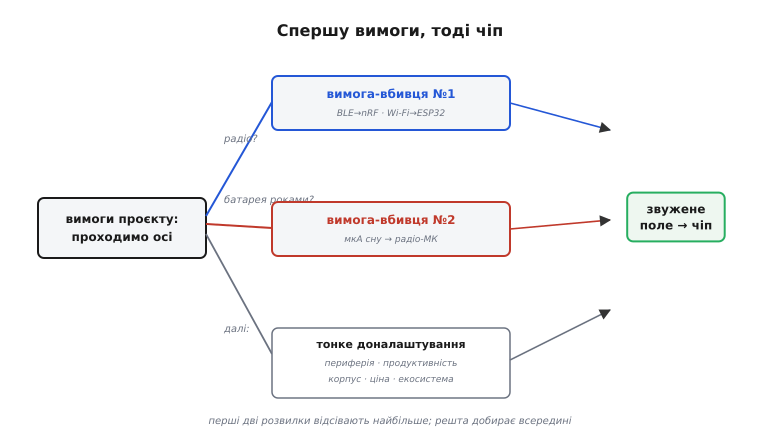
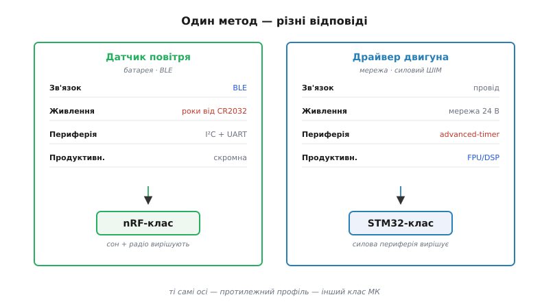

# Чеклист вибору МК

Питання треба ставити до [проєкту, а не до чіпа](root:embedded/mcu-selection). Спершу вимоги — потім чіп; ніколи не навпаки. Слово «чеклист» (англ. *checklist*, від *check* — «перевірити» + *list* — «перелік») тут не випадкове: це саме перелік перевірок, який проходять по черзі, щоб жодна важлива вимога не випала з поля зору під тиском звички.

А звичка тисне сильно. Найпоширеніший хід новачка звучить так: «знаю ESP32, люблю ESP32 — зроблю на ESP32». За кілька тижнів виявляється, що батарейний датчик живе три доби замість трьох років, бо радіомодуль Wi-Fi у піку тягне під 200 міліампер і спустошує літієву таблетку; або що для точного драйвера двигуна бракує таймера з апаратним мертвим часом і синхронних каналів АЦП. Переробка плати після першої ревізії коштує дорого завжди — це новий цикл розведення, нові закупівлі, нові помилки монтажу й тижні очікування. Інженер натомість виписує вимоги, а тоді дивиться, який клас чіпів їх закриває.

> 🔧 **Навіщо це.** Чеклист — не бюрократія, а страховка від дорогої переробки. Десять хвилин питань на старті економлять місяць роботи в середині проєкту, коли плата вже розведена й половину коду написано під чужу периферію.

## Сім осей вибору

Усе зводиться до семи осей. Перші п'ять — це властивості самого чіпа, шоста — фізична можливість його зібрати, сьома — світ навколо нього. Проходимо їх по черзі й на кожній звужуємо коло кандидатів.

**1. Периферія.** Які саме інтерфейси й скільки каналів потрібно — UART, I²C, SPI, CAN? Чи треба особлива периферія: таймер із керуванням комплементарними виходами й апаратним мертвим часом (advanced-timer) для силового моста, синхронні канали АЦП, що беруть вибірку в один і той самий момент, апаратний USB? Периферію або має сам кристал, або її доводиться добудовувати зовнішніми мікросхемами — а це знову плата, гроші й точки відмови.

**2. Зв'язок.** Провід, Wi-Fi, Bluetooth Low Energy, взагалі нічого? Це перша «вимога-вбивця»: одне «так» тут відсікає цілі класи чіпів. Потрібне радіо малого споживання — у грі [радіо-МК на кшталт nRF](topic:hw-arch/nrf-radio-mcu) із вбудованим BLE; потрібен Wi-Fi із чималим стеком — це територія ESP32; вистачає дроту — поле відкрите для всіх.

**3. Живлення.** Від мережі чи від батареї на роки? Якщо батарея — змінюється все: будова прошивки крутиться навколо циклу «прокинувся — зробив — заснув», а доля проєкту вирішується струмом сну, не швидкодією. Тут оцінюють [бюджет енергії](topic:hw-power/battery-budget): скільки мікроампер тече, поки чіп спить, і як часто він мусить прокидатися.

**4. Продуктивність.** Що задача справді потребує, а не «більше — краще»? Чи дійсно потрібен апаратний блок дій із дробами (FPU, *floating-point unit*) або цифрова обробка сигналу (DSP), як у старших [ядрах Cortex-M](topic:hw-arch/cortex-m)? Паспортні мільйони інструкцій за секунду — це ще не реальна швидкодія: [DMIPS не дорівнює відгуку системи](root:embedded/esp32-vs-8bit), бо її визначають затримки переривань, шина пам'яті й кеш, а не лише число на коробці.

**5. Корпус і пайка.** Що реально запаяти у своєму виробництві чи вдома? Між корпусами — прірва зручності: [DIP, QFP, QFN чи BGA](topic:hw-components/packages). Вивідний DIP береться руками й звичайним паяльником; QFP із ніжками по краях ще піддається ручній пайці; QFN з контактами під днищем уже просить трафарету й фена; BGA з кульками під корпусом вимагає печі з профілем і рентгена для контролю — самотужки його не зібрати.

**6. Ціна × тираж.** Різниця в півдолара за чіп на тисячах виробів — це реальні гроші. Те, що на одній платі непомітне, на партії в десятки тисяч стає окремою статтею бюджету; на одиничному пристрої, навпаки, ціна кристала майже не важить проти часу розробки.

**7. Екосистема й доступність.** Чи є SDK, готові драйвери, жива спільнота й [довговічність постачальника](topic:sys-bsystem/mcu-ecosystem)? І окреме питання — чи буде цей чіп у продажу через три роки. Технічно блискучий кристал без бібліотек і без наявності на складі коштує тижнів простою.

Порядок осей не випадковий. Осі **2** і **3** — «вимоги-вбивці»: одне «так» викреслює цілий клас і різко звужує пошук. Осі **4–7** — тонке доналаштування всередині вже звуженого поля. Тому й проходять їх саме в такому порядку: спершу грубо відсікти неможливе, тоді вибирати з придатного.



*Дерево питань, де кожна відповідь відсікає непридатні класи МК; перші дві розвилки відсівають найбільше.*

## Як вимоги приводять до класу: два пристрої

Метод один, а відповіді протилежні — усе вирішує профіль проєкту.

**Пристрій перший: датчик якості повітря на батарейці-таблетці.** Виписуємо вимоги й одразу читаємо наслідок кожної.

```
Вісь            Вимога                  Наслідок
─────────────────────────────────────────────────────────────────
Зв'язок         BLE                     ESP32 надмірний; Wi-Fi не треба
Живлення        CR2032, ~3 роки         потрібні мкА сну → Wi-Fi відпадає
Периферія       I²C-давач + UART        вистачить простої
Продуктивність  зчитати й відіслати     FPU/DSP не потрібні
Корпус          складають на заводі     QFN припустимий
Ціна × тираж    ~10 000 шт              півдолара вже важить
Екосистема      бажано жива             перевага зрілому BLE-SDK
─────────────────────────────────────────────────────────────────
Відсіяно: ESP32 (Wi-Fi, струм), STM32 (нема BLE),
          AVR (нема BLE), RP2040 (нема BLE)
Лишився:  nRF-клас  ✓
```

Вісь живлення тут — вимога-вбивця. Літієва таблетка CR2032 має близько 220 міліампер-годин; щоб протягти три роки, середній струм мусить лишатися в одиницях-десятках мікроампер. Wi-Fi у передачі бере 180–240 міліампер — навіть короткими сплесками він з'їдає таку батарею за дні. Тому радіо звужується до BLE, а серед BLE-чіпів виграє той, що зроблений навколо мікроамперного сну: nRF-клас спить у режимі System OFF із утриманням пам'яті на рівні близько 2 мікроампер, а в режимі System ON з годинником реального часу — близько 3 мікроампер. Це і є різниця між «три роки» й «три тижні».

**Пристрій другий: силовий драйвер двигуна від мережі 24 В.** Той самий чеклист — інша відповідь.

```
Вісь            Вимога                  Наслідок
─────────────────────────────────────────────────────────────────
Зв'язок         провід (CAN/UART)       радіо не потрібне
Живлення        мережа 24 В             струм сну не критичний
Периферія       6 ШІМ + мертвий час,    потрібен advanced-timer
                3 синхронних АЦП        + одночасна вибірка
Продуктивність  керування струмом       бажані FPU/DSP
Корпус          складають на заводі     QFP/QFN припустимі
─────────────────────────────────────────────────────────────────
Відсіяно: ESP32 (нема advanced-timer, незручний АЦП),
          nRF (нема силового ШІМ), AVR (8-біт, без FPU),
          RP2040 (M0+, нема advanced-timer)
Лишився:  STM32-клас  ✓
```

Тут вимога-вбивця — периферія. Керувати трифазним мостом означає видавати три пари протифазних сигналів ШІМ так, щоб верхній і нижній ключі плеча ніколи не були відкриті разом, інакше станеться наскрізний струм і ключі згорять. Захисну паузу між перемиканнями — мертвий час (англ. *dead-time*, дослівно «мертвий, неробочий час») — мусить вставляти саме залізо таймера, незалежно від завантаженості процесора; у STM32 це робить advanced-timer (TIM1/TIM8) через регістр BDTR. Додатково АЦП має брати вибірку струму строго в потрібну мить періоду ШІМ — синхронно із таймером. Жодна з цих вимог не про мегагерци; вони про конкретний блок периферії, і саме він приводить чеклист до STM32-класу.



*Як два протилежні проєкти проходять ті самі осі й приходять до різних класів: батарея й радіо тягнуть до nRF, силова периферія — до STM32.*

## Типові помилки

Метод простий, та сходять із нього однаково. Найчастіші пастки:

- **Гонитва за мегагерцами.** Швидший чіп не дорівнює кращому пристрою: відгук системи визначають затримки переривань і пам'ять, а зайві мегагерци лише піднімають струм і ціну.
- **Зневага до струму спокою.** У батарейному пристрої різниця між мікроамперами й міліамперами — це рік проти тижня; на цій осі програють найчастіше.
- **Чіп без [екосистеми](topic:sys-bsystem/mcu-ecosystem).** Технічно чудовий кристал без драйверів і спільноти простоює тижнями, поки пишеш те, що в інших уже готове.
- **Дефіцитний чи знятий із випуску чіп.** Вісь [доступності](root:embedded/mcu-selection) цілком реальна: у 2020–2022 роках терміни постачання STM32 сягали 52 тижнів, серії STM32F0–F4 (їх роблять на сторонній фабриці TSMC) постраждали найдужче, тоді як STM32L0/L4 трималися краще. Чіп, якого немає на складі, не врятує жодна перевага.
- **Корпус, [який не запаяти](topic:hw-components/packages).** BGA з кроком 0.4 мм у домашньому виробництві — гарантована катастрофа: без печі й рентгена кульки під корпусом не проконтролювати.
- **Запас «про всяк випадок».** Надлишок периферії й пам'яті роздуває ціну, струм спокою та час старту, а використаним так і не виявляється.

## Коли осі конфліктують

Іноді осі тягнуть у різні боки: найдешевший чіп має слабшу екосистему, а найкраща екосистема — не найдешевша. Тоді словесного зважування мало й потрібне число. Допомагає **вагова матриця** (англ. *weighted decision matrix*): кожному критерію дають вагу — наскільки він важливий саме для цього проєкту, кожного кандидата оцінюють балом за кожним критерієм, а підсумок — зважена сума. Матриця не наказує рішення, а робить компроміс видимим і змушує команду озвучити ваги вголос. Як цей метод доводиться до конкретного числа на п'ятьох сімействах чіпів — у вставці 🧮 [вибір МК ваговою матрицею](root:embedded/mcu-checklist/math-decision-matrix.md). Сам апарат компромісних досліджень (trade studies) із нормуванням критеріїв і аналізом чутливості — окрема велика тема інженерного вибору.

> 🔧 **Навіщо це.** Вагова матриця перетворює «мені здається, цей кращий» на документ, який можна показати команді й захистити рік потому. А ще вона показує крихкість рішення: якщо два лідери в межах кількох сотих бала, вирішує не таблиця, а вторинне — досвід команди з конкретним SDK, наявний готовий код, реальна наявність чіпа в постачальника.

## Підсумок

Пейзаж мікроконтролерів широкий — від детермінованого 8-бітного AVR-класу до програмованих автоматів PIO у RP2040 і мікроамперних BLE-чіпів nRF. Та всі вони підкоряються одному методу: спершу вимоги, тоді чіп. ESP32 лишається сильним вибором там, де треба Wi-Fi і місткий стек коду. AVR-клас — де важать копійки й детермінізм без операційної системи. STM32-клас — де потрібна точна силова периферія. RP2040 — де потрібен нестандартний протокол на PIO. nRF — де пристрій мусить жити роками від батарейки. Жоден не «найкращий узагалі» — кожен правильний у своїй ніші, і чеклист лише показує, чия це ніша цього разу.
