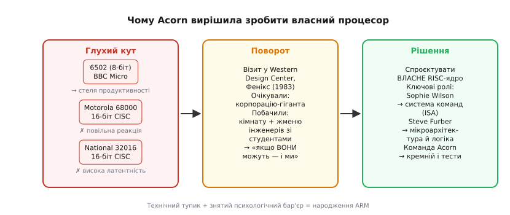
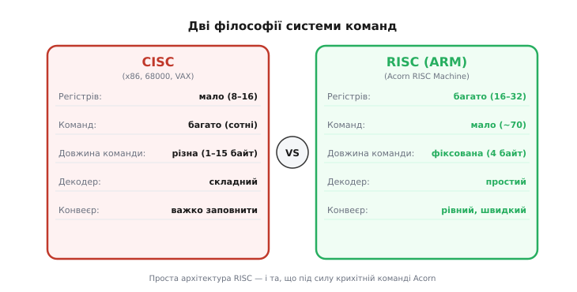
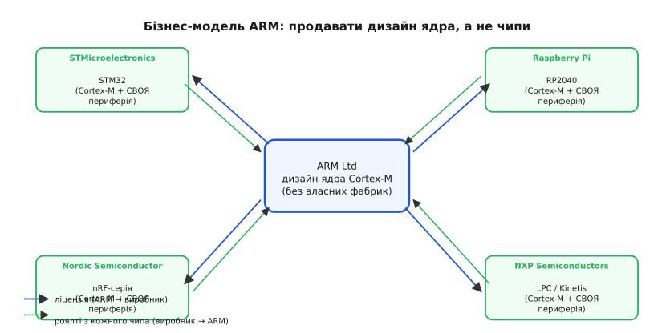

# 📜 ARM: Софі Вілсон, Стів Фербер і маленька команда Acorn

> Якщо взяти три популярні мікроконтролери — STM32, RP2040 (Pico), nRF — і звернути увагу на назви їхніх ядер, то щоразу натрапляєш на одне й те саме слово: **Cortex-M**. STM32 — Cortex-M, Pico — Cortex-M0+, nRF52 — Cortex-M4. Три чипи від трьох абсолютно різних, навіть конкурентних виробників — і всередині в кожного **те саме ліцензоване ядро**. Щороку таких ядер виходить з фабрик понад **десять мільярдів** — більше, ніж будь-яка інша процесорна архітектура на Землі. Парадокс у тому, що цю всюдисущу архітектуру придумала **не корпорація на тисячі людей**. Її задумала жменя інженерів у невеликій кембриджській фірмі, що робила домашні комп'ютери, — і двоє з них спроєктували перший процесор практично вдвох. Але це лише половина історії. ARM сьогодні — це насамперед **система ліцензування**: компанія продає не чипи, а право зробити чип, і саме ця бізнес-модель, а не тільки кремній, зробила архітектуру всюдисущою. Слідкуймо за обома лініями.

---

## Acorn, BBC Micro і британський комп'ютерний бум

На початку 1980-х Британія переживала свій мікрокомп'ютерний бум — трохи запізнілий відносно американського, але не менш щирий. Домашні ПК починали з'являтися у квартирах, клубах і школах; уряд хотів перетворити всю країну на комп'ютерно грамотну націю, і BBC — Британська телерадіомовна корпорація — отримала мандат зробити відповідну телепрограму та «благословенний» мікрокомп'ютер до неї. Проєкт назвали *The Computer Literacy Project*, і він мав охопити мільйони глядачів — від школярів до пенсіонерів, що вперше тримали мишу. Тендер на «офіційний комп'ютер BBC» виграла **Acorn Computers** — кембриджська фірма, заснована **Германом Гаузером** (*Hermann Hauser*) і **Крісом Каррі** (*Chris Curry*) приблизно 1978 року. Для молодої компанії це був зірний квиток: не просто продаж, а національний мандат.

**BBC Microcomputer** вийшов у 1981 році і швидко став стандартом у британських школах. Мільйони дітей навчилися програмувати саме на ньому — і навчилися завдяки **BBC BASIC**, витонченому інтерпретатору, що входив до комплекту. Цей BASIC написала **Софі Вілсон** (*Sophie Wilson*) — людина, яка вже на той момент була ключовим інтелектуальним мотором Acorn. Ще до BBC BASIC вона спроєктувала **Acorn System 1** і вела мікропроцесорну архітектуру фірми. Написати якісний інтерпретатор BASIC — завдання, що вимагає і глибокого розуміння архітектури процесора, і майстерного керування пам'яттю (RAM на BBC Micro було вкрай мало). Вілсон вирішила його елегантно, і мільйони британських школярів навчилися програмувати, навіть не підозрюючи, чия голова стоїть за рядками `PRINT`, `FOR` і `GOTO`. Апаратний бік BBC Micro — схему, сигнали, логіку плати — розробив **Стів Фербер** (*Steve Furber*), головний апаратний інженер Acorn. Обоє вже тоді утворювали ту вісь «система команд і програмний дизайн — залізо і мікроархітектура», що згодом народить ARM.

BBC Micro дав Acorn гроші, репутацію і — що найважливіше — величезну базу ентузіастів і школярів-програмістів, які виросли прямо на кодових рядках BASIC. Але за успіхом крився технічний тупик: машина будувалася навколо **6502** — надійного 8-бітного процесора, на якому зросло ціле покоління. На 1983 рік 6502 впирався в стелю: 64 КБ адресного простору, 8-бітна шина даних, відсутність апаратного множення — все кричало «недостатньо» для будь-якого амбітного наступника. Acorn потребувала 16- або 32-бітного процесора, і постало питання, яке змінило все: де його взяти?

---

## Чому жоден чип на ринку не підійшов

Готових кандидатів на ринку було вдосталь. Motorola 68000 мав міцну репутацію і вже крутився в Macintosh та Amiga. National Semiconductor 32016 претендував на серйозну 32-бітну перспективу. Acorn вивчила обох — і розчарувалася.

*Тупик, що породив ARM: 8-бітний 6502 уперся в стелю, а доступні 16-бітні процесори (68000, 32016) розчаровували латентністю переривань і складністю — погані для інтерактивної машини. Відкриття у WDC («процесор проєктує жменя людей») прибрало останній психологічний бар'єр: рішенням стало власне ядро.*

Проблема була не в сирій швидкодії, а в **латентності переривань** і загальній складності управління процесором. BBC Micro — це інтерактивна машина: вона постійно реагує на клавіатуру, відображає на екрані, обслуговує периферію. Для такої роботи критично, щоб процесор швидко і передбачувано відгукувався на переривання. Складні CISC-архітектури мали довгі, непередбачувані мікрокод-послідовності: момент, коли процесор реально переключиться, залежав від того, яку саме команду він виконував у ту мить. Це ускладнювало керування в реальному часі і робило 68000 і 32016 невдалими кандидатами саме для інтерактивного та вбудованого застосування — попри всю їхню потужність.

Герман Гаузер прийняв рішення, яке з боку виглядало як безумство: якщо нічого на ринку не годиться — **спроєктувати власний процесор**. Для невеличкої фірми, що робить домашні ПК, у 1983 році це звучало нереально: процесори тоді проєктували лише гіганти — Intel, Motorola, — з командами по кілька сотень інженерів і мільйонами доларів бюджету.

Тут стався момент, що виявився поворотним. Вілсон і Фербер поїхали до Сполучених Штатів — до **Western Design Center** (*WDC*) у Феніксі, Арізона. WDC — невелика фірма, заснована Біллом Менчем (*Bill Mensch*), колишнім розробником оригінального 6502 у MOS Technology, яка займалася подальшим вдосконаленням сімейства 6502 і CMOS-версіями цього процесора. Приїхавши, Вілсон і Фербер очікували побачити серйозне технологічне підприємство — ну бо ж процесори роблять гіганти, Intel, Motorola, — із численним штатом і дорогими EDA-робочими станціями. Натомість знайшли скромний офіс, де чіп проєктувала жменя людей із кількома студентами, на інструментах цілком доступного класу. Не напівпровідниковий завод — просто команда. Враження було миттєвим і простим: «якщо ВОНИ можуть — можемо й ми». Це не привід применшувати WDC — там справді робили якісні чипи — але для Вілсон і Фербера це була відповідь на питання масштабу. Останній психологічний бар'єр упав.

---

## Ідея RISC: менше команд — більше швидкості

Вирішивши проєктувати власний процесор, команда постала перед питанням: **яку архітектуру обрати?** На той час у світі процесорів панувала CISC-філософія — *Complex Instruction Set Computer*, складний набір команд. Ідея CISC проста й на перший погляд приваблива: дати процесору «розумні», складні команди, щоб одна інструкція виконувала максимум роботи. VAX, x86, 68000 — усі вони мали сотні команд різної довжини; деякі виконували цілі операції на зразок «скопіювати рядок» або «пошукати підрядок».

Але свіжі академічні дослідження 1980-х ставили CISC під сумнів. Дейвід Паттерсон (*David Patterson*) у Берклі та група в Стенфорді (проєкт MIPS) показали протилежне: якщо взяти небагато **простих** команд **однакової довжини**, кожна з яких виконується за один такт, то загальна швидкодія виявляється **вищою** — бо конвеєр процесора заповнюється рівно і передбачувано, без довгих мікрокод-пауз. Паттерсон ввів термін **RISC** — *Reduced Instruction Set Computer*, скорочений набір команд. Власне, скорочений — не зовсім точне слово: правильніше «регулярний» або «однорідний», але абревіатура RISC прижилася.

*Дві дороги. CISC: небагато регістрів, багато складних команд різної довжини — кожна «вміє багато», але декодувати й виконувати важко. RISC (шлях ARM): багато регістрів, мало простих команд однакової довжини — кожна тривіальна, зате конвеєр годується рівно і швидко. Проста архітектура виявилася й тією, що під силу крихітній команді.*

Для Acorn RISC ліг як рукавичка з двох причин одночасно. Перша — **елегантність**: простий, регулярний набір команд краще вирішував проблему переривань. Якщо кожна інструкція має фіксовану довжину й виконується рівно один такт, час реакції на переривання стає детермінованим: ти **знаєш**, скільки максимум чекати, незалежно від того, що виконує процесор у ту мить. Для CISC із мікрокодними послідовностями різної довжини такої гарантії немає. Друга — **реальність**: складний CISC зі сотнями команд, багаторівневим мікрокодом і верифікацією кожного кутового випадку вимагав великої команди для проєктування і ще більшої для перевірки; простий RISC із невеликим набором однорідних інструкцій — ні. Маленька команда Acorn обрала RISC і тому, що він кращий, і тому, що він їм **під силу**. Краса ідеї і практична необхідність збіглися.

Тут найважливіша точка в цій оповіді, де треба бути чесними про те, **хто що зробив**. **Систему команд ARM** — те, які інструкції є, як вони кодуються у 32-бітне слово, яка логіка їхнього виконання — **спроєктувала Софі Вілсон**. Саме вона розробила те, що зробило ARM-ISA впізнаваною: елегантну ортогональну структуру, де один і той самий формат поля регістра застосовується скрізь, і, зокрема, фірмову рису — **умовне виконання** (*predication*): майже кожна ARM-інструкція несе 4-бітний код умови і може або виконатися, або перетворитися на NOP залежно від прапорців. Це зменшувало кількість явних стрибків і живило конвеєр рівніше — особливо цінна риса для коротких умовних блоків типу `if`. **Мікроархітектуру** — як цю ISA реалізувати в транзисторах, яка схема конвеєра, яка логіка керування виконанням і читанням пам'яті — **розробив Стів Фербер**. Ті самі ролі, що ми бачимо в кожній великій процесорній історії: «придумати набір команд» і «змусити це працювати в кремнії» — окремі, важкі й однаково необхідні внески.

**ARM** у першому своєму імені розшифровувалося як *Acorn RISC Machine* — так і задумали. Пізніше, коли ARM став окремою компанією, «A» переосмислили як *Advanced*. Але в 1983–85 роках це було ядро Acorn, для машин Acorn, написане командою Acorn.

---

## Перший чип, що працював без живлення

Команда, що проєктувала ARM, була крихітною — за різними свідченнями, кілька інженерів разом із Вілсон і Фербером. Великих EDA-інструментів не було: частину симуляції писали самі — і, за іронією, на тому самому BBC BASIC, чий інтерпретатор написала Вілсон роками раніше. Кільце замкнулося.

**26 квітня 1985 року** перший кремнієвий зразок **ARM1** повернувся з фабрики **VLSI Technology**. Його вставили в систему — і він запрацював майже одразу. Для першого кремнію («first silicon») це рідкість: зазвичай першу версію доводиться довго відлагоджувати через мікроскопічні помилки в масках або логіці. Тут — майже нічого. Перша програма, яку він виконав, вивела «Hello World». Команда зітхнула з полегшенням. Уся симуляція, виконана на BBC BASIC, не збрехала.

Але під час вимірювань Вілсон і Фербер помітили дещо дивне. Амперметр не показував нічого. Зовсім нічого на лінії живлення VCC. Подивилися на плату — і побачили: **основний провід живлення до чипа не підключений**. Хтось у поспіху з'єднання забув про нього. А чіп — **працював**. Виконував код, читав з пам'яті, виводив результат. Виявилося, що ARM1 живився виключно крихітним **струмом витоку** (*leakage current*) з ліній вводу-виводу — тих самих сигнальних виводів, через які підключалися дані й адреси. Цей паразитний струм становив буквально десятки міліват. Цього вистачало, щоб процесор виконував програму.

Це сталося не випадково — і не магія. Фербер проєктував схему з екстремальною ощадливістю від самого початку: Acorn не мала грошей на дорогий корпус-теплорозсіювач і прагнула мінімального споживання, щоб обійтися простим пластиком. Кожен вузол схеми проєктувався так, щоб витрачати якнайменше. Результат вийшов разючим навіть для самих авторів — навіть вони не очікували, що чіп увімкнеться від «нічого».

> 🔧 **Навіщо це.** Та сама ощадливість, що змусила ARM1 ожити на струмі витоку, — причина, чому ти взагалі тримаєш у руках живлені від батарейки пристрої на Cortex-M. [nRF-клас](book:programming/nrf-radio-mcu), де головне — роки роботи від CR2032 і одиниці мікроампер у режимі сну, — це **пряме продовження** рішень, ухвалених у Кембриджі 1985 року заради дешевого пластикового корпусу. Низьке споживання — не пізніше «покращення» ARM, а її **вроджена риса**.

Коли роки по тому телефони й КПК відчайдушно шукали процесор, що вміщується у бюджет батарейки — **ARM вже була там**, бо вже вміла жити на голодному пайку з дня народження. Уся подальша перемога архітектури у мобільному світі, а за ним — у вбудованих системах, сенсорних вузлах і носимій електроніці, виросла з цієї першої крихкої необхідності: маленька кембриджська фірма не могла дозволити собі гарячий чип. Бідність, як виявилося, вчить ощадливості, а ощадливість — це те, за що весь світ потім платив ліцензійні роялті.

---

## Як ядро стало бізнесом: народження ARM Ltd і модель ліцензій

ARM1 і його наступники ARM2, ARM3 спочатку були внутрішнім процесором Acorn — для машин серії Archimedes. Але 1989 року з'явився новий гравець із зовсім іншими апетитами. **Apple** шукала процесор для кишенькового пристрою-органайзера, що згодом стане **Newton MessagePad**. Cortex-M тоді ще не існував — існував ARM6, і він привернув увагу. Проблема була в тому, що Acorn не могла сама потягнути розвиток ядра для зовнішніх ліцензіатів — у компанії не вистачало ні людей, ні ресурсу.

1990 року народилася нова структура: **Advanced RISC Machines Ltd** (ARM Ltd) — спільне підприємство **Acorn**, **Apple** і **VLSI Technology**. Акронім ARM переосмислили: тепер «А» означало *Advanced*, а не *Acorn*. Запустилася компанія в переобладнаному амбарі під Кембриджем — близько дюжини інженерів. Знову мализна. Знову Кембридж.

*Чому одне ядро всюди. ARM проєктує ядро (Cortex-M) і **ліцензує** його; різні, навіть конкурентні виробники (STMicroelectronics, Raspberry Pi, Nordic, NXP…) вбудовують те саме ядро у власні чипи зі своєю периферією і платять ARM роялті з кожного. Виробник дістає перевірене ядро з готовими інструментами; ARM дістає дохід, не маючи жодної фабрики.*

Але головне — не юридична форма, а **бізнес-ідея**, що народилася разом із нею. ARM Ltd вирішила: **ми самі не робитимемо і не продаватимемо чипів**. Натомість ми проєктуємо ядро і **ліцензуємо дизайн** іншим виробникам: вони вбудовують ядро у власні чипи, додають свою периферію — і платять ARM роялті з кожного виробленого чипа. «Продавати креслення, а не цеглу» — так коротко описують цю модель.

Дістати процесорне ядро можна трьома способами — спроєктувати самому, ліцензувати готове або взяти відкрите (як RISC-V). ARM — це саме ліцензований варіант, тільки платний і закритий за специфікацією ISA. Різниця в тому, що ARM-ядра мають **єдину сертифіковану ISA** — гарантію двійкової сумісності, яку RISC-V забезпечує тільки через дисципліну спільноти й набір профілів. Двійкова сумісність — важлива річ: бінарний код, скомпільований для Cortex-M4, запуститься на будь-якому Cortex-M4, чий би виробник не написав свою назву на корпусі.

Чому модель спрацювала? Бо вона вигідна **обом сторонам**. Виробник чипа отримує **перевірене ядро** з готовим компілятором (GCC й LLVM давно підтримують ARM), готовою екосистемою бібліотек, готовою документацією — і може сконцентруватися на своїй унікальній периферії: таймерах, USB, радіомодулях, DSP-блоках. ARM отримує дохід від кожного виробленого чипа, не маючи жодної фабрики й жодних витрат на виробництво. Маховик закрутився: що більше ліцензіатів — то більше розробників вивчають ARM-асемблер і ARM-toolchain → то більше проєктів і бібліотек → то привабливіше наступному ліцензіату приєднатися до загальної екосистеми. Мережеві ефекти зробили з архітектури монополіста не силою, а зручністю. Саме тому сьогодні сотні компаній роблять ARM-чипи — і саме тому Cortex-M є і в STM32, і в RP2040, і в nRF, хоч між їхніми виробниками немає нічого спільного, окрім підписаної ліцензійної угоди з ARM Ltd.

---

## Чому це історія багатьох рук, а не одного імені

Будь-яка успішна технологія, що стає всюдисущою, ризикує в переказі перетворитися на «одного генія» або на «бренд». ARM тут не виняток: скільки разів ви читали «процесор від ARM», ніби ARM — це завод? Або «ARM придумав Фербер»? Або, з протилежного боку, «система команд взялася нізвідки»? Жодна з цих спрощених версій не є чесною — і всі вони ховають реальний, захопливий розподіл праці.

**Систему команд ARM** — основу, якою послуговуються мільярди пристроїв, — **спроєктувала Софі Вілсон**. Вона написала специфікацію ISA і перший асемблер. Масштаб її технічного внеску важко переоцінити: кожен рядок асемблера для Cortex-M, кожна інструкція `MOV`, `LDR`, `BL`, `CMP` — архітектурний нащадок рішень, ухвалених нею в 1983–85 роках. Це не «участь» і не «внесок у команді» у загальних словах — це авторство набору команд, на якому стоїть ціла процесорна лінія. Якби не ця робота, «кремній Фербера» виконував би щось зовсім інше.

**Мікроархітектуру й логіку процесора** — те, як ця ISA реалізована в транзисторах, який конвеєр, яка схема керування, як організована пам'ять команд — **розробив Стів Фербер**. Саме він відповідав за те, щоб елегантна система команд стала реальним кремнієм, що фізично виконує інструкції, і щоб вся схема вмістилася в бюджет живлення, якого вимагала Acorn. Фізичний результат — ARM1 у 1985 — це його робота.

**Герман Гаузер** прийняв керівне рішення — зробити власний процесор — і знайшов ресурс, щоб це взагалі відбулося. Без цього рішення і без внутрішнього фінансування проєкту від Acorn розмови про ARM не існувало б узагалі. Рішення «дозволити спробувати» теж коштує чогось — особливо в крихітній комерційній фірмі.

І навколо цих трьох — **ціла маленька команда** Acorn, що довела ідею до робочого кремнію: ті, хто писав симулятори, верифікував логіку, проєктував тестові стенди, займався компілятором і налагодженням першої плати. Їхні імена рідко з'являються в популярних оглядах — бо оглядам потрібні два-три персонажі, — але без них ARM1 26 квітня 1985 року не запрацював би.

Є тут і окрема пастка, на яку варто вказати прямо: у популярних переказах іноді зникає саме **ім'я Вілсон** — через те що вона спроєктувала ISA (програмне, «невидиме»), а Фербер — кремній (фізичне, «помацати»). Але ISA — це і є архітектура в прямому сенсі слова: те, що програмісти бачать і на що пишуть код. Те, що видно програмісту, не менш реальне, ніж те, що видно під мікроскопом на кристалі. Її внесок називати слід прямо — і ми саме це й зробили.

Це той самий урок, що повторюється в кожній великій історії заліза — від 8051 до машини фон Неймана: архітектура завжди праця команди, а велика ідея має багато батьків. Придумати ISA, спроєктувати мікроархітектуру, довести до кремнію, зібрати екосистему — **різні** внески, і всі потрібні. Велика ідея майже ніколи не належить одній людині — і чесна розповідь це визнає, навіть якщо це незручно для красивих заголовків.

---

## Куди веде ця історія: ядро, з якого зроблено цілий пейзаж

Складімо весь ланцюг докупи. BBC Micro впирався в стелю → Acorn не знайшла готового процесора на ринку → візит у WDC зняв психологічний бар'єр → Вілсон спроєктувала ISA, Фербер — мікроархітектуру → ARM1 у квітні 1985 запрацював на струмі витоку → Apple і Acorn заснували ARM Ltd → ліцензійна модель розіслала одне ядро по сотнях виробників. Результат: ARM-ядра тиражуються більше за будь-яку іншу архітектуру, а **Cortex-M** став спільним знаменником цілого пейзажу мікроконтролерів.

Саме тому одна історія розгалужується на безліч сучасних чипів. Сама [лінійка Cortex-M](book:programming/cortex-m) — як M0, M3, M4 і M7 розрізняються між собою при спільній ISA. [STM32](book:programming/stm32) — «доросла» периферія навколо Cortex-M від STMicroelectronics. [RP2040 (Raspberry Pi Pico)](book:programming/rp2040-pio) — те саме ядро, але з власною оригінальною ідеєю PIO. [nRF-клас](book:programming/nrf-radio-mcu) — там вроджена ощадливість ARM сяє яскравіше за все. А [AVR](book:programming/avr) з його норвезькою історією — 8-бітна альтернатива, де ARM немає зовсім.

Тож коли відкриваєш datasheet STM32, Pico чи nRF і читаєш «Cortex-M4 core» — за цими двома словами стоять кілька інженерів у Кембриджі 1983–85 років, один процесор, що ожив на струмі витоку, і бізнес-модель, яка замість того щоб продавати цеглу, продала планеті **рецепт, як її виготовити**. Це і є «пейзаж»: багато облич однієї спільної ідеї.
