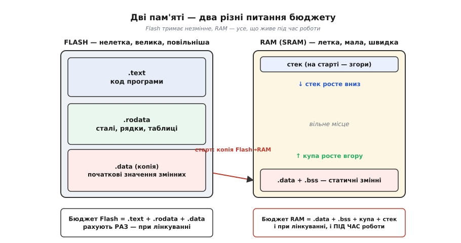
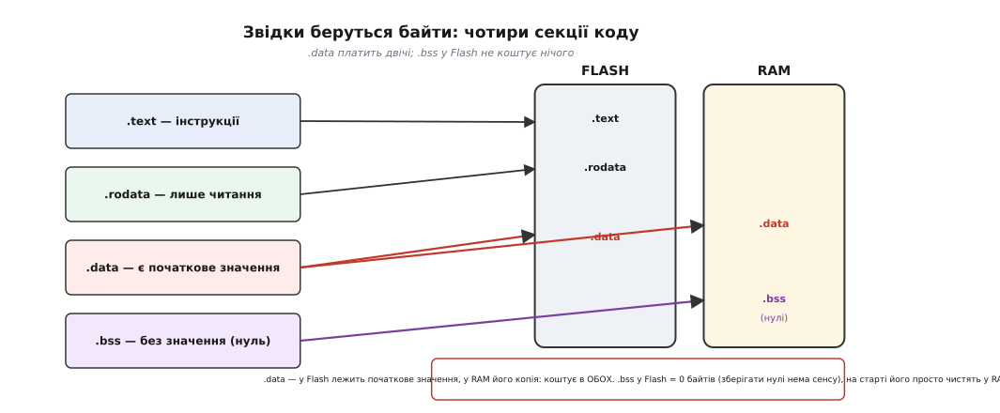
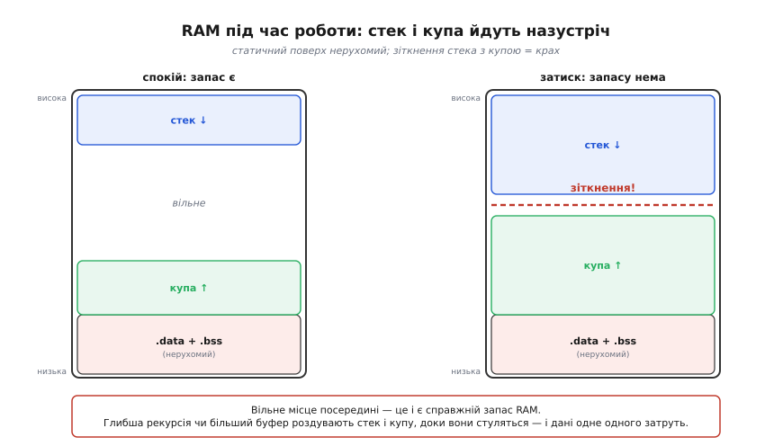
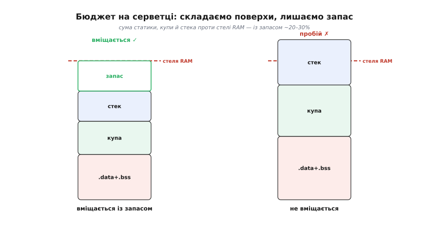

# Бюджет пам'яті мікроконтролера

Вибираючи мікроконтролер, ми вже навчилися читати головні числа з його даташита — ядро, частоту, периферію. Лишилися два скромні рядки, на які новачок дивиться мигцем, а досвідчений — найдовше: «512 КБ Flash, 96 КБ RAM». Здається, це просто «скільки місця». Та насправді за цими двома числами ховаються **два різні бюджети**, які закінчуються по-різному й мстяться по-різному. Один пробивається ще на столі, коли програма не лінкується; другий — у полі, коли пристрій місяцями працював, а тоді раптом перезавантажився. Розібратися, **що** заповнює кожне з цих чисел і **як** заздалегідь порахувати, що влізеш, — і означає скласти бюджет пам'яті. Це та навичка, без якої вибір МК лишається ворожінням.

Почнімо з того, **чому** пам'ятей дві й чому їх не можна звести до однієї.

## Дві пам'яті, два питання

Мікроконтролер несе на борту два геть різні роди пам'яті, [і це не примха, а наслідок фізики](book:programming/flash-vs-ram): один тип не буває водночас і нелетким, і швидким, і дешевим. **Flash** — нелетка: вимкнув живлення, а вона пам'ятає. Туди зашивають усе, що мусить пережити вимкнення, — насамперед саму програму. Вона велика й дешева на біт, але повільна на запис і має обмежений ресурс перезаписів. **RAM** (точніше [SRAM](root:embedded/memory-cell-physics) — статична оперативна пам'ять) — летка: при вимкненні забуває все. Зате вона блискавична й витримує мільярди перезаписів, тож саме в ній живуть усі дані, що змінюються під час роботи. Дешевша Flash зберігає, дорожча RAM працює — звідси й розподіл праці.

> 🔧 **Навіщо це.** Плутати ці два бюджети — найчастіша помилка-початківця. «У мене 512 КБ, масив на 200 КБ влізе» — влізе у **Flash**, якщо це стала таблиця; і **не** влізе в 96 КБ RAM, якщо це робочий буфер. Перше питання над кожним великим масивом: він **незмінний** (тоді його дім — Flash) чи **робочий** (тоді RAM)? Відповідь визначає, з якого з двох бюджетів він з'їсть байти.

З двох родів пам'яті випливають і два різні **питання**. Бюджет Flash рахують **раз** — під час лінкування: компонувальник (*linker*) складає всі шматки коду й сталих в одну прошивку, і її розмір або вліз у Flash, або ні. Якщо ні — збірка просто не вдасться, ти побачиш помилку на екрані ще до того, як щось зашив. Це чесна, рання, видима межа. Бюджет RAM підступніший: частину його теж видно при лінкуванні (скільки місця заберуть глобальні змінні), але **головна** частина народжується лише **під час роботи** — стек і купа ростуть і стискаються залежно від того, як глибоко зайшла програма й скільки пам'яті попросила. Тому переповнення RAM лінкер здебільшого **не ловить**: прошивка збереться, зашиється, попрацює — і впаде, коли стек доросте до чужих даних.


*Flash і RAM — окремі простори з окремими бюджетами. У Flash осідає все незмінне (код, сталі, початкові значення змінних); його розмір фіксується **раз**, при лінкуванні. У RAM живуть статичні змінні, купа й стек; її бюджет частково видно при лінкуванні, але стек і купа дорощують його **вже під час роботи** — тому переповнення RAM лінкер найчастіше не помічає.*

Щоб скласти обидва бюджети, треба знати, з чого вони складаються. А складаються вони з **секцій** — кількох іменованих ділянок, на які компілятор розкладає все, що є у твоїй програмі.

## Звідки беруться байти: чотири секції

Коли компілятор перетворює код на прошивку, він не валить усе в купу, а розкладає по [секціях](book:programming/memory-map) (*sections*) за одним принципом: **що з цим робитимуть під час роботи?** Чи це незмінне — чи буде змінюватися; чи має початкове значення — чи ні. Відповіді й визначають, у яку пам'ять секція потрапить і скільки в кожній забере. Секцій багато, та чотири головні несуть майже весь бюджет.

**`.text`** — це сам **код**, машинні інструкції. Він не змінюється під час роботи, отже, його дім — Flash; процесор виконує інструкції прямо звідти, нічого нікуди не копіюючи. Більша програма — більший `.text`.

**`.rodata`** (англ. *read-only data* — дані лише для читання) — **сталі**: усе, позначене `const`, рядки в лапках, незмінні таблиці. Їх теж ніхто не переписує, тож вони так само лишаються у Flash, і копія в RAM їм не потрібна. Саме сюди варто складати великі довідкові таблиці — тоді вони не з'їдять дефіцитну RAM.

**`.data`** — **змінні з початковим значенням**, як-от `int лічильник = 42;`. Тут виникає тонкість, через яку ця секція коштує **двічі**. Змінну можна міняти, тож жити вона мусить у RAM. Але її початкове значення (`42`) треба десь зберегти на час вимкнення — а нелетка лише Flash. Тому число `42` лежить у **Flash**, а на старті програми спеціальний код **копіює** його звідти в RAM, у комірку змінної. Виходить, кожен байт `.data` займає місце і у Flash (зберегти значення), і в RAM (працювати з ним).

**`.bss`** — **змінні без початкового значення**: `uint8_t буфер[1024];` без жодного `=`. За стандартом мови такі змінні стартують нулями. І ось ключове міркування: щоб отримати тисячу нулів, не треба зберігати тисячу нулів у Flash — досить на старті **обнулити** ділянку RAM. Тому `.bss` коштує **лише RAM**, а у Flash не займає нічого. Назва дивна — [спадок асемблера 1950-х](root:embedded/memory-budget-mcu/hist-bss-name.md); її варто знати, бо саме рядок «.bss» у звітах про розмір показує, скільки RAM з'їли твої великі буфери.


*Кожен різновид даних із коду осідає у своїй пам'яті за простим правилом. Код (`.text`) і сталі (`.rodata`) незмінні — лишаються у Flash. Ініціалізована змінна (`.data`) платить двічі: значення у Flash, робоча копія в RAM. Неініціалізований буфер (`.bss`) у Flash не коштує нічого — на старті його просто чистять у RAM.*

Це копіювання `.data` й обнулення `.bss` — не магія, а кілька рядків, що відпрацьовують **до** твоєї `main()`. Їх ставить так званий стартовий код (*startup code*): щойно процесор скинувся, він першим переносить `.data` з Flash у RAM, обнуляє `.bss`, налаштовує стек — і лише тоді віддає керування твоїй програмі. Тому коли ти вперше читаєш глобальну змінну, вона вже має правильне значення: про це подбали ще до `main()`.

Тепер видно склад обох бюджетів. **У Flash** іде `.text + .rodata + .data` (плюс дрібніші службові секції). **У RAM** іде `.data + .bss` — і це лише **статична** частина, та, що видно при лінкуванні. А над нею в RAM живуть ще двоє, яких лінкер порахувати не може.

## RAM під час роботи: стек і купа йдуть назустріч

Статичні змінні (`.data + .bss`) — це нерухомий поверх RAM: їхній розмір відомий наперед і не міняється. Та програма під час роботи потребує пам'яті, яку не оголосиш глобально, бо її обсяг залежить від того, що відбувається. Така пам'ять береться з двох джерел, і обидва ростуть **динамічно**.

Перше — [**стек**](book:programming/stack-lifo) (*stack* — стос): пам'ять під локальні змінні функцій, їхні аргументи й адреси повернення. Виклик функції **кладе** на стек новий шар (її локальні дані); вихід із функції — **знімає** його. Що глибше вкладені виклики (а надто рекурсія — функція, що кличе саму себе), то вищий стек у цю мить. Він то росте, то спадає за самим перебігом програми.

Друге — [**купа**](book:programming/heap-dynamic-memory) (*heap*): пам'ять, яку програма просить **явно**, через `malloc()` чи `new`, коли наперед не знає, скільки знадобиться. Попросив блок — купа віддала шмат; звільнив — повернула. Її розмір у кожну мить залежить від того, скільки всього зараз виділено й не звільнено.

І ось влаштування, через яке RAM небезпечніша за Flash. Ці двоє ділять **одну** вільну ділянку, але ростуть **назустріч**: купа — від нижнього краю вгору, стек — від верхнього краю вниз. [На ядрах ARM Cortex-M стек «спадний»](book:programming/stack-lifo): процесор стартує з вершини RAM і з кожним викликом зсувається до нижчих адрес (це усталений факт, прошитий у самому ядрі — найперше слово прошивки задає початкову вершину стека). А між стеком, що сповзає вниз, і купою, що лізе вгору, лежить **вільне місце** — і це і є справжній запас RAM. Доки між ними є проміжок — усе гаразд. Зійшлися — катастрофа: [стек починає писати в чужі дані (*stack overflow* — переповнення стека)](book:programming/stack-overflow), і програма псує сама себе.


*Статичний поверх (`.data + .bss`) знизу нерухомий. Над ним купа росте вгору, а згори стек спадає вниз; між ними — вільне місце, справжній запас RAM. Ліворуч запас є. Праворуч глибша рекурсія роздула стек, більші буфери — купу, проміжок зник — і вони почали затирати дані одне одного. Це і є переповнення стека.*

> 🔧 **Навіщо це.** Чому це найпідступніша помилка вбудованих систем: переповнення стека не дає чесної помилки. Стек тихо заповзає на купу чи на глобальні змінні й **псує** їх — і пристрій падає не там, де винен, а деінде й пізніше, ніби «з власної волі». Тому стек не можна лишати «як вийде»: його найбільшу глибину треба **оцінити** й закласти запас. Дві найчастіші причини зриву — необмежена рекурсія та великі локальні масиви (`uint8_t буфер[4096];` усередині функції з'їдає 4 КБ стека миттєво). Перше правило безпеки RAM: великі буфери не клади на стек — роби їх статичними або бери з купи.

Якщо програма [розкладена на задачі під керуванням RTOS](book:programming/freertos), картина та сама, лише множиться: **кожна** задача дістає **власний** стек. [Як ми бачили, розбираючи межі super-loop](root:embedded/super-loop-limits), задачі — це спосіб дати кожній справі бути окремою простою програмою; ціна — пам'ять, бо в кожної свій стос. Десять задач — десять окремих стеків, кожен зі своїм запасом, і всі вони відкушують від тієї самої RAM. Тому в системі із задачами бюджет стека рахують не одним числом, а сумою по всіх задачах.

Тепер у нас є всі складники. Лишилося навчитися їх **зважувати** — не на око, а за числами, які видає сам інструментарій.

## Як порахувати: звіт про розмір і файл-карта

Найперший інструмент — звіт про розмір прошивки. Команда `size` (у наборі для ARM це `arm-none-eabi-size`) друкує підсумок по секціях:

```
   text    data     bss     dec      hex  filename
 248116    2104   84320  334540    51acc  firmware.elf
```

Прочитаймо це під кутом наших двох бюджетів. **Flash** з'їдає `text + data` = 248116 + 2104 ≈ 244 КБ (код і сталі плюс копії початкових значень). **Статична RAM** — це `data + bss` = 2104 + 84320 ≈ 84 КБ (робочі копії плюс обнулені буфери). Стовпчик `dec` — просто сума трьох чисел; він зручний, щоб одним поглядом стежити, чи росте прошивка від збірки до збірки, але двох бюджетів **не розділяє**, тож спиратися варто саме на `text`/`data`/`bss` окремо.

**Приклад (чи влізе у чип 512 КБ / 96 КБ).** Візьмімо звіт вище й порахуймо обидва бюджети для типового чипа.

```
Flash:  text + data = 248116 + 2104  = 250220 Б ≈ 244 КБ
        стеля Flash = 512 КБ
        вільно у Flash ≈ 262 КБ  → удосталь

RAM:    data + bss  = 2104 + 84320  = 86424 Б ≈ 84 КБ  (лише статика!)
        стеля RAM   = 96 КБ
        лишилось на стек + купу ≈ 12 КБ
```

Висновок різкий: Flash тут не проблема — половина вільна. А от RAM **майже вичерпана статикою**: 84 з 96 КБ зайнято ще до того, як викликано бодай одну функцію. На стек і купу лишилося ледь 12 КБ — і саме сюди дивись найпильніше, бо ці 12 КБ мають вмістити всю динаміку, та ще й із запасом. Тут найчастіше й живе помилка: `size` показав «влізло», прошивка зашилася — а вона за крок до зриву, бо стек із купою не мають де розміститися.

Коли треба зрозуміти **чому** секція така велика, є докладніший інструмент — **файл-карта** (*map file*), яку лінкер виводить на прохання (прапорець `-Wl,-Map=firmware.map`). Це повний перелік: кожна змінна й функція, її адреса й точний розмір. Карта відповідає на питання «хто з'їв пам'ять?»: знайшов у ній найбільші записи в `.bss` — і ось вони, твої найтовщі буфери, видно поіменно. Без карти доводиться вгадувати; з нею оптимізація стає точковою — ріжеш саме те, що справді важить.

> 🔧 **Навіщо це.** Звіт `size` варто читати після **кожної** збірки, а не лише коли вже «не влазить». Він — рання діагностика: помітив, що `bss` стрибнув на 20 КБ після невинної правки, — мабуть, десь з'явився великий статичний буфер, про який ти забув. Дешевше спіймати це зараз, ніж за місяць ловити загадковий збій у полі. А файл-карта — твій інструмент, коли RAM таки скінчилася: вона показує конкретних винуватців, тож ти ріжеш найбільше, а не все підряд.

## Найгірший випадок, а не середній

Залишилося найтонше — стек. Його `size` **не показує**: компілятор не знає наперед, як глибоко зайдуть виклики під час роботи. А оцінювати треба не середню глибину, а **найгіршу** — той рідкісний збіг, коли викликалися найглибші гілки одночасно з найбільшими локальними масивами. Бо пам'яті має вистачити саме в цей пік; «здебільшого вистачало» означає лиш те, що збій станеться рідко й невчасно.

Прямий спосіб виміряти пік — **позначити** стек і подивитися, до якої межі його витоптали. Перед запуском усю стекову ділянку заповнюють відомим візерунком (часто `0xA5`); програма працює, стек то росте, то спадає, лишаючи у своєму сліді справжні дані; а тоді дивляться, **доки** візерунок ще цілий. Межа недоторканого `0xA5` — це і є найглибша точка, якої стек сягав за час роботи: усе нижче від неї він уже перезаписав. Різниця між цією межею і дном стека — твій реальний запас. Це настільки корисний прийом, що в RTOS він уже вбудований: [окрема вставка показує робочий код, як зробити це і вручну, і засобами FreeRTOS](root:embedded/memory-budget-mcu/proj-stack-watermark.md).

З цього виміру й народжується правило бюджету. Виміряний пік — ще не вся правда: завтрашня правка додасть рівень викликів, рідкісна гілка виявиться глибшою за бачене, переривання прийде в найгіршу мить. Тому до виміряного піка **закладають запас** — як орієнтир, тримати зайнятим не більш ніж ~70–80% доступної RAM, а решту лишати порожньою. Цей проміжок — не марнотратство, а та подушка, що відділяє «працює надійно» від «падає раз на тиждень із незрозумілої причини».


*Бюджет RAM на серветці: склади поверхи — статику (`.data + .bss`), очікувану купу й найгірший стек — і порівняй зі стелею чипа. Ліворуч сума лишає запас під стелею: вміщається надійно. Праворуч ті самі поверхи, та кожен трохи більший, — і вони пробивають стелю. Запас згори (~20–30%) — не зайвина, а подушка проти рідкісного найгіршого випадку.*

Складімо все в одну прикидку, яку варто робити **до** замовлення чипа, а не після.

**Приклад (бюджет RAM на серветці).** Пристрій із RTOS: три задачі, кадровий буфер дисплея, трохи динаміки. Чи вистачить 96 КБ RAM?

```
статика без кадру (.data + .bss)  ≈ 30 КБ   (зі звіту size)
кадровий буфер (теж у .bss)       ≈ 20 КБ   (виділили окремим рядком навмисно)
стеки задач: 3 × 4 КБ             = 12 КБ
купа (пік виділень)               ≈ 10 КБ
                                   ───────
сума                              ≈ 72 КБ
стеля RAM                         = 96 КБ
запас                            ≈ 24 КБ  (25%)  → вміщається надійно
```

Кадровий буфер навмисно винесено окремим рядком, хоч він і лежить у `.bss`: на серветці корисно бачити найтовстіший буфер сам по собі, а не розчиненим у загальній статиці. Головне — не порахувати його **двічі**: число «статика без кадру» вже без нього.

Двадцять чотири кілобайти запасу — це здоровий бюджет: є куди рости й є подушка на найгірший випадок. Якби сума вийшла 92 КБ, формально воно б «влізло», та запасу лишилося б 4% — і перша ж глибша гілка чи трохи більший кадр пробили б стелю. Саме тому бюджет складають **із запасом наперед**, а не підганяють упритул: байт, заощаджений на подушці, обертається годинами полювання на плавучий збій.

## Що з усього цього випливає

Два числа з даташита виявилися двома різними світами. **Flash** — чесна рання межа: бюджет = `text + data`, рахується раз при лінкуванні, не вліз — збірка одразу скаже. **RAM** — підступна: її статичну частину (`data + bss`) видно при лінкуванні, але стек і купа дорощують її **під час роботи**, ростучи назустріч одне одному, і їхнє зіткнення лінкер не ловить — воно стає тихим збоєм у полі. Тому RAM рахують суворіше: береш статику зі звіту `size`, додаєш найгірший стек (вимірюють візерунком) і пік купи, лишаєш ~20–30% порожніми — і лише тоді кажеш «вліземо».

Ця прикидка — пряме продовження [вибору МК](root:embedded/mcu-selection): два рядки про пам'ять перестають бути загадкою й стають числами, які можна порівняти з потребами проєкту ще до того, як щось паяти. А коли бюджету не вистачає й видавити з внутрішньої пам'яті вже нічого — [це окрема розмова про те, коли й куди виносити пам'ять назовні](root:embedded/when-memory-runs-out). Тут же ми навчилися головного: дивитися на пам'ять не як на одне «скільки місця», а як на два бюджети з різними правилами — і чесно зводити кожен із запасом.
