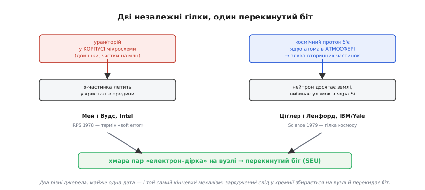
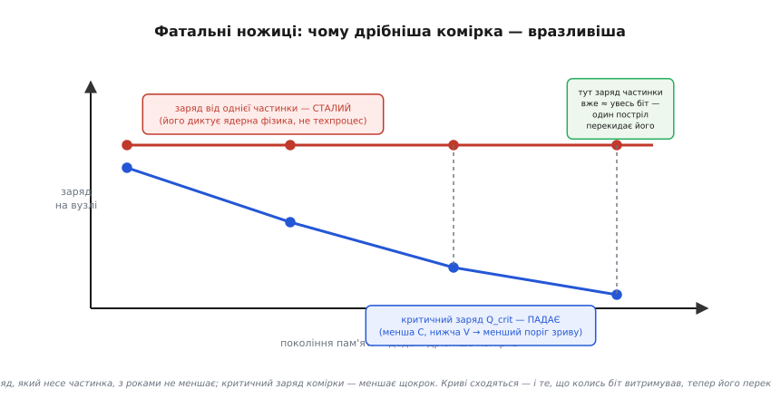

# 📜 Як пам'ять почала «брехати»: історія м'яких збоїв (Intel, 1977–79)

Ми щойно розібрали одиничний збій (SEU) як фізику: заряджена частинка лишає в кремнії слід із вільних зарядів, той збирається на вузлі комірки й перекидає біт. Формула проста, механізм зрозумілий. Але коли з цим уперше зіткнулися живі інженери — наприкінці 1970-х, на заводі Intel, — вони не мали ні формули, ні механізму. Вони мали лише **збожеволілу пам'ять**: мікросхеми, які то помиляються, то ні, без жодної закономірності, і від яких відскакує будь-яка звична діагностика. Історія того, як цю загадку розкрутили до самого дна — до атомів урану в керамічній кришці корпусу й до частинок, що прилетіли з-за меж Сонячної системи, — одна з найкрасивіших детективних історій у всій електроніці. І вона пояснює, **чому** в надійній пам'яті сьогодні стоїть апаратне виправлення помилок, краще за будь-яке означення.

Почнімо з того, чому ця напасть узагалі здавалася неможливою.

## Баг, якого не може бути

Уявіть себе інженером-надійником у 1977 році. Ваша робота — ловити дефекти. І дефекти, які ви звикли ловити, поводяться **чесно**: биту доріжку видно під мікроскопом; закорочений транзистор гріється; крапля бруду під кристалом псує той самий біт **щоразу**. Головна властивість справжнього дефекту — він **відтворюваний**. Зламане лишається зламаним. На цьому стоїть уся діагностика: знайшов умову, за якої чип падає, — знайшов і причину.

А тепер до вас повертають партію свіжих 16-кілобітних DRAM — наприклад, з родини Intel 2107, тодішнього робочого коня динамічної пам'яті, — зі скаргою: **зрідка перекидається один-єдиний біт**. Ви ставите чип на стенд, ганяєте тести годинами — усе бездоганно. Віддаєте назад — за тиждень та сама скарга. Біт, що збився, під наступним читанням уже правильний. Замінюєш комірку — не допомагає, збій «переїжджає» на іншу. Це не схоже на жоден знайомий дефект. Комірка **фізично ціла**: ані пробою, ані замикання, ані зносу. Просто раз на багато мільярдів циклів вона віддає не той заряд — і потім працює далі, наче нічого не сталося.

> 🔧 **Навіщо це.** Саме ця риса — збій **без поломки** — і дала врешті назву явищу й розколола світ пам'яті надвоє. Дефект, який **лишається** (перепалена доріжка, стерта комірка Flash), згодом назвуть **твердим** (*hard error*): залізо змінилося назавжди. А збій, після якого залізо **ціле** й наступний запис лягає нормально, — **м'яким** (*soft error*). Для розробника прошивки ця різниця вирішальна: тверду помилку треба **обходити** (позначити комірку битою, списати чип), а м'яку досить **виправити на льоту** — перезаписати правильне значення, і комірка знову справна. Уся архітектура надійної пам'яті виростає з цього розрізнення.

Але в 1977-му назви ще не було. Була лише лють інженера, який не може відтворити баг. І перше, що робить такий інженер, — виключає **звичних підозрюваних**.

## Виключення звичних підозрюваних

Перекинутий біт «з нічого» — це, за здоровим глуздом, **завада**. Отже, спершу трусять усе, що наводить завади. Живлення? Ставлять чистіші стабілізатори, фільтри — збої лишаються. Наведення від сусідніх ліній, дзвін на фронтах? Перевіряють розводку, тайминги — теж повз. Може, сам стенд бреше, хибно читає добрий чип? Міняють апаратуру вимірювання — збої нікуди не діваються. Температура, вологість, вібрація — усе це дає **закономірні** відмови, а тут закономірності нема принципово.

І тут в одного з інженерів Intel — фізика на ім'я **Тімоті Мей** (Timothy C. May), який прийшов у компанію 1974 року в підрозділ пам'яті, — з'являється думка, що на той час звучала майже дико. А що, як біт перекидає **не** електрична завада зовні, а **щось, що влучає в кристал зсередини**? Не поломка, не наводка — а поодинокий фізичний **удар** по конкретному вузлу конкретної комірки. Тоді все сходиться: удар випадковий у часі й у просторі (звідси невідтворюваність), він не псує залізо (звідси м'якість), і замінити комірку марно — наступний удар прилетить деінде.

Але **що** б'є? Кристал запаяний у корпус, корпус — на платі, у лабораторії. Жодного явного джерела радіації поряд. І ось тут починається справжнє слідство.

## Смертельний слід: альфа-частинка

Мей знав фізику досить, щоб перебрати кандидатів на «внутрішнього стрільця». Гамма-промені й швидкі електрони іонізують заслабко — не вистачить заряду на такий крихітний вузол. А от **альфа-частинка** — ядро гелію, два протони й два нейтрони, — це важкий, повільний і **страшенно іонізуючий** снаряд. Пролітаючи крізь кремній, вона гальмує й по всьому шляху вибиває електрони з атомів, лишаючи за собою густий слід із пар «електрон–дірка». Ми вже бачили механізм у самій темі; тут важливий **масштаб**. На кожну пару в кремнії йде близько **3.6 еВ**, тож альфа з енергією 5 МеВ здатна породити:

```
N = 5·10⁶ еВ / 3.6 еВ ≈ 1.4·10⁶ пар «електрон–дірка»
```

Понад **мільйон** вільних електронів, висіяних уздовж сліду завдовжки кілька десятків мікрометрів. Навіть якщо на вузол комірки збереться десята-двадцята частина цієї хмари — це сотні тисяч зайвих електронів, впорснутих у вузол за пікосекунди. А тепер порівняйте з тим, що ми **самі порахували** для комірки DRAM: заряд стану «1» — це якраз близько сотні тисяч електронів. Снаряд і мішень **одного калібру**. Одна альфа-частинка несе рівно стільки заряду, скільки важить сам біт.

Гіпотеза красива — але гіпотезу треба **вбити або підтвердити** дослідом. І Мей ставить перевірку, гідну підручника з наукового методу: якщо винна альфа-частинка, то піднесімо до відкритого кристала **джерело альфа-частинок** — і збої мають рвонути вгору. Кристал розкривають (знімають кришку корпусу), підносять слабеньке радіоактивне джерело — і частота м'яких збоїв **підстрибує на порядки**, рівно як передбачає модель. Прибрали джерело — збої вщухли до колишнього тла. Це і є незаперечний доказ: не проста кореляція, а **керований** експеримент, де причину вмикають і вимикають рукою.

Лишилося найдивовижніше питання. Джерело в досліді піднесли навмисно. А **звідки** альфа-частинки беруться в звичайному, запаяному чипі на столі клієнта, де жодного джерела нема?

## Уран у власній кришці: звідки прилітав снаряд

Відповідь виявилася майже неймовірною: снаряд сидів **у самому корпусі мікросхеми**. Кераміка й інші матеріали, з яких роблять корпус, містять слідові домішки **урану й торію** — на рівні часток на мільйон. Це природні радіоактивні елементи; розпадаючись, їхні ланцюжки випускають ті самі альфа-частинки. Тобто чип **сам себе обстрілював** зсередини: кришка над кристалом повільно, атом за атомом, розпадалася — і кожен такий розпад був пострілом упритул по масиву комірок під нею. Не космос, не рентген у сусідній кімнаті, не брудне живлення — **власний корпус**.

А далі — деталь, яку варто розповісти саме як історію, бо вона показує, як тонко все сходиться в реальному виробництві. Один із задокументованих сплесків забруднення на виробництві Intel простежили до цілком земного джерела: воду для виготовлення керамічних корпусів брали з річки в Колорадо (за переказом — Ґрін-Ривер), **нижче за течією від старого уранового виробництва**. Слідові кількості радіоактивних домішок із води потрапляли в кераміку — і разом із нею опинялися за міліметри від кристала. Дрібка урану, змита водою з давно закритого рудника, перетворювалася на потік альфа-частинок усередині мікросхеми пам'яті за тисячі кілометрів звідти.

> 🔧 **Навіщо це.** Звідси — цілком практичний висновок, яким галузь керується досі: для чутливої пам'яті матеріали корпусу й припою мусять бути **особливо чистими за альфа-активністю** (так звані *low-alpha* матеріали). Це не абстрактна фізика, а рядок у специфікації: виробник наводить рівень альфа-емісії матеріалу, бо від нього прямо залежить, скільки м'яких збоїв дасть готовий чип. Перший інстинктивний крок галузі після відкриття Мея був саме такий — **зменшити стрільця**: вичистити уран і торій із того, що торкається кристала.

Тепер загадку було розкрито, механізм доведено дослідом, джерело знайдено. Лишалося дати цьому **ім'я** — і винести на суд колег.

## Хрещення: «soft error», IRPS 1978

Мей разом із колегою **Мюрреєм Вудсом** (Murray H. Woods) оформив відкриття як доповідь і представив її на **16-му Міжнародному симпозіумі з фізики надійності** (International Reliability Physics Symposium, IRPS) навесні **1978 року**. Назва доповіді була суха й точна: «Новий фізичний механізм м'яких помилок у динамічній пам'яті» (*A New Physical Mechanism for Soft Errors in Dynamic Memories*). Розгорнуту версію вони наступного року опублікували в *IEEE Transactions on Electron Devices* (січень 1979) — і ця робота згодом отримала престижну премію W. R. G. Baker Award.

Саме тут у лексикон інженерії ввійшов **термін «soft error»** — «м'яка помилка». Мей і Вудс дали йому чітке означення, і воно тримається досі: **випадковий, неповторюваний, одиничний збій біта, спричинений не електричною завадою чи наводкою, а іонізуючою частинкою** — після якого сама комірка лишається справною. Ключове слово — «м'яка»: залізо ціле, помилка стирається наступним записом. Це протилежність **твердій** помилці, де щось зламалося назавжди.

Варто наголосити на **статусі** цих фактів: усе викладене — **усталено**, підтверджено первинними публікаціями самих авторів (доповідь IRPS 1978, стаття IEEE TED 1979) і численними подальшими оглядами. Це не легенда й не приписування заднім числом: Мей і Вудс справді перші **дослідили, довели дослідом і назвали** механізм альфа-індукованих м'яких збоїв у комерційній напівпровідниковій пам'яті. Історія з водою нижче від уранового виробництва подається в галузевих джерелах як задокументований випадок; окремі її деталі (яка саме річка, який завод) у переказах різняться, тож її беремо як **достовірну в суті, з поправкою на неточність деталей**.

І тут історія робить несподіваний поворот. Бо майже одночасно з Меєм, за іншим столом, інша людина спитала: якщо пам'ять таки б'ють частинки — **невже лише свій корпус**? А що, як стріляє й саме небо?

## Друга гілка: постріл із неба (Ціґлер, IBM, 1979)

Поки Intel викорінював уран із корпусів, у IBM фізик **Джеймс Ціґлер** (James F. Ziegler) міркував ширше. Логіка була така: якщо комірку здатна перекинути альфа-частинка з мізерної домішки в кераміці, то **будь-яка** досить іонізуюча частинка зробить те саме — байдуже, звідки вона. А над нами повсякчас висить природне джерело таких частинок: **космічне випромінювання**.

Тут потрібне одне уточнення, без якого ідея звучить фантастично. Первинні космічні частинки (переважно протони величезних енергій) до землі майже не долітають — їх гасить атмосфера. Але, врізаючись у ядра атомів повітря вгорі, вони породжують **зливу вторинних частинок**, і частина цієї зливи — швидкі **нейтрони** — таки досягає рівня моря. Нейтрон заряду не має й сам біт не перекине; та коли він влучає в ядро кремнію в кристалі, то вибиває з нього заряджені уламки — а вже **вони** сіють у комірці ту саму згубну хмару електронів і дірок. Тобто механізм наприкінці той самий, що в альфа-частинки, лише спусковий гачок прилетів згори, а не з корпусу.

Ціґлер разом із **Вільямом Ленфордом** (W. A. Lanford, Єльський університет) виклав цю ідею з розрахунками в статті «Вплив космічних променів на комп'ютерну пам'ять» (*The Effect of Cosmic Rays on Computer Memories*), опублікованій у журналі *Science* **1979 року**. Стаття показувала: на тодішніх комірках внесок космічних частинок ще на межі помітності, **але** з кожним новим, дрібнішим поколінням пам'яті він муситиме зростати — і в майбутньому стане суттєвим.

Прийняли це не одразу. Одна річ — уран у власній кришці, який можна вичистити; зовсім інша — заявити, що комп'ютерам заважає **космос**, від якого ані стіною, ані фільтром не затулишся. Звучало як фантазія на межі містики. Та наступні десятиліття підтвердили Ціґлера з надлишком: з мініатюризацією саме нейтрони з космічних злив стали **головним** джерелом м'яких збоїв на рівні моря — тим більшим, чим сучасніший чип. Статус і цих фактів — **усталено**: пріоритет Ціґлера й Ленфорда за роботою в *Science* 1979 визнаний у галузі як перший опис механізму збою від космічних частинок на рівні моря.

Дві історії, два незалежні відкриття, майже одна дата — і спільний, тривожний висновок: чим **менша** комірка, тим **гірше**. Розберімо, чому так, бо це серце всієї теми.


*Ліворуч — гілка Мея й Вудса (α-частинка з домішок урану й торію в самому корпусі), праворуч — гілка Ціґлера й Ленфорда (нейтрон із космічної зливи вибиває уламок ядра). Джерела різні, кінець один: заряджений слід у кремнії збирається на вузлі й перекидає біт.*

## Чому з мініатюризацією стало гірше, а не краще

Здоровий глузд підказує протилежне: техніка вдосконалюється, отже, і надійність має рости. З більшістю дефектів так і є. А з м'якими збоями — навпаки, і причина пряма, ми вже тримаємо її в руках.

Біт у DRAM — це заряд на вузлі; «0» і «1» розрізняються **кількістю** цього заряду. Щоб перекинути біт, частинка мусить впорснути у вузол заряд, **співмірний** із цією різницею, — цю порогову величину називають **критичним зарядом** (*critical charge*, Q_crit). А тепер згадаймо головну лінію всієї фізики комірок: кожне нове покоління робить комірку **меншою** й живить її **нижчою** напругою. Менша ємність і нижча напруга означають менший заряд на вузлі, а отже — **менший критичний заряд**:

```
Q = C · V   →   менша C, менша V   →   менший Q_crit
```

Історію заряду ми вже бачили на числах: у давніх комірках на біт припадали **мільйони** електронів, у сучасних — лише **сотні тисяч** (ми рахували ≈1.6·10⁵ для типової DRAM), і кожне покоління тримає їх дедалі менше. А заряд, який несе одна альфа-частинка чи один уламок після нейтрона, **не зменшується** — його диктує ядерна фізика, а не техпроцес. Виходить фатальні ножиці:

```
заряд від частинки:  сталий   (фізика розпаду й ядра)
критичний заряд:     ↓ падає  (щокрок дрібніша комірка)
```


*Червона лінія — заряд, який несе одна частинка (його диктує ядерна фізика, тож він сталий). Синя — критичний заряд комірки, що падає з кожним дрібнішим поколінням. Там, де вони сходяться, один постріл уже несе заряд калібру цілого біта — і легко його перекидає.*

Колись у велику комірку одна альфа кидала лише малу частку потрібного заряду — і біт вистоював. Сьогодні той самий постріл несе заряд **того ж калібру**, що й увесь біт, — і перекидає його легко. Ось точна відповідь на питання з нашої теми: **що менша комірка, то менша частинка здатна перекинути біт**. Прогрес мініатюризації, який дав нам гігабайти в кишені, тим самим рухом **знизив поріг** — і зробив пам'ять чутливішою до частинок, а не стійкішою.

Це й пояснює тривогу Ціґлера. Він побачив ножиці ще тоді, коли космічний внесок був крихітним, — і правильно вгадав, що майбутнє їх розведе. Вичистити уран із корпусу можна; **вимкнути космос — ні**. А отже, самим лише зменшенням стрільця проблему не закрити. Потрібен був інший рід захисту.

## Від паніки до інженерії: чому народилося апаратне ECC

Відкриття Мея й прогноз Ціґлера разом зруйнували зручне припущення, на якому доти стояла вся робота з пам'яттю: що **записане слово читається незмінним**. Виявилося — не завжди. Пам'ять може **тихо збрехати**, і жодна чистота виробництва цього до нуля не зведе: залишкову альфа-активність можна лише зменшити, а космічні нейтрони не спиняться ніколи. Раз так, залишається єдиний надійний шлях — не сподіватися, що біти не перекидаються, а **виявляти й виправляти** перекинуті вже під час роботи.

Інструмент для цього, на щастя, був готовий заздалегідь — зі зовсім іншої потреби. Ще **1950 року** математик **Річард Гемінг** (Richard W. Hamming) у Bell Labs, роздратований тим, що релейна обчислювальна машина зупиняла всю нічну задачу через одну збиту карту, винайшов **коди, що самі виправляють помилку**. Ідея — додати до даних кілька надлишкових бітів так, щоб за ними можна було не лише **помітити** зіпсований біт, а й **обчислити, який саме** перекинувся, і повернути його. За два десятиліття до першого м'якого збою в DRAM апарат для боротьби з ним уже існував на папері.

Коли Мей і Ціґлер довели, що біти таки перекидаються самі, ці коди перекочували в **залізо**. Пам'ять почали робити ширшою, ніж потрібно для самих даних: до кожного слова додають кілька контрольних бітів, а спеціальна схема (**апаратне ECC**, *error-correcting code*) на кожному читанні перераховує їх і на льоту виправляє поодинокий перекинутий біт — так, що ані процесор, ані програма нічого не помічають. Механізм цей — прямий нащадок кодів Гемінга; ту саму пряму лінію ми проводимо в самій темі, згадуючи [код Гемінга та його родичів](topic:com-modulation/hamming-code). М'який збій із катастрофи перетворився на подію, яку залізо **мовчки прибирає** саме.

> 🔧 **Навіщо це.** Ось чому апаратне ECC стоїть саме там, де ціна тихо перекинутого біта найвища: у **серверній** пам'яті (доба безперервної роботи під навантаженням — і мільярди слів, кожне з яких хтось колись прочитає), у **космічній** і **авіаційній** апаратурі (потік частинок за межами атмосфери в рази щільніший — там ставлять іще й потрійне дублювання логіки), у **автомобільній** та **медичній** електроніці (перекинутий біт може коштувати життя). А в звичайному мікроконтролері на столі ECC частіше нема — там ставку роблять на low-alpha корпус і на те, що потік частинок на землі помірний. Знаючи цю історію, ви розумієте **чому** так, а не просто бачите в даташиті рядок «ECC RAM»: за ним — уран у кераміці, злива нейтронів із неба й математик, роздратований збитою картою 1950 року.

## Хто насправді за цим стоїть

Історію м'яких збоїв люблять переказувати одним рядком — «Intel відкрив, що радіація псує пам'ять». Правда, як завжди, складніша й цікавіша, і в ній працював цілий ланцюг людей, кожен зі своїм внеском.

**Тімоті Мей** та **Мюррей Вудс** — ті, хто у 1977–78 роках дослідив, довів керованим експериментом і **назвав** механізм альфа-індукованого збою в комерційній DRAM. **Джеймс Ціґлер** і **Вільям Ленфорд** — ті, хто незалежно й майже водночас (1979) показав другу, космічну гілку тієї самої напасті й правильно вгадав, що з мініатюризацією саме вона вийде на перше місце. А **Річард Гемінг** — той, хто за десятиліття до всіх подій, зовсім з іншої причини, викував інструмент, яким цю напасть урешті приборкали. Ідея, доказ, прогноз і ліки прийшли від різних людей у різні роки — і лише разом склали те, що ми сьогодні звемо надійною пам'яттю.

І наостанок — деталь, від якої історія стає зовсім людською. Той самий Тімоті Мей, що вистежив альфа-частинку в керамічній кришці, у 1986-му покинув Intel, а за два роки, 1988-го, написав «Маніфест криптоанархіста» (*The Crypto Anarchist Manifesto*) і став одним із засновників руху **шифропанків** (*cypherpunks*) — того самого середовища, з якого згодом виросли ідеї цифрових грошей і приватності в мережі. Людина, яка навчила світ не довіряти сліпо навіть власній пам'яті мікросхеми, згодом учила не довіряти сліпо й багато чому іншому. За кожним сухим терміном у даташиті — «soft error», «ECC», «low-alpha» — стоять живі люди з несподіваними біографіями; і, знаючи їх, ви бачите пам'ять уже не як даність, а як історію розкритих загадок і людської кмітливості.
