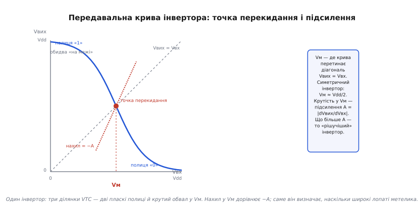
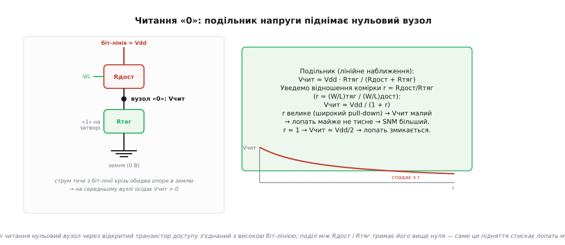
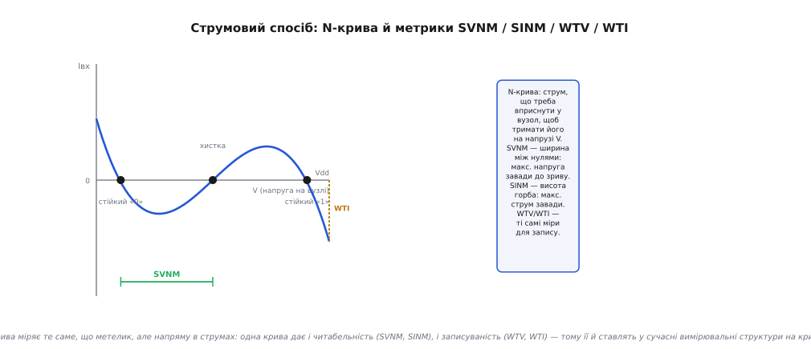

# 🧮 Запас стійкості SRAM у вольтах: від рівнянь транзистора до найбільшого квадрата

У самій темі ми дійшли до наочного означення: **запас статичної стійкості** (англ. *static noise margin*, SNM) — це сторона найбільшого квадрата, вписаного в лопать «метелика». Картина правильна й глибока, але вона поки що німа щодо чисел. Скільки саме мілівольт витримує комірка? Від чого це залежить — від розмірів транзисторів, від напруги живлення, від того, наскільки два транзистори вийшли неоднаковими? Чому та сама комірка в режимі читання втрачає стійкість — і **на скільки**? І як цей запас узагалі **виміряти** на реальному кристалі, де ти не маєш доступу до внутрішніх вузлів кожної комірки?

Щоб відповісти, треба спуститися на поверх нижче — до рівнянь одного транзистора — і піднятися звідти назад до метелика, але вже з формулами в руках. Це і є мета цієї вставки: пройти той самий шлях «інвертор → метелик → SNM», що й у темі, але **кількісно**, докопуючись до кожного «звідки». Наприкінці ми матимемо не лише число, а й розуміння, **чим це число керується** — і чому маленька комірка тримає біт гірше за велику.

## Один транзистор: закон, з якого все виростає

Уся форма передавальної кривої, а отже й розмір лопаті метелика, зрештою випливає з того, як тече струм крізь МОН-транзистор. Тож почнімо звідти — з мінімальної моделі, якої вистачить для всіх наших висновків.

МОН-транзистор — це кран для струму, яким керує напруга на затворі. Поки напруга між затвором і витоком менша за **поріг** Vt, канал не утворився, транзистор закритий, струму (майже) немає. Щойно Vgs перевищує Vt, під затвором виникає провідний канал, і транзистор пропускає струм. Нам знадобиться лише це: є поріг, нижче якого струму нема, а вище — струм швидко наростає з перевищенням (Vgs − Vt); саму фізику того, як напруга затвора «вмикає» канал і чому поріг такий, який є, розібрано окремо — [що таке поріг МОН-транзистора й від чого він залежить](book:electronics/mosfet-threshold). Найпростіша модель, що схоплює суть, — **квадратичний закон** (long-channel, square-law). У нього два режими.

Поки напруга стік-витік мала (Vds < Vgs − Vt), транзистор працює як **керований опір** — це **лінійна** (триодна) ділянка:

```
Iлін = k · [ (Vgs − Vt)·Vds − Vds²/2 ]
```

Коли ж Vds виростає понад (Vgs − Vt), канал біля стоку «пересихає» (pinch-off), і струм перестає залежати від Vds — це **насичення** (saturation):

```
Iнас = (k/2) · (Vgs − Vt)²
```

Тут `k = μ·Cox·(W/L)` — **питома крутість** транзистора: рухливість носіїв μ, ємність підзатворного оксиду Cox і, головне для нас, **геометрія** — відношення ширини каналу до довжини W/L. Саме через W/L проєктувальник керує «силою» транзистора: ширший канал — більший струм за тієї самої напруги. Цю W/L ми ще не раз згадаємо — вона виявиться прямою ручкою керування стійкістю комірки.

> 🔧 **Навіщо це.** Квадратичний закон — груба, «шкільна» модель; у нанометрових транзисторах працюють точніші (з урахуванням насичення швидкості, підпорогового нахилу). Але для **розуміння**, звідки береться форма VTC і чому SNM залежить від співвідношення розмірів, її досить — і саме на ній тримається вся інтуїція, яку виробник потім уточнює точним моделюванням SPICE. Коли ви читаєте в даташиті на пам'ять «мінімальна напруга утримання 1.2 В» — за цією цифрою стоїть рівно та боротьба струмів, яку описує цей закон.

Нам знадобляться два його наслідки, обидва прості. По-перше, у насиченні струм залежить **лише** від Vgs (через квадрат перевищення порога) і майже не залежить від Vds — тому транзистор у насиченні поводиться як **джерело струму**. По-друге, поблизу порога малесенька зміна Vgs дає велику відносну зміну струму — саме ця чутливість і зробить обвал VTC таким крутим.

## Передавальна крива інвертора й точка перекидання

Тепер зберемо з двох транзисторів інвертор і виведемо його передавальну криву (англ. *voltage transfer characteristic*, VTC) — залежність вихідної напруги від вхідної. У КМОН-інверторі верхній транзистор — p-канальний (підтягує вихід до живлення), нижній — n-канальний (тягне до землі); входи їхніх затворів з'єднані, стоки теж. Вхідна напруга Vвх керує обома одразу: піднімаючи Vвх, ми **зачиняємо** верхній і **відчиняємо** нижній.

У будь-якій точці VTC вихід нерухомий, а це означає одне: струм крізь верхній транзистор точно дорівнює струмові крізь нижній (більше струмові нікуди подітися — затвори нічого не споживають). Уся VTC — це геометричне місце точок, де

```
Iверх(Vвх, Vвих) = Iниз(Vвх, Vвих)
```

Розгляньмо цю рівність по ділянках вхідної напруги — і форма кривої проступить сама.

**Малий Vвх** (нижче порога n-канального). Нижній транзистор закритий, струму йому взяти нізвідки, тож і верхній мусить пропускати майже нуль — а це буває, лише коли на ньому майже немає спаду напруги. Отже, вихід притиснутий до Vdd: **верхня полиця**.

**Великий Vвх** (близько Vdd). Дзеркально: закритий верхній, вихід притиснутий до землі — **нижня полиця**.

**Середина.** Ось найцікавіше. Є вузьке вікно Vвх, де **обидва** транзистори прочинені й **обидва в насиченні** — тобто обидва поводяться як джерела струму. Але два джерела струму, з'єднані послідовно, не можуть задати спільну точку: найменша різниця їхніх струмів жене вихід або вгору, або вниз, аж поки котрийсь не вийде з насичення. Тому у цьому вікні вихід **стрімко валиться** з Vdd майже до нуля за крихітної зміни входу. Це і є крутий обвал VTC.

Точку, де крива перетинає діагональ **Vвих = Vвх**, звуть **точкою перекидання** (англ. *trip point*, або switching threshold, midpoint) і позначають Vм. Це напруга, за якої інвертор «не може вирішити» — вихід дорівнює входу. Знайти її легко: прирівняймо струми обох транзисторів у насиченні, поклавши Vвих = Vвх = Vм. Для n-канального Vgs = Vм, для p-канального Vsg = Vdd − Vм:

```
(kn/2)·(Vм − Vtn)²  =  (kp/2)·(Vdd − Vм − |Vtp|)²
```

Скоротімо на ½, візьмімо корінь з обох боків і розв'яжімо відносно Vм:

```
        Vtn + √(kp/kn)·(Vdd − |Vtp|)
Vм  =  ─────────────────────────────
              1 + √(kp/kn)
```

Прочитаймо результат. Точка перекидання — це **зважене середнє** між порогом «знизу» (Vtn) і «стелею мінус поріг» згори (Vdd − |Vtp|), а вага — це **корінь із відношення крутостей** √(kp/kn). Якщо транзистори збалансовані так, що kn = kp і Vtn = |Vtp|, вага дорівнює одиниці, і формула згортається до напрочуд чистого:

```
Vм = Vdd/2
```

Симетричний інвертор перекидається рівно посередині живлення. А якщо зробити нижній транзистор «сильнішим» (kn > kp), Vм зсунеться **вниз** — інвертор перекидатиметься раніше. Це не абстракція: саме цим зсувом Vм у комірці ми потім керуватимемо її стійкістю. (Усталений результат класичної теорії КМОН-інвертора; формула трип-пойнта наведена в стандартних курсах з VLSI.)


*Аналітичний цеглинка метелика. VTC інвертора має дві полиці (вихід притиснутий до Vdd або до 0) і крутий обвал між ними. Точка перекидання Vм — перетин кривої з діагоналлю Vвих = Vвх; для симетричного інвертора Vм ≈ Vdd/2. Дотична до кривої в Vм має нахил −A, де A — підсилення інвертора: чим стрімкіший обвал, тим більше A, тим «рішучіший» елемент. Саме A задає, наскільки широкі лопаті метелика й наскільки великий квадрат туди влізе.*

## Підсилення: чому крутість — це запас

Ми в темі сказали, що крутість VTC — це підсилення й що від нього залежить стійкість. Тепер побачмо це кількісно, бо саме тут ховається місток від VTC до розміру лопаті.

**Підсилення** інвертора у точці перекидання — це нахил VTC із мінусом:

```
A = − dVвих / dVвх   (у точці Vм)
```

Порахуймо його зі square-law. У точці Vм обидва транзистори в насиченні. Зробімо крихітний приріст входу dVвх — струм нижнього транзистора підросте, верхнього спаде, і вихід мусить зсунутися так, щоб рівність струмів відновилася. Швидкість цього зсуву — і є A. Провівши похідні (диференціюючи рівність струмів по Vвх при малих приростах), дістаємо, що підсилення тим більше, чим **менше** струми залежать від Vвих у насиченні — тобто чим ближче транзистори до ідеальних джерел струму. У реальному приладі скінченність A задає **вихідний опір** транзисторів у насиченні (ефект модуляції довжини каналу): якби струм у насиченні зовсім не залежав від Vds, обвал був би вертикальним, а A — нескінченним. Насправді A скінченне — типово від кількох одиниць до кількох десятків.

І ось ключовий зв'язок із метеликом. Лопать метелика — це проміжок між двома дзеркальними VTC. Що крутіші криві (більше A) і що далі рознесені їхні полиці, то ширша лопать, то більший квадрат туди влазить, то більший SNM. Наближено, для симетричної комірки, запас стійкості росте зі зростанням A і зменшується, коли криві зближуються. Тому боротьба за SNM — це насправді боротьба за **високе підсилення інверторів** і за те, щоб їхні полиці не збігалися. Тримайте цей зв'язок у голові: усе, що знижує A або зсуває криві докупи (просадка живлення, підняття «нульового» вузла при читанні, розкид порогів), напряму з'їдає SNM.

## Дві криві разом: SNM у вольтах як геометрія лопаті

Тепер зберемо метелик і вилучимо з нього SNM **як число**. Нагадаю конструкцію з теми: перша крива — VTC першого інвертора V(Q̄) = f(V(Q)); друга — та сама VTC, віддзеркалена по діагоналі, V(Q) = f(V(Q̄)). Вони перетинаються у трьох точках; дві крайні — стійкі стани, середня — хистка.

Тепер уявімо статичну заваду: на вузол Q дописуємо +Vn, на Q̄ дописуємо −Vn (найгірша, симетрична пара, що штовхає обидва вузли до перекидання). Геометрично це **зсуває** одну криву відносно іншої, і між ними лишається просвіт. Поки просвіт є — два стійкі стани збережено. Заваду Vn збільшуємо; у якийсь момент криві **торкнуться** — стійка й хистка точки зіллються, і комірка перекинеться. Найбільша Vn, за якої дотику ще немає, і є SNM.

Геометрично **найбільший квадрат, вписаний у лопать під кутом 45°** до осей, має сторону, що дорівнює цій критичній заваді. Це не метафора, а точна побудова: сторона квадрата = гранична Vn = SNM у вольтах. Аналітично для випадку, коли VTC можна наблизити ламаною (полиця — крутий скіс з нахилом −A — полиця), сторону цього квадрата виражають через висоту полиць, поріг і підсилення. Один із класичних наближених результатів для збалансованої комірки має вигляд

```
SNM ≈ Vtn − Vdd/(β·(A − 1)) · (щось порядку одиниці)
```

— тобто SNM росте з порогом і з підсиленням A, а псується, коли A наближається до одиниці. Точну формулу дав Зевінк (див. нижче); нам важлива її **структура**: запас — це різниця між тим, «наскільки високо стоїть полиця» (визначається порогами й Vdd), і тим, «як швидко крива відходить від полиці» (визначається підсиленням). Коли ці дві величини зрівнюються — SNM падає до нуля.

**Приклад-оцінка: SNM у спокої.** Візьмімо збалансовану комірку на Vdd = 1.2 В із Vtn = |Vtp| ≈ 0.35 В і помірним підсиленням A ≈ 8. Полиці рознесені майже на повний Vdd, обвал крутий:

```
масштаб лопаті ~ Vdd − 2·Vt ≈ 1.2 − 0.7 = 0.5 В
поправка на скінченне A: множник ~ (A−1)/A ≈ 7/8
SNM(hold) ≈ 0.5 · 7/8 · (коеф. геометрії ~0.5) ≈ 0.22 В
```

Порядок — **сотні мілівольт** запасу в спокої. Точне число дасть лише SPICE із реальними моделями, але масштаб правильний: у спокої комірка тримає біт із запасом у чверть вольта — саме тому «сама по собі» вона така стабільна. Далі побачимо, як цей запас тане при читанні.

## Читання: подільник напруги, що з'їдає запас

Тепер — кількісне серце того, чому «статична» комірка найкрихкіша саме при читанні. У темі ми сказали: при читанні «нульовий» вузол трохи підіймається над землею, і це стискає лопать. Порахуймо, **наскільки** підіймається — бо саме це число вирішує все.

Перед читанням біт-лінії підтягують до високої напруги (близько Vdd) і від'єднують. Тоді піднімають лінію слова — транзистори доступу відкриваються, і кожен вузол комірки з'єднується зі своєю біт-лінією. Розгляньмо той вузол, що тримав **нуль** (стан «0», його pull-down відкритий і тягне вузол до землі). Тепер до нього згори «прийшла» висока біт-лінія крізь відкритий транзистор доступу. Утворилося коло: **біт-лінія (≈Vdd) → транзистор доступу → вузол → pull-down → земля**. Струм тече згори вниз, а на вузлі, що опинився **між** двома опорами, осідає проміжна напруга. Це класичний **подільник напруги**.

Позначмо опір відкритого транзистора доступу Rдост, а опір відкритого нижнього (pull-down) транзистора Rтяг. У лінійному наближенні (обидва як опори) напруга на вузлі:

```
Vчит ≈ Vdd · Rтяг / (Rдост + Rтяг)
```

Введімо **відношення комірки** (англ. *cell ratio*, воно ж β-ratio) — наскільки pull-down «сильніший» за транзистор доступу. Оскільки провідність ∝ W/L, а опір ∝ L/W:

```
r = Rдост / Rтяг ≈ (W/L)тяг / (W/L)дост
```

Тоді поділ переписується гранично прозоро:

```
Vчит ≈ Vdd / (1 + r)
```

Ось воно — число, що керує всім. Прочитаймо його. Якщо pull-down зроблено набагато сильнішим за транзистор доступу (r велике), Vчит **мале** — нульовий вузол ледь підіймається, лопать майже не тисне, читання майже не шкодить. Якщо ж вони однакові (r ≈ 1), то Vчит ≈ Vdd/2 — нульовий вузол злітає аж до половини живлення, і це **катастрофа** для метелика: піднятий «нуль» підтягує другий інвертор до перекидання, лопать змикається, SNM падає в рази.

**Приклад-оцінка: підняття нульового вузла.** Хай Vdd = 1.2 В, а pull-down удвічі сильніший за транзистор доступу, r = 2:

```
Vчит ≈ 1.2 / (1 + 2) = 0.4 В
```

Нульовий вузол сидить не на нулі, а на **0.4 В** — це вже близько до порога сусіднього транзистора. Ось чому читання таке небезпечне: чверть-третина вольта «фальшивого нуля» напряму відкушує від запасу стійкості. Саме тому в темі ми бачили, що SNM читання «часом у кілька разів менший» за SNM спокою — тепер видно механізм у числі.


*Звідки береться провал SNM при читанні. Вузол, що тримав «0», у режимі читання опиняється між двома опорами: транзистора доступу (Rдост, згори, від високої біт-лінії) і pull-down (Rтяг, знизу, до землі). Поділ дає на вузлі Vчит ≈ Vdd·Rтяг/(Rдост+Rтяг) = Vdd/(1+r), де r = Rдост/Rтяг ≈ (W/L)тяг/(W/L)дост — відношення комірки. Велике r (широкий, сильний pull-down) тримає нульовий вузол низько — лопать метелика майже не стискається; r ≈ 1 піднімає його до Vdd/2 — лопать змикається. Ось чому конструктори роблять pull-down відчутно сильнішим за транзистор доступу.*

> 🔧 **Навіщо це.** Ця формула Vчит = Vdd/(1+r) — пряма причина, чому комірку 6T не малюють «усі транзистори однакові». Pull-down навмисно роблять сильнішим за транзистор доступу (типово r ≈ 1.5…2.5) — це той запас, який утримує нульовий вузол низько при читанні. Але кожне збільшення r — це **ширші** транзистори, тобто **більша** комірка. Ось де народжується компроміс, який ми в темі бачили як «надійність купується площею»: підняти r можна, але за це платиш кремнієм. І коли на межах живлення пам'ять починає збоїти на читанні першою — це рівно той самий поділ: при малому Vdd навіть 0.4 В підняття зжирають майже весь і без того схудлий запас.

## Запис: та сама фізика з іншим знаком

Запис — це навмисне доведення SNM до нуля з боку, який ми хочемо. Кількісно критерій запису дзеркальний до читання: ми питаємо не «наскільки біт-лінія піднімає нульовий вузол», а «наскільки біт-лінія, притягнута **до землі**, здатна **опустити** той вузол, що тримав одиницю, нижче точки перекидання протилежного інвертора».

При записі одну біт-лінію жорстко садять на нуль. Тепер уже транзистор доступу конкурує не з pull-down, а з **pull-up** (p-канальним, що тримає одиницю). Вузол-«одиниця» опиниться в поділі між pull-up (тягне до Vdd) і транзистором доступу (тягне до 0):

```
Vвузла-1 ≈ Vdd · Rдост / (Rдост + RтягВгору)
```

Щоб запис відбувся, цю напругу треба **продавити нижче Vм** протилежного інвертора — тоді той перекинеться й защипне новий стан. Звідси критерій: транзистор доступу має бути **сильнішим** за pull-up. Це протилежна вимога до читання! Для читання ми хотіли слабкий транзистор доступу (щоб не піднімав нульовий вузол), для запису — сильний (щоб продавлював одиницю). Це фундаментальний **конфлікт 6T-комірки**: один і той самий транзистор доступу мусить бути й слабким (для читання), і сильним (для запису).

Розв'язують конфлікт тим, що pull-up роблять **найслабшим** із трьох (p-канальний і так слабший за n-канальний за рухливістю), тоді навіть помірний транзистор доступу його пересилює при записі, лишаючись досить слабким проти сильного pull-down при читанні. Звідси класична **ієрархія сил** у 6T:

```
pull-down (найсильніший)  >  транзистор доступу (середній)  >  pull-up (найслабший)
```

Саме ця нерівність — не примха, а розв'язок системи двох суперечливих нерівностей (читабельність вимагає r_read великим, записуваність вимагає r_write достатнім). Коли комірку масштабують і транзистори стають надто малими, тримати цю ієрархію стає важче — і тоді SNM читання й запас запису починають конфліктувати нерозв'язно, що й штовхає до 8T-комірок з окремим портом читання, про які ми говорили в темі.

## Струмовий спосіб: N-крива й метрики SVNM/SINM

Тепер — важлива практична річ, якої в основній темі не було. Метелик прекрасний для розуміння, але **незручний для вимірювання**. Щоб побудувати його на реальному кристалі, треба фізично від'єднати два інвертори один від одного й знімати їхні VTC окремо — а в готовій комірці вони спаяні намертво, доступу до розриву петлі немає. Тому інженери-вимірювачі користуються іншим, **струмовим** способом — **N-кривою** (англ. *N-curve*).

Ідея елегантна. Замість того щоб різати петлю, ми лишаємо комірку цілою (у режимі читання, з відкритими транзисторами доступу), беремо один внутрішній вузол і **насильно задаємо** йому напругу V зовнішнім джерелом, водночас **міряючи струм** Iвх, який доводиться в цей вузол вприскувати (або з нього відбирати), щоб утримати задану V. Будуємо залежність Iвх(V) — і вона має характерну форму літери **N**.

Чому саме N? Розберімо по точках, де Iвх = 0 (тобто вузол сам тримається на цій напрузі без стороннього струму):

- **Перший нуль** — стійкий стан «0»: вузол сам сидить тут, вприскувати нічого не треба.
- Піднімаючи V далі, ми штовхаємо вузол угору проти петлі; петля опирається, тож треба **вприскувати додатний** струм — крива йде **вгору** (додатний горб).
- **Другий нуль** — **хистка** точка (той самий метастабільний стан): струм знову нуль, але рівновага нестійка.
- Ще вище петля вже сама «перекинулась» і тягне вузол угору — тепер струм доводиться **відбирати** (від'ємний), крива йде **вниз** (від'ємна яма).
- **Третій нуль** — стійкий стан «1».

З цієї однієї кривої зчитують одразу **чотири** метрики — дві про читання, дві про запис:

```
SVNM (static voltage noise margin) = відстань по НАПРУЗІ між 1-м і 2-м нулями
SINM (static current noise margin) = висота ДОДАТНОГО горба (макс. струм)
WTV  (write-trip voltage)          = напругова міра записуваності
WTI  (write-trip current)          = струмова міра записуваності
```

Прочитаймо їх фізично. **SVNM** — це максимальна **напруга** статичної завади, яку вузол витримає, перш ніж дійде до хисткої точки й комірка перекинеться. Це прямий струмовий родич SNM: скільки вольтів завади до зриву. **SINM** — максимальний **струм** завади (наприклад, від влучання частинки, що вприскує заряд), який комірка ще «переварить», не перекинувшись. Разом SVNM і SINM повно описують **читабельність**: комірку зіб'є або надто велика напруга завади, або надто великий струм завади — N-крива міряє обидва пороги однією дугою. А WTV/WTI із тієї самої кривої кажуть, наскільки легко комірку **перезаписати**.


*Сучасний спосіб виміряти стійкість, не розрізаючи петлю. По вертикалі — струм Iвх, який треба вприскати у внутрішній вузол, щоб утримати його на напрузі V (горизонталь). Крива тричі перетинає нуль: стійкий «0», хистка точка, стійкий «1». Ширина між першими двома нулями — SVNM (максимальна напруга завади до зриву); висота додатного горба — SINM (максимальний струм завади). Від'ємна яма між хисткою точкою і станом «1» дає WTI, а її напругова проєкція — WTV (наскільки легко комірку перезаписати). Одна крива — і читабельність, і записуваність; тому N-криву й ставлять у вбудовані вимірювальні структури на кристалі.*

> 🔧 **Навіщо це.** SVNM/SINM — не академічна забавка, а те, чим виробник **насправді** характеризує пам'ять на пластині. N-криву можна зняти вбудованою тестовою структурою прямо на кристалі, без доступу до внутрішніх вузлів кожної комірки, — тож саме її метрики йдуть у специфікації надійності й у статистику виходу придатних (yield). Коли ви бачите гарантію «пам'ять працює до Vdd = 1.08 В» — за нею стоїть виміряний розподіл SVNM по мільйонах комірок, а не намальований від руки метелик. І струмова метрика SINM прямо в'яжеться з тим, що ми казали про частинки: одиничний збій — це вприснутий заряд, тобто імпульс струму; комірку перекине, якщо він перевищить SINM. (Означення SVNM/SINM/WTV/WTI за N-кривою — усталений результат сучасної методики аналізу стійкості SRAM; Зевінкове SNM за метеликом лишається базовим означенням, IEEE J. Solid-State Circuits, 1987.)

## Розкид порогів: чому мала комірка тримає біт гірше

Лишилося звести докупи останню й найважливішу для сучасності нитку: чому з мініатюризацією комірки стають **менш** стійкими — не лише «менше заряду на вузлі» (це ми бачили в темі щодо частинок), а й систематично **менший SNM**. Причина — **варіативність** порогів транзисторів, і вона має точний кількісний закон.

Досі ми мовчки припускали, що чотири транзистори комірки однакові, а Vм рівно посередині. Насправді два «однакові» транзистори ніколи не виходять однаковими: їхні пороги Vt трохи різняться від приладу до приладу через випадковість самого виготовлення. Головне джерело — **випадкові флуктуації домішок** (англ. *random dopant fluctuation*, RDF): поріг задається кількістю атомів-домішок у каналі, а їх там **лічена** кількість, і вона підлягає статистиці. Що менший канал — то менше атомів, то більша **відносна** випадковість їхнього числа.

Це схоплює **закон Пелгрома** (Pelgrom): розкид (стандартне відхилення) різниці порогів двох сусідніх транзисторів обернено пропорційний кореню з площі каналу:

```
σ(ΔVt) = AVt / √(W·L)
```

де AVt — технологічна стала матчингу (типово одиниці мВ·мкм; що новіший процес, то менша). Прочитаймо цей закон — у ньому вся суть. Площа W·L стоїть **під коренем у знаменнику**: зменшили комірку вдвічі за площею — розкид порогів зріс у √2 ≈ 1.4 раза. Кожне покоління, роблячи комірку меншою, **збільшує** випадковий розкид Vt між її транзисторами.

А тепер зчепимо це з усім попереднім. Розкид Vt зсуває точку перекидання Vм (згадаймо формулу Vм — вона прямо залежить від Vtn і Vtp) і робить два інвертори комірки **несиметричними**. Несиметрична комірка має **менший** SNM: одна лопать метелика тонша за іншу, і найбільший квадрат обмежений саме тоншою. Тому SNM сам стає **випадковою величиною** з розкидом, і цей розкид росте, коли комірка меншає:

```
менша комірка  →  менша W·L  →  більший σ(ΔVt)  →  більший розкид SNM  →  частіше трапляються комірки з майже нульовим SNM
```

Ось точна відповідь на питання з теми, чому мала комірка стійка менше. Це не лише «менше заряду тримає вузол» (хоч і це теж). Це передусім **статистика**: у масиві з мільярдів комірок надійність визначає не середня комірка, а **найгірший хвіст** розподілу — ті рідкісні комірки, у яких випадковий розкид порогів з'їв майже весь SNM. Що менша комірка, то товщий цей поганий хвіст, то більша ймовірність, що бодай одна комірка на кристалі не витримає читання. Тому проєктувальники цілять не в «середній SNM > 0», а в **шість сигм** запасу — щоб навіть комірка «одна на мільярд» лишалась стійкою.

**Приклад-оцінка: розкид порога малої комірки.** Хай AVt = 3 мВ·мкм, а транзистори комірки мають W·L ≈ 0.01 мкм² (типово для щільної комірки просунутого процесу):

```
σ(ΔVt) = 3 мВ·мкм / √0.01 мкм² = 3 / 0.1 = 30 мВ
```

**Тридцять мілівольт** розкиду порога між двома транзисторами, що мали б бути однаковими, — і це лише одна сигма; хвіст 6σ дає вже 180 мВ. Порівняйте це з нашим прикладом SNM спокою ~220 мВ — і стає видно, як близько до нуля може підійти запас найгіршої комірки, коли на скромний SNM накладається такий розкид. Ось кількісний корінь усього: **надійність пам'яті — це боротьба середнього SNM проти статистичного розкиду порогів**, і мініатюризація тисне на обидві шальки в поганий бік.

> 🔧 **Навіщо це.** Ця статистика — причина, чому одна й та сама архітектура пам'яті на новішому, «щільнішому» процесі раптом вимагає **вищої** мінімальної напруги або **більших** транзисторів у комірці, ніж очікуєш від простого масштабування. Виробник змушений або підняти Vdd (ширші лопаті метелика компенсують розкид), або відмовитися від мінімального розміру комірки на користь трохи більшої (менший σ(ΔVt)), або перейти на 8T. Коли ви обираєте мікроконтролер і бачите, що модель на новішому техпроцесі має **вужче** вікно робочих напруг для утримання RAM, — за цим стоїть рівно цей закон Пелгрома: щільніша комірка статистично крихкіша, і запас доводиться повертати напругою.

## Підсумок: одне число, багато важелів

Пройшовши шлях від рівнянь транзистора до статистики масиву, зберімо картину докупи — тепер уже кількісну.

**SNM у вольтах** — це сторона найбільшого квадрата в лопаті метелика, а лопать будується з двох дзеркальних передавальних кривих інвертора. Форма кожної кривої випливає зі square-law: дві полиці (де один транзистор закритий) і крутий обвал у точці перекидання Vм = [Vtn + √(kp/kn)·(Vdd − |Vtp|)] / [1 + √(kp/kn)], що для симетричної комірки дорівнює Vdd/2. Крутість обвалу — це підсилення A, і саме воно задає ширину лопаті: більше A — більший SNM.

**Читання** з'їдає запас через елементарний подільник напруги: нульовий вузол підіймається до Vчит ≈ Vdd/(1+r), де r — відношення комірки (сила pull-down проти транзистора доступу). Мале r піднімає «нуль» аж до Vdd/2 і змикає лопать; тому pull-down роблять сильним. **Запис** вимагає протилежного — сильного транзистора доступу проти слабкого pull-up, звідси ієрархія сил pull-down > доступ > pull-up як розв'язок двох суперечливих умов.

**Виміряти** все це, не ріжучи петлю, дає струмовий спосіб — **N-крива**, з якої одразу зчитують SVNM (напругова стійкість читання), SINM (струмова стійкість, прямий поріг для влучання частинки), а також WTV/WTI (записуваність).

І над усім цим — **розкид порогів** за законом Пелгрома σ(ΔVt) = AVt/√(W·L): що менша комірка, то більший випадковий розкид, то товщий поганий хвіст розподілу SNM, то ближче найгірша комірка масиву до зриву. Ось чому мала комірка тримає біт гірше — і чому надійність пам'яті цілять не в середній SNM, а в його шестисигмовий запас.

Усе це — той самий метелик з теми, лише проміряний до дна. Один інвертор дав нам форму й точку перекидання; два інвертори — метелик і SNM; режим читання — подільник, що його з'їдає; N-крива — спосіб це виміряти; закон Пелгрома — причину, чому з кожним поколінням боротьба за той квадрат у лопаті стає важчою.
