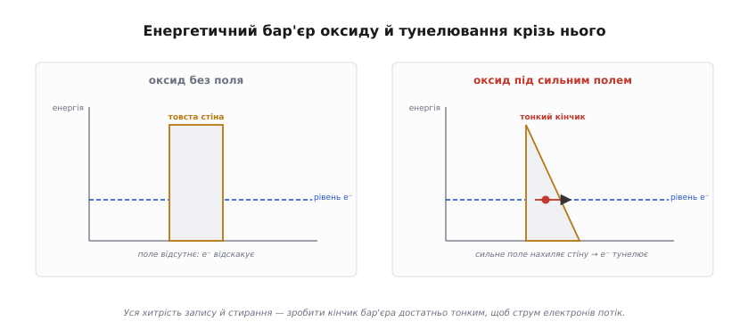
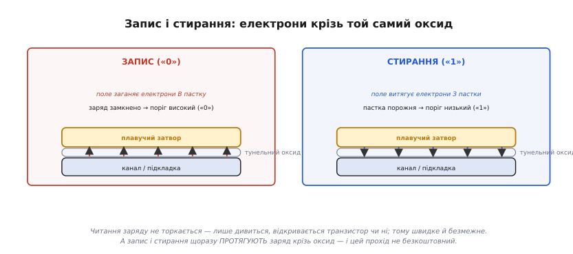

# 🧮 Тунелювання: електрон крізь ізолятор (Фаулер—Нордгайм, чому запис у Flash зношує комірку)

> Це математична вставка про [фізику комірок пам'яті](root:embedded/memory-cell-physics) на плавучому затворі. Там, де розбирають плавучий затвор, виринає дивна річ: щоб записати чи стерти біт, заряд мусить пройти **крізь** ізолятор, який у звичайному режимі його не пускає. Як таке взагалі можливо — і чому кожен такий прохід потроху руйнує комірку? Відповідь — у квантовому ефекті на ім'я **тунелювання** (*tunneling*) і в його робочій формі для тонких оксидів, яку звуть **Фаулер—Нордгайм** (*Fowler—Nordheim*). Розберімо її настільки, наскільки потрібно інженерові: не виводити квантову механіку з нуля, а зрозуміти, **від чого** залежить цей струм, чому він такий вибагливий до напруги — і звідки з нього неминуче випливає скінченний ресурс Flash у ті самі ~10⁴–10⁵ циклів, що для нього беруть [у поділі пам'яті на Flash і RAM](topic:programming/flash-vs-ram).

### Означення: тунелювання — прохід крізь заборонену стіну

Сформулюймо точно те, що в розмові про комірку зазвичай лише називають. Уявімо електрон у плавучому затворі й тонкий шар оксиду перед ним. Для електрона цей оксид — **енергетичний бар'єр**: щоб пройти його «поверху», як це уявляє звична фізика, електронові не вистачає енергії — так само, як кулька не перекотиться через гірку, на яку їй забракло розгону. Класично прохід **заборонено**, і крапка.

Квантова механіка каже інше. Електрон — не крихітна кулька з точним положенням, а **хвиля ймовірності**: він «розмазаний» у просторі, і ця хвиля не обривається різко об стінку бар'єра, а **просочується** в нього, згасаючи. Якщо бар'єр **тонкий**, хвиля не встигає згаснути до нуля — і по той бік лишається маленька, але ненульова ймовірність застати електрон. Тобто частина електронів проходить крізь стіну, **не маючи** енергії її перестрибнути. Це й є **тунелювання**:

```
тунелювання = прохід частинки КРІЗЬ бар'єр, який класично непрохідний,
              бо її хвиля ймовірності не обривається об стінку, а згасає в ній
```

Ключове слово тут — «тонкий». Згасання хвилі в бар'єрі **експоненційне**, тож імовірність пройти страшенно чутлива до товщини: трохи товщий бар'єр — і ймовірність падає на порядки. Саме тому тунелювання помітне лише там, де стіна по-справжньому тонка — одиниці нанометрів, як тунельний оксид Flash, — і зовсім невідчутне для «товстих» ізоляторів навколо. Перш ніж записувати це формулою, гляньмо на сам бар'єр очима електрона.


*Чому заряд узагалі проходить крізь ізолятор. Ліворуч — оксид без поля: товста прямокутна «стіна», електронові енергії не вистачає, класично він просто відскакує, а ймовірність тунелювання нікчемна. Праворуч — те саме під сильним полем: поле **нахиляє** бар'єр, перетворюючи прямокутник на **трикутник**, і на рівні електрона лишається тонкий **кінчик**, крізь який хвиля просочується наскрізь. Уся хитрість запису й стирання — зробити цей кінчик достатньо тонким, щоб струм електронів потік.*

### Інтуїція: поле нахиляє стіну й робить її прохідною

Тепер видно головну ідею, на якій тримається вся робота з Flash, і варто проговорити її окремо, бо без неї формула здаватиметься магією. Сам по собі тунельний оксид — надійна стіна: за звичайних напруг крізь нього не тече практично нічого, інакше плавучий затвор не тримав би заряд роками. Фокус у тім, що ми не пробуємо «перебити» стіну енергією — ми **міняємо її форму** прикладеним полем.

Прикладемо до структури високу напругу. Сильне електричне поле **нахиляє** енергетичні рівні в оксиді: бар'єр із прямокутного (повна товщина на всій висоті) стає **трикутним** — з того боку, куди тягне поле, його верх «з'їжджає» вниз. А для електрона важлива не повна товщина оксиду, а та ширина, яку треба подолати **на його власному рівні енергії**. У трикутному бар'єрі цей рівень перетинає вже тонкий **кінчик** біля вершини — і ось крізь нього хвиля просочується цілком відчутно. Що сильніше поле — то крутіший нахил, то тонший кінчик, то більше електронів тунелює. Саме в цьому суть: ми не додаємо електронам енергії перестрибнути стіну, ми **полем робимо стіну тонкою** там, де вони в неї впираються. Ця картина «поле → нахил → тонкий кінчик → струм» і є фізичний зміст режиму Фаулер—Нордгайм, до формули якого ми тепер готові.

### Апарат: формула Фаулер—Нордгайм

Тунельний струм крізь такий трикутний бар'єр описує закон **Фаулер—Нордгайм**. Виводити його ми не будемо — нам важить не виведення, а **форма залежності**, бо саме вона пояснює всю поведінку Flash. У робочому записі щільність струму J через оксид залежить від поля E так:

```
J = A · E² · exp( −B / E )
```

де E — електричне поле в оксиді (вольтів на метр), а A і B — сталі, що вбирають у себе властивості бар'єра (його висоту φ, масу електрона, фундаментальні константи). Уся «душа» формули — у двох множниках, і їх варто прочитати окремо, бо вони тягнуть у різні боки:

```
E²            — повільний, степеневий ріст: більше поле → трохи більше струм
exp(−B / E)   — РІЗКИЙ, експоненційний множник: ось він і керує всім
```

Саме другий множник робить тунелювання таким «вимикачем». Поки поле E мале, показник `−B/E` — велике від'ємне число, `exp(−B/E)` мізерний, і струму практично немає: оксид тримає. Щойно E дотягується до порогового — показник швидко наближається до нуля, експонента «вистрілює», і струм наростає на багато порядків у вузькому віконці напруг. Тому Фаулер—Нордгайм поводиться майже як поріг: нижче — глуха ізоляція, вище — заряд ринув крізь оксид. Це і є кількісний бік тієї самої картини «тонкого кінчика»: тонкий кінчик бар'єра — то велике E, а воно входить у **показник** експоненти, тож відгукується різко.

Звідси два практичні наслідки, які варто закарбувати. По-перше, **тунелюванням можна керувати напругою** — точно, як вентилем: трохи не дотягнув поле — нічого не записалося; дав потрібне — заряд пішов. По-друге, оскільки E = U/d (напруга, поділена на товщину оксиду d), те саме поле дають **тонший оксид за меншої напруги**: ось чому тунельний оксид роблять усього в кілька нанометрів — щоб помірна напруга всередині чипа створила поле, достатнє для Фаулер—Нордгайм. Тоншати без міри, втім, не можна — і зараз побачимо, чому: за кожен такий прохід оксид розплачується власною цілістю.

### Два режими: запис і стирання

Прив'яжімо формулу до двох операцій із бітом — запису й стирання. Обидві роблять одне: женуть електрони **крізь** тунельний оксид, лише в протилежні боки, і обидві спираються на щойно розібране сильне поле.


*Два режими, одна стіна. Під час **запису** («0») висока напруга на керівному затворі створює поле, що заганяє електрони з каналу **в** плавучий затвор; заряд замкнено — поріг високий. Під час **стирання** («1») поле зворотного знаку (з боку каналу) витягує електрони **з** пастки назад — у тонких оксидах це робить саме Фаулер—Нордгайм-тунелювання. Читання ж заряду не торкається: воно лише дивиться, відкривається транзистор чи ні, тому швидке й безмежне. А от запис і стирання щоразу **протягують** заряд крізь оксид — і цей прохід не безкоштовний.*

Деталі того, який саме фізичний механізм працює в кожному напрямі (де чисте Фаулер—Нордгайм-тунелювання, а де «гарячі» носії), різняться між сімействами комірок зовнішньої пам'яті. Тут досить головного, спільного: **і запис, і стирання неминуче протягують заряд крізь тунельний оксид**, тоді як читання його не чіпає. Це той самий поділ «читати дешево, писати дорого», що випливає вже зі словесного опису [комірки на плавучому затворі](root:embedded/memory-cell-physics), — тепер під ним лежить формула. А «дорого» — це не лише повільно: кожен прохід ще й залишає в оксиді слід.

### Чому кожен прохід зношує комірку

Ось ми й дісталися питання, заради якого ця вставка й затівалася: чому Flash не вічна, чому її ресурс — лічені десятки тисяч циклів? Корінь — у тому самому проходженні заряду крізь оксид, що дає запис і стирання. За елегантність тунелювання комірка платить власною цілістю.

Електрони, яких поле з силою протягує крізь тонкий оксид, летять «гарячими» — енергійними. Час від часу такий електрон не проходить чисто, а **застрягає** в товщі оксиду або **рве зв'язок** у його кристалічній сітці, лишаючи **дефект** — пастку (*trap*). Поодинці це дрібниця, але дефекти **накопичуються** циклами, і з них росте подвійна біда. По-перше, застряглий у пастках заряд — це **паразитний** заряд, не той корисний, що ми поклали на плавучий затвор; він **сам собою зсуває поріг** транзистора, і комірка починає брехати про свій стан. По-друге, чим більше дефектів, тим **дірявіший** оксид: накопичений на затворі заряд починає крізь нього **підтікати**, і нелеткість слабшає — біт, що мав триматися роками, пливе швидше. Разом це означає одне: **вікно** між порогом «заряд є» і порогом «заряду нема» поступово **звужується**.


*Чому ресурс скінченний. Ліворуч — оксид свіжий (майже бездоганний, заряд проходить чисто) і зношений тисячами циклів: у ньому повно дефектів-пасток, а в частині застряг паразитний заряд. Праворуч — наслідок у часі: поріг «0» (заряд є) повзе вниз, поріг «1» (заряду нема) повзе вгору від паразитного заряду, і широке спершу **вікно читання** звужується. Коли обидва пороги зблизяться так, що датчик їх плутає, — комірка зношена. Це і є та межа ~10⁴–10⁵ циклів запис/стирання, що її кладуть на [Flash проти RAM](book:programming/flash-vs-ram).*

Тепер видно, звідки в Flash береться саме число **порядку 10⁴–10⁵ циклів**: це не випадкова цифра, а та точка, де накопичені дефекти звужують вікно настільки, що надійно розрізнити «0» і «1» вже не виходить. І зверніть увагу на красиву асиметрію, яку ця механіка пояснює до кінця: **читання зносу не дає** взагалі. Читаючи, ми заряд не протягуємо крізь оксид — лише дивимося на поріг, а отже, нових пасток не плодимо; тому читати Flash можна практично безмежно. Зношує тільки те, що **жене заряд крізь стіну**, — запис і стирання. Ось і вся фізика за порадою «не пишіть у Flash часто»: кожен запис — це новий прохід крізь оксид і нова жменя дефектів у ньому.

> 🔧 **Навіщо це.** Ця формула — не теорія заради теорії, а пряме пояснення трьох щоденних правил роботи з Flash на МК. Перше: **знос реальний і фізичний** — кожен запис/стирання протягує заряд крізь оксид і лишає в ньому дефекти, тож ресурс у 10⁴–10⁵ циклів на блок — це не перестраховка виробника, а та точка, де вікно «0/1» звужується до нерозрізнюваного; звідси залізне правило тримати часто мінливі дані (лічильники, журнали, телеметрію) в RAM, а у Flash писати лише рідкісні налаштування, як [радить поділ Flash і RAM](topic:programming/flash-vs-ram). Друге: **читати — безкоштовно** — читання заряду не чіпає, не плодить пасток і зносу не дає, тому виконувати код прямо з Flash і скільки завгодно перечитувати дані можна без побоювань; платить лише запис. Третє, як модель мислення: експоненційний множник `exp(−B/E)` показує, чому запис у Flash поводиться як поріг за напругою (трохи не дотягнув поле — нічого, дав потрібне — заряд ринув) і чому тунельний оксид роблять надтонким (щоб помірна напруга всередині чипа дала достатнє поле). Тримаючи в голові цю одну картинку «поле нахиляє стіну, заряд тунелює, оксид за це псується», ви передбачите поведінку будь-якої нелеткої пам'яті на плавучому затворі — від Flash МК до SSD і флешок.
