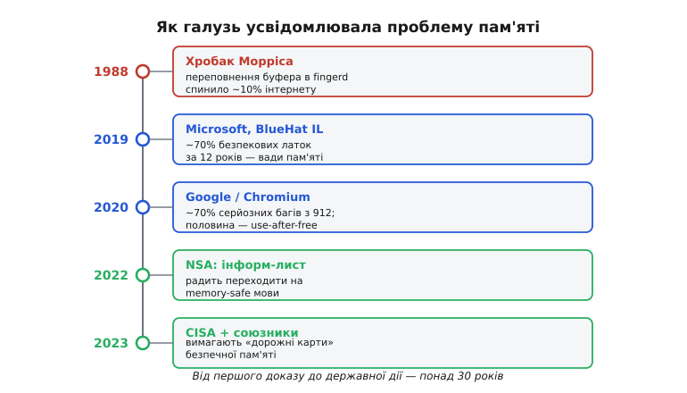

# 📜 Розплата за пам'ять: як галузь усвідомила проблему

> Дивна річ із вадами пам'яті: вони відомі рівно стільки, скільки існують мови, що їх дозволяють, — а серйозно ставитися до них галузь почала аж за тридцять із гаком років. Не тому, що інженери були дурні. Тому, що визнати проблему означало визнати незручне: справа не в окремих недбалих програмістах, яких можна навчити, а в самому інструменті, який усі любили й яким усе написано. Ця історія — про те, як одна й та сама помилка спершу налякала світ одним гучним вибухом, потім тридцять років тихо точила геть усе, доки дві найбагатші у світі команди не виміряли її лінійкою, а тоді вже й держави визнали вголос: коренем треба займатися, а не симптомами.

---

## Перший дзвінок: ніч, коли впала десята частина інтернету

Почнімо з вечора 2 листопада 1988 року. Інтернет тоді був малий і довірливий — близько шістдесяти тисяч машин на весь світ, переважно університети, лабораторії та військові вузли, з'єднані тонкими каналами й майже без замків на дверях. О пів на дев'яту вечора в цю мережу вислизнула невелика програма, написана аспірантом Корнельського університету на ім'я **Роберт Таппан Морріс** (*Robert Tappan Morris*, нар. 1965). За кілька годин вона поставила інтернет на коліна: машини одна за одною грузли, переставали відповідати, захлиналися. До ранку зараженими виявилися близько шести тисяч вузлів — приблизно десята частина всієї мережі. Це був **перший хробак, що поширився інтернетом** (*worm* — програма, яка сама себе копіює з машини на машину, без участі людини), і його назвали ім'ям автора: **хробак Морріса** (*Morris worm*).

Нас тут цікавить не сам переполох, а **як саме** хробак пробивався з машини на машину — бо один із його шляхів і є героєм усієї нашої теми. Серед кількох лазівок (Морріс не покладався на одну) була ось яка. У системах BSD Unix працювала служба `fingerd` — крихітний демон, що відповідав на запит «а хто зараз залогінений на цій машині?». Запит він читав простою бібліотечною функцією `gets()`. І в цьому полягала пастка.

Щоб зрозуміти пастку, треба знати єдину річ про `gets()`: вона читає рядок, що надходить, у наданий буфер — **і не питає, якого той буфер розміру**. Скільки байтів надішлеш, стільки вона й запише, хоч би буфер давно скінчився. У `fingerd` під вхідний рядок було відведено буфер на 512 байтів, що лежав, як звично, на стеку — там само, де процесор зберігає **адресу повернення**: куди стрибнути, коли поточна функція доробить. Морріс надіслав не ім'я користувача, а 536 байтів старанно дібраного сміття. Перші 512 заповнили буфер. Решта полізла далі по стеку — і затерла ту саму адресу повернення, підмінивши її адресою, що вказувала назад усередину надісланих даних. Коли `fingerd` доробив і спробував «повернутися», він стрибнув не туди, куди гадав, а на код, який зловмисник щойно вклав йому в буфер. Машина слухняно виконала чужу команду — і хробак опинявся всередині.

Це **переповнення буфера на стеку** в його найчистішому, підручниковому вигляді — рівно той механізм, що його детально розбирає стаття про [переповнення стека](root:sf-lang/stack-overflow). Зайвий байт не «ламає програму» якось абстрактно — він має конкретну, фізичну дію: затирає число на стеку, від якого залежить, куди піде керування. Уся подальша історія, усі мільярдні збитки, усі державні документи виростуть саме з цього механізму, побаченого тут уперше в масовому масштабі.



*Та сама вада пам'яті проходить наскрізь усю історію — змінюються лише масштаб і реакція. 1988-го це гучний одиничний вибух; до 2019–2020 двi незалежні команди вимірюють, що це системна, домінантна причина вразливостей; до 2022–2023 держави визнають проблему вголос і радять міняти інструмент. Найбільше вражає розрив: від першого незаперечного доказу до офіційної дії минуло понад тридцять років.*

Є ще одна деталь, без якої історія Морріса неповна, і вона теж повчальна. Хробак вийшов з-під контролю не через лазівку як таку, а через **дрібну помилку у власному коді автора** — банальну ваду логіки. Морріс передбачав, що машина може вже бути зараженою, і додав перевірку «чи я тут уже є?», щоб не плодити копії. Та, побоюючись, що адміністратори підроблятимуть відповідь «так, заражений» і так зупинятимуть хробака, він зробив його впертим: навіть отримавши «так», хробак однаково з імовірністю один до семи селився знову. На практиці це означало, що та сама машина заражалася знов і знов, десятки разів, аж доки не задихалася під вагою власних копій. Те, що замислювалося як тихий розвідник, перетворилося на стихійну відмову в обслуговуванні. Морріс став **першим, кого засудили за новим тоді Законом про комп'ютерне шахрайство** (*Computer Fraud and Abuse Act*): три роки умовно, чотириста годин громадських робіт і штраф. (Згодом він зробив поважну академічну й підприємницьку кар'єру — але це вже інша історія. Цікавий збіг: його батько, Роберт Морріс-старший, був криптографом Агентства національної безпеки США — тієї самої установи, що через десятиліття видасть документ із закликом тікати від мов, які роблять такі хробаки можливими.)

Статус цих фактів — **усталений**: дата, механізм через `gets()`, розмір буфера, кількість заражених машин і судова справа підтверджені численними джерелами, зокрема технічним розбором експлойта й матеріалами самого Корнельського університету. Єдине, де джерела трохи розходяться, — точна оцінка збитків (від сотень тисяч до приблизно ста мільйонів доларів); самé число тут не принципове.

> 🔧 **Навіщо це.** Урок Морріса для вбудованого розробника подвійний. По-перше, та сама `gets()`-пастка живе в кожному `strcpy`, `sprintf` чи читанні з UART без перевірки довжини: ненадійні дані ззовні + буфер без контролю меж = чужий код у вашому процесорі. По-друге — і це тонше — катастрофу спричинила не лише лазівка, а **звичайнісінький баг у логіці** (та невдала перевірка повторного зараження). Пам'ять не вибачає дрібниць: помилка, яка на десктопі дала б зайвий процес, у мережі дала обвал, а у вашому пристрої в полі дасть тиху корупцію, що вистрелить за тиждень.

---

## Тридцять тихих років: чому вибуху було замало

Здавалося б, після такого ляку галузь мала кинутися лагодити корінь. Сталося інакше — і зрозуміти, **чому**, важливіше за самі дати.

Реакція на хробака Морріса була цілком щира, але **симптоматична**. Адміністратори кинулися викорінювати `gets()` із системного коду, замінюючи її на функції, що зважають на довжину буфера. Постала перша група реагування на комп'ютерні інциденти (CERT). З'явилися латки. Усе це — правильні кроки, але всі вони лікували **наслідки**: конкретну діру, конкретну функцію, конкретну машину. Сама ж засада — мова, у якій буфер не знає власного розміру, а покажчик є просто числом без жодних запобіжників, — лишилася недоторканою. Бо чіпати її було немислимо: мовою C було написано Unix, нею писали все, і пропозиція «пишімо іншою мовою» звучала тоді приблизно як «розберімо й перебудуймо весь будинок, бо в одному вікні протяг».

Далі настала довга смуга, яку можна назвати **епохою латання**. Покоління за поколінням галузь винаходила дедалі хитріші способи **ускладнити експлуатацію** вад пам'яті, не усуваючи самих вад. З'явилися канарки стека (те саме «магічне число» на сторожі адреси повернення, про яке йдеться в основній темі). Постала **невиконувана пам'ять** — позначка «ця ділянка лише для даних, код звідси не запускати», щоб затертий буфер не можна було просто виконати, як це зробив Морріс. Прийшов **ASLR** (*address space layout randomization*) — випадкове перемішування адрес при кожному запуску, щоб зловмисник не знав наперед, куди стрибати. Кожен такий захист був розумний і корисний; кожен підіймав планку для нападника. Але всі вони мали спільну природу: вони робили ваду **важчою у використанні**, а не **неможливою**. Помилка лишалася в коді; просто дорожчало нею скористатися. А нападники щоразу винаходили обхід — поверталися до бібліотечного коду замість власного (так званий *return-oriented programming*), знаходили витоки адрес, що пробивали ASLR, і гонитва тривала без кінця.

Чому ж галузь так уперто лагодила симптом? Тут варто бути чесним і назвати причини без прикрас, бо вони людські, а не дурні.

Перша причина — **тягар уже написаного**. Десятиліттями накопичені мільярди рядків коду мовами C і C++: операційні системи, бази даних, мережеві стеки, прошивки. Переписати це іншою мовою — праця на десятиліття й астрономічні гроші, та ще й із ризиком занести нові помилки в код, що роками працював. Куди дешевше здавалося доточити ще один захисний механізм.

Друга — **щира віра в майстерність**. Програмісти C пишалися (і не безпідставно) близькістю до заліза й контролем над кожним байтом. Панувало переконання: вади пам'яті — це від недбалості, а *я* акуратний; досить дисципліни, рев'ю та інструментів, і *мій* код буде чистий. Це переконання було не дурним — воно було **недостатнім**, і саме його згодом і розіб'ють числа.

Третя — **відсутність зрілої альтернативи**. Довго просто не існувало мови, яка дала б безпеку пам'яті, не відбираючи того, заради чого беруть C: передбачуваність, швидкість, роботу без важкої системи виконання та збирача сміття під ногами. Мови зі збиранням сміття (Java, C#) знімали частину бід, але ціною пауз і накладних витрат, неприйнятних для системного й вбудованого коду. По-справжньому переконливу відповідь — безпеку **без** збирача сміття, доведену ще на компіляції, — дала аж мова **Rust**, чий перший стабільний випуск стався лише 2015 року. Поки такої відповіді не було, заклик «киньте C» лишався без практичного продовження: кинути — заради чого?

Тож тридцять років вада пам'яті не зникала й не лагодилася по-справжньому — вона **тихо точила геть усе**, час від часу нагадуючи про себе черговим гучним зломом, а галузь щоразу відповідала ще одним розумним пластиром. Бракувало одного: незаперечного, кількісного доказу, що це не окремі ляпи недбах, а **системна, домінантна причина** проблем — така, що жодна майстерність її не вичерпує. Цей доказ нарешті здобули — і прийшов він не з академії, а зсередини двох компаній, які мали найкращих інженерів і найбільше даних.

---

## Microsoft бере лінійку: 70 % за дванадцять років

Перший твердий вимір прийшов 2019 року. На ізраїльській безпековій конференції **BlueHat IL** інженер Microsoft **Метт Міллер** (*Matt Miller*) виступив із доповіддю, що підбивала підсумок понад двадцяти років боротьби компанії з вразливостями. Microsoft для такого виміру — свідок майже ідеальний: величезна база коду на C і C++ (Windows, Office, усе ядро), десятиліття обліку кожної виправленої вразливості й команда безпеки світового рівня. Якщо хтось і міг сказати, де **насправді** корінь проблем, то саме вони — на власних, а не позичених даних.

Міллер навів число, яке стало переломним. Переглянувши вразливості, які Microsoft виправляла **протягом дванадцяти років**, його команда виявила: близько **70 %** усіх присвоєних вразливостям ідентифікаторів (CVE) щороку — це **вади безпеки пам'яті**. Не якийсь рік-сплеск, не один лихий реліз — стабільні сім із десяти, рік за роком, дванадцять років поспіль. Хоч скільки вкладали в навчання, рев'ю, статичний аналіз і захисні механізми, частка трималася незрушно.

```
Microsoft, BlueHat IL 2019 (доповідь Метта Міллера):
  ~70% усіх CVE щороку, ≈12 років поспіль — вади безпеки пам'яті
  частка стабільна попри десятиліття зусиль і захистів
```

Саме **стабільність** числа била найдужче. Якби йшлося про навченість, частка мала б спадати з роками — програмісти ж учаться, інструменти кращають. А вона не спадала. Це й був той незручний доказ, від якого вже не відмахнутися гаслом «треба просто писати акуратніше»: дванадцять років галузевого «писання акуратніше» не зрушили цифру з місця. Висновок напрошувався сам — справа **не в людях, а в інструменті**. І в доповіді вперше з вуст великого виробника прозвучала думка, яка ще недавно була майже єрессю: треба зміщувати розробників на мови, безпечні щодо пам'яті за самою побудовою, — Міллер прямо називав і Rust як приклад напрямку.

Статус факту — **усталений**: первинне джерело публічне (слайди доповіді й сама доповідь Метта Міллера є у відкритому репозиторії безпекових досліджень Microsoft), число й формулювання «приблизно 70 % за останні щонайменше 12 років» цитуються однаково в багатьох незалежних переказах. Варто лише точно тримати рамку твердження: це **70 % виправлених CVE Microsoft**, а не «70 % усіх вад на світі» — узагальнювати на всю галузь з одного джерела було б недбало. Тому такий ваговий другий, незалежний вимір — і він не змусив на себе чекати.

---

## Google підтверджує: інша команда, інший код, те саме число

Якби 70 % лишилося поодиноким спостереженням однієї компанії, скептик мав би право засумніватися: може, це особливість саме коду Microsoft, його віку чи стилю? Та вже наступного, 2020 року, прийшло незалежне підтвердження — і то з геть іншого боку.

Команда проєкту **Chromium** (відкрита основа браузера Google Chrome) оприлюднила власний розбір. Вони взяли **912** вад безпеки з рейтингом «висока» або «критична», виправлених у стабільній гілці Chrome **починаючи з 2015 року**, і розклали за першопричиною. Результат виявився моторошно знайомим: близько **70 %** з них — **помилки роботи з пам'яттю** (хиби з покажчиками C/C++). А найгостріше — у тому, **який саме** різновид переважав: **половина** цих вад була **зверненням до пам'яті після її звільнення** (*use-after-free*) — читанням чи записом за адресою, де об'єкта вже немає.

```
Chromium (Google), 2020:
  912 серйозних (high/critical) вад безпеки від 2015 р.
  ~70% — помилки роботи з пам'яттю (покажчики C/C++)
  з них ≈половина — use-after-free (звернення після звільнення)
```

Збіг чисел тут — не випадковість, а підтвердження. Дві найбільші, найдосвідченіші, найкраще озброєні команди світу, що працюють над **зовсім різним** кодом (операційна система й офісний пакет проти браузерного рушія), незалежно одна від одної отримали **ту саму** частку — приблизно сім із десяти. Коли два незалежні виміри на різних об'єктах дають однаковий результат, це вже не аномалія однієї бази коду, а **властивість самого інструмента**. C і C++ систематично, передбачувано породжують саме цей клас вад — незалежно від того, хто і що ними пише.

Окремо вартий уваги наголос Google на **use-after-free**. Якщо переповнення буфера (вада Морріса) — це порушення межі **простору**, то use-after-free — порушення межі **часу**: пам'ять була чинною, ти законно тримав на неї покажчик, її звільнили, а покажчик лишився й указує тепер у пустку чи, гірше, на щось уже інше. Це рівно та «часова» половина єдиного кореня, що про неї йдеться в основній темі. І те, що саме вона — найчисленніша серед серйозних вад браузера, показує: найпідступніша частина проблеми лежить не в недогляді меж масиву (його легше помітити), а в **заплутаному часі життя об'єктів** — хто, коли і за яких умов щось звільнив, поки інша частина коду ще на це посилається. Тримати це в голові для великої системи людина не годна — і саме тому самої акуратності замало.

Статус факту — **усталений**: розбір опубліковано на офіційній сторінці безпеки проєкту Chromium; числа (912 вад, ~70 %, половина — use-after-free) повторюються в первинному джерелі та незалежних переказах однаково.

---

## Держави визнають вголос: NSA і CISA радять міняти інструмент

Доти розмова про корінь точилася всередині галузі — у доповідях інженерів, у блогах команд безпеки. Останній зсув, що завершує нашу лінію, — це коли проблему визнали **держави** й уперше офіційно порадили не латати, а **міняти інструмент**.

У листопаді 2022 року **Агентство національної безпеки США** (*National Security Agency*, NSA) видало короткий документ — **інформаційний лист із кібербезпеки «Безпека програмної пам'яті»** (*Software Memory Safety Cybersecurity Information Sheet*). Сенс його прямий: NSA радить організаціям, де це можливо, **стратегічно переходити** з мов, що дають мало або жодного вбудованого захисту пам'яті (названо прямо: C і C++), на мови, безпечні щодо пам'яті. Як приклади таких мов лист наводить C#, Go, Java, Ruby, Swift і Rust. Документ окремо посилається на ті самі виміри Microsoft і Google — мовляв, приблизно 70 % вразливостей у кожної з них — це вади пам'яті; коло замикається, державний документ спирається на галузеві числа.

Те, що саме NSA — установа, для якої комп'ютерна безпека є питанням національної оборони, — публічно радить **відмовлятися від C/C++ у новому коді**, було сильним сигналом. Це вже не приватна думка інженера зі сцени, а офіційна позиція. Окремий, майже поетичний штрих історії: лист про втечу від небезпечних мов вийшов з-під даху тієї самої установи, де колись служив батько автора хробака Морріса. Те, що 1988 року показав один аспірантський експеримент, через тридцять чотири роки стало державною рекомендацією.

Рік по тому, у грудні 2023-го, естафету підхопило **CISA** — Агентство кібербезпеки та безпеки інфраструктури США (*Cybersecurity and Infrastructure Security Agency*) — разом із NSA, ФБР і партнерами з кількох країн (Австралія, Канада, Нова Зеландія, Велика Британія). Вони видали спільну настанову **«Обґрунтування дорожніх карт безпечної пам'яті»** (*The Case for Memory Safe Roadmaps*) у межах ширшої кампанії «Безпека за побудовою» (*Secure by Design*). Тон тут уже не «варто розглянути», а наполегливіший: виробників програм закликають **скласти й оприлюднити «дорожні карти»** переходу на безпечні щодо пам'яті мови — публічний план, як саме й коли вони викорінять цей клас вад у критичних частинах свого коду. Логіка кампанії — перекласти тягар безпеки з користувача на виробника: не споживач має латати наслідки, а виробник — будувати так, щоб вад не було за конструкцією.

```
Державна лінія:
  NSA, лист «Software Memory Safety», листопад 2022
    → радить переходити з C/C++ на memory-safe мови
  CISA + NSA + FBI + партнери, «The Case for Memory Safe Roadmaps», грудень 2023
    → закликають виробників оприлюднити плани переходу
```

Статус фактів — **усталений**: і лист NSA, і настанова CISA — публічні первинні документи з відомими датами й авторством; формулювання («стратегічно перейти», перелік безпечних мов, заклик до дорожніх карт) узяті з самих документів. Тут важлива одна обережність в інтерпретації, щоб не перебільшити: жоден із цих документів **не забороняє** C/C++ і не оголошує їх поза законом — вони **радять** і **закликають**, наголошуючи на **новому** та **критичному** коді. Це рекомендація й тиск, а не заборона; плутати ці статуси було б неточно.

> 🔧 **Навіщо це.** Для вбудованого розробника державна лінія — не абстракція. Якщо ви робите пристрій для медицини, авіації, енергетики чи оборони, ці документи поступово стають частиною вимог замовника й сертифікації: у вас можуть запитати ваш план щодо безпеки пам'яті. Навіть поза регульованими галузями напрям задано: новий критичний код дедалі частіше очікують бачити або безпечною мовою, або написаним так, щоб клас вад пам'яті був неможливий за конструкцією — рівно те, чого вчить основна тема.

---

## Чому вбудований світ реагує повільніше за десктоп

Лишилося чесно пояснити одну річ, яку легко прочитати як докір, а насправді це тверезий діагноз. Уся щойно розказана історія — про великий софт: операційні системи, браузери, серверний код. **Вбудований світ — світ прошивок на мікроконтролерах — рухається цим шляхом помітно повільніше.** І причини тут не в лінощах чи відсталості, а цілком матеріальні.

Перша причина — **залізо як стеля**. Безпечні щодо пам'яті мови зі збиранням сміття (Java, C#, Go) на крихітному мікроконтролері з кількома десятками кілобайтів пам'яті просто **не вміщуються** — їхня система виконання більша за всю доступну пам'ять. А пауза збирача сміття посеред керування двигуном чи зчитування давача неприйнятна там, де потрібен **детермінований** час відгуку до мікросекунди. Десктоп має гігабайти пам'яті й може дозволити собі накладні витрати; пристрій у полі — ні.

Друга — **тягар екосистеми ще важчий, ніж на десктопі**. Виробники мікросхем постачають свої бібліотеки, драйвери, приклади й засоби розробки майже виключно мовою C. Регістри периферії, обробники переривань, стартовий код — усе це світ C, і обійти його, лишаючись на залізі, довго було майже неможливо. Безпечна альтернатива без збирача сміття — Rust — лише останніми роками доросла до зрілої підтримки мікроконтролерів; вона вже придатна, але екосистема ще наздоганяє десятиліття напрацювань на C.

Третя — **ціна помилки парадоксально не тисне там, де мала б**. Здавалося б, у прошивці ставки найвищі: збій пам'яті в кардіостимуляторі чи політному контролері страшніший за збій у браузері. Але саме через ізольованість і вузьку спеціалізацію вбудованих пристроїв ринковий тиск безпеки сюди доходить **слабше й пізніше**, ніж до масового мережевого софту, що його щодня штурмують зловмисники. Парадокс жорстокий: там, де тиха корупція пам'яті найнебезпечніша (немає операційної системи, що спіймає наїзд; нікому перезапустити пристрій обережно — рівно те, з чого починається основна тема), реакція галузі найповільніша.

Звідси й практичний висновок цієї історії — і місток назад до того, навіщо ми все це читали. Доки вбудований світ масово на C і C++, **відповідальність за безпеку пам'яті лягає на самого розробника прошивки**, і перекласти її нема на кого: ні безпечна мова, ні операційна система, ні апаратний захист пам'яті здебільшого не приходять на готове. Саме тому в прошивці безпека пам'яті — не данина моді з державних документів, а **інженерна дисципліна, яку доводиться будувати руками**: уникати цілих класів бід конструкцією, охороняти рантайм тим залізом, що є, ловити решту інструментами на столі. Числа Microsoft і Google довели, що інакше — самою акуратністю — ще нікому не вдалося; а вбудований розробник, позбавлений запасних мереж десктопа, має врахувати цей урок ще суворіше за інших.
