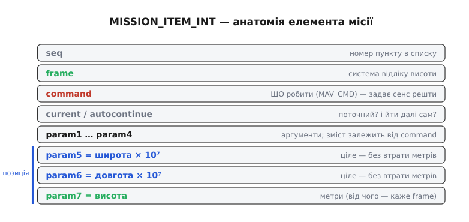
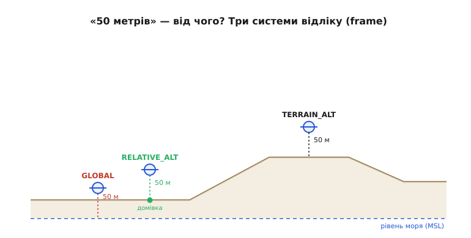
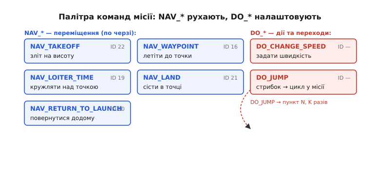
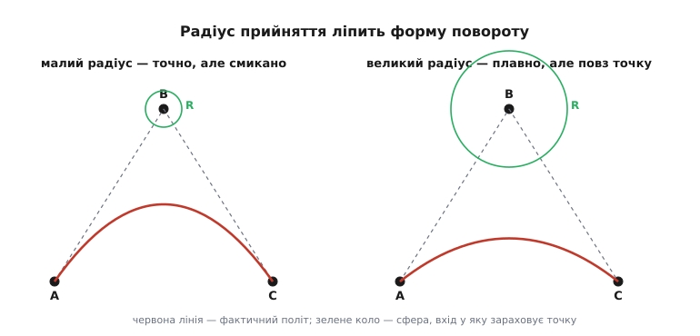

# Проєктування місії (вейпойнти)

Ми вже вміємо дві речі, які тепер з'єднаються в одну. З теми про [автономну систему](root:embedded/autonomous-system) ми знаємо, що найзовнішній, найповільніший контур керування — **навігація** — живиться однією простою уставкою: «лети до точки B». А з теми про [команди MAVLink](root:embedded/mavlink-commands) ми знаємо, **як** передати апарату набір точок — те акуратне рукостискання `MISSION_COUNT → MISSION_ITEM_INT → MISSION_ACK`, де жодна точка не губиться. Лишилося найцікавіше: а **що саме** ми в ці точки кладемо? Бо «точка B» — це не просто шпилька на мапі. Це маленька **програма**, яку апарат виконає сам, без людини за пультом.

Слово, яким цю точку звуть, — **вейпойнт** (англ. *waypoint*, від *way* — «шлях» і *point* — «точка»): точка дороги, проміжна ціль маршруту. План з таких точок — це **місія** (англ. *mission* — «завдання»). Спроєктувати місію означає скласти послідовність вейпойнтів так, щоб апарат, лишившись наодинці з власним [політним контролером](topic:sys-dron/flight-controller), пройшов її **точно й безпечно**. Розберімо, з чого ця точка зроблена, які пастки в ній сховані й чому правильно складена місія — це не мапа, а код.

### Вейпойнт — це не координата, а команда з адресою

Перша і найважливіша поправка до інтуїції: вейпойнт **не дорівнює** парі «широта, довгота». Якби місія була просто списком координат, апарат не знав би, що з ними **робити** — пролетіти наскрізь? зависнути? сісти? зробити коло? Тому кожен пункт місії — не координата, а **елемент місії** (англ. *mission item*): команда зі словника `MAV_CMD`, той самий, що ми бачили в `COMMAND_LONG`, плюс **до семи параметрів** і **позиція**.

Структура елемента — це той-таки `MISSION_ITEM_INT`, який станція слала під час рукостискання. Розкладімо його поля, бо саме вони і є «анатомія» вейпойнта:


*Один елемент місії. `command` — що робити (значення з MAV_CMD); `param1…param4` — числові аргументи, зміст яких задає сама команда; `param5`/`param6` — широта й довгота, **помножені на 10⁷** і збережені як цілі (звідси `_INT` у назві); `param7` — висота. `frame` каже, у якій системі відліку читати позицію, `seq` — номер у списку. Координата — лише три поля з дванадцяти.*

Подивися на цю картину уважно — у ній уся суть. **Команда** в полі `command` визначає **сенс** усіх інших полів. Покладеш `MAV_CMD_NAV_WAYPOINT` — і `param5/6/7` читаються як «куди долетіти», а `param1` стає часом зависання в точці. Покладеш `MAV_CMD_NAV_TAKEOFF` — і та сама структура означає «злети на цю висоту». Один формат, безліч дій — рівно та сама ідея, що робить `COMMAND_LONG` універсальним: код, який збирає елемент місії, **однаковий** для всіх типів точок, змінюється лише вміст полів.

> 🔧 **Навіщо це.** Коли збираєш місію власним кодом, ти не пишеш окрему функцію «додати зліт», «додати точку», «додати посадку». Ти пишеш **одну** функцію, що заповнює `MISSION_ITEM_INT`, і просто кладеш у неї різні `command` та параметри. Місія в пам'яті — це масив однакових структур; уся різниця між «летіти» і «сідати» — у числі в одному полі. Саме тому план із трьох точок і план із трьохсот пишуться тим самим кодом.

Чому координати — цілі, помножені на 10⁷, а не звичайні числа з комою? Бо точка на Землі надто дрібна для `float`. Один градус широти — це близько 111 км; молодші розряди `float` (де лишається близько семи значущих цифр) «з'їли» б останні метри, і апарат прилітав би з похибкою в десятки метрів. Помноживши градуси на 10⁷ і поклавши в 32-бітне ціле, ми зберігаємо роздільність ~1 см по всій земній кулі. Звідси й суфікс `_INT` у назві повідомлення, і правило з попередньої теми: **координатні** елементи шлемо цілочисловим варіантом, бо точка на Землі не прощає округлення. Це той самий [GNSS-приймач](topic:hw-sensing/gnss), що дає апарату координати, але тепер ми ставимо координати **наперед**, як ціль.

### Пастка номер один: яка це висота?

Тепер найкоштовніша річ у всій темі — поле `frame`, **система відліку** (англ. *frame* — «рамка, система координат»). На ньому ламаються найчастіше, і ламаються боляче: бо помилка у `frame` означає, що апарат полетить не на ту **висоту**, а висота — це єдина координата, помилка в якій веде або в землю, або в небо.

Широта й довгота однозначні: це місце на поверхні кулі. А от висота `param7` сама по собі — просто число метрів. **Від чого** ці метри відлічувати? Варіантів кілька, і вони дають геть різні точки в просторі:


*Та сама цифра «50 метрів» у трьох системах відліку дає три різні висоти. `MAV_FRAME_GLOBAL` рахує від рівня моря: на плато 800 м апарат опиниться за 50 м над морем — тобто на 750 м **під** землею. `MAV_FRAME_GLOBAL_RELATIVE_ALT` рахує від точки зльоту (домівки) — 50 м над злітним майданчиком, хоч де він. `MAV_FRAME_GLOBAL_TERRAIN_ALT` тримає 50 м над рельєфом, що пробігає під апаратом, — і висота над морем змінюється разом із горбами.*

Розберімо різницю на причинах. **`MAV_FRAME_GLOBAL_INT`** відлічує висоту від середнього рівня моря (англ. *mean sea level*, MSL) — тієї самої позначки, яку дає [GNSS](topic:hw-sensing/gnss). Здавалося б, чесний абсолют. Але запланувати в ньому місію важко: треба знати справжню висоту землі в кожній точці над рівнем моря, інакше «50 м над морем» на гірському плато 800 м — це команда зануритися глибоко в ґрунт.

**`MAV_FRAME_GLOBAL_RELATIVE_ALT_INT`** відлічує висоту від **домівки** (англ. *home*) — точки, де апарат озброївся й злетів. «50 м» тут означає «50 м над тим місцем, звідки я піднявся», і це збігається з людською інтуїцією: я хочу, щоб дрон ішов на п'ятдесятьох метрах над майданчиком. Саме тому цей `frame` — **типовий і найбезпечніший** вибір для більшості місій, і саме його за замовчуванням ставлять наземні станції.

**`MAV_FRAME_GLOBAL_TERRAIN_ALT_INT`** тримає висоту над **рельєфом** просто під апаратом, спираючись на карту висот на борту. «50 м над землею» весь час, навіть коли під крилом виростає горб. Незамінний для зйомки чи обльоту схилу, але працює лише там, де є дані рельєфу, інакше апарат не знає, де та земля.

> 🔧 **Навіщо це.** Перше, що перевіряють, коли апарат у місії «полетів не туди по висоті», — це `frame`. Класична аварія-новачка: точку задано в `GLOBAL` (від моря), а пілот думав про висоту над собою; апарат сумлінно «сідає» на рівень моря посеред пагорба. Залізне правило прикладної розробки: якщо немає вагомої причини інакше — усі координатні точки місії в **одному** `frame`, і цей `frame` — `GLOBAL_RELATIVE_ALT`. Мішати системи відліку в одній місії — найкоротший шлях до того, що половина точок виявиться на чужій висоті.

> 📐 **Тонкість, яку варто знати.** Навіть рівень моря не один: висота від GNSS відлічується від математичного **еліпсоїда** WGS-84, а «рівень моря» в людському сенсі — від **геоїда** (реальної форми поля тяжіння), і вони розходяться на десятки метрів залежно від місця. Автопілоти це враховують, але коли абсолютні висоти «не сходяться на десятки метрів», причина часто саме тут. Для повсякденних місій у `RELATIVE_ALT` це не турбує — там обидва кінці відліку зсунуті однаково.

### Місія — це маленька програма, не лише список точок

Якщо вейпойнт — це команда, то місія — це **послідовність команд**, тобто програма. І як у будь-якій програмі, тут є не лише «йди туди», а й дії, цикли та переходи. Команд місії багато, але щоденний робочий набір невеликий. Розгляньмо його — і одразу побачимо, що `MAV_CMD` тут той самий, що в розмові командами, тільки тепер команди **зашиті в план** і виконуються по порядку самим апаратом.


*Робоча палітра місії. Навігаційні команди (NAV_*) рухають апарат у просторі й виконуються по черзі; команди-дії (DO_*) нічого не пересувають, а змінюють поведінку чи керують потоком — як-от DO_CHANGE_SPEED задає швидкість, а DO_JUMP стрибає на інший пункт і вмикає в місію цикл. Числа поруч — ID зі словника MAV_CMD; вони стабільні й варті того, щоб упізнавати їх на око.*

Пройдімо найважливіші, бо з них складається майже будь-який сценарій (значення ID — усталені, перевірені за специфікацією MAVLink і документацією ArduPilot):

- **`MAV_CMD_NAV_TAKEOFF` (22)** — зліт. Апарат піднімається з місця на висоту з `param7`. Майже завжди це **перший** навігаційний пункт мультикоптерної місії: поки не злетів, летіти кудись нема як.
- **`MAV_CMD_NAV_WAYPOINT` (16)** — серце місії: пролетіти до точки `param5/6/7`. У `param1` — **час зависання** в секундах: 0 означає «не зупиняйся, проходь далі», додатне число — «зависни тут стільки-то й лети до наступної».
- **`MAV_CMD_NAV_LOITER_TIME` (19)**, **`_TURNS` (18)**, **`_UNLIM` (17)** — кружляти навколо точки: задану кількість секунд, обертів або без кінця. Корисно, щоб зачекати, постежити за об'єктом чи дати час корисному навантаженню.
- **`MAV_CMD_NAV_LAND` (21)** — сісти в указаній точці. Зазвичай **останній** навігаційний пункт, якщо апарат має приземлитися самостійно.
- **`MAV_CMD_NAV_RETURN_TO_LAUNCH` (20)** — повернутися додому. Той самий RTL, що рятує апарат у [failsafe](topic:sys-dron/failsafe); як останній пункт місії він каже «маршрут пройдено — повертайся й сідай на домівці».
- **`MAV_CMD_DO_CHANGE_SPEED`** і **`MAV_CMD_DO_JUMP`** — команди-**дії**, що нічого не пересувають. Перша змінює крейсерську швидкість на наступних відрізках; друга — **стрибок** на пункт із заданим номером задану кількість разів, тобто справжній **цикл** усередині місії (облетіти периметр п'ять разів — це один `DO_JUMP`, а не п'ять разів виписаний периметр).

Бачиш закономірність? `NAV_*` — це команди, що **переміщують** апарат і виконуються одна за одною; `DO_*` — команди, що **налаштовують** поведінку або **керують потоком** виконання, не рухаючи апарат. Саме тому місію чесно називати програмою: у ній є інструкції руху, є зміна стану й є переходи. А якщо є переходи — план перестає бути прямим списком і стає **графом** можливих шляхів.

### Коли точка вважається «досягнутою»: радіус прийняття

Здавалося б, дрібниця: апарат летить до вейпойнта — коли переходити до наступного? Коли «долетить». Але долетіти **точно** в математичну точку неможливо: завжди є вітер, інерція, шум [GNSS](topic:hw-sensing/gnss). Якби апарат чекав ідеального влучання, він би вічно крутився біля цілі, ловлячи останні сантиметри. Тому вводять **радіус прийняття** (англ. *acceptance radius*): уявну сферу навколо вейпойнта; щойно апарат у неї **ввійшов**, точка вважається досягнутою, і навігація бере наступну.


*Радіус прийняття керує не лише «коли зараховано точку», а й **формою** траєкторії на повороті. Малий радіус (ліворуч) тягне апарат майже у вершину кута — точно, але з різким гальмуванням і доворотом. Великий радіус (праворуч) дозволяє «зрізати» кут плавною дугою — швидше й м'якше, але апарат проходить далі від самої точки. Вибір радіуса — це торг між точністю проходження точки й плавністю маршруту.*

Тут ховається неочевидний наслідок, який і робить цей параметр важливим. Радіус прийняття керує не лише моментом зарахування — він керує **геометрією повороту**. З малим радіусом апарат мусить підійти майже впритул до вершини кута, отже — пригальмувати, довернути й рушити на нову ланку: точно, але смикано. З великим радіусом він «зараховує» точку здалеку й починає поворот раніше, проходячи плавною дугою повз вершину: швидко й м'яко, але далі від самої точки. Тож радіус — це не технічна дрібниця, а **інструмент проєктувальника**: малий там, де треба влучити точно (скинути вантаж рівно над ціллю), великий там, де важлива плавність і швидкість (облетіти площу для зйомки).

В ArduPilot цей радіус задає параметр `WPNAV_RADIUS` (за замовчуванням близько 2 м для коптера), і той самий механізм «параметрів», який ми читали й писали по MAVLink у попередній темі, дозволяє підкрутити його з власного коду. Подивімося на просте число.

**🔧 Worked-приклад: чи зарахована точка (C++).** Бортовий код щотакту знає свою позицію (з оцінювача) і ціль (поточний вейпойнт). Точка зарахована, коли горизонтальна відстань до неї менша за радіус прийняття:

```cpp
// Радіус прийняття для поточного вейпойнта, метри.
const float accept_radius_m = 2.0f;            // ~WPNAV_RADIUS

// Горизонтальна відстань від апарата до цілі.
// Для невеликих відрізків (десятки–сотні метрів) пласке наближення
// у метрах достатньо точне; на великих дугах беруть формулу гаверсинуса.
float north_m = (target_lat - cur_lat) * 1e-7f * 111320.0f;
float east_m  = (target_lon - cur_lon) * 1e-7f * 111320.0f
                * cosf(cur_lat * 1e-7f * (float)M_PI / 180.0f);
float dist_m  = sqrtf(north_m * north_m + east_m * east_m);

if (dist_m <= accept_radius_m) {
    mission_index++;                 // точку зараховано — беремо наступний пункт
    load_waypoint(mission_index);    // нова уставка для навігаційного контуру
}
```

Висновок: «досягнув точку» — це не рівність координат, а **влучання у сферу**. Множник 10⁻⁷ повертає цілі градуси × 10⁷ назад у градуси; множник 111320 переводить градус у метри; косинус широти враховує, що меридіани сходяться до полюсів, тож градус довготи коротший за градус широти. Для коротких ланок таке пласке наближення достатнє; для довгих перельотів беруть точну сферичну відстань. А `mission_index++` — це і є той перехід, що рухає місію далі: вийшов із попередньої сфери — навігаційний контур дістав нову уставку, рівно ту «точку B», заради якої все й будувалося в [автономній системі](root:embedded/autonomous-system).

### Дрібний, але злий нюанс: нульовий пункт — це домівка

Ще одна річ, об яку спотикаються, читаючи чи збираючи місію своїм кодом. У стандарті MAVLink пункти нумеруються з нуля, і `seq = 0` мав би бути першою справжньою точкою. Але **ArduPilot** робить інакше: пункт `seq = 0` він тримає під **домівку** (home), позицію зльоту, а перший справжній елемент твоєї місії починається з `seq = 1`. Дрібниця — поки не порахуєш точки в масиві й не здивуєшся, чому їх на одну більше, ніж ти заклав, або чому `DO_JUMP` на «пункт 3» влучає не туди, куди ти думав.

Звідси практичне правило: коли пишеш код, що **рахує** на номери пунктів місії (а `DO_JUMP` саме такий), завжди тримай у голові, з чого нумерує **конкретний** автопілот. Це класичний приклад того, чому інженеру треба знати не лише стандарт, а й як його реалізує реальна прошивка — розбіжності між специфікацією й реалізацією живуть саме в таких кутах.

### Місія може піти не так: огорожа й повернення

Спроєктувати маршрут — половина роботи. Друга половина — спитати: **а що, як щось зламається посеред нього**? Апарат у місії летить **сам**: оператор може й не дивитися на екран. Тому в добре спроєктовану місію вбудовують **захисну сітку** ще на етапі планування, а не сподіваються на удачу.

Перша лінія — **геозона** (англ. *geofence* — «географічна огорожа»): невидима межа в просторі, вийти за яку апарату заборонено. Її задають як висоту-стелю, відстань-радіус або многокутник на мапі; щойно апарат торкається межі, автопілот **сам** утручається — спиняється, розвертається або вмикає повернення, не питаючи місію. Це страховка від того, що погано складений маршрут (чи збій оцінювача позиції) понесе апарат туди, де він нашкодить. Як саме автопілот будує цю огорожу й що робить на її межі — окрема тема: [геозона в автопілоті](topic:sys-dron/geofence) накладається на місію зверху й має пріоритет над нею.

Друга лінія — те, чим місія **закінчується**, і те, що спрацьовує, коли зв'язок чи заряд кажуть «годі». Грамотний план майже завжди завершують пунктом `NAV_RETURN_TO_LAUNCH` або `NAV_LAND`: апарат, пройшовши маршрут, **не зависає** в останній точці, чекаючи команди, а сам вертається й сідає. І той самий RTL — типова реакція [failsafe](topic:sys-dron/failsafe): сів заряд, пропав радіоканал чи апарат вийшов за геозону — він кидає поточний пункт місії й іде додому. Проєктуючи місію, корисно подумки програти кожен такий зрив: де апарат опиниться, якщо RTL спрацює саме **тут**? чи вистачить заряду долетіти з найдальшої точки? Місія, у якій ці питання продумані наперед, — безпечна; місія, що покладається на «все буде гаразд», рано чи пізно знаходить свій горб.

> 🔧 **Навіщо це.** Геозона й завершальний RTL — це не «додаткові опції для обережних», а **частина проєктування місії** нарівні з самими точками. Інженер, що складає автономний маршрут, відповідає не лише за те, куди апарат полетить за планом, а й за те, куди він дінеться, коли план зірветься. Сітку безпеки закладають **до** першого польоту, бо саме перший політ найімовірніше її й випробує.

### Складаємо все докупи: місія в коді

Тепер з'єднаймо все. Місія в пам'яті — це **масив** структур `MISSION_ITEM_INT`, який ми збираємо самі, а потім згодовуємо тому рукостисканню `MISSION_COUNT → MISSION_REQUEST_INT → MISSION_ITEM_INT → MISSION_ACK` із [теми про команди](root:embedded/mavlink-commands). Подивімося на форму одного зібраного елемента — типову точку маршруту:

```cpp
// Один вейпойнт: пролетіти до точки на висоті 50 м над домівкою,
// не зупиняючись (час зависання = 0), радіус прийняття 3 м.
mavlink_mission_item_int_t wp = {};
wp.seq          = 2;                                   // номер пункту (0 — home в ArduPilot!)
wp.frame        = MAV_FRAME_GLOBAL_RELATIVE_ALT_INT;   // висота — від точки зльоту
wp.command      = MAV_CMD_NAV_WAYPOINT;                // що робити: летіти до точки
wp.current      = 0;                                   // не «поточний» (це для завантаження)
wp.autocontinue = 1;                                   // виконав — переходь до наступного сам
wp.param1       = 0.0f;                                // час зависання, с (0 — проходь наскрізь)
wp.param2       = 3.0f;                                // радіус прийняття, м
wp.x            = (int32_t)(50.4501 * 1e7);            // широта × 10⁷ (ціле!)
wp.y            = (int32_t)(30.5234 * 1e7);            // довгота × 10⁷ (ціле!)
wp.z            = 50.0f;                               // висота, м (у цьому frame — над домівкою)
```

Зверни увагу на два поля, які ми ще не називали, бо вони стосуються саме **виконання** плану. `autocontinue = 1` означає «виконавши цей пункт, одразу переходь до наступного сам» — без нього апарат став би й чекав окремої команди на кожному вейпойнті, що зруйнувало б усю ідею автономного маршруту. А `current` під час завантаження майже завжди 0; це поле каже, який пункт є поточним, і керує ним апарат уже в польоті. Решта — це рівно те, що ми розібрали: `frame` обирає систему відліку висоти, `command` задає сенс, цілі `x/y` бережуть координату від округлення, `param1/param2` тонко налаштовують поведінку саме цієї точки.

Повна збірка реальної місії — зліт, ланка вейпойнтів, повернення додому — це вже трохи код: треба правильно проставити номери з огляду на нульовий пункт-домівку, не сплутати системи відліку, акуратно подати масив у згадане рукостискання й перевірити `MISSION_ACK` наприкінці. Цей робочий конструктор місії на C++ з усіма пастками винесено в окрему вставку: [складання масиву елементів місії](root:embedded/mission-planning/proj-mission-builder.md) — від `NAV_TAKEOFF` до `NAV_RETURN_TO_LAUNCH`, з масштабуванням координат і подачею в протокол завантаження.

> 🔧 **Навіщо це.** Уся ця тема зводиться до одного зсуву мислення: **місія — це програма, а вейпойнт — інструкція**. Той, хто бачить у місії лише список координат, рано чи пізно отримає апарат не на тій висоті, апарат, що завис у фіналі замість повернутися, або `DO_JUMP` повз ціль. Той, хто бачить програму, ставить ті самі питання, що й до будь-якого коду: у якій системі відліку величини? що буде на межі (радіус прийняття)? як працює цикл (`DO_JUMP`)? що станеться при збої (геозона, RTL)? Саме ці питання й відділяють маршрут, що літає, від маршруту, що падає.

### Підсумок

Місія — це послідовність **елементів**, кожен з яких не координата, а команда `MAV_CMD` з параметрами й позицією; координата — лише три поля з дванадцяти, і навіть вони цілі-масштабовані, щоб не втратити метри. Найгостріша пастка — **система відліку висоти** (`frame`): та сама цифра над морем, над домівкою чи над рельєфом дає три різні точки, і безпечний типовий вибір — відлік від домівки. Місія — це маленька **програма**: `NAV_*` рухають апарат по черзі, `DO_*` міняють поведінку й роблять переходи (`DO_JUMP` — цикл). Точку зараховано не за точним влучанням, а за входом у **сферу радіуса прийняття**, і цей радіус заразом ліпить форму поворотів. А над усім планом стоїть **сітка безпеки** — геозона й завершальний RTL, продумані ще до першого польоту. Зібрана в коді, місія — це масив однакових структур, який ми згодовуємо тому самому надійному рукостисканню MAVLink; уся складність живе не в передаванні, а в тому, **що** ми в ці точки заклали.

> 📜 Думка «спланувати маршрут наперед і дати машині пройти його без людини» старша за дрони на десятиліття — від перших гіроскопічних автопілотів і інерціальних систем, що накопичували дрейф, до супутникової навігації, яка прив'язала вейпойнт до точної точки на кулі. Як народилася ця ідея й чому саме GNSS зробив вейпойнт практичним — у вставці [історія вейпойнтної навігації](root:embedded/mission-planning/hist-waypoint-navigation.md).

---
