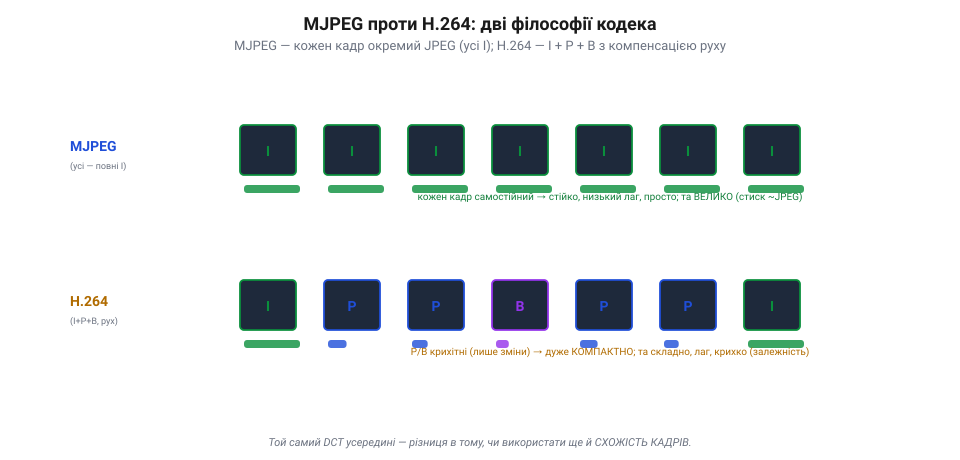
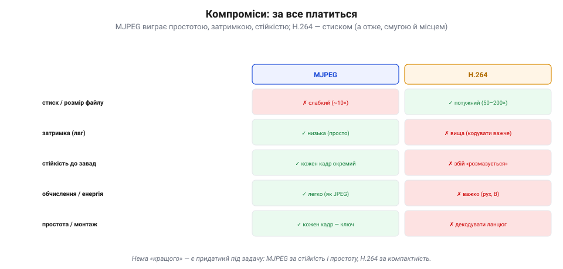

# MJPEG проти H.264: компроміси

Відео тиснуть двома двигунами стиснення — **просторовим** ([стиск кожного кадру окремо](topic:algorithms/jpeg-intra), як у JPEG) і **часовим** ([стиск різниці між кадрами](topic:algorithms/inter-frame), I/P-кадри). Реальні **кодеки** (від *coder-decoder* — «кодувальник-декодувальник») поєднують їх по-різному, і вибір сильно впливає на те, як відео поводиться на апараті. Порівняймо два крайні підходи: гранично простий **MJPEG** і всемогутній **H.264**.

### Дві філософії

**MJPEG** (*Motion JPEG*) — це найпростіше, що можна уявити: кожен кадр стискають **окремо**, як звичайний JPEG, і ніяк не використовують схожість кадрів. По суті, це **всі кадри — [I-кадри](topic:algorithms/inter-frame)** (повні, незалежні), без жодного P чи B.

*Дві філософії кодека. **MJPEG**: кожен кадр — окремий повний JPEG (усі I), усі однаково великі, та незалежні — звідси стійкість і малий лаг, але слабкий стиск (~як JPEG). **H.264**: I + P + B з компенсацією руху; P/B крихітні (лише зміни) — звідси дуже компактно, та складно, з лагом і крихкістю (залежність кадрів). Двигун-перетворення (DCT, а в H.264 — його цілочислове наближення) споріднений — різниця в тому, чи використати ще й схожість кадрів.*

**H.264** (*AVC*, *Advanced Video Coding*) — навпаки, видавлює максимум: повний набір **I-, P- і B-кадрів**, компенсація руху, розумне внутрішньокадрове передбачення. «Двигун»-перетворення всередині **споріднене** з JPEG-овим, хоч і не буквально те саме (H.264 бере не 8×8 DCT, а **цілочислове** 4×4/8×8 наближення); але H.264 використовує **ще й** схожість кадрів між собою — тож стискає в рази дужче. Головна різниця між ними не в «двигуні», а в тому, **чи експлуатувати [часовий надлишок](topic:algorithms/why-compress)**: MJPEG свідомо його ігнорує, H.264 — вичавлює до краплі.

### За все платиться

Здавалося б, H.264 кращий «у всьому» — навіщо тоді MJPEG? Бо за могутній стиск платять, і MJPEG виграє там, де ця плата завелика.

*Компроміси MJPEG ↔ H.264. За **стиском** H.264 перемагає вдесятеро-двадцятеро. Та MJPEG виграє за **затримкою** (простіше кодувати), **стійкістю** (кожен кадр окремий, збій не розмазується), **обчисленнями** (легкий, як JPEG) і **простотою** (кожен кадр — ключовий, легко гортати й різати). Нема «кращого» — є придатний під задачу.*

Ось ця плата. За **стиском** H.264 розгромлює MJPEG: 50–200 разів проти жалюгідних ~10. Та за все інше платить. **Затримка**: MJPEG простий, тож кодує-декодує майже миттєво; H.264 з його пошуком руху й B-кадрами думає довше — десятки мілісекунд [лагу на кодування](topic:programming/video-latency). **Стійкість**: у MJPEG кожен кадр **окремий**, тож завада псує лише його; у H.264 збій **розмазується** по [ланцюгу P/B-кадрів](topic:algorithms/inter-frame). **Обчислення й енергія**: MJPEG легкий, як JPEG; H.264 ненажерливий (пошук руху — важка робота). **Простота**: у MJPEG кожен кадр — ключовий, тож відео легко **різати й гортати**; у H.264 треба декодувати цілий ланцюг, щоб дістатися потрібного кадру. Тобто «кращого» нема — є **придатний під задачу**.

### Де що ставлять

Звідси й розподіл ролей на апараті.

*Де що ставлять. **MJPEG / intra-only** — де важать стійкість і незалежність кадрів: машинне бачення (чисті кадри без артефактів передбачення), прості камери, низьколатентний FPV, монтаж. **H.264 / H.265 / AV1** — де дорога смуга й місце: запис, стрім, HD-FPV у вузькому каналі, споживче відео. Часто на дроні — обидва, для різних потоків.*

**MJPEG** (чи будь-який *intra-only* режим) люблять там, де важить **стійкість і незалежність кадрів**. Найперше — **[машинне бачення](topic:algorithms/object-detection)**: алгоритмові потрібен **чистий, повний** кадр без артефактів передбачення й без «розмазування»; кожен кадр самодостатній — ідеально. Також — прості дешеві камери, реєстратори, низьколатентний стійкий FPV, монтаж (де треба легко гортати по кадрах). **H.264** (і молодші H.265/AV1) ставлять там, де **дорога смуга й місце**: запис польоту на картку, стрім у мережу чи хмару, HD-цифрове FPV у вузькому радіоканалі (DJI тощо), споживче відео взагалі. Часто на одному апараті живуть **обидва**: H.264 — для запису й передачі, а сирий чи MJPEG-потік — для бортового зору.

### Драбина кодеків

H.264 — не кінець історії. Кодеки йдуть драбиною, і кожне покоління тисне ще краще, ціною ще більших обчислень.

*Драбина кодеків. MJPEG (~10×, просто) → H.264/AVC (2003, ~50–200×) → H.265/HEVC (2013, ≈×2 до H.264, + роялті) → AV1 (2018, ≈H.265, але без роялті). Майже «закон»: кожне покоління ~вдвічі компактніше, та ~вдвічі ненажерливіше до обчислень. На дроні це впирається в бортовий чіп і затримку.*

Після H.264 (2003) прийшов **H.265** (*HEVC*, 2013) — приблизно **вдвічі** компактніший за ту саму якість, але й помітно важчий для кодування. Це майже «закон» кодеків: кожне покоління дає ще вдвічі менший файл, та вимагає ще вдвічі більше обчислень. На дроні це впирається прямо в **бортовий чіп** і **затримку**: новіший кодек заощадить смугу, але з'їсть процесор і додасть лагу.

> 📜 **Кодек без роялті — як суперечка про патенти накреслила, чим ти дивишся відео.** Новіші кодеки рухає не лише техніка, а й **гроші**. H.264 і H.265 — **запатентовані**: за їх використання треба платити роялті власникам патентів. Коли 2015-го власники HEVC заломили за ліцензію ще більше, ніж колись за H.264, велетні інтернету збунтувалися: **Amazon, Google, Netflix, Mozilla, Intel, Microsoft, Cisco** за лічені тижні скупчилися в **Alliance for Open Media** (вересень 2015) — і спільно зробили **AV1**, кодек **без жодних роялті** (готовий березень 2018). За якістю AV1 не гірший за H.265, зате вільний — тому його й узяли YouTube, Netflix та інші, щоб не платити данину за кожне відео. Так суперечка про патенти, а не лише про біти, визначила, яким кодеком ти дивишся відео сьогодні.

> 🔧 **Навіщо це.** Вибираючи кодек для апарата, питай не «який стискає найкраще», а «що мені дорожче». Дорога **смуга/пам'ять** — бери H.264/H.265. Дорогі **затримка чи стійкість** (FPV, керування) — ближче до MJPEG/intra. Працює **машинне бачення** — дай йому MJPEG чи сирий кадр, бо артефакти H.264 (блочність, розмазування) збивають детектори. І зваж бортовий **чіп**: новіший кодек заощадить ефір, але якщо процесор не тягне — додасть саме ту затримку, якої ти уникав.

### Що з цього лишається

Кодеки поєднують просторовий і часовий стиск по-різному, і вибір — це **компроміс**. **MJPEG** (усі кадри — окремі JPEG) простий, низьколатентний і стійкий (кожен кадр самостійний), та слабко стискає (~10×) — тож його місце там, де важать стійкість, темп і незалежність кадрів: машинне бачення, прості камери, монтаж. **H.264** (I+P+B, компенсація руху) стискає в рази дужче (50–200×), та платить складністю, затримкою, ненажерливістю й крихкістю ланцюга — його місце там, де дорога смуга й пам'ять: запис, стрім, HD-FPV. А над ними — драбина дедалі кращих, та важчих (і часом платних) кодеків: H.265, AV1. «Найкращого» кодека нема — є придатний під задачу й бортовий чип. А коли кодек уже обрано, налаштовують його, [крутячи три ручки разом](topic:algorithms/quality-bitrate) — **якість ↔ бітрейт ↔ затримка**.
