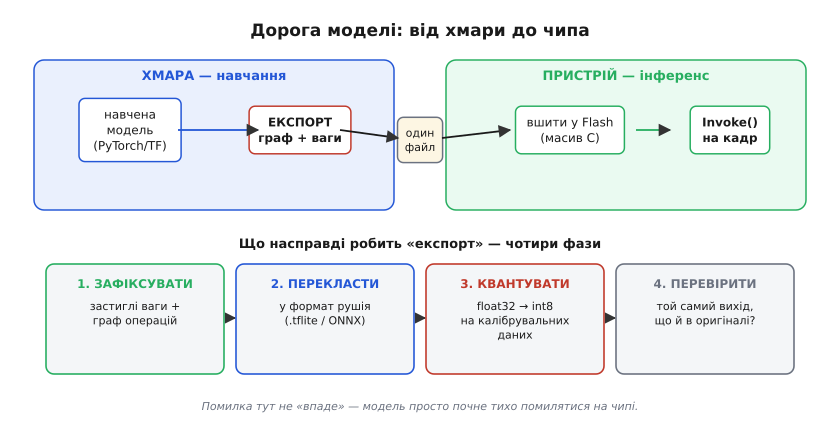
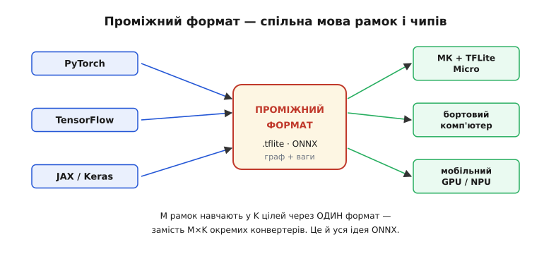

# Експорт і розгортання моделей ML

У попередніх кроках ми двічі підступали до однієї межі, але жодного разу її не перейшли. Коли ми вирішували, [де рахувати](root:embedded/where-to-compute), то домовилися: критичне за часом мусить жити на борту. Коли розбирали [інференс на пристрої](root:embedded/edge-inference), то почали з фрази «хтось у хмарі натренував мережу, стиснув її до розмірів мікроконтролера й дав тобі один файл — `.tflite` на кількадесят кілобайтів». Обидва рази ми мовчки прийняли цей файл як даність. Тепер настав час відкрити чорну скриньку: **звідки береться той файл і чому його так непросто зробити правильно.**

Питання здається технічною дрібницею — «зберегти модель у потрібному форматі». Насправді саме тут найчастіше ламаються бортові ML-проєкти, і ламаються найпідступнішим способом: модель, що в Python давала 98% точності, на чипі починає тихо помилятися — не падає, не лається, просто бачить людину там, де її немає, і не бачить там, де вона є. Жодної помилки в логах. Щоб такого не сталося, треба зрозуміти, **що насправді відбувається між «навчено» і «запущено»**.

## Прірва між хмарою і чипом

Почнімо з причини, чому експорт узагалі потрібен — чому не можна просто скопіювати навчену модель на пристрій як є.

Модель народжується у світі, який для мікроконтролера — інша планета. Її навчають у Python, усередині великої рамки на кшталт PyTorch чи TensorFlow; ваги лежать у дробових числах подвійної точності, граф обчислень існує як живий об'єкт мови, що його можна на ходу міняти, а під ним — гігабайти оперативної пам'яті й відеокарта. Це той самий світ, де живе [навчання](book:algorithms/train-vs-inference): жадібний до пам'яті, гнучкий, неспішний.

> 🔧 **Навіщо це.** Перша й найдорожча ілюзія новачка — що навчена модель це «файл, який можна перенести». Файл-то перенести можна, але **виконати** його на чипі нічим: там немає ні Python, ні рамки на сотні мегабайтів, ні дробового співпроцесора, ні вільної пам'яті під граф, що сам себе перебудовує. Між тренувальним і бортовим світом — прірва, і експорт це міст через неї, а не копіювання.

Пристрій — протилежність у всьому. Тут немає Python; є С чи С++, скомпільований у машинний код. Немає гнучкого графа; є фіксована послідовність операцій, відома наперед. Немає гігабайтів; є [десятки кілобайтів RAM і трохи більше Flash](root:embedded/memory-budget-mcu). Часто немає навіть [апаратного блока дробових обчислень](book:algorithms/fixed-point-implementation) — лише цілочисельне АЛУ. Світ навчання й світ інференсу розмовляють різними мовами й живуть за різними законами; **експорт** (від лат. *exportare* — «виносити назовні») — це переклад моделі з першого світу в другий.



*Дорога моделі. У хмарі модель навчають у гнучкій рамці; експорт виносить її назовні як один самодостатній файл, який на пристрої вшивають у Flash і крутять по кадру через `Invoke()`. Сам «експорт» — не одна дія, а чотири фази: зафіксувати граф і ваги, перекласти у формат рушія, квантувати в цілі числа на реальних даних, перевірити, що вихід не змінився. Помилка на будь-якій фазі не «впаде» — модель почне тихо помилятися.*

Як видно зі схеми, за словом «експорт» ховаються чотири різні дії, і кожна може зіпсувати результат по-своєму. Пройдімо їх по черзі — це і є кістяк усієї теми.

## Фаза перша: зафіксувати граф

Перше, що треба зробити з моделлю перед виносом, — **заморозити її**. У тренувальній рамці модель жива: її граф можна перебудовувати, у ній є цілі шматки, потрібні лише для навчання (випадкове відкидання нейронів, накопичення градієнтів, обчислення похибки), а ваги ще можуть змінюватися. Для інференсу все це зайве. Нам потрібен **застиглий зліпок**: фіксований граф операцій плюс сталі ваги — і жодного тренувального обвісу.

Чому це окрема фаза, а не дрібниця? Бо тренувальний граф і граф для виводу — **не одне й те саме**. Згадаймо з [інференсу](root:embedded/edge-inference): на пристрої ваги застиглі, і саме тому кожен виклик детермінований. Заморозка — це момент, коли ми робимо їх застиглими **назавжди** й викидаємо все, що мало сенс лише доти, доки модель училася. Деякі шари при цьому ще й **зливаються**: класичний приклад — нормалізація по батчу, яку під час навчання рахують окремо, а для інференсу математично вкручують прямо у ваги сусіднього згорткового шару. Менше операцій на пристрої — менше тактів на кожен кадр.

Результат цієї фази концептуально простий: **граф плюс ваги**, дві речі, які ми вже розкладали по пам'яті в попередньому кроці — граф визначає послідовність шарів, ваги лягають у Flash як велика константа. Але поки що вони сидять усередині тренувальної рамки. Винести їх назовні — наступна фаза.

## Фаза друга: перекласти у формат рушія

Тепер найцікавіше питання теми: **у якому вигляді винести модель, щоб її прочитав бортовий рушій?**

Очевидна, але хибна відповідь — «у форматі тієї рамки, де навчали». Кожна рамка має свій спосіб зберігати модель, і ці способи прив'язані до самої рамки: щоб прочитати збереження PyTorch, потрібен PyTorch, а він на чип не влізе ніколи. Виходить глухий кут: формат, у якому модель збережено, не вміє читати ніхто, крім важкого тренувального двигуна.

Розв'язок — **проміжний формат**: одна спільна мова, у яку вміє виносити будь-яка рамка й яку вміє читати будь-який рушій. Ідея та сама, що з PDF: ти верстаєш у Word чи в LaTeX, а роздаєш PDF, бо його відкриє кожен, незалежно від того, у чому документ народився.



*Чому проміжний формат рятує. Якби кожна рамка з'єднувалася з кожною ціллю напряму, знадобилося б M×K окремих конвертерів. Спільний формат розриває цю комбінаторику: рамка виносить у формат (M шляхів), рушій читає з формату (K шляхів) — разом M+K. Саме цю проблему й розв'язує ONNX, а на боці мікроконтролерів — формат `.tflite`.*

Таких спільних мов на практиці дві, і варто розрізняти їх.

**`.tflite`** — формат, у який виносять для дрібних пристроїв; його читає [TFLite Micro](root:embedded/edge-inference), фактичний стандарт інференсу на мікроконтролерах. Усередині це компактний бінарний зліпок графа й ваг, спеціально обрізаний під чипи без операційної системи. Цікаво, що сам формат уже не прив'язаний до TensorFlow, хоч і виріс із нього: восени 2024-го Google перейменував TensorFlow Lite на **LiteRT** (Lite Runtime) саме тому, що рушій навчився виконувати моделі з PyTorch, JAX і Keras, а не лише з TensorFlow; розширення файлів лишилося тим самим — `.tflite`. [Як TFLite виріс у багаторамковий LiteRT](root:embedded/model-export/hist-tflite-litert.md) — коротка історія окремо.

**ONNX** (англ. *Open Neural Network Exchange* — «відкритий обмін нейромережами») — універсальніша спільна мова, не прив'язана до жодного виробника. Її задумали саме як той PDF для моделей: навчив у будь-чому — виніс в ONNX — запустив будь-де. Для бортового комп'ютера (Raspberry Pi, Jetson) ONNX часто і є робочим форматом; для крихітного мікроконтролера ланцюжок звичайно довший — модель спершу виносять в ONNX, а тоді переганяють у `.tflite`. [Звідки взявся ONNX і чому його зробили саме відкритим](root:embedded/model-export/hist-onnx.md) — варта уваги історія про рідкісну згоду конкурентів.

> 🔧 **Навіщо це.** Вибір формату — це вибір, на чому модель **поїде**. Правило просте: ціль — мікроконтролер → виноси в `.tflite` (його читає TFLite Micro з [кроку про інференс](root:embedded/edge-inference)); ціль — бортовий комп'ютер чи будь-яке залізо потужніше → ONNX як універсальний обмінний формат. Помилка тут видна одразу — рушій просто не відкриє чужий файл, — і це **найдобріша** з усіх помилок експорту, бо чесно падає, а не бреше мовчки. Справжні граблі починаються на наступній фазі.

## Фаза третя: квантувати — і саме тут ховаються граблі

Ось де експорт перестає бути перекладом і стає **перетворенням, що може непомітно зіпсувати модель**.

Пригадаймо з [інференсу](root:embedded/edge-inference): на чипі числа не дробові, а цілі восьмибітні (int8) — бо так модель займає вчетверо менше пам'яті й рахується набагато швидше на чипах без дробового блока. Але навчають модель у **дробових** числах повної точності. Хтось мусить перекласти ваги з float32 у int8 — і цей хтось саме експорт. Перетворення float → int зветься **квантуванням** (від лат. *quantum* — «скільки», бо неперервну величину розбивають на скінченну кількість порцій-сходинок).

Зв'язок між цілим і справжнім значенням, як ми бачили, лінійний — через два числа на тензор, **масштаб** і **нульову точку**:

```
справжнє ≈ масштаб · (ціле − нульова_точка)
```

Уся хитрість — у тому, **звідки взяти масштаб**. Масштаб це ціна однієї поділки: на скільки реальної величини тягне приріст цілого на одиницю. А щоб її обчислити, треба знати **діапазон** значень — наскільки малими й великими бувають числа, що течуть через модель. Для ваг це легко: вони застиглі, бери мінімум і максимум та й по тому. А от для **активацій** — чисел, що течуть між шарами, — біда: вони залежать від того, **що подали на вхід**, і наперед їхній розмах невідомий.

Розв'язок винахідливий: показати моделі **жменю типових прикладів** і подивитися, які числа реально течуть усередині. Це і є **калібрування** — прогін через модель невеликого **калібрувального набору** (representative dataset): сотні-тисячі справжніх кадрів із тієї задачі, де модель працюватиме. Експорт спостерігає за активаціями на цих прикладах, бачить їхній реальний розмах і саме під нього розкладає 256 рівнів int8.


*Чому калібрування критичне. Експорт мусить розкласти 256 цілих рівнів на діапазон реальних активацій — а діапазон видно лише з даних. Замало прикладів — і межі стануть вузькими: справжні піки в польоті вилізуть за край і обріжуться (clip), модель «осліпне» на яскравому. Дані не з тієї задачі — і межі роздуються: поділки стануть грубими, дрібні відмінності потонуть. Калібрувальний набір має бути малим, але **чесно типовим**.*

Звідси два способи квантувати, і різниця між ними — практична.

**Квантування після навчання** (post-training quantization) — простіше: береш уже навчену модель і квантуєш її на калібрувальному наборі прямо під час експорту. Окремо нічого вчити не треба, усе робиться за один прогін. Для більшості бортових задач цього досить.

**Квантування з урахуванням під час навчання** (quantization-aware training) — складніше й точніше: модель ще на етапі навчання «знає», що житиме в int8, і вчиться бути стійкою до згрубіння. Дає трохи кращу точність на тих моделях, де просте квантування помітно псує результат, але коштує переучування. Глибше про обидва підходи й про те, чому округлення до 256 рівнів мережа здебільшого переживає, — у книжковій темі про [квантування нейромереж](book:algorithms/model-quantization).

> 🔧 **Навіщо це.** Це найважливіша рамка всієї теми. Квантування — єдина фаза експорту, яка **псує модель тихо**: формат правильний, файл відкривається, `Invoke()` працює — а точність просіла, бо калібрувальний набір був куций чи не з тієї задачі. Тому залізне правило: калібруй на **справжніх** кадрах із бойових умов (те освітлення, ті ракурси, той фон), а не на стокових картинках, і **обов'язково зміряй точність до й після** квантування. Якщо просіла недопустимо — переходь на квантування з урахуванням під час навчання. Не зробив цього кроку — і дрон «осліпне» рівно тоді, коли цього найменше чекаєш.

## Фаза четверта: перевірити, що вихід не змінився

Після заморозки, перекладу й квантування на руках — компактний файл. Спокуса велика: вшити його у прошивку й летіти. **Не роби цього без перевірки.** Кожна попередня фаза могла непомітно зрушити поведінку моделі, і єдиний спосіб дізнатися — **порівняти виходи**.

Перевірка проста за ідеєю. Береш ту саму жменю прикладів, проганяєш їх **через оригінальну модель** у Python (дробову, повної точності) і **через експортований файл** через той самий рушій, що стоятиме на пристрої. Тоді дивишся, чи виходи збігаються. Не до останнього біта — квантування на те й квантування, щоб трохи згрубити, — а **по суті**: чи той самий клас перемагає, чи близька впевненість, чи не з'явилися дикі розбіжності.

```cpp
// Перевірка на хості ПЕРЕД прошиванням: вихід .tflite ≈ вихід оригіналу?
// Один тестовий кадр; на практиці — проганяють сотні.
float ref_score  = 0.92f;          // що дала оригінальна float-модель у Python
float lite_score = run_tflite(test_frame);   // що дає експортований .tflite

float diff = fabsf(ref_score - lite_score);
if (diff > 0.05f) {                 // поріг — інженерне рішення під задачу
    printf("УВАГА: експорт зрушив вихід на %.3f — калібрування?\n", diff);
    // НЕ прошивати: спершу розібратися, що пішло не так на фазах 1-3.
}
```

Якщо виходи розійшлися — це сигнал, що щось на фазах 1–3 пішло не так, найчастіше калібрування. Дешевше зловити це **тут**, на столі, ніж на летючому апараті. Це той самий принцип, що й у [тестуванні прошивки](root:embedded/firmware-testing): проблему ловлять якнайраніше й якнайдешевше, поки вона ще не в полі. Повний стенд порівняння — з прогоном цілого набору, метрикою розбіжності й автоматичним вердиктом — зібрано у [перевірці експортованої моделі](root:embedded/model-export/proj-export-validation.md).

## Останній крок: модель стає масивом С

Файл перевірено — лишається посадити його на чип. Тут вилазить дрібниця, очевидна вбудованику, але неочікувана для тих, хто прийшов зі світу великих машин: **на мікроконтролері немає файлової системи**, з якої можна було б «відкрити модель». Звичайному комп'ютеру даєш шлях до `.tflite` — і рушій його прочитає; на голому чипі читати нема звідки й нема чим.

Тому модель **перетворюють на масив байтів прямо в коді** й компілюють разом із прошивкою — так само, як будь-яку велику константу. Це робить маленька утиліта (класичний `xxd -i` чи кілька рядків Python), що бере бінарний файл і друкує його як ініціалізований С-масив:

```cpp
// model_data.h — згенеровано з model.tflite, вшивається у Flash як константа.
// alignas(16): TFLite Micro вимагає вирівняний буфер під модель.
alignas(16) const unsigned char g_model[] = {
    0x1c, 0x00, 0x00, 0x00, 0x54, 0x46, 0x4c, 0x33,   // "TFL3" — підпис формату
    0x14, 0x00, 0x20, 0x00, 0x1c, 0x00, 0x18, 0x00,
    /* ... ще десятки кілобайтів байтів моделі ... */
};
const unsigned int g_model_len = sizeof(g_model);
```

Цей `g_model[]` — рівно той масив, який ми вже бачили в коді інференсу: пам'ятаєш `#include "model_data.h"` і `tflite::GetModel(g_model)`? Ось звідки він береться. Слово `const` тут навмисне: воно велить компілятору покласти масив у **Flash**, а не копіювати в дефіцитну RAM — саме там, де ми й хотіли бачити сталі ваги. Коло замкнулося: модель, що народилася як живий об'єкт у Python, доїхала до чипа як вирівняна константа у Flash, готова до `Invoke()`.

> 🔧 **Навіщо це.** Перетворення моделі на С-масив — це місточок між світом файлів і світом голого заліза, і в ньому є дві типові пастки. Перша: забути `const` — і лінкер потягне ваги в RAM, якої й так обмаль, а часом і взагалі не влізе. Друга: забути вирівнювання (`alignas(16)`) — і TFLite Micro або сповільниться на читанні, або впаде на старті. Зробив обидві речі правильно — і «розгортання моделі» зводиться до того, що в проєкт додається ще один згенерований заголовок, який оновлюєш щоразу, коли перетренував модель.

## Уся дорога одним поглядом

Складімо чотири фази в один маршрут, бо саме як маршрут їх і треба тримати в голові. Модель проходить його щоразу, коли ти міняєш її й хочеш оновити на апараті:

```
навчена модель (PyTorch/TF, float32, у хмарі)
   │  1. ЗАМОРОЗИТИ — застиглий граф + ваги, без тренувального обвісу
   ▼
   │  2. ПЕРЕКЛАСТИ — у проміжний формат (.tflite для МК, ONNX для більшого)
   ▼
   │  3. КВАНТУВАТИ — float32 → int8 на калібрувальному наборі
   ▼
   │  4. ПЕРЕВІРИТИ — вихід .tflite ≈ вихід оригіналу? (на столі!)
   ▼
   │  5. ВШИТИ — у С-масив (const, alignas) → Flash разом із прошивкою
   ▼
g_model[] на чипі → Invoke() на кожен кадр
```

Цей маршрут — не разова дія, а **частина циклу розробки**. Перетренував модель на нових даних — проганяй усі п'ять кроків наново. Тому розумні команди роблять його **автоматичним**: один скрипт, що бере свіжу навчену модель і видає готовий заголовок із перевіркою точності всередині, щоб людина не забула жоден крок. Як саме збирати такий конвеєр і коли його варто заводити — тема наступних кроків про [бенчмаркінг на пристрої](root:embedded/on-device-benchmarking) (де зміряємо реальну ціну вже розгорнутої моделі) і про [підготовку навчальних даних](root:embedded/training-data-pipeline) (звідки, до речі, береться той самий калібрувальний набір).

## Підсумок теми

Між «модель навчено» і «модель працює на борту» лежить **експорт** — переклад моделі з гнучкого тренувального світу (Python, дробові числа, гігабайти, живий граф) у жорсткий світ чипа (С, цілі числа, кілобайти, фіксований граф). Це не копіювання файлу, а чотири фази, кожна зі своєю пасткою. **Заморозка** робить граф і ваги застиглими й викидає тренувальний обвіс. **Переклад** виносить модель у проміжний формат — спільну мову рамок і рушіїв: `.tflite` для мікроконтролера (його читає TFLite Micro, від 2024-го — LiteRT), ONNX для потужнішого заліза; ця помилка чесно падає. **Квантування** перекладає float32 у int8, і саме воно псує модель **тихо**, якщо калібрувальний набір куций чи не з тієї задачі, — тому калібруй на справжніх кадрах і завжди мір точність до й після. **Перевірка** ловить усі тихі зсуви на столі, порівнюючи виходи оригіналу й експорту, поки апарат ще не злетів. А **розгортання** на голому чипі без файлової системи зводиться до того, що модель стає вирівняним `const`-масивом байтів у Flash — рівно тим `g_model[]`, який ми смикали в кроці про інференс. Коло замкнулося: один скрипт від навченої моделі до готового заголовка, який ганяють щоразу при перетренуванні, — і «штучний інтелект на дроні» перестає бути магією й стає відтворюваним кроком складання прошивки.
