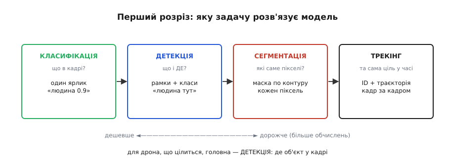
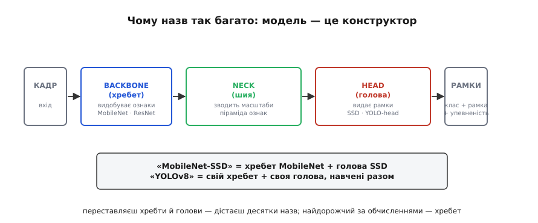
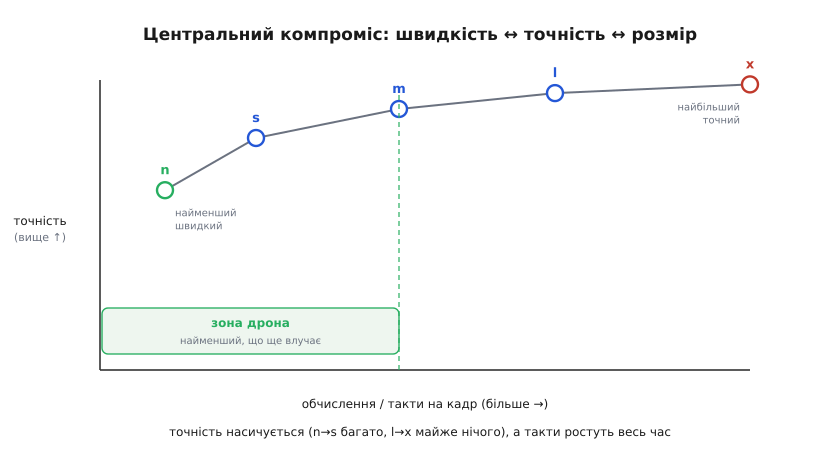

# Зоопарк моделей детекції: як читати назви й вибирати під дрон

Ми вже [вирішили рахувати на борту](root:embedded/where-to-compute) — критичне за часом не виносять у хмару, тож детектор має жити на самому апараті. І ми вже знаємо, [як узагалі запустити навчену модель на чипі](root:embedded/edge-inference): прочитати `.tflite`, розкласти тензори раз, а потім щокадру смикати `Invoke()`. Лишилося питання, повз яке не пройти жодному, хто береться за бортовий зір уперше: **яку саме модель брати?**

Бо щойно ти відкриєш будь-який репозиторій чи статтю про детекцію, на тебе виваляться десятки назв — YOLOv5, YOLOv8, SSD, MobileNet-SSD, EfficientDet, NanoDet, Faster R-CNN, RetinaNet — кожна з варіантами n, s, m, l, x, з версіями, форками й суперечками про те, яка «найкраща». Це й є **зоопарк** (від гр. *zōon* — «жива істота»): не одна модель, а ціла фауна архітектур, що плодилися десятиліття. Новачок тоне в назвах і хапає першу-ліпшу «найточнішу» — і вона не лізе на його чип.

Ця тема — не про математику детекції (її розбирає [окремий book-атом про нейродетектори](topic:sf-visual/nn-detectors)) і не про те, як запустити модель (це ми вже пройшли). Вона про **орієнтацію**: як читати назви, за якими осями зоопарк ділиться на родини, і як із-поміж усіх вибрати ту єдину, що влізе у твої такти, байти й ват.

## Перший розріз: яку задачу модель узагалі розв'язує

Найперша й найгрубіша помилка новачка — сплутати **задачі** зору. Назва моделі насамперед каже не «яка вона хороша», а **що саме** вона вміє виводити. Завдань чотири, і вони стоять сходинками — від легшого до важчого.


*Перший розріз зоопарку — за задачею. **Класифікація**: один ярлик на весь кадр («тут є людина»), але не каже де. **Детекція**: рамки плюс класи — що і ДЕ. **Сегментація**: маска по контуру, кожен піксель віднесено до об'єкта. **Трекінг**: та сама ціль із тим самим ID кадр за кадром. Що правіше — то більше обчислень. Дрону, що цілиться, потрібна насамперед детекція.*

**Класифікація** (*classification*) — найдешевша: модель дивиться на кадр і видає **один ярлик** на весь кадр, «це кіт» чи «тут людина». Вона не каже **де** — лише **що**. Це власне те, що тягне навіть [крихітна TinyML-модель на мікроконтролері](topic:sf-ml/tinyml): слово-команда, жест, груба класифікація сцени.

**Детекція** (*detection*) — на сходинку важча й саме та, що потрібна дрону: модель видає **список рамок**, кожна з класом і впевненістю — «людина тут, авто там». Це і є вихід, з якого апарат дістає **кут** на ціль, щоб за нею йти. Решта цієї теми — про детектори.

**Сегментація** (*segmentation*) — ще важча: модель малює **маску** по самому контуру об'єкта, відносячи кожен піксель. Дорого, і дрону зазвичай зайве — рамки досить, щоб навестися.

**Трекінг** (*tracking*) стоїть осторонь: це вже не «що в кадрі», а «та сама ціль у часі» — присвоїти знахідці сталий ID і вести її траєкторію крізь кадри. Технічно це окремий шар поверх детектора; його розбирає [book-атом про трекінг](topic:sf-visual/tracking).

> 🔧 **Навіщо це.** Перш ніж навіть дивитися на назви, спитай: **що мені треба вивести?** Як на твоєму дроні має реагувати система — «є людина в кадрі / нема» — досить **класифікації**, і вона на порядок дешевша, влізе ледь не в сам політний контролер. Треба знати **куди** дивитися (навестися, обігнути, порахувати об'єкти) — це **детекція**, бери детектор. Помилка «візьму найкращу модель» без цього питання коштує тактів і ват за роботу, якої задача й не вимагала.

## Чому назв так багато: модель — це конструктор

Тепер головне прозріння, що розплутує половину зоопарку. Більшість назв здаються окремими «винаходами», та насправді детектор **збирають із кубиків**, і назва часто — просто перелік кубиків.


*Чому назв так багато: детектор — конструктор із трьох частин. **Backbone** (хребет) проганяє кадр крізь стос згорток і видобуває ознаки — він з'їдає левову частку обчислень, тому його часто беруть готовий (MobileNet, ResNet). **Neck** (шия) зводить ознаки різних масштабів у піраміду, щоб ловити й велике, й дрібне. **Head** (голова) перетворює ознаки на рамки з класами. «MobileNet-SSD» = хребет MobileNet плюс голова SSD; переставляєш хребти й голови — і дістаєш десятки назв.*

Будь-який сучасний детектор — це конвеєр із трьох ланок. **Хребет** (*backbone*) — стос [згорток](topic:sf-ml/cnn), що проганяє кадр і витягує ознаки: спершу краї, далі текстури, тоді частини об'єктів. Це **найдорожча** за обчисленнями частина, бо саме тут крутиться основна гора множень. **Шия** (*neck*) бере ознаки з різних глибин хребта й **зводить масштаби** в спільну піраміду — щоб мережа однаково бачила і велику ціль зблизька, і дрібну вдалині. **Голова** (*head*) — кілька шарів, що з готових ознак ліплять кінцевий **список рамок** із класом і впевненістю.

Звідси й вибух назв. Хребет — деталь майже **змінна**: його часто беруть **готовий**, навчений окремо розпізнавати тисячі образів, і приставляють до нього свою голову. Найвідоміший такий хребет — **MobileNet**: сімейство легких мереж, що 2017-го випустила команда Ендрю Говарда (Howard et al.) у Google саме для мобільних і вбудованих застосунків. Його трюк — **роздільна згортка** (depthwise separable convolution): звичайну згортку розкладають на дві дешевші, і та сама робота коштує в рази менше множень. (Ідея старша за сам MobileNet — її ще 2013-го намацав Лоран Сіфр, а 2016-го розкрутив Франсуа Шолле в архітектурі Xception; MobileNet лише довів її до краю заради компактності.) Тому MobileNet вічно спливає в назвах: «MobileNet-SSD» — це хребет MobileNet із головою SSD. Та сама голова на іншому хребті — інша назва й інша ціна.

> 🔧 **Навіщо це.** Читай назву як рецепт, а не як магічне слово. «MobileNet-SSD» одразу каже тобі найважливіше для бортового бюджету: хребет — **легкий** (MobileNet), значить, модель радше влізе на дешевий чип, а голова — SSD (одноетапна, швидка). Побачив у назві важкий хребет на кшталт ResNet-101 — насторожся: точність буде вища, але [гора MAC-ів](root:embedded/edge-inference), а отже, і латентність, теж. Хребет — твій головний важіль ціни; міняючи його, ту саму задачу можна посадити то на Jetson, то на голий Pi.

## Одноетапні проти двоетапних: чому дрон живе зліва

Глибший поділ зоопарку — **історичний**, і він пояснює, чому половину «найточніших» моделей дрону навіть не варто розглядати. Детектори народилися у двох таборах.

**Двоетапні** (*two-stage*) — старша й точніша гілка. Спершу окрема підмережа пропонує **області-кандидати** («тут може щось бути»), а тоді друга мережа кожну область **роздивляється й класифікує**. Канон цього табору — **Faster R-CNN** (Шаосін Жень із колегами, 2015): він уперше вбудував генерацію кандидатів у саму мережу й цим прискорив сімейство R-CNN. Два проходи дають **високу точність**, особливо на дрібних і тісних об'єктах, — але платять **швидкістю**: класичний Faster R-CNN на серйозному залізі видає одиниці кадрів за секунду. Для нерухомого аналізу фото це чудово; для дрона, що мусить реагувати **зараз**, — ні.

**Одноетапні** (*one-stage*) — молодша гілка, придумана заради швидкості. Вона викидає окремий етап пропозицій і за **один прохід** одразу видає і рамки, і класи — звідки й девіз родини YOLO: *You Only Look Once*, «дивишся лише раз». До цього ж табору належить **SSD** (*Single Shot MultiBox Detector*, Вей Лю з колегами, 2016): він додав **прив'язні рамки** (anchors) різних розмірів і передбачення з кількох масштабів одразу, чим підтягнув точність одноетапника, особливо на дрібному, майже не втративши у швидкості. Один прохід коштує **набагато менше**, тож саме одноетапні моделі дають **реальний час** на бортовому залізі.

Висновок для нас прямий: **дрон майже завжди живе в таборі одноетапних**. Контур керування не може чекати на два проходи важкої мережі — йому потрібна знахідка щокадру, нехай і трохи грубіша. Двоетапні лишаються для офлайнового, не термінового аналізу — того, що [спокійно віддають у хмару](root:embedded/where-to-compute).

## Лінія YOLO: чому це не одна модель, а ціла родина зі складною історією

Найгучніша назва зоопарку — **YOLO**, і саме навколо неї найбільше плутанини, бо це **не одна модель і навіть не один автор**. Перші версії (v1–v3, 2015–2018) зробили Джозеф Редмон і Алі Фархаді в Університеті Вашингтона — і саме вони задали девіз «дивишся лише раз». Але 2020-го Редмон **публічно покинув** комп'ютерний зір, прямо назвавши причиною те, що його дослідження йшли у військові застосунки й стеження, з якими він не хотів мати справи. Розробку підхопили інші команди й компанії — звідси гілки v4, v5, v8, v11 від різних авторів, із суперечками про нумерацію, ліцензії та про те, що взагалі має право зватися «YOLO». [Ця історія варта окремої розповіді](root:embedded/model-zoo/hist-yolo-redmon.md) — і як технічна еволюція, і як рідкісний випадок, коли творець інструмента відмовився від нього з етичних міркувань.

Практику з усієї цієї саги треба винести одне. По-перше, **«YOLO» — це родина**, а не модель: кажучи «беремо YOLO», ти ще нічого не сказав, поки не назвав **версію** й **розмір**. По-друге, новіший номер **не завжди кращий** під твою задачу — пізніші версії додають можливостей (сегментацію, оцінку пози), але важчають, а на дрібному вбудованому залізі стара добра компактна версія часто виграє. По-третє, ліцензія — це теж інженерне рішення: різні гілки YOLO мають **різні умови використання**, і це треба перевірити **до** того, як закладати модель у виріб.

## Центральний компроміс: один важіль, три наслідки

Тепер найголовніше, заради чого все й затівалося. Усередині однієї родини моделі дають **варіантами розміру** — найчастіше їх п'ять, позначених `n`, `s`, `m`, `l`, `x` (від *nano*, *small*, *medium*, *large*, *extra-large*). Це **одна й та сама архітектура**, лише «ширша» й «глибша»: більший варіант має більше шарів і ваг. І цей єдиний важіль тягне за собою **три** наслідки, які не можна розв'язати окремо.


*Центральний закон зоопарку. Варіанти n→x однієї родини лягають на криву, що **насичується**: від n до s точність стрибає сильно, а від l до x — майже не росте. А ось обчислення (а з ними латентність і споживання) ростуть **весь час**, лінійно з розміром. Тому дрон сидить **ліворуч**: бере найменший варіант, що ще дотягує до потрібної точності, — платити тактами за останні частки відсотка немає сенсу.*

Збільшуєш модель — **точність росте**, але **латентність росте** (більше [MAC-ів на прохід](root:embedded/edge-inference)) і **розмір росте** (більше ваг у Flash). Гарна звістка в тому, що точність **насичується**: перші сходинки вгору дають багато, останні — копійки. Подивімося на конкретні числа однієї відомої родини, щоб відчути масштаб.

**Умова.** П'ять варіантів YOLOv8, заміряні на одному GPU (числа з документації Ultralytics). Дивимося на ваги, точність (mAP — усереднена влучність детекції, 0…100) і час одного проходу.

```
варіант   ваг (млн)   точність mAP   час/кадр (GPU)
  n           2.0          47           5.8 мс
  s           9.0          59           6.0 мс
  m          25.0          66           7.8 мс
  l          55.0          70           9.8 мс
  x          90.0          72          11.5 мс

приріст точності  n→s = +12,  але  l→x = лише +2
приріст ваг       n→s = ×4.5,       l→x = ×1.6 (з 55 до 90 млн!)
```

Прочитай ці два останні рядки разом — у них уся наука вибору. Стрибок від `n` до `s` коштує вчетверо більше ваг і дає **аж дванадцять** пунктів точності. Стрибок від `l` до `x` коштує ще тридцять п'ять мільйонів ваг — і дає **жалюгідні два** пункти. На дрібному бортовому залізі, де кожен мегабайт Flash і кожен такт на рахунку, платити за ці два пункти — марнотратство. Тому дрон майже завжди бере найменший варіант, **що ще дотягує** до потрібної точності, і ні крихтою більший.

> 🔧 **Навіщо це.** Не питай «яка модель найточніша» — це питання веде просто в `x` і просто у провал на твоєму чипі. Питай **навпаки**: «який **найменший** варіант ще влучає достатньо для моєї задачі?» Постав поріг точності, якого вимагає робота (наприклад, «не пропустити людину в 95 випадках зі 100»), і бери найдрібнішу модель, що його дає. Останні відсотки точності коштують непропорційно багато тактів і байтів — а саме їх у тебе й бракує. І пам'ятай: число `mAP` зміряне на потужному GPU; на твоєму борту вирішує **час проходу на твоєму чипі**, а його ще треба [виміряти насправді](root:embedded/on-device-benchmarking), бо теоретична оцінка систематично бреше.

## Як це лягає у вибір під дрон

Зберімо все в один практичний порядок дій. Вибір моделі для апарата — це не пошук «найкращої», а **проходження сита** з кількох питань поспіль, кожне з яких відсікає половину зоопарку.

**Перше — задача.** Що треба вивести: ярлик (класифікація), рамки (детекція) чи маску (сегментація)? Це одразу відкидає три чверті назв. Дрону, що наводиться, — детекція.

**Друге — табір.** Реальний час на борту → **одноетапні** (YOLO, SSD, NanoDet). Двоетапні (Faster R-CNN) лишаємо хмарі.

**Третє — залізо й хребет.** Скільки в тебе обчислень? На голий мікроконтролер детектор **не лізе** — там живе лише класифікація. Бортовий комп'ютер (Raspberry Pi, Jetson) тягне справжні детектори, і тут вибір хребта вирішує все: легкий MobileNet чи спеціалізований під край NanoDet — для слабкого заліза, важчий хребет — лише якщо є прискорювач.

**Четверте — розмір варіанта.** Усередині обраної родини бери **найменший** `n`/`s`, що дає потрібну точність, і перевіряй його **на самому чипі**.

Для зовсім тісного бюджету варто знати конкретні крайні точки зоопарку. **NanoDet** (NanoDet-Plus) спроектований саме під край: його хребет — близько 1.8 мільйона ваг, уся модель важить менш як 2 мегабайти, а після [стиснення в int8](root:embedded/edge-inference) — менш як мегабайт, і на одному ядрі ARM він видає десятки кадрів за секунду. Це інший полюс від важких детекторів — і часто саме він, а не наймодніша YOLO, виявляється правильним вибором для маленького апарата. Готовий каркас, що приймає виміряний бюджет латентності й сам обирає найбільший варіант, який у нього влазить, зібрано у [вставці-проєкті](root:embedded/model-zoo/proj-choose-by-budget.md).

Коли модель обрано, лишаються ще два кроки курсу, які ми пройдемо далі: її треба [перетворити на бортовий формат і розгорнути](root:embedded/model-export), а потім **чесно зміряти на залізі** — бо, як ми вже бачили, теорія MAC-ів дає лише грубу прикидку, а правду каже [бенчмарк на самому пристрої](root:embedded/on-device-benchmarking).

## Підсумок теми

Зоопарк моделей детекції лякає кількістю назв, та розкладається за кількома простими осями. **Перша** — задача: класифікація (ярлик), детекція (рамки), сегментація (маска), трекінг (ціль у часі); дрону, що наводиться, потрібна детекція. **Друга** — будова: модель збирають із кубиків — хребет (видобуває ознаки, найдорожчий, часто готовий — як MobileNet), шия (зводить масштаби), голова (видає рамки); тому «MobileNet-SSD» читається як рецепт, а не магічне слово. **Третя** — табір: одноетапні (один прохід, швидкі — YOLO, SSD, NanoDet) проти двоетапних (два проходи, точніші, повільні — Faster R-CNN); дрон майже завжди ліворуч, бо контур керування не чекає. **YOLO** при цьому — не модель, а родина зі складною, частково етичною історією (Редмон, що покинув зір через військові застосунки; форки різних авторів), тож завжди уточнюй версію й ліцензію. А **центральний важіль** — розмір варіанта `n`/`s`/`m`/`l`/`x`: точність насичується (n→s багато, l→x майже нічого), а такти й байти ростуть весь час, тож правильне питання не «яка найточніша», а «який **найменший** варіант ще влучає». Вибір моделі — це проходження сита: задача → табір → залізо й хребет → найдрібніший варіант, що дотягує, — і обов'язкова перевірка **на самому чипі**, бо теорія тут систематично бреше.
