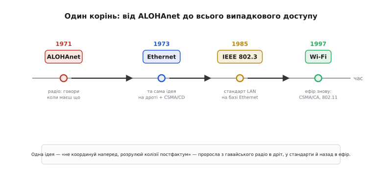

# 📜 ALOHAnet: як хаос на Гаваях став основою всього бездротового

У попередньому кроці ми вивели дві філософії доступу — суворий розклад і вільне «навперебій» — і вже назвали мережу, з якої виросла вся друга гілка. Тут варто спинитися й розглянути її уважно, бо це один із тих рідкісних випадків, коли цілий клас технологій можна простежити до **одної** інженерної відчайдушності в одному конкретному місці. Wi-Fi у тебе вдома, Ethernet у стіні, спосіб, у який твій телефон уперше «гукає» базову станцію стільникової мережі, — усе це говорить діалектом мови, яку придумали, щоб розв'язати дуже приземлену гавайську проблему: **як з'єднати комп'ютер на одному острові з терміналами, розкиданими по інших, коли тягнути кабель через океан безглуздо**.

І найкрасивіше тут — рішення. Воно настільки просте, що першою реакцією інженера буває «так не може працювати»: дозвольмо всім говорити коли заманеться, а зіткнення розгрібатимемо потім. Зараз ми побачимо, **чому** до цього дійшли, **хто** його зробив і **чому** воно справді працює — попри те, що на перший погляд має тонути в хаосі.

## Острови, термінали й одна велика машина

На зламі 1960-х комп'ютер був рідкісним і дорогим звіром. У Гавайському університеті (University of Hawaiʻi) в Гонолулу на острові Оаху стояв великий мейнфрейм — машина з розділенням часу (*time-sharing* — коли одна потужна машина по черзі обслуговує багатьох користувачів, створюючи кожному ілюзію, що вона його). Користуватися ним хотіли не лише на головному кампусі, а й у дослідницьких осередках на інших островах архіпелагу та в віддалених частинах самого Оаху.

Звичний на материку спосіб — телефонні лінії: орендуєш у телефонної компанії виділений провід від кожного термінала до машини, і термінал стукає по ньому символами. Але Гаваї — це розкидані вулканічні острови серед океану. Прокладати й орендувати дроти між островами — повільно, шалено дорого, а наявні телефонні лінії там були ще й кепської якості для даних. Сама географія підказувала очевидне: якщо дроти не годяться — **візьмімо радіо**. Ефір над островами безкоштовний і вже там; треба лише навчити комп'ютери говорити по ньому.

Та щойно ти кажеш «радіо для багатьох терміналів», ти впираєшся рівно в ту проблему, з якої починалася наша тема: **спільне середовище**. Один передавач на острові гукає центральну машину — добре. Але терміналів багато, усі вони хочуть слати дані на **ту саму частоту** до **тієї самої** машини, і роблять це тоді, коли людина за терміналом натиснула клавішу — тобто **непередбачувано**. Якщо двоє натиснуть майже одночасно, їхні радіопакети накладуться в приймачі центральної станції — і станеться [колізія](root:embedded/multiple-access-methods), знищивши обидва. Як цьому дати раду без дротів і без центрального диригента, що роздавав би всім черги?

> 🔧 **Навіщо це.** Та сама задача стоїть перед тобою щоразу, коли ставиш на плату радіомодуль, який ділить ефір з багатьма такими ж: десяток датчиків, що шлють телеметрію на один шлюз, рій дронів на спільному каналі, кімната пристроїв розумного дому. Гавайська відповідь 1971 року — це не музейний експонат, а **дефолтний шаблон**, за яким досі будують такі мережі. Зрозумівши її в оригіналі, ти зрозумієш, чому твій вузол поводиться саме так під навантаженням.

## Дві людини, що зустрілися в Гонолулу

Очолив цю роботу **Норман Абрамсон** (Norman Abramson, 1932–2020) — інженер-електрик і науковець. Тут варто бути точним з ідентичністю, бо це частина історії: Абрамсон народився в Бостоні, був американцем; його батьки — єврейські емігранти, батько з Литви (тоді — частина Російської імперії, згодом незалежна Литва), мати з України. Це родина, яку імперія колись виштовхнула за океан, і онук тих емігрантів зробив винахід, що з'єднав світ. Освіту Абрамсон здобув блискучу: бакалавр фізики в Гарварді, магістратура в UCLA, докторат з електротехніки у Стенфорді. Викладав у Стенфорді й Берклі.

А в 1968 році він зробив крок, який колеги вважали дивним: поїхав професорувати на Гаваї. Причина була цілком людська — Абрамсон любив **серфінг**, а Оаху давав і науку, і хвилі. Ця подробиця не анекдот заради анекдота: саме «периферійність» Гаваїв — далеко від материка, серед океану — і створила задачу, якої на материку з його густою дротовою мережею просто не виникало. Інженер опинився там, де проблема була гострою, бо хотів кататися на хвилях. Гонолульське відділення згодом так і назвало свою розповідь про ALOHAnet — «серфінг по бездротових даних».

Поруч працював **Франклін Куо** (Franklin F. Kuo, 1934–2026) — інженер, народжений у Ухані (Китай), що приїхав до США 1950 року, закінчив школу в Нью-Йорку, здобув докторат в Університеті Іллінойсу й починав у Bell Labs, де й захопився комп'ютерним зв'язком. До Гавайського університету він прийшов 1966-го. Куо був ключовим співавтором проєкту: він узяв на себе значну частину інженерної реалізації й згодом редагував збірник праць «Computer Networks — the ALOHA System», що рознесла ідею світом.

Команда не зводилася до двох імен. Над системою працювали також Томас Гардер (Thomas Gaarder), Шу Лін (Shu Lin), Веслі Петерсон (Wesley Peterson) — той самий Петерсон, чиє ім'я носить [циклічний надлишковий код CRC](topic:communications/checksums), яким і сьогодні ловлять зіпсовані пакети, — та Едвард «Нед» Велдон (Edward Weldon). Фінансувало роботу американське оборонне агентство передових досліджень (*ARPA* — Advanced Research Projects Agency), те саме, що паралельно будувало ARPANET, прабатька інтернету. Це усталений факт: ALOHAnet від початку був частиною тієї ж дослідницької хвилі, що й ARPANET, тільки розв'язував задачу не дротового з'єднання вузлів, а радіодоступу багатьох до одного.

## Менехуне й два канали

Серце системи — центральний вузол на кампусі Оаху. Це був мінікомп'ютер HP 2100, якому дали ім'я **Менехуне** (*Menehune*) — на честь гавайських міфічних малих майстрів-будівничих, такого собі тихоокеанського відповідника гномів. Назва влучна: Менехуне був тихим невтомним посередником, що приймав радіопакети від усіх терміналів і передавав їх далі — на великий мейнфрейм IBM System/360 для власне обробки.

Ключове рішення — **два окремі радіоканали** на різних частотах, і це варто зрозуміти, бо воно повторюється в кожній сучасній мережі. Уявімо натомість один спільний канал на всіх — і термінали, і центр. Тоді відповідь Менехуне «я тебе почув» теж летіла б у той самий ефір і стикалася б із новими пакетами терміналів. Вийшов би суцільний рев. Тому напрямки розвели:

```
Канал «вгору» (термінали → Менехуне):   407.350 МГц
Канал «вниз» (Менехуне → усі термінали): 413.475 МГц
Швидкість у кожному:  9600 біт/с, смуга 100 кГц
```

Тепер картина чиста. **Униз** говорить лише **один** передавач — Менехуне; колізій тут бути не може за визначенням, бо джерело одне. Це канал-мовлення: усі термінали слухають його одночасно й кожен вибирає адресовані йому пакети та підтвердження. **Угору** ж — справжня комуналка: будь-який з багатьох терміналів може закричати тоді, коли користувач щось набрав. Саме у висхідному каналі й живе вся проблема множинного доступу, і саме тут народилося рішення.

Самі термінали підключалися через невеликі пристрої — блоки керування терміналом (*Terminal Control Unit*, TCU), що брали символи з термінала по звичайному дротовому інтерфейсу RS-232 і пакували їх у радіопакети. Згодом ці блоки переробили на мікропроцесорах Intel — і вийшли, по суті, перші в історії програмовані мережеві контролери. Деталь дрібна, та показова: уже тоді логіка доступу до середовища переселялася з жорсткої схеми у **програму**, як вона живе в прошивці й сьогодні.

## Відчайдушна ідея: говори коли хочеш

Тепер — серцевина. Як упорядкувати висхідний канал, де багато терміналів хочуть говорити непередбачувано?

Класична інженерна звичка тих часів — **усе спланувати наперед**. Видати кожному терміналу свою частоту (це ми вже знаємо як FDMA) або свій момент часу за спільним розкладом (TDMA). Але обидва підходи погано лягали на задачу. Терміналів багато, кожен говорить **рідко й короткими сплесками** — людина набрала рядок, тоді думає чи читає, тоді набрала ще. Якщо нарізати ефір на постійні частки під кожен термінал, то майже весь час ці частки **простоюватимуть**: користувач думає, а виділена йому смуга чи мить пропадає марно. Платити постійним каналом за рідкісні короткі сплески — божевільне марнотратство. До того ж термінали приходять і зникають: хтось увімкнувся, хтось пішов, новий кампус підключився — підтримувати на всіх живий централізований розклад дорого й крихко.

Абрамсон зробив протилежний, майже зухвалий хід. А що, як **не координувати взагалі нічого**? Хай кожен термінал, щойно має готовий пакет, **негайно його шле** — наосліп, не питаючи нікого й не слухаючи ефір. Так, пакети іноді стикатимуться. Ну то й що? Розгрібемо це **постфактум**.

Механізм вийшов гранично простий — і саме в простоті його сила. Розкладемо його на причинно-наслідковий ланцюжок:

1. Термінал має пакет — він **одразу шле** його вгору на 407.350 МГц.
2. Менехуне, якщо прийняв пакет цілим (не побитим колізією), **шле підтвердження** вниз на 413.475 МГц.
3. Термінал чекає це підтвердження якийсь короткий час. **Прийшло** — добре, пакет дійшов, рухаємося далі.
4. **Не прийшло** за відведений час — отже, пакет десь загинув (найімовірніше, у колізії з чужим). Термінал чекає й шле **знову**.

І ось критична, найрозумніша деталь усього винаходу — **у пункті 4**. Якби два термінали, що зіткнулися, обидва почекали **однаковий** час і повторили, вони зіткнулися б **знову** — і так нескінченно, у мертвому циклі синхронного повтору. Тому Абрамсон додав ключ: перед повтором кожен термінал чекає **випадковий** проміжок часу. Випадковість **розводить** колідерів у часі — наступного разу вони майже напевно вже не збігатимуться. Дві машини, що зіткнулися, кидають кожна свій «гральний кубик» і розходяться.

> 🔧 **Навіщо це.** Цей самий чотирикроковий шаблон — «шли → чекай ack → нема ack, чекай випадково → повтори» — ти пишеш у прошивці кожного разу, коли робиш надійну передачу поверх ненадійного каналу. Це і є серце [стратегій ARQ](root:embedded/arq-strategies) та основа того, як [тримають надійність даних](root:embedded/data-reliability) на радіо. Випадкова пауза перед повтором (її нащадок — експоненційне відступання) рятує тебе від того самого мертвого циклу, у який потрапили б два твої вузли, повторюючи синхронно.

Ось де ламається наївна інтуїція «так не може працювати». Вона мовчки припускає, що канал **щільно завантажений** — усі говорять увесь час, тож колізії неминуче зжеруть усе. Але реальний трафік терміналів **розріджений**: у будь-яку мить більшість мовчить. У розрідженому ефірі ймовірність, що саме твій короткий пакет накладеться саме на чужий короткий пакет, невелика. А коли вже наклався — випадковий повтор тихо це залатає. Система не уникає хаосу — вона його **впускає й гасить**, і це виявляється дешевшим за спроби хаос заборонити.

## Скільки коштує свобода: межа 18%

Зухвалість зухвалістю, але інженер мусить спитати: **наскільки дорого** обходиться ця свобода? Скільки ефіру з'їдають колізії? Тут починається гарна математика, що стала класикою, — і її варто зрозуміти інтуїтивно, бо саме ці числа ми вже зустрічали в темі й тепер можемо побачити, **звідки** вони беруться.

Уведемо одну величину — **навантаження** G: скільки в середньому спроб передачі припадає на час одного пакета. G = 1 означає, що в ефір за час одного пакета загалом запускають рівно один пакет (свої нові плюс чужі повтори). Корисний **вихід** S — частка часу, коли канал несе пакет, що **долетів цілим**. Ми хочемо знати, як S залежить від G і де його стеля.

Ключ — поняття **вразливого вікна**. Питання: за яких умов твій пакет, що летить, виживе? Він гине, якщо **будь-який** інший термінал почне передавати так, що його пакет хоч краєм накладеться на твій. Тепер уважно: твій пакет триває один «час пакета». Чужий пакет його зіпсує не лише якщо стартує **під час** твоєї передачі, а й якщо стартував **трохи раніше** — рівно за час пакета до твого старту, бо тоді хвіст чужого ще накриває голову твого. Отже, небезпечний для тебе проміжок — це **два часи пакета**: один перед твоїм стартом і один під час передачі.

```
Вразливе вікно «чистого» ALOHA = 2 × (час пакета)
   ──┬──────── час пакета ────────┬──────── час пакета ────────┬──
     │   чужий старт ТУТ          │   чужий старт ТУТ           │
     │   → хвіст наповзе          │   → накладеться прямо       │
     └────── обидва періоди вбивають твій пакет ───────────────┘
```

Якщо спроби надходять випадково й незалежно (а так і є, коли терміналів багато й кожен сам по собі), то ймовірність, що за ці **два** часи пакета **ніхто** більше не заговорить, дається класичним розподілом рідкісних незалежних подій. Перемноживши, дістаємо славетну формулу виходу чистого ALOHA:

```
S = G · e^(−2G)
```

Тепер знайдімо, де вона найбільша — тобто найкращу можливу віддачу. Похідна по G, прирівняна до нуля, дає максимум при G = 0.5, і туди підставляємо:

```
Smax = 0.5 · e^(−2·0.5) = 0.5 · e^(−1) = 1/(2e) ≈ 0.184
```

Ось вони — ті **18%** з нашої теми. Інтерпретація відрізвлююча: хоч як крути, у «чистому» ALOHA корисно проходить щонайбільше близько **18% часу каналу**. Решта йде або в колізії, або в порожнечу (бо щоб не штовхатися, доводиться тримати ефір недовантаженим). Намагатимешся напхати більше пакетів — G росте за 0.5, колізій стає лавиново більше, і корисний вихід не зростає, а **падає**. Свобода не безкоштовна: за неї платять чотирма п'ятими пропускної здатності.

## Половину можна повернути: слотований ALOHA

18% — мало. Чи можна краще, не зрікаючись головної переваги (відсутності централізованого диригента)? Можна, і рецепт елегантний. Він з'явився невдовзі по ALOHAnet, у роботах Лоренса Робертса (Lawrence Roberts) — того самого, хто керував програмою ARPANET, — і зветься **слотований ALOHA** (*slotted* — нарізаний на комірки).

Згадаймо, **чому** вразливе вікно було завдовжки у два часи пакета. Уся біда — у тому **«трохи раніше»**: чужий пакет, що стартував до твого, наповзає хвостом. А що, як заборонити стартувати «коли завгодно»? Нарізьмо час на однакові **комірки** завдовжки рівно в один пакет і домовмося: почати передачу можна **лише на початку комірки**, не серед неї. Тоді два пакети або потрапляють у **ту саму** комірку й накладаються повністю, або в **різні** комірки й не зачіпаються зовсім. Часткове перекриття «хвіст у голову» **зникає як явище**.

Що це дає кількісно? Вразливе вікно стискається з двох часів пакета до **одного** — лишається тільки «той самий слот, що й мій». Удвічі коротше небезпечне вікно — і формула виходу втрачає двійку в показнику:

```
S = G · e^(−G)
Smax = 1 · e^(−1) = 1/e ≈ 0.368
```

Максимум тепер при G = 1, і стеля підскочила до **37%** — рівно вдвічі вище. Ось чому в нашій темі ці два числа стояли поруч: вони відрізняються рівно на ту двійку у вразливому вікні, яку прибирає синхронізація початків. Ціна, звісно, є — тепер потрібен **спільний такт**, щоб усі знали, де починаються комірки. Це маленький крок назад від цілковитої свободи чистого ALOHA в бік розкладу — і він одразу подвоює віддачу. Саме ця думка — «трохи координації різко піднімає ефективність» — і є нитка, що веде від ALOHA далі: наступний крок тією ж дорогою, додати **прослуховування ефіру перед передачею**, дає [CSMA](topic:communications/csma-ca), на якому стоїть Wi-Fi, і піднімає корисну частку ще вище.

## Від гавайського радіо до кабелю у твоїй стіні

Тепер найголовніше — **чому** ця історія варта окремої вставки, а не рядка в підручнику. Бо ідея ALOHA не лишилася на Гаваях. Вона стала **геном** цілої гілки мереж.

1972 року молодий інженер на ім'я **Роберт Меткалф** (Robert Metcalfe) мав клопіт: його докторську дисертацію в Гарварді про мережі завернули як недостатньо глибоку. Працюючи тоді в дослідницькому центрі Xerox PARC у Каліфорнії, він натрапив на статтю Абрамсона про ALOHA-систему — і вона його запалила. Меткалф узявся за математику ALOHA всерйоз, знайшов і виправив слабкі місця в аналізі (зокрема показав, як стабілізувати систему, щоб вона не «захлиналася» від лавини повторів за великого навантаження), і саме цей доопрацьований аналіз ліг в основу нової версії дисертації, яка й принесла йому докторський ступінь у 1973-му.

Але Меткалф не спинився на теорії. У тому ж Xerox PARC треба було з'єднати між собою нові персональні комп'ютери Alto. І він узяв **ту саму ідею ALOHA** — «говори коли маєш що, колізії розгрібай повтором» — та переніс її з радіо на **коаксіальний кабель**. На дроті, де всі вузли слухають один спільний провід, можна було додати те, чого в радіо бракувало: вузол здатен **слухати ефір під час власної передачі** й виявити колізію в ту ж мить, обірвавши марну передачу одразу (це і є CSMA з виявленням колізій, CSMA/CD). Разом із колегою Девідом Боггсом (David Boggs) Меткалф побудував робочу мережу — вона вперше запрацювала 22 травня 1973 року на швидкості близько 2.94 Мбіт/с.

Спершу її називали «мережею Alto ALOHA» — пряма данина гавайському предку. Та в службовій записці того ж 1973-го Меткалф запропонував перейменування, бо мережа мала з'єднувати будь-які пристрої, не лише Alto. Він обрав назву на честь **ефіру** (*ether* — гіпотетичне всепроникне середовище, яким фізики XIX століття уявляли носія світла): **Ethernet**. Назва пережила саме поняття ефіру у фізиці й живе досі — у кожному роз'ємі RJ-45 на твоїй платі.

Далі ланцюг розгортається сам. Ethernet стандартизували — спершу як галузевий стандарт, згодом як **IEEE 802.3**, і він став майже синонімом дротових локальних мереж. А коли в 1990-х комп'ютери знову захотіли спілкуватися **без дротів**, інженери повернулися рівно до того, з чого все почалося, — до радіо й випадкового доступу. Стандарт **IEEE 802.11**, відомий світові як **Wi-Fi** (перша версія — 1997 рік), у своїй основі несе той самий принцип ALOHA, тільки з прослуховуванням ефіру перед передачею ([CSMA/CA](topic:communications/csma-ca)) — бо в радіо, на відміну від кабелю, виявити власну колізію під час передачі важко, тож зіткнень намагаються **уникати** наперед, а не ловити їх постфактум.


*Один корінь, чотири покоління. Гавайське радіо віддало ідею «не координуй наперед, розрулюй колізії постфактум» спершу дроту (Ethernet, CSMA/CD), той розрісся в стандарт локальних мереж, а коли знадобилося знову без дротів — та сама ідея повернулася в ефір як Wi-Fi (CSMA/CA). Кожна стрілка — не нова вигадка, а адаптація однієї думки до іншого середовища.*

Коло замкнулося: ідея народилася в радіо, перейшла в дріт, виросла в стандарт і повернулася в радіо. І це не вся історія — той самий «гукни наосліп, потім домовляйся» лежить і в тому, як пристрій уперше встановлює зв'язок зі стільниковою мережею: початковий «крик» абонента в спільний канал доступу — це знову ALOHA за духом.

## Що тут справді винайдено, а що — легенда

Канон зобов'язує відділити доведене від прикрашеного, тож зробімо це чесно.

**Доведено й усталено.** ALOHAnet справді запрацював у червні 1971 року в Гавайському університеті; це **перша робоча мережа випадкового радіодоступу** й перша публічна демонстрація бездротової пакетної передачі даних. Провідні постаті — Норман Абрамсон і Франклін Куо з командою; фінансування — від ARPA. Формули виходу (1/2e для чистого, 1/e для слотованого) — класичний, незліченно перевірений результат. Зв'язок «ALOHA → Ethernet» документований словами самого Меткалфа: він прямо називав ALOHA-систему джерелом і починав свою мережу як «Alto ALOHA».

Цю першість визнала й інженерна спільнота офіційно: 2020 року Інститут інженерів електротехніки та електроніки (IEEE) встановив ALOHAnet як **історичну віху** (*Milestone*) — за демонстрацію пакетної радіомережі ALOHA 1971 року.

**Обережніше з гучними формулюваннями.** Часто кажуть, ніби «весь Wi-Fi і вся стільникова мережа працюють на протоколі ALOHA». Це гарне спрощення, але не зовсім точне: правильніше — що вони **успадкували принцип** випадкового доступу й шаблон «колізія → випадковий повтор», а не буквально той самий протокол. Сучасні мережі обросли прослуховуванням каналу, узгодженням швидкостей, плануванням, безліччю механізмів, яких в ALOHA не було. Спадок тут — **ідейний**, не дослівний; і саме тому він такий живучий: переживає кожне нове залізо.

**Чого варто уникати.** Не варто зводити винахід до однієї людини. Абрамсон — головна постать і «батько ALOHA», та система була **колективною**: реалізація Куо, кодування Петерсона, робота Гардера, Ліна, Велдона, гроші й контекст ARPA, доведення математики до робочого стану руками Меткалфа вже в Ethernet. Як і з більшістю важливих винаходів, тут не «один геній придумав», а **ідея, ланцюг людей і конкретна потреба**, що зійшлися в одному місці й часі — на островах, куди інженера привели хвилі океану, а лишила проблема ефіру.

І це, мабуть, головний урок цієї історії для тебе як інженера. Найвпливовіші речі часто народжуються не з пошуку величі, а з дуже конкретної, навіть приземленої незручності — «як з'єднати ці кляті острови без кабелю» — розв'язаної рішенням, що спершу звучить як капітуляція перед хаосом. Дозволити колізіям статися й тихо їх залатати виявилося мудрішим, ніж героїчно їх забороняти. Цю мудрість ти переноситимеш у власні системи щоразу, коли вибиратимеш між жорстким розкладом і вільним «навперебій».
