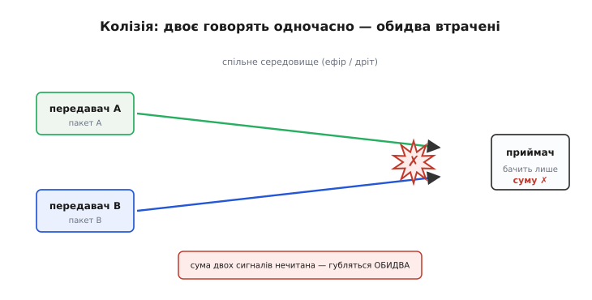
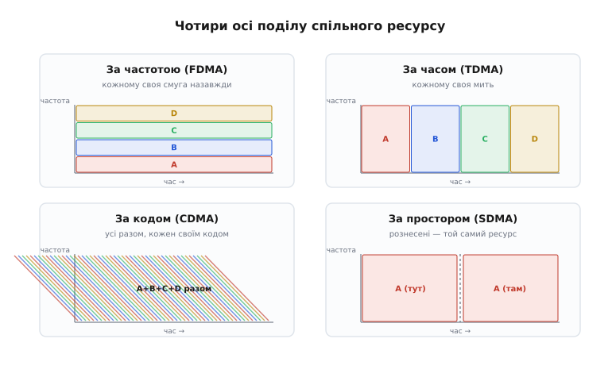
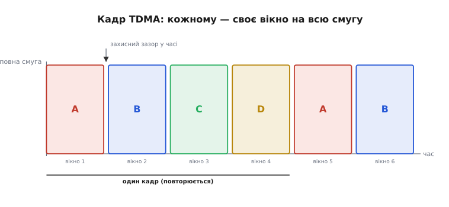
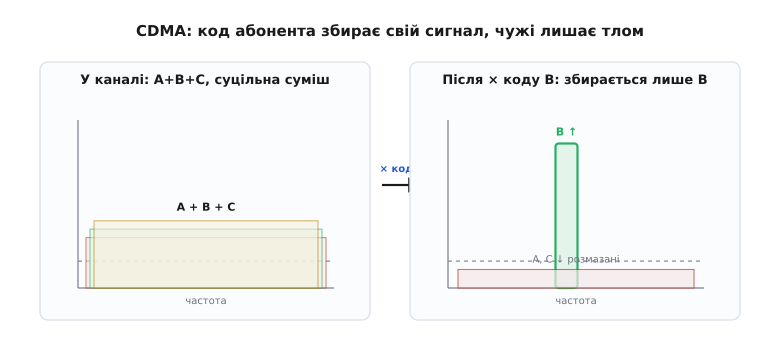
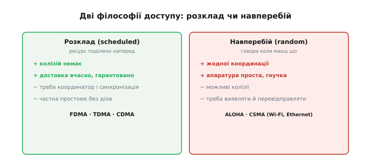
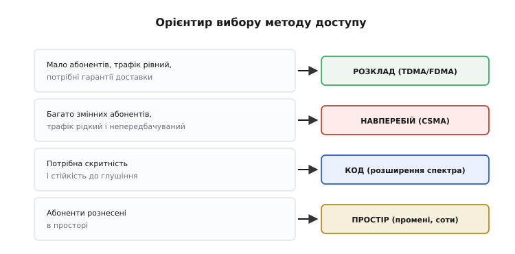

# Методи множинного доступу

Дотепер ми дивилися на лінк так, ніби в ефірі він один: рахували [бюджет радіолінії](root:embedded/link-budget) для пари «передавач — приймач», вчилися тримати його [під глушінням](root:embedded/jamming-fhss). Але реальний ефір — комуналка. У тій самій кімнаті твій Wi-Fi-роутер, ноутбук сусіда, кілька телефонів, навушники, розумна лампочка — і всі хочуть говорити в одній смузі 2.4 ГГц **одночасно**. Дрон у полі ділить ефір з іншими дронами й з усім, що галасує поряд. Питання цієї теми просте на словах і глибоке по суті: **як багатьом абонентам користуватися одним середовищем, не перетворюючи його на суцільний рев?**

Це і є **множинний доступ** (*multiple access* — спільний доступ багатьох). І хоч способів існує з десяток, усі вони — варіації **однієї ідеї**, яку ми зараз і видобудемо.

### Корінь проблеми: спільне середовище — це один ресурс

Почнімо з того, **чому** взагалі виникає конфлікт. Радіоефір (чи спільний дріт шини) — це **один фізичний ресурс**, по якому хвиля передавача розходиться **на всіх одразу**. Якщо двоє передають у тій самій смузі в той самий час і в тому самому місці, їхні хвилі складаються в приймачі в кашу — стається **колізія** (*collision* — зіткнення), і жодне з повідомлень не читається. Не «гірше чути», а саме **обидва втрачені**: приймач бачить суму двох сигналів і не може їх розчепити.


*Спільне середовище доносить обидва сигнали до приймача одночасно. Поки говорить один — його пакет читається. Щойно вступає другий у той самий час і ту саму смугу — приймач бачить лише суму, з якої не дістати жодного. Колізія знищує **обидва** повідомлення, а не одне.*

Отже, маємо обмежений спільний ресурс і багатьох охочих. Звідси й уся теорія множинного доступу зводиться до **одного питання**: на що цей ресурс **поділити**, щоб абоненти не наступали одне одному на хвилю? Виявляється, поділити його можна лише за кількома осями — і кожна вісь дає окремий «метод доступу».

> 🔧 **Навіщо це.** Будь-який радіомодуль, який ти ставиш на плату — Wi-Fi, BLE, LoRa, приймач RC, — живе **не сам**. Поряд завжди хтось у тій самій смузі. Розуміти, **як саме** твій модуль ділить ефір із сусідами, означає наперед знати, чому він гальмує в людному місці, чому два дрони поряд глушать одне одного, і який метод доступу обрати під свою задачу. Це різниця між «чомусь не працює в полі» і «я знав, що так буде, і заклав запас».

### Чотири осі поділу ресурсу

Ресурс зв'язку має скінченний вимір: трохи **смуги частот**, трохи **часу** і трохи **простору**. Поділити його можна точно по цих вимірах — плюс один хитріший спосіб, що ділить не ресурс, а **розрізнюваність сигналів**. Ось ці осі.


*Той самий ефір ділять по-різному. **За частотою**: кожному — своя вузька смуга назавжди. **За часом**: усім одна смуга, але кожному — свій момент. **За кодом**: усі разом і завжди, але кожен зі своїм секретним кодом-«голосом». **За простором**: спрямовані промені, тож той самий ресурс перевикористовується там, де промені не перетинаються.*

Розберімо кожну — від найочевиднішої.

### FDMA: кожному своя частота

Найприродніша думка: якщо двом не можна кричати в одній смузі — дай **кожному свою**. Поділи доступну смугу на вузькі канали й закріпи по каналу за абонентом. Це **частотний поділ** (*frequency-division multiple access*, FDMA): кожен сидить на своїй частоті **постійно** й нікому не заважає, бо сусіди — на інших частотах.

Так працює звичайне FM-радіо: кожна станція — свій канал, і ти крутиш ручку, обираючи, кого слухати. Так само влаштовані RC-канали старих пультів і будь-який поділ, де «один абонент = одна смуга назавжди».

Платиться за простоту двома речами. По-перше, між сусідніми каналами треба лишати **порожній проміжок** — [захисну смугу](root:com-transport/guard-band-duplexing), бо реальний сигнал не вміщується ідеально в свій канал і трохи «вилазить» до сусідів. Цей проміжок — змарнований ефір. По-друге, канал закріплено **назавжди**: якщо абонент мовчить, його смуга простоює, а інші не можуть нею скористатися. FDMA щедрий, але марнотратний.

> 📡 **Залежність — захисна смуга й дуплекс.** Щоб сусідні частотні канали не наводилися один на одного, між ними лишають порожній проміжок — захисну смугу. Той самий прийом розділяє і два напрямки зв'язку (туди/назад) у частотному дуплексі (FDD). Знати тут досить одного: частина смуги завжди йде «в нікуди» заради ізоляції, і це закладають у [частотний бюджет](root:com-transport/guard-band-duplexing).

### TDMA: кожному своя мить

Інша вісь — **час**. Хай усі користуються **однією** смугою, але **не одночасно**: поділи час на короткі **вікна** (*slots* — комірки) і дай кожному абоненту своє вікно по черзі. Поки твоя мить — ти говориш на повну смугу; настала чужа — ти мовчиш і слухаєш. Це **часовий поділ** (*time-division multiple access*, TDMA).

Виграш проти FDMA очевидний: тепер **уся смуга** дістається тому, хто говорить, — просто по черзі. Не треба різати ефір на вузькі шматочки. Ціна — **синхронізація**: усі абоненти мусять мати спільний годинник і точно знати, **коли** настає їхнє вікно, інакше вони залізуть у чуже й знову колізія. Ще одна тонка плата — **захисний інтервал** між вікнами в часі (аналог захисної смуги, тільки в часі): сигнал від далекого абонента приходить із затримкою, і щоб його «хвіст» не наповз на сусіднє вікно, між вікнами лишають невеликий зазор.


*Час нарізано на повторювані кадри, кадр — на вікна. Абонент A передає у вікні 1, B — у вікні 2 і так далі, кожен на **всю** смугу, але лише свою мить. Між вікнами — захисний зазор, щоб затриманий сигнал далекого абонента не наповз на чуже вікно. Усе тримається на спільному годиннику.*

У реальному житті FDMA й TDMA часто **поєднують**. Класичний приклад — **GSM** (мобільний зв'язок 2G): спершу смугу ділять на частотні канали (FDMA), а кожен такий канал — ще й на вісім часових вікон (TDMA). Так на тій самій смузі вміщується вдвічі-увосьмеро більше абонентів, ніж дав би лише один поділ. *(Це усталений факт: GSM від початку проєктувався як гібрид FDMA+TDMA; 1G був суто FDMA, 3G WCDMA перейшов на код.)*

Ось як виглядає сама ідея TDMA-вікна в прошивці вузла, що ділить спільну шину чи ефір за розкладом:

```c
#include <stdint.h>

#define N_SLOTS    8        // вікон у кадрі
#define SLOT_US    1250     // тривалість одного вікна, мкс
#define MY_SLOT    3        // це вікно — наше

// Викликається з таймера щоразу на початку нового вікна.
// slot — номер поточного вікна в кадрі (0..N_SLOTS-1).
void on_slot_tick(uint8_t slot) {
    if (slot == MY_SLOT) {
        radio_transmit(my_packet, my_len);   // наша мить — говоримо
    } else {
        radio_listen();                       // чужа мить — слухаємо
    }
}
```

Уся складність TDMA — не в цьому коді, а в тому, **звідки** береться точний `slot`: усі вузли мусять рахувати вікна від спільної позначки часу. Як саме будувати такий розклад на кілька вузлів — від синхронізації кадру до боротьби з дрейфом годинників — ми розбираємо окремо в [проєкті TDMA-планувальника](root:embedded/multiple-access-methods/proj-tdma-scheduler.md).

### CDMA: кожному свій голос

Третя вісь — найхитріша й найкрасивіша. А що, як **не ділити** ані частоту, ані час: хай усі говорять **одночасно й у всій смузі** — але кожен своєю «мовою», якої не плутають з іншими? Це **кодовий поділ** (*code-division multiple access*, CDMA).

Аналогія точна: уяви велику залу, де багато пар розмовляють воднораз. Усі звуки змішані в повітрі (спільний ресурс, усі одночасно) — але ти чуєш **свого** співрозмовника, бо твій мозок ловить **знайому мову й голос** і відкидає решту як гомін. У CDMA роль «мови» грає секретний код. Кожному абоненту дають свій **код розширення** — швидку псевдовипадкову послідовність. Передавач множить дані на цей код (той самий прийом розширення спектра, що ми бачили в [DSSS під глушінням](root:embedded/jamming-fhss)), а приймач множить прийняту суму на код **потрібного** абонента — і той єдиний сигнал «складається» назад у читабельний, а всі чужі коди для нього лишаються розмазаним гомоном.


*Зліва — ефір: три абоненти говорять разом, у каналі суцільна суміш. Справа — приймач множить її на код абонента B: тільки сигнал B збирається у вузьку читану купку, а коди A і C, «чужі» цьому множенню, лишаються низьким розмазаним тлом. Той самий ефір, той самий час — а абоненти розділені самим лише кодом.*

Ключ до того, чому це працює, — **ортогональність** (*orthogonal* — взаємно незалежні) кодів: коди дібрані так, що «свій помножений на свій» дає чіткий сигнал, а «свій помножений на чужий» — майже нуль. Тому чужі голоси не складаються в перешкоду, а взаємно гасяться в розмазане тло. На цьому стояв увесь мобільний зв'язок 3G (стандарт WCDMA) і досі стоїть GPS, де всі супутники мовлять на одній частоті, а приймач розрізняє їх кодами. Глибше — як код стає адресою й чому коди не плутаються — у темі [CDMA](root:com-modulation/cdma).

### SDMA: кожному свій напрямок

Четверта вісь часто лишається в тіні, хоч працює давно й нині стала головною. Це **простір**. Якщо два абоненти **далеко** один від одного або в **різних напрямках** від базової станції, то той самий ресурс — ту саму частоту в той самий час — можна віддати **обом**: їхні сигнали просто не дістають один до одного. Це **просторовий поділ** (*space-division multiple access*, SDMA).

Найпростіший приклад знайомий кожному: стільниковий зв'язок тому й «стільниковий», що ту саму частоту перевикористовують у несусідніх **сотах** (*cells* — комірки) — далеких клітинках карти. У межах однієї соти частота зайнята, а через дві соти — вона вільна знову, бо туди сигнал уже не добиває. Сучасніший і потужніший варіант — **спрямовані промені**: базова станція з багатьма антенами формує вузький промінь **окремо на кожного абонента** й «світить» різним абонентам у різні боки тим самим ресурсом. Саме на цьому стоїть [MIMO](root:com-modulation/mimo) у сучасному Wi-Fi і 5G: кілька антен не просто додають дальності, а дають змогу **просторово розділити** абонентів, що сидять у різних напрямках.

> 🔧 **Навіщо це.** SDMA пояснює, чому в чистому полі твій лінк добиває кілометри, а в людному місці на тій самій апаратурі — лічені сотні метрів. У полі ти один у «своєму просторі»; у місті той самий ресурс уже ділять десятки сусідів навколо, і простір перестає тебе рятувати. Спрямована антена (вузький промінь) — це і є ручний SDMA: ти не просто додаєш підсилення в бюджет, а **відрізаєш** себе від тих, хто збоку.

### Дві філософії: розклад чи навперебій

Усі чотири осі — це способи **поділити** ресурс наперед: кожному заздалегідь виділено свою частоту, мить, код чи напрямок. Такий підхід зветься **розкладом** (*scheduled access*): є хазяїн ресурсу, який роздає частки, ніхто ні з ким не стикається — але потрібні координація й синхронізація, а виділена частка простоює, коли абонент мовчить.

Є й протилежна філософія, і вона зовсім інша на смак: **не ділити наперед нічого**. Хай абонент, коли має що сказати, просто **говорить навперебій** (*contention* — змагання за ресурс), а колізії розрулюються постфактум. Це **випадковий доступ** (*random access*). Він не потребує ні центрального хазяїна, ні точного годинника — і саме тому ним користуються там, де абоненти приходять і йдуть непередбачувано: Wi-Fi, Ethernet, дешеві датчики.


*Зліва — розклад: ресурс поділено наперед, є координатор, колізій немає, але треба синхронізація й частка простоює без діла. Справа — навперебій: жодної координації, говориш коли маєш що, апаратура проста — зате можливі колізії, які доводиться виявляти й перевідправляти. Вибір між ними — це вибір між порядком і гнучкістю.*

Найперший і найвпливовіший приклад випадкового доступу народився не в лабораторії великої фірми, а на Гаваях. 1971 року в Гавайському університеті команда під проводом [Нормана Абрамсона зробила ALOHAnet](root:embedded/multiple-access-methods/hist-alohanet.md) — першу мережу, де віддалені термінали на різних островах слали пакети центральному комп'ютеру по радіо **просто коли мали що передати**, без жодної координації. Якщо два пакети накладалися — обидва губилися, і кожен чекав **випадковий** час перед повтором. Звідти ця ідея проросла в Ethernet, а далі — в усе бездротове, аж до Wi-Fi.

### Чому колізії доводиться приймати — і як їх гамують

Випадковий доступ звучить безвідповідально: усі говорять коли хочуть, колізії неминучі. То чому він переміг у Wi-Fi і Ethernet? Бо **ціна координації буває вища за ціну колізій**. Коли абонентів багато, кожен говорить рідко й непередбачувано, тримати на всіх точний розклад і синхронний годинник — дорожче, ніж зрідка зіткнутися й перевідправити.

Але приймати колізії не означає не боротися з ними. Перший рятунок — **слухати, перш ніж говорити**: абонент спершу перевіряє, чи ефір вільний, і лише тоді передає. Це різко зменшує зіткнення, бо ніхто не вступає поверх того, хто вже говорить. Прийом зветься **CSMA** (*carrier-sense multiple access* — множинний доступ із прослуховуванням носія), і саме його варіант [CSMA/CA](root:com-transport/csma-ca) лежить в основі Wi-Fi. Другий рятунок ми вже знаємо з [надійності даних](root:embedded/data-reliability): зіпсований колізією пакет ловиться [контрольною сумою](root:com-modulation/checksums) і перевідправляється після випадкової паузи.

Наскільки добре це працює, видно з класичної цифри. У «чистому» ALOHA, де говорять зовсім без оглядки, корисно проходить щонайбільше **18%** ефіру — решту з'їдають колізії. Варто лише **синхронізувати початки** пакетів у спільні вікна (slotted ALOHA), і межа подвоюється до **37%**. А додаси прослуховування ефіру перед передачею (CSMA) — і реальна корисна частка піднімається ще вище. Кожен крок «трохи більше координації» помітно піднімає віддачу — і весь спектр методів доступу лежить між двома полюсами: повний розклад без колізій, але з накладними витратами, проти повної свободи з колізіями, але без витрат на координацію.

```
Корисна частка спільного ефіру (груба межа):
  чистий ALOHA (говори коли хочеш)      ≈ 18%   (1/2e)
  slotted ALOHA (спільні вікна)         ≈ 37%   (1/e)
  CSMA (слухай, тоді говори)            ще вище
  чистий розклад (TDMA, без колізій)    →  межа смуги
```

> 🔧 **Навіщо це.** Ці числа пояснюють, чому твій Wi-Fi «тормозить», коли в кімнаті багато пристроїв, навіть якщо кожен качає мало. Справа не в швидкості кожного, а в **колізіях і чеканні черги**: що більше охочих говорити навперебій, то більша частка ефіру йде в зіткнення й паузи, а не в дані. Якщо твоєму вузлу потрібна **гарантована** доставка вчасно (керування, телеметрія критичного апарата) — випадковий доступ ненадійний за принципом, і варто дивитися в бік розкладу (TDMA-вікна) або виділеного каналу.

### Як обрати вісь під свою задачу

Зведімо все докупи — бо вибір методу доступу не абстрактний, він прямо випливає з того, **що** за система. Осі не конкурують «хто кращий»; кожна виграє у свого роду задач.


*Мало абонентів, передбачуваний трафік, потрібні гарантії — бери розклад (FDMA/TDMA): без колізій, вчасно. Багато абонентів, рідкий і непередбачуваний трафік, гарантії не критичні — бери випадковий доступ (CSMA): просто, гнучко, дешево. Потрібна скритність і стійкість до завад — кодовий поділ. Абоненти рознесені в просторі — використай це (спрямованість, соти).*

Логіка така. **Передбачуваний постійний трафік від кількох відомих абонентів** (наприклад, кілька давачів на спільній шині, що шлють дані рівним потоком) — це дім **розкладу**: TDMA-вікна дають кожному гарантовану мить без колізій. **Непередбачуваний рідкий трафік від багатьох змінних абонентів** (купа пристроїв у домі, що зрідка прокидаються) — дім **випадкового доступу**: координувати їх дорожче, ніж стерпіти зрідка колізію. Потрібна **скритність і стійкість до глушіння** — додаєш **кодовий поділ** (розширення спектра, яке ми вже бачили). А **рознесеність абонентів у просторі** — це безкоштовний ресурс: спрямовані антени й перевикористання частот по сотах множать ємність там, де сигнали не перетинаються.

І остання, найважливіша думка, заради якої все це й варто було розкладати по осях. Реальні системи **не вибирають одну вісь** — вони складають кілька. Wi-Fi: випадковий доступ (CSMA/CA) поверх частотних каналів (FDMA), а в нових поколіннях — ще й [ортогональний частотний поділ OFDMA](root:com-modulation/ofdma) і просторові промені (MIMO). GSM: FDMA плюс TDMA. Стільниковий зв'язок узагалі: усі чотири осі разом — частота, час, код і простір, накладені шарами. Тому, дивлячись на будь-який радіостандарт, питай не «який це метод доступу», а «**які осі поділу він поєднав і чому саме ці**». Відповідь на це питання — і є розуміння того, як цей зв'язок насправді працює в людному реальному ефірі, а не в ідеальному світі лінка на двох.

---
