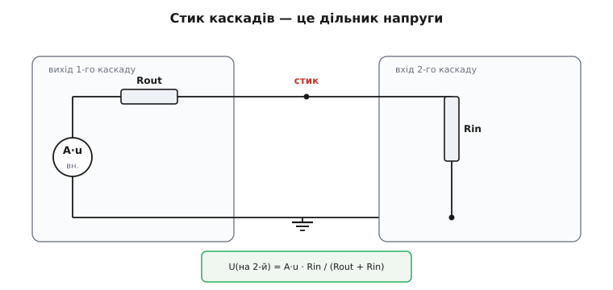
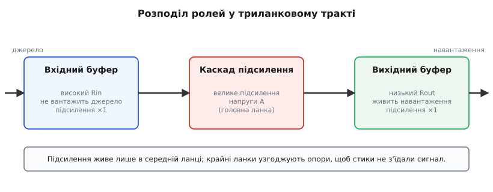
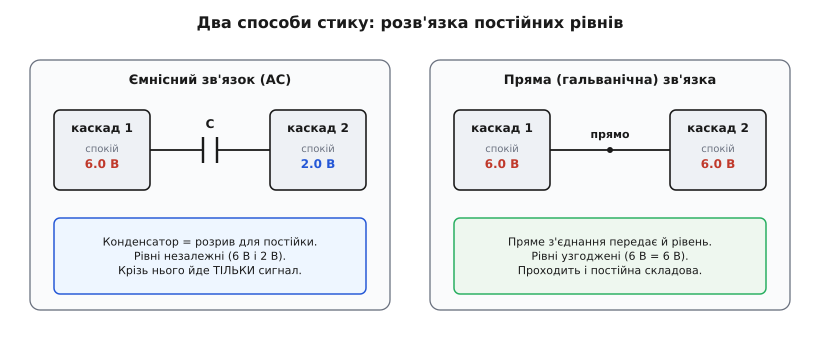

# Багатокаскадний підсилювач

<preknowlist>
- [Повторювач напруги (буфер)](book:electronics/voltage-follower) — каскад із підсиленням ×1, зате з дуже високим вхідним і дуже низьким вихідним опором: амплітуди не додає, але узгоджує опори між ланками.
</preknowlist>

Один транзисторний каскад ми вже вміємо порахувати: [BJT у схемі зі спільним емітером](book:electronics/bjt-amplifier) підсилює напругу в кілька десятків разів, операційний підсилювач — теж дає скінченне підсилення на скінченній смузі. Але реальна задача рідко вкладається в один каскад. Мікрофон віддає мілівольти — а на АЦП треба вольти; це підсилення в тисячу разів, якого один каскад не витягне. Давач дає кволий сигнал із високим внутрішнім опором — а навантаження попереду жадібне до струму; жоден каскад не вміє водночас і не вантажити джерело, і живити навантаження. Звідси проста думка: якщо одна ланка не справляється, **поставимо кілька поспіль** — вихід першої подамо на вхід другої, її вихід — на третю. Це і є **багатокаскадний підсилювач** (каскад — від фр. *cascade*, водоспад уступами: сигнал «падає» крізь ланки, щоразу набираючи силу).

Сама ідея ланцюжка тривіальна. Уся складність — у **стиках між ланками**: як одна ланка «бачить» наступну, що відбувається з постійним зміщенням на межі, і чому підсилення ланцюжка — не просто сума бажань. Розберімо це по черзі.

## Чому одного каскаду мало

Перш ніж стикати, варто чітко назвати, **чого саме** бракує одній ланці. Причин рівно три, і кожна окремо вже вимагає другого каскаду.

**Замало підсилення.** Каскад зі спільним емітером дає підсилення напруги десь ×20…×200 — далі його тисне власний [добуток підсилення на смугу](book:electronics/gain-bandwidth-product) та нелінійність. Операційний підсилювач має величезне підсилення «без обв'язки», та щойно ми замикаємо [від'ємний зворотний зв'язок](book:electronics/negative-feedback) заради лінійності й стабільності, корисне підсилення падає до керованих ×10…×100 на каскад. А треба, скажімо, ×1000. Один каскад такого не дасть чесно; два по ×32 — дадуть.

**Не сходяться опори.** У джерела сигналу є свій внутрішній опір, у навантаження — свій. Каскад, що добре підсилює напругу, зазвичай має **не той** вхідний чи вихідний опір, якого вимагають сусіди. П'єзодавач чи скляний електрод віддають сигнал із опором у мегаоми — підключиш до них каскад із вхідним опором у кілооми, і сигнал просяде ще до підсилення. І навпаки: підсилений сигнал треба віддати в навантаження на кілька десятків ом, а каскад має вихідний опір у кілоом — більшість напруги загубиться на ньому самому. Це той самий ефект, що й у звичайному [дільнику напруги](root:embedded/circuit-analysis): два опори поспіль ділять напругу між собою.

**Різні функції.** Іноді від ланцюжка хочуть кількох різних речей одразу: на вході — не вантажити джерело, посередині — дати підсилення, на виході — віддати струм у навантаження, а ще десь — відрізати постійну складову чи обмежити смугу. Це **різні** вимоги, і кожну найпростіше доручити окремому каскаду, заточеному саме під неї. Один універсальний каскад, що робить усе відразу, або неможливий, або вийде гіршим за три спеціалізовані.

> 🔧 **Навіщо це.** Перш ніж множити каскади, назвіть уголос, чого бракує: підсилення, узгодження опорів чи функції. Це одразу підказує, **який** каскад додати. Бракує підсилення — ще одна підсилювальна ланка. Джерело кволе, з високим опором — на вхід ставлять каскад із високим вхідним опором (повторювач, польовий вхід). Навантаження жадібне до струму — на вихід ставлять буфер із низьким вихідним опором. Діагноз визначає ліки.

## Підсилення перемножується

Найперше, що треба засвоїти про ланцюжок: **повне підсилення дорівнює добуткові підсилень окремих каскадів**. Якщо перший каскад підсилює напругу в A₁ разів, а другий — у A₂ разів, то на вхід другого приходить уже підсилений у A₁ сигнал, і він множить його ще на A₂:

```
A = A₁ · A₂ · A₃ · …
```

Чому саме множення, а не додавання? Бо кожен каскад працює з **відношенням** виходу до входу, а не з абсолютною добавкою. Подай 1 мВ; перший каскад зробить 50 мВ (×50); другий бачить ці 50 мВ і робить із них 5 В (×100). Разом — 5000 разів. Каскади не «додають вольтів» — кожен **множить** те, що отримав.

Звідси одразу видно, як легко набрати велике підсилення: три скромні каскади по ×30 дають ×27000, чого жоден поодинці й близько не зробить. І звідси ж — головна засторога: множаться **всі** недоліки теж. Якщо кожен каскад трохи зсуває постійний рівень (має невелику напругу зсуву), ці зсуви на виході теж помножаться на підсилення наступних ланок — і дрібний мілівольт на вході першого каскаду може обернутися вольтами «сповзання» на виході. Тому в багатокаскадних схемах так важливий точний вхідний каскад: усе, що він наплутає, решта ланцюжка чесно роздує.

Зручність множення — ще й причина, чому підсилення так люблять рахувати в **децибелах**. Логарифм перетворює множення на додавання: децибели каскадів просто **додаються**.

> Децибел — логарифмічна міра відношення. Для напруги: підсилення в децибелах = 20·log₁₀(A). Тоді ×10 — це 20 дБ, ×100 — 40 дБ, ×1000 — 60 дБ. Множення підсилень обертається на додавання децибелів, що зручно для ланцюжків. Докладніше — [Децибели](book:electronics/decibels).

Тоді ланцюжок рахується усно: каскад +26 дБ, ще один +40 дБ — разом +66 дБ. Замість перемножування ×20 на ×100 просто складаємо. Це не нова фізика, а зручніша лінійка для тієї самої дії.

**Приклад: яке підсилення треба мікрофонному тракту.** Електретний мікрофон віддає ~5 мВ, а 12-бітний АЦП хоче ~2 В розмаху для повної шкали.

```
Потрібне підсилення:  A = 2 В / 5 мВ = 2000 разів
У децибелах:          20·log10(2000) ≈ 66 дБ
Один каскад чесно:    ×30…×50  (≈ 30…34 дБ)
Висновок:             одного мало; беремо два каскади
                      A1 = 45, A2 = 45  →  45·45 = 2025 ✓
```

Два каскади по ×45 дають потрібне з невеликим запасом — запас потім «з'їсть» неминуча втрата на стику, до якої переходимо.

## Стик каскадів: підсилення не безкоштовне

Тут і ховається головна пастка ланцюжка. Підрахунок «×45 на ×45 = ×2025» **неправдивий**, якщо рахувати підсилення кожного каскаду окремо, ніби сусіда нема. Бо щойно ми під'єднуємо до виходу першого каскаду вхід другого, другий **вантажить** перший — і реальне підсилення першого падає.

Механізм — той самий дільник напруги, що скрізь у колах. Будь-який каскад можна уявити як джерело підсиленої напруги з послідовним **вихідним опором** Rout. А наступний каскад — це для нього навантаження з **вхідним опором** Rin. З'єднані, вони утворюють дільник: напруга джерела ділиться між Rout (усередині першого каскаду) і Rin (входом другого), і до другого доходить лише частка:

```
U(на вході 2-го) = U(джерела 1-го) · Rin / (Rout + Rin)
```


*Стик двох каскадів — це дільник: внутрішнє джерело першого каскаду «бачить» свій Rout послідовно з Rin наступного. Частка Rin/(Rout+Rin) і є коефіцієнт втрати на стику.*

Поки Rin набагато більший за Rout, частка близька до одиниці — втрата дрібна. Але якщо вони сумірні, втрата кусюча. Хай вихідний опір першого каскаду 5 кОм, а вхідний другого — теж 5 кОм. Тоді на стик проходить рівно половина: дільник ділить навпіл, ×0.5. Помножений на нього добуток ×2025 з прикладу впав до ×1000 — рівно вдвічі менше, ніж рахували. Ось чому в попередньому розрахунку ми лишали запас.

> 🔧 **Навіщо це.** Звідси золоте правило стику каскадів: **вхідний опір наступного — багато більший за вихідний опір попереднього** (Rin ≫ Rout, на практиці хоча б у 10 разів). Тоді дільник майже не ділить, і підсилення можна чесно перемножувати, не озираючись на сусіда. Порушив це правило — отримаєш менше підсилення, ніж проєктував, і дивуватимешся, «куди поділись рази».

Те, що каскади вантажать один одного, — не дрібна поправка, а **визначальний** чинник конструкції. Саме він диктує, який каскад куди ставити. Тому ланцюжок майже ніколи не роблять із трьох однакових ланок — його **спеціалізують**.

> Вихідний і вхідний опір — це опори, якими каскад повертається до сусідів: вихідний Rout «бачить» навантаження на виході, вхідний Rin «бачить» джерело на вході. Стик двох каскадів ділить напругу в відношенні Rin/(Rout+Rin) — той самий дільник, що в будь-якому колі двох опорів. Цю взаємодію опорів між ланками описує поняття [імпедансу](book:math/impedance) (тут — на постійному й низькочастотному сигналі це просто опір).

## Розподіл ролей: вхід, підсилення, вихід

Якщо стик карає за невідповідність опорів, то природне рішення — доручити кожному каскаду **свою** роль і підібрати під неї опори. Класичний триланковий тракт виглядає так:

**Вхідний каскад — високий вхідний опір.** Його єдина турбота — взяти сигнал від джерела, **не вантажачи** його. Якщо джерело має високий внутрішній опір (давач, електрод, антена), вхідний каскад мусить мати ще вищий вхідний опір, інакше сигнал просяде на дільнику ще до підсилення. Тут у пригоді [повторювач напруги (буфер)](book:electronics/voltage-follower): його підсилення лише ×1, зате вхідний опір величезний, а вихідний — малий. Він **нічого не додає по амплітуді**, але «перекладає» сигнал із високоомного джерела на низькоомний вихід, з якого наступний каскад уже бере вільно. Часто на вході ставлять каскад на польовому вході (JFET/CMOS), бо там вхідний опір сягає мегаомів і вище.

**Каскад підсилення — посередині.** Узявши сигнал із низькоомного виходу буфера, середній каскад робить головну роботу — **дає основне підсилення напруги**. Тут не треба воювати ні за вхідний опір (його годує низькоомний буфер), ні за вихідний струм (попереду буде вихідний буфер) — тож каскад можна заточити суто під велике підсилення. Це може бути [каскад зі спільним емітером](book:electronics/bjt-amplifier) або операційний підсилювач у схемі з [неінвертуючим увімкненням](book:electronics/inverting-noninverting) і заданим зворотним зв'язком підсиленням.

**Вихідний каскад — низький вихідний опір.** Підсилену напругу треба віддати в навантаження, не просівши на ньому. Якщо навантаження жадібне до струму (динамік, довгий кабель, наступний пристрій із малим опором), потрібен каскад із **малим вихідним опором**, здатний дати струм без падіння напруги. Це знову буфер — але тепер заради виходу, а не входу: емітерний повторювач або вихідний буфер операційного підсилювача. Підсилення напруги в нього теж ×1; цінність — у здатності **живити навантаження струмом**.


*Розподіл ролей: вхідний буфер бере сигнал, не вантажачи джерело; середній каскад дає підсилення; вихідний буфер віддає струм у навантаження. Підсилення живе лише в середній ланці, крайні узгоджують опори.*

Бачите логіку? Підсилення напруги дає **одна** ланка — середня. Дві крайні підсилення майже не додають (×1), їхня робота — **узгодити опори** так, щоб стики не з'їдали сигнал. Це наочна ілюстрація головного: у ланцюжку важить не лише «скільки разів», а й «з яким опором» кожна ланка віддає й приймає сигнал.

> 🔧 **Навіщо це.** Коли бачите в чужій схемі каскад із підсиленням ×1 (повторювач), не дивуйтесь «навіщо він, він же нічого не підсилює». Він **узгоджує опори** — і без нього сусідні каскади загубили б більше, ніж він нібито «не дав». Буфер коштує одного транзистора чи половини здвоєного ОП, а рятує підсилення всього тракту.

## Що відбувається з постійним зміщенням на стику

Є ще один бік стику, окремий від опорів, — **постійний рівень**. Кожен підсилювальний каскад працює не «з нуля», а навколо своєї робочої точки: на колекторі транзистора в стані спокою стоїть якась стала напруга (скажімо, половина живлення), і корисний сигнал лише **коливається** навколо неї. Це розділення сталого зміщення й змінного сигналу — окрема велика тема ([DC-зміщення й AC-сигнал](root:embedded/dc-ac-bias)); тут нам важливий лише її наслідок для стику.

Якщо просто з'єднати дротом колектор першого каскаду з базою другого, ми передамо **не лише сигнал, а й постійний рівень**: 6 В спокою з виходу першого «приїдуть» на вхід другого й зіб'ють його власну робочу точку. Каскад «захлинеться» — вийде з лінійного режиму, і підсилення зникне. Тому стик каскадів мусить якось **розв'язати постійні рівні**, лишивши прохід тільки змінному сигналу. Є два способи.

**Розв'язка конденсатором (ємнісний, AC-зв'язок).** Між каскадами ставлять конденсатор. Для постійного струму конденсатор — розрив: постійні рівні двох каскадів живуть незалежно, кожен тримає свою робочу точку. А змінний сигнал крізь конденсатор проходить вільно. Це [ємнісний зв'язок (AC-coupling)](book:electronics/ac-coupling): простий і надійний спосіб з'єднати каскади з різними робочими точками. Платою є те, що конденсатор разом із вхідним опором наступного каскаду утворює фільтр високих частот — **дуже повільні** складові й постійну він ріже. Для звуку це навіть добре (постійну складову однаково не треба), для сигналів аж до постійного струму — неприйнятно.

**Пряма (гальванічна) розв'язка.** Каскади з'єднують напряму, але робочі точки **навмисне узгоджують** при проєктуванні: вихідний рівень першого роблять рівним потрібному вхідному рівню другого. Тоді конденсатор не потрібен, і тракт підсилює аж до постійного струму. Саме так влаштовано всередині операційного підсилювача: його каскади зв'язані прямо, тому ОП підсилює і повільні, і постійні сигнали. Ціна — складніше зведення робочих точок і те, що зсув першого каскаду проходить далі (його ж ми згадували: на виході він помножиться).


*Ліворуч — ємнісний стик: конденсатор розриває постійні рівні, крізь нього йде тільки змінний сигнал, тож робочі точки каскадів незалежні. Праворуч — пряма зв'язка: рівні узгоджені при проєктуванні, проходить і постійна складова.*

> 🔧 **Навіщо це.** Перше питання до стику каскадів: чи треба передавати постійну складову? Якщо ні (звук, радіосигнал) — ставте конденсатор, це просто й розв'язує робочі точки даром. Якщо так (сигнал давача, що несе повільну зміну чи постійний рівень) — потрібна пряма зв'язка з ретельним зведенням рівнів, або готовий ОП, де це вже зроблено за вас.

## Дві ціни, що їх платить ланцюжок

Стикуючи каскади заради підсилення, ми мовчки платимо двома речами. Їх варто знати наперед, щоб не наражатися.

**Смуга звужується.** Кожен каскад має свою верхню межу частоти — ту [смугу](book:electronics/gain-bandwidth-product), де він ще чесно підсилює. Коли каскади поставлені поспіль, їхні спади **накладаються**: повна смуга ланцюжка **вужча** за смугу найслабшої ланки. Поставив три однакові каскади — і повна смуга помітно менша, ніж в одного. Інтуїція проста: щоб увесь ланцюжок устигав за швидким сигналом, за ним має встигати **кожна** ланка; досить одній відстати — відстане весь тракт. Тому, ганяючись за підсиленням числом каскадів, не можна забувати, що смугу при цьому віддаєш.

**Шум першого каскаду — найважливіший.** Кожен каскад додає трохи власного шуму. Але шум **першого** каскаду далі проходить крізь усе підсилення наступних ланок — і роздувається разом із корисним сигналом. А шум, що його додає, скажімо, третій каскад, підсилюється вже тільки тим, що після нього, тобто майже не множиться. Звідси несподіваний, але важливий висновок: **малошумним має бути насамперед вхідний каскад**; що далі по ланцюжку, то менше шум каскаду важить. Тому на вході чутливих трактів ставлять спеціальні малошумні каскади, а на дрібний шум вихідних ланок майже не зважають.

Обидві ціни — не привід уникати ланцюжків (без них ніяк), а привід **не множити каскади бездумно**. Кожен зайвий каскад трохи звужує смугу й трохи додає шуму; став рівно стільки, скільки треба для підсилення й узгодження опорів, — і не більше.

## Усе це вже зібрано — в операційному підсилювачі

Найчистіше всі ці уроки втілено в одній мікросхемі — **операційному підсилювачі**. Усередині нього стоїть саме такий ланцюжок: [диференційний вхідний каскад](book:electronics/opamp-input-stage) із високим вхідним опором, проміжний каскад величезного підсилення й вихідний буфер із малим вихідним опором, усі зв'язані **прямо** (тому ОП тягне й постійний струм). Коли ми беремо готовий [операційний підсилювач](book:electronics/opamp) і чіпляємо до нього два резистори, ми насправді користуємося готовим, ретельно узгодженим багатокаскадним трактом — і всі правила цієї теми вже враховані за нас його розробником.

> 📜 **Історія до теми:** [Як зі стосу ламп виріс операційний підсилювач](root:embedded/multistage-amplifier/hist-opamp-cascade.md). Шлях від перших аналогових обчислювачів, де каскади ламп складали в ланцюжки заради потрібного підсилення, до інтегрального ОП, де той самий триланковий тракт сховали в одну мікросхему — і чому проблема стику каскадів лишилась тією самою попри зміну елементної бази.
