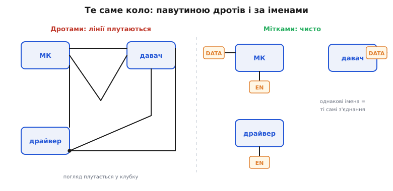
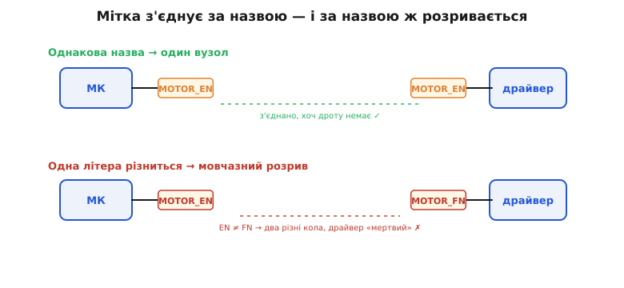
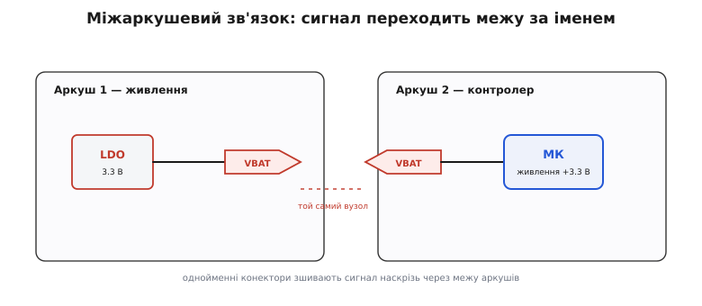

# З'єднання без дротів: мітки, шини й міжаркушеві зв'язки

<preknowlist>
- [Вузол схеми](topic:hw-pcb/nodes-connections) — усе, що сполучено суцільною лінією, це один вузол (одна електрична точка); справжнє з'єднання на кресленні позначає жирна крапка, а не простий перетин ліній.
</preknowlist>

Читаючи схему за нашим рецептом, ми звикли до одного простого руху: щоб дізнатися, з чим з'єднана точка, ведемо оком по **намальованому дроту** й подумки «зафарбовуємо» весь [вузол](topic:hw-pcb/nodes-connections) — усе, що сполучено суцільною лінією, це одна електрична точка. Прийом чудовий, і на схемі з десятка деталей його вистачає з головою. Та варто взяти справжню плату — контролер, кілька давачів, живлення, роз'єми, — і цей рух заводить у глухий кут. Дротів там не десять, а кілька сотень; накресли ми кожен суцільною лінією, схема перетвориться на клубок, у якому жодне око не простежить, що куди йде. Виходить парадокс: чим складніший пристрій, тим менше на його схемі **намальованих** з'єднань. Кресляр навмисне **не** тягне більшість дротів — і робить це трьома прийомами, які ми зараз і розберемо.


*Одне й те саме коло, накреслене двома способами. Ліворуч кожне з'єднання — окремий дріт, і навіть на трьох блоках лінії вже плутаються. Праворуч ті самі з'єднання задано **іменами**: однакова назва на двох виводах означає, що вони сполучені, — і схема читається чисто, без жодної лінії через увесь аркуш.*

Спільна ідея всіх трьох прийомів одна, і її варто вхопити відразу, бо далі все з неї випливає: **схема масштабується не малюванням дротів, а називанням**. Замість тягнути лінію через пів-аркуша, точці дають **ім'я** — і будь-яка інша точка з тим самим іменем стає з нею одним вузлом, хоч дроту між ними немає. Це не новий вид електричного з'єднання; це новий спосіб **записати** те саме з'єднання компактно. Тримайте цю думку в голові — вона і є ключ, і вона ж, як побачимо, головне джерело тихих помилок.

## Мітка вузла: з'єднання за іменем

Найпростіший з трьох прийомів ви вже бачили, самі того не назвавши. Коли на схемі в різних кутах трапляються значки «+5В» або «GND», ви без вагань вважаєте їх **одним** колом — і маєте рацію. Це і є **мітка вузла** (англ. *net label*; *net* — «мережа», бо вузол сполучає багато виводів у спільну мережу): коротка назва, приклеєна до дроту. Правило гранично просте — **дві мітки з однаковою назвою позначають один і той самий вузол**, навіть якщо суцільної лінії між ними немає. Живлення й землю так підписують завжди; але той самий прийом працює для **будь-якого** сигналу — назвіть лінію `MOTOR_EN`, `SDA`, `RX`, і однойменна мітка десь на іншому кінці схеми підхопить цей самий вузол.

Тепер найважливіше — **як** це з'єднання насправді народжується, бо саме тут ховається пастка. З'єднання створює не близькість двох міток і не якась невидима лінія між ними — його створює **збіг назв, буква в букву**. Для редактора схеми `MOTOR_EN` тут і `MOTOR_EN` там — це один вузол, бо рядки-назви **однакові**. А `MOTOR_EN` і `MOTOR_FN` — то два **різні** вузли, хоч на вигляд майже близнюки. Геометрія не важить зовсім: мітки можуть стояти впритул і не бути з'єднаними, а можуть — на протилежних краях аркуша й бути одним колом. Зшиває **ім'я**, не відстань.


*Мітка з'єднує за назвою — і за назвою ж тихо розривається. Угорі обидві мітки звуться `MOTOR_EN`, тож контролер і драйвер — один вузол, хоч дроту між ними немає. Унизу одна літера різниться (`EN` проти `FN`), і зв'язок беззвучно зникає: схема виглядає так само правильно, а драйвер «мертвий», бо сигнал до нього не доходить.*

Звідси й головна небезпека міток, і вона підступна, бо **тиха**. Одруківка в назві не підкреслюється червоним і не кидається в очі — вона просто робить із одного вузла два. Драйвер, який мав дістати команду по `MOTOR_EN`, лишається ні з чим; схема на вигляд ціла, а мотор не крутиться. І дзеркальний бік тієї ж медалі: якщо ви **випадково** дали двом незалежним сигналам однакове ім'я (скажімо, два різні модулі обидва назвали свою лінію `CLK`), редактор слухняно **закоротить** їх в один вузол — бо для нього однакова назва завжди означає одне коло. Тому мітки — це і зручність, і відповідальність: іменуй свідомо, звіряй назви, а вловивши на схемі мітку, шукай її двійника не поряд, а **по всьому кресленню**.

> 🔧 **Навіщо це.** Коли ви шукаєте на чужій схемі, звідки береться якийсь сигнал, і раптом дріт **обривається** міткою `RX` — не думайте, що схема неповна. Це вказівник: десь є друга мітка `RX`, і саме там продовження вузла. Уміння читати мітки перетворює «обірваний» дріт на гіперпосилання — клацнув (чи в друкованій схемі пошукав очима ту саму назву) і опинився на іншому кінці зв'язку. І навпаки: коли **ваша** плата поводиться дивно — вузол, що мав живитися, «висить», два сигнали чомусь злиплися, — першим ділом перевірте мітки на одруківки й ненавмисні збіги. Це класична причина багів, яку не видно, доки не почнеш звіряти назви літера в літеру.

## Шина: жмут однакових ліній однією рискою

Мітка розв'язує проблему **одного** довгого дроту. Та апаратура раз у раз вимагає не одного сигналу, а цілого **жмута однотипних**: вісім ліній даних до пам'яті, шістнадцять ліній адреси процесора, дванадцять виходів на світлодіодну матрицю. Тягнути дванадцять окремих паралельних дротів, підписувати й звіряти кожен — марнота, та ще й сліпа до головного: ці лінії **живуть разом**, їх задають і читають однією дією. Для такого жмута є свій прийом — **шина** (англ. *bus*, скорочене від лат. *omnibus* — «для всіх», бо вона спільна для багатьох сигналів): одна **товста** лінія, що несе цілий набір проводів під спільним іменем на кшталт `D[7..0]`.

Ключова думка, від якої шина перестає лякати: товста лінія **нічого нового в електрику не вносить**. `D[7..0]` — це рівно ті самі вісім дротів `D0`, `D1`, … `D7`, що й були б, накресли ми їх поодинці. Шина — це просто **згорнутий жмут**, скорочення запису, а не якесь особливе з'єднання. Тому й підключаються до неї так само за іменем: щоб витягти з шини один провід і завести на вивід деталі, малюють коротку скісну рисочку — **зрив** (англ. *bus entry*) — і ставлять на її кінці мітку члена, скажімо `D3`. Ця рисочка сама по собі нічого не з'єднує; з'єднання, як завжди, робить **збіг імені**: `D3` коло шини і `D3` на піні приймача — один вузол.

![Блок пам'яті з вісьмома виводами D0..D7, що збігаються скісними рисками в одну товсту зелену лінію з підписом D[7..0]; праворуч від шини скісний зрив витягує член D3 і веде його через мітку на вхід АЦП.](img/bus.svg)
*Шина — намальований жмут проводів. Вісім ліній `D0…D7` збігаються в одну товсту лінію `D[7..0]`: замість восьми паралельних дротів через аркуш — одна риска. Щоб дістати один член, від шини відводять скісний **зрив** із міткою (`D3`) — і саме ця назва, а не дотик, з'єднує його з піном приймача.*

Цього робочого розуміння — «товста лінія = вісім звичайних дротів, кожен зривають за іменем» — цілком досить, щоб читати схеми з шинами без загадок. За ним, однак, стоїть цілий маленький апарат: що означає число у квадратних дужках, чому `D[7..0]` і `D[0..7]` — то одні й ті самі вісім ліній, як із широкої шини беруть половину (**зріз**) чи склеюють кілька в ширшу, і звідки взялася плутанина зі «старшим кінцем» (той самий *big-endian* / *little-endian*). Усе це — окрема самодостатня тема; коли захочете дійти до дна нотації, вона чекає у статті [шини і векторні ланцюги](topic:hw-pcb/net-bus-notation): там показано, що індекс — серце всієї нотації, а в нетлисті жодних «шин» немає, лише вісім поіменних ланцюгів, на які редактор розгортає товсту лінію перед розведенням плати.

## Міжаркушеві зв'язки: сигнал переходить межу сторінки

Третій прийом розв'язує проблему **розміру**. Ми вже казали: справжній пристрій — сотні деталей, і на один аркуш вони не влазять так, щоб лишитися читабельними. Тож велику схему **ділять** на кілька аркушів: один — живлення, другий — контролер, третій — аналоговий тракт. І одразу постає питання, гостріше за всі попередні: якщо сигнал народжується на аркуші 1, а потрібен на аркуші 3, — як його туди провести, коли дроту через межу сторінки не намалюєш?

Відповідь ви вже вгадуєте — **тим самим з'єднанням за іменем**. Мітка `VBAT` на аркуші 1 і така сама `VBAT` на аркуші 3 редактор зшиває в один вузол, хоч аркуші окремі. Але тут додається важлива дрібниця. Просто однойменна мітка на іншому аркуші **не показує оку**, що сигнал кудись пішов, — читач мусив би пам'ятати всі назви й гадати, звідки взялася двійниця. Щоб зробити перехід **видимим**, для міжаркушевих сигналів ставлять особливу мітку — **міжаркушевий конектор** (англ. *off-page connector*, «конектор поза сторінкою»): значок-стрілку чи п'ятикутник, що явно каже «цей сигнал іде звідси на інший аркуш». Він не міняє механіки (зшиває, як завжди, збіг імені) — він додає **чесність**: у точці переходу стоїть видимий знак, а не мовчазна мітка серед інших.


*Сигнал переходить межу аркуша за іменем. На аркуші 1 стабілізатор віддає `VBAT` через міжаркушевий конектор; на аркуші 2 однойменний конектор його приймає. Жодна лінія межі не перетинає — зшиває **збіг назви**, а видимі значки-конектори роблять точку переходу явною, щоб читач не гадав, звідки взялася однойменна мітка.*

Коли аркушів багато, а надто коли в пристрої є **однакові** повторювані частини (чотири однакові канали вимірювача, кілька ідентичних портів), плаский поділ переростає в **ієрархію**: на верхньому аркуші стоять блоки-прямокутники, а за кожним ховається окремий аркуш із деталями, і сигнал перетинає межу блоку через пару «вивід блоку ↔ порт» — знову за збігом імені. Це потужний устрій, що дає головне — **повторне використання** (один аркуш-визначення, багато екземплярів), — і йому присвячено окрему тему [ієрархічні схеми і листи](topic:hw-pcb/hierarchical-schematics). Для нас зараз важливо тільки одне: хоч плоско, хоч деревом, зшивання між аркушами тримається на **тому самому** правилі збігу назв, що й звичайна мітка.

## Одне правило на всі три

Тепер видно, що всі три прийоми — це не три різні механізми, а **один**, застосований до різних масштабів. Мітка зшиває дві точки. Шина зшиває вісім (чи скільки треба) однотипних ліній гуртом. Міжаркушевий конектор зшиває точки на різних сторінках. Але спосіб зшивання **скрізь однаковий: збіг імені, буква в букву**. Геометрія — лише підказка оку; електричне з'єднання створює назва. Зрозумівши це одне правило, ви володієте всіма трьома прийомами відразу.

З цього ж правила випливає й спільна засторога, і вона варта того, щоб закарбуватися. Для редактора схеми — а отже, і для майбутньої плати — **«майже однакове ім'я» означає «різні кола»**, а **«майже з'єднано» означає «не з'єднано»**. Пропущена літера в мітці, зайвий пробіл, `RX0` замість `RX`, шина `D[7..0]`, заведена на вхід `D[15..0]` неправильної ширини, — усе це не «дрібні неточності», а тихі розриви, після яких схема **виглядає** готовою, а частина кола мовчки живе окремо. Те саме ми казали про [крапку-з'єднання](topic:hw-pcb/nodes-connections) при читанні вузлів: жирна крапка = з'єднано, її відсутність = лінії лише перетнулися. Іменовані з'єднання додають до цього другий клас тихих помилок — уже не в крапках, а в **назвах**. Тому головна звичка читача й автора однакова: там, де дріт «зникає» в мітку, шину чи конектор, — не вір оку, **звіряй ім'я**.

## Як це лягає у прошивку

Найкраще іменовані з'єднання відкриваються, коли бачиш, у що вони перетворюються в коді, — бо там та сама логіка проступає в іншому матеріалі. Мітка вузла в прошивці — це **іменована константа піна**. Якщо на схемі лінію контролера названо `LED_EN` і заведено на конкретний вивід, то в коді ви даєте цьому виводу таке саме промовисте ім'я й керуєте всім вузлом через нього:

**Мітка `LED_EN` зі схеми → іменований пін у коді (прошивка, C для МК):**
```c
#define LED_EN_PIN   5          // вивід, на який заведено мітку LED_EN

gpio_set_direction(LED_EN_PIN, GPIO_OUT);
gpio_set_level(LED_EN_PIN, 1);  // високий рівень на весь вузол LED_EN
```

Збіг тут не випадковий: як на схемі мітка `LED_EN` тримає весь вузол однією назвою, так у коді макрос `LED_EN_PIN` тримає весь ланцюг одним іменем — задав високий рівень на цьому піні, і потенціал підхопить усе, що на схемі однойменне.

А шина лягає на код ще природніше, бо в мікроконтролері жмут однакових ліній — це **регістр порту**: одне багатобітне число, де кожен біт сидить на своєму піні. Те, що на схемі намальовано товстою `D[7..0]`, у прошивці є вісьмома бітами одного регістра, які виставляються й читаються **разом**, однією дією:

**Шина `D[7..0]` зі схеми → байт порту в коді (прошивка, C для МК):**
```c
#define DATA_PORT    GPIOB          // порт, до якого заведено шину D[7..0]

DATA_PORT->ODR = 0xA5;              // 1010 0101 → одразу на всі вісім ліній D7..D0
uint8_t in = DATA_PORT->IDR;        // прочитати весь вектор за одну дію

int d3 = (in >> 3) & 1;             // «зрив» члена D3 = біт 3 регістра
```

Зверніть увагу, як зрив члена шини `D3` перетворюється просто на **вибір біта 3** маскою: індекс зі схеми стає номером біта в регістрі один в один. Так замикається коло від креслення до коду: мітка ↔ іменований пін, шина ↔ регістр порту, член шини ↔ окремий біт. Схема каже, що з чим **з'єднано**; код каже, що з цим **робити** — і обидва тримають зв'язок за спільним **іменем**.

> 🔧 **Навіщо це.** Ця відповідність — не абстракція, а те, з чого починається прошивка плати. Узявши схему, ви читаєте з неї готові імена для коду: мітка стає іменованою константою піна, шина — портовим регістром, а її члени — окремими бітами. Тому охайно підписана схема заощаджує половину роботи над драйвером — назви вже придумані й узгоджені, лишається пов'язати їх із номерами пінів свого МК. І навпаки: читаючи чужу прошивку, за промовистими `LED_EN` чи `DATA_PORT` ви відновлюєте, що куди підключено на платі, ще навіть не тримаючи її в руках.
