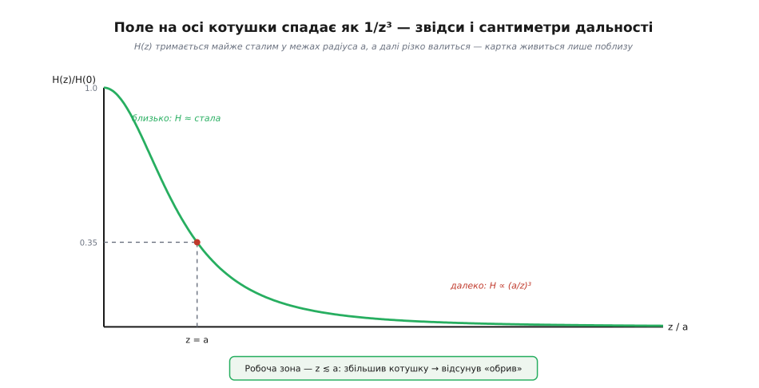
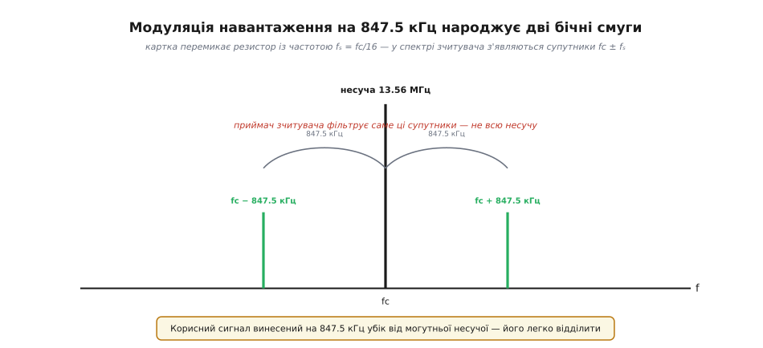
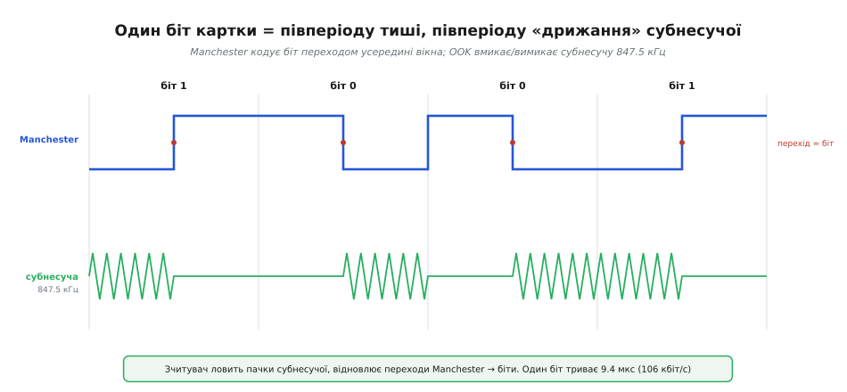
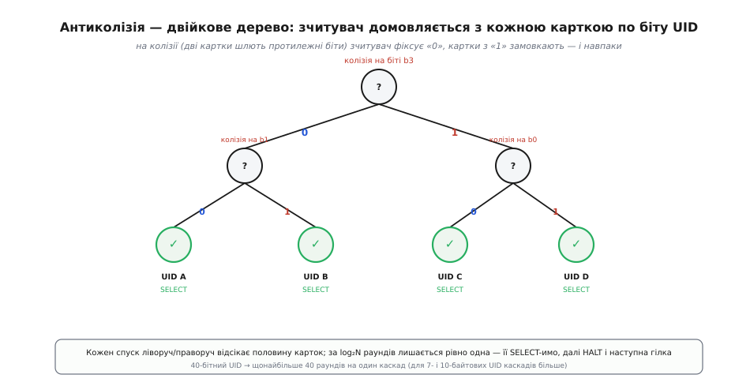

# NFC/RFID зблизька: від взаємоіндукції до протоколу антиколізії

У [базовому кроці](root:embedded/nfc-rfid) ми розібрали головну ідею: картка — це налаштований LC-контур, який живиться від поля зчитувача через взаємоіндукцію, а резонанс домножує мізерні наведення до робочих вольтів; відповідає ж картка модуляцією навантаження. Цього досить, щоб *зрозуміти суть*. Але щойно ви візьмете в руки реальний модуль (скажімо, PN532) і спробуєте прочитати банківську картку, посиплються питання, на які базова картина не відповідає. Чому дальність — саме сантиметри, а не метри чи міліметри? Скільки вольтів насправді треба чипу і звідки береться той коефіцієнт Q? Що фізично летить в ефір, коли картка «говорить», — адже передавача в ній немає? Як зчитувач розрізняє дві картки, що відповідають *одночасно*? І чому банківська картка, транспортна і мітка на товарі — це три різні протоколи, хоч частота в усіх 13.56 МГц?

Цей крок — занурення під кожне з цих питань. Ми виведемо напругу на картці з першопринципів (закон Фарадея → коефіцієнт зв'язку → резонансний підйом), побачимо, звідки береться субнесуча 847.5 кГц і чому корисний сигнал живе на ній, розберемо кодування біт-за-бітом і, нарешті, пройдемо повний танець антиколізії — двійкове дерево по UID, яким зчитувач витягує картки з юрби по одній. Насамкінець — реальна прошивка, яка все це вмикає. Нитку ведемо звідти, де скінчилася базова: припускаємо, що трансформатор без осердя, резонанс і модуляція навантаження вже знайомі, і копаємо глибше.

## Чому взагалі «відбита потужність»: коротка чесна історія

Ідея говорити *відбитою* потужністю — не смикати власний передавач, а модулювати те, що прилетіло від когось іншого, — старша за будь-який чип. У жовтні 1948 року Гаррі Стокман (Harry Stockman) опублікував у *Proceedings of the IRE* статтю «Communication by Means of Reflected Power» («Зв'язок за допомогою відбитої потужності»), де прямо написав: перш ніж відбита потужність стане корисною, доведеться розв'язати ще чимало базових задач. Це усталений факт — стаття Стокмана і сьогодні цитується як точка відліку RFID.

Робочий пристрій із пам'яттю з'явився за чверть століття. Патент Маріо Кардулло (Mario Cardullo) від 23 січня 1973 року описує пасивний радіотранспондер із 16-бітною пам'яттю — прямий предок сучасних міток; демонстрували його ще 1971-го Портовому управлінню Нью-Йорка як пристрій для оплати проїзду. Того ж 1973-го в Лос-Аламоській лабораторії Стів Депп, Альфред Келле і Роберт Фрейман показали пасивні й напівпасивні мітки на *модульованому зворотному розсіянні* (backscatter). Тобто «ідея» (Стокман), «робоча реалізація з пам'яттю» (Кардулло) і «демонстрація backscatter-міток» (Лос-Аламос) — це різні внески різних людей; винахід, як завжди, колективний, і жодній одній особі його приписати не можна.

NFC — молодший нащадок цієї лінії, вже у високочастотній гілці (13.56 МГц). Стандарт NFCIP-1 вийшов 2004 року як ISO/IEC 18092 (він же ECMA-340); того ж року NXP (тодішній Philips Semiconductors), Nokia і Sony заснували NFC Forum, щоб просувати технологію. Важлива деталь для інженера: NFC не винайшов радіоінтерфейс наново — він *успадкував* уже наявні контактні картки ISO/IEC 14443 (Type A від Philips — родина MIFARE; Type B) і Sony FeliCa, додавши до них режим «рівний-з-рівним» і уніфікацію. Тому коли ви читаєте телефоном банківську картку, фізично працює той самий інтерфейс 14443, що й у турнікеті метро десятиліттями. Хто хоче деталей еволюції стандартів і того, як три несумісні світи (14443A, 14443B, FeliCa) звели під один дах, — [історична вставка](root:embedded/nfc-rfid/hist-nfc-standards.md) розкриває це окремо.

> 🔧 **Навіщо це.** Розуміння, що NFC — це надбудова над старими картковими стандартами, рятує години налагодження. Коли ваш модуль «не бачить» картку, перше питання — *який це стандарт*: 14443A, 14443B, 15693 чи FeliCa. Дешевий китайський читач часто підтримує лише 14443A (MIFARE), і банківська картка на ньому просто не відгукнеться — не тому, що модуль зламаний, а тому, що це інший протокол на тій самій частоті.

## Крок за крок: звідки беруться вольти на картці

Базова картина казала «наводяться мілівольти, резонанс домножує їх у Q разів». Тепер виведемо кожну ланку, бо саме числа тут визначають, працюватиме зв'язок чи ні.

### Ланка 1: поле котушки і чому дальність — сантиметри

Почнімо з того, *яке* поле створює котушка зчитувача. Для витка (чи короткої котушки) радіуса a напруженість магнітного поля на його осі, на відстані z від площини, дає закон Біо–Савара:

```
H(z) = I · N · a² / (2 · (a² + z²)^(3/2))
```

де I — струм, N — кількість витків. Придивімося до цього виразу, бо він приховує головну властивість ближнього поля. Просто в центрі (z = 0) поле H(0) = I·N/(2a). А тепер відсунемося:

```
H(z)/H(0) = a³ / (a² + z²)^(3/2)
```

Поки z малий проти радіуса a, знаменник майже не росте — поле тримається майже сталим. Але як тільки z переростає a, член z² починає панувати, і поле валиться *кубічно*: H ∝ (a/z)³. Це і є фізична причина, чому дальність RFID — порядку розміру котушки, і чому «дальнобійна» LF-мітка чіпа тварини потребує більшої антени, а не сильнішого поля.


*Нормоване поле на осі: у межах радіуса a воно майже стале, за ним падає як (a/z)³. Робоча зона живлення — z ≲ a; єдиний спосіб відсунути «обрив» — збільшити котушку, а не струм.*

Тут же ховається межа між «ближнім» і «дальнім» полем. Радіохвиля відривається від антени й летить, коли розмір антени сумірний із довжиною хвилі λ. На 13.56 МГц λ = c/f = 3×10⁸/13.56×10⁶ ≈ 22 метри. Котушка картки — сантиметри, тобто в тисячі разів менша за λ. За таких розмірів антена *не випромінює* помітно — вона запасає енергію в магнітному полі поруч себе. Це не радіозв'язок, це трансформатор. І саме тому підслухати обмін із іншого кінця кімнати фізично важко: поза межами кількох сантиметрів корисного поля просто немає — воно провалилося кубічно.

### Ланка 2: наведена напруга і коефіцієнт зв'язку

Поле котушки зчитувача пронизує котушку картки. За [законом електромагнітної індукції Фарадея](root:ph-electromagnetism/faraday-law) змінний магнітний потік наводить у витках картки напругу. Якщо потік крізь один виток Φ = μ₀·H·A_card (A_card — площа рамки картки), а витків N_card, то ЕРС:

```
V_ind = −N_card · dΦ/dt = −N_card · μ₀ · A_card · dH/dt
```

Поле H синусоїдне з частотою ω = 2πf, тому dH/dt приносить множник ω. Ось перша ключова причина, чому HF (13.56 МГц) віддає більше напруги, ніж LF (125 кГц) за інших рівних: наведена ЕРС *прямо пропорційна частоті*. На 13.56 МГц ω у ~108 разів більший, ніж на 125 кГц, — тому HF-картці досить кількох витків, а LF-мітці треба сотні.

Зручніше, однак, думати не через поле, а через *взаємоіндукцію* M — вона згортає всю геометрію в одне число. Наведена в картці напруга:

```
V_ind = ω · M · I_reader
```

А саму M характеризують безрозмірним [коефіцієнтом зв'язку](root:ph-electromagnetism/mutual-inductance) k:

```
M = k · √(L_reader · L_card),   0 ≤ k ≤ 1
```

Коефіцієнт k каже, яка частка потоку однієї котушки доходить до другої. У трансформатора з феритовим осердям k ≈ 0.95–0.99 — майже весь потік спільний. У повітряному «трансформаторі» RFID на робочій відстані k *дуже* малий: типово 0.01–0.1, а часто й менше. Ось воно, кількісне пояснення базового «зв'язок мізерний»: не абстрактно мізерний, а k ~ 0.05, тобто до картки доходить лише кілька відсотків потоку. Звідки й мілівольти.

> 🔧 **Навіщо це.** Коли треба *передбачити* дальність нового пристрою, k — центральна величина. Він падає з відстанню приблизно так само різко, як поле (∝ 1/z³ на осі), тож подвоєння відстані вчетверо-увосьмеро зменшує зв'язок і наведену напругу. Це пояснює, чому дальність читання так «різко вимикається»: не поступово згасає, а провалюється за коротким плато. Формальне виведення k через геометрію котушок і як його оцінити наперед — у [математичній вставці](root:embedded/nfc-rfid/math-coupling-derivation.md).

### Ланка 3: резонанс перетворює мілівольти на вольти

Тепер найважливіше. Наведені V_ind — це якісь мілівольти, чипу мало. Рятує резонанс. Конденсатор картки підібрано так, щоб власна частота контуру збіглася з частотою зчитувача:

```
f₀ = 1 / (2π·√(L_card · C)) = 13.56 МГц
```

На резонансі індуктивний і ємнісний опори взаємно гасяться, лишається тільки втрати (опір R контуру). Слабенькі наведення приходять точно в такт власним коливанням — і напруга на конденсаторі виростає в [Q разів](root:hw-analog/quality-factor) проти наведеної ЕРС. Виведемо це, бо Q — головний важіль дальності.

Добротність послідовного контуру:

```
Q = ω·L / R = (1/R)·√(L/C)
```

Фізичний зміст: Q — це у скільки разів запасена в контурі енергія більша за ту, що втрачається за один радіан коливання. На резонансі струм у контурі I = V_ind/R, а напруга на конденсаторі:

```
V_C = I · (1/ωC) = V_ind · (1/ωC) / R = V_ind · Q
```

Ось звідки «×Q». Порахуймо на реальних числах.

**Приклад (від наведеної ЕРС до живлення чипа).** Антена картки на 13.56 МГц: 4 витки по периметру ISO-картки, L_card ≈ 1.4 мкГн. Струм у котушці зчитувача I_reader = 0.5 А, коефіцієнт зв'язку на дистанції k = 0.04, L_reader ≈ 1 мкГн, добротність контуру картки Q = 20.

```
M      = k·√(L_reader·L_card) = 0.04·√(1×10⁻⁶ · 1.4×10⁻⁶)
       = 0.04 · 1.18×10⁻⁶ ≈ 47 нГн
ω      = 2π · 13.56×10⁶ ≈ 8.52×10⁷ рад/с
V_ind  = ω·M·I_reader = 8.52×10⁷ · 47×10⁻⁹ · 0.5 ≈ 2.0 В   (амплітуда ЕРС)
V_C    = V_ind · Q = 2.0 · 20 = 40 В  (!) — до обмеження
```

Сорок вольтів — це, звісно, «до обмеження»: реально чип має шунт-регулятор (обмежувач), який зрізає надлишок і тримає живлення на ~3–5 В, інакше вхід би пробило. Але сам розрахунок показує *запас*: навіть коли k упаде вдесятеро (картка далі від антени), V_ind стане 0.2 В, а V_C = 4 В — чип іще житиме. Приберіть резонанс (Q = 1) — і на тій самій дистанції буде 0.2 В, мертва залізяка. Ось чому резонанс не «покращення», а умова існування пасивної картки.

Але у Q є друге лице. Добротність задає не лише підйом напруги, а й *ширину* резонансного піку:

```
Δf = f₀ / Q
```

При f₀ = 13.56 МГц і Q = 20 смуга Δf ≈ 680 кГц. Здавалося б, вища Q — краще (більше напруги). Але корисний сигнал картки, як побачимо далі, живе на субнесучій 847.5 кГц убік від несучої. Якщо смуга контуру вужча за це рознесення, контур *задавить власну відповідь* картки — модуляція навантаження ослабне. Тому Q картки — компроміс: досить високий, щоб живитися, досить низький, щоб пропустити бічні смуги. Практично Q контуру картки тримають у районі 15–40. Це та сама причина, чому надто «добра» антена (дуже висока Q) може живити картку, але погано з нею *спілкуватися* — типова пастка при саморобних антенах.

## Як картка відповідає: модуляція навантаження під мікроскопом

Базова стаття сказала: картка підмикає резистор, зчитувач бачить це в струмі своєї котушки через відбитий опір. Правда, але це лише перший шар. Розгорнімо механіку і дійдемо до того, *що саме* летить в ефір.

### Відбитий опір: чому первинний бік «відчуває» вторинний

Повернімося до трансформатора. Коли на вторинній обмотці (картка) висить навантаження Z_load, з боку первинної (зчитувач) з'являється додатковий, *відбитий* опір:

```
Z_reflected = (ω·M)² / Z_card
```

де Z_card — повний опір контуру картки разом із навантаженням. Ось точна формула того, що базово звалося «навантаження вторинного видно з первинного». Тепер зробімо ключове спостереження: Z_reflected залежить від Z_card, а Z_card картка *може міняти сама*, підмикаючи чи відмикаючи резистор паралельно своєму контуру. Змінила Z_card → змінився Z_reflected → змінився повний опір, який бачить генератор зчитувача → змінилися амплітуда й фаза струму в котушці зчитувача. Картка нічого не випромінює — вона керує *опором, який бачить зчитувач*, крізь спільне поле.

Зверніть увагу на (ω·M)² у чисельнику: відбитий опір пропорційний *квадрату* взаємоіндукції. Це жорстоко: якщо зв'язок k падає вдвічі, наведена напруга падає вдвічі, а *видимість відповіді* картки — вчетверо. Тому межа читання і межа запису різні: живлення (V_ind ∝ M) тягнеться далі, ніж упевнене приймання відповіді (сигнал ∝ M²). Знайома ситуація: картка «майже читається» — живлення ще є, але відповідь уже тоне в шумі.

### Субнесуча: чому картка не смикає резистор «просто в такт бітам»

Тепер тонкість, якої в базовій картині не було і яка є серцем реального протоколу. Якщо картка перемикатиме резистор *повільно*, прямо з частотою даних (сотні кГц), її крихітна відповідь загубиться поряд із могутньою несучою 13.56 МГц: обидва сигнали в тій самій частотній ділянці, а несуча в тисячі разів сильніша. Відділити слабку амплітудну модуляцію від велетенської несучої — майже безнадійно.

Розв'язок елегантний: картка перемикає навантаження не з частотою даних, а зі значно вищою *субнесучою* (subcarrier). У ISO/IEC 14443 Type A ця частота:

```
f_sub = f_c / 16 = 13.56 МГц / 16 = 847.5 кГц
```

Що дає ділення несучої точно на 16? Коли ви множите несучу (13.56 МГц) на перемикання із частотою 847.5 кГц, у спектрі народжується не одна лінія, а *пара* бічних смуг — супутників по обидва боки від несучої:

```
f_c − f_sub = 13.56 МГц − 847.5 кГц = 12.7125 МГц
f_c + f_sub = 13.56 МГц + 847.5 кГц = 14.4075 МГц
```


*Перемикання навантаження на f_c/16 виносить корисний сигнал на пару супутників fc ± 847.5 кГц убік від несучої. Приймач зчитувача фільтрує саме ці супутники — а не всю могутню несучу, тож слабку відповідь картки легко відділити.*

Ось у чому фокус: корисний сигнал тепер *винесений убік* від несучої на 847.5 кГц. Приймач зчитувача ставить смуговий фільтр на бічну смугу — і несуча, яка домінувала, лишається поза фільтром. Слабка відповідь картки, що була б непомітною поряд із несучою, тепер сидить у чистій ділянці спектра. Вибір саме f_c/16 не випадковий: 16 — степінь двійки, тож субнесучу картка отримує простим двійковим дільником від несучої, яку й так «бачить» на своєму контурі. Жодного власного генератора — лише лічильник-дільник, який картка живить від того ж поля.

### Кодування: як біт лягає на субнесучу

Субнесуча — це «носій», але самі біти треба ще закодувати. У напрямку картка → зчитувач ISO 14443 Type A використовує **манчестерське кодування** поверх **OOK** (on-off keying — вмикання/вимикання субнесучої). Манчестер (названий за Манчестерським університетом, де його вживали в ранніх ЕОМ) кодує біт не рівнем, а *переходом* усередині бітового вікна: перехід в один бік — це «1», у другий — «0». Тобто картка ділить кожне бітове вікно навпіл і в одній половині «дрижить» субнесучою (847.5 кГц увімкнено), а в другій мовчить; який саме півперіод активний — той і кодує біт.


*Манчестер кодує біт переходом усередині вікна; OOK вмикає субнесучу там, де рівень «high». Зчитувач ловить пачки 847.5 кГц, відновлює переходи — і читає біти. Одне бітове вікно триває 9.4 мкс.*

Чому перехід, а не рівень? Бо перехід є *в кожному* біті — отже, приймач має регулярний фронт для синхронізації такту, навіть коли йде довга низка однакових біт. Рівневе кодування (просто «є субнесуча = 1, нема = 0») на десятку однакових біт лишило б приймач без жодного фронту й він би «поплив» по такту. Це та сама причина, чому манчестер люблять у багатьох завадостійких лініях: він самосинхронний. Ціна — вдвічі ширша смуга (два стани на біт), але тут це не проблема.

Швидкість базового рівня Type A — 106 кбіт/с. Звідси бітове вікно:

```
T_bit = 1 / 106000 ≈ 9.44 мкс
```

А субнесуча 847.5 кГц укладає в це вікно 847500 / 106000 = 8 повних періодів. Тобто «пачка» активного півперіоду — це чотири коливання субнесучої (пів вікна), достатньо, щоб приймач упевнено виявив «є сигнал». Числа зійшлися: ділення на 16 дає рівно 8 періодів субнесучої на біт, що робить приймач простим — усе прив'язано до однієї несучої простими дільниками.

У зворотному напрямку (зчитувач → картка) кодування інше: **модифікований Міллер** із коротким провалом несучої (~2–3 мкс паузи). Зчитувач не може «вимкнути» несучу надовго — картка від неї живиться і просто помре без живлення. Тому він робить лише короткі виїмки, які картка розпізнає, але які не встигають розрядити її запас. Це асиметрія протоколу: картка кодує «повнокровною» OOK-субнесучою (їй байдуже до чужого живлення), а зчитувач — обережними мікропаузами, щоб не заморити картку голодом. Хто хоче точну механіку модифікованого Міллера, таймінги пауз і CRC — це матеріал для окремого занурення; тут важливо бачити *чому* напрямки кодуються по-різному.

## Дві частоти, три протоколи: чому одне «13.56 МГц» — це не одне

Базово ми поділили світ на 125 кГц і 13.56 МГц. Тепер уточнимо, бо на самій 13.56 МГц співіснує кілька несумісних протоколів, і плутанина між ними — джерело половини проблем на практиці.

**LF, 125–134 кГц (ISO 11784/11785, EM4100 тощо).** Найпростіше й «пробивніше». Довгохвильова магнітна складова краще проходить крізь воду й тканини — тому чіпи тварин працюють на суміжних 134.2 кГц (під шкірою повно води). Ціна — повільні дані (кілька кбіт/с) і сотні витків в антені, щоб набрати наведену напругу на низькій частоті (пам'ятаєте, V_ind ∝ ω). Це світ простих ідентифікаторів: «ось мій номер», без криптографії й складних протоколів.

**HF, 13.56 МГц.** Тут швидкі дані й складні протоколи, але не один:

- **ISO/IEC 14443 (proximity, «поблизу», ~7–10 см).** Дві несумісні гілки: **Type A** (походить від Philips MIFARE — саме її читають дешеві модулі) і **Type B** (інша модуляція, часто в документах і платіжних картках). Це основа безконтактних банківських карток і транспорту.
- **ISO/IEC 15693 (vicinity, «в околі», до ~1–1.5 м).** Той самий 13.56 МГц, але менша швидкість (26.48 кбіт/с у стандартному режимі) в обмін на *більшу дальність*. Тут інша модуляція: два біти кодуються *позицією* паузи 9.44 мкс у символі 75.52 мкс, а субнесуча ~484 кГц. Це світ бібліотечних міток і логістики, де картку не притуляють впритул.
- **FeliCa (Sony, основа NFC-F).** Ще один окремий протокол на 13.56 МГц, панівний у Японії (транспорт Suica, платежі).

І поверх усього цього — **NFC**, який *не* створює нову фізику, а уніфікує: NFCIP-1 (ISO 18092) визначає режими роботи й peer-to-peer, а NFC Forum поверх наявних 14443A/14443B/15693/FeliCa визначає «типи міток» (Type 1–5), щоб телефон умів читати їх усі. Тому «NFC-сумісний» — не одне: це набір протоколів, і конкретний модуль може підтримувати лише частину.

Чому це важливо аж настільки? Бо на *фізичному* рівні всі HF-варіанти живляться однаково (резонансний контур, який ми вивели), але *логічно* говорять різними мовами — різні модуляції, кодування, команди, антиколізії. Модуль, що вміє 14443A, фізично «бачить» енергетичний контур картки 15693, але не розуміє її мову — і рапортує «немає картки». Це не збій, це різні протоколи на спільному фундаменті.

> 🔧 **Навіщо це.** Вибираючи NFC-мітки для проєкту, ви обираєте *протокол і тип*, не просто «NFC». Хочете, щоб телефон читав вашу мітку без застосунку (URL, візитівка) — потрібен NFC Forum Type 2 поверх 14443A (NTAG213/215/216). Робите контроль доступу з дешевим PN532 — теж 14443A (MIFARE). Логістика з дальнім читанням — 15693. Помилка на цьому кроці означає, що куплені мітки просто не читатимуться вашим залізом.

## Багаторівнева машина: від поля до застосунку

Тепер зберемо все у стек. RFID/NFC — не монолітна «магія притулив-і-працює», а класична багаторівнева система, як мережевий стек. Розуміти рівні критично, бо проблема на кожному з них виглядає інакше.

**Рівень 1 — фізичний (поле й енергія).** Те, що ми виводили: резонансні контури, взаємоіндукція, живлення, модуляція навантаження, субнесуча. Тут «не працює» означає *енергетичну* проблему: мала дальність, метал поруч, розладнаний контур. Осцилограф на котушці зчитувача бачить саме цей рівень.

**Рівень 2 — кодування й кадри (біти й байти).** Манчестер/Міллер, OOK, таймінги, CRC. Тут «не працює» — це побитий кадр, неправильна CRC, збій синхронізації. Картка живиться й навіть відповідає, але зчитувач бракує кадр.

**Рівень 3 — антиколізія й активація (одна картка з юрби).** Протокол вибору однієї картки серед кількох у полі. Тут «не працює» — це коли дві картки в полі й зчитувач не може виокремити жодну. Розберемо детально нижче.

**Рівень 4 — прикладний протокол (команди й дані).** Читання/запис блоків пам'яті, автентифікація (у MIFARE — крипто), APDU-команди у платіжних картках. Тут «не працює» — це «картку вибрано, але ключ автентифікації не підходить» чи «команда не підтримується».

Ця драбина пояснює, чому налагодження треба вести *знизу вгору*. Немає сенсу воювати з автентифікацією MIFARE (рівень 4), якщо картка навіть не активується (рівень 3) через слабке живлення (рівень 1). Досвідчений інженер спершу переконується, що картка *взагалі відповідає* (є UID — рівень 3 працює, отже рівні 1–2 теж), і лише тоді лізе в дані.

## Антиколізія: як витягти одну картку з юрби

Ось питання, на яке базова стаття лише натякнула («дві картки — біда»): що робить зчитувач, коли в полі *кілька* карток одразу? Вони ж усі оживають від одного поля й усі готові відповідати. Якщо всі заговорять разом, зчитувач почує кашу. Розв'язок — антиколізія (anticollision), і в 14443 Type A це елегантний **двійковий пошук по дереву**.

### Механізм колізії: чому «0» перемагає

Спершу треба зрозуміти, *що фізично* стається при колізії. Кожна картка має унікальний ідентифікатор UID (для базового каскаду — 4 байти = 32 біти, плюс байт контролю). Зчитувач шле команду ANTICOLLISION і просить картки передати свої UID. Якщо дві картки шлють різні UID, у якийсь момент їхні біти *розійдуться*: одна шле «0», друга «1».

А тепер згадаймо фізику модуляції навантаження: «1» — це субнесуча увімкнена (є пачка 847.5 кГц), «0» — вимкнена. Коли одна картка шле «1» (вмикає навантаження), а друга «0» (не вмикає, тобто «мовчить» на цьому біті), *сумарно* на котушці зчитувача навантаження *ввімкнене* — бо одна картка його ввімкнула. Тобто в позиції розбіжності зчитувач бачить «1», але водночас розуміє: якби всі шле «1», не було б жодної ознаки конфлікту, а тут манчестерський сигнал у цьому вікні *ламається* — обидва півперіоди активні (одна картка дрижить у першій половині, друга в другій). Цей зламаний манчестер і є **виявлена колізія**: зчитувач точно знає *позицію* першого розбіжного біта.

### Двійкове дерево: спуск за log₂N раундів

Знаючи позицію колізії, зчитувач діє так: він фіксує всі біти UID *до* колізії, а на позиції колізії *довизначає* один біт — скажімо, «0» — і шле назад: «мене цікавлять лише картки, чий UID починається з ось цих біт + 0». Картки, чий біт у цій позиції — «1», замовкають (вони не підходять під префікс). Лишаються тільки ті, що мають «0». Якщо їх іще кілька — на наступному розбіжному біті знову колізія, знову вибір. Так за кожен раунд зчитувач *вдвічі* звужує коло кандидатів — це буквально двійковий пошук.


*На кожній колізії зчитувач обирає гілку (0 чи 1) і відсікає половину карток; за log₂N раундів у гілці лишається рівно одна — її SELECT-имо повним UID, потім переводимо в HALT і йдемо в наступну гілку. 40-бітний UID → щонайбільше 40 раундів на каскад.*

Коли в гілці лишилася рівно одна картка, зчитувач має її повний UID і шле команду **SELECT** із цим UID + CRC. Обрана картка переходить у стан ACTIVE, отримує тимчасовий тег і готова до прикладних команд. Далі зчитувач шле їй **HALT** («замовкни й не відповідай, доки не скинуть поле») — і повертається в дерево, спускаючись цього разу в гілку «1», яку раніше відклав. Так одна за одною він перебирає всі картки в полі.

### Кадрова механіка: NVB, каскади, і чому UID буває довшим

Тепер практичні деталі, що визначають реалізацію. Зчитувач керує тим, *скільки* біт UID уже зафіксовано, через байт **NVB** (Number of Valid Bits, кількість дійсних біт). Його старші 4 біти — це скільки *повних байтів* UID уже відомо, молодші 4 біти — скільки *додаткових біт* понад ці байти. Коли NVB каже «відомі всі 40 біт» (значення '70' у шістнадцятковому), команда з ANTICOLLISION перетворюється на SELECT — це той самий кадр, лише повністю заповнений і з CRC.

Далі — каскади. Ранні картки мали 4-байтний UID, але простір 2³² швидко вичерпувався (та й колізії однакових UID стали реальні). Тому ввели довші UID: 7 байт і навіть 10 байт. Оскільки один раунд антиколізії передає лише 4 байти UID (обмеження кадру), довший UID читають *каскадами*: перший каскад (SEL = CL1) віддає перші 3 байти UID + спеціальний байт-мітку «каскад триває» (Cascade Tag, 0x88); другий каскад (CL2) — наступні байти. Прапорець у відповіді на SELECT каже зчитувачеві, чи потрібен ще каскад. Тобто повне читання 7-байтного UID — це два повні проходи антиколізії поспіль. Це пояснює дивну на перший погляд поведінку: короткі UID читаються за один каскад, довші — за два-три, і час активації відчутно різний.

**Приклад (скільки раундів у найгіршому разі).** Уявімо 8 карток у полі, усі з 4-байтними UID, що збігаються в старших бітах і розходяться лише в останніх трьох:

```
Кандидатів спочатку: 8
Раунд 1 (колізія, обрали біт): лишилось 4
Раунд 2: лишилось 2
Раунд 3: лишилось 1  → SELECT цієї картки, потім HALT
```

Три спуски, щоб виокремити одну картку з восьми — це log₂8 = 3, класичний двійковий пошук. Щоб перебрати всі вісім, зчитувач повторить дерево, щоразу відкидаючи вже оброблені (переведені в HALT) картки. Загальна вартість — O(N·log N) раундів на N карток. Тому на практиці кілька карток у полі *читаються*, але помітно повільніше, і що більше карток — то довше. Це вже не «жодна не читається» з базової картини, а «читаються, але з затримкою» — за умови, що їхні контури не розладнали одне одного фізично (це вже рівень 1). Повна покрокова реалізація циклу антиколізії з розбором кадрів і станів картки — у [проєктній вставці](root:embedded/nfc-rfid/proj-anticollision-loop.md).

> 🔧 **Навіщо це.** Розуміння антиколізії пояснює дві типові «дивні» поведінки контролю доступу. Перша: якщо піднести гаманець із кількома картками, зчитувач *може* обрати не ту (він бере першу-ліпшу з дерева) — тому банки й радять діставати картку. Друга: якщо ваш застосунок читає лише *перший* знайдений UID і зупиняється, він працюватиме нестабільно в полі з кількома мітками. Правильний код проходить дерево до кінця (усіх у HALT) або принаймні свідомо бере одну й повідомляє про наявність інших.

## Три режими NFC: чому телефон — і картка, і зчитувач

RFID-мітка вміє одне: бути пасивною карткою. NFC-контролер у телефоні складніший — він уміє три речі, і плутанина між ними теж дає «чому не працює».

**Режим 1 — читач/записувач (reader/writer).** Телефон поводиться як зчитувач: створює поле, живить пасивну мітку, читає/пише її. Так телефон читає NFC-наклейку з URL чи вашу саморобну мітку на NTAG. Тут телефон — активна сторона з полем, мітка — пасивна.

**Режим 2 — емуляція картки (card emulation, HCE).** Телефон *прикидається* пасивною карткою для зовнішнього зчитувача. Так працює Google Pay / Apple Pay: платіжний термінал думає, що перед ним банківська картка 14443, а насправді це телефон, що емулює її (Host Card Emulation — емуляція силами процесора, без окремого захищеного чипа, або через Secure Element). Тут телефон — пасивна сторона, поле створює термінал.

**Режим 3 — рівний-з-рівним (peer-to-peer, NFCIP-1).** Два активні пристрої обмінюються даними напряму (історично — Android Beam для передачі файлів дотиком). Обидва можуть створювати поле по черзі. Цей режим — власне те, що ISO 18092 додав понад старі карткові стандарти; на практиці він майже витіснений іншими каналами (передачу файлів роблять по Wi-Fi Direct, а NFC лише «зводить» пристрої).

Ключове розрізнення для розробника: у режимі 1 *ваш* пристрій має поле й живить мітку; у режимі 2 поле у *чужого* зчитувача, а ваш пристрій лише модулює навантаження, як звичайна картка. Тому емуляція картки на мікроконтролері складніша, ніж читання: треба вчасно й точно модулювати навантаження в чужому полі, витримуючи жорсткі таймінги протоколу, — це вже не «керуй своїм генератором», а «встигни відповісти в чужий такт».

## Від фізики до прошивки: як це вмикається на мікроконтролері

Тепер практика. Ніхто не будує резонансний контур і демодулятор субнесучої на дискретних елементах вручну — усю фізику інкапсулює спеціалізована мікросхема-фронтенд (як PN532, MFRC522, ST25R). Вона містить генератор несучої, підсилювач на антену, демодулятор бічних смуг і навіть мікроконтролерне ядро з логікою протоколів. Ваша прошивка спілкується з нею командами по SPI, I²C чи UART — а вона вже сама розгойдує поле, ловить субнесучу й проганяє антиколізію.

Розгляньмо PN532 — популярний контролер NXP. Усередині — ядро 80C51, і він сам уміє ISO 14443A/B, FeliCa та peer-to-peer. Ваша задача — надіслати йому команду «знайди картку» і забрати UID. Ось як виглядає читання UID картки MIFARE/NTAG по SPI на голому C (спрощено, але у стилі реальної прошивки):

```c
#include <stdint.h>
#include <stdbool.h>

// Команда PN532: InListPassiveTarget — знайти пасивну ціль 106 кбіт/с Type A.
// PN532 сам робить ВСЮ фізику: поле, живлення картки, антиколізію, SELECT.
#define PN532_CMD_INLISTPASSIVE  0x4A
#define PN532_MIFARE_ISO14443A   0x00

// Надіслати кадр команди PN532 і забрати відповідь (SPI-обгортки нижче опущено).
bool pn532_send_command(const uint8_t *cmd, uint8_t clen,
                        uint8_t *resp, uint8_t *rlen);

// Прочитати UID першої картки в полі. Повертає довжину UID (4/7/10) або 0.
uint8_t nfc_read_uid(uint8_t *uid_out)
{
    // Аргументи: [команда][макс. цілей = 1][тип = Type A 106k]
    uint8_t cmd[3] = { PN532_CMD_INLISTPASSIVE, 0x01, PN532_MIFARE_ISO14443A };
    uint8_t resp[32];
    uint8_t rlen = sizeof(resp);

    if (!pn532_send_command(cmd, sizeof(cmd), resp, &rlen))
        return 0;                    // немає відповіді від контролера

    // Формат відповіді InListPassiveTarget:
    //   resp[0] = кількість знайдених цілей (0, якщо картки немає)
    //   resp[1] = номер цілі (Tg)
    //   resp[2..3] = SENS_RES (ATQA), resp[4] = SEL_RES (SAK)
    //   resp[5] = довжина UID
    //   resp[6..] = сам UID
    if (rlen < 6 || resp[0] == 0)
        return 0;                    // у полі немає картки

    uint8_t uid_len = resp[5];
    if (uid_len == 0 || uid_len > 10 || (uint8_t)(6 + uid_len) > rlen)
        return 0;                    // захист від побитого кадру

    for (uint8_t i = 0; i < uid_len; i++)
        uid_out[i] = resp[6 + i];

    return uid_len;                  // 4, 7 або 10 — залежно від типу картки
}
```

Придивіться, скільки роботи сховано за одним викликом. Команда `InListPassiveTarget` наказує PN532: увімкни поле, дочекайся, поки контур картки нарезонує й оживе, проганяй антиколізію (те саме двійкове дерево, яке ми розбирали!), зроби SELECT — і поверни мені UID активованої картки. Уся фізика (резонанс, субнесуча 847.5 кГц, манчестер, каскади UID) відпрацьовує *всередині* мікросхеми; ваш мікроконтролер бачить лише байти UID. Поле `resp[5]` з довжиною UID — це прямий наслідок каскадів, які ми виводили: 4 для короткого UID, 7 для середнього, 10 для довгого. Байти ATQA/SAK (resp[2..4]) кажуть *тип* картки — саме за ними прошивка розрізняє MIFARE Classic, Ultralight чи NTAG, перш ніж лізти в їхню (різну) пам'ять.

**Приклад (цикл опитування з антидребезгом).** У реальному контролі доступу ви не читаєте UID разово, а *опитуєте* поле в циклі й реагуєте на *появу* картки, ігноруючи повторні читання тієї самої, поки її не прибрали:

```c
static uint8_t last_uid[10];
static uint8_t last_len = 0;

void access_control_poll(void)
{
    uint8_t uid[10];
    uint8_t len = nfc_read_uid(uid);

    if (len == 0) {
        last_len = 0;                // поле порожнє — скидаємо пам'ять
        return;
    }

    // Та сама картка досі в полі? — не реагуємо повторно (антидребезг).
    bool same = (len == last_len);
    for (uint8_t i = 0; same && i < len; i++)
        if (uid[i] != last_uid[i]) same = false;
    if (same) return;

    // Нова картка — обробляємо один раз.
    for (uint8_t i = 0; i < len; i++) last_uid[i] = uid[i];
    last_len = len;

    if (access_uid_is_allowed(uid, len))
        door_unlock();
    else
        beep_denied();
}
```

Ця обгортка — місток між фізикою й застосунком. `nfc_read_uid` повертає UID тільки коли рівні 1–3 (поле, кодування, антиколізія) відпрацювали успішно; логіка вище — це вже рівень 4 (прикладний). Антидребезг тут не примха: без нього картка, що лежить у полі, читатиметься десятки разів на секунду й двері «клацатимуть» без упину. Помічаєте, як драбина рівнів проявляється прямо в структурі коду: нижні рівні заховані в мікросхемі й у `nfc_read_uid`, верхній — у вашій логіці доступу.

> 🔧 **Навіщо це.** Знання, що фронтенд робить антиколізію *сам*, економить величезні зусилля: вам не треба реалізувати двійкове дерево вручну — досить одного виклику. Але знати, *що там відбувається*, критично для налагодження: якщо `InListPassiveTarget` уперто повертає 0 при явно піднесеній картці, ви за драбиною рівнів знаєте, куди дивитися — спершу живлення (рівень 1: антена, дистанція, метал), потім тип картки (може, це 15693, якого цей режим не бачить), і лише потім прошивку. Без цієї карти ви б наосліп смикали код.

## Типові граблі — тепер із механізмом

Базова стаття перелічила граблі. Тепер, маючи виведену фізику, ми бачимо *чому* кожна з них ламає зв'язок і на якому рівні драбини.

**Метал під міткою (рівень 1).** Провідна поверхня під антеною — це короткозамкнений виток. За законом Ленца поле картки наводить у металі [вихрові струми](root:hw-components/core-losses), які створюють *протилежне* поле, гасячи первинне. Гірше: близький метал змінює ефективну індуктивність L_card, а отже, зсуває f₀ = 1/(2π√(L_card·C)) — контур розладнується *двічі* (і гасіння, і розлад). Мітки «на метал» мають феритову підкладку: ферит із високою проникністю *відводить* магнітний потік від металу, ведучи його «в обхід». Без ферита наклейка на металевому корпусі просто не читається.

**Дві картки впритул (рівні 1 і 3).** Тут два різні ефекти, які легко сплутати. Фізично (рівень 1): два контури, притулені один до одного, зв'язуються взаємоіндукцією між *собою*, їхні власні частоти «розповзаються» (взаємна індукція розщеплює один резонанс на два зсунуті) — і жоден уже не потрапляє точно в 13.56 МГц, дальність обох падає. Логічно (рівень 3): навіть якби вони обидві живилися, зчитувач мусить прогнати антиколізію, щоб їх розрізнити, і *свідомо* обрати одну. Класична сцена біля турнікета — це найчастіше рівень 1 (контури розладнали одне одного), а не рівень 3.

**Розладнаний контур (рівень 1).** Резонансний пік вузький (Δf = f₀/Q; при Q = 25 це ~540 кГц). Зігнута антена міняє L, зайва ємність поряд (палець, волога, метал) міняє C — і f₀ їде вбік. Оскільки пік вузький, навіть невеликий зсув виводить робочу частоту зі схилу піку, і напруга на картці падає в рази (згадайте: поза резонансом множення ×Q зникає). Тому саморобні антени так вередливі: треба не просто «намотати котушку», а *підстроїти* C під реальну L, щоб f₀ сіла точно в 13.56 МГц.

**Живий чип, мертва картка (рівень 1).** Найчастіша фізична несправність — тріснутий виток периметральної антени після згинання пластику. Чип цілий, але розірваний виток означає розірваний контур: немає L — немає резонансу — немає живлення. Візуально картка ціла, а всередині — обрив на кілька мікрометрів. Це пояснює, чому «раптово перестала працювати» картка, що місяцями лежала в задній кишені й гнулася.

## Найпотужніший родич: бездротова зарядка як та сама фізика

Насамкінець варто побачити, що вся виведена механіка — не вузька екзотика RFID, а загальний принцип, який працює й там, де передають не біти, а вати. Бездротова зарядка (Qi) — це *той самий* трансформатор без осердя з резонансним підстроюванням, лише оптимізований під потужність. Різниці, які прямо випливають з нашої фізики:

- **Частота нижча** (~100–200 кГц замість 13.56 МГц) — бо на потужності важливіші низькі втрати в феритах і силових ключах, а не швидкість даних.
- **Феритові пластини з обох боків** (і в базі, і в телефоні) — щоб *підняти* коефіцієнт зв'язку k якнайближче до одиниці: тут кожен відсоток потоку — це передані вати, а не втрачені. Пам'ятаєте, у RFID k ~ 0.05; у Qi його женуть до 0.3–0.7 феритами й точним суміщенням котушок.
- **Резонанс — теж, але заради ККД,** а не заради виживання: узгоджені резонансні контури передають потужність ефективніше, ніж просто зв'язані котушки.
- **Зворотний канал** для узгодження (телефон каже базі «дай більше/менше потужності») працює… модуляцією навантаження — точнісінько як картка відповідає зчитувачу. Коло замкнулося: керування зарядкою користується тим самим трюком відбитого опору, що й пасивна мітка.

Отже, від безбатарейної картки до зарядки телефона — один фізичний кістяк: котушка наводить у котушку, резонанс рятує слабкий зв'язок, а зворотний бік «говорить» зміною власного навантаження, яку первинний бік бачить крізь спільне поле. Змінюються лише частоти й пріоритети (біти проти ватів), але рівняння, які ми вивели, — ті самі.

Ми пройшли шлях від закону Фарадея до реального рядка `InListPassiveTarget` у прошивці: вивели наведену напругу через коефіцієнт зв'язку, показали, як резонанс робить пасивну картку взагалі можливою, розкрили субнесучу й кодування, пройшли двійкове дерево антиколізії й побачили, як усе це вмикається одним викликом до мікросхеми-фронтенда. Головне, що варто винести: NFC/RFID — не магія, а акуратно складена драбина рівнів, і кожне «не працює» має свій рівень і свій механізм. Знаючи їх, ви налагоджуєте не наосліп, а прицільно.
