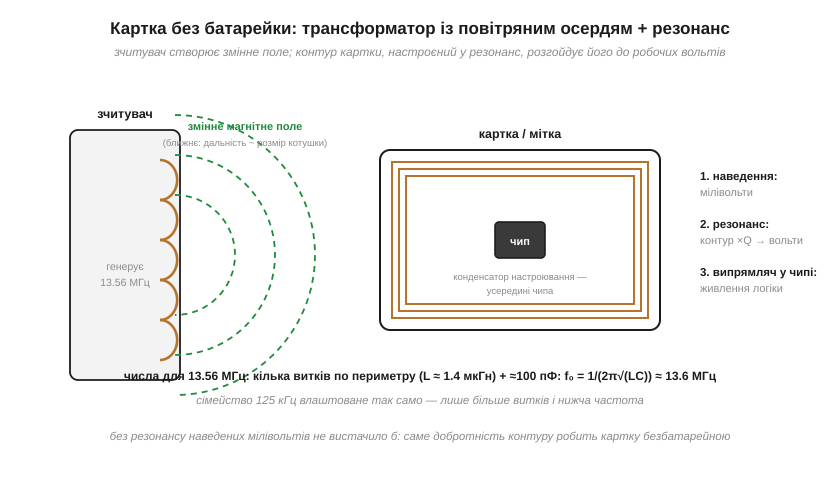
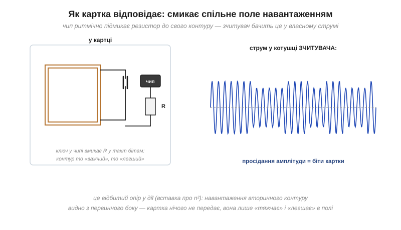

# Резонанс, що живить картку: RFID і NFC як налаштовані LC-контури

### Клас пристрою

**Пасивна мітка** (*RFID tag*; транспондер — від англ. *transponder*, стяжки *transmitter* + *responder*) — це антена-котушка (кілька витків по периметру картки), конденсатор настроювання (найчастіше вже всередині чипа) і сам чип. **Зчитувач** — своя котушка, в яку електроніка жене змінний струм робочої частоти. Два головні сімейства: **125 кГц** (LF: перепустки, брелоки, чіпи тварин) і **13.56 МГц** (HF: NFC у телефонах, банківські й транспортні картки). Влаштовані однаково — різняться частотою і кількістю витків.

### Крок 1: трансформатор із повітряним осердям

Котушка зчитувача створює змінне магнітне поле; котушка картки, потрапивши в нього, стає **вторинною обмоткою трансформатора** через [взаємоіндукцію](topic:electronics/mutual-inductance) — у ній наводиться напруга. Але «осердя» тут повітря, відстань — сантиметри, тож зв'язок мізерний: наводяться лише **мілівольти**, чипу цього зовсім не досить. І саме тут промисловість застосувала [резонанс](topic:electronics/lc-resonance).

### Крок 2: резонанс домножує

Конденсатор картки підібраний так, щоб власна частота її контуру **збіглася** з частотою зчитувача: f₀ = 1/(2π√(LC)) = 13.56 МГц. Тепер слабенькі наведення приходять точно в такт власним коливанням контуру — і той [розгойдується, як гойдалка під влучні поштовхи](topic:electronics/lc-resonance): напруга на контурі виростає приблизно в **Q разів**, де Q — [добротність контуру](topic:electronics/quality-factor). З мілівольтів стають вольти, [випрямляч](topic:electronics/rectification) усередині чипа перетворює їх на постійне живлення — і чип оживає, не маючи ані батарейки, ані дроту.


*Три кроки безбатарейного живлення: наведення через взаємоіндукцію (мілівольти), резонансне розгойдування контуру (×Q — вольти), випрямляч у чипі. Контур картки — буквально кілька витків по периметру плюс ~100 пФ у чипі.*

**Приклад (перевіримо числа).** Антена картки на 13.56 МГц — типово 3–4 витки по периметру, L ≈ 1.4 мкГн; конденсатор у чипі ≈ 100 пФ:

```
f₀ = 1/(2π·√(1.4×10⁻⁶ · 100×10⁻¹²)) ≈ 13.5 МГц   ✓
```

А резонансне множення: нехай наведення дає 0.3 В, добротність контуру Q ≈ 15 — на чипі буде близько 4.5 В. Без резонансу картка була б мертвою залізякою.

### Крок 3: як картка відповідає

Передавача в картці немає — і він не потрібен. Чип «говорить» **модуляцією навантаження** (*load modulation*): у такт бітам він підмикає до свого контуру резистор, роблячи контур то «важчим», то «легшим» для поля. А зчитувач відчуває це у **власній** котушці — як коливання струму. Працює **відбитий опір** [взаємоіндукції](topic:electronics/mutual-inductance) (див. також [вставку про n²](topic:electronics/mutual-inductance/math-turns-ratio.md)): навантаження вторинного боку видно з первинного. Картка нічого не випромінює — вона ритмічно смикає спільне поле, і цього досить для обміну даними.


*Чип вмикає й вимикає резистор на своєму контурі — амплітуда струму в котушці зчитувача просідає в такт бітам. Уся «передача» картки — це керована зміна відбитого опору.*

### Чому дві частоти

**125 кГц** — простіше й «пробивніше»: довгопольова магнітна складова краще проходить крізь воду й тканини (тому чіпи тварин — суміжні 134.2 кГц), але повільні дані й більше витків в антені. **13.56 МГц** — швидкі дані, складніші протоколи (NFC), компактна антена з кількох витків. Обидва сімейства — **ближнє поле**: працює взаємоіндукція, а не радіохвиля, тож дальність — порядку розміру котушки (сантиметри). Це не вада, а захист: підслухати «розмову» з іншого кінця кімнати важко фізично.

### Типові граблі

- **Метал під міткою.** Провідна поверхня — це короткозамкнений виток: [вихрові струми](topic:electronics/core-losses) гасять поле й розладнують контур. Мітки «на метал» мають феритову підкладку, що відводить поле від поверхні.
- **Дві картки разом.** Контури в одному гаманці зв'язуються взаємоіндукцією, їхні f₀ розповзаються — зчитувач не бачить жодної. Знайома сцена біля турнікета.
- **Розладнаний контур.** Резонансний пік вузький (висока [добротність Q](topic:electronics/quality-factor)): зігнута антена чи зайва ємність поряд зсуває f₀ — і дальність падає в рази.
- **Живий чип, мертва картка.** Найчастіша несправність — тріснутий виток периметральної антени після згинання; чип цілий, але живити його нічим.

### Варіації класу

LF-брелоки й імплантні капсули, HF-картки і NFC у телефоні (антена — навколо батареї чи на кришці), паперові стікери-мітки. І найпотужніший родич — **бездротова зарядка**: та сама взаємоіндукція з резонансним підстроюванням на ~100–200 кГц, лише оптимізована під передачу ватів, а не бітів. Скрізь один і той самий механізм: трансформатор без осердя, який рятує резонанс.
