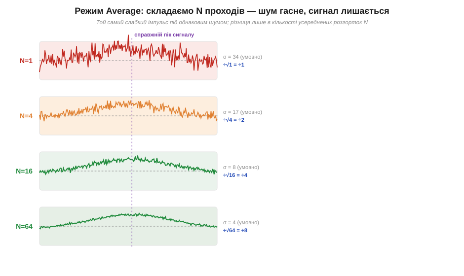
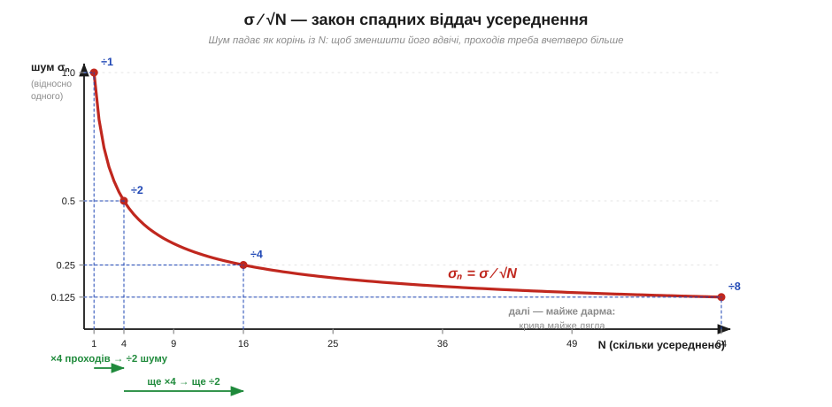

# 🧮 Чому усереднення працює: σ ∕ √N

Шукаючи джерело завади, ви рано чи пізно вмикаєте на осцилографі режим **усереднення** (*Average*) — і слабкий сигнал, що тонув у «траві», раптом проступає чистою лінією. За цим стоїть одна формула з математичної статистики — **σ ∕ √N**: усереднивши N незалежних розгорток, ми зменшуємо шум не в N разів, а лише в **корінь** із N. Тут — рівно стільки цієї формули, скільки треба, щоб рахувати усереднення на екрані; загальне [виведення σ ∕ √N із незалежності вимірювань](topic:hw-sensing/averaging-gain) належить статистиці.

### Чому саме корінь, а не N

Ідея усереднення проста: справжній сигнал **щоразу той самий**, а [шум](root:embedded/noise-interference) **щоразу новий і незалежний**. Склавши N розгорток і поділивши на N, справжню частину лишаємо на місці (вона ж не мінялася), а випадкові кидки частково гасять одне одного — додатні й від'ємні відхилення тягнуть у різні боки. Ширину цих кидків міряє **стандартне відхилення** (*standard deviation*, σ) — те саме σ гаусового дзвону, яким описують розкид випадкової напруги.

Але гасяться вони **не повністю**. Якби шум спадав пропорційно N, вистачило б кількох розгорток. Натомість незалежні відхилення додаються не як звичайні числа, а «по теоремі Піфагора» — через суму **квадратів**; тому розкид середнього спадає лише як корінь:

```
σ_середнього = σ / √N
```

Щоб зменшити шум удвічі, мало взяти вдвічі більше вимірювань — їх треба **вчетверо** більше. Сигнал μ при цьому не змінився, а шум упав у √N разів — отже, відношення сигнал ∕ шум (*signal-to-noise ratio*, SNR) **зростає теж як √N**. Кілька орієнтирів, які варто просто запам'ятати:

```
N = 4    →  шум ÷2     (−6 дБ)
N = 16   →  шум ÷4     (−12 дБ)
N = 100  →  шум ÷10    (−20 дБ)
N = 1000 →  шум ÷31.6  (−30 дБ)
```


*Один і той самий слабкий імпульс під однаковим шумом, усереднений по N = 1, 4, 16, 64 розгортках. Справжній сигнал (фіолетовий пік) стоїть на місці, а «трава» навколо нього стискається: при N = 64 шум увосьмеро вужчий, ніж при N = 1, і форма імпульсу нарешті читається.*

### Приклад: скільки розгорток усереднити

**Сигнал має розмах шуму ≈ 30 мВ peak-to-peak** (для гаусового шуму [розмах ≈ 6σ](root:embedded/noise-interference), тобто σ ≈ 5 мВ). Корисний сигнал — слабкий імпульс ~10 мВ, який «на око» не видно. Скільки розгорток усереднити, щоб шум упав до 1 мВ?

```
треба:  σ / √N = 1 мВ,  при σ = 5 мВ
√N = σ / 1 мВ = 5
N  = 25 розгорток
```

Двадцяти п'яти проходів досить, щоб шум став уп'ятеро тихішим і імпульс упевнено проступив. Хотіти ще вдесятеро тихіше (0.1 мВ)? Тоді N = 2500 — і тут уже впирається в час: осцилограф мусить зловити дві з половиною тисячі однакових розгорток. Ось закон спадних віддач кореня: перші вимірювання дають найбільший виграш, а кожна наступна сходинка чистоти коштує вчетверо більше проходів за вдвічі тихший шум.


*Шум середнього як функція N. Перші вимірювання дають найбільший виграш; далі крива стрімко вирівнюється. Перехід від N = 1 до N = 4 ділить шум навпіл, від 4 до 16 — ще навпіл, але кожен наступний крок коштує дедалі більше проходів за дедалі менший зиск.*

### Межа: тільки для незалежного шуму

Корінь √N працює **лише** для незалежного, нескорельованого шуму ([теплового](topic:ph-condensed/thermal-noise), [дробового](topic:ph-condensed/shot-flicker-noise)) — того, що від розгортки до розгортки новий. **Періодичну** заваду — [гул 50 Гц](topic:ph-electromagnetism/capacitive-coupling) — звичайне усереднення прибере погано: вона не випадкова, повторюється від розгортки до розгортки й не гасить сама себе. Саме тому, полюючи на заваду, спершу з'ясовують її **природу**: випадкову «траву» втихомирює √N, а регулярний гул доводиться ловити інакше — синхронізацією, екрануванням чи фільтром.
