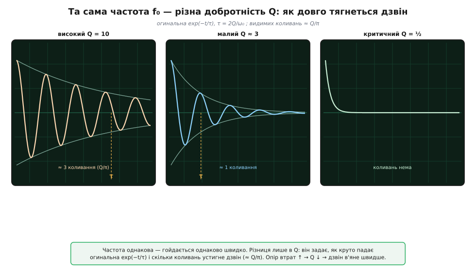

# 🧮 Дзвін щупа: LC-контур землі, добротність і згасання

Ми вже встановили факт, від якого тижнями страждають налагоджувачі: земляний хвіст щупа разом із ємністю наконечника — це **послідовний коливальний контур**, і на швидкому фронті він домальовує до сигналу власний дзвін, якого в схемі немає. Ми навіть назвали його частоту: приблизно 106 МГц для 15-сантиметрового «крокодила» й 335 МГц для короткої пружини. Тут доведемо ці числа до кінця й дамо відповідь на три практичні питання: **наскільки** дзвінкий цей дзвін, **як довго** він тягнеться по екрану і чому проти нього працюють коротка земля, опір наконечника й активний щуп.

Сама фізика цього контуру — загальна, і виведена в книжкових вставках про резонанс: [чому LC-петля коливається сама й звідки в частоті корінь із добутку L·C](root:hw-analog/lc-resonance/math-thomson-formula.md) та [що таке добротність Q і як вона задає тривалість дзвону](root:hw-analog/quality-factor/math-q-factor.md). Ті самі рівняння описують гойдалку з тертям і масу на пружині; контур землі щупа — просто їхнє електричне втілення. Тут ми беремо ці результати готовими й прикладаємо до конкретного кола щупа, де все вирішують три його числа.

### Контур землі щупа: L, C і R у числах

Коли ви торкаєтеся вістрям точки схеми, а «крокодилом» — землі поряд, струм, що заряджає й розряджає вхід щупа, біжить по замкненому колу: **вістря → внутрішня ємність входу → земляний хвіст назад до точки землі**. У кільці три різні за природою учасники, і кожен відповідає за свій бік поведінки.

- **Індуктивність L** — сам земляний хвіст. Будь-який відрізок дроту, по якому тече струм, запасає енергію в магнітному полі; для тонкого дроту над землею [індуктивність](root:ph-electromagnetism/inductance) зростає майже лінійно з довжиною — груба, але надійна робоча оцінка **близько 1 нГн на міліметр** (типовий заводський «крокодил» дає 20–25 нГн на дюйм — те саме число). Звідси наші L: 15 см ≈ 150 нГн, 1.5 см ≈ 15 нГн.
- **Ємність C** — вхід щупа з наконечником: пластини, між якими проскакує струм зміщення без прямого дроту. У пасивного щупа з дільником 10× це типово 10–15 пФ. Візьмемо C ≈ 15 пФ як робоче число.
- **Опір R** — сума всіх втрат уздовж кола: опір самого тонкого дроту хвоста, перехідний опір контакту «крокодила», скін-ефект на високій частоті. Поодинці кожен дрібний — разом одиниці-десятки ом. Здавалося б, зайвий і лише псує картину — а насправді **саме R гасить дзвін**, і що його більше, то швидше згасання. Це той рідкісний випадок, коли втрати — благо.

> 🔧 **Навіщо це.** Саме лінійність «нГн на міліметр» робить довжину хвоста прямою ручкою керування резонансом. Ви не міняєте загадковий «щуп» — ви міняєте цілком конкретну L і знаєте наперед, у скільки разів. Це перетворює боротьбу з дзвоном із шаманства на розрахунок.

### Частота: 106 МГц і 335 МГц, і чому вкорочення в 10 разів дає √10

Резонансна частота послідовного контуру — f₀ = 1 ∕ (2π·√(L·C)); [звідки саме корінь із добутку L·C](root:hw-analog/lc-resonance/math-thomson-formula.md) — у книжковій вставці. Підставмо наші числа.

**На якій частоті дзвенить довгий і короткий земляний хвіст.**

```
крокодил ≈15 см → L ≈ 150 нГн,  C ≈ 15 пФ:
  L·C    = 150·10⁻⁹ · 15·10⁻¹² = 2.25·10⁻¹⁸ с²
  √(L·C) = 1.5·10⁻⁹ с
  f₀ = 1 / (2π · 1.5·10⁻⁹) ≈ 106 МГц

пружина ≈1.5 см → L ≈ 15 нГн,  той самий C ≈ 15 пФ:
  f₀ = 1 / (2π·√(15·10⁻⁹ · 15·10⁻¹²)) ≈ 335 МГц
```

Ось де корінь відпрацьовує на нас. Ємність C ми **не чіпали** (той самий наконечник), змінилася лише L — і то рівно в 10 разів (15 см → 1.5 см, бо L лінійна за довжиною). Через корінь частота підскочила не в 10, а в √10 ≈ 3.16 рази:

```
f₀(пружина) / f₀(крокодил) = √(L_крокодил / L_пружина) = √(150/15) = √10 ≈ 3.16
перевірка числами:  335 МГц / 106 МГц ≈ 3.16 ✓
```

Це не «слабенький» виграш, як може здатися («вкоротив у 10 разів, а частота лише втричі?»). Утричі по частоті — це саме те, що виносить резонанс **за смугу приладу**. Осцилограф зі смугою 200 МГц чесно малює дзвін на 106 МГц (він у смузі — прилад його пропускає), але фізично **не пропускає** 335 МГц: вхідний тракт сам ріже все, що вище 200 МГц. Тому дзвін пружини не те щоб «маленький» — його на екрані **немає**, бо прилад до нього глухий. Щоб винести резонанс за смугу, не треба вкорочувати хвіст стократно: вистачає десятикратного, бо √10 множить частоту саме на потрібні три з гаком.

### Добротність: чому коротка земля рятує двічі

Частота каже, **як швидко** гойдається контур, але нічого не каже про те, **чи довго**. Два контури з тією самою f₀ можуть виглядати на екрані протилежно: один видасть одне-два кволі коливання й стихне, інший розгойдається на десяток дзвінких періодів. Різницю ловить [добротність Q](root:hw-analog/quality-factor/math-q-factor.md) — у скільки разів реактивний опір контуру більший за його опір втрат. Для послідовного контуру Q = √(L ∕ C) ∕ R, де √(L ∕ C) — **характеристичний опір** Z₀ (спільна величина реактивних опорів котушки й конденсатора на резонансі). Порахуймо його для наших контурів; опір втрат візьмімо помірний R = 10 Ом:

```
крокодил:  Z₀ = √(L/C) = √(150·10⁻⁹ / 15·10⁻¹²) = √(10⁴) = 100 Ом
           Q = Z₀/R = 100/10 = 10       ← дзвінкий, десяток видимих коливань
пружина:   Z₀ = √(15·10⁻⁹ / 15·10⁻¹²) = √(10³) ≈ 31.6 Ом
           Q = Z₀/R = 31.6/10 ≈ 3.16    ← кволий, згасне за 2-3 коливання
```

Ось прихована друга причина, чому пружина рятує. Коротший хвіст не лише **піднімає** частоту (менше L) — він ще й **знижує характеристичний опір** Z₀ = √(L ∕ C), а отже за того самого R **знижує добротність**. Один і той самий корінь √(L ∕ C) б'є по дзвону двічі: виносить його частоту за смугу *і* робить його менш добротним. Крокодил із Q = 10 дзвенів би дзвінко, якби ми його чули; пружина з Q ≈ 3 згасла б за пару коливань навіть у смузі. Це не два незалежні щастя, а один корінь, що працює на нас із двох боків.

> 🔧 **Навіщо це.** Розуміння Q рятує від хибного висновку «дзвін маленький, отже контур добрий». Дзвін маленький може бути з двох різних причин: або резонанс за смугою (частота), або низька добротність (згасання). Це різні хвороби з різними ліками. Побачивши на екрані кілька кволих коливань, ви за їхньою **кількістю** одразу оцінюєте Q і розумієте, з чим маєте справу.

### Скільки живе хвіст: стала часу τ і число коливань Q ∕ π

Тепер — **як довго** тягнеться дзвін. Огинальна (*envelope*) коливань спадає експонентою exp(−t ∕ τ): за час τ розмах падає в e ≈ 2.72 рази, за 3τ — практично до нуля. Стала часу [виводиться з рівняння контуру](root:hw-analog/quality-factor/math-q-factor.md) і дорівнює:

```
τ = 2L/R = 2Q/ω₀
```

Дуже промовисто: більша індуктивність (більше запасу-інерції) — повільніше згасання; більший опір (більше тертя) — швидше. А через Q це дає просте екранне правило: період одного коливання T = 2π ∕ ω₀, тож число коливань за час τ — це τ ∕ T = Q ∕ π. **Дзвін живе приблизно Q ∕ π повних коливань** (до спаду в e разів; до майже повного зникнення — утричі більше). Порахуймо τ для крокодила (ω₀ = 2π·106·10⁶ ≈ 6.66·10⁸ рад/с, період T ≈ 9.4 нс):

```
Q = 10   →  τ = 2Q/ω₀ = 20 / 6.66·10⁸ ≈ 30 нс  →  ≈ 3 видимі коливання (Q/π = 10/π ≈ 3.18)
```

Тепер знизьмо добротність до Q ≈ 3.16 — і випливе тонкість, яку легко проґавити. Дійти до цього самого Q можна двома різними шляхами, і **число** коливань Q ∕ π ≈ 1 в обох однакове (Q ∕ π про частоту нічого не знає), а от **тривалість** τ = 2Q ∕ ω₀ у них різна, бо в неї входить іще й ω₀. Порахуймо обидва шляхи поряд:

```
той самий крокодил, лише додано опір у наконечник — ω₀ незмінна (106 МГц),
R піднято з 10 до ≈31.6 Ом, тож Q = Z₀/R = 100/31.6 = 3.16:
  τ = 2Q/ω₀ = 6.32 / 6.66·10⁸ ≈ 9.5 нс   →  Q/π ≈ 1 коливання

пружина сама — коротша земля дає Z₀ = 31.6 Ом (Q = 31.6/10 = 3.16 при тому ж R),
але й піднімає ω₀ до 2π·335·10⁶ ≈ 2.1·10⁹ рад/с:
  τ = 2Q/ω₀ = 6.32 / 2.1·10⁹  ≈ 3.0 нс   →  Q/π ≈ 1 коливання
```

Обидва хвости — приблизно одне коливання, та живуть вони різний час. Крокодил із додатковим опором усе ще дзвенить на 106 МГц, і той «один період» триває ≈ 9.5 нс; пружина ж коливається втричі швидше (335 МГц), тож те саме одне коливання займає в неї лише ≈ 3 нс. Q каже, **скільки** буде коливань; ω₀ каже, **які вони завдовжки**; разом вони й дають τ. Ось чому коротка земля дужча за простий демпфер: вона й Q збиває, і частоту піднімає — у τ = 2Q ∕ ω₀ обидві зміни вкорочують хвіст, тоді як демпфер сам чіпає лише Q.

Тридцять наносекунд дзвону крокодила на кожному фронті — і якщо ваш сигнал перемикається кожні кількасот наносекунд, кожен фронт «замазаний» цим паразитним хвостом. Знизьте Q до трьох — байдуже, коротшою землею чи опором у наконечнику — і дзвін в'яне до одного кволого коливання. Це й є математичний портрет того, що на екрані з попереднього кроку виглядало як «крокодил дзвенить, пружина — ні». А заразом — практичний спосіб **зчитати Q прямо з екрана**: полічив коливання дзвону, помножив на π — маєш добротність, а з неї й опір втрат R = Z₀ ∕ Q. Осцилограма сама розповідає всю фізику контуру.


*Три дзвони однакової частоти f₀, але різної добротності. Високий Q (мало втрат) — огинальна exp(−t∕τ) спадає повільно, видно багато коливань (≈ Q∕π періодів до спаду в e разів). Малий Q — огинальна круто падає, дзвін гасне за одне-два коливання. Крайній випадок Q = ½ (критичне згасання) — коливань нема зовсім, лише плавний перехід. Стала часу τ = 2Q∕ω₀ прямо задає, скільки живе хвіст.*

### Три висновки для практики

Тепер зберімо все докупи й доведімо до практики три висновки, заради яких і писалася вся математика.

**Опір наконечника — союзник.** Обидві формули τ = 2L ∕ R і Q = Z₀ ∕ R кажуть одне: **більший R душить дзвін**. Звідси нехитрий, але дієвий прийом для випадків, коли вкоротити землю не вийшло: навмисне **додати послідовний опір** у наконечник — крихітний резистор в одиниці-десятки ом прямо біля вістря. Він майже не чіпає частоту (R стоїть не під коренем f₀), зате прямо збиває Q і скорочує τ. Дзвін в'яне, фронт стає читабельним. Це і є принцип «демпфувального наконечника»: ми свідомо доливаємо контурові тертя, щоб приборкати його власний резонанс. Те, що інтуїтивно здавалося вадою (опір у колі), виявилося ручкою гучності дзвону.

**Активний щуп стирає проблему.** Уся біда тримається на добутку L·C під коренем. Землю ми стискаємо, скільки можемо, — але L не опустити нижче кількох наногенрі (дріт мусить бути бодай якийсь). Лишається бити по **C**. Пасивний щуп 10× дає C ≈ 10–15 пФ; **активний щуп** — це підсилювач із крихітним польовим входом прямо в наконечнику, і його вхідна ємність падає до **~1 пФ**, іноді нижче:

```
активний щуп, C = 1 пФ, узяти навіть довгий хвіст L = 150 нГн:
  f₀ = 1/(2π·√(150·10⁻⁹ · 1·10⁻¹²)) ≈ 411 МГц

активний щуп + коротка земля, C = 1 пФ, L = 15 нГн:
  f₀ = 1/(2π·√(15·10⁻⁹ · 1·10⁻¹²)) ≈ 1.3 ГГц
```

Зменшили C в 15 разів — і f₀ підскочила в √15 ≈ 3.9 рази (з 106 до 411 МГц) **навіть не чіпаючи землю**; а з короткою землею активного щупа резонанс злітає за гігагерц — туди, куди жоден звичайний осцилограф і не зазирає. Ось чому для найшвидших сигналів активний щуп — не примха, а необхідність: він атакує *обидва* співмножники добутку L·C (крихітна C власною конструкцією, мала L короткою землею) і заганяє власний резонанс так високо, що він фізично поза досяжністю приладу. Пастка «щуп дзвенить» просто зникає — не тому, що ми її лікуємо, а тому, що резонанс живе там, де прилад сліпий.

**Три числа контуру керують усім, що ви бачите:** f₀ — як швидко гойдається дзвін, Q — наскільки він дзвінкий, τ — як довго тягнеться хвіст. Коротка земля б'є по L і одразу по частоті (√10 — за смугу) і по Q (втричі тихше); додатковий опір наконечника душить дзвін через R; активний щуп із C ≈ 1 пФ виносить резонанс за гігагерц. Скрізь під капотом — той самий корінь із добутку «інерція × піддатливість», лише повернутий до нас то одним, то іншим боком. Знаючи його, ви більше не полюєте на привида власного щупа — ви читаєте його дзвін як відкриту книгу.
