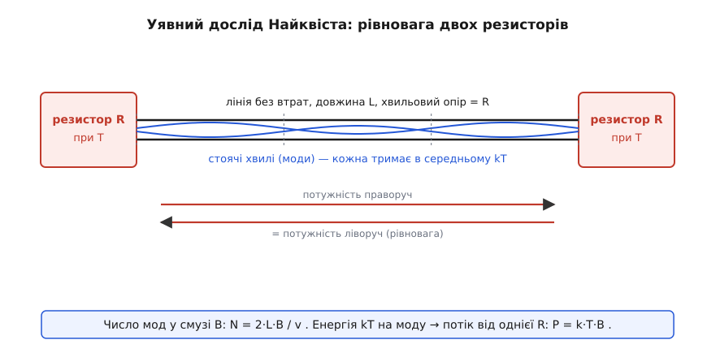
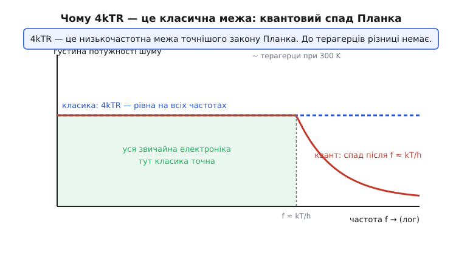

# 🧮 Виведення формули Найквіста: звідки береться 4kTR

> У детальному кроці ми взяли формулу теплового шуму `Uшум = √(4·k·T·R·B)` як дане й одразу нею користувалися — рахували стелю чутливості, шум входу АЦП, kTC-шум. Це чесно для роботи, але лишає незручне питання: **чому саме так?** Чому під коренем стоїть добуток `k·T` — енергія теплового руху, — а не, скажімо, `kT²` чи `(kT)²`? Звідки взявся множник **рівно 4**, а не 2 чи 8? І чому в найкрасивішій формулі прикладної фізики немає жодного сліду матеріалу — ні міді, ні вуглецю, ні технології? Ця вставка проходить виведення Найквіста крок за кроком, від першого принципу до кінцевої формули, нічого не оголошуючи готовим. Наприкінці стане видно ще й дивовижну річ: та сама формула — це одновимірний окремий випадок закону випромінювання чорного тіла, і в неї, як і в Планка, ховається квантова поправка.

Мета тут не запам'ятати виведення напам'ять, а **зрозуміти механізм** — бо той, хто бачить, звідки береться кожен множник, уже не сплутає, коли формула працює, а коли ламається. Виведення варте цього: воно з'єднує термодинаміку, лічбу хвиль і закон Ома в одну коротку нитку, а в кінці несподівано впирається у квантову фізику.

## Що саме доводимо

Спершу чітко запишемо ціль, щоб було видно, куди йдемо. Резистор опором `R` при абсолютній температурі `T`, ні до чого не підключений, сам собою видає на виводах крихітну хаотичну напругу. У смузі частот шириною `B` її середньоквадратичне (RMS) значення дорівнює:

```
Uшум = √(4·k·T·R·B)

k = 1.38·10⁻²³ Дж/К   (стала Больцмана — місток між температурою й енергією)
T — абсолютна температура, K
R — опір, Ω
B — смуга частот, Гц
```

Зручніше працювати з **квадратом** напруги (тобто з потужністю, а не з амплітудою) — тоді зникають корені й видно лінійні залежності:

```
⟨U²⟩ = 4·k·T·R·B
```

Кутові дужки `⟨…⟩` — це усереднення в часі (середнє за багатьма митями). Саме `⟨U²⟩` — середній квадрат — має чіткий фізичний зміст: він пропорційний [середній потужності](root:ph-electromagnetism/electric-power) шуму, тоді як середнє від самої напруги дорівнює нулю (плюси гасять мінуси). Про те, чому шум описують через квадрат і чому `√⟨U²⟩` — це і є RMS, докладніше у статті [середнє й дисперсія](root:math-probability/mean-variance); тут це нам знадобиться як робочий факт.

Наша задача — вивести цю рівність із фізики, не постулюючи її. Знадобляться рівно три інгредієнти: **теорема про рівнорозподіл енергії** (скільки енергії припадає на кожен спосіб її запасати), **лічба хвиль** у лінії передачі (скільки таких способів є в смузі `B`) і **закон Ома** для узгодженого навантаження (як перевести потужність у напругу). Візьмемо їх по черзі.

## Перший принцип: kT на кожен спосіб запасати енергію

Найглибший інгредієнт — термодинамічний, і без нього нічого не вийде. Він відповідає на питання, звідки взагалі береться `kT`.

Уявімо будь-яку фізичну систему при температурі `T`, у якій щось коливається — маятник, молекула газу, заряди в провіднику. Тепловий рух безперервно «підкачує» в кожен спосіб коливання енергію й так само безперервно її відбирає, і в рівновазі встановлюється певна **середня** енергія на кожен такий спосіб. Наскільки середня? Відповідь дає **теорема про рівнорозподіл енергії** (*equipartition theorem*, [окрема тема](root:ph-thermodynamics/equipartition-theorem)): на кожен **квадратичний ступінь вільності** — кожен незалежний доданок в енергії, що входить у неї як квадрат (кінетична `½mv²`, пружна `½kx²`, енергія в котушці `½LI²`, енергія в конденсаторі `½CU²`) — у середньому припадає рівно:

```
⟨E на один квадратичний ступінь вільності⟩ = ½·k·T
```

Це напрочуд універсальний закон: половина `kT` на кожен квадратичний доданок, і байдуже, що це за система — газ, пружина чи електричне коло. `k` тут — саме той перевідник температури в енергію: помножили градуси на `k` — дістали джоулі.

> 🔧 **Навіщо це.** `½kT` — це «квант» теплової енергії статистичної фізики, і саме він задає масштаб усіх теплових шумів. Коли ви бачите в даташиті будь-яку шумову цифру, знайте: під нею завжди стоїть добуток `kT ≈ 4·10⁻²¹ Дж` за кімнатної температури. Це та планка, нижче якої природа сигнал не пускає без охолодження — бо охолодити означає прямо зменшити `T` у цьому добутку.

Тепер ключовий крок до нашого випадку. Одне коливання (одна **мода**) завжди тримає енергію у **двох** формах — і безперервно перекачує її туди-сюди. Маятник: то вся енергія кінетична (у нижній точці), то вся потенціальна (у крайній). Коливальний контур: то вся енергія в магнітному полі котушки (`½LI²`), то вся в електричному полі конденсатора (`½CU²`). Два квадратичні доданки — два ступені вільності — отже, на **одну повну моду коливань** припадає:

```
⟨E на моду⟩ = ½kT + ½kT = k·T
```

Ось перша поява чистого `kT` (уже без половини): **на кожну моду коливань у тепловій рівновазі припадає в середньому енергія kT**, з якої половина «електрична», половина «магнітна». Це не гіпотеза про резистор — це загальний факт про будь-яке коливання при температурі `T`. Лишається порахувати, **скільки таких мод** є в нашій системі в смузі частот `B`. І ось тут Найквіст зробив хитрий хід.

## Чому самотній резистор незручний — і як його приборкати лінією

Здавалося б, візьми резистор і порахуй його моди. Але самотній резистор — погана відправна точка: він розсіює енергію (перетворює її на тепло), а не запасає її в чистих коливаннях, тож «полічити його моди» прямо не вийде. Потрібна конструкція, де теплові коливання **живуть, не згасаючи**, і де їх можна перелічити точно. Геніальність Найквіста була в тому, щоб не мучитися з нутром резистора, а поставити **уявний дослід** із термодинаміки.

Він розсудив так. Візьмімо **два однакові резистори** `R` при однаковій температурі `T` і з'єднаймо їх **довгою лінією передачі без втрат** (ідеальний кабель) завдовжки `L`. Лінію підберемо особливу: з **хвильовим опором, що дорівнює R** (*matched*, узгоджену). Це принципова тонкість. Коли хвильовий опір лінії дорівнює опору навантаження на кінці, хвиля, що добігла до кінця, **повністю поглинається** резистором без жодного відбиття — уся її енергія йде в резистор, ніщо не вертається. Узгодження з обох кінців означає: що з одного резистора вибігло по лінії, те цілком з'їв інший.


*Уявний дослід Найквіста. Два однакові резистори `R` при температурі `T` з'єднані лінією без втрат завдовжки `L` з хвильовим опором, рівним `R` (узгодження — ніяких відбиттів). Кожен резистор безперервно шумить і жене по лінії теплову потужність; у самій лінії ці хвилі утворюють стоячі моди, кожна з середньою енергією `kT`. У тепловій рівновазі потік праворуч точно дорівнює потоку ліворуч — інакше один резистор нагрівав би інший, що заборонено. Ця рівновага й дає змогу порахувати шумову потужність, не заглядаючи в нутро резистора.*

Навіщо аж дві копії й лінія між ними? Заради **теплової рівноваги** — найпотужнішого важеля термодинаміки. Обидва резистори при одній температурі, отже, система в рівновазі: **жоден не може нагрівати інший**. Якби лівий у середньому передавав правому більше потужності, ніж отримує, правий би нагрівався, а лівий холонув — тепло само собою текло б від тіла до тіла однакової температури, а це прямо порушує другий закон термодинаміки. Отже, потоки мусять бути точно рівні. Ця вимога — «скільки віддав, стільки й отримав» — і є ключ: вона дає змогу **порахувати шумову потужність кожного резистора, ні разу не заглянувши всередину** й не знаючи нічого про його матеріал. Ось звідки в кінцевій формулі й немає жодного сліду матеріалу — його там не могло з'явитися, бо виведення принципово його не використовує.

Тепер ланцюжок такий: полічимо моди в лінії → дамо кожній `kT` → знайдемо енергію в лінії → з неї потік потужності від резистора → а тоді законом Ома переведемо потужність у напругу. Кожна ланка проста.

## Лічба мод: скільки хвиль уміщається в лінії

Лінія завдовжки `L` — це, по суті, струна для електромагнітних хвиль. Як на закріпленій струні можуть жити тільки певні стоячі хвилі (ті, у яких на кінцях — вузли), так і в лінії живе дискретний набір **мод**: перша, з півхвилею на всю довжину; друга, з цілою хвилею; третя — і так далі. Стояча мода існує, коли на довжині `L` укладається ціле число півхвиль:

```
L = m · (λ/2)        m = 1, 2, 3, …
```

Переведемо це в частоти. Довжина хвилі й частота пов'язані швидкістю поширення `v` у лінії: `λ = v/f`. Підставимо:

```
L = m · v / (2f)      →      f_m = m · v / (2L)
```

Моди сидять на частотах `f₁ = v/2L`, `f₂ = 2v/2L`, `f₃ = 3v/2L`, … — тобто **рівномірно**, з однаковим кроком між сусідніми:

```
Δf = f_{m+1} − f_m = v / (2L)
```

Це найважливіший проміжний результат лічби: **моди розставлені по частоті рівномірно, через `v/2L`**. Скільки ж їх припадає на смугу шириною `B`? Раз крок сталий, кількість мод у смузі — це просто ширина смуги, поділена на крок:

```
N = B / Δf = B / (v/2L) = 2·L·B / v
```

Ось воно — **число мод у смузі B**: `N = 2LB/v`. Довша лінія (`L`) або ширша смуга (`B`) — пропорційно більше мод; швидша хвиля (`v`) — мод менше (вони розповзаються рідше по частоті). Зверніть увагу: у відповіді немає нічого «резисторного» — це чиста геометрія хвиль у лінії.

Тепер з'єднаймо лічбу з термодинамікою. Кожна з цих `N` мод у рівновазі тримає в середньому `kT` енергії (ми це вивели вище). Отже, повна теплова енергія, що населяє лінію в смузі `B`:

```
E_лінії = N · kT = (2·L·B / v) · kT
```

Половину цієї енергії несуть хвилі, що біжать праворуч, половину — ті, що ліворуч (рівновага симетрична). А тепер — перехід від запасеної енергії до **потоку потужності**.

## Від енергії в лінії до потоку потужності

Енергія в лінії не стоїть на місці — вона біжить. Хвилі, породжені лівим резистором, летять зі швидкістю `v` праворуч і за час `L/v` (час пробігу лінії) повністю доходять до правого резистора, який їх поглинає. Отже, весь «правобіжний» запас енергії лінії оновлюється (виноситься в правий резистор і поповнюється лівим) за один час пробігу `t = L/v`.

Потужність — це енергія за одиницю часу. Правий резистор за час `t = L/v` отримує всю правобіжну енергію, а її половина від повної:

```
P (потік від лівого резистора у правий) = (E_лінії / 2) / t
                                        = (½ · 2LB·kT / v) / (L/v)
```

Розкриємо. Чисельник `= L·B·kT/v`; ділимо на `L/v`, тобто множимо на `v/L`:

```
P = (L·B·kT / v) · (v / L) = k·T·B
```

`L` і `v` скоротилися начисто — і це не випадковість, а сама суть уявного досліду: **довжина лінії й швидкість хвилі не можуть входити у відповідь**, бо вони штучні, ми їх вигадали для зручності лічби. Природа не знає про наш уявний кабель. Лишилося чисте:

```
P = k·T·B
```

Ось другий наріжний результат, і сам собою вже прекрасний: **резистор у тепловій рівновазі віддає в узгоджене навантаження шумову потужність `k·T·B`** — стільки-то ват на кожен герц смуги, і жодної залежності від `R`, матеріалу чи чогось ще. Це і є **доступна шумова потужність** (*available noise power*) резистора: максимум, який з нього можна витягти, віддавши в узгоджений приймач. Запам'ятаймо `P = kTB` — з неї за один крок випливе й наша `4kTR`, і саме тут народиться множник 4.

> 🔧 **Навіщо це.** `P = kTB` — це фундамент усієї радіоприймальної техніки. Доступна шумова потужність не залежить від опору джерела, тому її зручно взяти за абсолютну точку відліку чутливості. За кімнатної температури `kTB` для смуги 1 Гц — це близько `4·10⁻²¹` Вт, або в звичніших одиницях **−174 дБм на герц**. Ця цифра — священна константа радіоінженера: нижче за неї теплова стеля не пускає жоден приймач без охолодження, і саме від неї відлічують [коефіцієнт шуму](root:embedded/rf-frontend) підсилювачів.

## Звідки береться 4: закон Ома для узгодженого джерела

Ми маємо потужність `P = kTB`, а хочемо напругу `⟨U²⟩`. Тут виходить на сцену третій, найпростіший інгредієнт — **закон Ома**, і саме на цьому кроці народжується множник 4. Придивімося уважно, бо тут новачки помиляються найчастіше.

Резистор-джерело шуму — це не ідеальне джерело напруги. Це джерело з **внутрішнім опором `R`**: усередині «сидить» шумова ЕРС (назвімо її середньоквадратичне значення просто `U` — та сама шукана `√⟨U²⟩`), а послідовно з нею — той самий опір `R`. Коли ми під'єднуємо до нього узгоджене навантаження, узгодження означає, що опір навантаження теж дорівнює `R` (це і є та лінія/резистор на іншому кінці). Отримали найпростіше коло: джерело `U` й два послідовні опори `R` (внутрішній) та `R` (навантаження).

Порахуймо струм у цьому колі за законом Ома — повний опір `R + R = 2R`:

```
I = U / (R + R) = U / (2R)
```

А тепер — потужність, що виділяється **на навантаженні** (саме її поглинає інший резистор, саме її ми прирівняємо до `kTB`). Потужність на опорі `R` при струмі `I` дорівнює `I²·R`. Але `U` — випадкова, тож беремо середнє від квадрата:

```
P = ⟨I²⟩ · R = ⟨(U/2R)²⟩ · R = ⟨U²⟩ / (4R²) · R = ⟨U²⟩ / (4R)
```

Ось де народжується **4** — і тепер видно, що він не з неба. Він складається з двох двійок, і кожна має ясний сенс. Перша двійка: струм ділиться на `2R`, бо в колі **два** опори послідовно (внутрішній опір джерела плюс рівний йому опір навантаження — це і є узгодження). Друга двійка — від піднесення цього `2R` до квадрата в законі потужності `I²R`. Разом `2² = 4`. **Множник 4 — це слід узгодженого дільника напруги:** половина ЕРС падає на внутрішньому опорі, половина — на навантаженні, а потужність від напруги залежить квадратично, тож «половина напруги» перетворюється на «чверть потужності».

Тепер останній крок — прирівняти дві наші потужності. З термодинаміки резистор віддає `P = kTB`; із закону Ома та сама потужність на навантаженні дорівнює `⟨U²⟩/(4R)`. Це **одна й та сама потужність**, записана двома способами:

```
⟨U²⟩ / (4R) = k·T·B
```

Домножимо обидві частини на `4R`:

```
⟨U²⟩ = 4·k·T·R·B
```

**Отримали.** А корінь дає RMS-напругу — рівно ту формулу, з якої ми починали:

```
Uшум = √(4·k·T·R·B)
```

Пройдімо ще раз очима весь ланцюжок, бо тепер кожен множник має адресу. `kT` прийшло з теореми про рівнорозподіл — це енергія на моду; `B` — зі лічби мод у смузі (їх число `∝ B`); множник `4` та поява `R` — із закону Ома для узгодженого джерела. Жодного місця для матеріалу в цьому ланцюжку **не було**, тому його й немає у відповіді: вуглецевий, плівковий, дротяний резистор одного номіналу за однієї температури шумлять однаково. І це не збіг, а прямий наслідок того, що виведення спиралося лише на термодинамічну рівновагу, а вона матеріалу не бачить.

**Приклад (перевіримо, що добуток kT — це справді енергія теплового руху).** Порахуймо `kT` за кімнатної температури (T = 300 K) — те саме `kT`, що стоїть під коренем, — і побачимо його масштаб.

```
kT = 1.38·10⁻²³ Дж/К · 300 K = 4.14·10⁻²¹ Дж
```

Мізерні чотири зептоджоулі — стільки в середньому припадає на одну електричну моду. Саме цей крихітний, але ненульовий добуток і не дає жодному резистору замовкнути: поки `T > 0`, добуток `kT > 0`, а отже, і шум `> 0`. Занулити його можна тільки одним способом — опустити `T` до абсолютного нуля, чого не буває. Ось чому тепловий шум невитравний у принципі: його джерело — та сама теплова енергія `kT`, що робить матерію теплою.

## Від напруги до густини: eₙ = √(4kTR)

У детальному кроці ми користувалися не повною напругою, а **густиною** шуму `eₙ` в одиницях В/√Гц — саме її дають даташити. Тепер видно, звідки вона береться механічно. У формулі `⟨U²⟩ = 4kTRB` смуга `B` входить лінійно (бо число мод `∝ B`). Приберімо смугу — поділімо на `B`, — і лишиться величина, що вже не залежить від того, яку смугу ми обрали:

```
⟨U²⟩ / B = 4·k·T·R        [В²/Гц]   — спектральна густина потужності шуму
```

Це **спектральна густина потужності** теплового шуму, і вона стала по частоті — рівно `4kTR` на кожен герц, скільки їх не візьми. Ось строгий сенс того, що тепловий шум **білий**: наше виведення дало моди рівномірно по частоті (крок `Δf = v/2L` однаковий скрізь), кожна з однаковим `kT`, — тому й потужність рівномірна по частоті. Білизна теплового шуму — не емпіричне спостереження, а прямий наслідок рівномірної лічби мод.

Корінь із густини потужності й дає ту саму напругову густину `eₙ`:

```
eₙ = √(4·k·T·R)        [В/√Гц]
```

а повний шум у смузі відновлюється множенням на `√B`, як ми й робили: `Uшум = eₙ·√B`. Тобто «нановольти на корінь із герца» — це просто `4kTR` з вийнятою смугою, записане в напругах. Ланцюг замкнувся: та сама фізика, що дала `4kTRB`, пояснює й дивну одиницю з даташита.

**Приклад (густина теплового шуму типового резистора).** Скільки нановольтів на корінь із герца дає резистор 10 кОм за кімнатної температури — окрема цеглинка, з якої в детальному кроці ми складали бюджет входу?

```
eₙ = √(4·k·T·R) = √(4 · 1.38·10⁻²³ · 300 · 10000)

порахуймо під коренем по кроках:
   4 · 1.38·10⁻²³        = 5.52·10⁻²³
   5.52·10⁻²³ · 300      = 1.656·10⁻²⁰
   1.656·10⁻²⁰ · 10000   = 1.656·10⁻¹⁶

eₙ = √(1.656·10⁻¹⁶) ≈ 1.29·10⁻⁸ В/√Гц ≈ 12.9 нВ/√Гц
```

Дванадцять із гаком нановольтів на корінь із герца — саме та цифра, що фігурувала в наскрізному прикладі детального кроку як тепловий шум джерела. Тепер видно, що вона не з таблиці, а виводиться в один рядок із трьох універсальних сталих і опору.

## Дивовижа: це одновимірне випромінювання чорного тіла

Тут виведення дарує несподіванку, яку варто побачити, бо вона розкриває глибину явища. Придивімося ще раз до того, що ми зробили: **порахували моди в резонаторі, дали кожній середню теплову енергію й дістали спектр**. Але ж це буквально та сама процедура, якою на межі XIX–XX століть виводили **закон випромінювання чорного тіла** — спектр теплового світла нагрітого тіла. Там теж рахували моди електромагнітного поля в порожнині-резонаторі й давали кожній теплову енергію.

Різниця лише в **розмірності**. Чорне тіло — це тривимірна порожнина, і мод у ній `∝ f²` (площа сфери в просторі хвильових чисел росте квадратично) — тому спектр Планка так і виглядає. Наша лінія передачі — **одновимірний** резонатор, і мод у ньому рівно по частоті (крок сталий, `N ∝ B`) — тому спектр рівний, «білий». Найквіст це побачив прямо: у статті 1928 року він зазначив, що його результат — це, по суті, **одновимірна версія формули Планка** для випромінювання чорного тіла. *(Усталений факт; H. Nyquist, «Thermal Agitation of Electric Charge in Conductors», Physical Review 32, 110, 1928.)*

Ця спорідненість не декоративна. Вона означає, що тепловий шум резистора й теплове світло розжареної спіралі — **одне явище в різних декораціях**: теплова енергія, розподілена по модах електромагнітного поля. Просто в резисторі поле замкнене в одновимірному колі, а в розжареному тілі — випромінюється в тривимірний простір. Той самий `kT` на моду, та сама лічба — різні лише геометрія й розмірність.

І тут криється **межа класичної формули**. Класична рівнорозподільна теорема каже: `kT` на кожну моду, скільки б мод не було, хоч до нескінченно високих частот. Але це та сама помилка, що привела фізику до сумнозвісної **«ультрафіолетової катастрофи»**: якщо кожній моді дати `kT`, а мод із зростанням частоти дедалі більше, то повна енергія була б нескінченна. Природа так не робить. Планк розв'язав це для світла, увівши **квант**: висока мода не може взяти будь-яку порцію енергії, лише кратну `h·f` (де `h` — стала Планка), а роздобути велику порцію `hf` за рахунок теплового руху дедалі важче, коли `hf` перевершує наявне `kT`. Тому високі моди «замерзають» — тепла не вистачає їх збудити.

## Квантова поправка: де ламається 4kTR

Той самий квантовий механізм діє й у резисторі. Точна, квантова формула Найквіста замінює просте `kT` на моду виразом, що на низьких частотах дорівнює `kT`, а на високих спадає:

```
⟨E на моду⟩ = h·f / (e^(h·f/kT) − 1)          (замість простого kT)
```

Розберімо цей вираз двома краями, бо в ньому вся суть межі.

**Низькі частоти** (`hf ≪ kT` — енергія кванта набагато менша за теплову). Показник `hf/kT` малий, а для малого `x` справедливо `e^x − 1 ≈ x`. Тоді:

```
h·f / (e^(hf/kT) − 1) ≈ h·f / (hf/kT) = kT
```

Квантовий вираз перетворюється точно на класичне `kT` — і формула `4kTR` вертається без змін. Ось чому вона така надійна в усій звичайній електроніці: там `hf ≪ kT` з колосальним запасом.

**Високі частоти** (`hf ≫ kT` — квант дорожчий за теплову енергію). Тепер `e^(hf/kT)` — велетенське число, знаменник вибухає, і середня енергія на моду **експоненційно падає до нуля**. Моди «замерзають»: теплового руху бракує, щоб зачерпнути аж таку велику порцію `hf`. Спектр шуму перестає бути рівним і завалюється донизу — та сама рятівна відсічка, що прибирає ультрафіолетову катастрофу.


*Класика проти кванта. Пунктирна лінія — класичне `4kTR`, рівне на всіх частотах (це наш результат). Суцільна крива — точний квантовий закон: він **збігається** з класикою на всіх звичайних частотах і починає круто спадати лише коли `f` наближається до `kT/h`. За кімнатної температури ця частота лежить у **терагерцах** — далеко за межами будь-якої звичайної електроніки. Уся зелена зона ліворуч — де живуть аудіо, радіо, цифрові шини, АЦП — це область, де `4kTR` точна до частки відсотка. Тому квантову поправку в прошивці й схемотехніці спокійно ігнорують.*

Де саме проходить межа? Там, де `hf` зрівнюється з `kT`, тобто на частоті `f ≈ kT/h`. Порахуймо її для кімнатної температури.

**Приклад (де класична формула здає).** На якій частоті квант `hf` дорівнює тепловій енергії `kT` за T = 300 K? Нижче за неї `4kTR` точна; вище — валиться.

```
h = 6.63·10⁻³⁴ Дж·с    (стала Планка)
f ≈ kT / h = (1.38·10⁻²³ · 300) / 6.63·10⁻³⁴
f ≈ 4.14·10⁻²¹ / 6.63·10⁻³⁴ ≈ 6.2·10¹² Гц ≈ 6.2 ТГц
```

Понад шість **тера**герців. Уся електроніка, яку ми проєктуємо, — навіть найшвидші цифрові шини й радіо в десятки гігагерців — живе на частотах у сотні й тисячі разів нижчих. На них `hf` мізерне проти `kT`, квантовий вираз дорівнює класичному `kT`, і `4kTR` точна до частки відсотка. Ось чому в детальному кроці ми користувалися нею без жодних застережень: **для будь-якої звичайної електроніки квантова поправка непомітна**. Вона стає важливою лише у вузьких царинах — інфрачервоні й терагерцові детектори, надпровідні кубіти, надчутлива фізика на межі квантового шуму. Знати про межу варто (щоб не застосувати `4kTR` там, де вона вже не працює), але в повсякденній розробці прошивки й аналогових входів вона — тверда правда.

Ще глибший погляд на цей зв'язок дала пізніша **теорема флуктуації-дисипації** Каллена й Велтона (1951): будь-яка система, здатна розсіювати енергію (як резистор розсіює потужність у тепло), зобов'язана й флуктуювати (шуміти), і ці дві властивості жорстко пов'язані температурою. Формула Найквіста виявилася найпростішим окремим випадком цього всеосяжного закону; історію цього узагальнення й людей за ним подано в [історичній вставці про Джонсона й Найквіста](root:embedded/noise-interference/hist-johnson-nyquist.md).

## Де це працює в темі

Тепер, коли `4kTR` виведено, а не оголошено, кожне її застосування в детальному кроці читається по-новому — видно **чому** воно працює.

**Стеля чутливості.** Раз шум `∝ √R`, а поява `R` — це слід закону Ома в узгодженому колі, стає ясно, чому єдиний спосіб знизити тепловий шум входу (крім охолодження) — зменшити опори в сигнальному тракті. Це не рецепт, а прямий наслідок виведення: `R` стоїть під коренем тому, що напругу ми діставали з потужності через `⟨U²⟩ = 4R·P`.

**Охолодження.** Раз шум `∝ √T`, а `T` увійшло як температура рівноваги в теоремі рівнорозподілу, зрозуміло, чому радіотелескопи й малошумні підсилювачі охолоджують: опустити `T` — це прямо зменшити ту теплову енергію `kT`, що населяє моди. Від 300 K до 77 K (рідкий азот) шум падає в `√(300/77) ≈ 2` рази — рівно корінь із відношення температур, бо `T` під коренем.

**kTC-шум.** У детальному кроці ми бачили дивовижу: шум скидання конденсатора `√(kT/C)` **не залежить від опору** ключа, хоча шумить саме опір. Тепер механізм прозорий: більший опір дає більший тепловий шум (`√R` із нашої формули), але водночас звужує смугу RC-ланки (`B ∝ 1/RC`), а повний шум `eₙ·√B ∝ √R · √(1/RC) = √(1/C)` — опір скорочується. Це прямий наслідок того, що `R` у `4kTR` і `R` у смузі — той самий опір, і вони гасять одне одного. Виведення показує, що це не збіг, а неминучість.

**Бюджет шуму.** І, нарешті, наскрізний приклад детального кроку — де ми складали тепловий шум джерела з власним шумом підсилювача по-піфагорськи — спирався на `eₙ = √(4kTR)` як на одну з цеглинок. Тепер видно, що ця цеглинка — не табличне значення, а результат термодинаміки: три універсальні сталі (`k`), температура й опір, з'єднані лічбою мод і законом Ома. Той, хто пройшов це виведення, рахує бюджет шуму, розуміючи фізику кожного доданка, а не переставляючи символи у формулі.

Головне, що варто винести: **формула теплового шуму — не емпіричний припас, а теорема**, виведена з трьох простих принципів. `kT` — з рівнорозподілу (енергія на моду), `B` — з лічби мод (їх число `∝ смузі`), `4R` — із закону Ома для узгодженого джерела. Матеріалу немає, бо виведення його не торкалося. А в далекому терагерцовому краю навіть ця теорема поступається точнішій квантовій — тій самій, що керує світлом розжарених тіл. Тепловий шум резистора й теплове світло зорі — одне явище: теплова енергія, розсаджена по модах електромагнітного поля.
