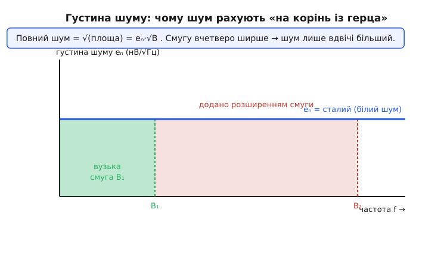
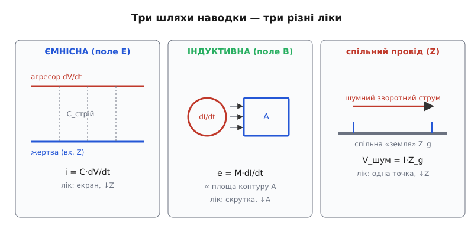
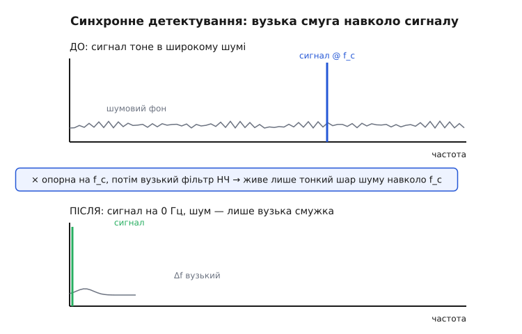

# Шум і завада вглиб: густина, джерела, механізми, боротьба

<preknowlist>
- [Середнє й дисперсія](topic:math/mean-variance) — σ як міра розкиду й те, що в незалежних доданків додаються саме дисперсії σ² (звідси піфагорове складання шумів).
- [Центральна гранична теорема](topic:math/central-limit) — чому сума багатьох незалежних дрібниць гаусова, а розкид росте лише як √N.
</preknowlist>

Базовий крок дав нам компас: **шум** народжується всередині матерії, він випадковий і широкосмуговий, його лише тримають нижче за сигнал; **наводка** приходить ззовні, має впізнаваний почерк, її вистежують і глушать. Ми навчилися міряти шум у RMS, читати його як гаусів дзвін і рахувати запас через відношення сигнал/шум. Цього досить, щоб не переплутати діагноз. Але щойно доходить до **проєктування** — вибрати підсилювач, порахувати, чи вкладеться давач у потрібну точність, вирішити, яку смугу поставити й де провести «землю» — цих понять уже мало. Треба спуститися на шар глибше й відповісти на питання, які базовий крок лише позначив.

Чому в даташиті шум задають дивною одиницею «нановольти на корінь із герца», а не просто у вольтах? Звідки береться саме такий рівень теплового шуму — можна його вивести з перших принципів чи це емпірика? Чому шумів насправді не один, а ціла родина, і кожен має свій закон? Чому в багатокаскадному тракті майже весь шум задає **перший** каскад, а решта майже не важить? І, нарешті, як саме — механічно, з формулою в руках — наводка залазить у наш ланцюг і чому скручена пара її вбиває, а екран без «землі» — ні? Розберемо це по черзі, спираючись на вже пройдене й доводячи кожне твердження, а не оголошуючи його.

## Густина шуму: чому «на корінь із герца»

Почнемо з одиниці, яка збиває з пантелику найбільше. У базовому кроці шум був простим числом: «2 мВ RMS». Але відкрийте даташит будь-якого малошумного підсилювача — і замість вольтів побачите **8 нВ/√Гц** (нановольтів на корінь із герца). Що це за звір і навіщо він потрібен?

Корінь проблеми — у слові «широкосмуговий». Тепловий шум присутній **на всіх частотах одразу**, і то приблизно порівну на кожній. Уявімо, що ми міряємо шум резистора приладом, який пропускає смугу частот шириною 1 Гц. Дістанемо якесь RMS-значення. Тепер розширмо смугу вдвічі — до 2 Гц: прилад почне «бачити» вдвічі більше частотних складників шуму, і виміряна **потужність** шуму подвоїться. Ушир смугу вдесятеро — вдесятеро зросте й потужність. Виходить, саме число «стільки-то вольтів шуму» **не має сенсу без указання смуги**, у якій його виміряли. Це як казати «у відрі 5 літрів на секунду» — треба знати, скільки секунд лили.

Тому шум описують не повним значенням, а **щільністю на одиницю смуги** — скільки шумової потужності припадає на кожен герц. Це **спектральна густина потужності** (*power spectral density, PSD*), і для теплового шуму вона рівна по частоті: на кожен герц — однакова порція. Через цю рівність тепловий шум і звуть **білим** (*white noise*) — за аналогією з білим світлом, де всі частоти представлені порівну. (Аналогія точна рівно доти, доки смуга не сягає надвисоких частот і квантових ефектів; для звичайної електроніки білизна теплового шуму — тверда правда.)

> 🔧 **Навіщо це.** Густина шуму — це те, що дає змогу **порівнювати підсилювачі до того, як обрано смугу**. Підсилювач із 3 нВ/√Гц тихіший за той, що має 20 нВ/√Гц, незалежно від вашого застосунку. А вже коли ви задасте свою робочу смугу, густина перетвориться на конкретний шум у вольтах. Без цієї одиниці два даташити просто неможливо чесно зіставити.

Тепер найважливіший перехід — від густини до реального шуму. Потужність складається адитивно по частоті, тож повна шумова потужність у смузі шириною B — це густина потужності, помножена на B. Але ми звикли мислити не потужностями, а напругами (вольтами RMS). Оскільки [потужність пропорційна квадрату напруги](topic:physics/electric-power), густину зручно перевести в **напругову густину** eₙ з одиницею В/√Гц — так, щоб її квадрат давав густину потужності. Тоді повний шум виходить так:

```
повна шумова потужність  ∝  eₙ² · B          (густина_потужності × смуга)
повна шумова напруга      =  eₙ · √B          (корінь із потужності)
```

Ось звідки корінь. Напруга — це корінь із потужності, потужність росте лінійно зі смугою, тому **напруга шуму росте як корінь зі смуги**. Розширив смугу вчетверо — потужність учетверо, а напруга лише вдвічі. Одиниця В/√Гц — це просто така форма запису, щоб множення на √B одразу давало вольти.


*Густина шуму eₙ (нВ/√Гц) рівна по частоті — це «білий» шум. Повний шум у смузі — це корінь із площі під квадратом густини, тобто eₙ·√B. Зелена площа — вузька смуга B₁; додавши смугу до B₂ (рожеве), ми додаємо шуму, але лише як корінь: учетверо ширша смуга дає лише вдвічі більший шум. Тому звуження смуги — головний важіль проти шуму.*

**Приклад (від густини до вольтів).** Малошумний підсилювач має густину eₙ = 8 нВ/√Гц. Скільки шуму він дасть у вимірювальній системі зі смугою 10 кГц, а скільки — у повільній системі зі смугою 10 Гц?

```
широка смуга:  Uшум = 8 нВ/√Гц · √(10000 Гц) = 8 · 100  = 800 нВ = 0.8 мкВ (RMS)
вузька смуга:  Uшум = 8 нВ/√Гц · √(10 Гц)     = 8 · 3.16 ≈ 25 нВ            (RMS)
```

Той самий підсилювач, та сама густина — а шум відрізняється в 32 рази лише через смугу. Ось чому перше питання розробника малошумного тракту: **яка смуга мені справді потрібна?** Кожен зайвий герц, який ви пропускаєте, а не використовуєте, коштує вам шуму. Ця думка — місток до всієї другої половини статті: **звуження смуги** буде нашим головним інструментом проти шуму, і тепер видно чому — воно ріже площу під густиною.

Тут ховається ще й пастка з визначенням смуги, яку варто назвати чесно. Реальний фільтр не обриває частоти вертикальною стіною — у нього похилий спад. Тому «смуга», у якій треба рахувати шум, — це не смуга за рівнем −3 дБ, а трохи ширша **шумова смуга** (*noise bandwidth*): ширина уявного ідеального прямокутного фільтра, що пропустив би стільки ж шумової потужності, скільки ваш реальний. Для простого фільтра першого порядку шумова смуга виходить приблизно в 1.57 раза (π/2) ширшою за смугу −3 дБ — бо пологий «хвіст» фільтра пропускає ще помітну частку шуму за точкою −3 дБ. Плутати ці дві смуги — типова помилка новачка, що дає недооцінку шуму на добрих півтора десятки відсотків. Точний коефіцієнт залежить від крутості фільтра й виводиться інтегруванням його передавальної характеристики; для наших прикидок досить пам'ятати, що шумова смуга **дещо ширша** за −3 дБ, і для одиночної RC-ланки цей множник — π/2.

## Родина шумів: у кожного свій закон

Базовий крок згадав тепловий шум як головне джерело й побіжно кивнув на «шум 1/f» та дрейф. Насправді джерел шуму в реальній схемі кілька, і вони **різні за механізмом, за спектром і за тим, що з ними робити**. Плутати їх — означає гасити не те. Розберімо чотири, які трапляються найчастіше.

### Тепловий шум: голос теплового руху

Це той шум, що його виміряв Джонсон і пояснив Найквіст — детальніше про людей і драму відкриття є [окрема історична вставка](root:embedded/noise-interference/hist-johnson-nyquist.md). Механізм прямий: у будь-якому провіднику електрони не стоять на місці, а безперервно [тремтять від теплового руху](topic:physics/resistance-origin) — той самий рух, що дає опір. Кожен електрон, смикнувшись, на мить створює крихітну різницю потенціалів; мільярди таких смиків складаються (за [центральною граничною теоремою](topic:math/central-limit)) у гаусів шум на виводах. Резистор не треба вмикати в коло — він шумить сам собою, поки він тепліший за абсолютний нуль.

Формула Найквіста для цього шуму — одна з найкрасивіших у прикладній фізиці, бо в ній немає жодної деталі конкретного резистора, лише універсальні величини:

```
Uшум = √(4·k·T·R·B)

k = 1.38·10⁻²³ Дж/К   (стала Больцмана)
T — температура в кельвінах
R — опір в омах
B — шумова смуга в герцах
```

Вражає, що входять лише опір, температура й смуга — і жодного натяку на матеріал, форму чи технологію. Вуглецевий, плівковий, дротяний резистор одного номіналу за однієї температури шумлять **однаково**. Саме ця незалежність від матеріалу й переконала Джонсона, що він має справу не з дефектом виробництва, а з фундаментальною властивістю матерії. Звідки береться множник рівно 4 і чому в формулі стоїть саме добуток kT (енергія теплового руху), а не щось інше — це результат витонченого термодинамічного міркування Найквіста, який уявив резистор як лінію передачі з тепловими хвилями й застосував до неї теорему про рівний розподіл енергії. Повне виведення — від рівномірного розподілу енергії по модах до появи 4kTR — винесено в [окрему математичну вставку](root:embedded/noise-interference/math-nyquist-derivation.md), бо воно варте того, щоб пройти його крок за кроком; тут досить знати саму формулу й головний висновок: **тепловий шум зростає з опором, температурою і смугою — і більше ні від чого не залежить**.

Розділивши обидві частини на √B, дістаємо густину теплового шуму — те саме «на корінь із герца» з попереднього розділу:

```
eₙ = √(4·k·T·R)     [В/√Гц]
```

**Приклад (тепловий шум великого резистора).** Скільки шумить резистор 100 кОм за кімнатної температури (300 К) сам собою, у смузі 20 кГц (звуковий діапазон)?

```
eₙ = √(4 · 1.38·10⁻²³ · 300 · 100000)
eₙ = √(1.656·10⁻¹⁵) ≈ 40.7·10⁻⁹ В/√Гц ≈ 40.7 нВ/√Гц
Uшум = eₙ · √B = 40.7·10⁻⁹ · √20000 ≈ 40.7·10⁻⁹ · 141 ≈ 5.75·10⁻⁶ В ≈ 5.8 мкВ (RMS)
```

Майже шість мікровольтів шуму — і це ще до того, як ми підключили резистор до чого-небудь. Якби на ньому сидів корисний сигнал у кілька мікровольтів (тензодавач, термопара), він би просто потонув. Звідси залізне правило малошумного проєктування: у чутливих вузлах **опори тримають малими**. Замінили 100 кОм на 1 кОм — шум упав у √100 = 10 разів. Ось чому в передпідсилювачах для мікрофонів і давачів опори в сигнальному тракті рахують на одиниці кілоом, а не на сотні.

> 🔧 **Навіщо це.** Формула √(4kTRB) — це калькулятор «стелі чутливості». Перш ніж ганятися за тихим підсилювачем, порахуйте тепловий шум самих резисторів на вході: якщо він уже перевищує ваш сигнал, жоден підсилювач не врятує — треба міняти схему на низькоомну. Це також пояснює, навіщо чутливі прилади (радіотелескопи, малошумні підсилювачі для фізики) **охолоджують**: T у формулі під коренем, тож охолодження від 300 К до 77 К (рідкий азот) знижує шум майже вдвічі, а до одиниць кельвінів — на порядок.

### Дробовий шум: зернистість самого струму

Другий фундаментальний шум має зовсім інший корінь. [Заряд квантований](topic:physics/elementary-charge) — струм тече не суцільним потоком, а окремими електронами, як пісок, що сиплеться зернами. Коли носіїв багато, потік здається рівним. Але кожен акт проходження заряду через бар'єр (p-n-перехід діода, вакуумний проміжок лампи) — це окрема випадкова подія, і моменти цих подій трохи «дрижать». Ця зернистість самого струму й дає **дробовий шум** (*shot noise*; нім. *Schroteffekt* — «ефект дробу», за розсипаним дробом).

Уперше його описав **Вальтер Шотткі** (*Walter Schottky*) 1918 року в лабораторії Siemens & Halske, вивчаючи флуктуації струму у вакуумних лампах; він же відрізнив його від теплового ефекту й дав обом назви. *(Усталений факт.)* Формула Шотткі так само оголено проста, як і Найквістова:

```
iшум = √(2·q·I·B)

q = 1.6·10⁻¹⁹ Кл   (заряд електрона)
I — постійний струм через бар'єр
B — шумова смуга
```

Головна відмінність від теплового шуму — цей шум пропорційний **струму** й проявляється як шум **струму**, а не напруги. І ще одна тонкість, контрінтуїтивна: **відносний** дробовий шум падає зі зростанням струму. Абсолютний росте як √I, а сам струм — як I, тож відношення iшум/I спадає як 1/√I. Це та сама логіка «√N, а не N» із [центральної граничної теореми](topic:math/central-limit): що більше зерен-електронів, то рівніший потік відносно свого розміру. Тому дробовий шум болить саме на **малих** струмах — у фотодіодах, що ловлять слабке світло, у вхідних струмах підсилювачів.

**Приклад (де дробовий шум помітний).** Фотодіод дає фотострум 1 нА. Який дробовий шум цього струму в смузі 1 кГц, і яка його частка від сигналу?

```
iшум = √(2 · 1.6·10⁻¹⁹ · 1·10⁻⁹ · 1000)
iшум = √(3.2·10⁻²⁵) ≈ 5.66·10⁻¹³ А ≈ 0.57 пА (RMS)
частка від сигналу: 0.57 пА / 1000 пА ≈ 0.057 % → SNR ≈ 65 дБ
```

На нанаоамперах частка ще терпима. Але спробуйте зловити фотострум у сотні фемтоампер — і дробовий шум почне зʼїдати сигнал, бо частка росте як 1/√I. Ось чому в детекторах слабкого світла борються за кожен фотон і йдуть на охолодження та інтегрування протягом секунд.

### Шум 1/f: пам'ять, що псує повільне

Третій шум — найпідступніший для точних **повільних** вимірювань. Його спектр не рівний: густина росте зі спаданням частоти, приблизно як 1/f. Тому його звуть **фліккер-шумом** (*flicker noise*, «мерехтіння») або просто **шумом 1/f**. На високих частотах його не видно — там панує тепловий; але що нижче частота, то він гучніший, і на частках герца (тобто на масштабі секунд і хвилин) він домінує. Саме він проявляється як **дрейф** нуля, про який згадував базовий крок: повільне «сповзання» показань, яке неможливо відрізнити від справжньої повільної зміни сигналу.

Історія назви теж належить Bell Labs: той самий **Джон Джонсон** 1925 року помітив у струмі емісії ламп повільні флуктуації, спектр яких ріс на низьких частотах (стаття «The Schottky effect in low frequency circuits»). А пояснення й саму назву дав **Вальтер Шотткі** наступного, 1926 року: він запропонував механізм і охрестив ефект «мерехтінням» (*flicker*). *(Усталений факт.)* На відміну від теплового й дробового, шум 1/f **не має чистої універсальної формули** — його рівень залежить від матеріалу, технології, площі приладу й струму. Фізично він народжується з повільних процесів захоплення й вивільнення носіїв на дефектах та межах — процесів «з пам'яттю»: система пам'ятає свій недавній стан. А там, де є пам'ять (кореляція в часі), [центральна гранична теорема не діє](topic:math/central-limit), і простий гаусів білий дзвін не складається.

Ключова величина для 1/f — **частота зламу** (*corner frequency*, f_c): та частота, де густина шуму 1/f зрівнюється з тепловим (або дробовим) фоном. Вище f_c шум практично білий; нижче — панує 1/f. У доброго малошумного підсилювача f_c може бути одиниці-десятки герц; у дешевого CMOS — кілогерци. Ось чому для точних DC-вимірювань (термопари, тензомости) вибирають підсилювачі з низькою f_c або застосовують спеціальні прийоми, що «виносять» вимір із зони 1/f — до них ми повернемося.

> 🔧 **Навіщо це.** Розрізняти теплове/дробове й 1/f критично, бо їх лікують **протилежно**. Тепловий і дробовий шум зменшує звуження смуги й усереднення — бо вони білі, усереднення їх давить. А шум 1/f усередненням **не давиться**: що довше усереднюєш, то нижчі частоти захоплюєш, а там 1/f тільки росте. Тому проти дрейфу усереднення безсиле — потрібне перенесення виміру на вищі частоти (модуляція, чопер). Побачивши, що довге усереднення «застрягло» й далі не покращує результат, підозрюйте саме 1/f.

### Ще два гості: попкорн-шум і kTC

Для повноти назвемо ще двох, що спливають у конкретному залізі. **Попкорн-шум** (*popcorn noise*, або RTS — random telegraph signal) — це раптові дискретні перескоки рівня туди-сюди, наче хтось клацає перемикачем; на слух у звуковому тракті вони справді нагадують хрускіт попкорну. Він походить від захоплення поодиноких носіїв на окремих дефектах і виказує проблемну партію мікросхем.

Окремої уваги вартий **kTC-шум** (шум скидання, *reset noise*) — він виникає щоразу, коли ми заряджаємо конденсатор через ключ (а це серцевина будь-якого [пристрою вибірки-зберігання](root:embedded/signal-acquisition) на вході АЦП). Дивовижа kTC-шуму в тому, що його RMS **не залежить від опору** ключа, лише від ємності:

```
Uшум = √(k·T / C)
```

Як так вийшло, що опір зник? Адже шумить саме опір ключа. Секрет — у балансі двох ефектів. Більший опір дає більший тепловий шум (√R у формулі Найквіста), але водночас **звужує смугу** RC-ланки (смуга ∝ 1/RC), а повний шум — це eₙ·√B ∝ √R · √(1/RC) = √(1/C). Опір скорочується! Лишається чистий kT/C. Це прекрасний приклад того, як два наші поняття — тепловий шум і шумова смуга — переплітаються й дають несподівано простий результат. Практичний наслідок: щоб зменшити шум скидання, збільшують **ємність** зберігання (а не морочаться з опором ключа), або застосовують **корельоване подвійне вибирання** (*correlated double sampling, CDS*) — вимірюють рівень одразу після скидання й віднімають його від корисного відліку, бо шум скидання в обох однаковий і при відніманні гаситься. Цей самий прийом рятує матриці камер від шуму скидання пікселя.

## Як шуми складаються: піфагор і диктатура першого каскаду

Тепер, коли джерел кілька, постає питання: як порахувати **сумарний** шум? Тут працює правило, яке базовий крок лише проголосив, а ми його обґрунтуємо: **незалежні шуми складаються за потужностями, тобто «по-піфагорськи»**.

Чому не просто арифметично? Бо шум — це випадкова величина з нульовим середнім, і два незалежні шуми в кожну мить однаково часто тягнуть у той самий бік і в різні. Коли вони збігаються — сумуються; коли протилежні — гасяться. У середньому по часі перехресний доданок зникає (саме тому, що вони **незалежні**), і додаються не самі напруги, а їхні **квадрати** — тобто [дисперсії](topic:math/mean-variance). Розпишемо це. Нехай маємо два незалежні шуми з RMS-значеннями U₁ і U₂. Миттєва сума u(t) = u₁(t) + u₂(t), її середній квадрат:

```
⟨u²⟩ = ⟨(u₁ + u₂)²⟩ = ⟨u₁²⟩ + ⟨u₂²⟩ + 2·⟨u₁·u₂⟩
```

Останній доданок — це кореляція. Для незалежних шумів ⟨u₁·u₂⟩ = 0 (плюси й мінуси одного не пов'язані з другим, у середньому дають нуль). Лишається:

```
Uсум² = U₁² + U₂²      →      Uсум = √(U₁² + U₂²)
```

Це буквально теорема Піфагора для шумів. Практичний наслідок разючий і його треба закарбувати: **більший шум домінує нелінійно**. Складімо шум 10 мкВ і шум 3 мкВ:

```
Uсум = √(10² + 3²) = √(100 + 9) = √109 ≈ 10.44 мкВ
```

Менший шум (3 мкВ, тобто 30 % від більшого!) додав лише 0.44 мкВ — жалюгідних 4 %. Звідси **правило домінантного джерела**: якщо одне джерело шуму втричі більше за інші, решта майже не важить — бий по найбільшому. Немає сенсу вилизувати шум резистора до нановольтів, якщо поруч підсилювач шумить на мікровольти. Це заощаджує безмірно зусиль: знайди найгучніше джерело й займайся ним, поки воно не перестане бути найгучнішим.

### Вхідний шум і чому важить лише перший каскад

Тепер прикладемо це правило до реального тракту з кількох каскадів підсилення й дістанемо один із найважливіших принципів усієї малошумної техніки. Уявімо два каскади: перший підсилює сигнал у G разів і сам додає шум U₁, другий додає шум U₂. Питання: як ці шуми виглядають **на вході** всієї системи — тобто скільки шуму треба було б додати до вхідного сигналу, щоб отримати той самий результат?

Хитрість у тому, що шум **першого** каскаду проходить крізь усе підсилення нарівні з сигналом, а шум **другого** — ні, він додається вже після підсилення. Щоб порівняти їх чесно, «перенесемо» шум другого каскаду назад на вхід, поділивши на підсилення першого:

```
шум другого, зведений до входу = U₂ / G
повний вхідний шум = √( U₁² + (U₂/G)² )
```

Ось воно. Якщо підсилення першого каскаду G велике, доданок (U₂/G)² стає мізерним, і повний вхідний шум ≈ U₁ — шум **самого першого каскаду**. Другий, третій, десятий каскади майже не додають нічого, бо їхній шум поділений на велике підсилення попередніх. Це **диктатура першого каскаду**: він одноосібно задає шумову підлогу всієї системи.

Звідси випливає правило, яке базовий крок сформулював як «підсилюй якнайраніше», а тепер ми бачимо його механіку: **перший каскад має бути якнайтихішим і мати достатнє підсилення**. Тихий передпідсилювач упритул до давача — не примха, а прямий наслідок цієї формули. Він підсилює сигнал, поки той ще чистий, і задирає його так високо над шумом наступних каскадів, що ті вже не встигають нашкодити. Поставте той самий тихий підсилювач **другим** — і його тиша пропаде даремно, бо перед ним уже нашумів гучний перший.

Цю ідею у зв'язку виражають строгіше — через **коефіцієнт шуму** (*noise figure*) і **формулу Фрііса** для каскадів, де внесок кожного наступного каскаду ділиться на добуток підсилень усіх попередніх. Це той самий принцип, розписаний точно для тракту приймача; його розгорнуто в [окремому кроці про RF-тракт](root:embedded/rf-frontend). Нам зараз важлива суть: **шум системи задає її вхід**, і боротьбу за SNR виграють або програють у першому каскаді.

> 🔧 **Навіщо це.** Правило «перший каскад вирішує все» диктує топологію плати. Малосигнальний давач (мікрофон, термопара, фотодіод) веде до **тихого передпідсилювача, поставленого впритул** — коротким провідником, без довгих трас, часто прямо на давачі. Далі сигнал уже великий і його не страшно вести через шумну плату, роз'єми, АЦП. Помінявши місцями «підсилити тут» і «підсилити потім», інженери-початківці регулярно втрачають десятки децибелів SNR і потім марно шукають їх у фільтрах.

## Наводка вглиб: три шляхи, три ліки

Досі ми занурювались у шум — внутрішній, випадковий. Тепер спустімося так само глибоко в **наводку**. Базовий крок назвав три шляхи, якими зовнішня завада залазить у ланцюг: ємнісний (електричне поле), індуктивний (магнітне поле) і через спільний провід. Тепер розберемо **механіку** кожного — з формулою — бо саме з механіки випливає ліки, і без неї боротьба з наводками перетворюється на шаманство «переткнемо кабель і подивимось».


*Три шляхи наводки й три різні ліки. Ліворуч — ємнісна: змінна напруга агресора жене крізь стрій-ємність струм i = C·dV/dt у вхідний опір жертви; лік — екран і низький вхідний опір. Посередині — індуктивна: змінний струм агресора наводить у контурі жертви ЕРС e = M·dI/dt, пропорційну площі контуру; лік — скрутка й зменшення площі. Праворуч — кондуктивна: чужий зворотний струм на спільному опорі «землі» Z_g створює напругу V = I·Z_g, що додається до сигналу; лік — одна точка «землі» й низький її опір.*

### Ємнісна наводка: коли винне електричне поле

Механізм: між будь-якими двома провідниками є **стрій-ємність** (*stray capacitance*) — вони як обкладки крихітного конденсатора. Коли на одному (агресорі) напруга **міняється**, крізь цю ємність тече струм у другий (жертву). Величина цього струму:

```
i = C_стрій · dV/dt
```

Три множники підказують три важелі. Струм тим більший, чим більша стрій-ємність C (тобто чим ближче й довше провідники йдуть поруч), і чим швидше міняється напруга агресора dV/dt (тому імпульсні джерела й цифрові шини з різкими фронтами — злісні агресори). А що станеться зі струмом далі — залежить від **вхідного опору жертви**: цей наведений струм тече в опір і створює на ньому напругу V = i·Z. Звідси одразу два ліки. Перший — **низький вхідний опір**: якщо жертва низькоомна, той самий наведений струм дасть малу напругу (тому високоомні входи — тензомости, піро-давачі — найвразливіші до ємнісної наводки). Другий, радикальний — **екран** ([детально про механіку екранування](topic:electronics/shielding)): металева оболонка навколо жертви, з'єднана із «землею», перехоплює весь наведений струм і зливає його в «землю», не пускаючи до сигнального провідника. Тут криється частий провал: **екран працює, лише якщо він заземлений**. Незаземлений екран сам стає ще однією обкладкою й може погіршити наводку. Це прямий наслідок [ефекту клітки Фарадея](topic:physics/faraday-cage) — заземлена оболонка тримає своє нутро при сталому потенціалі.

### Індуктивна наводка: коли винне магнітне поле

Механізм зовсім інший, хоч результат схожий. Змінний струм в агресорі створює навколо себе **змінне магнітне поле** ([це закон Ерстеда](topic:physics/oersted-experiment)). Якщо це поле пронизує **контур** нашого сигнального кола, воно за [законом електромагнітної індукції](topic:physics/electromagnetic-induction) наводить у ньому ЕРС:

```
e = M · dI/dt          (M — взаємна індуктивність)
```

а сама взаємна індуктивність M пропорційна **площі контуру** жертви й тому, як близько й співнапрямлено він лежить до агресора. Ключова відмінність від ємнісної наводки: тут винен **струм** агресора, що міняється (dI/dt), а не напруга, і вразливість задає не вхідний опір, а **площа контуру**, який утворюють сигнальний провід і його зворотний шлях. Звідси головний лік — **зменшити площу контуру**. Найкращий спосіб — **скручена пара** ([детальніше](topic:electronics/twisted-pair)): сигнальний провід і зворотний скручують докупи, і площа контуру стає майже нульовою. Мало того, скрутка робить хитрішу річ: на кожному сусідньому витку контур «дивиться» на поле протилежним боком, тож наведені ЕРС сусідніх витків **гасять одна одну**. Тому диференційні лінії ([диференційна пара](topic:electronics/opamp-input-stage), RS-485) так стійкі до магнітної наводки — вони поєднують малу площу з узаємним відніманням. Екран проти магнітної наводки на низьких частотах, до речі, майже безсилий (звичайний метал не тримає магнітне поле) — тут рятує саме геометрія, а не оболонка. Це важлива асиметрія: від електричного поля рятує екран, від магнітного — скрутка.

### Кондуктивна наводка й контур «землі»

Третій шлях найпідступніший, бо ховається там, де його не шукають, — у самій **«землі»**. Ми звикли думати про «землю» як про ідеальний нуль вольт скрізь. Але будь-який провідник має ненульовий опір (та ще й індуктивність). Коли кількома пристроями тече спільним проводом «землі» зворотний струм, він за законом Ома створює на опорі цього проводу **падіння напруги**:

```
V_шум = I_зворотний · Z_землі
```

І ось у чому біда: якщо ваш чутливий вхід міряє напругу відносно однієї точки «землі», а поруч сильноточний споживач (мотор, реле, нагрівач) жене свій зворотний струм по тому ж проводу, то його струм створює на спільному опорі напругу, яка **додається до вашого сигналу**. Ви міряєте свій давач плюс сміття від мотора — просто тому, що вони ділять шматок «землі». А якщо «земля» ще й утворює замкнене кільце, у це кільце наводиться струм від зовнішніх магнітних полів — це сумнозвісний **контур «землі»** (*ground loop*, [детальний розбір](topic:electronics/ground-loops)), джерело мережевого гулу 50 Гц у звуковій апаратурі.

Ліки випливають із формули V = I·Z прямо. Перший — **знизити Z**: товста, коротка спільна «земля» з малим опором дає малу паразитну напругу. Другий, головний — **розділити шляхи струмів**: вести сильноточні зворотні струми окремо від сигнальних, зводячи їх в одну спільну точку («зіркою», *star ground*), щоб чужий струм фізично не тік по вашому сигнальному опору. Третій — **розірвати кільце**, щоб прибрати контур (гальванічна розв'язка, один спільний вузол). Це та частина боротьби із завадами, де немає жодної деталі, яку можна купити, — є лише **топологія розведення**, продумана до того, як плату виготовили.

> 🔧 **Навіщо це.** Три шляхи — це діагностичне дерево на столі. Наводка зникає, коли береш кабель у руку чи накриваєш вузол долонею — ємнісна (ти екрануєш його тілом). Наводка міняється, коли повертаєш чи перекладаєш кабель, не торкаючись, — індуктивна (ти міняєш площу контуру й орієнтацію до поля). Наводка залежить від того, увімкнено сильноточний споживач чи ні, і від того, куди під'єднано спільний провід, — кондуктивна («земля»). Три прості проби — і ти знаєш, який з трьох лік брати, замість того щоб наосліп чіпляти екрани.

## Боротьба зі шумом: смуга, усереднення, кореляція

Тепер зберемо все в арсенал. Проти **наводки** інструменти ми щойно вивели — геометрія, екран, «земля». А проти **шуму**, який усунути в принципі не можна, головний важіль один, і ми до нього підводили від самого початку: **звузити смугу до мінімально потрібної**. Кожен герц смуги, що ви пропускаєте, а не використовуєте, підливає шуму (eₙ·√B). Але «звузити смугу» має кілька облич, і вони варті окремого розбору.

### Фільтрація й усереднення — те саме інакше

Найпряміший спосіб — **фільтр**: пропустити смугу сигналу й зрізати решту. Якщо сигнал повільний (температура, тиск), досить фільтра нижніх частот із малою смугою — і весь високочастотний шум відсічено. Це прямо ріже площу під густиною шуму.

**Усереднення** — той самий фільтр, тільки в часі. Складемо N зашумлених відліків і поділимо на N. Сигнал (сталий чи повільний) при цьому не міняється — він додається сам до себе. А шум, у якого нульове середнє й незалежні відліки, частково гаситься: за законом [√N з центральної граничної теореми](topic:math/central-limit) розкид середнього падає як 1/√N.

```
σ_середнього = σ_одного / √N
```

Це залізне «√N, а не N» знову. Щоб зменшити шум **удвічі**, треба **вчетверо** більше відліків; удесятеро — усто разів. Віддача спадає, і саме тому усереднення не безмежне: з якогось моменту або час стає непристойним, або (для повільних вимірів) у гру вступає **шум 1/f**, який усередненням **не давиться** взагалі — бо довше усереднення захоплює нижчі частоти, а там 1/f тільки росте. Ось де знання родини шумів стає практичним: якщо усереднення «застрягло» й далі не покращує результат — ви вперлися в 1/f, і далі усереднювати марно.

Перевірити поведінку фільтра й усереднення на власному шумі корисно ще **до** вмикання заліза — а для цього шум треба чимось породити в коді. Оскільки тепловий шум гаусів, генерують саме гаусову величину: як із рівномірного `rand()` дістати дзвін (перетворення Бокса—Мюллера) і які пастки чигають на мікроконтролері — показано в [окремій алгоритмічній вставці](root:embedded/noise-interference/proj-noise-generator.md).

### Синхронне детектування: витягти сигнал із-під шуму

Але що робити, коли сигнал слабкий, а шуму багато на всіх частотах, зокрема й на частоті сигналу? Прямий фільтр не поможе — він пропустить шум разом із сигналом. Тут працює найкрасивіший прийом усієї малошумної техніки — **синхронне детектування** (*lock-in detection*). Ідея глибока й варта того, щоб її зрозуміти.

Замість міряти сигнал на постійному струмі (де панує 1/f і будь-який дрейф), ми **промодулюємо** його відомою частотою f_c — наприклад, вмикаємо-вимикаємо джерело світла для фотодіода, або живимо тензоміст змінним струмом. Тепер корисний сигнал сидить не на нулі, а рівно на f_c. На приймальному боці ми **множимо** прийняту суміш (сигнал + шум) на опорний сигнал тієї самої частоти f_c, а потім ставимо дуже вузький фільтр нижніх частот. Магія в тому, що множення на f_c переносить корисний сигнал (який теж на f_c) назад на нуль, а весь шум **не на f_c** лишається розкиданим по частотах і відсікається вузьким фільтром. Виживає тільки тонісінька смужка шуму навколо f_c — і SNR злітає.


*Чому синхронне детектування працює. Угорі — до: корисний сигнал сидить на частоті f_c, але потоне в широкому шумовому фоні. Множення на опорну частоту f_c переносить сигнал на 0 Гц, а весь шум лишається розкиданим по частотах. Внизу — після: вузький фільтр нижніх частот пропускає сигнал (тепер на нулі) і лише тонку смужку шуму завширшки Δf навколо нього. Ефективна смуга шуму падає до часток герца — звідси колосальний виграш SNR.*

Це не магія, а той самий принцип «звузь смугу» у вищій формі: синхронний детектор — це фільтр із **надзвичайно вузькою** ефективною смугою (часток герца), налаштований точно на частоту сигналу, ще й винесений подалі від зони 1/f. Тому лок-ін-підсилювачі витягають сигнали, поховані під шумом у тисячі разів гучнішим. Той самий принцип у простішій формі — це **чоперний підсилювач** (*chopper*), який модуляцією виносить власний 1/f-шум і зсув угору, фільтрує, і повертає назад уже чистий сигнал; так роблять надточні DC-підсилювачі для термопар і тензомостів.

Споріднений інструмент — **кореляція** двох записів. Якщо той самий сигнал є у двох каналах, а шуми в них незалежні, то усереднення добутку каналів витягне спільний сигнал і придушить незалежний шум (бо його середній добуток — нуль, як ми бачили в піфагоровому виведенні). На цьому стоять методи вимірювання дуже малих шумів і кореляційні далекоміри.

> 🔧 **Навіщо це.** Ієрархія боротьби зі шумом на практиці така. Спершу — **вибери смугу під сигнал** (не ширше, ніж треба). Далі, якщо мало, — **усереднюй** (памʼятаючи про √N і стелю 1/f). Якщо сигнал повільний і тоне в дрейфі — **промодулюй його вгору** й застосуй чопер чи синхронне детектування, обійшовши 1/f. Ці три щаблі покривають майже всі практичні задачі, і кожен — це той самий принцип «шум живе в смузі, звузь смугу навколо сигналу», лише щораз хитріше застосований.

## Наскрізний приклад: бюджет шуму входу АЦП

Зведімо всю теорію в одну реальну задачу, яку розробник розв'язує постійно: **чи вкладеться мій вимірювальний вхід у потрібну точність?** Тут стрічаються всі гості цієї статті — тепловий шум, шумова смуга, піфагорове додавання, квантування — і показують, як думати бюджетом.

Нехай треба зчитувати давач, що дає сигнал розмахом 100 мВ, з роздільністю краще за 0.1 % (тобто шум має бути нижчим ≈ 100 мкВ). Тракт: джерельний опір давача 10 кОм → підсилювач із густиною 15 нВ/√Гц → АЦП. Смугу сигналу задамо 1 кГц. Порахуймо всі внески шуму, зведені до входу, і складемо їх правильно.

```
1) тепловий шум джерела (R = 10 кОм, T = 300 К, B = 1 кГц):
   eₙ_R = √(4·1.38·10⁻²³·300·10000) ≈ 12.9 нВ/√Гц
   U_R  = 12.9·10⁻⁹ · √1000 ≈ 12.9·10⁻⁹·31.6 ≈ 0.41 мкВ (RMS)

2) власний шум підсилювача (15 нВ/√Гц у тій самій смузі):
   U_amp = 15·10⁻⁹ · √1000 ≈ 0.47 мкВ (RMS)

3) складаємо по-піфагорськи (незалежні джерела):
   U_вх = √(0.41² + 0.47²) ≈ √(0.168 + 0.221) ≈ √0.389 ≈ 0.62 мкВ (RMS)
```

Аналоговий шум входу — близько 0.62 мкВ RMS, тобто розмах ≈ 6σ ≈ 3.7 мкВ. Це в добрих 25 разів нижче за наш поріг 100 мкВ — величезний запас. Аналоговий бік точно не завадить. Тепер перевіримо цифровий бік — **шум квантування** [АЦП](root:embedded/signal-acquisition): навіть ідеальний перетворювач округлює сигнал до найближчого кроку, і це округлення виглядає як шум із RMS ≈ крок/√12. Візьмімо 12-бітний АЦП на діапазон 3.3 В:

```
крок кванта: 3.3 В / 4096 ≈ 806 мкВ
шум квантування: 806 мкВ / √12 ≈ 233 мкВ (RMS)
```

Ось де несподіванка. Шум квантування (233 мкВ) **у сотні разів більший** за весь аналоговий шум (0.62 мкВ) і сам собою перевищує наш поріг 100 мкВ! Правило домінантного джерела кричить: воювати треба тут, а не за тихіший підсилювач. Виходів кілька, і всі — з нашої ж теорії. Найпряміший: **підсилити сигнал перед АЦП**, щоб він зайняв увесь діапазон перетворювача, — тоді той самий крок кванта стане меншою часткою сигналу. Підсилимо 100 мВ до повних 3.3 В (підсилення ≈ 33): аналоговий шум підсилиться разом із сигналом (SNR не зміниться — ми ж підсилюємо **до** АЦП, у першому каскаді, як велить диктатура першого каскаду), а квантування лишиться тим самим у вольтах — і тепер його частка від великого сигналу впаде в 33 рази, до ≈ 7 мкВ у перерахунку на вхід. Інший шлях — **усереднення**: усереднивши 16 відліків, зменшимо квантувальний (він при дизерингу поводиться як білий шум) у √16 = 4 рази. Або взяти **АЦП більшої розрядності**.

Мораль наскрізного прикладу — це мораль усієї статті. Шум приходить із багатьох джерел, різних за природою; складати їх треба по-піфагорськи; але виграє все **домінантне** джерело, і саме його треба знайти й побороти першим. Тут ним виявилося не те, на що дивляться початківці (аналоговий шум підсилювача), а квантування АЦП — і побороли ми його не деталлю, а **архітектурою**: підсиливши сигнал у правильному місці. Так і працює інженерія боротьби з завадами — не набором заклять «поставити конденсатор, накинути екран», а бюджетом: порахувати внески, знайти головний, ударити по ньому засобом, що відповідає його **природі**.

## Спільний корінь усіх засобів

За всіма прийомами цієї статті — фільтром, усередненням, тихим першим каскадом, скруткою, зіркою «землі», синхронним детектуванням — стоїть один-єдиний рух, і тепер його варто побачити оголеним. Кожен із них або **дає сигналові простір над підлогою завад**, або **відбирає той простір у самих завад**. Підсилити рано — підняти сигнал, поки він ще високо над шумом наступних каскадів. Звузити смугу, скрутити пару, рознести струми — відібрати в шуму частоти, а в наводки — площу контуру й спільний опір, у яких вони живуть. Іншого змісту боротьба із завадами не має: усе це — керування тим, скільки місця лишити корисному, а скільки відняти в зайвого.

І тут відкривається остання, найглибша асиметрія між двома ворогами. Наводку можна відібрати **всю**: дисципліною геометрії й «землі» вона йде в нуль, бо вона не фундаментальна — це чужий слід, у якого завжди є джерело й шлях. Шум відібрати весь не можна: його підлогу ставить сама температура матерії, і єдине, що тобі підвладне, — звузити кімнату, у якій він живе, та підняти над ним сигнал. Тому інженерна зрілість починається не з питання «як прибрати весь бруд», а з питання «у якій із двох битв я зараз — з фізикою чи з власною неохайністю»: засоби в них протилежні, і сплутати їх означає воювати не на тому фронті.

---
