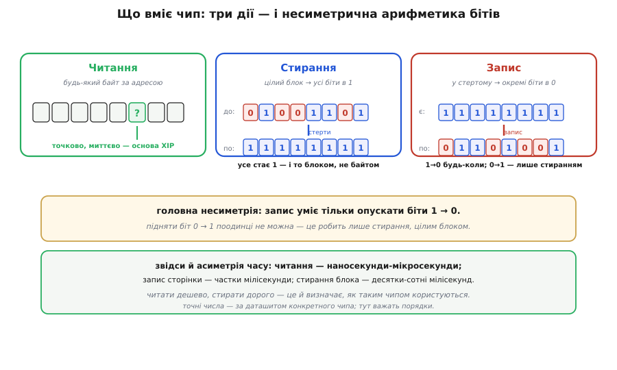
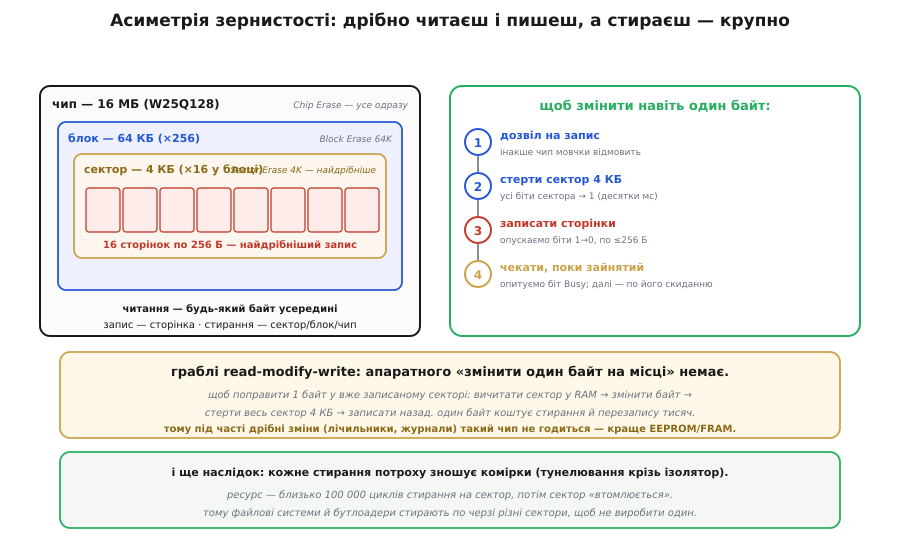

# 🔌 NOR-флеш W25Q-класу зблизька: що вміє чип — читання, стирання, посторінковий запис

> Чип **W25Q-класу** — той самий восьминіжковий прямокутник, що сидить розпаяним поруч з ESP32 і тримає його прошивку. NOR і NAND розведені по ролях — виконання коду проти масового сховища, — і W25Q є найзвичнішим представником саме NOR-табору. Тут зазирнемо всередину й поставимо головне питання: а що цей чип, власне, **вміє робити**? Виявляється, лише три речі — читати, стирати й записувати, — але саме з характеру цих трьох дій виростає вся логіка роботи з флешшю. Як надіслати команду по SPI окремими байтами — справа шинного протоколу; нам зараз важить не *як надіслати* команду, а *що відбувається* в кремнії, коли чип її виконує.

## Клас пристрою: SPI-NOR на вісім ніжок

Спершу коротко, з чим маємо справу. **W25Q** — родина послідовних NOR-флешів (англ. *SPI NOR flash*) від Winbond; число в назві — об'єм у мегабітах (`W25Q128` = 128 Мбіт = 16 МБ). Це [нелетка пам'ять](topic:programming/flash-vs-ram): записане лишається без живлення. Усе спілкування йде кількома дротами шини SPI, корпус — крихітний SOIC-8, живлення 3.3 В. Піднімемо «кришку» й глянемо на чип як на пристрій із трьома діями — і з однією дивною властивістю, що їх зв'язує.

## Три дії — і несиметрична арифметика бітів

Уся функціональність чипа зводиться до трьох дій: **прочитати** дані, **стерти** їх і **записати** нові. Здавалося б, симетрично — як із зошитом: пиши, стирай гумкою, пиши знову. Та флеш влаштована хитріше, і вся її незручність ховається в одному факті: **запис і стирання не зворотні одне одному** — ні за обсягом, ні за напрямом.

*Підняти окремий біт назад у «1» неможливо — це привілей стирання. Звідси й несиметрія часу: читати дешево, стирати дорого.*

Розберімо цю асиметрію, бо вона — ключ до всього. **Стирання** переводить комірки в стан, який умовно звуть «усі одиниці»: стертий байт читається як `0xFF`. **Запис** (його класична назва — *program*, «програмування») вміє рівно одне: опускати в стертій комірці обрані біти з «1» у «0». Зворотний рух — підняти біт з «0» назад у «1» — окремою коміркою **неможливий узагалі**; єдиний спосіб повернути одиниці — стерти цілий блок. Звідси й правило, що звучить дивно, поки не звикнеш: **писати можна лише в попередньо стерте місце**, а просто «перезаписати» вже записаний байт іншим значенням не вийде.

Корінь цього — [фізика комірки з плаваючим затвором](root:embedded/memory-cell-physics) (англ. *floating gate*): стирання одним полем заганяє однаковий заряд на затвори всіх комірок блока гуртом, а запис вибірково знімає його по одній. «Накачати всіх однаково» виходить дешево й одразу; «зняти точково в кожного» — лише поодинці. З цією картиною решту поведінки чипа можна вже не зазубрювати, а **виводити**.

## Читання: козир NOR і основа XIP

З трьох дій читання — найприємніша, і саме воно вирізняє NOR серед флешів. Чип уміє віддати **будь-який байт за його адресою**, не зачіпаючи сусідів: назвав адресу — отримав вміст. Це той самий «довільний доступ», що й у звичайної пам'яті, і саме він робить можливим [**XIP**](topic:programming/flash-vs-ram) (англ. *execute in place*, виконання на місці) — виконання коду прямо з флеші, без копіювання всієї програми в RAM.

Звідки в NOR ця здатність, а в NAND її немає, видно з будови масиву. У NOR кожна комірка під'єднана до розрядної лінії (англ. *bit line*) **паралельно** й майже напряму, тож дотягтися до однієї, не турбуючи інших, легко — звідси побайтове читання за наносекунди. У NAND комірки зшиті в довгі **ланцюжки** (англ. *string*): щоб дочитатися до однієї, струм іде крізь усіх її сусідів, тож читають лише цілими сторінками, а виконувати код «на місці» вже не вийде. Платня за зручність NOR — нижча щільність і вища ціна за байт; виграш NAND — багато дешевих байтів ціною посторінкового доступу.

*NOR годиться під код, NAND — під масові дані (SD, eMMC, SSD).*

## Стирання й запис: дрібно читаєш — крупно стираєш

Тепер про дві дії, що міняють вміст, — і про їхню найважчу для новачка рису: **зернистість у них різна**. Читати й програмувати чип уміє дрібно, а стирати — лише крупно. Запис іде **сторінками** (англ. *page*) по 256 байтів: за раз лягає щонайбільше одна сторінка. А стирати поодинокі сторінки чип **не вміє взагалі** — найдрібніша одиниця стирання це **сектор** (англ. *sector*) на 4 КБ, тобто шістнадцять сторінок разом; є ще стирання блоками по 64 КБ і стирання всього чипа одним махом. Тож організація `W25Q128` читається так: 16 МБ — це 256 блоків по 64 КБ, або 4096 секторів по 4 КБ, або 65 536 сторінок по 256 байтів.

*Пастка read-modify-write: щоб поправити один байт у вже записаному секторі, доводиться вичитати весь сектор, стерти його й записати назад.*

З цих двох фактів — «писати лише в стерте» і «стирати лише секторами» — сам собою випливає порядок будь-якої зміни даних. Спершу чипу подають **дозвіл на запис** (без нього він мовчки відмовиться псувати свій вміст — захист від випадкового запису). Далі **стирають** цільовий сектор: усі його 4 КБ стають `0xFF`. Тоді **записують** потрібні сторінки, опускаючи в них біти з «1» у «0». І насамкінець — те, про що легко забути: стирання й запис **не миттєві**, і поки чип зайнятий, нової команди він не прийме. Тому після кожної зміни його **опитують** — чи звільнився (для цього в чипі є біт «зайнятий», *Busy*), — і лише по його скиданню рушають далі.

## Граблі read-modify-write

Найболючіша пастка випливає просто з малюнка зернистості: апаратного «**змінити один байт на місці**» у NOR-флеші **немає**. Якщо потрібний байт лежить у вже записаному секторі, доводиться робити повний коловорот **read-modify-write**: вичитати весь сектор у RAM, поправити в копії один байт, стерти цілий сектор у флеші й записати всі 4 КБ назад. Один змінений байт коштує стирання й перезапису тисяч сусідніх. Саме тому такий чип — кепський вибір під значення, що міняються щосекунди (лічильники напрацювання, часті журнали): їм краще пасують [EEPROM чи FRAM](root:embedded/eeprom-fram) із побайтовим записом, а флеш лишити коду й рідко змінюваним даним.

> 🔧 **Навіщо це.** Три речі варто винести в пам'ять, навіть якщо самих команд ви ніколи не напишете руками (на ESP32 їх шле завантажувач і драйвер флеші). Перше: **перезапис ≠ запис** — оновлення прошивки чи файлу завжди ховає в собі стирання, тому воно й помітно повільніше за читання, і саме воно зношує чип. Друге: **зернистість стирання — 4 КБ**, тож файлові системи для флеші (на кшталт LittleFS) і поділ на розділи рівняються саме на сектор, а не на байт. Третє: **ресурс скінченний** — для W25Q-класу даташит обіцяє понад 100 000 циклів стирання на сектор і понад 20 років збереження даних, тому код, що тисячу разів на секунду переписує той самий сектор, за лічені години здатен його «вбити».

## Звідки взялася ця флеш

Уся ця несиметричність — не примха Winbond, а спадок самого винаходу. Концепцію флеш-пам'яті з плаваючим затвором і «гуртовим» стиранням розробив у Toshiba на межі 1970-х і 1980-х японський інженер **Фудзіо Масуока** (яп. 舛岡 富士雄, *Fujio Masuoka*) з невеликою командою; назву ж *flash* запропонував його колега Содзі Аріідзумі (*Shōji Ariizumi*) — гуртове стирання цілого блока нагадало йому спалах фотокамери. На конференції IEDM команда представила дві архітектури — спершу NOR (1984), згодом щільнішу NAND (1987), — а **перший комерційний NOR-чип** випустила **Intel** 1988 року, зробивши ставку саме на побайтове читання. Одного «винахідника флеші» тут немає: обидві архітектури — заслуга команди Масуоки в Toshiba, а доведення NOR до серійного продукту — заслуга Intel. W25Q-клас біля вашого ESP32 — прямий нащадок тієї лінії NOR.

## Варіації класу

Маркування W25Q найвідоміше, та клас широкий і сумісний на рівні цих базових дій: ту саму трійцю «читай байтом — стирай сектором — пиши сторінкою» виконують **GD25Q** (GigaDevice), **MX25** (Macronix), **EN25Q** (Eon) та інші SPI-NOR — той самий SOIC-8, та сама фізика, різниця лише в об'ємі, граничній частоті такту й дрібницях команд. Корисна добавка багатьох із них — **Quad SPI** (*QSPI*): чотири лінії даних замість однієї прискорюють читання в кілька разів, що для XIP помітно. А коли байтів треба справді багато, на зміну NOR приходить NAND — інша топологія, інші компроміси; як вона перетворюється на «диск» руками контролера — це вже [SD-картки](topic:electronics/sd-card), [eMMC і SSD](topic:electronics/emmc-ssd).
