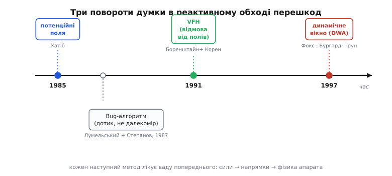
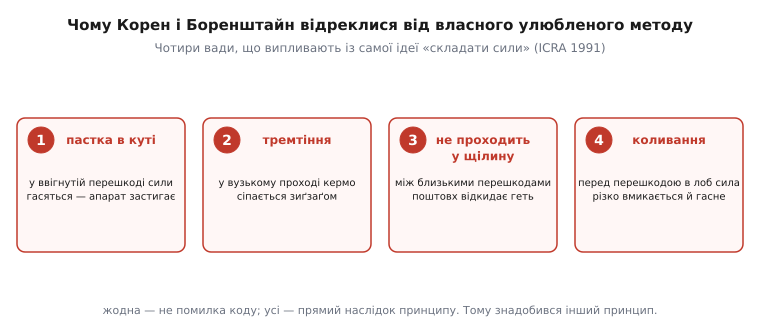

# 📜 Три повороти думки: як народився реактивний обхід

Кожен із трьох способів обходу, що ми розібрали, — поля, VFH, динамічне вікно — з'явився не сам собою й не «бо так логічно». Кожен народився з **конкретної досади**: хтось узяв попередній метод, вивів апарат у реальний коридор чи ввігнутий кут — і апарат затнувся. Досада штовхала думку далі, і наступний метод виростав рівно з того місця, де ламався попередній. Це не хроніка дат, а ланцюг «що бентежило → хто це побачив → як переставив питання». Пройдімо його так, як він розгортався насправді — з людьми, суперечками й одним несподіваним поворотом, де слід губиться у зовсім іншій галузі.

Одразу про статус фактів: усі дати, назви журналів і сторінки нижче — **усталені**, звірені за першоджерелами (самі статті, сторінки авторів, архіви IEEE та Springer). Де я кажу про мотив чи внутрішню логіку — це реконструкція за текстами робіт, і я це позначаю. Легенд у цій історії майже немає — вона молода, автори живі, папери доступні, — але там, де народний переказ спрощує, я спиняюся й уточнюю.

*Три повороти думки на одній осі. Угорі — головна лінія методів на далекомірі: потенційні поля, потім VFH (свідома відмова від полів), потім динамічне вікно. Кожен наступний лікує ваду попереднього: від «складати сили» до «вибирати напрямок» до «зважати на фізику апарата». Унизу окремою гілкою — Bug-алгоритм, інша традиція, що обходить перешкоду на дотик, а не за далекоміром.*

## Сили, що тягнуть і штовхають: Ошама Хатіб і поле замість плану

На початку 1980-х обхід перешкод був повільним і важким. Панівний підхід — спланувати весь безпечний шлях наперед, як велику геометричну задачу: побудувати простір конфігурацій, знайти в ньому вільний коридор. Розумно, повно — і надто марудно, щоб робити **щомиті**. Робот, що хотів ухилятися на ходу, мусив би перебудовувати цю важку конструкцію разів на секунду, а тодішнім машинам це було не до снаги. Бракувало чогось **дешевого й миттєвого**, що дало б апарату команду керма просто зараз, не переплановуючи все.

Цей розрив закрив **Ошама Хатіб** (Oussama Khatib) — інженер, народжений в Алеппо (Сирія), який здобув освіту у Франції (Монпельє, потім докторат з автоматичних систем у тулузькій ENSAE, 1980) і згодом став професором і директором робототехнічної лабораторії Стенфордського університету. Його ідею вперше оприлюднено на IEEE International Conference on Robotics and Automation (ICRA) у Сент-Луїсі навесні 1985 року, а розгорнуту статтю надруковано наступного року — *Real-Time Obstacle Avoidance for Manipulators and Mobile Robots*, «International Journal of Robotics Research», том 5, число 1, сторінки 90–98, 1986. (Дати й вихідні дані — усталені, за архівом IJRR і сторінкою автора.)

Поворот думки Хатіба був майже зухвало простий. Не плануй — **зроби так, щоб апарат сам котився куди треба**, наче фізичне тіло в силовому полі. Ціль хай **притягує**, як магніт залізну кульку; кожна перешкода хай **відштовхує** тим дужче, чим ближче апарат підповз. А тоді — головне — **не вибирай** між «до цілі» і «геть від стіни»: просто **склади всі ці сили як вектори** й рухайся за їхньою рівнодійною. Одне додавання щотакту, і апарат сам собою огинає перешкоди й вертається до цілі, коли небезпека позаду. Так народився **метод потенційних полів** (англ. *potential field* — за прямою аналогією з полем у фізиці, звідки Хатіб і взяв ідею складати сили).

Чому це стало проривом? Бо воно перевело обхід із **розважливого** режиму (обдумати весь шлях) у **рефлекторний** (одна арифметична дія на такт). Уперше апарат міг ухилятися **в ритмі керма**, а не в ритмі важкого планувальника. Причому та сама математика лягала і на маніпулятор (лікоть робота обходить перешкоду в просторі), і на мобільну платформу — Хатіб навмисно писав про обидва випадки заразом, бо його «операційний простір» був спільною мовою для того й того. Ідея була така природна й дешева, що розлетілася миттю й досі живе там, де перешкод небагато й вони опуклі.

> 🔧 **Навіщо це знати.** Поля — це не музейний експонат, а той метод, з якого варто **починати розуміти** обхід, і цілком робочий інструмент у простому середовищі. Але його історія цінна ще й як урок: перший, найелегантніший розв'язок задачі майже завжди має приховану ваду, яку видно лише коли виведеш його в справжній, тісний світ. Саме за цією вадою й прийшли наступні.

## Розбір, що поховав улюблений метод: Йоганн Боренштайн і Йорам Корен

Наступний поворот зробили двоє з Мічиганського університету — **Йоганн Боренштайн** (Johann Borenstein) і **Йорам Корен** (Yoram Koren). І тут історія по-людськи гостра, бо вони **воювали не з чужим методом, а з власним**.

Спершу вони повірили в поля так, що збудували свій варіант — **метод віртуального силового поля** (англ. *Virtual Force Field*, VFF, 1989): ті самі тяга й поштовхи, але перешкоди складено в «сітку певності», що ковтає шумні дані ультразвукових очей. Вони поставили VFF на реальний швидкий візок і **погнали його**. І тут почалося те, чого на папері не видно. Апарат **дрижав** у дверях. Він **застигав** у ввігнутих кутах. Він **не пролазив** у щілину між двома близькими перешкодами — сумарний поштовх викидав його геть саме там, де треба було протиснутися. Він **сіпався**, підлітаючи до стіни в лоб: сила відштовхування різко вмикалася й гасла, кермо смикалося.

Найчесніше, що можна зробити з улюбленим методом, який підводить, — це не латати його, а **сісти й довести математично, чому він приречений**. Саме так вони й вчинили. У статті *Potential Field Methods and Their Inherent Limitations for Mobile Robot Navigation* (Праці IEEE ICRA, Сакраменто, квітень 1991, сторінки 1398–1404) Корен і Боренштайн склали апарат і середовище в одне диференціальне рівняння й показали: чотири біди **випливають із самого принципу «складати сили»**, а не з кривого коду. Латанням їх не прибрати.

*Чотири вади, розібрані в статті 1991 року. Пастка в куті: у ввігнутій перешкоді тяга й поштовхи гасяться, апарат застигає. Тремтіння: у вузькому проході кермо сіпається зиґзаґом. Неспроможність пройти в щілину: між двома близькими перешкодами сумарний поштовх відкидає апарат геть. Коливання: перед перешкодою в лоб сила різко вмикається й гасне. Жодна — не помилка реалізації; усі — прямий наслідок ідеї складати сили. Тому знадобилася інша ідея.*

Головна з вад — **пастка локального мінімуму**: у підковоподібній перешкоді з ціллю за нею тяга веде всередину, стіни штовхають назад, і в глибині є точка, де сили гасяться точно, — апарат заклинює, хоч ціль попереду. Щоб вибратися, треба піти **проти** тяги цілі, а поле рухає лише за нею. *(Чому цей нуль рівнодійної неминучий і як він виводиться з формул — розкладено окремо, у [математиці потенційних полів](root:embedded/obstacle-avoidance/math-potential-field.md).)*

Той самий 1991 рік дав і відповідь. У статті *The Vector Field Histogram — Fast Obstacle Avoidance for Mobile Robots* («IEEE Transactions on Robotics and Automation», том 7, число 3, сторінки 278–288, 1991) ті самі двоє запропонували **гістограму векторного поля** (англ. *Vector Field Histogram*, VFH). Поворот думки радикальний: **перестати стискати** все довкола до одного вектора й одразу його виконувати. Натомість — звести дальності в **полярну гістограму** щільності перешкод по напрямках, чесно роздивитися, **де взагалі вільно**, знайти широку **долину** й свідомо кермувати в неї до цілі. Не «сума штовхає туди», а «онде вільний коридор — іду в нього». Саме цей поділ на два питання («де вільно» окремо від «куди з вільного вигідно») і вилікував тремтіння та застрягання, на яких ламалися поля.

> 🔧 **Навіщо це знати.** Тут — рідкісний в інженерії приклад наукової чесності: люди публічно розібрали й поховали власний попередній метод, замість тихо його підпирати. Для практика мораль подвійна. По-перше, вади полів **вроджені** — якщо в твоєму середовищі є вузькі місця й ввігнуті кути, самих полів мало, і це доведено, а не «здається». По-друге, правильна реакція на метод, що дав збій на залізі, — не купа евристичних латок, а крок назад до питання «а що я взагалі питаю в апарата?». VFH виграв саме тим, що переставив питання.

## А чи встигну я так повернути? Дітер Фокс, Вольфрам Бургард і Себастьян Трун

І поля, і VFH мовчки припускали одне, що в житті часто хибне: буцімто апарат може **миттю** повернути куди завгодно. Порахував найкращий напрям — і одразу туди поїхав. Але реальне тіло має **інерцію** й **межі**: розгін, гальма, найбільшу швидкість повороту. Швидкий візок, що вже мчить, не крутнеться на місці й не зверне під прямим кутом за півметра — його понесе далі по дузі. Виходить, обраний «найкращий напрям» може бути **фізично недосяжним** за той короткий час, поки перешкода ще далеко, — і апарат вріжеться не тому, що погано **вибрав**, а тому, що не встиг **виконати** вибір.

Цю сліпоту до власної фізики закрили троє — **Дітер Фокс** (Dieter Fox), **Вольфрам Бургард** (Wolfram Burgard) і **Себастьян Трун** (Sebastian Thrun), тоді пов'язані з Боннським університетом і німецькою робототехнічною школою (пізніше всі троє — помітні постаті світової робототехніки; Трун згодом очолив розробку самокерованих авто в Google). Їхня стаття — *The Dynamic Window Approach to Collision Avoidance* («IEEE Robotics & Automation Magazine», том 4, число 1, сторінки 23–33, березень 1997). Метод — **динамічне вікно** (англ. *Dynamic Window Approach*, DWA). Дати й вихідні дані — усталені, за архівом IEEE і сторінками авторів.

Їхній поворот думки найтонший із трьох. Не питай «у який **бік** кермувати» — питай «яку **пару швидкостей** (поступальну й поворотну) мені задати цієї миті». Різниця величезна, бо швидкості напряму пов'язані з тим, що двигуни й інерція **дозволяють**. За поточної швидкості апарат за наступний такт може змінити її лише в **невеликих** межах — це і є **вікно** досяжних пар; воно **динамічне**, бо їде разом зі станом і різне на місці та на повному ходу. Апарат перебирає пари **всередині** вікна — тільки фізично здійсненне, — для кожної подумки прокручує коротку дугу, відкидає ті, що впираються в перешкоду або з яких уже не встигнути загальмувати, а з решти обирає ту, що заразом веде до цілі, тримається чимдалі від стін і дозволяє їхати швидко. Не абстрактний найкращий напрям, а найкраща **команда, яку тіло справді виконає зараз**. На робті RHINO метод безпечно вів апарат на швидкості до ≈95 см/с у людному русі — тоді це було багато.

> 🔧 **Навіщо це знати.** DWA — це момент, коли обхід перешкод **подорослішав** до фізики. Поля й VFH відповідають на «куди», DWA — на «куди **і як швидко, щоб устигнути**». Для дрона чи ровера, що набрав ходу, це не розкіш, а необхідність: без урахування розгону й гальм апарат «правильно вирішить» звернути — і не встигне. Кожен серйозний сучасний планувальник руху так чи так носить у собі цю ідею: рішення про напрямок нерозривне з тим, що дозволяє динаміка апарата.

## Інша стежка: обхід на дотик — Володимир Лумельський і Александр Степанов

Три повороти вище — одна родина: усі живляться **далекоміром** (як далеко перешкода в кожному напрямку) і всі рахують **напрям чи швидкість**. Але поряд, трохи раніше, проросла зовсім інша традиція — з іншим питанням і майже без обчислень. Що, як апарат **не має** далекоміра, а лише **впирається** в перешкоду й відчуває дотик? Чи можна й тоді гарантовано дійти до цілі — і **довести** це математично?

Так народилися **Bug-алгоритми** (від англ. *bug* — «комаха»: апарат мацає світ, як жук вусиками). Основоположна стаття — **Володимир Лумельський** (Vladimir Lumelsky) й **Александр Степанов** (Alexander Stepanov), *Path-Planning Strategies for a Point Mobile Automaton Moving Amidst Unknown Obstacles of Arbitrary Shape*, журнал «Algorithmica», том 2, сторінки 403–430, 1987. (Дати й сторінки — усталені; сам текст статті доступний у зібранні праць Степанова.)

Ідея — інтуїтивна до чарівності. Апарат знає лише **свої координати** й **де ціль** — жодної карти, жодного далекоміра, тільки тактильний дотик, коли впреться. Він іде **прямо на ціль**, поки не наштовхнеться на перешкоду. Тоді **обходить її вздовж контуру** (веде «рукою» по стіні), запам'ятовуючи, у якій точці межі був **найближче до цілі**. Обійшовши, вертається в ту найближчу точку й **знову рушає прямо на ціль**. І — головне — автори **строго довели**: ця проста поведінка або приведе до цілі, або за скінченний час чесно скаже, що ціль **недосяжна**. Мало того, вони вивели **нижню межу** довжини шляху для будь-якого алгоритму в такій моделі — через периметри зустрінутих перешкод. Це вже не евристика, а теорема: перший математично **гарантований** обхід із мінімальним чуттям.

І тут — той несподіваний поворот, де слід ниточкою тягнеться у зовсім іншу галузь програмування. Другий автор, **Александр Степанов**, народжений 1950 року в Москві, випускник мехмату Московського університету, який 1977-го емігрував і працював у дослідному центрі General Electric (там-таки, де тоді був і Лумельський), — це **той самий Степанов**, що згодом, уже в Hewlett-Packard, спроєктував і втілив **STL** — Standard Template Library мови C++, бібліотеку узагальнених алгоритмів та ітераторів, на якій стоїть половина сучасного C++. Людина, чиї `std::sort` і `std::vector` ти щодня викликаєш у прошивці, у 1987-му співавторувала теорему про жука, що навпомацки обходить перешкоди. Одна й та сама рука тягнеться від тактильного Bug-алгоритму до generic programming — рідкісний місток між робототехнікою й самою серцевиною мови, якою ми тут пишемо код.

Тепер — про атрибуцію першого автора, бо тут легко зіслизнути в неточність. **Володимир Лумельський** народився 21 січня 1939 року в **Харкові** — тоді це місто Української РСР (столицею УРСР Харків був до 1934-го, потім нею став Київ, але місто лишалося великим українським центром). Докторат з прикладної математики він здобув у московському Інституті проблем керування, згодом емігрував і зробив кар'єру у США: Ford, General Electric, Єльський університет, Вісконсинський університет у Медісоні (професор, 1991–2005), Мерілендський університет, а пізніше — головний науковець з інтелектуальних систем у Центрі космічних польотів імені Годдарда (NASA-Goddard). Деякі довідники ліплять йому ярлик «російський» — це **імперське спрощення**, типове для радянсько-російського наративу: воно змішує місце народження (українське місто Харків), місце навчання (Москва) і громадянство в одну грудку. Точніше сказати так: **народжений у Харкові (тодішня Українська РСР), з освітою, здобутою в Москві, згодом американський науковець**; прізвище Лумельський вказує на єврейське походження родини. Розрізняти ці виміри — місце народження, мову, інституцію, державу — і є чесна атрибуція, а не приклеювання одного зручного ярлика.

> 🔧 **Навіщо це знати.** Bug-алгоритми — це «аварійний варіант розуму»: коли давача обходу немає або він осліп (дим, скло, чорна поверхня, що не відбиває променя), апарат усе одно може мати **гарантований** спосіб дійти чи чесно здатися — на самому лише дотику й знанні, де ціль. Це інша філософія, ніж поля-VFH-DWA: не «плавно ухилятися за багатим чуттям», а «мінімальним чуттям строго довести результат». Обидві традиції живі, і зріла система тримає в голові обидві — швидкий рефлекс на далекомірі для щоденного обходу й тактильну гарантію на випадок, коли рефлекс осліп.

## Що каже цей ланцюг

Складімо чотири постаті в одну думку. **Хатіб** (1985/1986) перевів обхід із важкого планування в дешевий рефлекс, придумавши складати сили, — і дав нам поля. **Корен і Боренштайн** (1991), обпікшись на **власному** втіленні полів, математично довели його вроджені вади й переставили питання з «яка сума сил» на «де вільний коридор» — і дали VFH. **Фокс, Бургард і Трун** (1997) додали те, що всі доти мовчки ігнорували, — фізику апарата, спитавши не «куди», а «яку досяжну пару швидкостей», — і дали динамічне вікно. А збоку **Лумельський і Степанов** (1987) показали інший полюс задачі: на самому дотику, без далекоміра, можна дати **строгу гарантію** дійти чи здатися.

Спільний нерв усіх чотирьох — не формули, а **вміння поставити інше питання**, коли попередній розв'язок затнувся об реальний світ. Поля затнулися об кути — питання перемкнули на напрямки. Напрямки затнулися об інерцію — питання перемкнули на швидкості. Скрізь, де давача бракує зовсім, — питання перемкнули на дотик і доказ. Це і є справжня історія обходу перешкод: не список методів, а послідовність моментів, коли хтось вивів гарну ідею в тісний, живий світ, побачив, де вона тріщить, — і мав сміливість спитати заново.
