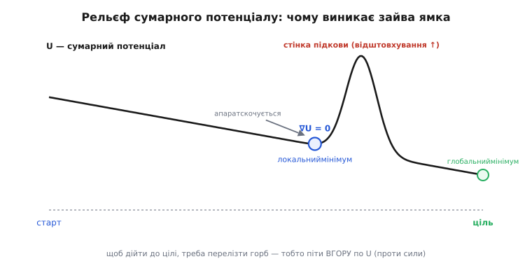
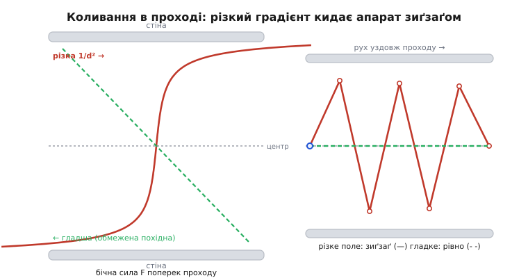

# 🧮 Математика потенційних полів: звідки береться пастка

Метод полів ми вже бачили в дії: ціль тягне, перешкоди штовхають, апарат іде за сумою векторів. Красиво — і водночас ненадійно: застрягає в ввігнутих кутах, дрижить у проходах. Ці дві біди не випадкові й не від кривого коду. Вони **виводяться** з тих самих формул, з яких випливає й уся елегантність методу. Розберімо апарат до кісток — від означення потенціалу до точки, де градієнт нуль, — і стане видно, що застрягання й тремтіння **вбудовані** в саму ідею «складати поля», а не долягають до неї збоку.

## Що таке потенціал і чому сила — це його схил

Слово **потенціал** (лат. *potentia* — «спроможність, сила») прийшло сюди з фізики, і не для краси, а тому, що вся механіка методу — точна копія руху тіла в силовому полі. Уяви горбистий рельєф. У кожній точці землі є **висота** — одне число. Постав кульку — і вона покотиться **вниз**, до найнижчого місця, а сила, що її туди жене, тим більша, чим **крутіший схил** під нею. На пласкому дні кулька стоїть: схилу немає — немає й сили.

Ось і весь метод у зародку. Замість реального рельєфу ми будуємо **уявний**: над кожною точкою простору підвішуємо число — **потенціал** U(x, y). Робимо так, щоб біля цілі було **низько** (долина), а біля перешкод — **високо** (гори). Тоді апарат, як та кулька, «скочується» рельєфом до цілі й сам огинає гори перешкод. Рухом керує **не саме число U, а його схил** — те, наскільки різко U змінюється, коли трохи посунутися.

Схил у математиці зветься **градієнт** (лат. *gradiens* — «той, що ступає, йде»). Градієнт ∇U у точці — це вектор, що вказує в бік **найкрутішого підйому** U, а його довжина — крутість того підйому. Кулька котиться **проти** підйому, тож сила спрямована **проти** градієнта:

```
F = −∇U
```

Мінус тут — головне слово формули. Він каже: сила тягне туди, де U **спадає** найшвидше — під гору, до долини. У двовимірному просторі градієнт — це просто пара часткових похідних (наскільки U міняється по x і по y окремо):

```
∇U = ( ∂U/∂x , ∂U/∂y )
```

а частка ∂U/∂x — це відповідь на питання «якщо зсунутися на крихту праворуч, на скільки підскочить U?». Тому сила по осі x — це `Fx = −∂U/∂x`, по y — `Fy = −∂U/∂y`. Уся хитрість методу далі — лише в тому, **який саме рельєф** U ми ліпимо. Складемо його з двох частин: долина до цілі й гори на перешкодах.

> 🔧 **Навіщо це.** Погляд «сила = мінус схил потенціалу» — не абстракція, а те, що дає методу його головну перевагу перед будь-яким «якщо перешкода ліворуч — кермуй праворуч». Ти не пишеш **правил** обходу; ти ліпиш **рельєф**, і правильна поведінка випадає з нього сама, як рух кульки з форми гори. Але той самий рельєф, що дарує плавність, має западини не лише там, де ти хотів, — і саме тому далі все й ламається.

## Долина до цілі: потенціал притягання

Почнімо з простішого — з тяги до цілі. Нам треба рельєф, у якому **найнижча точка — сама ціль**, а що далі від неї, то **вище**. Тоді схил усюди дивиться на ціль, і апарат скочується просто до неї.

Найприродніший такий рельєф — **параболічна чаша**: висота росте з **квадратом** відстані до цілі. Позначмо d — відстань від апарата до цілі. Тоді потенціал притягання (англ. *attractive* — «притягальний»):

```
U_att = ½ · k_att · d²
```

де k_att — коефіцієнт, наскільки крута чаша (більший — дужче тягне). Множник ½ тут суто для краси похідної — зараз побачиш, чому. Візьмімо силу як мінус градієнт. Похідна d² по відстані — 2d, множник ½ її гасить, і виходить напрочуд просте:

```
F_att = −∇U_att = −k_att · (вектор від цілі до апарата)
       |F_att|  =  k_att · d
```

Читаймо це вголос. Сила спрямована **від апарата до цілі** (мінус розвертає «від цілі до апарата» назад — точно на ціль), а її **довжина лінійно росте з відстанню**: далеко від цілі — тягне сильно, зовсім поряд — майже відпускає, у самій цілі — нуль. Виходить пружинка: що дужче апарат «розтягнув» відстань до цілі, то дужче вона його підтягує назад. Плавно, без ривків біля мети — саме те, що треба.

У параболічної чаші є одна вада: **дуже далеко** від цілі сила стає **величезною** (росте без меж із d). Для апарата, що стартує за кілометр, це недобре — тяга «перекричить» усі перешкоди. Тому інколи беруть **конічний** рельєф (лат. *conus* — «конус»): не чаша, а рівний схил-лійка, де U росте **лінійно** з d, а не з квадратом:

```
U_att = k_att · d        ⟹        |F_att| = k_att   (стала, поки d > 0)
```

Тут сила **однакова** на будь-якій відстані — стільки-то й квит, куди б апарат не забрів. Зручно здалеку (тяга не роздувається), але незручно біля цілі: сила не спадає до нуля, а тримається сталою аж до самої мети, тож апарат може **проскочити** її й засмикатися навколо. На практиці ці два рельєфи **зшивають**: далеко — конус (щоб тяга не роздималася), близько — парабола (щоб м'яко згасала біля цілі). Але для нашої розмови про пастку деталь зшивки не важлива — важливо лиш, що **чаша притягання сама по собі має рівно один мінімум, і він у цілі**. Проблеми починаються не тут, а коли ми доліплюємо до цієї чаші гори перешкод.

## Гори перешкод: потенціал відштовхування

Тепер гори. Від перешкоди треба рельєф, який **круто здіймається вгору при наближенні** до неї — щоб апарат-кулька скочувався геть, — але **лише зблизька**: далеку перешкоду чути не повинно, інакше вона тягтиме курс, коли до неї ще їхати й їхати.

Звідси два вимоги. Перший: потенціал має **вибухати вгору**, коли відстань до перешкоди ρ прямує до нуля (грецька літера ρ, «ро», — стала позначка відстані до найближчої перешкоди). Другий: за деякою межею впливу ρ₀ (радіус, далі якого перешкоду ігноруємо) потенціал має бути **рівно нуль** — жодного сліду.

Класичну відповідь дав Ошама Хатіб, і вона стала канонічною формою методу:

```
          ½ · k_rep · (1/ρ − 1/ρ₀)²ρ ≤ ρ₀
U_rep =
          0ρ > ρ₀
```

Розберімо цю дивну на вигляд формулу — вона того варта, бо саме з її схилу згодом вилізе половина бід. Дивимось на дужку `(1/ρ − 1/ρ₀)`:

- Коли **ρ = ρ₀** (апарат рівно на межі впливу), 1/ρ = 1/ρ₀, дужка **нульова**, U_rep = 0. Рельєф гладко «сідає» на нуль на самій межі, без стрибка-сходинки. Це важливо: якби на межі був стрибок, сила там була б нескінченна.
- Коли **ρ → 0** (апарат майже впритул), 1/ρ **вибухає** в нескінченність, дужка з ним, квадрат тим паче — гора здіймається **стіною**. Апарат ніби б'ється об нескінченно високий вал і майже ніколи не торкається перешкоди.
- Різницю `(1/ρ − 1/ρ₀)`, а не просто `1/ρ`, беруть саме заради нуля на межі: вона віднімає рівно стільки, щоб на ρ = ρ₀ вийшов чистий нуль, а не якийсь маленький хвіст.

Тепер сила — мінус градієнт цього. Похідна трохи марудна (складна функція від ρ), але результат читабельний:

```
F_rep = k_rep · (1/ρ − 1/ρ₀) · (1/ρ²) · (вектор від перешкоди до апарата)
```

Три множники, кожен зі змістом. `(1/ρ − 1/ρ₀)` — «наскільки ми зайшли в зону впливу» (нуль на межі, росте вглиб). `(1/ρ²)` — ось де сила **злітає впритул**: біля ρ → 0 вона поводиться як 1/ρ³, тобто зростає ще шаленіше за сам потенціал. `(вектор від перешкоди до апарата)` — напрям: **строго геть від перешкоди**. Саме цей 1/ρ²-хвіст у коді керма записаний як `strength = k_rep * (1.0f / (d * d))` — спрощена, але та сама за духом крутість «впритул — стіною».

> 🔧 **Навіщо це.** Форма `(1/ρ − 1/ρ₀)²` — не єдина можлива, і в цьому вся сіль. Її обрали, бо вона одночасно вибухає впритул (безпека) і гладко сідає на нуль на межі (немає розриву). Але «гладко на межі» ще не означає «м'яко всередині»: крутість `1/ρ²` робить силу поблизу перешкоди **дуже чутливою** до крихітних змін ρ — а це, як побачимо, і є пружина коливань. Обираючи форму гори, ти водночас — не бажаючи того — обираєш, **наскільки нервово** апарат смикатиметься біля стіни.

## Складання: одне поле з багатьох

Досі — окремо чаша й окремі гори. Метод стає методом на одному кроці: **все підсумовуємо в єдиний рельєф**. Загальний потенціал у точці — це чаша притягання плюс усі гори від усіх перешкод, які цю точку «дістають»:

```
U(x, y) = U_att + Σ U_rep,i
                  i
```

(Σ — «сума», грецька «сигма»; i пробігає всі перешкоди в межах впливу). А що сила — це мінус градієнт, і градієнт суми дорівнює сумі градієнтів, то й підсумкова сила — це просто **сума всіх сил**:

```
F = −∇U = F_att + Σ F_rep,i
                  i
```

Ось звідки взялося те саме векторне складання, яке ми бачили в коді: `fx = k_att*goal_x; ... fx += strength*ox`. Це не окремий трюк реалізації — це **прямий наслідок** того, що потенціали додаються, а похідна лінійна. Апарат щотакту рахує один вектор F, кермує туди, робить крок — і котиться сумарним рельєфом.

І тут — **ключова думка всієї вставки**, з якої випливе все далі. Ми ліпили чашу з рівно одним мінімумом (ціль) і гори з рівно одним максимумом кожна (перешкода). Але **сума** цих гарних, простих доданків — рельєф, форму якого ми **не проєктували напряму**. Ми задали складники; підсумкову поверхню отримали як їхню суму — і в цій сумі можуть з'явитися **западини, яких ми не замовляли**. Складаючи два «правильні» рельєфи, легко ненароком викопати ямку між ними. Саме така незамовлена ямка — і є пастка.

## Локальний мінімум: западина, якої ніхто не копав

Тепер — головне. **Локальний мінімум** (лат. *localis* — «місцевий»; *minimum* — «найменше») — це точка, де **градієнт нульовий**, тобто сила нуль, апарат стоїть, — але це **не ціль**. Рельєф навколо йде вгору в усі боки (маленька улоговинка), тож кулька, докотившись, застигає в ній назавжди, хоч справжня долина — деінде.

Розберімо це не на словах, а на силах — на прикладі підкови зі статті: перешкода у формі літери **U**, відкрита до апарата, ціль за нею. Поставмо себе в точку **на осі підкови, десь усередині чаші**, і чесно складімо, що на апарат діє.

**🔧 Worked-приклад: де саме сила стає нулем (одновимірний зріз).** Візьмімо вісь x уздовж осі підкови: апарат у точці x, ціль у x_goal праворуч за дном підкови, дно підкови (задня стінка) — стіна відштовхування праворуч від апарата. Ліворуч підкова відкрита. Порахуймо горизонтальну силу.

```
Тяга цілі (праворуч, до цілі, за конічним полем — стала):
    F_att = +k_att              (напр. k_att = 1.0)

Поштовх задньої стінки (ліворуч, геть від стіни; стіна на відстані ρ):
    F_wall = −k_rep · (1/ρ − 1/ρ₀) · (1/ρ²)

Бічні стінки підкови (згори й знизу) тягнуть від себе — вертикально,
на осі їхні горизонтальні складові взаємно гасяться → по x внеску 0.

Підсумкова горизонтальна сила:
    Fx(x) = k_att − k_rep · (1/ρ − 1/ρ₀) · (1/ρ²)
```

Тепер простежмо Fx, як апарат заходить у підкову й наближається до задньої стінки (ρ меншає):

```
Далеко від стінки (ρ близько до ρ₀):  дужка (1/ρ − 1/ρ₀) ≈ 0
    → F_wall ≈ 0 → Fx ≈ +k_att > 0   → тягне ВПЕРЕД, апарат заходить глибше.

Близько до стінки (ρ мале):  (1/ρ − 1/ρ₀)·(1/ρ²) вибухає
    → F_wall величезний ліворуч → Fx < 0  → штовхає НАЗАД.

Між ними, за неперервності, є ρ*, де рівно:
    k_att = k_rep · (1/ρ* − 1/ρ₀) · (1/ρ*²)
    → Fx(ρ*) = 0.
```

Висновок читається сам. Ззовні (ρ велике) сумарна сила **позитивна** — вабить усередину. Зсередини (ρ мале) — **негативна**, виштовхує. Між додатним і від'ємним, за теоремою про проміжне значення, конче є точка ρ*, де сила **точно нуль**. Апарат, скочуючись у підкову, доїжджає до ρ* — і **застигає**: тяга цілі й поштовх стінки зрівноважилися до нуля, рухати нема чому. Ціль — ось вона, за стіною, а апарат стоїть, бо в цій точці **немає схилу**.


*Рельєф сумарного потенціалу U уздовж прямої, що йде крізь підкову до цілі. Зліва напрямок притягання тягне U донизу (чаша), але задня стінка підкови здіймає різкий **горб** відштовхування. Між ними лежить **паразитна ямка** — точка ∇U = 0, якої ми не замовляли: вона народилася як побічний ефект **суми** чаші й гори. Апарат-кулька скочується в цю ямку й застигає, бо щоб дійти до глобального мінімуму (ціль праворуч), треба **перелізти горб** — піти вгору по U, проти сили, а поле рухає лише вниз.*

Найважливіше — **чому це не баг**. Ми ніде не помилилися в коді: чаша правильна, гора правильна, складання правильне. Ямка виникла **саме тому, що поля склалися**. У точці ρ* зустрілися спадний схил притягання (тягне праворуч) і крутіший висхідний схил відштовхування (тягне ліворуч), і десь вони перетнулися рівно — там сумарний схил нуль. Це не діра реалізації, а **топологічна властивість суми**: коли складаєш поле з одним мінімумом і поле-бар'єр, за бар'єром легко утворюється **другий**, місцевий мінімум. Метод, що бачить лише сумарну силу тут-і-зараз, **фізично не здатен** розрізнити цей несправжній мінімум і справжній: в обох сила нуль, обидва «виглядають» як приїхали.

І звідси ж — чому вибратися так важко. Щоб покинути ямку, треба піти туди, де U **вища**, — угору по горбу стінки, **проти** сумарної сили. Але поле за означенням жене **вниз по U**. Апарат, що кориться тільки −∇U, ніколи сам не полізе вгору: для нього це те саме, що просити кульку самохіть викотитися з ями. Потрібен **тимчасовий відступ від цілі** в обхід підкови — а на нього поле принципово не здатне, бо не має пам'яті й не бачить далі миттєвого схилу. Ось повна причина застрягання: **незамовлена западина від суми полів + сліпе скочування вниз = глухий кут**, з якого сам метод не виходить.

## Коливання: коли схил надто крутий для дискретних кроків

Друга біда — тремтіння у вузькому проході — теж не випадкова, і корінь її вже в нас перед очима: множник `1/ρ²` у силі відштовхування. Він робить силу біля стіни **дуже крутою** — а крутий схил у поєднанні з тим, що апарат ходить **не плавно, а стрибками**, дає осциляцію (лат. *oscillo* — «гойдаюся»).

Розгляньмо апарат **посередині** вузького проходу. Ліва стіна на відстані ρ_L, права — ρ_R. Бічна (поперечна) сила — різниця двох поштовхів:

```
F_бічна = k_rep · [ (1/ρ_R − 1/ρ₀)·(1/ρ_R²)  −  (1/ρ_L − 1/ρ₀)·(1/ρ_L²) ]
```

Рівно на осі ρ_L = ρ_R, дужки однакові, різниця **нуль** — сила не тягне вбік, усе спокійно. Але апарат керується **дискретно**: раз на такт міряє, рахує F, кермує, робить скінченний крок — і не втрапляє точно на вісь, а опиняється трохи ліворуч. І ось тут `1/ρ²` мстить. Трохи наблизившись до лівої стіни (ρ_L поменшало), апарат дістає **непропорційно великий** правий поштовх — бо сила росте як 1/ρ³ впритул, тож маленьке зменшення ρ_L дає **велике** зростання F. Цей завеликий поштовх кидає апарат **за** середину, до правої стіни. Там симетрично зростає лівий поштовх — і жбурляє назад. Апарат **перестрілює** середину раз за разом, гойдаючись зиґзаґом між стінами замість пройти рівно.


*Механізм коливань. Ліворуч — бічна сила як функція положення поперек проходу: **різка** крива `1/d²` (червона) майже пласка посередині, але **круто** злітає біля стін; **гладша** крива з обмеженою похідною (зелена) наростає полого. Праворуч — що з того виходить: різке поле дає завеликий поштовх на найменше зміщення, апарат **перестрілює** середину й іде **зиґзаґом** (червона траєкторія); гладке поле відповідає м'яко, апарат тримається осі майже прямо (зелена). Тремтіння — не збій, а надчутлива пружина `1/d²`, збуджена дискретними кроками керма.*

Це та сама пружина, що й у механіці: чим **жорсткіша** пружина (крутіший схил сили), тим на **менший** крок дискретного керування система вже йде вразнос. Формально осциляція вибухає, коли крутість сили × крок за такт × запізнення реакції переростають поріг стійкості — і крутість тут задає саме `1/ρ²`. Той самий механізм смикає кермо, коли апарат налітає на перешкоду **в лоб**: щойно ρ впаде під ρ₀, поштовх **вмикається різко** (сила стрибає з нуля на помітну величину майже миттєво), кермо сіпається; апарат відскочив, ρ знову > ρ₀, поштовх **вимкнувся** — і так туди-сюди, дрож на самому краю зони впливу. Знову: не помилка коду, а **крутизна поля проти дискретності керма**.

> 🔧 **Навіщо це.** Практичний висновок прямий: чим ближче апарат підпускають до стін (менший ρ₀ або тісніший прохід) і чим рідше крутиться контур керма (більший крок за такт), тим дужче `1/ρ²` розгойдує машину. Якщо поле дрижить — не «підкручуй коефіцієнти навмання», а дивись у корінь: або **пом'якшити схил** сили (нижче), або **частіше** оновлювати керування (менший крок — менше перестрілювання), або взагалі не тримати апарат у зоні крутого схилу. Це те саме балансування «жорсткість проти частоти», що й у будь-якому [контурі керування зі зворотним зв'язком](root:embedded/autonomous-system).

## Чи рятує гладше поле?

Раз обидві біди ростуть із **крутості** схилу, напрошується ліки: зробити поле **гладшим** — таким, у якого похідна (сила) **обмежена**, не вибухає до нескінченності. І це справді допомагає — але, що важливо зрозуміти до кінця, **не лікує**.

Ідея проста. Замість `1/ρ²`, що злітає без меж, беруть силу, яка при ρ → 0 виходить **на стелю**: наростає, поки апарат наближається, але не круто, а полого, і зверху впирається в скінченне значення. Форм багато — обмежити силу згори порогом, узяти функцію з м'яким насиченням замість `1/ρ`, згладити перехід на межі ρ₀ так, щоб і **похідна** сідала на нуль плавно, а не лише саме значення. Спільне в них одне: **обмежена похідна** — сила ніде не змінюється нескінченно різко.

Що це дає **коливанням** — видно одразу. Пружина стає **м'якшою**: мале зміщення від осі проходу тепер дає **помірний** поправний поштовх, а не завеликий, апарат не перестрілює середину так люто, зиґзаґ згасає в плавну лінію (зелена крива на фігурі вище — саме вона). Проти дрожу гладке поле — справжні й дієві ліки, і на практиці силу майже завжди так чи інакше обмежують згори.

А от **локальному мінімуму** гладше поле не зарадить — і причина глибша за будь-яку форму. Пастка виникала **не** через крутість, а через сам факт, що **сума** чаші й бар'єра має зайву западину. Хоч який пологий бар'єр ти постав, точка, де спадна тяга цілі рівно врівноважує висхідний поштовх стіни, **нікуди не дінеться** — вона є завжди, коли за перешкодою лежить ціль, бо це наслідок **знаків** сил (одна вперед, друга назад — між ними конче є нуль), а не їхньої **крутості**. Гладша гора лише зробить западину **пологішою** (у ній сила близька до нуля на ширшій ділянці — апарат «плаває» мляво), але **дна** з нульовим градієнтом не прибере. Кулька застигне однаково.

Ось де проходить чесна межа методу, і її треба знати твердо. **Гладкість** поля — це про **крутість** схилу, тож вона впливає на **коливання** (їх послаблює аж до непомітних) і **не впливає** на **локальний мінімум** (він живе в топології суми, не в крутості). Жодним підбором форми поля не можна прибрати пастку, лишаючись у межах «складати поля й котитися вниз»: доки рішення — це чистий −∇U, апарат скочуватиметься в будь-яку западину суми, справжню чи паразитну. Прибрати пастку означає **вийти за межі методу** — додати те, чого в чистому полі нема: пам'ять про пройдене, погляд на цілі напрямки замість однієї рівнодійної, здатність на тимчасовий відступ проти сили. Саме тому наступні методи обходу дивляться не на суму сил, а на цілі напрямки — не лагодять поле, а міняють саме питання, на яке відповідає рефлекс.

## Підсумок

Метод потенційних полів — це точна механіка кульки на рельєфі: сила є мінус градієнт потенціалу (`F = −∇U`), тож апарат скочується туди, де U спадає найкрутіше. Рельєф ліплять із двох частин: **параболічна** (чи конічна) чаша притягання `U_att = ½ k_att d²` з єдиним мінімумом у цілі, і гори відштовхування Хатіба `U_rep = ½ k_rep (1/ρ − 1/ρ₀)²` — вибухають упритул, гладко сідають на нуль на межі впливу ρ₀. Підсумкове поле — їхня **сума**, і сила — сума сил; звідси й векторне складання в коді. Але сума простих доданків — рельєф, форму якого ми не проєктували напряму: за ввігнутою перешкодою (підкова) спадний схил тяги цілі рівно врівноважує висхідний поштовх стіни, і в цій точці градієнт **нуль** — **локальний мінімум**, паразитна западина, у якій апарат застигає, не дійшовши. Це не помилка коду, а **топологічна властивість суми полів**: за бар'єром між ним і ціллю неминуче з'являється зайвий мінімум, бо між силою вперед і силою назад конче є нуль. Друга біда — **коливання** — росте з крутості `1/ρ²`: надчутлива до дрібних зміщень сила в парі з дискретними кроками керма перестрілює середину проходу й гойдає апарат зиґзаґом. **Гладше поле** з обмеженою похідною послаблює коливання (м'якша пружина — рівніший рух), але **не усуває** локального мінімуму, бо той живе в знаках і топології суми, а не в крутості схилу. Прибрати пастку можна лише вийшовши за межі «складати поля й котитися вниз» — саме туди й веде дорога до наступних методів обходу.
