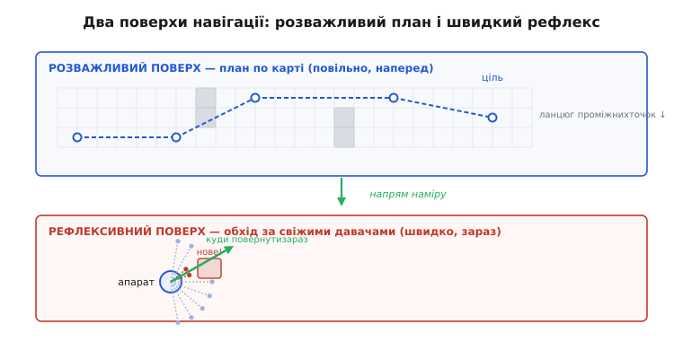
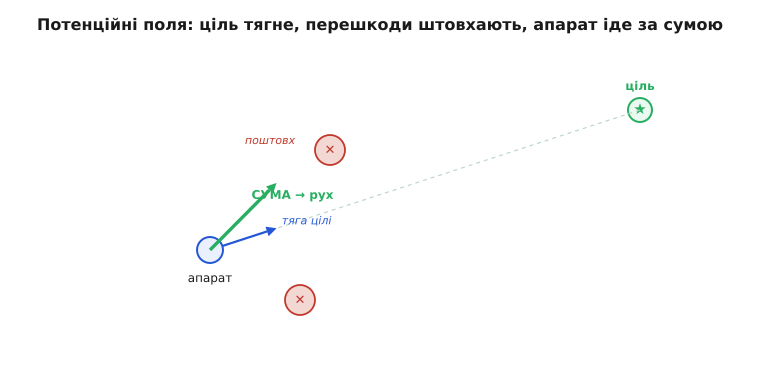
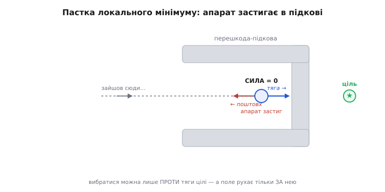
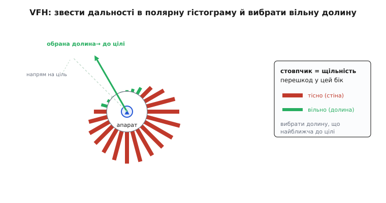

# Обхід перешкод

<preknowlist>
- [Планування шляху: сітка і A*](root:embedded/path-planning-grid) — глобальний план дає готовий маршрут по відомій карті; обхід працює під ним.
- [Безконтактна відстань](root:embedded/contactless-distance) — як давач добуває число «як далеко перешкода» з луни чи часу польоту світла; це вхід рефлексу.
</preknowlist>

У попередньому кроці ми навчили апарат [прокладати шлях по сітці алгоритмом A*](root:embedded/path-planning-grid): маємо карту, знаємо, де стіни, — і машина знаходить найкоротшу дорогу до цілі, огинаючи все позначене як зайняте. Здавалося б, обхід перешкод розв'язано. Але тут ховається тиха, велика хиба.

A* планує по карті, яку ти дав йому **наперед**. А тепер апарат уже в дорозі — і на його шлях виїжджає те, чого на карті не було: людина, інший дрон, гілка, зрушена вітром, ящик у проході. Карта каже «тут вільно», а перед носом — перешкода. Переплановувати весь маршрут A* на кожну нову пляму надто повільно: поки алгоритм перебере тисячі клітин, апарат уже врізався. Світ міняється швидше, ніж думає глобальний планувальник, а свіжою карта не буває ніколи. Тож усюди, де апарат рухається серед **живого** світу, під розважливим планом мусить сидіти нижній, швидкий шар, інакше рано чи пізно апарат вріжеться в те, «чого на карті немає».

Звідси головна ідея кроку: над повільним планом сидить **швидкий рефлекс** — контур, що дивиться давачами прямо перед собою й **щомиті** підправляє курс, аби не зачепити те, що виринуло зненацька. План каже «взагалі туди»; рефлекс — «але зараз бери лівіше, бо праворуч стіна». Саме цей рефлекс — **обхід перешкод** (англ. *obstacle avoidance*) — ми й розберемо: як апарат, що бачить лише на кілька метрів довкола, ухиляється в реальному часі.

## Два поверхи: розважливий план і швидкий рефлекс

У будь-якого апарата, що рухається розумно, навігація ділиться на **два поверхи** в різному темпі. Верхній — **розважливий** (англ. *deliberative* — «обдуманий»): це A* по карті, що дивиться на **весь** простір здалеку, знає ціль і будує **цілий** маршрут наперед; розумний, але повільний і сліпий до нового, з періодом у секунди. Нижній — **рефлексивний** (англ. *reactive* — «той, що відповідає на подразник»): він знає лише дві речі — **куди штовхає план** і **що прямо переді мною зараз** (свіжі покази давачів) — і з них щотакту видає одне число, куди повернути. У великому масштабі він дурний і застрягає в глухому куті, зате швидкий, з періодом у мілісекунди.


*Два поверхи навігації. Планувальник раз на кілька секунд будує маршрут по карті; рефлекс у ритмі керма накладає свіжі покази давачів і щотакту вирішує, куди повернути **зараз**.*

## Що апарат насправді бачить

Рефлекс живиться не картою, а **сирими показами давачів відстані** — відповідями на одне питання: «як далеко перешкода **в цьому напрямку**?» Простий далекомір міряє відстань уздовж одного променя: «прямо переді мною вільно на 3 метри». [Як апарат добуває це число з луни чи часу польоту світла — окремий крок](root:embedded/contactless-distance). Лазерний сканер (LiDAR) **крутить** промінь довкола й повертає цілий **вінець** відстаней — по одній у кожному напрямку.

Отже, у розпорядженні рефлексу — **кільце дальностей**: масив, де індекс означає кут, а значення — відстань до найближчої перешкоди під цим кутом. Ніякої карти, ніякої історії — лише миттєвий знімок «що близько зараз і з якого боку». Уся геніальність методів обходу в тому, як із цього короткозорого знімка витиснути одне рішення: **куди повернути**. Розгляньмо три способи — від найпростішого до найпрактичнішого.

## Спосіб перший: сили, що штовхають і тягнуть

Найінтуїтивніша ідея обходу, і історично перша в реальному апараті, така проста, що аж дивно, чому вона працює. [Її 1985 року запропонував Ошама Хатіб](root:embedded/obstacle-avoidance/hist-obstacle-avoidance.md): уяви, що апаратом керують **невидимі сили**, як тілом у полі. Ціль **притягує**, наче магніт залізну кульку: що далі, то дужче тягне. Близька перешкода **відштовхує**, наче однойменний заряд: чим ближче підповз, тим сильніше вона пхає **геть** — далеку майже не чути, впритул шпурляє з усієї сили.

А далі — те, що робить метод таким гарним. Апарат **не вибирає** між «летіти до цілі» і «тікати від стіни»: він просто **додає всі сили як вектори** — тягу цілі й усі поштовхи — і рухається за сумою. Одна операція складання, і апарат сам собою огинає перешкоди, збочуючи рівно настільки, наскільки його відпихає найближча стіна, і вертаючись до цілі, щойно небезпека позаду. Метод так і зветься — **метод потенційних полів** (англ. *potential field* — «силове поле», за аналогією з фізичним полем, звідки й ідея додавати сили).


*Метод потенційних полів. Ціль **притягує** (синій вектор), кожна перешкода **відштовхує** тим сильніше, чим ближча (червоні), а апарат іде за їхньою **сумою** (зелений) — обхід виходить сам собою.*

**Порахуймо кермову команду методом полів (C++).** Складаємо тягу цілі й поштовхи від усіх напрямків, де давач бачить близьку перешкоду:

```cpp
// Кільце дальностей: dist[i] — відстань до перешкоди під кутом angle[i].
// Апарат у початку координат; goal_x, goal_y — напрям на ціль (одиничний).
const int   N        = 72;          // 72 промені = крок 5°
const float influence = 2.0f;       // радіус впливу перешкоди, м: далі — ігноруємо
const float k_rep    = 1.5f;        // сила відштовхування
const float k_att    = 1.0f;        // сила притягання до цілі

float fx = k_att * goal_x;          // тяга цілі
float fy = k_att * goal_y;

for (int i = 0; i < N; i++) {
    float d = dist[i];
    if (d <= 0.0f || d > influence) continue;   // немає відбитку або задалеко

    // Одиничний вектор ВІД перешкоди до апарата (напрям поштовху).
    float ox = -cosf(angle[i]);
    float oy = -sinf(angle[i]);

    // Що ближче перешкода, то сильніший поштовх (∝ 1/d² — різко зростає впритул).
    float strength = k_rep * (1.0f / (d * d));
    fx += strength * ox;
    fy += strength * oy;
}

float heading = atan2f(fy, fx);     // куди кермувати цієї миті
```

Усе рішення — один цикл підсумовування й `atan2`. Кожен близький промінь додає поштовх тим різкіший, чим менше `d` (звідси `1/d²` — впритул сила злітає, тож апарат майже не торкається стіни), а напрям суми йде прямо в нижній [контур керування](root:embedded/autonomous-system). Просто, дешево, у ритмі керма — саме те, що треба рефлексу.

## Де гарна ідея ламається

Метод полів такий елегантний, що хочеться на ньому й спинитися. Але ще на початку 1990-х його **вроджені вади** розібрали так ретельно, що [автори того розбору — Йорам Корен і Йоганн Боренштайн](root:embedded/obstacle-avoidance/hist-obstacle-avoidance.md) — узагалі відмовилися від полів. Найгірша — **пастка локального мінімуму** (англ. *local minimum* — «місцевий найнижчий рівень»). Апарат перед перешкодою у формі підкови, відкритою до нього, з ціллю за нею: тяга веде **всередину**, апарат заходить — і стіни штовхають його **назад**. У глибині є точка, де поштовхи стін урівноважують тягу цілі **точно**, сума сил нульова, і апарат **застигає** — рухатися нема куди, а ціль ще за стіною. Він не врізався, але й не доїхав: щоб вибратися, треба піти **проти** тяги, а поле рухає лише за нею.


*Пастка локального мінімуму. Ціль за перешкодою-підковою тягне апарат усередину, стіни штовхають назад — у глибині сили гасять одна одну, і апарат застигає, хоч ціль попереду.*

Друга вада — **коливання**: у вузькому проході стіни тиснуть з обох боків, і апарат **дрижить** зиґзаґом між ними замість плавно пройти серединою. Ці дві біди — не помилка реалізації, а [сама суть підходу «складати сили»](root:embedded/obstacle-avoidance/math-potential-field.md). Тому поля лишаються добрі, щоб зрозуміти **саму ідею** обходу, і живі там, де перешкоди рідкі й опуклі, — але **ніколи** не роби їх самотнім рефлексом у вузьких проходах чи серед ввігнутих перешкод: апарат застрягне в першому ж куті. Потрібен метод, що думає про **напрямки**, а не лише про сили.

## Спосіб другий: думати про напрямки, а не про сили

Корінь бід полів у тому, що вони **стискають** усе довкола до одного вектора й одразу його виконують. А що, як спершу чесно **роздивитися всі напрямки** й свідомо вибрати найкращий? Цей поворот думки [1991 року зробили Боренштайн і Корен](root:embedded/obstacle-avoidance/hist-obstacle-avoidance.md), назвавши свій метод **гістограмою векторного поля** (англ. *Vector Field Histogram*, VFH). Апарат зводить кільце дальностей у **полярну гістограму**: коло довкола нього поділене на сектори (по 5°), і в кожному стовпчик показує, **наскільки в цей бік тісно** — багато близьких перешкод дають високий, чисто й далеко — низький. Потім він шукає **долини**: суміжні низькі сектори, тобто **прогалини**, широкі досить, щоб протиснутися, — і кермує в ту, що **найближча до напряму на ціль**. Не «сума сил штовхає туди», а свідоме «онде вільний коридор до цілі — іду в нього».


*Гістограма векторного поля (VFH). Кожен сектор кола дістає стовпчик за щільністю перешкод — високий, де тісно, низький, де вільно. Апарат кермує в **долину**, найближчу до напряму на ціль (зелена стрілка).*

Це лікує обидві біди полів. Коливання зникає, бо апарат тримається **середини вибраної долини**, а не однієї рівнодійної, що сіпається. Локальний мінімум VFH проходить краще: він **бачить**, що прямо до цілі — суцільна стіна гістограми, а збоку низька долина, і свідомо завертає в неї. Проти справжнього лабіринту короткозорий рефлекс усе одно слабкий і там покладається на верхній поверх, — але у звичайному захаращеному просторі VFH надійний, бо **розділив** два питання, які поля плутали в одне: спершу «де вільно», тоді «куди з вільного вигідно». [Робочий VFH на C — від гістограми до вибору долини — в окремій вставці](root:embedded/obstacle-avoidance/proj-vfh.md).

## Спосіб третій: а чи встигну я так повернути?

І поля, і VFH мовчки припускають одне, що в житті часто хибне: **апарат може миттю повернути куди завгодно**. Але реальне тіло має **інерцію**: дрон на 10 м/с не зверне під прямим кутом за півметра — його понесе далі по дузі. Виходить, «найкращий напрям» може бути **фізично недосяжним** за той короткий час, — і апарат врізається не тому, що погано **вибрав**, а тому, що не встиг **виконати** вибір.

Цю сліпоту закрив третій метод — **динамічне вікно** (англ. *Dynamic Window Approach*, DWA), який [1997 року запропонували Дітер Фокс, Вольфрам Бургард і Себастьян Трун](root:embedded/obstacle-avoidance/hist-obstacle-avoidance.md). Поворот думки радикальний: не питай «у який **бік** кермувати», питай «яку **пару швидкостей** — вперед і поворотну — мені задати», бо швидкості напряму пов'язані з тим, що двигуни й інерція **дозволяють**. За наступний такт апарат може змінити швидкість лише в **невеликих** межах — це й є **вікно** досяжних пар (звідси **динамічне**: воно їде разом зі станом, різне на місці й на повному ходу). Апарат перебирає пари **всередині** вікна, для кожної подумки прокручує коротку дугу, відкидає ті, що впираються в перешкоду, а з решти обирає ту, що заразом **веде до цілі**, **тримається чимдалі від перешкод** і **дозволяє їхати швидко** — найкращу **команду, яку тіло справді виконає цієї миті**. Тому DWA потрібен, щойно апарат **швидкий** або **неповороткий**, тобто майже завжди: поля й VFH відповідають на «куди», DWA — на «куди **і як швидко, щоб устигнути**».

## Як рефлекс живе під місією

Обхід — це **нижній** поверх: він **не скасовує** місію, а **оберігає** її, коротко збочуючи там, де глобальний план наосліп повів би в перешкоду. Природний поділ праці такий: [планування по сітці](root:embedded/path-planning-grid) дає проміжні точки в обхід **відомих** стін; обхід ухиляється від **невідомих**, нових; а коли рефлекс збочив далеко й «загубив» маршрут, [навігація pure pursuit](book:algorithms/pure-pursuit-navigation) плавно наводить його назад. Три шари, кожен зі своєю швидкістю й обрієм зору.

І остання, найважливіша тверезість. Обхід — це **зменшення** ризику, а не гарантія. Давач має мертві зони: тонкий дріт, скло, чорну поверхню, що не відбиває променя, апарат може просто **не побачити**; рефлекс короткозорий і в лабіринті застрягне; на граничній швидкості навіть DWA може не мати жодної безпечної дуги. Тому над обходом завжди стоїть [сітка безпеки місії](root:embedded/mission-planning) — геозона й повернення додому, — що спрацьовує, коли рефлекс не впорався. Отже, обхід — це швидкий, кмітливий, але недалекоглядний рефлекс, що рятує від переважної більшості несподіванок, — а не привід їхати наосліп, сподіваючись, що «воно саме ухилиться».
