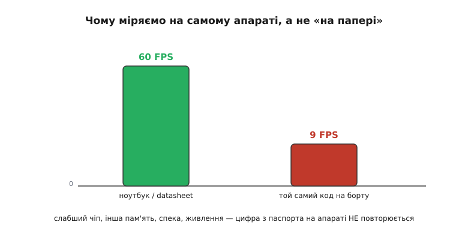
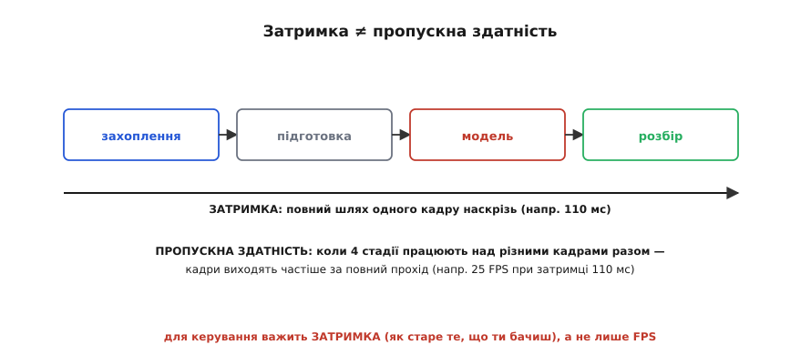
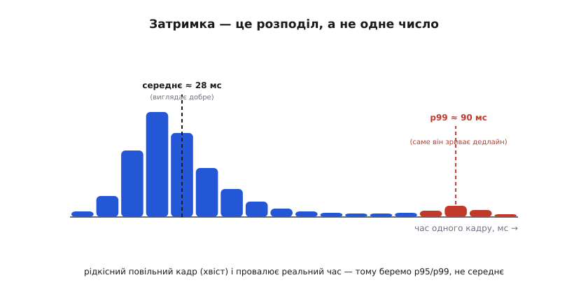
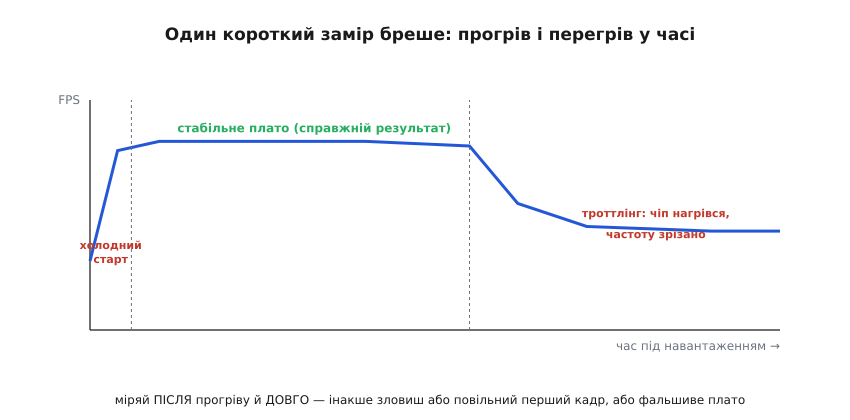

# Бенчмаркінг на пристрої: міряти там, де воно літатиме

Ми вже [обрали детектор](root:embedded/model-zoo) і [вирішили, де його рахувати](root:embedded/where-to-compute). Лишилося питання, яке вирішує все: **чи встигає воно насправді?** На сторінці моделі написано «60 кадрів за секунду». У статті про плату — «1.5 трильйона операцій за секунду». Обидві цифри — правда. І обидві майже нічого не кажуть про твій апарат, бо їх отримали **не на ньому й не в його умовах**. Бенчмаркінг (англ. *benchmark* — позначка-репер, яку землеміри карбували на камені, щоб від неї мірити висоти) — це коли ти перестаєш вірити паспорту й **сам міряєш** на тому самому залізі, з тим самим кодом, у тій самій спеці, що буде в польоті.

Це не формальність наприкінці. Це інструмент, яким ти ще на столі дізнаєшся те, що інакше дізнався б у повітрі — коли апарат уже не наздоганяє ціль, бо «60 FPS» виявилися дев'ятьма.

### Чому паспортна цифра бреше

Найперше — звідки взагалі береться розрив. Цифру «60 FPS» хтось виміряв на потужному ноутбуці з відеокартою, від розетки, у прохолодній кімнаті, на ідеальному кадрі. Твій апарат — це слабший чіп, інша пам'ять, живлення від батареї, нагрів у закритому корпусі й реальне відео з шумом. Кожна з цих відмінностей відкушує продуктивність, і разом вони відкушують **разюче багато**.


*Чому міряємо на самому апараті. Ту саму мережу хтось проганяв на ноутбуці з відеокартою — вийшло 60 кадрів за секунду. Той самий код на бортовому чіпі, від батареї, у спеці — дев'ять. Слабше залізо, інша пам'ять, тепловий ліміт і живлення з'їдають кратну різницю. Паспортна цифра — це стеля в ідеальних умовах, а не те, що ти матимеш у польоті.*

А [трильйони операцій за секунду](topic:hw-arch/compute-cost) (TOPS) брешуть ще підступніше. Це **теоретична стеля** заліза — скільки множень воно зробило б, якби дані текли ідеально й жодне ядро не простоювало. Реальна мережа так не працює: вона чекає на пам'ять, упирається в стадії, які не паралеляться, гальмує на шарах, під які чіп не заточений. Тому з паспортних TOPS до реального FPS «доходить» дай боже десята частина — і яка саме десята, наперед не скаже ніхто. Звідси правило, від якого нема винятків: **продуктивність не рахують — її міряють**, і міряють на тому залізі, де код житиме.

> 🔧 **Навіщо це.** Ніколи не плануй апарат за цифрами з datasheet чи з чужого ноутбука. «Плата тягне 1.5 TOPS, мережа важить 0.15 TOPS на кадр, отже 10 FPS» — це фантазія, що на практиці дасть утричі-вп'ятеро менше. Перший крок будь-якого зорового проєкту — взяти **саме твою плату**, залити **саме твою мережу** й виміряти реальний FPS до того, як ти на цю цифру заклав поведінку апарата. Дешевий урок на столі замість дорогого в повітрі.

### Дві різні цифри: затримка й пропускна здатність

Перш ніж міряти, треба чітко знати, **що** саме. Бо «швидкість» — це насправді дві різні величини, які часто плутають, і плутанина дорого коштує.

**Затримка** (англ. *latency*) — це скільки часу минає від моменту, коли камера зняла кадр, до моменту, коли ти маєш готову відповідь («ось тут ціль»). Повний шлях наскрізь, для **одного** кадру. **Пропускна здатність** (англ. *throughput*) — це скільки відповідей виходить за секунду, тобто той самий FPS. Здавалося б, одне обернене до іншого: 100 мс на кадр — отже 10 FPS. Та це справджується **лише** коли все рахується суто послідовно. А реальний конвеєр обробки так не працює.


*Затримка ≠ пропускна здатність. Кадр проходить чотири стадії: захоплення з камери, підготовка (масштаб, формат), сама модель, розбір результату. **Затримка** — повний час одного кадру крізь усі стадії (скажімо, 110 мс). **Пропускна здатність** — скільки кадрів виходить за секунду, коли стадії працюють над різними кадрами паралельно (поки модель жує кадр №5, камера вже знімає №6) — і тоді FPS вищий, ніж 1/затримка. Можна мати 25 FPS і водночас 110 мс затримки. Для керування важить саме затримка: вона каже, наскільки старе те, на що ти реагуєш.*

Уяви конвеєр із чотирьох стадій — захоплення, підготовка, модель, розбір, — кожна на своєму обчислювачі. Поки модель обробляє п'ятий кадр, камера вже знімає шостий, а розбір домелює четвертий. Стадії працюють **паралельно**, кожна над своїм кадром. Тоді кадри виходять із темпом найповільнішої стадії, а не суми всіх — і FPS виходить **вищим**, ніж 1/затримка. Можна спокійно мати 25 кадрів за секунду й при цьому цілих 110 мілісекунд затримки.

І ось чому ця різниця критична саме для дрона. FPS каже, **як часто** ти отримуєш картинку. Затримка каже, **наскільки стара** та картинка, на яку ти реагуєш. [Контур керування](root:embedded/output-mixing) живе затримкою: якщо між «об'єкт там» і «кермуй туди» проходить 110 мс, то на швидкості 20 м/с апарат за цей час пролетить понад два метри **наосліп**, реагуючи на вже застаріле минуле. Високий FPS цього не рятує. Тому міряти треба **обидві** цифри й знати, котра з них тиснутиме на твою задачу: для плавного відео — пропускну, для керування — затримку.

### Затримка — це розподіл, а не одне число

Тепер найтонше місце, на якому спотикаються майже всі початківці. Припустимо, ти виміряв затримку. Прогнав мережу сто разів, узяв **середнє** — вийшло 28 мс. Чудово, з запасом укладаємось у бюджет. І це міркування — пастка.

Бо час одного кадру **не сталий**. Він гуляє від запуску до запуску: операційна система відвернулась на іншу задачу, спрацював збирач сміття, чіп на мить притримав частоту, дані не лягли в кеш. Більшість кадрів швидкі, але час від часу трапляється **повільний** — і саме він провалює реальний час.


*Затримка — це розподіл. Якщо намалювати, скільки разів кадр зайняв стільки-то часу, виходить купа коротких плюс довгий «хвіст» рідкісних повільних. **Середнє** (≈28 мс) лежить у купі й виглядає чудово. Та **p99** — час, у який укладається 99 кадрів зі ста, — сидить аж у хвості (≈90 мс). Саме той рідкісний повільний кадр і зриває дедлайн керування. Тому для реального часу беруть перцентиль (p95/p99), а не середнє: воно ховає найгірше, а керування ламає саме найгірше.*

Тому інженери реального часу майже ніколи не звітують середнім. Вони беруть **перцентиль** (лат. *centum* — сто): p99 — це час, у який укладаються 99 кадрів зі ста; p95 — 95 зі ста. Це число каже не «зазвичай швидко», а «**майже завжди** не повільніше, ніж…». Різниця разюча: середнє може бути 28 мс, а p99 — усі 90, бо один кадр зі ста гальмує втричі. Якщо твій дедлайн — 50 мс на кадр, то за середнім ти «проходиш», а за p99 — **провалюєшся раз на сто кадрів**, тобто кілька разів на хвилину апарат сліпне на критичну мить. Правило просте: **середнє — для маркетингу, перцентиль — для рішень**. Дивись на хвіст, бо саме хвіст тебе вб'є.

> 🔧 **Навіщо це.** Завжди звітуй і середнє, і p95/p99, і максимум. Для керування закладайся на **p99**, а не на середнє: апарат має встигати в **найгіршому** реальному кадрі, а не в типовому. Якщо p99 далеко відірваний від середнього — це сигнал, що в системі є джерело випадкових гальм (фонова задача, перевиділення пам'яті, троттлінг), і його треба знайти й прибити, а не всереднити. Гладке середнє з рваним хвостом — це апарат, що «зазвичай літає», а «зрідка падає».

### Три пастки, що псують вимір

Знати, що міряти, — пів справи. Друга половина — виміряти **чесно**, бо саме тут новачки масово отримують цифри, які брешуть. Пасток три, і кожна має просту причину.

**Перша — холодний старт.** Найперший прогін мережі майже завжди драматично повільніший за решту. Чіп ще не підняв робочу частоту, ваги ще не лягли в кеш, бібліотека ще доініціалізовується, пам'ять виділяється вперше. У вимірах це дає смішну картину: перший кадр — 300 мс, а далі по 30. Якщо ти, як часто буває, прогнав мережу **один** раз і записав той час — ти записав сміття. Лік: спочатку зроби кілька «**прогрівальних**» прогонів (англ. *warmup*), результат яких **викидаєш**, і лише тоді починай міряти. Різниця між холодним і прогрітим виміром буває не у відсотках, а в **рази** — одне дослідження зафіксувало понад вісімнадцятикратний розрив між першим і прогрітим запуском.

**Друга — вимір не того.** Коли мережа рахується не на процесорі, а на прискорювачі (відеоядро, нейропроцесор), виклик «порахуй» часто лише **ставить роботу в чергу** й одразу повертається, не чекаючи, поки прискорювач закінчить. Якщо обхопити таймером саме цей виклик, секундомір зупиниться, поки робота ще триває, — і ти отримаєш фантастично малий час, бо виміряв не обчислення, а **постановку задачі в чергу**. Лік: перед тим, як зупинити таймер, треба явно **дочекатися**, поки прискорювач справді все доробить (така команда-бар'єр є в кожному фреймворку). Інакше міряєш швидкість віддавання наказу, а не швидкість його виконання.

**Третя — спека.** Ось найпідступніша, бо короткий замір її просто не бачить. Перші секунди чіп тримає повну частоту й видає чудовий результат. Та під безперервним навантаженням він **гріється**, і коли впирається в тепловий ліміт, сам **зрізає** собі частоту, щоб не згоріти (англ. *thermal throttling*). FPS провалюється — і це вже **стале** число для реального польоту, а не той блиск перших секунд.


*Один короткий замір бреше двічі. На початку — повільний холодний старт (чіп ще не розігнався, кеш порожній). Тоді — стабільне плато: оце і є справжній результат. Тоді, під безперервним навантаженням, чіп нагрівається до ліміту й сам зрізає собі частоту — FPS провалюється на нижче плато (троттлінг). Замір на перших секундах зловить або повільний старт, або фальшивий пік перед перегрівом. Чесне число дає лише довге навантаження — десятки секунд чи хвилини, як у реальному польоті.*

Числа тут не абстрактні. Малий бортовий комп'ютер без активного охолодження під зоровим навантаженням зрізає частоту приблизно за півтори хвилини — і його FPS падає з 30 десь до 22, а в найгірших випадках до одиниць, причому час кадру стає дико нерівним. Висновок прямий: **міряй довго** — десятки секунд, краще хвилини, у тому ж корпусі й за тієї ж вентиляції, що в польоті. Той блиск, що тримається три секунди, в апараті не існує — апарат працює на тому плато, що лишається після прогріву й перегріву.

> 🔧 **Навіщо це.** Чесний бенчмарк завжди: (1) кілька прогрівальних прогонів **у смітник**; (2) **бар'єр-очікування** перед зупинкою таймера, якщо рахує прискорювач; (3) **довге** навантаження в реальному корпусі, щоб упіймати троттлінг. Пропустиш будь-що з трьох — отримаєш цифру, яка на столі виглядає чудово, а в повітрі обертається аварією. І вимірюй **повний** конвеєр: не лише мережу, а й захоплення кадру та його підготовку — бо застосунок чекає саме на повний шлях, а підготовка кадру іноді коштує більше за саму модель.

### Як це міряють у коді

Зведімо все до робочого інструменту. Серце чесного виміру — правильний годинник, прогрів, цикл вимірів і збір **усіх** часів, щоб потім дістати з них перцентилі. Ось кістяк на C++ — саме так міряють час на пристрої.

**Базовий вимір: монотонний годинник, прогрів, перцентилі**
```cpp
#include <chrono>
#include <vector>
#include <algorithm>
#include <cstdio>

// Монотонний годинник: не стрибне назад, навіть якщо систему підкрутять.
using clk = std::chrono::steady_clock;

static double ms_since(clk::time_point t0) {
    auto dt = clk::now() - t0;
    return std::chrono::duration<double, std::milli>(dt).count();
}

void benchmark(Model& net, const Frame& frame) {
    // 1) ПРОГРІВ — результат викидаємо: розганяємо чіп, гріємо кеш.
    for (int i = 0; i < 20; ++i) {
        net.infer(frame);
        net.synchronize();      // дочекатися прискорювача (інакше міряємо чергу!)
    }

    // 2) ВИМІР — збираємо ВСІ часи, а не лише суму (потрібні для перцентилів).
    const int N = 300;          // багато прогонів: хвіст видно лише на масі
    std::vector<double> times;
    times.reserve(N);
    for (int i = 0; i < N; ++i) {
        auto t0 = clk::now();
        net.infer(frame);
        net.synchronize();      // БАР'ЄР: тепер таймер ловить усе обчислення
        times.push_back(ms_since(t0));
    }

    // 3) СТАТИСТИКА — середнє бреше, тож рахуємо й перцентилі.
    std::sort(times.begin(), times.end());
    double sum = 0;
    for (double t : times) sum += t;
    double mean = sum / N;
    double p50  = times[N * 50 / 100];
    double p99  = times[N * 99 / 100];
    double worst = times.back();

    printf("середнє %.1f | p50 %.1f | p99 %.1f | гірший %.1f мс  (%.1f FPS за p99)\n",
           mean, p50, p99, worst, 1000.0 / p99);
}
```

Кожен рядок тут затуляє одну з пасток. `steady_clock` — це **монотонний** годинник: він міряє лише плин часу й ніколи не стрибне назад, на відміну від «настінного» годинника, який система може підкрутити синхронізацією прямо посеред виміру. Цикл прогріву викидає холодний старт. `synchronize()` — той самий бар'єр, без якого таймер зловив би лише чергу, а не обчислення. Ми зберігаємо **всі** триста часів, а не їх суму, бо перцентиль неможливо порахувати з самого середнього — потрібен увесь масив, відсортований. І звітуємо за **p99**, а FPS рахуємо як `1000/p99` — тобто «скільки кадрів я гарантую в найгіршому з сотні», а не «скільки бувало в найкращому».

Цей кістяк — навмисне голий. Реальний бенчмарк ще міряє стадії окремо (захоплення, підготовку, модель), стежить за температурою й частотою чіпа в реальному часі, годує мережу **різними** кадрами (один і той самий може осісти в кеш і збрехати), пише все в лог. Повний робочий інструмент із цими можливостями — щоб ним справді можна було профілювати бортовий зір — зібрано окремо: [бортовий профайлер: розклад по стадіях, перцентилі, нагляд за температурою](root:embedded/on-device-benchmarking/proj-profiler.md). Там і код стадійного таймінгу, і читання теплових лічильників, і чому годувати треба потоком різних кадрів.

### Що з цим робити: від цифри до рішення

Бенчмарк — не самоціль. Виміряв — тепер **вирішуй**. Зістав виміряну затримку (за p99, не середнім!) із **бюджетом** задачі: скільки часу на кадр насправді дозволяє контур. Для стеження за рухомою ціллю це звичайно десятки мілісекунд; для повільного обльоту місцевості — навіть пів секунди стерпно.

Якщо вкладаєшся з запасом — чудово, у тебе є простір узяти **точнішу** (важчу) мережу. Якщо не вкладаєшся — у тебе рівно три важелі, і бенчмарк підказує, за який смикнути. **Полегшити модель**: менший варіант детектора з [зоопарку моделей](root:embedded/model-zoo), [сильніше стиснення](topic:sf-ml/tinyml), нижча роздільність кадру. **Перенести обчислення**: з процесора на бортовий прискорювач, або взагалі [на потужніший рівень](root:embedded/where-to-compute), якщо затримка мережі це дозволяє. **Прибрати марнування**: часто винна не мережа, а товста підготовка кадру чи зайве копіювання пам'яті — і бенчмарк по стадіях покаже це пальцем. Без виміру ти смикав би навмання; з виміром б'єш точно в те, що гальмує.

І остання, найважливіша звичка: **переміряй після кожної зміни**. Оновив мережу, підкрутив код, поміняв роздільність, додав ще одну задачу на той самий чіп — заміряй знову. Продуктивність на вбудованому залізі крихка: невинна на вигляд правка легко з'їдає той запас, який ти насилу виборов. Бенчмарк дешевий, аварія — ні. Тому в зрілих проєктах він не разовий ритуал, а постійний вартовий, що ловить просідання щойно воно з'явилось — задовго до того, як його впіймає апарат у повітрі.

Цікаво, що спокуса покращити **число**, а не саму річ, давня й добре задокументована: коли продуктивність стала валютою, виробники навчилися підганяти залізо й драйвери саме під популярні тести — аж до гучних скандалів. Ця історія — корисне застереження, чому бенчмарк треба ставити так, щоб його не можна було обдурити: [коли почали грати з бенчмарком замість речі](root:embedded/on-device-benchmarking/hist-benchmark-gaming.md).

### Що з цього лишається

Паспортна цифра — стеля в чужих ідеальних умовах; на твоєму апараті її нема. Тому продуктивність не рахують, а **міряють** — на тому залізі, з тим кодом, у тій спеці, що буде в польоті. Міряти треба **дві** різні величини: пропускну здатність (FPS — як часто бачиш) і затримку (наскрізний час одного кадру — наскільки старе те, на що реагуєш); для керування вирішує затримка. Затримка — це **розподіл**, тож звітуй **перцентилем** (p95/p99), а не середнім: ламає тебе рідкісний повільний кадр у хвості. Вимір легко зіпсувати трьома пастками — холодним стартом (лік: прогрів у смітник), виміром черги замість обчислення (лік: бар'єр-очікування) і тепловим троттлінгом (лік: довге навантаження в реальному корпусі). У коді все це складається у простий чесний кістяк: монотонний годинник, прогрів, багато прогонів, збір усіх часів, перцентилі. А виміряну цифру обертай на рішення — полегшити модель, перенести обчислення чи прибрати марнування — і **переміряй після кожної зміни**, бо запас на вбудованому залізі крихкий, а аварія в повітрі дорога.
