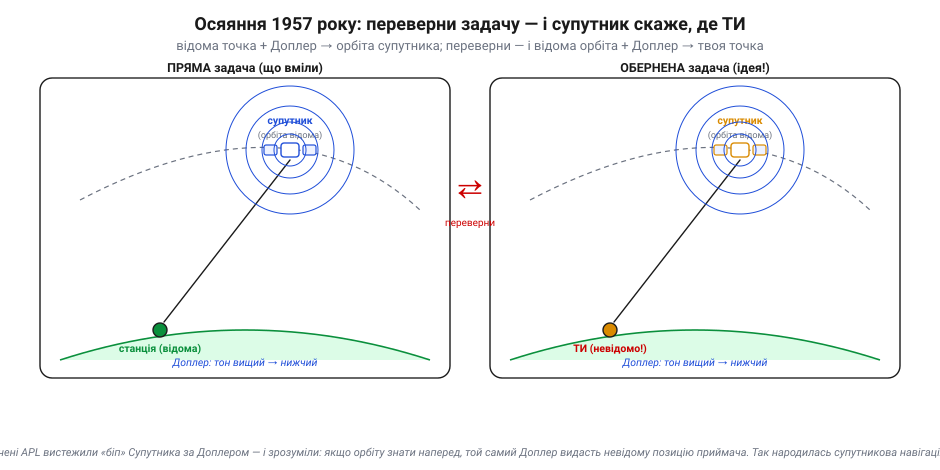
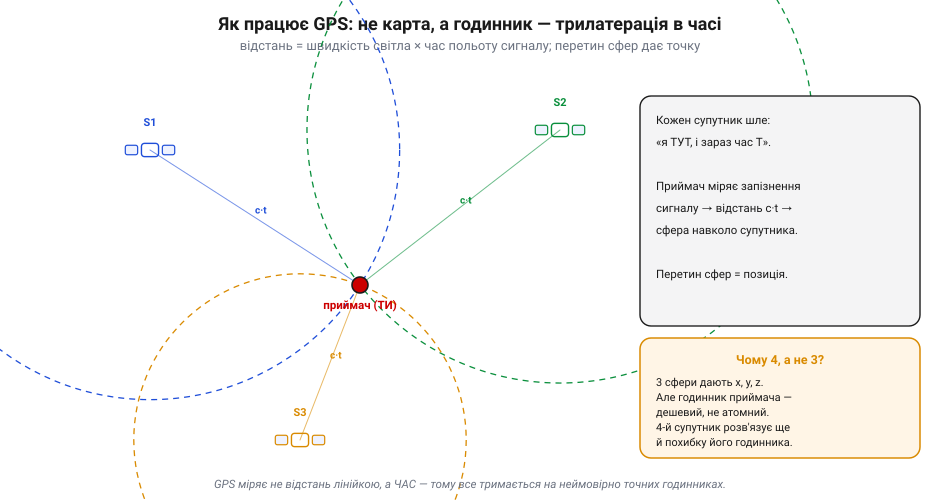
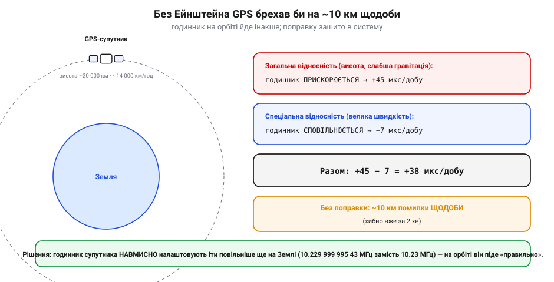
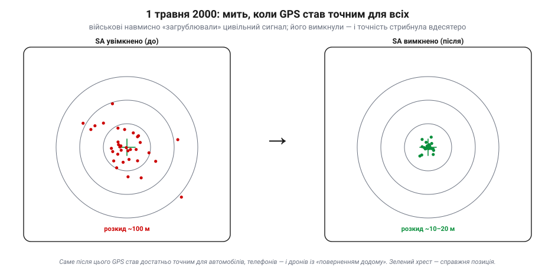

# Історія: GPS — від військового проєкту до кожного дрона

Серед компонентів польотної системи апарата є один, що його сьогодні сприймають як належне: маленький приймач, який будь-якої миті каже апарату, **де він на Землі**. Натисни «повернутися додому» — і дрон сам прилетить у точку зльоту з точністю до метрів. Це здається буденним. Насправді ж за цим стоїть одна з найграндіозніших інженерних споруд людства — сузір'я атомних годинників на орбіті, точність якого тримається на теорії відносності, а доступність — на двох політичних рішеннях. І почалося все не з дронів і не з автомобілів, а з радіосигналу першого штучного супутника й несподіваного запитання двох молодих учених.

Це історія не дат, а **ідей**: чому взагалі можна знати, де ти, без жодного орієнтира; як радіо й годинник замінили карту; і чому диво, створене для ракет і підводних човнів, опинилося в кишені у кожного.

---

## Прадавня проблема: де я без орієнтирів

Уся історія мореплавання — це історія боротьби з одним питанням: **де я?** На суходолі допомагають орієнтири — гора, річка, дорога. Але посеред океану орієнтирів немає, і помилка в позиції коштувала кораблів і життів. Широту навчилися визначати за висотою сонця чи зірок ще давно, а от довгота століттями лишалася нерозв'язною — настільки, що держави призначали за неї величезні премії. Зрештою її «приборкали» точним годинником, але навіть тоді навігація лишалася складним мистецтвом спостережень, таблиць і обчислень.

Проблема в основі своїй така: щоб знати своє місце, потрібно щось **відоме**, від чого можна відштовхнутися, — і спосіб **виміряти** відстань або напрям до нього. Зірки відомі, але до них не «дотягнешся» точно. А що, якби в небі з'явилися рукотворні «зорі» з **точно відомим** положенням, та ще й такі, що самі **повідомляють** про себе? Звучало як фантастика — аж до жовтня 1957 року.

---

## Сигнал Супутника: несподіваний дарунок з неба

4 жовтня 1957 року СРСР запустив **Супутник-1** (*Sputnik*) — першу рукотворну річ на орбіті, що монотонно «бікала» в ефір. Світ слухав той сигнал зачаровано й тривожно. А двоє молодих фізиків у **Лабораторії прикладної фізики** Університету Джонса Гопкінса (*Applied Physics Laboratory*, APL) — **Вільям Гайєр** (*William Guier*) і **Джордж Вайффенбах** (*George Weiffenbach*) — зробили з нього дещо більше, ніж послухали.

Вони помітили, що частота «біпу» **повзе**: коли супутник наближається, тон вищий, коли віддаляється — нижчий. Це звичайний ефект Доплера. Але з того, **як саме** зсувається частота під час прольоту, можна було відновити всю траєкторію супутника. За кілька тижнів вони навчилися визначати **орбіту** Супутника, сидячи на одному відомому місці й слухаючи Доплер.

А далі сталося справжнє осяяння — і належало воно їхньому колезі **Френку Макклуру** (*Frank McClure*). Він спитав: а якщо **перевернути** задачу? Зараз ви з **відомої** точки знаходите **невідому** орбіту. Але якщо орбіту знати **наперед**, то той самий доплерівський сигнал видасть **невідому позицію приймача**. Іншими словами — супутник із відомою орбітою може сказати кораблю, **де той корабель**.

*Зерно всієї супутникової навігації — у переверненні задачі. Ліворуч: стоячи на відомому місці, за доплерівським зсувом сигналу обчислюєш орбіту супутника (це й зробили в APL із Супутником). Праворуч: якщо орбіту вже знаєш, той самий зсув видає твою власну, невідому позицію. Поміняй місцями «відоме» й «невідоме» — і слухач перетворюється на навігатора.*

Ця ідея негайно знайшла замовника. Військовому флоту США були вкрай потрібні точні координати для **підводних човнів** із балістичними ракетами Polaris: щоб влучно вистрілити, човен мусить точно знати, **звідки** стріляє. Так народилася **TRANSIT** — перша у світі система супутникової навігації, що запрацювала для флоту на початку 1960-х. Вона була повільна (фікс раз на прольоті супутника, приблизно щогодини) і груба за сучасними мірками, але вона **довела принцип**: навігація з неба можлива.

> 🔧 **Навіщо це.** Запам'ятай цю інверсію — вона лежить в основі **будь-якого** GNSS-приймача, зокрема того, що стоїть на апараті. Приймач не «бачить» Землю; він слухає супутники з відомими орбітами й розв'язує обернену задачу — «де я?». Усе інше — лише як зробити це швидше й точніше.

---

## Народження GPS: від підводних човнів до всього світу

TRANSIT працювала, але її межі муляли. Фікс лише зрідка, лише двовимірний (широта-довгота, без висоти), невисока точність. Військовим хотілося іншого: **безперервне, тривимірне, глобальне** позиціювання в реальному часі — для літаків, ракет, кораблів, солдатів. Хотілося, щоб **будь-якої миті в будь-якій точці** планети приймач знав, де він і на якій висоті.

Над цим у 1960-х працювали кілька груп незалежно, і в історії GPS прийнято називати **трьох батьків**, кожен зі своїм внеском:

- **Роджер Істон** (*Roger Easton*) з Військово-морської дослідної лабораторії (*Naval Research Laboratory*) — розробляв проєкт TIMATION і ключові ідеї **точного часу** на супутниках, без якого GPS неможливий.
- **Айвен Геттінг** (*Ivan Getting*) з корпорації Aerospace — просував концепцію супутникової системи й закладав її засади.
- **Бредфорд Паркінсон** (*Bradford Parkinson*) — головний архітектор, людина, що **зібрала все докупи** і провела програму крізь бюрократію.

Саме з Паркінсоном пов'язаний майже легендарний епізод. У серпні 1973 року його проєкт відхилили. Тоді він зібрав своїх інженерів-офіцерів у Пентагоні на вихідні Дня праці — у безлюдних коридорах, звідки й назва **«Lonely Halls Meeting»** («нарада в порожніх залах»). За ті дні команда наново переосмислила архітектуру системи, і вже в грудні 1973-го програму схвалили. Так народилася **NAVSTAR GPS** — та сама, що ми звемо просто «GPS».

Варто назвати ще одне ім'я, яке десятиліттями лишалося в тіні. Математикиня **Глейдіс Вест** (*Gladys West*) програмувала складні **геодезичні моделі форми Землі** — точний «геоїд», без якого координати «попливли б». Її обчислення лягли в основу тієї точності, якою GPS славиться; визнання прийшло аж за багато років. Це теж частина історії: грандіозні системи тримаються не лише на «батьках», а й на тих, чию працю довго не помічали.

> 🔧 **Навіщо це.** Коли в даташиті бачиш «NAVSTAR» — це історична назва GPS. А «суперечка про батьківство» нагадує важливе: складні системи не «винаходять» одинаки, їх **збирають** із внесків багатьох. Той самий принцип діє і в історії [ArduPilot](book:programming/ardupilot-layers) — і в кожній зрілій технології.

---

## Як працює GPS: годинник, а не карта

Тут варто на мить спинитися й зрозуміти **головну ідею**, бо вона прекрасна й неінтуїтивна. GPS не зберігає всередині жодної карти й не «бачить» місцевість. Він міряє **час**.

Кожен супутник безперервно передає повідомлення на кшталт: «**я зараз отут** (моя точна орбіта), і **зараз ось такий час**». Сигнал летить зі швидкістю світла, тож поки він дійде до приймача, мине крихітна, але вимірна частка секунди. Приймач порівнює час, «зашитий» у сигналі, зі своїм — і дістає **час польоту**. Помнож на швидкість світла — маєш **відстань** до супутника. Одна відстань кладе тебе десь на сфері навколо супутника; друга звужує до кола; третя — до точки.

*GPS міряє не відстань лінійкою, а час польоту сигналу. Кожен супутник дає сферу можливих положень радіусом «швидкість світла × час»; перетин сфер — твоя точка. У 3D трьох супутників вистачило б на x, y, z — але годинник приймача дешевий і неточний, тож додають четвертий супутник, щоб розв'язати ще й похибку цього годинника.*

І ось де ховається елегантність. У тривимірному просторі трьох відстаней досить, щоб знайти три координати — широту, довготу, висоту. Але є заковика: щоб виміряти час польоту, годинник **приймача** мав би бути такий самий точний, як атомний годинник супутника, — а він копійчаний і завжди трохи «бреше». Розв'язок геніально простий: додати **четвертий** супутник. Тоді невідомих стає чотири (три координати плюс похибка годинника приймача), і чотири супутники дають чотири рівняння. Система сама **обчислює й викидає** похибку дешевого годинника. Ось чому всюди кажуть: для фіксу GPS треба **щонайменше чотири** супутники, а не три.

> 🔧 **Навіщо це.** Тепер зрозуміло, чому апарат перед автономним зльотом **чекає на достатню кількість супутників** і не дає ввімкнути «повернення додому», поки їх мало: без чотирьох (а краще більше — для точності) фіксу просто немає. І зрозуміло, чому GPS **не працює в приміщенні чи під густим листям**: сигналу потрібна пряма видимість неба, бо все тримається на чесному часі польоту, який стіни спотворюють.

---

## Відносність у дії: без Ейнштейна GPS брехав би на 10 км щодоби

Якщо все тримається на годинниках — наскільки точними вони мусять бути? Настільки, що тут у гру вступає **теорія відносності Ейнштейна**, і це не красива метафора, а інженерна щоденність.

Годинник на супутнику зазнає **двох** релятивістських ефектів одночасно, і вони тягнуть у різні боки:

- **Загальна відносність**: супутник високо (≈ 20 000 км), де тяжіння слабше, а в слабшому полі час іде **швидше**. Це додає годиннику близько **+45 мкс на добу**.
- **Спеціальна відносність**: супутник мчить орбітою (≈ 14 000 км/год), а час для того, хто рухається, іде **повільніше**. Це віднімає близько **−7 мкс на добу**.

*Годинник на орбіті йде не так, як на Землі. Висота (загальна відносність) пришвидшує його на +45 мкс/добу, швидкість (спеціальна відносність) сповільнює на −7 мкс/добу; разом +38 мкс/добу. Якби це не врахувати, позиція «попливла б» приблизно на 10 км щодоби — а хибною стала б уже за дві хвилини. Тому годинник навмисно налаштовують іти повільніше ще на Землі.*

У сумі виходить **+38 мкс на добу** — годинник на орбіті щодоби «забігає» на цю крихту. Здається, дрібниця? Аж ніяк. Світло за 38 мкс пролітає понад 11 кілометрів. Якби поправку не вносили, обчислена позиція **відпливала б приблизно на 10 км щодоби**, а грубо хибною стала б уже за дві хвилини після ввімкнення. GPS був би не навігацією, а генератором випадкових координат.

Розв'язок — настільки ж прямий, наскільки й вражаючий: годинники супутників **навмисно налаштовують іти трохи повільніше** ще на Землі, перед запуском (точніше, на частоті 10.229 999 995 43 МГц замість рівних 10.23 МГц). На орбіті релятивістські ефекти «доганяють» цю різницю — і годинник іде саме так, як треба. Тобто кожен GPS-супутник — це **щоденне практичне підтвердження** того, що Ейнштейн мав рацію.

> 🔧 **Навіщо це.** Це найкраща у світі ілюстрація, що «точність давача» — поняття глибоке. Той самий принцип, тільки в мініатюрі, стосується всіх давачів апарата: дрібна, на позір незначна похибка, помножена на час чи відстань, виростає в кілометри. Інженер, що поважає свої давачі, завжди питає: «а що ця крихітна похибка зробить за годину польоту?»

---

## Дві миті, що відкрили GPS світові

GPS будували для війська. Чому ж сьогодні він у кожному телефоні, авто й дроні? Завдяки **двом** поворотним моментам, обидва — політичні рішення, а не технічні.

**Перший момент — трагедія 1983 року.** Пасажирський «Боїнг» рейсу **Korean Air Lines 007** через навігаційну помилку збочив у радянський повітряний простір і був збитий, загинули всі 269 людей на борту. Світ був приголомшений. У відповідь президент **Рональд Рейган** (*Ronald Reagan*) оголосив, що GPS, коли запрацює, буде **доступний цивільним** безкоштовно — щоб така навігаційна катастрофа більше не повторилася. Так система, замислена для ракет, дістала громадянську місію.

**Другий момент — 2000 рік.** Навіть відкритий цивільним, GPS довго лишався навмисно **загрубленим**. Військові ввели **Selective Availability** (SA, «виборча доступність») — спеціально псували цивільний сигнал, щоб ворог не міг скористатися повною точністю; помилка сягала близько **100 метрів**. Для навігації лайнера годилося, для точних задач — ні.

*Те саме залізо, два світи точності. Поки діяла Selective Availability, цивільні фікси розліталися на ~100 м навколо справжньої точки (зелений хрест). Опівночі 1 травня 2000 року її вимкнули — і розкид миттєво впав до ~10–20 м. Саме ця мить зробила GPS придатним для автомобільних навігаторів, смартфонів і, зрештою, дронів із точним «поверненням додому».*

Опівночі **1 травня 2000 року** адміністрація президента **Білла Клінтона** (*Bill Clinton*) наказала **вимкнути** Selective Availability. Точність цивільного GPS миттєво стрибнула приблизно **вдесятеро** — з сотні метрів до десятка-двох. Це був тихий технологічний вибух: за лічені роки розквітли автомобільні навігатори, геолокація в телефонах, а згодом — і аматорські дрони, яким раптом стало доступне те, що колись мали лише військові: знати своє місце з точністю до метрів. Без цієї миті не було б ні «утримання позиції», ні «повернення додому» на наших апаратах.

> 🔧 **Навіщо це.** Точність твого GPS-модуля — це спадок 1 травня 2000-го. І досі цивільний сигнал має свої межі (метри, не сантиметри), тому для надточних задач застосовують додаткові методи корекції. Знати, **наскільки** можна довіряти позиції, — частина грамотної роботи з давачем.

---

## Не лише GPS: сузір'я цілого світу

Ще одне, що варто знати, аби не плутатися в термінах. **GPS** — це конкретна **американська** система. Але вона не одна. Згодом свої сузір'я навігаційних супутників збудували й інші:

- **ГЛОНАСС** (*GLONASS*) — радянська за походженням (перший запуск — 1982), після 1991-го її продовжила й експлуатує Росія;
- **Galileo** (*Галілео*) — європейська;
- **BeiDou** (*Бейдоу*) — китайська.

Узагальнена назва для **всіх** таких систем — **GNSS** (*Global Navigation Satellite System*, глобальна навігаційна супутникова система). Сучасний приймач на апараті зазвичай слухає **кілька** сузір'їв одночасно: що більше супутників видно, то швидший і точніший фікс. Тому в документації давачів частіше пишуть саме «GNSS», а не «GPS», — і це не дрібниця, а вказівка, що модуль ловить не лише американські супутники.

> 🔧 **Навіщо це.** Коли в описі польотного модуля бачиш «GNSS: GPS + GLONASS + Galileo» — тепер ясно, що це означає й чому це добре: більше видимих супутників = надійніший фікс, особливо в складних умовах (місто, ліс). «GPS» у побуті стало синонімом будь-якої супутникової навігації, але строго — це лише одна з систем.

---

## Що з цього в нашому апараті

Повернімося на борт. Маленький GNSS-приймач — один із компонентів польотної системи — це пряме дитя всієї цієї історії: він слухає сузір'я атомних годинників, розв'язує ту саму обернену задачу Макклура, вносить ту саму ейнштейнівську поправку й видає апарату координати з точністю, що стала можливою лише 2000 року.

Але GPS не всемогутній, і це теж урок для розробника. Він **повільний** (оновлення кілька разів на секунду, не сотні), **грубий** на коротких масштабах, **залежний від видимості неба** й геть мовчить у приміщенні. Тому в архітектурі автономного апарата він ніколи не працює сам: його показання **поєднують** з інерціальним блоком та іншими давачами в оцінювачі стану ([поєднання давачів](book:communications/sensor-fusion)) — швидкий IMU закриває проміжки між рідкісними фіксами GPS, а GPS не дає IMU «спливати». Тут важливо лиш запам'ятати: GPS дає **абсолютну прив'язку до Землі**, якої не дасть жоден інший бортовий давач, але платить за це повільністю й примхливістю.

І коли тримаєш у голові, **звідки** взялася ця технологія й **чому** їй можна (і не завжди можна) довіряти, GPS-приймач на борту вже не здається чарівною коробкою — це слухач сузір'я атомних годинників, що чесно міряє час і платить повільністю за свою всевидющість.
