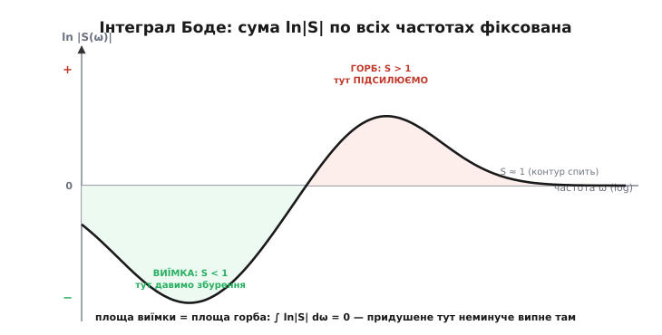
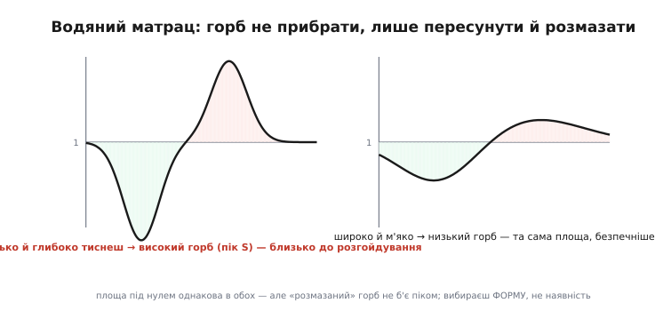
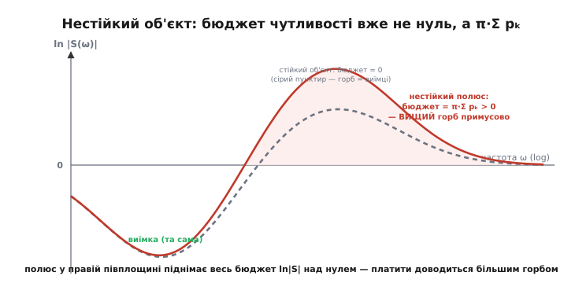

# 🧮 Інтеграл Боде й водяний матрац: чому чутливість не придушити скрізь

Ми вже вивели два дроби, з яких читається весь контур, — чутливість S = 1/(1+L) і доповняльну T = L/(1+L), — і побачили, що вони пов'язані намертво: S + T = 1 на кожній частоті. Уже з цього випливало, що не можна водночас давити збурення (мала S) і не впускати шум давача (мала T): зменшив одну — друга поповзла до одиниці. Але там ми домовилися **розвести** ці режими по частоті: тиснути S унизу (де живуть повільні збурення) і відпускати її вгорі (де живе шум). І тут причаїлося питання, від якого відмахнутися не вийде.

Здавалося б, а що заважає зробити S малою скрізь, де нам треба, а на решті частот лишити її **рівно одиницею** — так, щоб контур там нічого не псував? Одиниця — це ж «наче контуру немає»: збурення проходить як є, не гірше. Виявляється, що навіть цього скромного бажання природа не дає задовольнити. Є суворий закон збереження, який каже: усе, що ви **вирили** під одиницею на одних частотах, мусите з точністю до останньої краплі **насипати над одиницею** на інших. І над одиницею означає, що там контур збурення вже не давить, а **підсилює** — робить гірше, ніж якби його взагалі не було. Цей закон вивів Гендрік Боде, а його наслідок влучно назвали ефектом водяного матраца. Розберімо і сам закон, і чому він неминучий, — від першопричини.

## Що саме зберігається: означення бюджету чутливості

Спершу точно домовмося, яку величину ми зважуємо. Нас цікавить не сама S, а її **логарифм** — і не на одній частоті, а зсумований по **всіх** частотах. Причина, чому логарифм, стане ясна за хвилину; поки просто введемо величину, яку Боде довів сталою:

```
        ∞
 J  =   ∫  ln |S(ω)|  dω
        0
```

Прочитаймо це повільно, бо кожен шматок має сенс. Під інтегралом — ln|S(ω)|, натуральний логарифм модуля чутливості на частоті ω. Згадаймо, що робить логарифм зі значеннями навколо одиниці:

```
 S < 1  (контур ДАВИТЬ збурення)   →   ln|S| < 0   (внесок від'ємний)
 S = 1  (контур нічого не робить)  →   ln|S| = 0   (внеску немає)
 S > 1  (контур ПІДСИЛЮЄ збурення) →   ln|S| > 0   (внесок додатний)
```

Ось чому саме логарифм, а не сама S: логарифм робить точку S = 1 природним **нулем відліку** й дає від'ємне для придушення, додатне для підсилення. Інтеграл J тоді — це **чиста алгебрична сума** двох площ: площі, яку ми вирили під нулем там, де тиснемо чутливість, **мінус** площі, яку насипали над нулем там, де вона перевалює за одиницю. J — це, по суті, **бюджет чутливості** всього контуру: одне число, що зводить докупи всі придушення й усі підсилення по цілому спектру.

І весь фокус Боде в одному твердженні: для типового стійкого контуру цей бюджет **фіксований** — він не залежить від того, який регулятор ви поставили. Для найчастішого випадку (стійкий об'єкт, регулятор із належним спадом на високих частотах) бюджет дорівнює просто нулю:

```
 ∫ ln|S(ω)| dω  =  0        (стійкий контур, надлишок полюсів над нулями ≥ 2)
```

Нуль означає рівно те, що ми обіцяли: **вирите знизу дорівнює насипаному згори**. Ви можете крутити регулятор скільки завгодно — форму кривої ln|S| ви міняєте, але **площу під нею лишаєте незмінною**. Придушили чутливість глибше в одному місці — вона обов'язково випнулася над одиницею десь інде, і рівно на стільки ж.


*Бюджет чутливості в одній картинці. Там, де контур давить збурення, S < 1, отже ln|S| < 0 — зелена виїмка під віссю. Там, де контур звільняє чутливість, вона переступає одиницю, S > 1, ln|S| > 0 — червоний горб над віссю. Праворуч, де контур уже «спить», S ≈ 1 і крива тулиться до нуля. Закон Боде: зелена площа дорівнює червоній, їхня різниця — нуль, хоч би як ви крутили регулятор.*

> 🔧 **Навіщо це.** Тримайте в голові саме образ **бюджету**, а не окремих чисел. Коли ви піднімаєте підсилення, щоб глибше давити збурення в робочій смузі, ви не «покращуєте контур узагалі» — ви лише **перекладаєте** площу чутливості з одного місця спектра в інше. Питання при кожному налаштуванні не «як зробити S малою», а «куди я готовий скинути горб, який неминуче виросте». Хто мислить бюджетом, той не марнує тижні в гонитві за неможливим і одразу шукає, де в спектрі є місце під горб.

## Чому такий закон узагалі мусить існувати

Формулу оголосити легко; куди важливіше **відчути**, чому вона неминуча. Зробімо це у два заходи — спершу груба фізична інтуїція, тоді точніший механізм, — не занурюючись у важке комплексне числення, але й не махаючи руками.

Груба інтуїція така. Чутливість S = 1/(1+L) стає малою лише там, де підсилення петлі L велике. А велике L неможливо тримати на всіх частотах одразу: будь-який реальний контур має **спад** — на високих частотах L невблаганно падає до нуля (мотор інерційний, давач має смугу, обчислення вносить затримку). Отже, ви маєте скінченний «запас великого L» і мусите вирішити, на які частоти його витратити. Витратили весь на низ — на середніх частотах L проходить через одиницю, і саме там 1 + L може стати **за модулем меншим за одиницю**, а тоді S = 1/(1+L) вискакує **над** одиницею. Тобто перехід L від великого до малого фізично **мусить** пройти зону, де чутливість підстрибує. Горб — це слід від того, що L довелося опустити.

Але чому площі рівні **точно**, а не просто «горб десь є»? Тут потрібен трохи тонший аргумент, і він тримається на одній глибокій властивості S. Річ у тім, що S(ω) — не довільна крива: це значення на уявній осі однієї **аналітичної функції** S(s) комплексної змінної s. А в аналітичних функцій модуль і фаза не незалежні — вони жорстко зчеплені (це серце комплексного аналізу). Логарифм ln S(s) — теж аналітична функція скрізь, де S не має ні нулів, ні полюсів у правій половині комплексної площини; а для стійкого контуру з належним спадом так і є. І тут спрацьовує класична теорема Коші про інтеграл аналітичної функції по замкненому контуру: якщо функція всередині контуру всюди «гладка» (аналітична, без особливостей), то інтеграл по контуру, що її охоплює, дорівнює **нулю**.

Обведімо подумки контуром усю праву половину комплексної площини — уявну вісь знизу вгору й велике півколо, що замикає її праворуч. Інтеграл ln S по цьому контуру — нуль (усередині немає особливостей). Цей контурний інтеграл розпадається на дві частини: внесок уявної осі (а це рівно наш ∫ ln|S(ω)| dω, бо на уявній осі s = iω) і внесок великого півкола на нескінченності. Уся суть тепер — у другій частині:

```
 ∮ ln S(s) ds = 0
   контур

    внесок уявної осі  +  внесок півкола на ∞  =  0
   ────────┬────────      ────────┬─────────
   наш інтеграл J           мусить теж бути 0,
                            щоб J = 0
```

Отже, J дорівнює нулю **тоді й лише тоді**, коли внесок далекого півкола зникає. А він зникає точно тоді, коли на високих частотах S досить швидко прямує до одиниці — тобто коли L спадає досить круто, а це і є умова «полюсів принаймні на два більше, ніж нулів». Ось звідки в теоремі береться загадкова вимога **надлишку полюсів над нулями (щонайменше два)**: це рівно умова, за якої вклад нескінченності гине, і бюджет виходить чистим нулем. Якщо надлишок лише один, півколо лишає скінченний слід, і замість нуля праворуч стоїть інша стала — але й тоді бюджет **фіксований**, просто ненульовий.

> 🔧 **Навіщо це.** Не лякайтеся комплексної площини — практичний висновок простий. Закон Боде — не емпіричне спостереження й не властивість конкретного об'єкта, а **математична тотожність**, що випливає з самої природи стійкого зворотного зв'язку (аналітичність + спад). Тому марно шукати «правильнішу» структуру регулятора, яка його обійде: ПІД, компенсатор, розумний спостерігач — усі підкоряються однаково. Полюси в правій половині площини, які тут з'явилися як умова теореми, — не абстракція: [нестійкий об'єкт має полюс саме там](root:math-analysis/complex-numbers), і, як побачимо, він робить бюджет ще гіршим.

## Порахуймо бюджет: скільки коштує глибша яма

Абстрактну рівність площ варто хоч раз пропустити крізь числа — інакше «горб десь виросте» лишається туманом. Візьмімо контур, у якому чутливість на низьких частотах притиснута до сталого малого рівня в робочій смузі, а поза нею вертається до одиниці, і подивімося на баланс площ у логарифмі.

**Ціна поглиблення ями чутливості.** Нехай у робочій смузі завширшки Δω_роб = 10 рад/с ми тримаємо чутливість на рівні S_min, а весь горб потім розмазаний по смузі завширшки Δω_горб = 40 рад/с над одиницею на середньому рівні S_peak. Закон Боде вимагає рівності площ у логарифмі. Порахуймо, який горб виросте за різної глибини ями.

```
 баланс:  |ln S_min| · Δω_роб  =  ln S_peak · Δω_горб

 придушуємо в 10 разів (S_min = 0.1):
   |ln 0.1| · 10 = 2.303 · 10 = 23.0   ← вирита площа
   ln S_peak = 23.0 / 40 = 0.576   →   S_peak = e^0.576 ≈ 1.78
   (горб піднявся на 78 % над одиницею — контур там підсилює збурення в 1.78 раза)

 придушуємо в 100 разів (S_min = 0.01):
   |ln 0.01| · 10 = 4.605 · 10 = 46.1   ← удвічі глибша яма
   ln S_peak = 46.1 / 40 = 1.152   →   S_peak = e^1.152 ≈ 3.16
   (той самий горб піднявся вже на 216 % — підсилення в 3.16 раза)
```

Прочитаймо результат. Щоб додати ще один порядок придушення в робочій смузі (з 10× до 100×), ми **подвоїли вириту площу** — а отже, мусили подвоїти й насипану, і горб чутливості підскочив з 1.78 до 3.16. Помітьте нелінійну підступність: яма поглиблюється в логарифмі лінійно, але **пік** росте так, що збурення на «поганих» частотах підсилюється дедалі сильніше. Ось чому надто жадібний до придушення контур раптом починає **гірше** переносити збурення на середніх частотах, ніж узагалі без регулятора, — ви бачите це на осцилографі як зростання коливань саме в певній смузі.

І ось де цей горб зустрічається з усім, що ми знаємо про стійкість. Пік чутливості S_peak — це не абстракція: він **дослівно** дорівнює оберненій відстані від годографа L до критичної точки −1, тобто [запасу за модулем і фазою](root:embedded/loop-stability). Великий S_peak означає, що годограф підповз близько до −1, — а це і є контур на межі розгойдування. Тому «водяний матрац» і «запас стійкості» — два імені однієї речі: горб чутливості, який Боде забороняє прибрати, — це рівно той горб, що з'їдає ваш запас стійкості. Задавивши збурення надто глибоко, ви математично **зобов'язані** підсунути годограф ближче до −1 десь на іншій частоті.

## Водяний матрац: горб не прибрати, лише пересунути

Тепер дамо наслідку його ім'я і його точний зміст. **Ефект водяного матраца** (англ. *waterbed effect*) — образ безжальний і точний: натисніть водяний матрац в одному місці — він випнеться в іншому, бо води в ньому стала кількість. Тут «вода» — це площа під кривою ln|S|: скільки її, стільки й лишиться, ви лише перерозподіляєте.

Точна межа аналогії — ось де вона працює, а де ламається. Працює в головному: збереження «об'єму» (площі) абсолютне, продавити скрізь одразу неможливо. Ламається в одному: справжній матрац випинається поряд із місцем натиску, а чутливість може випнутися **де завгодно** по спектру — теорема фіксує лише сумарну площу, а не де саме виросте горб. І оце «де завгодно» — насправді ваша **єдина свобода** в усій задачі. Ви не владні над тим, **чи** буде горб (буде завжди), але владні над тим, **де** він стане і **якої буде форми**.


*Та сама заборонена площа — дві різні долі. Ліворуч контур тисне чутливість вузько й глибоко: за законом збереження горб виростає високим і гострим — а високий пік S означає малий запас стійкості, контур на межі. Праворуч ту саму площу «розмазано» широко й м'яко: горб виходить низьким, ніде не б'ючи небезпечним піком. Вибирають не наявність горба, а його форму й місце.*

Звідси — уся практична стратегія роботи з чутливістю, і вона напрочуд конкретна. По-перше, **виштовхуйте горб туди, де збурень немає**. Збурення й похибка моделі здебільшого повільні (вітер, ухил, старіння, зсув ваги), тож їх треба давити внизу; горб тоді природно йде вгору, за смугу корисного сигналу, — а там його якраз зустрічає [фільтр на вимірі](root:embedded/choosing-a-filter), який усе одно валить високі частоти. Горб над одиницею на частоті, де жодного збурення не буває, нікому не шкодить — це найдешевше місце заплатити борг Боде. По-друге, **не робіть яму глибшою, ніж треба**: кожен зайвий порядок придушення квадратично роздуває проблему деінде. По-третє, якщо горб таки лізе в небезпечну зону, **розмажте** його ширше — та сама площа, розкладена по широкій смузі, дає низький пік і зберігає запас стійкості.

> 🔧 **Навіщо це.** Коли контур раптом починає гудіти чи гойдатися на якійсь частоті після того, як ви «покращили» придушення в робочій смузі, — не шукайте помилку в коді. Ви щойно наштовхнулися на горб водяного матраца: задавили S там, де хотіли, і вона вилізла тут. Правильна реакція — не тиснути ще, а **відпустити** (менша яма — менший горб) або **зсунути** робочу смугу й горб так, щоб пік упав туди, де немає ні збурень, ні резонансів об'єкта. Найдорожча помилка новачка — боротися з горбом, підкручуючи регулятор угору: це рівно доливати воду в матрац, сподіваючись, що він стане пласким.

## Коли матрац стає жорсткішим: праві нулі й полюси об'єкта

Досі ми говорили про **найлагідніший** випадок — стійкий об'єкт з мінімальною фазою, де бюджет чутливості чистий нуль. Реальні об'єкти бувають підступніші, і два їхні дефекти роблять водяний матрац відчутно жорсткішим. Розберімо обидва на рівні інтуїції й формули — без важкого доведення, але з чітким «чому».

**Нестійкий полюс — об'єкт, що сам тікає.** Деякі об'єкти без керування не просто стоять, а **розбігаються**: перевернутий маятник падає, дрон без стабілізації перекидається, реактор із додатним коефіцієнтом розганяється. Математично такий об'єкт має **полюс у правій половині** комплексної площини — моду, що росте сама. Для такого об'єкта Боде дає вже не нуль, а додатну сталу:

```
 ∫ ln|S(ω)| dω  =  π · Σ pₖ        (pₖ — праві полюси об'єкта, їхні дійсні частини)
   0..∞
```

Прочитаймо, що це означає фізично. Права частина тепер **додатна** — отже, насипаного над одиницею стало **більше**, ніж вирито знизу, рівно на π·Σpₖ. Контур зобов'язаний не просто збалансувати яму, а ще й додати зверху обов'язковий горб, пропорційний тому, **як швидко** об'єкт тікає (чим глибше полюс у правій площині, тим більше pₖ, тим вищий вимушений горб). Інтуїція проста: щоб приборкати об'єкт, який сам розганяється, контур мусить діяти агресивно (велике L там, де полюс), а за цю агресію Боде стягує додаткову плату чутливістю деінде. Стабілізувати нестійке можна — але дешевого запасу стійкості вже не буде.


*Що робить із бюджетом нестійкий полюс. Сірим пунктиром — знайомий стійкий випадок: горб рівно компенсує виїмку, бюджет нуль. Червоним — той самий контур, але об'єкт має полюс у правій півплощині: тепер площа над одиницею мусить **перевищити** виїмку на π·Σpₖ, тож горб виростає вищим примусово. Нестійкий об'єкт купує собі стабілізацію ціною більшого горба чутливості, який нікуди не подіти.*

**Правий нуль — об'єкт, що спершу йде не туди.** Другий дефект тонший і навіть шкідливіший. Деякі об'єкти в перший момент реагують на команду **у протилежний бік**, перш ніж піти куди треба: літак, задираючи ніс, спершу трохи просідає; корабель, кладучи кермо, спершу зноситься не в той бік; у деяких перетворювачах напруга спершу провалюється, коли ви наказали їй рости. Це **немінімально-фазовий** об'єкт, і математично він має **нуль у правій половині** площини. Такий об'єкт ставить принципову стелю на швидкодію контуру: він **фізично не може** відпрацьовувати швидше за певну межу, бо на швидких командах його початковий рух «не туди» контур сприймає як помилку неправильного знаку й лише розгойдує систему.

Тут закон збереження загострюється в інший, ще суворіший бік. Правий нуль не просто піднімає бюджет — він **зважує** інтеграл так, що змушує чутливість зробити горб **саме на низьких частотах**, у робочій смузі, де його найменше хочеться. Формально це вже не інтеграл Боде, а споріднена **інтегральна формула Пуассона** (її для чутливості вивели Джеймс Фройденберг і Дуглас Луз у середині 1980-х): вона стверджує, що зважена площа ln|S| дорівнює нулю з ваговою функцією, зосередженою навколо правого нуля. Наслідок для практики нищівний: **не можна одночасно мати швидкий контур і малий горб чутливості, якщо об'єкт має правий нуль на низькій частоті**. Швидкість купується великим піком S, тобто крихітним запасом стійкості. Ось чому неповороткі об'єкти (великий літак, судно, тепловий процес із транспортною затримкою) принципово не можна зробити спритними жодним регулятором — це не брак майстерності інженера, а заборона, вписана в розташування нулів об'єкта.

> 🔧 **Навіщо це.** Перш ніж обіцяти замовнику «швидкий і точний контур», спитайте про фізику об'єкта: **чи не тікає він сам** (правий полюс) і **чи не йде спершу не туди** (правий нуль). Обидва читаються з поведінки без формул: розганяється без керування — полюс; смикається у протилежний бік на початку кроку — нуль. Якщо є правий нуль на низькій частоті, стеля швидкодії **задана об'єктом**, і єдиний чесний хід — не крутити регулятор до розносу, а **змінити сам об'єкт**: перенести давач, переставити виконавчий орган, прибрати транспортну затримку. Жоден, навіть найгеніальніший регулятор не обійде того, що заборонив правий нуль, — і знати це наперед означає не витратити місяць на нездійсненне ТЗ.

## Що з усього цього забрати

Ми почали з наївного бажання — зробити чутливість малою там, де треба, і нейтральною скрізь інде — і побачили, чому природа його не задовольняє. Уся чутливість контуру підкоряється **закону збереження**: сума ln|S| по всіх частотах фіксована, а для стійкого об'єкта з належним спадом — просто нуль. Це не властивість конкретного регулятора, а математична тотожність, що росте з аналітичності S і невблаганного спаду L; тому обійти її не може жоден регулятор.

Наслідок — водяний матрац: придушену тут чутливість неминуче компенсує горб S > 1 деінде, а S > 1 означає, що на тих частотах контур збурення **підсилює**, а не давить. Прибрати горб не можна — можна лише вибрати його **місце й форму**: виштовхнути туди, де збурень немає, і розмазати так, щоб пік не з'їдав запас стійкості (бо пік S — це і є обернений запас стійкості, той самий, що в [кроці про стійкість](root:embedded/loop-stability)). А коли об'єкт нестійкий (правий полюс) чи йде спершу не туди (правий нуль), матрац твердне: бюджет піднімається до π·Σpₖ, а правий нуль ще й притискає обов'язковий горб у робочу смугу, ставлячи принципову стелю швидкодії, яку не обійти регулятором.

Звідси й головний зсув у мисленні, заради якого варта була вся ця алгебра: керування — це **не усунення компромісу, а свідомий вибір, де за нього заплатити**. Той, хто побачив бюджет чутливості, більше не полює за неможливим «ідеальним» контуром і не звинувачує коефіцієнти в тому, що насправді вписано в закон Боде та у фізику самого об'єкта. Він одразу питає: скільки в мене площі, де в спектрі під горб є місце, і чи не заборонив об'єкт своїми правими нулями те, що я збираюся обіцяти.
