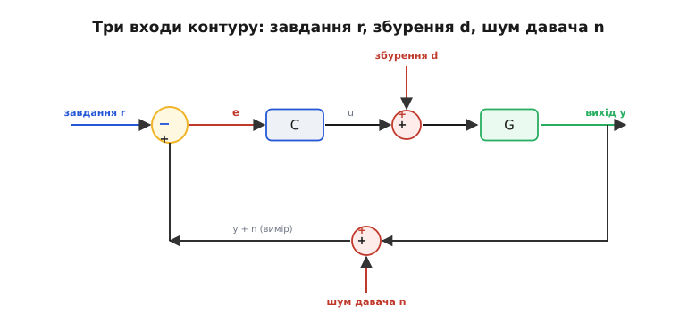
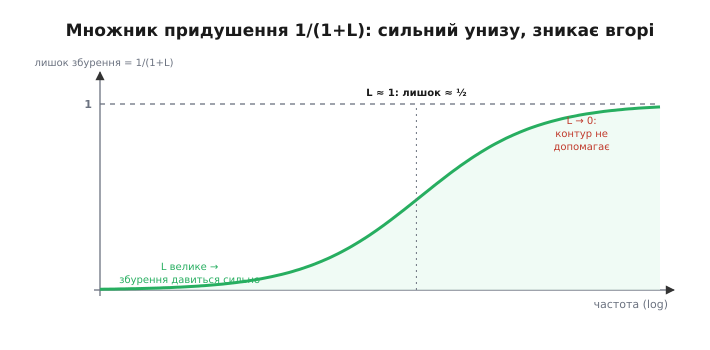
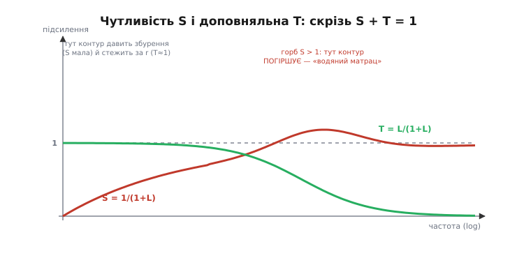
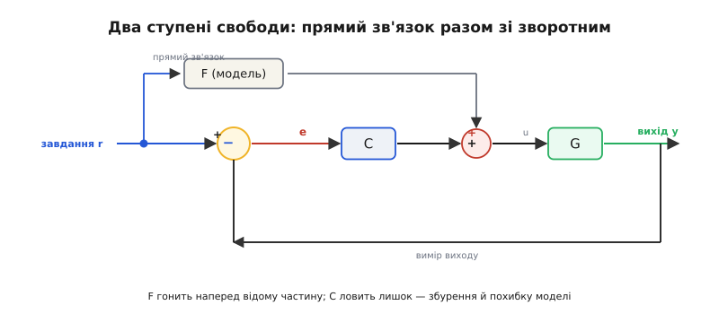

# Зворотний зв'язок: як саме контур перемагає непередбачуваність

Ми вже знаємо головне: є два способи керувати машиною — **наказати й не дивитися** (розімкнено) або **міряти й виправлятися** (замкнено), і вся різниця в тому, чи зважає машина на помилку. Ми бачили, що замкнений контур **тримає** стан попри збурення, що серце його — помилка e = r − y, і що за це доводиться платити давачем, шумом і ризиком розгойдування. Цього досить, щоб упізнати контур будь-де й побудувати простий.

Але «замкнений контур кращий» — це ще не інженерія. Інженерові потрібні **числа**: наскільки саме кращий, у скільки разів придушується збурення, чому саме зворотний зв'язок прощає неточну модель, скільки шуму він за це впускає, і де межа, за якою жоден контур уже не допоможе. У цьому кроці ми розберемо контур **як механізм** — випишемо його одним рядком алгебри, виведемо з нього всі три вигоди й усі три плати, побачимо, чому контур мусить жити в дискретному часі мікроконтролера, і, нарешті, знімемо саму дихотомію «розімкнене проти замкненого»: найкраще керування — це **обидва одразу**.

Нитку ведемо туди, куди підуть наступні кроки. Ми вже дивилися на помилку [як на функцію часу e(t) і на три погляди на неї — висоту, площу, нахил](root:embedded/calculus-for-pid), з яких складається ПІД. Тут ми подивимось на той самий контур **збоку від часу** — як на перетворювач, що бере входи (завдання, збурення, шум) і робить із них вихід, — і саме ця точка зору пояснить, чому [пропорційна складова лишає сталий зсув](root:embedded/proportional-control), чому [інтеграл його прибирає повністю](root:embedded/integral-control), і чому [занадто сильний контур розгойдується](root:embedded/loop-stability). Усі три відповіді вже приховані в одному дробі, який ми зараз виведемо.

## Контур як одна дія: L, S і T

Почнімо з чесного зображення контуру — з усіма трьома входами, що в нього насправді б'ють. Досі ми малювали лише завдання r. Але в реальний контур входить ще двоє непроханих гостей: **збурення** d (вітер, ухил, зміна навантаження — усе, що штовхає **об'єкт** повз волю регулятора) і **шум давача** n (тремтіння виміру, що підмішується до того, що регулятор **бачить**). Ці троє входять у контур у **різних місцях** — і саме тому діють на вихід **по-різному**. Розібратися, як саме, — і є вся суть.


*Три входи справжнього контуру. Завдання r входить у суматор помилки; збурення d додається просто до впливу, перед об'єктом G; шум давача n підмішується до виміряного виходу в зворотному шляху. Три різні точки входу — три різні шляхи до виходу y, і кожен доведеться порахувати окремо.*

Щоб порахувати, домовмося про мінімальну мову. Кожен блок контуру перетворює свій вхід на вихід — множить його на якийсь «коефіцієнт передачі». У регулятора цей коефіцієнт назвемо **C** (від *controller*), в об'єкта — **G** (від *plant*, але літеру беруть G, бо P зайнято під пропорційну складову). Поки що думайте про C і G просто як про числа — «у скільки разів блок підсилює те, що в нього входить». Пізніше ми побачимо, що насправді це не сталі числа, а величини, залежні від частоти, — і саме тут криється вся драма стійкості; але для першого виведення сталих чисел досить.

Найважливіша величина в усьому керуванні — **підсилення петлі** (англ. *loop gain*), добуток усіх блоків уздовж кола:

```
 L = C · G
```

Це «у скільки разів сигнал виросте, обійшовши все коло»: через регулятор, через об'єкт, і назад через давач (давач тут вважаємо ідеальним, з коефіцієнтом 1; його неідеальність додамо окремо). L — головний герой; майже все про контур читається з нього.

Тепер випишемо вихід. Слідкуймо за сигналами. Вимір, який бачить регулятор, — це y плюс шум: (y + n). Помилка — завдання мінус вимір: e = r − (y + n). Регулятор робить із помилки вплив: C·e. До впливу додається збурення: C·e + d. Об'єкт перетворює це на вихід: y = G·(C·e + d). Підставмо e й розкриймо:

```
 y = G·(C·(r − y − n) + d)
 y = G·C·r − G·C·y − G·C·n + G·d
 y + G·C·y = G·C·r − G·C·n + G·d
 y·(1 + G·C) = G·C·r − G·C·n + G·d
```

Поділимо на (1 + G·C) = (1 + L) і згрупуємо кожен вхід окремо:

```
        L            L              G
 y = ────── · r  −  ────── · n  +  ────── · d
      1 + L          1 + L          1 + L
        └─T─┘        └─T─┘          └─G·S─┘
```

Ось воно — увесь контур в одному рядку. І в ньому проступають **два дроби**, що керують геть усім:

```
        L                    1
 T = ──────      S = ──────────────
      1 + L            1 + L
```

**T** звуть **доповняльною чутливістю** (англ. *complementary sensitivity*), **S** — просто **чутливістю** (англ. *sensitivity function*; «чутливість» — бо, як побачимо, вона міряє, наскільки вихід чутливий до змін об'єкта). Придивіться до формули виходу: завдання r приходить на вихід через **T**, шум давача n — теж через **T** (з мінусом), а збурення d — через **G·S**. Три входи, два дроби. І між цими дробами є тотожність, яку варто вибити в камені:

```
        L         1        L + 1
 S + T = ──── + ──── = ──────── = 1
        1+L      1+L      1 + L

 ⟹  S + T = 1   (завжди, на будь-якій частоті)
```

> 🔧 **Навіщо це.** Тотожність S + T = 1 — це не математична дрібничка, а **закон збереження**, що керує кожним компромісом у керуванні. S каже, наскільки контур **давить** збурення й похибку моделі; T каже, наскільки він **стежить** за завданням і **впускає** шум давача. Оскільки їхня сума завжди рівно 1, ви **не можете** зробити обидва малими водночас: тиснути збурення (мала S) означає впускати шум (велика T), і навпаки. Кожне налаштування регулятора — це рух по цій прямій S + T = 1. Хто це усвідомив, той більше не сподівається на «ідеальний» контур без плати — він свідомо **вибирає**, де на цій прямій стати.

Зупинімося на тому, що ми щойно зробили, бо це головний зсув думки всього кроку. У базовій версії контур був **послідовністю дій у часі**: виміряй, відніми, вплинь, повтори. Тут ми подивилися на нього **як на єдине перетворення**: машину, що бере три входи й видає один вихід за фіксованим правилом. Обидві картини правдиві — це той самий контур, — але друга дає те, чого перша не могла: **числа наперед**. Не крутячи жодного гвинта, ми вже можемо сказати, що зробить контур із будь-яким збуренням і будь-якою неточністю. До цього ми й переходимо.

## Чому контур давить збурення: множник 1/(1+L)

Візьмімо найголовнішу вигоду зворотного зв'язку — придушення збурень — і **порахуймо** її. З виведеного рядка видно, що збурення d приходить на вихід через дріб G/(1+L) = G·S. Порівняймо два світи.

**Без зворотного зв'язку** (розімкнено, C діє наосліп) збурення d, додане до впливу, проходить крізь об'єкт як є: його внесок у вихід — просто G·d. Контуру немає, придушувати нема чому.

**Зі зворотним зв'язком** той самий d приходить на вихід уже поділеним: G·d/(1+L). Різниця — рівно в множнику **1/(1+L) = S**. Оце і є, в одному числі, вся сила зворотного зв'язку проти збурень: **контур послаблює вплив збурення на вихід рівно в (1+L) разів**.

Механізм за цим числом — той самий, що ми бачили в прикладі з круїз-контролем на пагорбі, тільки тепер із коефіцієнтом. Збурення штовхає вихід; давач це помічає; помилка росте; регулятор через L відповідає **проти** штовхання; і що більше L, то більшу частку збурення регулятор «з'їдає», перш ніж воно докотиться до виходу. У границі величезного L множник 1/(1+L) прямує до нуля — збурення придушується майже нанівець.

**Придушення просідання круїз-контролю.** Нехай на підйомі збурення (додатковий опір) саме по собі просаджувало б швидкість на Δv = 15 км/год (це і є G·d — реакція розімкненої машини). Порахуймо, що лишиться при різному підсиленні петлі:

```
 просідання без контуру:  G·d = 15 км/год

 L = 4   →  лишок = 15/(1+4)  = 3.0 км/год   (контур з'їв 4/5)
 L = 9   →  лишок = 15/(1+9)  = 1.5 км/год   (з'їв 9/10)
 L = 49  →  лишок = 15/(1+49) = 0.3 км/год   (з'їв майже все)
```

Що більше L, то менше збурення долітає до виходу — рівно в (1+L) разів. Це і є кількісний бік того, що ми раніше описували словами «замкнена система вертається до завдання».

Тепер найважливіше уточнення, без якого ця формула бреше. Ми писали L як стале число — та насправді підсилення петлі **залежить від частоти збурення**. Повільне, майже стале збурення (машина повзе на довгий пологий підйом) контур бачить чудово: на низьких частотах L величезне, тож 1/(1+L) крихітне — таке збурення давиться майже повністю. А от **швидке** збурення (різкий поштовх, вибоїна) контур не встигає відпрацювати: на високих частотах L падає до нуля, множник 1/(1+L) прямує до **одиниці** — і швидке збурення проходить на вихід **майже неослабленим**, наче контуру й немає.


*У скільки разів контур послаблює збурення, залежно від того, наскільки воно швидке. Ліворуч (повільні збурення) L велике — лишок 1/(1+L) крихітний, контур давить майже все. На частоті, де L ≈ 1, лишається приблизно половина. Праворуч (швидкі збурення) L падає до нуля — контур уже не встигає, і збурення проходить майже неослабленим. Зворотний зв'язок бореться зі збуренням лише там, де встигає.*

Звідси практичний висновок, що рятує від хибних сподівань: **зворотний зв'язок придушує лише ті збурення, що повільніші за швидкодію контуру**. Хочете давити швидші збурення — треба піднімати L на вищих частотах, тобто робити контур **швидшим** (частіший цикл, різкіший регулятор). Але, як ми побачимо далі й як докладно розбирає [запас стійкості](root:embedded/loop-stability), піднімати L безмежно не можна: рано чи пізно контур розгойдається. Тож «наскільки добре давимо збурення» і «наскільки близько до розгойдування» — це той самий регулятор L, потягнутий у два боки.

## Чому контур прощає неточну модель

Друга велика вигода зворотного зв'язку, згадана в базовій версії лише словами, — він **прощає похибку моделі**. Двигун трохи слабший за паспорт, деталь на межі допуску, давач підбрехує, батарея просіла — і розімкнена система всі ці розбіжності накопичує, бо ні з чим звіритися, а замкнена їх «поглинає». Тепер виведемо, **наскільки** поглинає, — і побачимо, що за це відповідає та сама S.

Питання поставимо точно: якщо об'єкт G змінився на маленьку дещицю (постарів, нагрівся, деталь інша) — наскільки зміниться те, як контур стежить за завданням, тобто наскільки зміниться T? Формально нас цікавить **відносна** зміна: на скільки відсотків зміниться T, якщо G зміниться на один відсоток.

Візьмімо T = L/(1+L) = CG/(1+CG) і подивимось, як T реагує на маленьку зміну G. Для тих, хто пам'ятає похідні (а ми їх щойно [освіжили для ПІД](root:embedded/calculus-for-pid)), це похідна dT/dG; для решти досить результату й перевірки на числах. Продиференціюймо T по G (C вважаємо сталим):

```
        CG                dT        C·(1+CG) − CG·C        C
 T = ────────   ⟹   ──── = ──────────────────── = ──────────
      1 + CG              dG          (1+CG)²          (1+CG)²
```

А тепер перейдімо до **відносних** змін — поділимо відносну зміну T на відносну зміну G:

```
 dT/T     dT   G      C        G·(1+CG)         1
 ──── = ──── · ─ = ──────── · ────────── = ──────── = S
 dG/G     dG   T    (1+CG)²       CG          1 + CG
```

Результат вражаюче чистий:

```
 dT/T
 ──── = S = 1/(1+L)
 dG/G
```

**Відносна похибка в поведінці контуру дорівнює відносній похибці об'єкта, помноженій на S.** Оскільки при доброму контурі S мала (L велике), груба похибка об'єкта дає лише крихітну похибку виходу. Порівняймо знову з розімкненою системою: там вихід — це просто G, тож 1 % похибки в G дає рівно 1 % похибки виходу (S тут дорівнює 1, зворотного зв'язку немає). Замкнений контур зменшує цей вплив у (1+L) разів.

**Двигун, слабший за паспорт.** Нехай реальний двигун дає на 20 % менше моменту, ніж закладено в модель, — груба, цілком життєва похибка (Δ G/G = 0.20).

```
 Розімкнено:  похибка виходу = похибка об'єкта = 20 %.
   (наказали «стільки-то оборотів» — вийшло на 20 % менше, і ніхто не знає)

 Замкнено, L = 19:  S = 1/(1+19) = 0.05
   похибка виходу = S · 20 % = 0.05 · 20 % = 1 %.
   (двадцятивідсоткову ваду об'єкта контур стиснув до одного відсотка)
```

Ось чому та сама плата ПІД-коефіцієнтів літає на десятках трохи різних апаратів, чому серійні прилади з розкидом деталей усі тримають норму, і чому взагалі можливо керувати об'єктом, якого ти **не знаєш точно** (а точно не знаєш ніколи). Зворотний зв'язок обертає грубе, приблизне знання об'єкта на точну поведінку виходу — і саме S каже, у скільки разів.

> 🔧 **Навіщо це.** Це виведення пояснює найпрактичнішу річ у щоденній роботі: **не марнуйте тижні на точну модель об'єкта, якщо контур має пристойне підсилення**. Похибка моделі входить у вихід через S — при L = 19 груба двадцятивідсоткова помилка стискається до одного відсотка. Тому в прикладному керуванні спершу замикають контур і піднімають підсилення до розумного (з оком на стійкість), а не полюють за третім знаком у паспорті двигуна. Це ж і застереження: **розімкнене** керування, навпаки, вимагає точної моделі — там S = 1, і кожен відсоток похибки об'єкта йде прямо у вихід. Хочете керувати наосліп — платіть точністю моделі; не хочете платити — замикайте контур.

## Ціна, порахована: шум і «водяний матрац»

Базова версія назвала три плати за зворотний зв'язок — давач, ризик розгойдування, підсилення шуму. Перші дві ми чіпатимемо далі й у [запасі стійкості](root:embedded/loop-stability); тут розберемо третю **кількісно** — і побачимо, що вона не окрема біда, а зворотний бік самої тотожності S + T = 1.

Повернімося до виведеного рядка виходу. Шум давача n приходить на вихід через **−T**. Ось і вся кількісна правда про шум: **контур переносить шум давача на вихід із коефіцієнтом T**. А тепер згадаймо, чого ми хотіли від T: щоб контур добре стежив за завданням, T має бути ≈ 1. Але якщо T ≈ 1, то й шум переноситься на вихід майже повністю! Виходить пастка, від якої нікуди дітися: **добре стеження за завданням і придушення шуму давача — це одна й та сама величина T, потягнута в два боки.**

Складімо це з попереднім. Придушення збурення хоче **малої S**. Придушення шуму хоче **малої T**. А S + T = 1 забороняє зробити обидва малими. Ось повна картина трьох сил в одному законі:

```
 мала S  →  давимо збурення й похибку моделі   ┐
                                                ├ але S + T = 1 !
 мала T  →  давимо шум давача                   ┘

 не можна мати обидва малими: чим менша одна, тим ближча до 1 друга
```

Порятунок від цієї безвиході — **частота**. Збурення й похибка моделі здебільшого **повільні** (вітер, ухил, старіння, зсув центру ваги), а шум давача здебільшого **швидкий** (високочастотне тремтіння). Тож розумний контур робить так: на **низьких** частотах тримає S малою (велике L — давимо повільні збурення), а на **високих** — малою тримає T (мале L — не впускаємо швидкий шум). S + T = 1 при цьому не порушено ніде: там, де S мала, T ≈ 1, і навпаки; ми просто **розводимо** ці режими по частоті. Саме тому [фільтр на вимірі](root:embedded/choosing-a-filter) — не окрема прикраса, а частина контуру: він завалює високі частоти, допомагаючи тримати T (а з ним і шум) малим там, де завдання все одно немає.


*Дві головні криві контуру. Ліворуч (повільні процеси) S мала, а T ≈ 1: контур давить збурення й точно стежить за завданням. Праворуч (швидкі процеси) навпаки: T мала — контур не впускає шум давача, ціною того, що там уже не стежить. Скрізь S + T = 1. І горб S над одиницею посередині: там, де контур «звільняє» чутливість, вона неминуче стає більшою за одиницю — контур на тих частотах збурення не давить, а трохи **підсилює**.*

І тут постає найтонший, найнесподіваніший факт усієї теорії — той горб S над одиницею на малюнку. Здавалося б, можна ж просто зробити S малою на всіх потрібних частотах, а на решті — рівно одиницею (не заважає, але й не шкодить). Виявляється, **не можна**. Є суворий закон збереження, доведений Гендріком Боде ще в 1940-х: для типового стійкого контуру площа, на яку ви **придушили** чутливість на одних частотах, мусить рівно **дорівнювати** площі, на яку ви її **підняли** на інших. Формально сума логарифма S по всіх частотах фіксована (нуль для гарного випадку):

```
 ∫ ln|S(ω)| dω = 0     (для стійкого контуру, за м'яких умов)
   0..∞
```

Це і є **ефект водяного матраца** (англ. *waterbed effect*): натиснули S донизу тут — вона обов'язково випнулася вгору **над одиницею** десь там. А S > 1 означає, що на тих частотах контур збурення не давить, а **підсилює** — робить гірше, ніж якби його не було. Ви не можете прибрати цей горб — тільки **пересунути** його туди, де збурень все одно немає, або **розмазати** ширше й нижче. [Повне пояснення інтеграла Боде й того, чому чутливість неможливо придушити скрізь одразу](root:embedded/open-vs-closed-loop/math-sensitivity-waterbed.md), варте окремого розгляду; тут важливий сам урок.

> 🔧 **Навіщо це.** Ефект водяного матраца — це чому «ідеальний» контур неможливий у принципі, а не через лінощі інженера. Коли ви тиснете регулятор, щоб краще давити збурення в одному діапазоні, ви **гарантовано** робите систему чутливішою в іншому — часто там з'являється той самий горб, де контур починає **підсилювати** збурення й шум. Практичний хід: не намагайтеся зробити добре скрізь, а **вирішіть, де вам збурення справді заважають** (зазвичай на низьких частотах), і свідомо «виштовхніть» горб чутливості туди, де їх немає (на високі частоти, за смугою корисного сигналу). Керування — це не усунення компромісу, а **вибір, де за нього заплатити**.

## Постійне збурення: чому саме інтеграл дає точний нуль

Один окремий випадок S настільки важливий, що варто розібрати його наперед — він пояснить вроджену ваду [П-регулятора](root:embedded/proportional-control) і те, чому її лікує [інтеграл](root:embedded/integral-control), ще до того, як ми візьмемося за ці кроки.

Спитаймо: наскільки контур давить **зовсім повільне**, по суті **стале** збурення (постійний перекіс, стала вага, незмінний витік тепла) — тобто чому дорівнює S на нульовій частоті, S(0)? З формули S = 1/(1+L) видно: усе залежить від того, чому дорівнює підсилення петлі на нульовій частоті, L(0), тобто наскільки сильно контур реагує на сталу помилку.

Тут два випадки, і вони прямо відповідають двом регуляторам.

**Скінченне L(0)** — так поводиться чистий пропорційний регулятор: на сталу помилку e він дає скінченний вплив Kp·e, тож L(0) = Kp·G(0) — велике, але скінченне число. Тоді:

```
 S(0) = 1/(1 + L(0)) — мале, але НЕ нуль.
```

Мале ненульове S(0) означає: стале збурення давиться сильно, але **не до кінця** — лишається крихітний слід. Це і є **сталий зсув** П-регулятора, виведений тут із загальної формули: раз S(0) ≠ 0, стале збурення (а рівно ж і стала команда) завжди лишає ненульову похибку. Піднімати Kp — зменшувати S(0), — але скінченним Kp у нуль її не загнати.

**Нескінченне L(0)** — так поводиться регулятор з інтегратором: інтеграл на будь-яку ненульову сталу помилку **накопичує вплив без межі**, тобто його підсилення на нульовій частоті нескінченне, L(0) → ∞. Тоді:

```
 S(0) = 1/(1 + ∞) = 0   →   стале збурення давиться ПОВНІСТЮ.
```

S(0) = 0 означає: жодне стале збурення й жодна стала команда не лишають похибки — вихід сідає точно на завдання. Ось структурна причина, чому [інтегральна складова](root:embedded/integral-control) прибирає сталий зсув **дощенту**, а пропорційна — ні: інтегратор робить L(0) нескінченним, а отже S(0) точним нулем. Ту саму думку [калькулюсний крок](root:embedded/calculus-for-pid) подав із боку часу («інтеграл усе додає, поки є хоч крапля помилки»); тут вона ж, із боку частоти, — і обидві кажуть одне.

Зверніть увагу, що ми жодного разу не написали, **який** саме регулятор усередині. Уся ця розмова — про L і S, тобто про **структуру** контуру, а не про конкретне правило. Це і є сила погляду «контур як алгебра»: вроджений зсув P і точність I видно **до** того, як ми взагалі відкрили, що P і I роблять. Наступні кроки заповнять «як саме»; каркас «чому» вже стоїть.

## Контур живе в дискретному часі

Досі ми міркували так, наче контур діє **неперервно** — міряє й виправляє щомиті. Але на мікроконтролері це не так, і різниця має практичні наслідки, які прямо готують [запас стійкості](root:embedded/loop-stability). Реальний контур у прошивці — це не неперервний потік, а **послідовність тактів**: раз на період T прокидається таймер, і регулятор робить рівно один крок.

Придивімося, з чого складається один такт і де в ньому ховається затримка.

![Дискретний такт: миттєвий вимір y[k], брусок обчислення Δ одразу після, тоді сходинка впливу u, що тримається до наступного такту](img/discrete-timing.svg)
*Один цикл керування в часі. У момент kT давач дає вимір y[k] (крапка). Далі йде обчислення регулятора — воно займає час Δ (сірий брусок). Тоді нове значення впливу u виставляється і **тримається сходинкою** до наступного такту (k+1)T — виконавчий орган не міняється між тактами. Через це кожне виправлення діє не миттєво, а із затримкою — і ця затримка складається із запізненням об'єкта в спільну петльову затримку.*

Розкладімо цикл на три частини, бо кожна вносить свою затримку.

**Вибірка** (англ. *sampling*). Давач опитують не безперервно, а раз на такт. Усе, що сталося між тактами, контур **не бачить** до наступної вибірки. Уже це — джерело запізнення: у середньому подія чекає пів такту, поки її помітять.

**Обчислення** (затримка Δ). Порахувати регулятор — прочитати давач, відняти, застосувати правило, записати вплив — займає час. Між моментом вибірки й моментом, коли новий вплив реально виставлено, минає Δ. Це **чиста затримка** в петлі — той самий «мертвий час», що особливо небезпечний для стійкості.

**Утримання** (англ. *zero-order hold*, утримання нульового порядку). Виставлений вплив **не міняється** до наступного такту — виконавчий орган тримає останнє значення сходинкою. Це теж вносить затримку: у середньому вплив «застарілий» на пів такту, бо весь такт діє значення, пораховане на його початку.

Складімо: між тим, як система відхилилася, і тим, як виправлення реально подіяло, минає приблизно **пів такту (вибірка) + Δ (обчислення) + пів такту (утримання)**, тобто порядку одного такту T плюс час обчислень. Ось чому **частота циклу** — не другорядна деталь, а частина конструкції контуру: що рідший цикл (більше T), то більша затримка в петлі, а затримка, як докладно показує [запас стійкості](root:embedded/loop-stability), з'їдає запас по фазі й наближає розгойдування. І ось чому важлива не лише частота, а й **рівномірність** тактів: якщо T «плаває» (джитер), затримка теж плаває, і контур стає непередбачуваним.

**Скелет дискретного кроку керування.** Так виглядає один такт у прошивці — той самий цикл «виміряй → порахуй → вплинь», але явно прив'язаний до періоду:

```c
// викликається таймером рівно раз на dt секунд (напр. 500 Гц → dt = 0.002)
void control_tick(void) {
    float y = read_sensor();          // вибірка: миттєвий вимір виходу
    float e = setpoint - y;           // помилка e = r − y

    float u = controller_step(e);     // обчислення (займає Δ): правило регулятора
                                      // — далі це стане P, потім PI, потім PID

    set_actuator(u);                  // утримання: u діятиме цілий такт dt
}
```

Три рядки тіла — це рівно вибірка, обчислення й утримання з малюнка. Поки регулятор усередині `controller_step` простий, Δ крихітне; коли туди додасться фільтр, оцінка орієнтації, кілька контурів — Δ росте, і його доводиться враховувати як реальну затримку. Головне, що варто винести: **дискретність — не наближення до «справжнього» неперервного контуру, а сама природа контуру в прошивці**, і затримка від неї — не завада, а те, з чим від початку рахуються.

> 🔧 **Навіщо це.** Перше число, яке ви задаєте в будь-якому цифровому контурі, — **частота циклу**, і задавати її треба свідомо. Груба практика: контур має крутитися разів у 10–20 частіше за найшвидший процес, який ви хочете тримати (найшвидше збурення чи найвищу частоту, де вам потрібне придушення). Рідший цикл — і затримка з'їсть запас стійкості; надміру частий — і ви марнуєте такти процесора та впускаєте більше шуму. І тримайте такт **рівномірним**: контур, що прокидається то через 2, то через 5 мс, поводиться так, наче в ньому плаваюча затримка, — а плаваючу затримку ні порахувати, ні скомпенсувати. Стабільний період важливіший за високий.

## Межі: чого не зможе жоден контур

Погляд «контур як перетворювач» мимоволі створює ілюзію всемогутності: збільш L — і дави збурення скільки завгодно, стискай похибку моделі до нуля. Насправді контур упирається в **тверді межі**, за якими вся гарна лінійна алгебра ламається. Знати ці межі так само важливо, як знати вигоди.

**Виконавчий орган скінченний.** Формула u = C·e не знає слова «неможливо», а мотор знає: у нього є максимальні оберти, у керма — упор, у нагрівача — повна потужність. Коли обчислений вплив вискакує за цю межу, реально подається лише стеля — і контур на цей час **фактично розмикається**: хоч би яку велику помилку показував давач, більшого впливу вже не буде, апарат летить «як вийде». Це **насичення** (англ. *saturation*), і воно підступне вдвічі: по-перше, уся наша алгебра S і T перестає діяти (вона лінійна, а насичення — ні); по-друге, для регулятора з інтегратором насичення породжує окрему хворобу — [накручування інтеграла (windup)](root:embedded/integral-control), коли накопичувач, не бачачи ефекту від своїх команд, розганяється до абсурдних значень і потім довго «відходить». Тому контур завжди проєктують із оком на межу виконавчого органу, а не так, наче він здатен на будь-яку дію.

**Давач скінченний.** Уся точність контуру впирається в те, що він **бачить**: контур жене до нуля не справжню помилку, а **виміряну**. Якщо давач має власний зсув, його контур сумлінно **впише** у вихід (жени вихід так, щоб брехливий вимір показав завдання, — і справжній вихід поїде на величину зсуву). Якщо давач повільний — має власну смугу, — то на високих частотах контур працює зі **застарілим** виміром, що додає ще затримки. І якщо вимір **квантований** (АЦП має скінченний крок), контур не розрізняє відхилень, дрібніших за крок, — нижче цього порога помилка для нього просто нуль. Жоден регулятор не буває точнішим за свій давач; звідси й правило, що якість контуру починається з якості виміру, а не коефіцієнтів.

**Об'єкт має власну фізику.** Контур керує об'єктом, але не скасовує його законів. Масу не розігнати миттєво — інерція ставить стелю швидкодії. Є об'єкти з **чистою затримкою** (тепло йде трубою, команда летить каналом) — їх найважче тримати, бо затримка невблаганно накручує фазу. А деякі об'єкти в перший момент ідуть **не туди** (літак, задираючи ніс, спершу трохи просідає) — і такий об'єкт ставить принципову межу на швидкодію контуру, яку не обійти жодним підсиленням. Це вже глибша тема, але сам урок простий: **контур працює в межах, що їх диктує об'єкт**, і найшвидший можливий контур обмежений не регулятором, а фізикою того, чим він керує.

Спільне в усіх трьох межах одне: зворотний зв'язок — потужний, але не чарівний. Він **перерозподіляє** недосконалість (з об'єкта — на давач, зі сталої точності — на швидкодію, з однієї частоти — на іншу), а не знищує її. Ясно бачити ці межі — значить не гнатися за тим, чого контур дати не може, і не звинувачувати коефіцієнти в тому, що насправді впирається в мотор, давач чи саму фізику об'єкта.

## Знімаємо дихотомію: прямий зв'язок разом зі зворотним

Ми весь час протиставляли розімкнене замкненому, наче доводиться **вибирати** одне. Настав час зняти цю дихотомію, бо найкраще прикладне керування — це майже завжди **обидва одразу**. Ідея настільки ж проста, наскільки й потужна, і вона природно виростає з усього, що ми вивели.

Пригадаймо два уроки. Перший: розімкнене керування **дешеве й швидке**, але вимагає точної моделі й безпорадне проти непередбаченого. Другий: замкнене керування **прощає** неточність і давить збурення, але лише в межах своєї швидкодії й ціною шуму та ризику розгойдування. А тепер ключове спостереження: **у типовій задачі частина роботи цілком передбачувана, а частина — ні.** Передбачувану частину гріх ганяти через повільний зворотний зв'язок; непередбачувану неможливо взяти розімкнено. То візьмімо кожну частину тим інструментом, що їй пасує.

Так народжується **прямий зв'язок разом зі зворотним** (англ. *feedforward + feedback*). Прямий зв'язок (feedforward) — це розімкнена гілка: знаючи завдання й **модель** об'єкта, вона наперед обчислює той вплив, що **мав би** дати потрібний вихід, і подає його одразу, не чекаючи помилки. А зворотний зв'язок робить те, що вміє найкраще, — **ловить лишок**: усе, що прямий зв'язок не вгадав (похибку моделі й непередбачені збурення). Формула виходить проста: повний вплив — це сума двох гілок.

```
 u = u_ff + u_fb
     └─────┘  └─────┘
   feedforward  feedback
  (модель, наперед)  (виправлення лишку)
```


*Керування у два ступені свободи. Завдання r іде двома шляхами. Верхній — прямий зв'язок F: за моделлю об'єкта він одразу рахує потрібний вплив і подає його наперед. Нижній — звичний зворотний контур C, що діє на помилку. Їхні виходи додаються. F робить основну, передбачувану роботу швидко й без затримки контуру; C лишається легша задача — прибрати те, що F не вгадав: похибку моделі й збурення.*

Чому це краще за будь-яку з гілок поодинці — видно одразу з нашої алгебри. Прямий зв'язок б'є по завданню **без затримки контуру**: він не чекає, поки з'явиться помилка, тож апарат кидається виконувати нову команду вмить, а не повзе до неї, як чистий зворотний зв'язок. А те, що прямий зв'язок неминуче наплутає (модель же неточна!), підбирає зворотний — і підбирає добре, бо йому лишається **маленький** лишок, а не вся задача. Виходить розподіл праці, у якому кожен робить своє: **feedforward — за швидкість і основну точність, feedback — за придушення того, чого не передбачиш.**

Найелегантніше тут те, що дві гілки можна **налаштовувати нарізно** — саме за це схему й звуть **керуванням у два ступені свободи** (англ. *two degrees of freedom*): один «ступінь» відповідає за реакцію на завдання (його задає прямий зв'язок), другий — за придушення збурень і стійкість (його задає зворотний). У чистому зворотному контурі ці дві речі намертво зв'язані одним регулятором: зробив швидшу реакцію на команду — заодно зачепив і придушення збурень, і запас стійкості. Розділивши їх, ми можемо, скажімо, зробити реакцію на завдання **плавною й без перельоту** (через прямий зв'язок), а придушення збурень — **агресивним** (через зворотний), — те, чого одним ПІД досягти важко. Ідею керування у два ступені свободи запропонував і розробив Айзек Горовіц (*Isaac Horowitz*) 1963 року в своїй теорії синтезу зворотного зв'язку — усталений, добре задокументований внесок.

**Прямий зв'язок для нагрівача.** Нехай нагрівач тримає воду на завданні r, а ми з простої моделі знаємо: щоб просто **утримувати** температуру r проти сталого витоку тепла, потрібна потужність приблизно `k_loss · (r − T_room)`. Це і є feedforward — його можна подати наперед, не чекаючи помилки:

```c
void control_tick(void) {
    float y = read_temp();                 // вибірка виміру
    float e = setpoint - y;                // помилка

    // прямий зв'язок: потужність проти витоку тепла — з моделі, наперед
    float u_ff = k_loss * (setpoint - T_room);

    // зворотний зв'язок: ловить лишок — похибку моделі й збурення (протяг, кришка)
    float u_fb = controller_step(e);       // P, PI чи PID

    set_heater(clampf(u_ff + u_fb, 0.0f, U_MAX));  // сума двох гілок, з межею
}
```

Прямий зв'язок бере на себе основну, передбачувану роботу — фонову потужність проти витоку, — і бере її **вмить**, щойно змінили завдання. Зворотному лишається дрібниця: підправити на те, що модель `k_loss` не точна, та на непередбачене (хтось відкрив кришку, потяг з вікна). Помилка, з якою працює зворотна гілка, тепер від початку мала — а отже, і зсув менший, і накручування інтеграла слабше, і розгойдування далі. [Повний скелет прошивки з двома гілками, узгодженням їхніх меж і захистом від windup](root:embedded/open-vs-closed-loop/proj-feedforward-plus-feedback.md) варто розібрати окремо; тут важлива сама архітектура.

> 🔧 **Навіщо це.** Перш ніж вигризати останні відсотки з ПІД, спитайте: **чи є в задачі передбачувана частина, яку можна порахувати наперед?** Майже завжди є — фонова потужність проти втрат, тяга проти ваги на дроні, момент проти відомого тертя, груба траєкторія за відомою динамікою. Винесіть її в прямий зв'язок — і зворотному лишиться легша, чистіша задача, з меншою помилкою, меншим зсувом і більшим запасом стійкості. Це найдешевший спосіб різко поліпшити контур: не крутити коефіцієнти сильніше, а **зняти з зворотного зв'язку роботу, яку той і не мусив робити**. «Розімкнене проти замкненого» — хибна дилема; правильна відповідь — розумно поєднати обидва.

## Що ми тепер бачимо в контурі

Ми почали з простої дихотомії — наказати наосліп чи міряти й виправлятися — і розібрали її до механізму. Тепер контур для нас — не послідовність дій, а **єдине перетворення** з трьома входами й одним рядком алгебри, у якому вже записано геть усе.

Три вигоди зворотного зв'язку виявилися трьома проявами однієї величини — чутливості S = 1/(1+L): збурення давиться в (1+L) разів, похибка моделі стискається в (1+L) разів, а стале збурення при інтеграторі гине зовсім, бо S(0) = 0. Три плати — теж не випадковий набір, а одна тотожність S + T = 1: тиснеш збурення (мала S) — впускаєш шум (велика T), і жоден трюк не дасть обох малими одразу; ба більше, водяний матрац Боде забороняє навіть просто прибрати чутливість скрізь — придушив тут, випнув над одиницею там. Ми побачили, що контур живе в дискретних тактах, і затримка від вибірки, обчислення й утримання — не завада, а вбудована ціна цифрового керування. Побачили тверді межі — насичення, давач, фізику об'єкта, — за якими зворотний зв'язок безсилий. І, нарешті, зняли саму дихотомію: найкраще керування бере **обидва** способи, доручаючи передбачуване прямому зв'язку, а непередбачене — зворотному.

Каркас «чому» тепер стоїть повністю. Лишилося наповнити його «як саме» — вибрати конкретне правило, яким перетворювати помилку на вплив. Найпростіше й найприродніше правило — діяти [пропорційно самій помилці](root:embedded/proportional-control); з нього ми й почнемо будувати ПІД, і кожну його рису — зсув, накопичення, передбачення, межу стійкості — уже впізнаємо в S, T і L, які щойно вивели.

---
