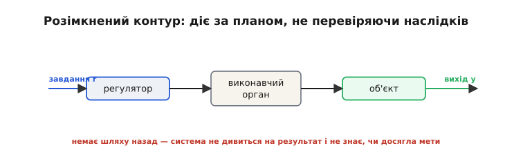
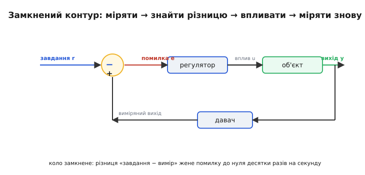
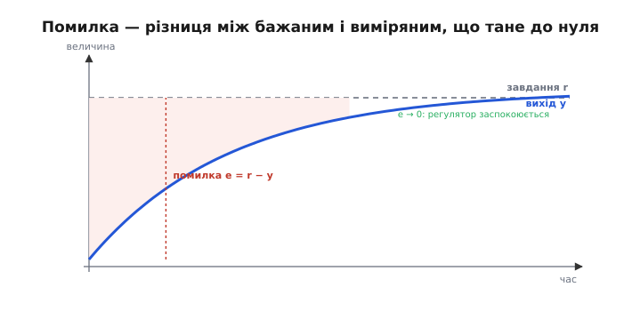
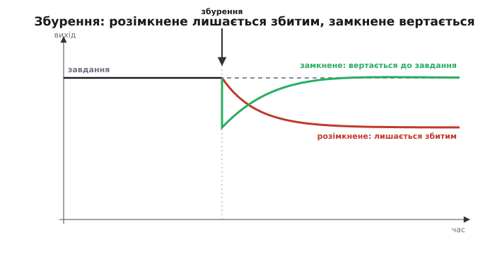
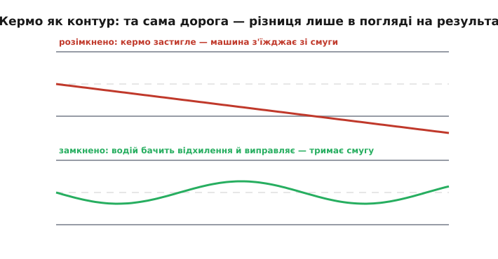
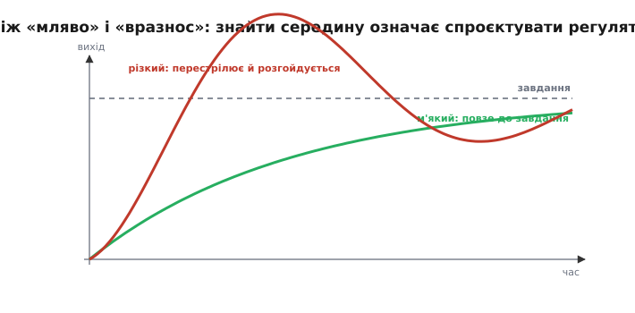

# Зворотний зв'язок: розімкнене проти замкненого керування

Тримати машину в потрібному стані — хай то температура, швидкість чи кут нахилу — означає змусити її **самій повертатися** до бажаного, хоч би що її збивало. І тут є рівно два способи керувати будь-якою машиною — від нагрівача до дрона. Перший — **наказати й не дивитися** на результат. Другий — **дивитися на результат і виправлятися**. Уся різниця між ними — в одному: чи зважає машина на **помилку**. Цей крихітний на вигляд вибір визначає, чи працюватиме ваш апарат у реальному, непередбачуваному світі.

### Розімкнене керування: діяти за планом

**Розімкнене** (*open-loop*) керування діє за наперед заданим планом, **не перевіряючи** наслідків. Ви наказуєте виконавчому органу «зроби отак» — і сподіваєтесь, що вийде як треба.


*Завдання → регулятор → виконавчий орган → об'єкт → вихід, і **жодного шляху назад**. Система виконує план, але ніколи не дізнається, чи досягла мети: вона **не дивиться** на свій результат.*

Приклади довкола: мікрохвильовка гріє рівно 30 секунд, байдуже, нагрілася їжа чи ні; кроковому двигуну посилають «на 90°», вірячи, що він туди дійшов; ви наливаєте воду «на три секунди». Поки світ **передбачуваний** і ніщо не заважає, цього досить — і це дешево: не треба ні давача, ні мудрого керування. Розімкнене керування — простий і чесний робочий кінь там, де збурень нема або вони дрібні.

І таких місць більше, ніж здається. 3D-принтер веде голівку кроковими двигунами розімкнено, бо механіка точна й передбачувана; світлофор перемикається за таймером; пральна машина крутить програму, не питаючи, чи чистий одяг. Спільне в них одне: середовище **відкаліброване й стабільне**, тож план надійно дає результат. Розімкнене керування — це ставка на передбачуваність: воно працює чудово, поки світ поводиться так, як ми думали, і провалюється рівно тоді, коли ні.

Та щойно втручається **непередбачене**, розімкнене керування безпорадне. Кроковий двигун під навантаженням може «пропустити» крок — і опиниться не на 90°, а команда цього **не знатиме**. Мікрохвильовка не помітить, що їжа була крижана. Розімкнена система не має способу дізнатися, що пішло не так, бо вона **взагалі не дивиться** на результат. Вона виконує план, а не досягає мети — і це її докорінна вада.

### Замкнене керування: дивитися на результат

**Замкнене** (*closed-loop*) керування робить те, чого бракує розімкненому: **міряє** фактичний результат, **порівнює** з бажаним і діє, щоб **скоротити різницю**. Це і є **зворотний зв'язок**.


*Анатомія замкненого контуру. **Завдання** r мінус виміряний **вихід** y дає **помилку** e. Регулятор перетворює e на **вплив** u, об'єкт відгукується, давач міряє новий вихід — і коло замикається. Знак на вузлі віднімання — «−»: вплив іде **проти** помилки (від'ємний зворотний зв'язок).*

Розберемо складові — вони ті самі в будь-якому контурі. Є **завдання** (*setpoint*, r) — чого ми хочемо: бажаний кут, швидкість, температура. Є **давач**, що міряє фактичний **вихід** y. Їхня різниця — **помилка** e = r − y — каже, наскільки й у який бік ми схибили. **Регулятор** перетворює помилку на **керівний вплив** u, а **виконавчий орган** (мотор, нагрівач) діє ним на **об'єкт** (*plant*). Вихід міняється, давач його знову міряє — і коло замикається. Машина безперервно **підправляє себе**, женучи помилку до нуля.

Важливо, що цей цикл крутиться **безперервно й часто** — десятки чи сотні разів на секунду. Регулятор не діє раз і назавжди: він щомиті заново міряє вихід, рахує свіжу помилку й коригує вплив. По суті, регулятор — це просто **правило**, що перетворює помилку e на вплив u, виконуване знову й знову. Уся хитрість — у тому, **яким** має бути це правило; самої ідеї «міряти й виправляти» для надійного керування ще замало.

Знак тут критичний: вплив завжди спрямований **проти** помилки — це **від'ємний** зворотний зв'язок. Виходить менше, ніж треба, — додати; більше — зменшити. Якби зв'язок був **додатний** (регулятор підсилював би помилку, а не гасив), система розганяла б відхилення й миттю йшла «вразнос». Уся стабільна техніка тримається саме на **від'ємному** зворотному зв'язку.

Замкнені контури оточують нас: термостат тримає температуру, круїз-контроль — швидкість, автопілот — курс, зарядка — напругу, а мультикоптер — кут нахилу. У кожному є та сама п'ятірка: завдання, давач, помилка, регулятор, об'єкт. Опанувавши її раз, ви впізнаватимете контур керування будь-де — і будуватимете власні за тим самим шаблоном, хоч би чим керували.

### Помилка — серце керування

Усе замкнене керування крутиться навколо одного числа — **помилки** e = r − y. Вона — і паливо, і компас регулятора: каже, **наскільки** діяти й у **який** бік.


*Пунктирна — завдання r; синя — фактичний вихід y, що до нього підходить; затінений проміжок між ними — **помилка** e = r − y. Регулятор працює, поки e ≠ 0, і «заспокоюється», коли вихід дотягується до завдання.*

Поки помилка не нуль — регулятор працює, штовхаючи вихід до завдання. Помилка нуль — регулятор «заспокоюється». А весь арсенал регулятора — це, по суті, **різні способи перетворити помилку на дію**: пропорційно [до неї самої](root:embedded/proportional-control), до [її накопиченої суми](root:embedded/integral-control) чи до [швидкості її зміни](root:embedded/derivative-control). Тож e = r − y — головна величина всього керування: усі три складові ПІД — лише різні відповіді на питання «що зробити з цією помилкою».

Кілька слів про саму помилку. Вона має **розмірність** тієї величини, якою керуємо: для температури — у градусах, для швидкості — у км/год, для орієнтації — у градусах кута. І вона **знакова**: e = r − y додатна, коли виходу бракує до завдання, і від'ємна, коли його забагато, — саме знак каже регулятору, у який бік діяти. Для мультикоптера помилка крену — це просто «бажаний кут мінус виміряний», а виміряний кут дає [фільтр оцінки орієнтації](book:algorithms/complementary-filter): додатна помилка — нахилити в один бік, від'ємна — у протилежний. Тут вихід давачів і стає помилкою, з якою працює регулятор.

> 🔧 **Навіщо це.** Першим у будь-якому контурі керування визначте **помилку й її знак**: що таке r, що таке y, і в який бік діє регулятор. Переплутаний знак перетворює рятівний від'ємний зв'язок на згубний додатний — і апарат замість того, щоб триматися, **сам себе розганяє** в аварію. Це та сама пастка зі знаком осей, що й у [фільтрах оцінки орієнтації](book:algorithms/complementary-filter), і ловиться вона тим самим тридцятисекундним тестом: відхиліть вихід рукою й перевірте, що регулятор штовхає його **назад**, а не далі.

### Чому розімкнене ламається: збурення

Чому ж замкнене керування варте зайвого давача й мороки? Через **збурення** (*disturbances*) — усе непередбачене, що збиває вихід: вітер, ухил, зміна навантаження, розряд батареї, виробничий допуск деталі. Розімкнена система їх **не бачить** і тому пропускає; замкнена — **реагує**, бо дивиться на фактичний результат.


*До моменту збурення обидві системи тримають завдання. Зненацька — навантаження (стрілка). Розімкнена (червона) просіла й **так і лишилася** збитою: вона не знає, що схибила. Замкнена (зелена) просіла, **помітила** помилку й **вернула** вихід до завдання. У цьому вся цінність зворотного зв'язку.*

**Приклад (круїз-контроль на пагорбі).** Машина тримає 100 км/год.

```
Розімкнене: газ виставлено на 30 % — рівно стільки треба на рівному.
  Починається підйом (збурення) → швидкість падає до 85 і ТАК І ЛИШАЄТЬСЯ.
  Система не знає, що схибила: газ як був 30 %, так і лишився.

Замкнене:  давач міряє 85 → помилка  e = 100 − 85 = +15 км/год.
  Регулятор додає газу, аж поки швидкість не вернеться до 100 → e → 0.
```

Розімкнене керування виконало план (30 % газу) — і провалило мету (100 км/год). Замкнене проґавило б план, зате досягло мети. У реальному світі, повному збурень і неточностей, важить саме друге — тому майже все, що має надійно **тримати** стан, будують замкненим.

Збурення — не єдина біда розімкненого керування; друга — **похибка моделі**. Навіть без вітру й пагорбів реальна машина ніколи не точно така, як план: двигун трохи слабший за паспорт, деталь — на межі допуску, давач трохи розкалібрувався, акумулятор просів. Розімкнена система всі ці дрібні розбіжності **накопичує**, бо ні з чим звіритися. Замкнена ж їх просто **поглинає**: яка б не була справжня машина, регулятор однаково жене вихід до завдання за фактичним виміром. Тому зворотний зв'язок прощає і збурення, і неточність власної моделі — а це величезна перевага, адже ідеально точної моделі не буває ніколи.

> 🔧 **Навіщо це.** Питайте себе про кожну функцію апарата: **наскільки передбачуване середовище?** Якщо збурень практично нема (рух у точному механізмі, дозування на стенді) — розімкнене керування дешевше й простіше, не ускладнюйте. Якщо ж діють вітер, нахили, змінне навантаження чи розкид деталей (а політ, балансування, тримання курсу — це саме вони) — замкнений контур **обов'язковий**, і витрати на давач окупляться сповна. Вибір «розімкнене чи замкнене» — перше архітектурне рішення в будь-якому керуванні.

### Приклад з кермом

Найнаочніша модель — кермувати авто. **Розімкнено**: виставте кермо під фіксованим кутом і заплющте очі — найменший ухил дороги чи порив вітру поведе машину вбік, і ви з'їдете в кювет, бо не виправляєтесь. **Замкнено**: ви дивитеся на дорогу, бачите відхилення (помилку) і **підкручуєте** кермо проти нього — і тримаєтеся смуги, попри вибоїни й вітер. Водій — це **регулятор у контурі зворотного зв'язку**: очі — давач, кермо — виконавчий орган, смуга — завдання.


*Угорі (розімкнено): кермо застигле — найменше збурення зводить машину зі смуги, і вона не вертається. Унизу (замкнено): водій бачить відхилення й виправляє його, тож машина тримається смуги, лише трохи коливаючись довкола центру. Та сама дорога, та сама машина — різниця тільки в тому, чи дивляться на результат.*

Не випадково саме з кермування (грецьке *kybernētēs* — стерновий) виросли і слово «кібернетика», і вся теорія керування. Жива природа теж уся на зворотному зв'язку: тіло тримає температуру, рівень цукру, рівновагу — це **гомеостаз**, той самий замкнений контур, тільки біологічний. Зворотний зв'язок — не інженерний трюк, а загальний принцип, яким і машини, і організми тримають себе в потрібному стані.

Аналогія з водієм має й повчальний бік: людина-регулятор недосконала. У неї є **затримка** реакції й межі швидкодії — і саме тому відвернена увага (телефон, утома) фактично **розмикає** контур: на ті секунди, поки ви не дивитеся на дорогу, керування стає розімкненим — і машина починає з'їжджати. Аварія від неуважності — це буквально розірваний контур зворотного зв'язку. Та сама затримка обмежує й технічні регулятори: контур, що реагує запізно, легше [розгойдати до втрати стійкості](root:embedded/loop-stability).

### Ціна зворотного зв'язку

Зворотний зв'язок не безкоштовний. По-перше, потрібен **давач** — без виміру немає помилки, немає й замкненого керування, тож якість усього контуру впирається в якість виміру. По-друге — і це найважливіше — замкнений контур можна **зробити нестабільним**. Якщо регулятор реагує надто різко, він перестрілює ціль, тоді перестрілює назад, дедалі сильніше — і система йде «вразнос». Це те саме **хитання**, що мучило парові машини й що його порахували Максвелл і Вишнеградський.


*М'який регулятор (зелений) спокійно підходить до завдання. Надто різкий (червоний) перестрілює, вертається, знову перестрілює — і **розгойдується**. Між «мляво» і «вразнос» лежить золота середина — і знайти її означає **спроєктувати** регулятор.*

Ось чому замало просто «діяти проти помилки» — треба діяти **правильно дозовано**. Занадто мляво — система повзе до цілі вічність; занадто різко — розгойдується аж до аварії. Знайти золоту середину й означає **спроєктувати регулятор**. Як саме перетворювати помилку на дію, щоб вийшло і швидко, і стійко, відповідають три складові, з яких складають **ПІД**: [пропорційна](root:embedded/proportional-control), [інтегральна](root:embedded/integral-control) і [диференційна](root:embedded/derivative-control).

Є й третя плата за зворотний зв'язок, про яку легко забути: контур **підсилює шум давача**. Регулятор діє на те, що **бачить**, тож [тремтіння виміру](book:electronics/imu-noise-bias-drift) (а воно є завжди) перетікає в смикання виконавчого органу — мотори «нервують», гріються, зношуються. Тому реальний контур — це завжди компроміс трьох сил: швидкість реакції, стійкість і чутливість до шуму. Додайте сюди ще **затримку** в петлі (давач, обчислення й виконавчий орган реагують не миттєво) — і стане ясно, чому керування доводиться **проєктувати**, а не просто «увімкнути зворотний зв'язок».

> 🔧 **Навіщо це.** Не женіться за «найсильнішим» регулятором. Три сили тягнуть у різні боки: підкрутити реакцію — швидше виправляє збурення, але ближче до розгойдування й голосніше передає шум у мотори. Тому, будуючи контур, дбайте не лише про коефіцієнти регулятора, а й про **частоту циклу** (що швидший і рівномірніший контур, то легше зробити його стійким) і про **чистоту виміру** ([фільтри](root:embedded/choosing-a-filter) тут не розкіш, а частина системи керування). Гарний регулятор — це баланс, а не максимум.

Наостанок — звідки сам термін. Слово «зворотний зв'язок» (*feedback*) прийшло в інженерію з несподіваного боку — з **підсилювачів**. 2 серпня 1927 року молодий інженер Bell Labs **Гарольд Блек** (*Harold Black*), пливучи поромом через Гудзон на роботу, у спалаху осяяння винайшов **підсилювач зі зворотним зв'язком**: він навмисне завертав частину виходу назад на вхід **із протилежним знаком** — і це приборкувало спотворення (зворотний зв'язок дозволяв зменшити їх хоч у сто тисяч разів — ціною частини підсилення). Ідею Блек тут-таки нашкрябав на чистій сторінці ранкової газети, бо не мав під рукою паперу. Його від'ємний зворотний зв'язок зробив можливим далекий телефонний зв'язок — і дав усій теорії керування її головне поняття. А ще раніше той самий принцип уже крутив кулі парового регулятора Джеймса Уатта, а Джеймс Максвелл порахував, чому той регулятор іноді розгойдується; просто Блек зробив із принципу точне інженерне поняття, з яким воно й живе досі — [уся ця історія, від регулятора Уатта до порома Блека](root:embedded/open-vs-closed-loop/hist-feedback.md).

Відтоді зворотний зв'язок став спільною мовою всієї техніки: те, що тримає звук у підсилювачі чистим, оберти парової машини — сталими, а дрон — рівним, описують **однаково**, одним контуром. Опанувавши його раз, ви впізнаєте його скрізь. Лишається головне — **правильно дозувати** реакцію регулятора на помилку, щоб вийшло і швидко, і стійко. Найпростіше дозування — [пропорційне, прямо за величиною помилки](root:embedded/proportional-control).

---
