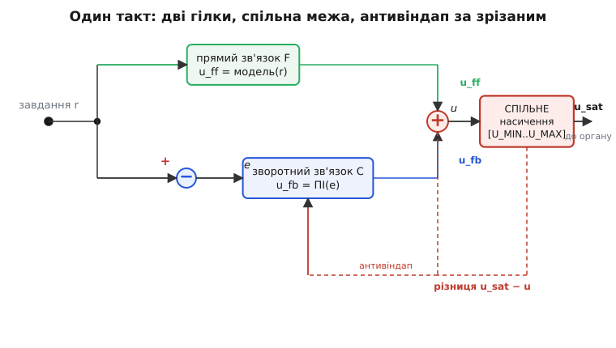
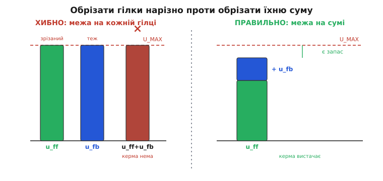

# ⚙️ Прямий плюс зворотний зв'язок: скелет прошивки на два ступені свободи

Ми вже дійшли до головного архітектурного висновку: «розімкнене проти замкненого» — хибна дилема, і найкраще керування бере **обидва** способи одразу. Передбачувану частину роботи рахує наперед **прямий зв'язок** (feedforward) з моделі об'єкта, а непередбачений лишок ловить **зворотний** (feedback). Формула гранично проста — повний вплив є сумою двох гілок:

```
 u = u_ff + u_fb
```

Але між цією однорядковою ідеєю та кодом, що надійно літає на реальному залізі, лежить прірва дрібних, підступних деталей. Де ставити межу насичення — на кожній гілці чи на сумі? Як узгодити з цією межею захист від накручування інтеграла, коли частину впливу дає гілка, якої інтегратор навіть не бачить? Що станеться з вихідним ривком, коли оператор перемкне режим? І чому дві гілки, кожна начебто правильна поодинці, разом дають нісенітницю через одну сплутану одиницю?

Ця вставка — **робочий скелет прошивки** на два ступені свободи, доведений до рівня, який можна класти в апарат. Ми зберемо один такт керування цілком: обчислення `u_ff` з моделі об'єкта, обчислення `u_fb` з ПІ-регулятора, підсумовування, **спільну** межу насичення на сумі й **узгоджений із нею** антивіндап, що інтегрує за фактичним, обрізаним впливом. А тоді розберемо три пастки, у які провалюється майже кожна перша реалізація: подвійне обрізання, стрибок на перемиканні режимів і неузгодженість одиниць між гілками. Код — реальний C, придатний для мікроконтролера; жодного псевдокоду.

## Задача, поставлена точно

Візьмімо конкретний, наскрізний приклад, щоб не розмивати думку абстракціями. **Нагрівач тримає температуру рідини на завданні.** Виконавчий орган — нагрівальний елемент, керований [широтно-імпульсною модуляцією](book:programming/pwm-on-mcu): вплив `u` — це потужність від 0 (вимкнено) до `U_MAX` (повна потужність). Давач міряє температуру `y`. Завдання — `r`.

Об'єкт тут має дві прості, добре відомі властивості, і саме на них стоятиме прямий зв'язок:

- **Стала втрата тепла.** Гаряча рідина віддає тепло в довкілля тим швидше, чим більша різниця з кімнатою; у грубій моделі потужність, потрібна лише для **утримання** температури `r`, приблизно `k_loss · (r − T_room)`. Це фонова робота, яку треба робити **завжди**, поки тримаємо `r`, — і вона цілком передбачувана.
- **Теплоємність.** Щоб **підняти** температуру швидше, треба додати потужності зверх фонової — приблизно `C_th · (dr/dt)`, пропорційно тому, як швидко ми хочемо гнати завдання вгору. Це передбачувана робота на **зміну** завдання.

Обидві складові — з моделі, обидві можна порахувати наперед, не чекаючи, поки з'явиться помилка. Це і є кандидати в прямий зв'язок. Усе, що модель не вгадає, — неточність коефіцієнтів `k_loss` і `C_th`, відкрита кришка, протяг із вікна, інша партія рідини — лишиться на зворотний зв'язок.

> 🔧 **Навіщо це.** Перш ніж писати бодай рядок регулятора, випишіть **модель утримання**: скільки впливу треба, щоб об'єкт просто **стояв** на завданні проти відомих сталих сил (втрати тепла, вага проти тяги, тертя проти моменту). Це і є ядро прямого зв'язку, і воно майже завжди відоме бодай грубо. Хто цей крок пропускає, той навантажує всю фонову роботу на інтеграл зворотного зв'язку — а той візьме її повільно, через накопичення помилки, замість подати вмить.

## Ідея: розділити передбачуване й непередбачуване

Суть, яку ми вивели в статті-власнику, повторимо стисло, бо весь код виростає саме з неї. Прямий зв'язок і зворотний **діляться роботою за характером задачі**, а не за пристроєм:

Прямий зв'язок б'є по завданню **без затримки контуру** — він не чекає, поки давач помітить помилку, а рахує потрібний вплив прямо із завдання й моделі та подає його тієї ж миті. Тому апарат кидається виконувати нову команду вмить, а не повзе до неї. Але прямий зв'язок **сліпий**: він діє за моделлю, а модель неточна, тож сам він завжди трохи (а то й сильно) промахується — і про збурення не знає взагалі.

Зворотний зв'язок робить те, що вміє найкраще, — **ловить лишок**. Оскільки прямий зв'язок уже зробив основну, велику, передбачувану частину, зворотному лишається **маленька** помилка: тільки те, що модель не вгадала, плюс непередбачені збурення. А маленька помилка — це і менший сталий зсув, і слабше накручування інтеграла, і дальше розгойдування. Зворотний зв'язок працює в набагато легшому, чистішому режимі, ніж коли б тягнув усю задачу сам.


*Скелет одного такту. Завдання r іде двома шляхами: верхній — прямий зв'язок F, що з моделі об'єкта одразу рахує u_ff; нижній — зворотний контур C, що діє на помилку e і дає u_fb. Їхня сума u проходить **одну спільну** межу насичення на діапазон [U_MIN..U_MAX] і стає реальним впливом u_sat. Пунктирна червона петля — антивіндап: зрізана межею різниця (u_sat − u) вертається в інтегратор, щоб він накопичував за **фактичним**, а не за бажаним впливом.*

Ключове рішення, від якого залежить уся коректність, видно вже з малюнка: **межа насичення стоїть одна, на сумі**, а не на кожній гілці окремо. І антивіндап зворотної гілки прив'язаний саме до цієї спільної межі — інтегратор мусить бачити, скільки з **повного** впливу реально дійшло до органу, а не скільки просив він сам. Чому інакше не можна — розберемо в пастках; спершу зберемо код, що робить правильно.

## Робочий скелет: один такт цілком

Зберемо все в одну функцію такту. Вона викликається таймером рівно раз на `dt` секунд — та сама дискретна структура «виміряй → порахуй → вплинь», [прив'язана до фіксованого періоду](book:algorithms/discrete-pid), тільки тепер обчислення розпадається на дві гілки й спільне насичення. Почнемо зі стану й параметрів, тоді сам такт.

```c
#include <stdint.h>
#include <stdbool.h>

// ── параметри об'єкта (модель для прямого зв'язку) ────────────────────────
// Усі — у ФІЗИЧНИХ одиницях впливу (тут: частка потужності 0..1).
static const float K_LOSS  = 0.018f;   // частка потужн. на 1 °C різниці з кімнатою
static const float C_TH    = 4.0f;     // частка потужн. на 1 (°C/с) підйому завдання
static const float T_ROOM  = 22.0f;    // температура довкілля, °C

// ── параметри зворотного ПІ-регулятора ───────────────────────────────────
// Kp, Ki теж дають вплив у ЧАСТКАХ потужності на 1 °C помилки — див. пастку 3.
static const float KP = 0.05f;         // [частка потужн. / °C]
static const float KI = 0.004f;        // [частка потужн. / (°C·с)]
static const float TT = 30.0f;         // час відстеження антивіндапу, с (≈ Ti)

// ── межі виконавчого органу (СПІЛЬНІ для суми) ────────────────────────────
static const float U_MIN = 0.0f;       // нагрівач не вміє «охолоджувати»
static const float U_MAX = 1.0f;       // повна потужність = 1.0

// ── стан контуру (те, що переживає між тактами) ───────────────────────────
static float integ    = 0.0f;          // накопичувач інтеграла (у частках потужн.)
static float r_prev   = 0.0f;          // завдання минулого такту — для dr/dt
static bool  was_active = false;       // чи контур був активний торік

static inline float clampf(float x, float lo, float hi) {
    return x < lo ? lo : (x > hi ? hi : x);
}
```

Тепер сам такт. Кожен крок прокоментовано; звертайте увагу на порядок — він тут не випадковий.

```c
// r      — завдання (setpoint), °C
// active — чи контур зараз керує (armed / auto). Розберемо в пастці 2.
// викликається рівно раз на dt секунд (напр. 10 Гц → dt = 0.1)
float control_tick(float r, bool active, float dt) {
    float y = read_temp();                 // 1) вибірка: миттєвий вимір виходу
    float e = r - y;                       // 2) помилка e = r − y

    // Контур не активний — тримаємо орган у спокої, борг не копиться, і
    // на НАСТУПНИЙ активний такт готуємо чистий старт (пастка 2).
    if (!active) {
        integ  = 0.0f;                     // «холодний» інтеграл
        r_prev = r;                        // щоб перший dr/dt був 0, не стрибок
        was_active = false;
        return U_MIN;                      // орган у безпечний спокій
    }
    // Перший такт після активації: синхронізуємо r_prev тут-таки, аби похідна
    // завдання не дала сплеску прямої гілки на ребрі cold → active (пастка 2).
    if (!was_active) r_prev = r;

    // 3) ПРЯМИЙ ЗВ'ЯЗОК: потрібний вплив із моделі, наперед, без помилки.
    //    Частина «утримання» проти втрат + частина «розгону» на зміну завдання.
    float dr_dt   = (r - r_prev) / dt;     // швидкість зміни завдання
    float u_ff    = K_LOSS * (r - T_ROOM)  // фонова потужність проти тепловтрат
                  + C_TH   * dr_dt;        // додаток на активний підйом завдання
    r_prev = r;

    // 4) ЗВОРОТНИЙ ЗВ'ЯЗОК: пропорційна частина + інтеграл (стан integ).
    float u_fb    = KP * e + KI * integ;   // ПІ на помилку-лишок

    // 5) ПІДСУМОВУВАННЯ обох гілок — ДО насичення.
    float u       = u_ff + u_fb;           // повний бажаний вплив

    // 6) СПІЛЬНА межа насичення — ОДНА, на сумі. Це реальний вплив на орган.
    float u_sat   = clampf(u, U_MIN, U_MAX);

    // 7) АНТИВІНДАП зворотним перерахунком, узгоджений зі спільною межею:
    //    у накопичувач іде не лише e, а й зрізана різниця (u_sat − u).
    //    Поки насичення нема, u_sat == u, різниця нуль — звичайний інтеграл.
    //    Коли межа зрізала суму, різниця «здуває» integ, аж поки регулятор
    //    не проситиме рівно стільки, скільки орган (разом із u_ff) може дати.
    integ += (e + (u_sat - u) / TT) * dt;

    was_active = true;
    set_heater(u_sat);                     // 8) утримання: u_sat діятиме весь dt
    return u_sat;
}
```

Розберемо, чому такт саме такий, крок за кроком — бо кожне рішення тут захищає від конкретної хвороби.

**Прямий зв'язок рахується із завдання, не з помилки** (крок 3). `u_ff` не містить `y` взагалі — це чисто розімкнена гілка з моделі. Тому вона діє **вмить**: змінили `r` — і `u_ff` тієї ж миті підскочив на `K_LOSS·(r − T_room)`, не чекаючи, поки давач помітить розбіжність. Додаток `C_TH · dr/dt` спрацьовує лише **під час** зміни завдання (коли `dr/dt ≠ 0`): він дає поштовх потужності на розгін, а коли завдання завмерло, зникає, лишаючи саму фонову складову утримання.

**Сума — до насичення** (крок 5). Ми складаємо `u_ff + u_fb` **перш ніж** обрізати. Це і є «спільна межа на сумі»: орган фізично може віддати лише один сумарний вплив від 0 до `U_MAX`, і саме цю суму треба тримати в межах. Обрізати гілки поодинці — груба помилка, до якої повернемось.

**Насичення одне** (крок 6). `u_sat` — це те, що **реально** піде в залізо. Уся подальша логіка (антивіндап) орієнтується саме на `u_sat`, бо об'єкт відчує рівно його, а не бажане `u`.

**Антивіндап бачить повний вплив** (крок 7). Ось найтонше місце всієї конструкції. Інтегратор — частина **зворотної** гілки, але зрізає суму **спільна** межа, куди входить і `u_ff`. Тож різницю `(u_sat − u)`, яку відрізала межа, треба повернути саме в цей інтегратор — і тоді він накопичує за **фактично поданим** впливом. Механізм [зворотного перерахунку](root:embedded/integral-control/detail) тут той самий, що в чистому ПІ, тільки `u` включає обидві гілки: поки суми вистачає (`u_sat == u`), різниця нуль і інтеграл живе звичайно; щойно сума вперлась у межу — різниця стає ненульовою й тягне `integ` назад, доки регулятор не просить рівно те, що орган (разом із фоновим `u_ff`) здатен дати.

**Порядок операцій жорсткий.** Спершу обчислили обидві гілки, тоді суму, тоді обрізали суму, і лише тоді, знаючи зрізане, оновили інтеграл. Оновити інтеграл **до** насичення — значить втратити інформацію про те, скільки впливу реально дійшло, і антивіндап осліпне. Тому інтеграл оновлюємо **останнім**, уже з `u_sat` на руках.

**Числова перевірка одного такту.** Нехай `r = 80 °C`, кімната 22 °C, завдання щойно застигло (`dr/dt = 0`), а рідина ще холодна, `y = 40 °C`. Подивимось, що видасть такт при `integ = 0` (щойно ввімкнули):

```
 u_ff = 0.018·(80 − 22) + 4.0·0        = 1.044          (сама фонова складова)
 e    = 80 − 40                        = 40 °C
 u_fb = 0.05·40 + 0.004·0              = 2.0            (пропорційна частина)
 u    = 1.044 + 2.0                    = 3.044          (бажане — далеко за межу)
 u_sat= clampf(3.044, 0, 1.0)         = 1.0            (орган на повну)
 integ += (40 + (1.0 − 3.044)/30)·0.1 = (40 − 0.068)·0.1 ≈ 3.993
```

Дивимось, що сталося. Бажаний вплив 3.044 утричі перевищив повну потужність — орган пішов на стелю (`u_sat = 1.0`), і це правильно: холодну рідину гріємо на максимум. Інтеграл **майже** не накрутився: замість наївного `+40·0.1 = +4.0` він додав лише `≈3.993`, бо доганяльний член `(u_sat − u)/TT` уже почав його стримувати. Що довше орган стоятиме на стелі, то сильніше цей член гальмуватиме накопичення — і windup не рознесе інтеграл, поки рідина повільно гріється. А `u_ff = 1.044` наперед підказало: навіть сама фонова потужність утримання вже перевищує повну — тобто на завдання 80 °C цьому нагрівачу вистачить рівно на межі, запасу на швидкий розгін катма. Таку діагностику прямий зв'язок дає **безкоштовно**, ще до першого польоту.

> 🔧 **Навіщо це.** Запам'ятайте цей кістяк такту як шаблон: **виміряй → u_ff з моделі → u_fb з ПІ → сума → одна межа на сумі → антивіндап за зрізаним → утримання**. Він однаковий, чим би ви не керували; міняється лише вміст `u_ff` (модель об'єкта) і `controller_step` (P, PI чи PID). Найчастіша поломка початківця — переставити кроки 6 і 7 (оновити інтеграл до насичення) або поставити межу не там; обидві дають контур, що начебто працює на столі, але зривається на першому великому кидку.

## Складність і три пастки

Скелет вище короткий, але кожен його рядок — це загачена пастка. Розберемо три, які найчастіше валять реалізацію на два ступені свободи; усі три «плавають» і жахливо ловляться на живому залізі, тож закладати захист треба в код одразу.

### Пастка 1: подвійне обрізання гілок

Найспокусливіша помилка — обрізати кожну гілку окремо: `u_ff` затиснути в межі, `u_fb` затиснути в межі, а тоді скласти. Виглядає симетрично й «безпечно», але руйнує саму ідею двох ступенів свободи.


*Чому межа мусить стояти на сумі. Ліворуч (хибно): кожну гілку обрізали до U_MAX окремо. Прямий зв'язок сам собою впирається в стелю — і зворотному вже нема куди додати вплив, керування «мертве» на насиченні. Праворуч (правильно): межа одна, на сумі; u_ff займає свою частку, u_fb додається зверху, і поки сума під стелею, зворотний зв'язок повноцінно керує. Обрізати треба суму, а не гілки.*

Розберемо механізм на числах. Нехай `u_ff = 0.9` (майже повна потужність на утримання), а зворотний зв'язок хоче **зменшити** вплив, бо перегрів: `u_fb = −0.3`. Правильна сума — `0.9 + (−0.3) = 0.6`, цілком у межах, орган трохи скидає потужність. А тепер погляньмо, що дає обрізання гілок:

```
 ПРАВИЛЬНО (межа на сумі):
   u      = 0.9 + (−0.3)        = 0.6
   u_sat  = clampf(0.6, 0, 1)   = 0.6      ← орган скидає потужність, як просили

 ХИБНО (межа на кожній гілці):
   u_ff_c = clampf(0.9,  0, 1)  = 0.9      (у межах, без змін)
   u_fb_c = clampf(−0.3, 0, 1)  = 0.0      ← мінус ЗРІЗАНО межею [0..1]!
   u      = 0.9 + 0.0           = 0.9      ← орган НЕ скинув — перегрів триває
```

Обрізання зворотної гілки до `[0..1]` **з'їло від'ємне виправлення** — саме те, чим зворотний зв'язок мав погасити перегрів. Гілки поодинці не мають фізичного сенсу: `u_fb` — це **поправка** до `u_ff`, вона законно буває від'ємною, навіть коли фізичний вплив (сума) лишається додатним. Межа `[U_MIN..U_MAX]` — властивість **органу**, а орган відчуває лише суму; накладати цю межу на гілку, що фізичним впливом і не є, — категорична помилка одиниць і сенсу.

Наслідок ще й у тому, що ламається антивіндап. Якщо гілки зрізані нарізно, ви більше не знаєте, скільки з **повного** впливу реально зрізала фізична межа, — а без цієї різниці зворотний перерахунок не має що повертати. Тому правило тверде: **гілки складають вільно, у повному діапазоні знаків і величин, і лише їхню суму притискають до єдиної межі органу**. Саме так у скелеті: `u = u_ff + u_fb` без жодного затиску, і `clampf` рівно один раз — на `u`.

> 🔧 **Навіщо це.** Затиск `clampf` у контурі на два ступені свободи має бути **рівно один** — на сумі, безпосередньо перед подачею в орган. Побачили в коді `clamp` на `u_ff` чи на `u_fb` окремо — це майже напевно баг: він тихо викидає законні від'ємні поправки й ламає антивіндап. Виняток буває один: якщо конкретна гілка має **власне** фізичне обмеження (скажімо, прямий зв'язок навмисне не має права просити більше за якусь безпечну частку) — але це вже інша, свідома межа за іншим критерієм, а не дублювання межі органу.

### Пастка 2: стрибок на перемиканні режимів (bumpless)

Реальний апарат постійно перемикає режими: ручний ↔ автоматичний, зброєння, зміна польотного режиму, аварійне повернення. Наївний контур на два ступені свободи дає при кожному перемиканні **ривок виходу** — і з двома гілками пасток тут дві, а не одна.

Перша — **старий борг інтеграла**, та сама, що в чистому ПІ. Якщо контур довго стояв неактивним, а помилка весь цей час трималася, і ви лишили інтегрування ввімкненим, накопичувач набив величезне значення, як при windup, — і в мить активації воно вистрелить вихід. Тому в скелеті гілка `if (!active)` **обнуляє** `integ`: поки контур не керує, борг не копиться. Це найгрубіший, але надійний захист для випадку «ввімкнення з холодного стану».

Друга пастка тонша й характерна саме для двох ступенів свободи. Уявіть [безстрибковий перехід](root:embedded/integral-control/detail) із ручного режиму, де оператор сам задавав повний вплив `u_manual`, в автоматичний. Ми хочемо, щоб у першу мить автомат видав **рівно** те, що видавала рука, — інакше механіку смикне. Але тепер повний вплив складається з **двох** гілок, і `u_ff` у першу мить уже дає свою частку сам. Тож преднавантажувати треба лише **інтеграл**, і саме на ту частину, якої не покрили `u_ff` і пропорційний член:

```c
// перехід ручний → авто без стрибка, з урахуванням ОБОХ гілок.
// хочемо, щоб у першу мить: u_ff + KP·e + KI·integ == u_manual
void bumpless_arm(float r, float u_manual, float dt) {
    float y = read_temp();
    float e = r - y;

    float dr_dt = (r - r_prev) / dt;
    float u_ff  = K_LOSS * (r - T_ROOM) + C_TH * dr_dt;   // те саме, що в такті

    // преднавантажуємо інтеграл на ЛИШОК, який не дали ні u_ff, ні KP·e:
    integ = (u_manual - u_ff - KP * e) / KI;

    r_prev = r;
    was_active = true;
}
```

Різниця з чистим ПІ — рівно в тому, що ми **віднімаємо `u_ff`** перед діленням. Якби ми преднавантажили інтеграл як `(u_manual − KP·e)/KI` (формула для одногілкового ПІ), автомат у першу мить видав би `u_ff + u_manual` — тобто на `u_ff` **більше**, ніж давала рука. Вийшов би стрибок рівно на величину прямого зв'язку — часто чималий. У доброму коді неактивний контур **увесь час** тримає інтеграл у стані «якби я був активний зараз, я разом із u_ff видав би поточний вихід» — тоді будь-яке перемикання безстрибкове за побудовою, і окрема `bumpless_arm` навіть не потрібна.

Є й зворотний бік симетрії, про який легко забути: `r_prev`. Похідна завдання `dr/dt` у прямому зв'язку рахується як `(r − r_prev)/dt`. Якщо контур щойно ввімкнувся, а `r_prev` лишилося з давнього минулого (або нуль), перший `dr/dt` вийде абсурдно великим — і `C_TH · dr/dt` дасть різкий сплеск `u_ff` на першому ж такті. Тому в скелеті `r_prev` оновлюється й у гілці підготовки: на старті `dr/dt` має бути нуль, а не стрибок від старого значення. Це дрібниця на один рядок, але без неї бездоганний антивіндап однаково пропустить ривок — тільки вже з боку прямої гілки.

> 🔧 **Навіщо це.** Пропишіть у логіці контуру на два ступені свободи **три дії на межах режимів**: (1) при першій активації з холодного стану — обнулити `integ`, щоб не вистрелив борг; (2) при перемиканні з іншого джерела впливу — преднавантажити `integ` під поточний вихід, **не забувши відняти `u_ff`**; (3) синхронізувати `r_prev` із поточним `r`, щоб перший `dr/dt` не дав сплеску прямої гілки. Пропустите (1) — смикне на старті; (2) — смикне на кожній зміні режиму; (3) — смикне пряма гілка на першому такті. Усі три «плавають» і ловляться лише в русі.

### Пастка 3: неузгоджені одиниці двох гілок

Найпідступніша пастка не дає ні аварії на столі, ні очевидного стрибка — вона тихо руйнує баланс двох гілок, і апарат просто «якось не так» тримає завдання. Причина в тому, що `u_ff` і `u_fb` **складаються**, а отже **мусять бути в тих самих фізичних одиницях впливу**. Якщо модель прямого зв'язку рахує в одних одиницях, а коефіцієнти регулятора налаштовані під інші, сума — беззмістовна.

Розберемо на нашому нагрівачі. Вплив `u` — це **частка потужності** від 0 до 1. Тоді:

```
 u_ff = K_LOSS·(r − T_room)   мусить давати ЧАСТКУ потужності
        → [K_LOSS] = частка потужн. / °C

 u_fb = KP·e + KI·integ       мусить давати ту саму ЧАСТКУ потужності
        → [KP] = частка потужн. / °C,   [KI] = частка потужн. / (°C·с)
```

Обидві гілки віддають частку потужності на градус — одиниці збігаються, сума має сенс. А тепер типова помилка. Припустимо, регулятор писали окремо, і його вихід задумали у **ватах** (бо «природно» думати про нагрівач у ватах), а прямий зв'язок — у частках. Тоді:

```
 u_ff  ~ 0.6            (частка потужності, 60 %)
 u_fb  ~ 480            (вати!)
 u     = 0.6 + 480 = 480.6   ← нісенітниця: складаємо частку з ватами
```

Сума 480.6 не значить нічого. Після `clampf(480.6, 0, 1)` вона обернеться на глухе `1.0` — орган назавжди на стелі, контур мертвий, а на осцилографі «нагрівач чомусь завжди на повну». Помилка не в логіці й не в математиці — у **розмірності**: дві гілки говорять різними мовами, а їх складають.

Той самий клас пастки чигає й тонше — у **масштабі** самого впливу. Якщо один інженер вважає `U_MAX = 1.0` (частка), а інший, пишучи прямий зв'язок, — `U_MAX = 100` (відсотки), то `u_ff` вийде у сто разів більшим за `u_fb`, зворотна гілка стане пилинкою на тлі прямої, і контур перестане реагувати на збурення, хоч кожна гілка «правильна» у своїй системі. Це рідня тієї ж хвороби узгодження, що й у [вихідному каскаді керма й моторів](root:embedded/output-mixing), де сплутаний масштаб чи одиниця виходу так само тихо ламає апарат.

Лікується це не хитрощами, а **дисципліною**: обрати **одну** фізичну одиницю впливу для всього контуру (тут — частка потужності 0..1), звести до неї `U_MIN`, `U_MAX`, вихід прямого зв'язку **й** коефіцієнти регулятора, і виписати цю одиницю коментарем біля кожної константи — рівно як у скелеті, де над кожним блоком стоїть «у частках потужності». Найнадійніша перевірка — **розмірнісна**: подумки припишіть одиницю кожному коефіцієнту й переконайтесь, що обидві гілки дають однакову одиницю на виході. Якщо `K_LOSS·°C` і `KP·°C` дають одне й те саме — гілки сумісні; якщо ні — сума беззмістовна ще до всякого запуску.

> 🔧 **Навіщо це.** Перше, що зробіть у контурі на два ступені свободи, — **прибийте одну одиницю впливу** і зведіть до неї геть усе: межі органу, вихід моделі, коефіцієнти регулятора. Симптом порушення характерний: контур або назавжди впирається в межу (одна гілка на порядки більша), або взагалі не реагує на збурення (зворотна гілка загубилась на тлі прямої). Це не ловиться налаштуванням коефіцієнтів — лише перевіркою розмірностей. Один рядок-коментар з одиницею біля кожної константи економить дні полювання на «чому воно тримає завдання абияк».

## Що зібралося

Ми зібрали робочий скелет керування на два ступені свободи — і побачили, що вся його коректність тримається на кількох рішеннях, кожне з яких захищає від конкретної біди. Прямий зв'язок рахує з моделі й **із завдання**, не з помилки, тож діє без затримки контуру й бере на себе всю передбачувану роботу. Зворотний зв'язок дістає **маленький** лишок і працює в легкому режимі. Дві гілки **складають вільно**, а межу органу накладають **одну, на суму** — бо орган відчуває лише суму, а гілки поодинці фізичного сенсу не мають. Антивіндап прив'язаний до цієї спільної межі: інтегратор накопичує за **фактично поданим** впливом `u_sat`, а не за бажаним `u`, тож насичення (навіть спричинене прямою гілкою) не рознесе накопичувач. А на межах режимів контур обнуляє або преднавантажує інтеграл **з урахуванням обох гілок** і синхронізує `r_prev`, щоб жодне перемикання нічого не смикнуло.

Три пастки, які ми розібрали, — подвійне обрізання, стрибок на перемиканні й неузгоджені одиниці — не екзотика, а рівно те, у що провалюється майже кожна перша реалізація. Спільне в них те, що всі три невидимі на столі з ідеальними числами й вилазять лише на живому залізі під великими кидками та зміною режимів. Тому захист від них — не прикраса поверх «справжнього» коду, а частина самого скелета: контур на два ступені свободи, написаний без них, працює рівно до першого серйозного збурення.

Головне ж, що цей код втілює архітектурний висновок усього шляху про зворотний зв'язок: **не крутити коефіцієнти сильніше, а зняти з зворотної гілки роботу, якої вона й не мусила робити**. Винесіть передбачуване в прямий зв'язок — і зворотному лишиться легша, чистіша задача, з меншою помилкою, меншим зсувом і більшим запасом стійкості. Це найдешевший спосіб різко поліпшити керування, і скелет вище — його готовий каркас: підставте свою модель об'єкта в `u_ff`, свій регулятор у `u_fb` — і решта вже стоїть.
